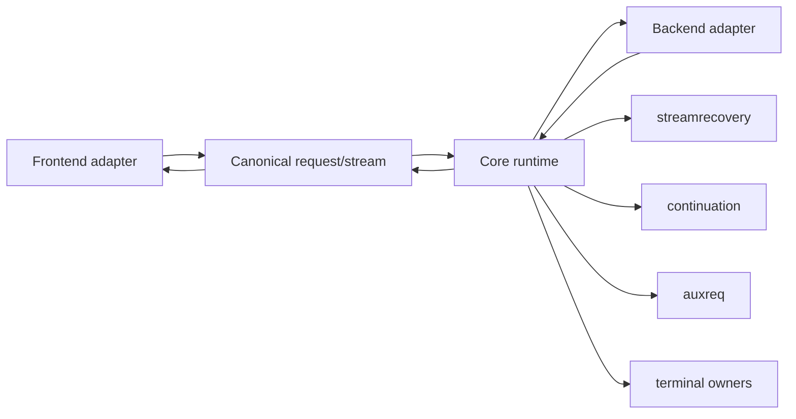
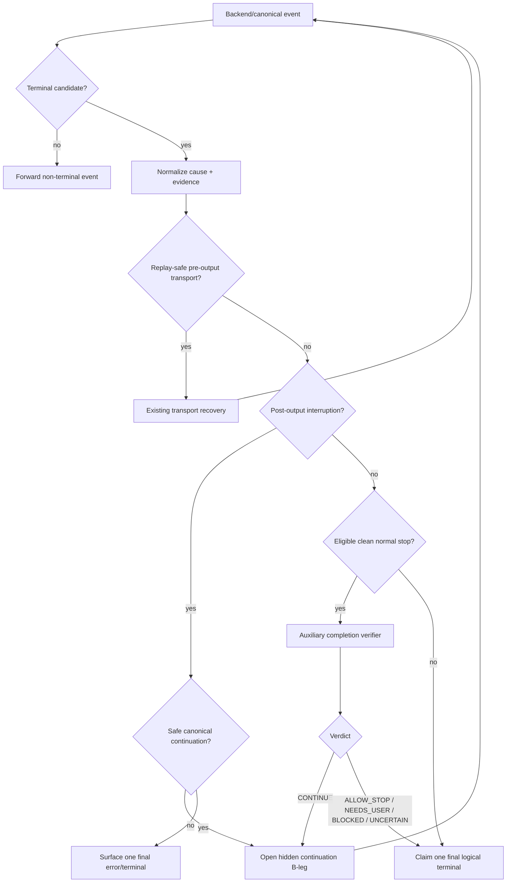
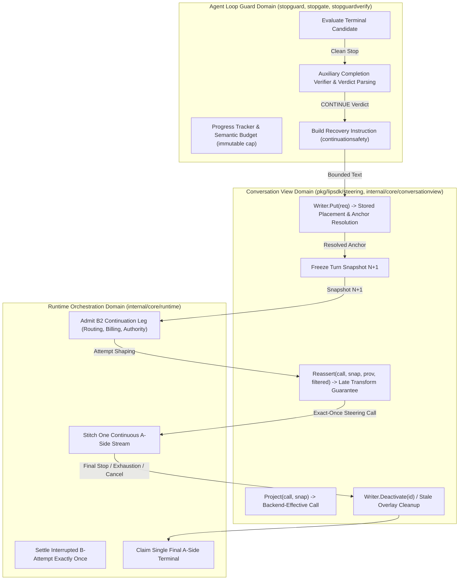
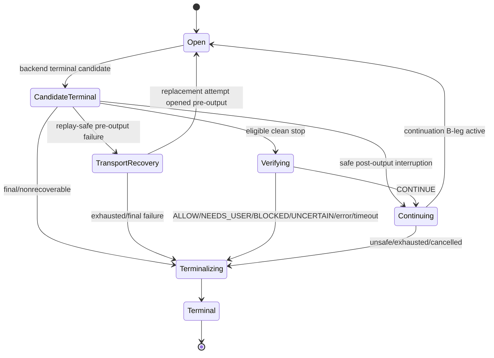
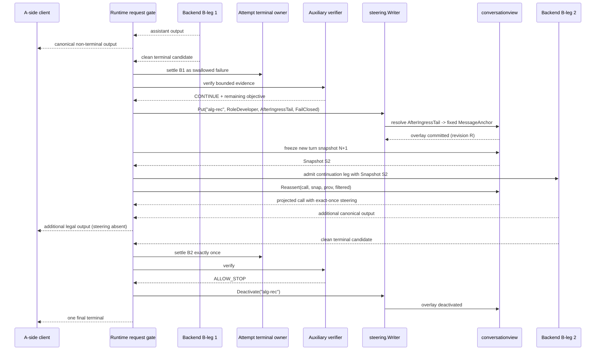
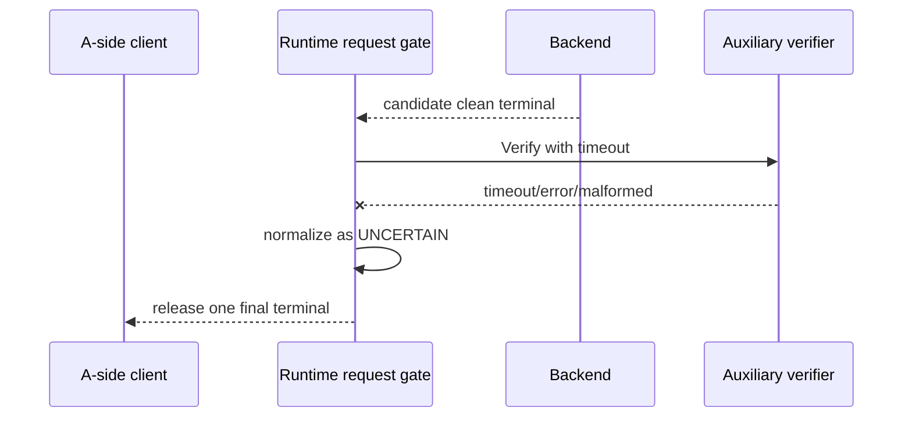

# Design Document

## Overview

Agent Loop Guard adds a request-level **provisional terminal gate** to Go-LIP. A backend attempt may finish, fail, or become idle, but the corresponding terminal is not automatically the final A-side terminal. The runtime first classifies the canonical cause. Replay-safe pre-output transport failures continue to use existing transport recovery. Post-output interruptions may preserve the already emitted trajectory and open a continuation leg. Eligible clean normal stops may be checked by a separate auxiliary completion verifier. Only the final allow/abort decision is allowed to terminalize the logical A-side request.

The key correctness rule is asymmetrical:

> It is better for an uncertain guard to let a genuine terminal through than to invent a new user request, approval, or side effect.

Therefore only a high-confidence `CONTINUE` verdict with a concrete, already requested remaining objective can create semantic continuation. `NEEDS_USER`, `BLOCKED`, `UNCERTAIN`, verifier failure, and verifier timeout all end normally.

### Goals

- Prevent recoverable backend stops from prematurely ending unattended client agent loops.
- Preserve existing pre-output transport recovery rather than duplicating it.
- Recover safely after committed output without replaying committed content or tool side effects.
- Verify eligible clean normal stops independently of the worker model's own finish marker.
- Keep recovery strictly within existing user intent and authority.
- Manage hidden recovery instruction lifecycle exclusively via canonical conversation-view steering overlays (`pkg/lipsdk/steering` and `internal/core/conversationview`).
- Preserve streaming-first behavior and canonical protocol legality.
- Maintain exactly-once request/attempt terminalization, B2BUA lineage, billing, authority, and observability.
- Bound latency, token/cost exposure, and repeated no-progress continuation.

### Non-Goals

- Generic agent orchestration, planning, goal management, or autonomous task discovery.
- Provider-specific stop policy in core.
- Silent post-commit retry/failover.
- Synthesizing user answers, permissions, choices, credentials, or approvals.
- Requiring explicit completion tools from all frontends.
- Replacing continuation storage, B2BUA, billing, routing, terminal ownership, or stream-recovery domains.
- Implementing the underlying conversation-view store and projection engine (already merged in PR #435 `b763a772`).

## Boundary Commitments

### This Spec Owns

- the request-level provisional-terminal decision boundary;
- canonical guard cause/evidence/action vocabulary;
- semantic completion-verifier contract and conservative verdict semantics;
- conditional hidden recovery instruction generation and formatting;
- steering overlay lifecycle coordination (`Put` on `CONTINUE`, turn snapshot freeze, deactivation on terminal/cancel/exhaustion/open-failure, and stale cleanup on external turn ingress);
- semantic continuation budget/no-progress policy;
- runtime orchestration that keeps one logical A-side response open across safe hidden B-side continuation legs;
- the extension of post-output stream-recovery outcomes needed to signal continuation eligibility instead of forced synthetic finish;
- guard-specific configuration and observability;
- acceptance/regression tests for false stop, false continuation, and conversation-view steering integration behavior.

### Out of Boundary

- transport retry/backoff/failover algorithms already owned by stream/recovery/routing;
- conversation-view store engine, snapshot projection, and reassertion mechanics (owned by `internal/core/conversationview`);
- provider adapter stop parsing except where normalized facts are missing;
- billing/authority/B2BUA business rules;
- frontend protocol rendering internals beyond using their existing canonical contract;
- generic auxiliary request orchestration;
- generic transcript/continuation persistence;
- future user-visible task/goal semantics.

### Allowed Dependencies

- canonical request/response/tool event model;
- `pkg/lipsdk/steering` and `internal/core/conversationview` (PR #435 canonical steering/view infrastructure);
- `internal/core/streamrecovery`;
- `internal/core/continuation` and `pkg/lipsdk/continuation`;
- `internal/core/auxreq` and `pkg/lipsdk/auxiliary`;
- current runtime request/attempt orchestration and B2BUA lineage;
- current `internal/core/terminal` / `pkg/lipsdk/terminal` ownership semantics;
- existing billing, metering, tracing, authority and extension hooks through their current interfaces;
- standard library only for guard policy unless an existing project dependency is already the canonical mechanism.

No new external library is required by the design.

### Revalidation Triggers

Re-run design validation if implementation changes:

- request-vs-attempt terminal ownership;
- output-commit semantics or the prohibition on post-commit retry/failover;
- canonical event/item identity or tool correlation;
- continuation lineage/materialization;
- auxiliary internal request visibility/recursion controls;
- B2BUA/billing/authority ownership for hidden legs;
- frontend explicit completion semantics;
- the presence of a first-class non-forwardable steering/control-content API.

## Architecture

### Existing Architecture Analysis

The current code already supplies the necessary domain owners but lacks a request-level completion gate:



Current `streamrecovery` already knows whether output was committed. Before output, it can request recovery. After output, it currently converts transport interruption into a synthetic `response_finished` with `proxy_stream_recovered`, which is safe from duplicate replay but still ends the A-side response. `terminal.Owner` correctly prevents retry/replacement after commitment. Continuation records already retain lineage and canonical trajectory. Auxiliary requests already provide the right internal child-model execution path.

The missing seam is therefore **between “backend attempt produced a terminal candidate” and “logical A-side request owns its final terminal.”**

### Selected Pattern: Provisional Terminal Gate



A terminal candidate is not itself a new mutable “owner.” It is evidence held by the request orchestration until an existing terminal owner is instructed to terminalize or a continuation action is selected.

### Project Boundary Questions

- **Core-owned or plugin-owned?** Core-owned. This controls canonical terminal publication and request lifecycle.
- **New canonical concept or provider behavior?** Private canonical policy/evidence/action types; no provider SDK types.
- **Streaming-first preserved?** Yes. Ordinary events continue immediately; only terminal publication is gated.
- **Retry after output preserved?** Yes. Post-output recovery is a new continuation leg, never a replay/replacement of the committed attempt.
- **Security/authority preserved?** Yes. Recovery never synthesizes user authorization and hidden legs traverse existing authority/billing paths.
- **Extension seam changed?** No new public plugin ABI is required for v1. Verifier execution uses existing auxiliary request plumbing.

## Canonical Guard Model

### Terminal Causes

`stopguard` owns a small provider-neutral cause vocabulary derived from already normalized facts. Exact enum names are implementation-private, but the design requires equivalent distinctions:

- `normal_end`
- `empty_normal_end`
- `provider_pause`
- `output_limit`
- `transport_eof_precommit`
- `transport_eof_postcommit`
- `idle_precommit`
- `idle_postcommit`
- `partial_tool_call`
- `refusal_or_filter`
- `client_cancel`
- `unknown_terminal`

The cause is not inferred from provider name. Provider adapters may supply normalized stop/capability facts through existing canonical mechanisms.

### Guard Evidence

The semantic verifier receives a bounded evidence projection, not unrestricted process state. Equivalent logical fields are:

```go
type Evidence struct {
    Cause                 Cause
    UserObjective         []CanonicalMessage
    RecentTrajectory      []CanonicalItem
    CandidateAssistant    []CanonicalItem
    ToolState             ToolCompletionState
    OutputCommitted       bool
    ExplicitCompletion    bool
    ContinuationLineage   ContinuationRef
    RecoveryAttempt       int
}
```

The actual implementation should reuse existing canonical item/message/continuation types rather than create duplicate transcript structures. Evidence projection should be bounded according to the same materialization/continuation constraints already used by the runtime.

### Verifier Verdict

The consumer-owned semantic boundary is intentionally richer than boolean:

```go
type Verifier interface {
    Verify(ctx context.Context, evidence Evidence) (Verdict, error)
}

type Verdict struct {
    Kind               VerdictKind
    Reason             string
    RemainingObjective string
}
```

`VerdictKind` has equivalent semantics to:

| Verdict | Meaning | Action |
|---|---|---|
| `ALLOW_STOP` | Existing requested work is complete | Release terminal |
| `CONTINUE` | Concrete in-scope work remains and needs no user input | Start bounded continuation |
| `NEEDS_USER` | Next step requires user response/permission/choice | Release terminal |
| `BLOCKED` | External block cannot be resolved autonomously | Release terminal |
| `UNCERTAIN` | Evidence insufficient or verifier cannot decide safely | Release terminal |

Only `CONTINUE` is continuation-authorizing. An error, timeout, malformed result, unknown enum, empty remaining objective, or verdict/evidence inconsistency is normalized to `UNCERTAIN`.

### Semantic Decision Policy

The pure policy layer evaluates already classified evidence and verifier result. It owns no provider calls, no auxiliary calls, no terminal mutation, and no stream I/O.

Representative actions:

- `forward_terminal`
- `delegate_preoutput_recovery`
- `continue_leg`
- `surface_failure`

This small action vocabulary prevents `stopguard` from becoming a second runtime/retry controller.

## Components and Ownership

| Component | Domain | Intent | Requirements | Key dependencies |
|---|---|---|---|---|
| Stop guard policy/evidence | `internal/core/stopguard` | Purely classify guard candidate/evidence/verdict into bounded action | 1, 2, 5–8 | canonical facts only |
| Progress tracker | `internal/core/stopguard` | Fingerprint material progress and enforce semantic budgets | 8, 12 | canonical trajectory digest |
| Transport recovery policy | existing `internal/core/streamrecovery` | Continue owning EOF/idle/pre-output replay decisions; expose post-output continuation eligibility | 2–4 | existing stream state |
| Semantic verifier adapter | core runtime adapter using `auxreq` | Run small internal completion check and parse structured verdict | 5–7, 11 | auxiliary client, canonical evidence |
| Continuation safety & recovery instruction | `internal/core/continuationsafety` | Evaluate post-output trajectory safety and build bounded `<automated-recovery>` instructions | 4, 6, 12 | canonical items, bounds |
| Conversation view steering port | `pkg/lipsdk/steering.Writer` / `internal/core/conversationview` | Authoritative storage, anchor resolution (`AfterIngressTail` -> `MessageAnchor`), snapshot creation, projection, reassertion, deactivation, and stale cleanup across Memory/SQLite/PostgreSQL | 6, 12 | conversationview store, A-leg resolver |
| Request orchestration gate | existing core runtime | Hold candidate logical terminal, settle B-attempt, orchestrate verifier/recovery, freeze turn snapshots, keep A request open | 1, 3–10, 12 | stopguard, streamrecovery, steering.Writer, terminal |
| Terminal owners | existing terminal/runtime | Remain exactly-once attempt/request terminal authority | 9 | CAS owners, settlement |
| Frontend canonical renderer | existing adapters | Render one legal logical response from canonical event stream | 10, 12 | canonical events |
| Telemetry hooks | existing observability paths | Record causes/verdicts/attempts/latency without content | 11 | metrics/tracing/accounting |

### Authority Map

To guarantee architectural integrity and prevent duplicate authorities, responsibilities are partitioned strictly across domains:



#### Domain Responsibility Boundaries

1. **Agent Loop Guard (`internal/core/stopguard`, `internal/core/stopgate`, `internal/core/continuationsafety`)**:
   - Owns terminal candidate classification, completion verifier execution, verdict normalization, progress fingerprinting, and recovery prompt formatting (`<automated-recovery>`).
   - Owns NO persistence, NO projection, NO message injection, NO direct `Call.Messages`/`Items` mutations, and NO I/O.
2. **Conversation View & Steering (`pkg/lipsdk/steering`, `internal/core/conversationview`)**:
   - Sole authority for hidden steering overlay persistence (in-memory, SQLite, PostgreSQL), visibility isolation (never backend to A-side), anchor resolution (`AfterIngressTail` -> fixed `MessageAnchor` on terminal user ingress message), snapshot creation, deterministic projection, candidate reassertion (`Reassert` via `OverlayProvenance`), overlay deactivation, and stale overlay cleanup.
   - Prohibits client frontend visibility or registration.
3. **Runtime Orchestration (`internal/core/runtime`, `turnTerminal`)**:
   - Binds authoritative A-leg scope and trajectory resolver to `steering.Writer` via `sdkadapter.NewWriter(store, aLegID, resolver)`. The trajectory resolver supplies the accepted user ingress request call (`identityBoundTurn.ingressCall` / preserved ingress trajectory) plus committed snapshot, preserving the terminal user message boundary.
   - On actionable `CONTINUE`: settles swallowed attempt B1, calls `steering.Writer.Put` with fixed `OverlayID("alg-rec")`, freezes new conversation-view snapshot N+1 for hidden model turn B2, carries snapshot/provenance/filtered baseline to B2 admission, executes `Reassert` before backend `Open`, and keeps the single logical A-side response open. Runtime single-active-request authority serializes requests on the same A-leg, preventing concurrent active ALG overlays.
   - On final terminal, cancellation, budget exhaustion, or open failure: executes `steering.Writer.Deactivate(ctx, "alg-rec")`.
   - On external turn ingress: deterministically cleans up any stale recovery overlay via `Deactivate(ctx, "alg-rec")` before freezing the new turn snapshot; `ErrOverlayNotFound` or inactive is treated as no-op success, and real persistence error fails closed.
4. **Single Authority Invariant**:
   - Direct append to `Call.Messages` or `Call.Items` is strictly prohibited.
   - Secondary hidden authorities (e.g. `turnTerminal.guardHidden`) are removed.

### `internal/core/stopguard`

Create a narrow policy package rather than expanding `streamrecovery` into semantic model orchestration.

Responsibilities:

- define canonical guard cause/verdict/action values;
- validate and normalize verifier results;
- enforce the “only concrete `CONTINUE` is actionable” rule;
- own semantic continuation attempt budget and no-progress fingerprint decisions;
- expose deterministic pure functions/services that are easy to table-test.

Non-responsibilities:

- backend/auxiliary I/O;
- canonical transcript persistence;
- terminal mutation;
- retry/failover selection;
- billing/authority;
- provider-specific finish interpretation.

This keeps policy portable and independently testable.

### `internal/core/streamrecovery`

Do not add semantic verification here. Extend only enough to distinguish the current post-output `finish` outcome from a **continuation-eligible interruption** when Agent Loop Guard requests that policy.

Current behavior remains the compatibility default. Conceptually, `PostOutputPolicy` gains an equivalent of `continue` or the runtime supplies an explicit higher-level mode that causes the policy to return a typed post-output interruption rather than synthesizing `response_finished`.

Rules:

1. pre-output recovery path remains unchanged;
2. default post-output behavior remains `finish` when Agent Loop Guard is disabled;
3. post-output continuation mode never labels itself retry/replacement;
4. unsafe canonical states return final failure/terminal, not replay.

### Auxiliary Completion Verifier

The runtime owns a narrow adapter implementing the `stopguard.Verifier` consumer interface using `auxreq.Client`.

Request properties:

- internal/detached auxiliary session;
- dedicated role such as `loop_guard` (exact role registration follows current auxiliary-role conventions);
- parent trace/A-leg/B-leg/branch lineage inherited;
- Agent Loop Guard disabled/suppressed for the verifier request to prevent recursion;
- reasoning disabled or minimized where the selected backend supports it, but correctness must not depend on that optimization;
- bounded timeout;
- no tools required by the verifier;
- structured, strictly parsed result.

The verifier prompt must be conservative. Core decision semantics must not depend on model-specific wording such as “please continue.”

#### Verifier instruction contract

The verifier should be told, in substance:

1. decide whether the already requested work is complete;
2. return `CONTINUE` only if it can name concrete unfinished work already requested by the user;
3. do not count optional ideas, user-owned next steps, offers of help, or future possibilities as unfinished work;
4. if the model needs any user answer/approval/permission/choice, return `NEEDS_USER`;
5. if evidence is insufficient, return `UNCERTAIN`;
6. output one structured verdict with a short bounded reason and optional remaining objective.

The worker model does not see raw verifier chain-of-thought; only the bounded reason/remaining objective needed for safe recovery is propagated.

### Conditional Hidden Recovery Instruction

The continuation message is an internal control instruction, not a fabricated user follow-up. Its semantics are normative even if exact formatting evolves:

```text
<automated-recovery>
This is an internal recovery instruction, not a new user request, approval,
or expansion of scope. The user has not sent a new message.

Re-read the existing user request and the work already completed.
If there is concrete unfinished work from that request that you can perform
without new user input, resume exactly that work from the last safe point.

If the requested work is already complete, DO NOT invent, repeat, broaden,
optimize, or discover additional work. End normally.

If the next step requires user input, permission, approval, or a choice,
do not assume it; end normally so the user can respond.

Recovery reason: [bounded verifier reason]
Remaining objective: [concrete remaining objective]
Attempt [current]/[maximum]
</automated-recovery>
```

#### Canonical Steering Registration

Recovery instructions are managed exclusively through the canonical conversation-view steering port (`pkg/lipsdk/steering.Writer`):

- **Writer construction**: explicitly constructed with authoritative A-leg scope and trajectory resolver via `sdkadapter.NewWriter(store, aLegID, resolver)`.
- **TrajectoryResolver contract**: The injected `TrajectoryResolver` MUST return the accepted USER INGRESS request call (`identityBoundTurn.ingressCall` or equivalent preserved ingress trajectory) plus current committed snapshot, NOT the post-B1 call ending in assistant output. This is strictly required because `ResolveAfterIngressTailAnchor` validates that the final complete message boundary in the trajectory is a `RoleUser` message (`ErrTerminalNotUser` is returned if the terminal message is assistant-authored). Anchoring after the ingress tail semantically positions the recovery instruction directly following the user's prompt turn prior to model execution.
- **Registration request**:
  ```go
  req := steering.PutRequest{
      OverlayID:           steering.OverlayID("alg-rec"),
      Message:             steering.Message{Role: lipapi.RoleDeveloper, Text: instr},
      Placement:           steering.AfterIngressTail,
      AnchorMissingPolicy: steering.FailClosed,
      Reason:              steering.ReasonCode("loop_guard_recovery"),
  }
  ```
- **Overlay ID binding**: Fixed identifier `steering.OverlayID("alg-rec")` within the authoritative A-leg scope. The underlying `SteeringStore` already partitions records by `aLegID`. Appending raw `aLegID` is invalid because `OverlayID` is bounded to 128 ASCII chars while `aLegID` can be up to 256 arbitrary bytes. Runtime request authority guarantees at most one active logical request per A-leg, preventing concurrent active ALG overlays. Raw A-leg IDs are never hashed or logged unnecessarily.
- **Anchor resolution**: `ResolveAfterIngressTailAnchor` resolves `AfterIngressTail` at `Put` time to a fixed `MessageAnchor` identifying the terminal forwardable user message from the accepted user ingress trajectory.
- **Fail closed**: if the terminal forwardable user message is absent, not user role, or snapshot-excluded, `FailClosed` policy aborts the continuation before backend execution.
- **Client isolation**: steering overlays are never echoed to the A-side stream, never exposed to client frontends, and never entered into frontend `ContinuationRecord` transcripts.

## State and Lifecycle

### Logical Request State



`CandidateTerminal`, `Verifying`, and `Continuing` are orchestration states for the **logical request**. Individual B-side attempts still terminalize independently through existing attempt owners.

### Attempt vs Logical Terminal Sequence

For a semantic premature stop:



There is no A-side terminal between B1 and B2.

### Snapshot Linearization and Turn Isolation

Each hidden semantic continuation represents a new internal model turn within the logical request:

1. **Turn 1 (Initial Ingress Turn)**: Runs with Snapshot $S_1$ frozen at request ingress. If attempt B1 finishes prematurely with a clean stop, B1 settles.
2. **Turn 2 (Hidden Continuation Turn)**: On `CONTINUE`, the runtime formats the bounded recovery instruction, calls `steering.Writer.Put`, and then freezes Snapshot $S_2$ (Snapshot $N+1$). Turn 2 executes using Snapshot $S_2$.
3. **Turn-Level Snapshot Invariant**: All candidate arms, routes, and retry attempts of Turn 2 share the exact same frozen Snapshot $S_2$. Already frozen snapshots ($S_1, S_2$) are immutable and must never be mutated.
4. **Late Attempt Reassertion**: Prior to opening any backend attempt for Turn 2, `conversationview.Reassert` restores the exact conversation view using `OverlayProvenance` and `FilteredBaseline`, guaranteeing that late candidate shaping or adapter transforms cannot duplicate, reposition, or discard the required steering overlay.

### Overlay Identity and Lifecycle Strategy

1. **Identity Strategy**: The runtime binds to the fixed request-scoped `OverlayID` (`steering.OverlayID("alg-rec")`) within the authoritative A-leg scope. The underlying `SteeringStore` partitions all overlay state per A-leg (`legs[aLegID].steering[overlayID]`), making A-leg ID prefixing redundant. Furthermore, prefixing raw A-leg IDs is invalid because `OverlayID` is bounded to 128 ASCII chars while `aLegID` can be up to 256 arbitrary bytes.
2. **Single-Active-Request Serialization Invariant**: Existing runtime request authority enforces that at most one active logical request executes on a given A-leg at any time. This invariant ensures that concurrent logical requests on the same A-leg cannot produce simultaneous active ALG recovery overlays. Raw A-leg IDs are never hashed or logged unnecessarily.
3. **Idempotent Updates**: If multiple continuation attempts occur within the same logical request (up to `MaxSemanticContinuations`), the runtime reuses the same fixed `OverlayID("alg-rec")`. `Writer.Put` updates the overlay revision only if the formatted instruction text changes; if identical, `Put` is a semantic no-op.
4. **Deactivation Points**: The recovery overlay is deactivated via `steering.Writer.Deactivate(ctx, "alg-rec")`:
   - when the logical request finishes with a normal terminal (`ALLOW_STOP`, `NEEDS_USER`, `BLOCKED`, `UNCERTAIN`);
   - when the client cancels the request;
   - when semantic continuation attempts are exhausted or circuit-broken;
   - when a continuation leg fails to open or pass admission.
5. **Absence from Lineage**: Deactivation ensures the overlay does not persist into subsequent user turns, preventing recovery instructions from polluting ongoing conversation history.

### Stale Overlay Cleanup on External Turn Ingress

If the server crashes, restarts, or terminates uncleanly during an active continuation leg, a recovery steering overlay could remain active in durable persistence (SQLite or PostgreSQL).

To guarantee that a stale recovery overlay never leaks into a subsequent user conversation turn:
- **Deterministic Cleanup Algorithm**: `SteeringStore` intentionally provides no prefix or pattern query API. Because the fixed ID `steering.OverlayID("alg-rec")` is used, on external turn ingress before freezing the initial turn snapshot, the runtime deterministically calls `Deactivate(ctx, "alg-rec")` (or checks `Snapshot.Steering` for active `"alg-rec"` before deactivation).
- **Idempotent / No-op Success**: If `Deactivate` returns `conversationview.ErrOverlayNotFound` or the overlay is already inactive, it is treated as a clean no-op success.
- **Fail Closed**: If `Deactivate` (or store persistence) encounters a real storage or database error, the new turn fails closed before taking its initial snapshot or contacting a backend.

### Failure Matrix and Candidate Rejection

| Failure Scenario | Guard / Steering Behavior | Outcome |
|---|---|---|
| Anchor missing / deleted (`AfterIngressTail`) | `FailClosed` policy triggers | Aborts continuation leg; emits controlled final failure/terminal |
| Candidate backend cannot represent `RoleDeveloper` | Candidate rejected via capability check | Fails candidate pre-open; attempts alternate candidate or fails closed |
| Candidate backend cannot represent required placement | Candidate rejected via capability check | Fails candidate pre-open; never silently drops or relocates steering |
| Steering store I/O error (`Put` / `Deactivate`) | `Writer` returns wrapped error | Fails closed before backend `Open` |
| Stale overlay cleanup failure on external turn | Ingress hook fails | Fails closed before new turn snapshot |
| Verifier timeout / parse error | `UNCERTAIN` verdict | Releases held terminal without continuation |

### Dependency Direction and Composition Seams

The architecture follows strict hexagonal dependency rules:
- `internal/core/stopguard` is a pure policy package (zero I/O, stdlib/lipapi only).
- `internal/core/continuationsafety` evaluates trajectory safety and formats instruction text.
- `internal/core/runtime` orchestrates the request lifecycle, constructing `steering.Writer` via `internal/core/conversationview/sdkadapter.NewWriter` and invoking `conversationview.Reassert`.
- `turnTerminal` coordinates terminal holds and deactivates overlays on terminalization without owning ad-hoc hidden fields.

### Explicit Prohibition on Direct `Call` Append

Direct appending of recovery instructions to `Call.Messages` or `Call.Items` (and reliance on secondary hidden fields such as `turnTerminal.guardHidden`) is explicitly prohibited. All hidden control content must be registered as a durable conversation-view steering overlay and injected solely through canonical snapshot projection and reassertion.

### Verifier Failure Sequence



The guard fails safe **toward stopping**, not toward autonomous continuation.

## Transport Recovery Matrix

| Condition | Output committed? | Guard action | Replay original attempt? |
|---|---:|---|---:|
| EOF/reset before meaningful output | No | Existing bounded pre-output recovery/failover | Allowed by existing policy |
| Empty/near-empty clean completion eligible for retry | No | Existing bounded discard/retry path | Allowed by existing policy |
| EOF/reset/idle after visible text | Yes | Preserve canonical trajectory; safe continuation leg if possible | **No** |
| Completed tool call + matching result, then stream fails | Usually yes | Preserve tool/result and continue from next logical point | **No; never re-execute completed side effect** |
| Incomplete tool arguments | Any committed unsafe state | Surface controlled final outcome unless provider-native resume can prove safety | **No blind replay/execution** |
| Provider-owned opaque/thinking state cannot be legally resumed | Yes | Surface controlled final outcome | No |
| Client cancellation | Any | Cancel/terminalize | No |
| Refusal/content filter | Any | Preserve explicit terminal | No |

Provider-native continuation may be used only through normalized continuation capability/evidence and must obey the same safety matrix.

## Safe Continuation Construction

The continuation builder uses existing continuation records rather than reconstructing a transcript from A-side bytes.

Required properties:

- preserve previous continuation ID and lineage;
- include canonical input/output items actually accepted/committed for the logical trajectory;
- preserve completed tool call/result correlation;
- preserve model/profile/route/provider-bound requirements when continuation policy requires them;
- avoid duplicating the synthetic internal recovery instruction into user-visible lineage;
- maintain materialization and chain-depth bounds;
- classify incomplete/failed prior attempt status accurately;
- create a new B-side leg with normal billing/authority/B2BUA ownership.

A continuation leg is new backend work, not a rewrite of the previous attempt. The logical A-side stream may remain open only if the frontend canonical renderer can legally represent the continued output.

## Semantic Candidate Scope

### Default v1 mode

When Agent Loop Guard is enabled, every eligible clean normal completion is semantically verified unless a stronger canonical exclusion applies (for example, a trusted explicit completion signal). The issue explicitly targets falsely clean terminal markers, so v1 does not add a wording-based `suspicious_only` heuristic prefilter. Such a mode can be considered later only after telemetry and a representative evaluation corpus demonstrate acceptable false-negative/false-positive behavior. A heuristic must never directly authorize continuation.

### Exclusions before verification

Do not spend a verifier call when canonical state already requires a non-semantic outcome, including:

- client cancellation;
- refusal/content filter;
- unresolved/partial tool boundary that cannot legally be completed by a new text turn;
- output-limit/truncation paths owned by a separate explicit continuation policy;
- provider pause/deferred states with an authoritative native resume contract;
- trusted explicit completion signal under `trust` policy.

## Configuration

Preserve the project's flat snake_case configuration style and current compatibility defaults. Exact validation code belongs to implementation, but the v1 surface should remain small:

| Setting | Default | Purpose |
|---|---|---|
| `agent_loop_guard_enabled` | `false` | Master opt-in; disabled preserves current behavior |
| `agent_loop_guard_verifier_role` | `loop_guard` | Auxiliary model role used for semantic completion checks |
| `agent_loop_guard_verifier_timeout_seconds` | `4` | Hard verifier deadline |
| `agent_loop_guard_max_semantic_continuations` | `3` | Per logical-request semantic continuation cap |
| `agent_loop_guard_no_progress_limit` | `2` | Repeated materially-equivalent recovery outcomes before breaker |
| `agent_loop_guard_explicit_completion_policy` | `trust` | `trust` or `verify` known explicit frontend completion signal |

Do **not** duplicate transport idle timeout, grace period, warning, retry, or failover configuration. Existing `stream_recovery_*` and routing/recovery settings continue to own transport behavior.

`UNCERTAIN -> ALLOW_STOP` is a safety invariant in v1, not a configuration toggle.

Validation rules should reject unknown enum values and non-positive verifier timeout/max-continuation values when the guard is enabled, using existing config error conventions.

## Progress and Circuit Breaking

### Progress fingerprint

A bounded digest should represent material canonical progress since the previous hidden continuation. It should incorporate stable normalized facts such as:

- candidate assistant output identity/content digest;
- canonical tool call name + normalized argument digest;
- tool result/error correlation digest;
- continuation record/status/lineage identifiers where stable;
- verifier verdict + remaining-objective digest;
- canonical item count/state transition.

Do not fingerprint volatile request IDs/timestamps alone; they would make identical no-progress loops look unique.

### Break conditions

Break hidden continuation when any of these occurs:

- maximum semantic continuation count reached;
- no-progress fingerprint repeats to configured limit;
- same completed tool/action/error cycle repeats without new useful state;
- verifier no longer returns actionable `CONTINUE`;
- client cancels/closes;
- continuation becomes protocol-unsafe;
- authority/routing/billing/runtime returns a final non-recoverable failure.

After the breaker, emit one authoritative final terminal/error. Never silently hang waiting for more backend activity.

## Frontend Explicit Completion Signals

Frontend profiles may expose a normalized explicit completion fact, for example an `attempt_completion`/finish action in an agent harness. Agent Loop Guard consumes only the normalized fact; it does not import frontend-specific tool names into core policy.

With `explicit_completion_policy = trust`:

- explicit completion bypasses semantic continuation for that clean stop;
- transport failures remain protected;
- if the explicit signal is malformed/incomplete according to frontend canonicalization, normal guard semantics apply.

With `verify`, the signal becomes strong evidence but still runs the verifier. The default `trust` minimizes false positives for harnesses with an explicit completion contract.

## Protocol-Safe A-Side Stitching

The runtime must never concatenate raw backend frames across B-side legs. Each backend adapter continues to produce canonical events/items. Runtime guard orchestration suppresses intermediate candidate terminals and emits only canonical non-terminal output plus the one final canonical terminal. The frontend adapter then renders that single logical stream according to its normal protocol contract.

Where a frontend protocol assigns response-level IDs/item indexes that cannot span multiple physical backend legs automatically, the canonical runtime must preserve the A-side logical identity and map new B-side canonical items through the existing frontend renderer. If a protocol cannot do so legally, the continuation is unsupported and the guard resolves to the final terminal/error rather than emitting malformed output.

## Terminal, Billing, and Authority Ownership

The feature does not change terminal CAS semantics.

For each swallowed B-side attempt:

1. classify terminal candidate;
2. settle that attempt exactly once with the correct typed outcome (for example, success, swallowed recoverable failure, or equivalent existing intent);
3. preserve usage/egress/billing/B2BUA evidence;
4. decide whether the **logical request** continues;
5. only the final guard decision may claim the logical request terminal.

A continuation B-leg follows normal route/authority/billing admission for new backend work. Agent Loop Guard cannot bypass budget, policy, authorization, or route constraints simply because it is automatic recovery.

The implementation should prefer existing terminal intent/outcome vocabulary where semantics are correct. Add a new typed terminal intent only if no existing value can represent a swallowed continuation leg without lying about its outcome; do not overload `gate_replacement` because post-output continuation is not replacement.

## Observability

Use existing metrics/tracing/logging infrastructure. Suggested bounded dimensions:

- `agent_loop_guard_candidate_total{cause}`
- `agent_loop_guard_verdict_total{verdict,role}`
- `agent_loop_guard_action_total{action,reason}`
- `agent_loop_guard_continuation_total{outcome}`
- verifier latency histogram;
- verifier usage/cost through normal accounting;
- no-progress breaker count;
- replay-suppressed count/reason;
- A/B lineage via existing trace identifiers.

Do not put assistant/user text, verifier reason text, recovery prompt text, tool arguments, or other unbounded/sensitive content into metric labels. Structured logs may contain bounded reason codes and IDs subject to existing logging/redaction policy.

## Error Handling

| Failure | Result |
|---|---|
| Verifier timeout/error/malformed output | `UNCERTAIN` → allow held terminal |
| Auxiliary depth/recursion guard hit | allow held terminal; record bounded diagnostic |
| Continuation materialization failure | surface final terminal/error; preserve committed output |
| New B-leg admission/routing failure | surface final failure through existing runtime semantics |
| Unsafe partial tool/opaque provider state | no replay; controlled final outcome |
| No-progress/attempt cap | one final terminal/error |
| Client cancellation at any guard stage | cancellation wins; abort verifier/continuation promptly |
| Terminal ownership conflict | existing owner result is authoritative; no duplicate A terminal |

## Testing Strategy

### Unit: Stop Guard Policy

Table-driven tests for:

- cause/action mapping;
- `CONTINUE` requires non-empty concrete remaining objective;
- every verifier error/unknown/malformed state normalizes to allowed stop;
- direct question / optional next step / complete answer cases do not authorize continuation;
- immediate announced action with missing corresponding trajectory can authorize continuation;
- budget/no-progress transitions;
- explicit completion `trust`/`verify` policy.

### Unit: Stream Recovery Integration

Extend current policy tests to prove:

- disabled/default post-output behavior remains `finish`;
- guard-enabled post-output interruption returns typed continuation eligibility rather than synthetic finish;
- pre-output recover decision unchanged;
- cancellation remains surface/final;
- no post-commit retry/replacement decision is introduced.

### Unit: Verifier Adapter

Use fake auxiliary client/runtime:

- exact internal role/visibility/lineage/plugin suppression;
- bounded deadline;
- strict structured verdict parsing;
- timeout/error/malformed -> `UNCERTAIN`;
- no tools exposed/required;
- reason/objective bounds;
- verifier request cannot recursively invoke Agent Loop Guard.

### Unit: Conditional Continuation Builder

Prove:

- instruction explicitly denies new user intent/approval/scope expansion;
- complete-work and needs-user branches are present;
- hidden instruction never appears in A-side transcript;
- completed tool/result state retained once;
- partial tool state rejected unless a normalized safe native-resume path exists;
- chain-depth/materialization limits respected.

### Integration / Runtime

Cover at minimum:

1. `“Let me run the tests next.”` + clean stop + no test action → verifier `CONTINUE`, no A terminal, continuation executes.
2. `“Done; tests pass.”` + clean stop → `ALLOW_STOP`, one A terminal.
3. complete summary + optional “Next steps” assigned to user → no continuation.
4. `“Would you like me to do X?”` → `NEEDS_USER`, no synthesized approval.
5. complete answer + `“I can also…”` → no continuation.
6. quoted `“I’ll continue”` → quotation alone does not continue.
7. pre-output EOF → existing recovery, no intermediate A terminal.
8. post-output EOF after text → no replay/duplicate; safe continuation when supported.
9. post-output EOF after completed tool+matching result → continue without tool re-execution.
10. EOF mid-tool args → no guessed execution/replay.
11. client cancel while verifier active → cancel wins; no hidden continuation.
12. verifier timeout/error → held terminal released.
13. repeated identical final output → no-progress breaker and exactly one terminal.
14. maximum semantic continuation budget → exactly one terminal/error.
15. trusted explicit completion → semantic verifier skipped/relaxed per policy.
16. unsupported A-side continuation capability → clean final fallback, no malformed stream.

### Unit: Conversation-View Steering Integration

Prove:

- `steering.Writer.Put` registers recovery instruction with fixed `OverlayID("alg-rec")` within authoritative A-leg scope, `RoleDeveloper`, `AfterIngressTail`, `FailClosed`, and `loop_guard_recovery` reason;
- `TrajectoryResolver` supplies the accepted user ingress request call (`identityBoundTurn.ingressCall` / preserved ingress trajectory) plus current committed snapshot;
- `ResolveAfterIngressTailAnchor` resolves `AfterIngressTail` to a fixed `MessageAnchor` for the terminal forwardable user message from the ingress trajectory, rejecting post-B1 calls ending in assistant output;
- `FailClosed` policy aborts continuation before backend if terminal user anchor is missing or excluded;
- hidden continuation freezes a new turn snapshot (Snapshot N+1), and all candidate attempts of that turn share it without snapshot mutation;
- `conversationview.Reassert` with `OverlayProvenance` and `FilteredBaseline` ensures exact-once steering injection after attempt shaping;
- `steering.Writer.Deactivate(ctx, "alg-rec")` is called on final A terminal, cancellation, budget exhaustion, or open failure;
- stale recovery overlays are deterministically cleaned up via `Deactivate(ctx, "alg-rec")` on subsequent external turn ingress before taking the turn snapshot, treating `ErrOverlayNotFound` or already inactive as no-op success and failing closed if a persistence error occurs;
- runtime single-active-request authority serializes logical requests and prevents simultaneous active ALG recovery overlays on the same A-leg;
- steering lifecycle behaves identically across Memory, SQLite, and PostgreSQL store implementations;
- candidates with unsupported role/placement capabilities are rejected via standard candidate adaptation without silent dropping or relocation.

### Integration / Runtime

Cover at minimum:

1. `“Let me run the tests next.”` + clean stop + no test action → verifier `CONTINUE`, no A terminal, `steering.Writer.Put` with `OverlayID("alg-rec")`, snapshot N+1 frozen, continuation executes.
2. `“Done; tests pass.”` + clean stop → `ALLOW_STOP`, `steering.Writer.Deactivate(ctx, "alg-rec")`, one A terminal.
3. complete summary + optional “Next steps” assigned to user → no continuation.
4. `“Would you like me to do X?”` → `NEEDS_USER`, no synthesized approval.
5. complete answer + `“I can also…”` → no continuation.
6. quoted `“I’ll continue”` → quotation alone does not continue.
7. pre-output EOF → existing recovery, no intermediate A terminal.
8. post-output EOF after text → no replay/duplicate; safe continuation when supported.
9. post-output EOF after completed tool+matching result → continue without tool re-execution.
10. EOF mid-tool args → no guessed execution/replay.
11. client cancel while verifier or continuation active → cancel wins; overlay deactivated; no hidden continuation.
12. verifier timeout/error → held terminal released; overlay deactivated.
13. repeated identical final output → no-progress breaker, overlay deactivated, and exactly one terminal.
14. maximum semantic continuation budget → overlay deactivated, exactly one terminal/error.
15. trusted explicit completion → semantic verifier skipped/relaxed per policy.
16. unsupported A-side continuation capability → clean final fallback, no malformed stream.
17. candidate backend cannot represent steering role/placement → candidate rejected pre-open; fail closed if no alternate candidate.
18. restart/reload with persistent store → stale recovery overlay cleaned up deterministically via `Deactivate(ctx, "alg-rec")` before next external turn snapshot.

### Race and Architecture Tests

- race verifier/terminal/cancel/close paths under `go test -race` for focused packages;
- assert no provisional terminal is rendered before final decision;
- assert one logical A terminal maximum;
- assert every B-leg settled once;
- assert zero direct append to `Call.Messages`/`Call.Items` in continuation logic;
- assert `turnTerminal.guardHidden` is removed and conversation-view steering is the single hidden-content authority;
- assert no core provider imports/checks are added to `stopguard`;
- assert no hidden recovery instruction becomes A-side user content or enters frontend `ContinuationRecord`s;
- assert no post-output action is classified as retry/replacement.

### Quality Gates

Implementation completion requires at least:

```text
go test ./...
go test -race ./internal/core/... ./pkg/lipsdk/...
make quality-checks
make test
make qa
```

Use the repository's current targeted race package set if the broad race command is impractical in CI; new guard/runtime packages must be included.

## Requirements Traceability

| Requirement | Design coverage |
|---|---|
| 1 | Provisional Terminal Gate; Configuration; Protocol-Safe Stitching |
| 2 | Canonical Guard Model; Transport Recovery Matrix |
| 3 | `streamrecovery`; Transport Recovery Matrix |
| 4 | Transport Recovery Matrix; Safe Continuation Construction; Terminal Ownership |
| 5 | Verifier Verdict; Auxiliary Completion Verifier; Semantic Candidate Scope |
| 6 | Authority Map; Conditional Hidden Recovery Instruction; Steering Registration; Snapshot Linearization; Overlay Lifecycle |
| 7 | Guard Evidence; Verifier Instruction Contract; Testing Strategy |
| 8 | Progress and Circuit Breaking; State/Lifecycle |
| 9 | Attempt vs Logical Terminal Sequence; Terminal/Billing/Authority Ownership; Single Authority Invariant |
| 10 | Protocol-Safe A-Side Stitching; Candidate Capability Rejection; Transcript Isolation |
| 11 | Observability; Auxiliary Verifier |
| 12 | Testing Strategy; Integration Scenarios; Race and Architecture Tests |

## Brownfield Design Validation

### Validation Verdict: GO for Task 11 Implementation (Remediation Pending)

The design builds on the merged PR #435 (`b763a772`, `non-forwardable-conversation-content`) conversation-view steering infrastructure. The prior completed GO status is invalidated pending the execution of Task 11 (Remediation of Canonical PR435 Conversation-View Integration). Point 2 design review findings have been resolved in the specification, establishing an honest **GO for Task 11 implementation**. Human approval of this integration architecture is recorded, authorizing execution of Task 11.

### Self-Contained Review: Critical Issues & Applied Resolutions

1. **Issue 1: Bounded OverlayID binding and A-leg scope serialization.**
   - *Risk*: Appending raw `aLegID` to `OverlayID` exceeds the 128-byte ASCII limit when `aLegID` is up to 256 bytes or contains arbitrary characters, and is redundant since `SteeringStore` already scopes overlays per A-leg.
   - *Resolution*: Bind to fixed `steering.OverlayID("alg-rec")` within the authoritative A-leg scope. Rely on existing single-active-request A-leg runtime authority to serialize logical requests on the same A-leg, preventing concurrent active ALG recovery overlays without unnecessary hashing or logging of raw A-leg IDs.
2. **Issue 2: TrajectoryResolver trajectory boundary vs post-B1 assistant output.**
   - *Risk*: If `TrajectoryResolver` returned the post-B1 call ending in assistant output, `ResolveAfterIngressTailAnchor` would reject it with `ErrTerminalNotUser` because `after_ingress_tail` placement strictly requires the terminal complete message to be a user message.
   - *Resolution*: Explicitly require `TrajectoryResolver` to return the accepted USER INGRESS request call (`identityBoundTurn.ingressCall` / preserved ingress trajectory) plus current committed snapshot, accurately anchoring recovery instructions directly after the user ingress prompt boundary before model execution.
3. **Issue 3: Stale overlay cleanup discovery without pattern query APIs.**
   - *Risk*: `SteeringStore` exposes no prefix or pattern query API, so attempting prefix scans on external turn ingress would require inventing unapproved APIs or fail.
   - *Resolution*: Because a fixed `steering.OverlayID("alg-rec")` is bound per A-leg, external turn ingress deterministically calls `Deactivate(ctx, "alg-rec")` (or checks `Snapshot.Steering` for active `"alg-rec"`). `ErrOverlayNotFound` or already inactive is treated as a clean no-op success, while real persistence/store failures fail closed before taking the new turn snapshot.
4. **Issue 4: Dual-authority conflict between direct `Call` append and `conversationview`.**
   - *Risk*: Appending recovery instructions directly to `Call.Messages`/`Items` in continuation logic while also using `guardHidden` in `turnTerminal` creates conflicting sources of truth, bypassing conversation-view projection, anchor validation, and reassertion.
   - *Resolution*: Eliminate direct `Call.Messages`/`Items` appending and `turnTerminal.guardHidden` entirely. Establish `conversationview` steering overlays as the sole authority for visibility, persistence, placement, reinjection, and deactivation of hidden control content.
