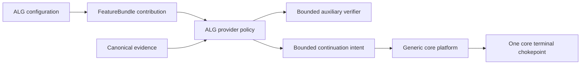
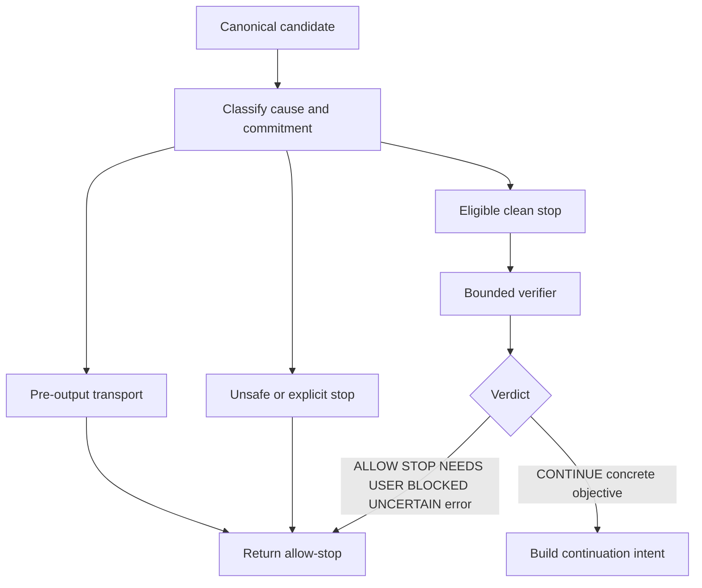

# Design Document

## Overview

Agent Loop Guard is a concrete feature provider for the generic terminal-decision platform. It classifies canonical terminal evidence, independently verifies eligible clean stops, detects progress, and returns either allow-stop or a bounded provider-neutral continuation intent. The core platform remains the only owner that holds/publishes A-side terminals, settles B-side attempts, opens continuation legs, and manages conversation-view steering.

The design deliberately removes the former ALG-owned terminal gate, `stopguard`/`stopgate` runtime orchestration, direct `Call` mutation, `turnTerminal.guardHidden`, and generic conversation-view lifecycle claims. Those mechanics belong to `.kiro/specs/terminal-decision-feature-extension/`; ALG supplies policy only.

### Goals

- Prevent supported premature clean stops and safe post-output interruptions from breaking unattended loops.
- Preserve no-post-output-retry, no-new-authority, and conservative allow-stop invariants.
- Reuse existing canonical evidence, auxiliary request, stream recovery, and continuation contracts.
- Make the provider independently removable from core and from the feature registry.

### Non-Goals

- Implementing or changing the platform's FeatureBundle merge, terminal chokepoint, continuation transaction, steering lifecycle, generation lifecycle, secure-session policy store, or generic endpoints.
- Provider-specific stop parsing in core or raw protocol-frame stitching.
- A generic planner, workflow engine, retry engine, DI/service locator, native plugin, or effect runtime.

## Boundary Commitments

### This Spec Owns

- ALG provider construction and configuration through the platform's exclusive provider contribution.
- Canonical ALG cause/evidence projection, semantic verdict policy, verifier adapter, progress fingerprinting, and bounded continuation intent/content.
- ALG-specific bounded diagnostics and regression fixtures.

### Out of Boundary

- Core terminal publication/settlement and all continuation side effects.
- Conversation-view store, anchor resolution, overlay persistence/deactivation, snapshot freeze/reassertion, and stale cleanup.
- Client/operator policy endpoints and tri-state store; ALG consumes the platform's immutable policy snapshot.
- Transport retry/backoff, routing, billing, B2BUA, frontend rendering, secure-session authentication, and provider SDK adapters.

### Allowed Dependencies

- Approved platform contract `.kiro/specs/terminal-decision-feature-extension/` (all provider integration tasks depend on its contract and tests).
- `pkg/lipsdk/terminaldecision`, canonical `pkg/lipapi`, `pkg/lipsdk/auxiliary`, `pkg/lipsdk/continuation`, `pkg/lipsdk/session`, and existing observability facades.
- Existing stream-recovery and continuation facts only through provider-neutral SDK contracts; no `internal/core` imports.

### Revalidation Triggers

- Platform provider input/intent validation or failure normalization changes.
- Canonical output commitment, continuation evidence, explicit completion facts, auxiliary visibility/recursion, or policy snapshot shape changes.
- Any proposal to put ALG logic back in core or to let provider policy own steering/terminal lifecycle.

## Architecture

### Existing Architecture and Migration Boundary

The prior ALG plan put a request-level gate in core and left a remediation Task 11 for direct append/`guardHidden` replacement. The approved platform plan moves the generic mechanics out first. ALG now has one feature-provider boundary:



ALG is compiled as a normal in-process feature plugin. The platform's exclusive merge rejects another provisional-terminal provider; no ordering chain is defined. When ALG is absent, the generic platform has no ALG construction or code dependency.

### Platform Contract Used by ALG

The provider consumes a contract equivalent to:

```go
type Provider interface {
    ID() string
    Decide(context.Context, terminaldecision.Input) (terminaldecision.Decision, error)
}

type Input struct {
    Candidate    CanonicalTerminalCandidate
    Request      RequestIdentity
    Policy       PolicySnapshot
    Continuation ContinuationEvidence
    Deadline     time.Time
}

type Decision struct {
    Kind       DecisionKind // AllowStop or Continue
    ReasonCode string
    Continue   *ContinuationIntent
}
```

ALG must return `AllowStop` for non-ALG-recoverable causes and only return `Continue` with a non-empty concrete objective, safe canonical evidence, bounded text, and internal-control provenance. The platform validates and executes the intent; it owns terminal/attempt settlement, route/authority/billing/B2BUA admission, conversation-view steering, snapshot sequencing, deactivation, cancellation, and final publication.

## ALG Policy Model

### Cause Classification

ALG maps canonical facts—not provider names or wire frames—to a bounded cause set:

```text
normal_end, empty_normal_end, provider_pause, output_limit,
transport_precommit, transport_postcommit, idle_precommit,
idle_postcommit, partial_tool_call, refusal_or_filter,
client_cancel, unknown_terminal
```

Pre-output transport causes delegate to the platform's existing stream-recovery behavior. Client cancellation, refusal/filter, unsafe partial tool state, unsupported provider continuation, and unknown causes are non-continuation. Post-output transport causes may continue only when the retained canonical trajectory is safe and the ALG budget permits it. Eligible clean normal stops use semantic verification unless a trusted normalized explicit-completion fact applies.

### Evidence Projection

The provider constructs a bounded projection from `terminaldecision.Input`:

```text
Evidence = {
  Cause,
  UserObjective,
  RecentCanonicalTrajectory,
  CandidateAssistantOutput,
  ToolActionState,
  ExplicitCompletion,
  OutputCommitted,
  ContinuationLineage,
  SemanticAttempt,
}
```

The projection reuses canonical items and continuation references. It does not create a second transcript store, retain raw prompt/tool payloads for fingerprinting, or pass provider SDK objects to core. Size and item limits follow the platform's bounded intent/evidence contract.

### Semantic Verdict Policy

The auxiliary verifier returns one structured verdict:

| Verdict | ALG action |
|---|---|
| `ALLOW_STOP` | Return allow-stop. |
| `CONTINUE` with concrete objective | Build bounded continuation intent. |
| `NEEDS_USER` | Return allow-stop. |
| `BLOCKED` | Return allow-stop. |
| `UNCERTAIN` | Return allow-stop. |

Errors, timeout, malformed/unknown verdict, empty objective, and inconsistent evidence normalize to `UNCERTAIN`. Only `CONTINUE` with a concrete objective already requested by the user is actionable. A verifier cannot authorize a new permission, credential, approval, user choice, or tool action.

## Components and Ownership

| Component | Domain | Intent | Requirements | Dependencies |
|---|---|---|---|---|
| ALG provider | feature plugin | Implement platform Provider and cause/action policy | 1, 2, 3, 4, 9, 11 | terminaldecision P0; lipapi P0 |
| Evidence projector | feature policy | Bound canonical facts for verifier/fingerprint | 2, 8 | lipapi/continuation P0 |
| Verifier adapter | feature SDK adapter | Run detached internal semantic check and parse verdict | 5, 8, 10 | auxiliary/session P0 |
| Progress tracker | feature policy | Enforce semantic cap and no-progress breaker | 7, 10 | canonical digest P0 |
| Recovery intent builder | feature policy | Produce constrained internal recovery content/intent | 4, 6, 8 | terminaldecision P0 |
| Config/registration | composition | Enable/disable provider without core branch | 1, 9, 11 | registry/feature bundle P0 |
| ALG tests/telemetry | tests | Regression and bounded evidence | 7, 10, 11 | testkit/observability P0 |

### ALG Provider

**Responsibilities:** normalize candidate causes, select semantic verification, enforce policy, and return a validated platform decision. **Non-responsibilities:** terminal claims, stream I/O, backend opening, route selection, steering persistence, secure-session writes, or billing.

**Failure behavior:** provider-level error is normalized by the platform to allow-stop. Internal policy errors are returned as allow-stop with a bounded reason. The provider never retries by calling itself recursively.

### Verifier Adapter

The adapter uses the existing SDK auxiliary client/facade with:

- internal/private visibility and detached auxiliary session;
- inherited parent trace, A-leg, B-leg, branch, and request scope identifiers;
- a dedicated role such as `loop_guard`;
- ALG suppression for the verifier operation itself;
- no required tools and bounded output/deadline;
- strict structured verdict parsing and bounded reason/objective fields.

The verifier instruction tells the evaluator to distinguish complete work, concrete existing unfinished work, user-dependent next steps, external blocks, optional suggestions, user-owned next steps, and quoted future-action language. Verifier chain-of-thought is not propagated.

### Progress Tracker

The tracker fingerprints stable canonical facts: normalized candidate output digest, tool name/argument digest, result/error correlation, continuation status/lineage, verdict/objective digest, and canonical state transitions. It excludes volatile request IDs/timestamps. It enforces a maximum semantic continuation count and a separate no-progress threshold. New progress may reset only the no-progress counter justified by that progress; it never resets the logical maximum.

### Recovery Intent Builder

For actionable `CONTINUE`, ALG builds bounded internal control content with this semantic contract:

```text
This is automated internal recovery, not a new user request, approval,
permission, or scope expansion. Re-read the existing request and resume only
concrete unfinished work from the last safe canonical point. If complete, end
normally. If user input, approval, permission, credentials, clarification, or
choice is needed, end normally for the user. Do not invent, repeat, broaden,
optimize, or discover work.
```

The intent carries a bounded reason, concrete remaining objective, attempt/max values, internal provenance, and a provider-scoped fixed overlay identifier (`alg-rec`) where the platform contract permits one. The platform, not ALG, resolves the accepted user-ingress anchor, freezes the next snapshot, reasserts steering once, hides the overlay from client/continuation records, deactivates it on all terminal paths, and handles stale external ingress. ALG never appends to `Call.Messages`/`Call.Items` and does not use `turnTerminal.guardHidden`.

## Semantic Decision Flow



The platform may call ALG for every candidate at its chokepoint, but ALG returns immediately for causes that do not belong to semantic policy. The provider does not hold or publish a terminal itself.

## Configuration and Lifecycle

ALG configuration follows existing nested feature/plugin configuration conventions and is validated before FeatureBundle construction. The platform's process policy controls effective enablement; ALG configuration supplies provider defaults and bounds only. Suggested fields (names may follow existing config conventions) are:

| Setting | Default | Rule |
|---|---:|---|
| ALG enabled | false | Disabled preserves old behavior. |
| verifier role | `loop_guard` | Bounded non-empty role. |
| verifier timeout | 4 seconds | Positive and bounded; timeout allows stop. |
| max semantic continuations | 3 | Positive bounded hidden intents. |
| no-progress limit | 2 | Positive bounded repeats. |
| explicit completion policy | `trust` | `trust` or `verify`; malformed facts fall back safely. |

ALG must not duplicate stream-recovery idle/retry/failover settings. Feature construction is generation-local and immutable. Process policy state is supplied by the platform snapshot; ALG never owns or persists client/operator overrides. A failed provider construction prevents candidate generation publication and cannot mutate the last-good generation.

## Failure Matrix

| Condition | ALG decision |
|---|---|
| Pre-output EOF/idle | Delegate to existing platform stream recovery; no semantic intent. |
| Post-output interruption with safe retained trajectory | Continue intent only if budget and protocol evidence are safe. |
| Completed tool/result then interruption | Preserve result evidence; no re-execution request. |
| Incomplete tool args/opaque state | Allow-stop/non-continuation. |
| Refusal/filter/cancel | Allow-stop/non-continuation. |
| Verifier timeout/error/malformed/uncertain | Allow-stop. |
| `CONTINUE` without concrete objective | Normalize to allow-stop. |
| Repeated no progress/max budget | Allow-stop/non-continuation. |
| Platform rejects intent/admission/open | Accept platform final outcome; no second ALG path. |
| Verifier recursion or auxiliary depth bound | Allow-stop with bounded reason. |

## File Structure Plan

```text
internal/plugins/features/agentloopguard/
├── config.go                 # ALG feature configuration and validation
├── provider.go               # platform Provider implementation
├── evidence.go               # canonical bounded evidence projection
├── verifier.go               # auxiliary verifier adapter and strict parser
├── progress.go               # stable progress digest and breaker
├── recovery.go               # bounded internal recovery intent/content
├── telemetry.go              # bounded ALG-specific observations
└── *_test.go                 # unit, integration, and contract fixtures
internal/standardplugins/     # explicit feature registration only
internal/archtest/            # provider-removal/import ratchets
internal/testkit/              # canonical ALG scenario fixtures
```

The platform spec owns migration or deletion of the old core-specific ALG packages/branches (`stopguard`, `stopgate`, `continuationsafety`, `stopguardverify`, direct continuation append fields, and `turnTerminal.guardHidden`). ALG implementation only migrates its concrete policy and verifies those platform-owned artifacts are absent; it does not remove or own them.

## Error Handling, Privacy, and Monitoring

ALG emits bounded cause/verdict/action/continuation/no-progress/failure codes and latency/usage through existing observability seams. It preserves A/B/trace relationships supplied by the platform. It never places prompt text, assistant output, tool arguments, verifier reason/objective, recovery text, secrets, or raw IDs in metric labels. Bounded diagnostic reason text may be recorded only under existing redaction policy.

Verifier and policy failures default to stopping. The platform owns provider failure normalization, terminal/error mapping, cancellation, and cleanup. ALG does not attempt compensation for irreversible provider calls, client-visible output, tool effects, or durable accounting.

## Testing Strategy

- **Provider contract:** disabled/no provider, bounded DTOs, unknown decisions, non-empty objective, policy snapshot consumption, provider removal.
- **Cause/evidence:** normal/empty/pause/output limit, pre/post transport, partial tools, refusal/filter, cancellation, unknown causes, commitment and bounded projection.
- **Verifier:** detached/private auxiliary request, parent lineage, role, no tools, recursion suppression, strict verdict parse, timeout/error/malformed/uncertain handling, realistic negative/positive fixtures.
- **Recovery intent:** explicit internal/non-authorizing wording, complete/user-dependent branches, concrete objective bounds, no direct call append, fixed scoped overlay ID, max attempt preservation.
- **Progress:** repeated equivalent output/tool/result/error/verdict, volatile-ID immunity, new-progress counter behavior, total-cap immutability.
- **Platform integration:** valid intent traverses one platform transaction; no intermediate terminal, hidden-content leakage, or duplicate tool result; platform rejection leaves conservative final behavior.
- **Lifecycle:** provider configuration/reload/disable/removal and feature construction failure; no provider-specific core imports or second policy store.
- **Acceptance matrix:** immediate promised action, complete answer, user question, optional improvements, user-owned next steps, quoted future action, pre-output EOF, post-output interruption, completed tool/result, incomplete args, cancellation, verifier failure, no-progress, max budget.

## Requirements Traceability

| Requirement | Design realization |
|---|---|
| 1 | Boundary, Platform Contract, Configuration and Lifecycle |
| 2 | Cause Classification, Evidence Projection, Semantic Flow |
| 3 | Cause Classification, Failure Matrix, platform delegation |
| 4 | Recovery Intent Builder, Failure Matrix, platform transaction dependency |
| 5 | Semantic Verdict Policy, Verifier Adapter |
| 6 | Recovery Intent Builder, Platform Contract |
| 7 | Progress Tracker, Configuration and Lifecycle |
| 8 | Evidence Projection, Verifier Adapter, Acceptance Matrix |
| 9 | Architecture and Migration Boundary, Configuration and Lifecycle |
| 10 | Error/Monitoring, Testing Strategy, platform ratchets |
| 11 | Boundary Commitments, platform dependency, removal tests |

### Acceptance-Criterion Coverage

| Criteria | Design elements |
|---|---|
| 1.1, 1.2, 1.3, 1.4 | Opt-In Provider; Platform Contract; Configuration and Lifecycle |
| 2.1, 2.2, 2.3, 2.4, 2.5 | Cause Classification; Evidence Projection; Semantic Flow |
| 3.1, 3.2, 3.3, 3.4 | Cause Classification; Failure Matrix |
| 4.1, 4.2, 4.3, 4.4, 4.5, 4.6 | Recovery Intent Builder; Failure Matrix |
| 5.1, 5.2, 5.3, 5.4, 5.5, 5.6, 5.7, 5.8 | Semantic Verdict Policy; Verifier Adapter |
| 6.1, 6.2, 6.3, 6.4, 6.5, 6.6, 6.7 | Recovery Intent Builder; Platform Contract |
| 7.1, 7.2, 7.3, 7.4, 7.5 | Progress Tracker; Configuration and Lifecycle |
| 8.1, 8.2, 8.3, 8.4, 8.5, 8.6 | Evidence Projection; Verifier Adapter; Acceptance Matrix |
| 9.1, 9.2, 9.3, 9.4, 9.5 | Architecture and Migration Boundary; Configuration and Lifecycle |
| 10.1, 10.2, 10.3, 10.4, 10.5, 10.6, 10.7 | Error/Monitoring; Testing Strategy; platform ratchets |
| 11.1, 11.2, 11.3, 11.4 | Boundary Commitments; platform dependency; removal tests |

## Platform Dependency Gate

ALG integration is GO only after the platform spec has passed its provider-contract, terminal-chokepoint, core-transaction, immutable-generation, process-policy, generic-endpoint, and architecture-ratchet tasks. ALG-specific implementation may then proceed in its feature package. If any ALG change requires a second terminal/continuation/policy/steering owner, it is a platform change and must stop for re-planning.
