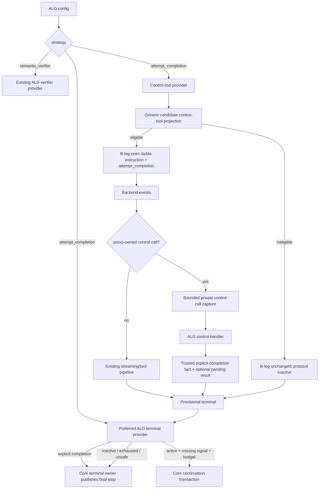

# Design Document

## Overview

This design extends Agent Loop Guard (ALG) with a preferred explicit-completion strategy while preserving the existing semantic-verifier strategy as a mutually exclusive legacy mode.

In `attempt_completion` mode, each eligible backend candidate receives two B-leg-only additions:

1. a byte-stable system/control instruction explaining the completion protocol; and
2. a familiar function tool named exactly `attempt_completion` with one required `result: string` argument.

The remote worker model uses that tool as an explicit completion handshake. The proxy privately consumes only the proxy-owned control call, records a generic trusted explicit-completion fact, optionally materializes `result` as final assistant text when no answer text has already been released, and lets the existing terminal-decision owner accept the terminal. If an eligible terminal arrives while the protocol was active but no completion signal was observed, ALG returns one bounded hidden protocol-repair continuation by default. A second unmarked stop is allowed rather than causing an unbounded hidden loop or invoking the semantic verifier.

The legacy strategy remains the current independent-verifier policy. The strategies do not call each other and cannot be composed concurrently.

### Goals

- Prefer an explicit completion handshake over a normal-path auxiliary semantic-verifier inference for new ALG deployments.
- Reuse the widely established `attempt_completion` model vocabulary from Cline/Roo/Kilo-style agents.
- Preserve the current semantic-verifier ALG strategy as a separately selectable compatibility path.
- Keep client/A-leg code unaware of proxy-owned completion-tool injection and calls.
- Preserve client `ToolChoice`, ordinary tool execution, streaming-first response behavior, no-post-commit replay, terminal ownership, accounting, and generation pinning.
- Reuse the existing normalized `ExplicitCompletion` terminal fact instead of creating an ALG-specific terminal authority.
- Add only the smallest generic SDK/runtime seam required for a model-visible/client-hidden proxy control tool.

### Non-Goals

- Prove semantically that every model self-certified completion is correct. Operators requiring independent semantic checking can select `semantic_verifier` instead.
- Run the explicit protocol and semantic verifier together or use one as fallback for the other.
- Inject hidden tools when doing so would broaden explicit client tool-choice restrictions.
- Implement a general arbitrary proxy-local tool runtime, MCP server, workflow engine, planner, DI/service locator, or tool sandbox.
- Replace transport recovery, terminal CAS/ownership, continuation transactions, routing, B2BUA, billing, secure-session authority, or frontend protocol adapters.
- Persist a new durable session record merely to remember the fixed completion instruction/tool.
- Parse completion from prose, XML, markdown, `[DONE]`, or provider-specific finish strings.

## Boundary Commitments

### This Spec Owns

- ALG strategy configuration and mutual-exclusion validation.
- `attempt_completion` tool/instruction policy and strict argument handling.
- Preferred-mode missing-signal decision policy, protocol state, and recovery wording.
- A narrow provider-neutral `controltool` SDK/feature plane and runtime stage for B-leg-only proxy control tools.
- Request-local activation/provenance, bounded control-call capture, normalized completion evidence, and pending result publication through existing canonical response ownership.
- Regression, architecture, observability, and compatibility certification for the new mode.

### Out of Boundary

- Generic terminal decision publication and terminal CAS ownership.
- Generic continuation admission/open/settlement and conversation-view continuation overlay lifecycle.
- Ordinary client tool execution semantics and client tool policy.
- Provider wire encoders except that they continue to translate the already-final canonical B-leg tool catalog normally.
- Durable conversation-view schema changes.
- New client/operator policy endpoints.
- Semantic-verifier redesign beyond preserving behavior under its explicit strategy.

### Allowed Dependencies

- `pkg/lipapi` canonical calls/events/items/tool definitions and explicit-completion helpers.
- `pkg/lipsdk/terminaldecision` and existing continuation/steering platform.
- New narrow `pkg/lipsdk/controltool` generic contract.
- `pkg/lipsdk/feature` typed plane composition.
- Existing request/session/scope/workspace views for bounded control-tool metadata.
- Existing response pipeline, attempt state, traffic/usage/recording, and terminal chokepoints only through generic integration.

### Revalidation Triggers

Re-run design validation if any of these change before implementation:

- attempt-transform/request-hook/post-hook rederivation ordering;
- conversation-view final reassertion or PTB/`Backend.Open` ordering;
- tool-call assembler/finalizer order;
- ordinary tool policy/reactor order;
- terminal-decision evidence or continuation intent contract;
- canonical `ToolChoice`/allowed-tools rules;
- backend capability resolution;
- active `b-leg-path-virtualization`, `large-payload-streaming-fast-path`, or another spec lands changes on the same seams.

## Existing Architecture and Brownfield Placement

The relevant current flow is approximately:

```text
accepted A-leg call
  -> candidate clone
  -> attempt transforms
  -> request hooks / shaping
  -> post-hook validation + candidate admission + context/accounting preflight
  -> final conversation-view reassertion
  -> final clamps/authorization/adaptation
  -> PTB capture
  -> Backend.Open
  -> backend events
  -> ordinary tool-call assembler/finalizers
  -> tool policies
  -> tool reactors
  -> response hooks
  -> client release
  -> provisional response_finished
  -> terminal-decision provider
  -> allow stop OR core-owned continuation transaction
```

The existing ALG contributes only `PlaneTerminalDecisionProvider`. The new preferred mode additionally needs one request/response-spanning generic capability. It must not be implemented by putting `agent-loop-guard` branches into the flow above.

### Why Existing Planes Are Insufficient

- `toolcatalog.Filter` is a remove/annotate contract and does not carry trusted request-local provenance for a privileged local action.
- A plain request transform cannot safely persist its private activation identity into the response path without abusing client/canonical metadata.
- Ordinary tool reactors execute after ordinary tool policy, too late to guarantee the hidden tool is never interpreted as a client tool.
- Completion gates buffer the whole completion until terminal, violating streaming-first behavior.
- Session openers only own labels, not model-visible instruction/tool projection.

Therefore V1 adds one narrow generic control-tool provider plane rather than overloading unrelated hooks.

## Selected Architecture



## Configuration and Strategy Model

Extend the existing ALG feature configuration without introducing a second feature ID:

```yaml
plugins:
  features:
    agent-loop-guard:
      enabled: true
      strategy: attempt_completion
      max_protocol_reprompts: 1
      no_progress_limit: 2
```

Legacy explicit configuration remains:

```yaml
plugins:
  features:
    agent-loop-guard:
      enabled: true
      strategy: semantic_verifier
      verifier_role: loop_guard
      verifier_timeout_seconds: 4
      max_semantic_continuations: 3
      no_progress_limit: 2
      explicit_completion_policy: trust
```

Existing configuration remains valid:

```yaml
plugins:
  features:
    agent-loop-guard:
      enabled: true
      # no strategy: resolves to semantic_verifier for backward compatibility
```

Disabled configuration:

```yaml
plugins:
  features:
    agent-loop-guard:
      enabled: false
```

### Strategy Type

```go
type Strategy string

const (
    StrategyAttemptCompletion Strategy = "attempt_completion"
    StrategySemanticVerifier Strategy = "semantic_verifier"
)
```

Extend `Config` with:

```go
Strategy               Strategy
MaxProtocolReprompts   int // default 1, supported 1..3 in V1
```

Retain current verifier fields unchanged.

### Validation Rules

- `enabled: false` contributes no terminal provider and no control-tool provider.
- Omitted strategy under an enabled legacy config resolves to `semantic_verifier`.
- New docs/examples always spell `strategy: attempt_completion` when recommending ALG.
- `attempt_completion` rejects explicit verifier-only keys (`verifier_role`, `verifier_timeout_seconds`, `max_semantic_continuations`, `explicit_completion_policy`).
- `semantic_verifier` rejects explicit `max_protocol_reprompts`.
- `no_progress_limit` remains a shared bounded breaker.
- Unknown strategies/keys fail generation construction.
- Presence-sensitive validation is performed during YAML decode so default values cannot make an unused strategy look configured.
- Programmatic config construction receives equivalent `Validate` checks through an explicit strategy-aware constructor path.

No runtime “auto” strategy exists. Mutual exclusion is structural.

## Generic `controltool` SDK Contract

Add `pkg/lipsdk/controltool` as a small provider-neutral contract. It represents one optional proxy-owned model control tool, not a generic application tool runtime.

### Core Types

Equivalent public shape:

```go
package controltool

type Provider interface {
    ID() string
    Spec() Spec
    Handle(context.Context, CompletedCall, Meta) (Outcome, error)
}

type Spec struct {
    Tool         lipapi.ToolDef
    Instruction Instruction
    MaxArgsBytes int
}

type Instruction struct {
    Role lipapi.Role // V1: system or developer only
    Text string
}

type CompletedCall struct {
    ToolCallID string
    ToolName   string
    ArgsJSON   []byte
}

type Meta struct {
    TraceID      string
    ALegID       string
    BLegID       string
    CandidateKey string
    AttemptSeq   int
    Scope        scope.PrincipalScopeView
    Session      session.SessionView
    Workspace    workspace.WorkspaceView
}

type OutcomeKind uint8
const (
    OutcomeInvalid OutcomeKind = iota
    OutcomeComplete
)

type Outcome struct {
    Kind       OutcomeKind
    ResultText string
    ReasonCode string
}
```

Validation/bounds:

- one non-empty provider ID;
- one bounded tool definition with valid JSON Schema;
- one bounded stable instruction;
- bounded args budget, default no larger than the existing safe tool-call envelope; V1 ALG uses 64 KiB unless repository constants justify a smaller existing limit;
- outcome reason codes bounded/content-free;
- `OutcomeComplete` requires non-empty bounded result text;
- `OutcomeInvalid` carries no client output.

The generic SDK knows nothing about ALG or `attempt_completion`.

## Feature Plane

Add one typed exclusive plane:

```text
PlaneControlToolProvider
ID: control_tool_provider
Type: controltool.Provider
Merge: exclusive
Request access: canonical required when occupied
Execution wave: tools / candidate execution
```

Why exclusive in V1:

- only one privileged model-control tool owner is currently required;
- response interception/provenance remains unambiguous;
- no ordering semantics between multiple hidden local tools need to be invented;
- future generalization can be specified with evidence rather than making V1 a mini local-tool framework.

Composition:

- legacy ALG contributes only the existing terminal-decision provider;
- preferred ALG contributes one preferred terminal-decision provider plus one control-tool provider;
- disabled ALG contributes neither;
- feature-host/standard composition remains the only concrete registration point;
- core imports only `pkg/lipsdk/controltool`, never `agentloopguard`.

## Model-Facing `attempt_completion` Provider

### Frozen Tool Definition

The ALG control provider exposes exactly:

```json
{
  "type": "function",
  "name": "attempt_completion",
  "description": "Call this only when all work requested by the user for the current task is complete. The result must concisely summarize the completed work. Do not call this while requested work remains that you can continue without additional user input.",
  "parameters": {
    "type": "object",
    "properties": {
      "result": {
        "type": "string",
        "description": "Concise final result summarizing the work that has been completed."
      }
    },
    "required": ["result"],
    "additionalProperties": false
  }
}
```

`command` is intentionally omitted despite historical Roo/Cline support. It would add side-effect semantics unrelated to completion and weaken the local-control boundary.

### Frozen Base Instruction

Semantically equivalent stable text:

```text
<task-completion-protocol>
When, and only when, all work requested by the user for the current task is complete,
call the `attempt_completion` tool with a concise final `result`.

Do not call `attempt_completion` while concrete requested work remains that you can
continue without additional user input.

If additional in-scope work can be performed autonomously, continue that work.
If further progress genuinely requires user input, permission, credentials,
clarification, or a choice, request that input normally and do not assume it.

This tool is a proxy-internal completion signal. It is not a new user request,
approval, permission, or scope expansion.
</task-completion-protocol>
```

The implementation may polish wording before first merge only if tests pin the final bytes. After release, model-facing name/schema/base instruction changes require explicit compatibility review.

## Candidate Projection and Activation

### Activation Inputs

The generic runtime evaluates each candidate using:

- the final candidate identity/backend/model;
- resolved effective backend capabilities;
- the candidate-local canonical call;
- canonical client `ToolChoice`/allowed-tools state;
- the configured `controltool.Provider` spec.

### V1 Eligibility Matrix

| Condition | Proxy-owned protocol activation |
|---|---|
| backend supports tools; tool choice omitted/default auto; no incompatible allowed subset; no name collision | active |
| explicit `auto` under same conditions | active |
| backend lacks tools | inactive: `backend_tools_unsupported` |
| `none` | inactive: `tool_choice_none` |
| `any` / arbitrary required-tool semantics | inactive: `tool_choice_constrained` |
| required named client tool | inactive: `tool_choice_required` |
| non-empty allowed-tools subset that would exclude hidden tool | inactive: `allowed_tools_constrained` |
| client already owns `attempt_completion` | inactive: `tool_name_collision` (client tool remains untouched) |
| malformed control spec | candidate generation/build failure, not per-request best effort |

V1 deliberately chooses a smaller safe activation set instead of inventing equivalence rules for every provider's tool-choice dialect.

### Two-Point Projection

The control projection must satisfy both accurate preflight/accounting and final B-leg stability:

1. **Post-hook projection**: after ordinary candidate/request feature mutation is complete, but before the authoritative post-hook candidate admission/context/accounting preflight. This projection determines activation and inserts the stable control instruction/tool into the candidate clone so downstream sizing, requirements, and accounting see the real model-facing request.
2. **Final reassertion**: after conversation-view final reassertion and other known late canonical reconstruction, but before candidate adaptation/PTB capture/`Backend.Open`. This reasserts only the already-approved byte-identical control projection. If it cannot reproduce the approved projection without changing eligibility/semantics, the candidate fails closed before upstream open.

This is analogous to the repository's existing need to freeze/reassert model-visible state without putting feature-specific policy into core.

### Authority-Neutral Instruction Projection

A generic pure helper inserts one complete control instruction into the backend-effective trajectory without conflicting authorities:

- legacy/message authority: place the instruction in the stable system/developer instruction prefix;
- item authority: materialize an equivalent leading system/developer message item before mutable user/assistant history;
- never mutate A-leg baseline/history;
- never accumulate multiple copies within one candidate;
- final reassertion produces the same semantic bytes/order as the post-hook projection.

Tool definition is appended to the backend-effective tool catalog only after collision and ToolChoice checks pass. The client's original ToolChoice value is not rewritten.

### Activation State

Runtime stores request/attempt-local trusted state outside client data:

```go
type controlToolActivation struct {
    ProviderID  string
    ToolName    string
    MaxArgs     int
    Active      bool
    ReasonCode  string
}
```

The activation is pinned to the attempt/generation and is never reconstructed from a tool name emitted by the model. It is not serialized to frontend or backend metadata.

## Response Interception

### Placement

Control-tool interception occurs on backend canonical events **before** the ordinary tool-call assembler/finalizers and before ordinary tool policy/reactors.

This ordering is binding:

```text
backend event / BTP observation / provider usage
  -> proxy control-tool capture (only if trusted activation matches)
      -> claimed: private bounded capture/handle; no client event
      -> not claimed: existing ordinary tool assembler/finalizers
          -> ordinary tool policy
          -> tool reactors
          -> response hooks
          -> client release
```

Raw B-leg traffic capture may observe the upstream control call under existing operator traffic-capture policy; A-leg/client/PTC output must not.

### Capture State

Attempt-local capture tracks only the active control call:

```go
type capture struct {
    callID      string
    started     bool
    finished    bool
    args        bounded buffer
    invalid     bool
}
```

Rules:

- a `tool_call_started` matching the prepared tool name establishes the captured call ID;
- later name-less args/finish fragments correlate only by that call ID;
- only one control call may be active per response in V1;
- args overflow, duplicate start/finish, malformed lifecycle, or multiple control calls mark protocol invalid and are swallowed rather than leaked to client execution;
- non-control tool calls/events proceed normally;
- an unresolved ordinary client tool boundary prevents the control completion from becoming unconditional terminal evidence.

### Handler Semantics

ALG's concrete handler decodes strict JSON using duplicate/unknown-field rejection:

```go
type args struct {
    Result string `json:"result"`
}
```

Validation:

- exactly one JSON object;
- exactly key `result`;
- string value;
- trimmed non-empty result;
- valid UTF-8;
- bounded to the existing assistant-text/result maximum;
- no trailing JSON value;
- no `command`, status, approval, or additional metadata.

Expected model mistakes return `OutcomeInvalid` with a bounded reason; internal handler failure returns an error. Neither path falls through to client tool execution.

## Completion Evidence and Pending Result

Extend generic terminal evidence additively:

```go
type Evidence struct {
    // existing fields...
    ExplicitCompletion         bool
    ExplicitCompletionExpected bool
}
```

Runtime projection sets:

- `ExplicitCompletionExpected = true` only when this attempt had a successfully active proxy control protocol;
- `ExplicitCompletion = lipapi.HasExplicitCompletion(nativeItems) || validProxyControlCompletion`.

The legacy semantic-verifier provider ignores `ExplicitCompletionExpected`; the preferred provider consumes it.

A valid proxy control action is recorded as an internal completed control fact, not a synthetic client-visible ToolCall/ToolResult. This is semantically equivalent to the completed local execution that `HasExplicitCompletion` demands from an ordinary harness-owned completion tool.

### Pending Result Text

The response pipeline retains a bounded `pendingCompletionResult` only for a valid proxy completion.

At accepted terminal publication:

- if no meaningful client-visible assistant text has been committed, core emits the result through the existing canonical response release/recording/traffic path before `response_finished`, synthesizing only any lifecycle events needed to maintain canonical sequence legality;
- if assistant text was already committed, do not emit the result automatically; it remains completion evidence/summary and avoids duplicate answers;
- result text is never emitted if the completion outcome is invalid or the terminal is not accepted.

This flush is owned by the generic terminal/response path. ALG does not write directly to a frontend.

## Preferred Terminal Policy

Implement strategy dispatch inside the feature provider; do not add strategy branches to core.

### Decision Order

For `attempt_completion`:

1. Validate context/input.
2. Authoritative cancellation/refusal/filter/non-recoverable causes -> allow stop.
3. Trusted `ExplicitCompletion` -> allow stop immediately (subject to existing terminal safety).
4. Pre-output transport/empty failure -> existing stream-recovery policy remains authoritative; no semantic protocol reprompt competes with it.
5. Unsafe partial ordinary tool state / missing resumable trajectory -> allow stop.
6. `ExplicitCompletionExpected == false` -> allow stop with bounded `completion_protocol_inactive` reason; never call verifier.
7. If protocol reprompt budget/no-progress breaker is exhausted -> allow stop.
8. Otherwise build one bounded missing-signal continuation intent from the existing user objective and retained trajectory.

No auxiliary request is issued anywhere in this strategy.

### Protocol State

Do not overload the legacy `alg-state-v1` semantic-verifier state token. Add a feature-local V1 protocol token with a distinct prefix, for example:

```text
alg-proto-v1.<bounded opaque state>
```

State contains only bounded counters and a stable progress fingerprint:

```go
type ProtocolState struct {
    Reprompts             int
    LastFingerprint       string
    ConsecutiveNoProgress int
    Terminal              bool
}
```

Fingerprint inputs reuse canonical stable evidence concepts from the existing progress package: normalized objective/candidate/recent text, canonical action kinds/status/names, cause, and explicit-completion expectation/observation. Volatile IDs/timestamps/attempt IDs are excluded.

`max_protocol_reprompts` counts continuation intents, not candidate evaluations:

- default = 1;
- V1 accepted range = 1..3;
- effective bound is additionally capped by platform continuation policy;
- new progress may reset only consecutive no-progress count, never total reprompt count.

### Missing-Signal Recovery Intent

Semantically fixed content:

```text
<automated-completion-protocol-repair>
The previous model turn ended without the required `attempt_completion` signal.
This is proxy-internal recovery control, not a new user request, approval,
permission, or scope expansion.

If all work requested by the user is complete, call `attempt_completion` now
with a concise final `result`.

If concrete requested work remains and can proceed without new user input,
continue exactly that work from the retained safe point.

If further progress requires user input, permission, credentials, clarification,
or a choice, request that input normally and end. Do not assume it.

Do not invent, repeat, broaden, optimize, or discover work merely because this
recovery message was sent.
</automated-completion-protocol-repair>
```

The continuation intent still carries existing internal-control provenance, trajectory reference, bounded objective, control-state token, and platform-owned placement semantics.

### Legitimate User-Input Case

With the default cap of one:

```text
B1 asks user for required information and stops unmarked
  -> hidden protocol repair B2
B2 recognizes user input is required, repeats/clarifies the request and stops unmarked
  -> cap exhausted -> A-side terminal is allowed
```

This intentionally spends one hidden B-leg to distinguish accidental stop from a stable unmarked stop without a second model/verifier. Operators who find that cost undesirable can disable ALG or select the legacy verifier strategy; V1 does not add prose heuristics.

## Legacy Semantic-Verifier Path

The current provider implementation remains behaviorally intact under `strategy: semantic_verifier`:

```text
candidate
  -> current cause policy
  -> trusted explicit-completion handling per existing config
  -> detached verifier when eligible
  -> current progress/no-progress policy
  -> current continuation intent
```

Requirements:

- existing config omission maps here;
- existing `verifier_role`, timeout, max semantic continuation, explicit completion trust/verify, and no-progress semantics remain;
- the legacy path does not construct a control-tool provider;
- the preferred path does not construct/use `verifier.New`, auxiliary role `loop_guard`, or verifier parser/prompt;
- shared pure helpers may be reused only where that does not create runtime cross-strategy fallback.

## ToolChoice and Native Completion Tools

### Proxy Injection

The proxy does not override or rewrite client ToolChoice. V1 activates only when adding one invisible control capability is compatible with the original request contract.

### Client-Owned `attempt_completion`

If the client already declares `attempt_completion`:

- proxy injection is inactive due name collision;
- the client tool remains client-owned and follows ordinary tool policy/reactor/frontend handling;
- no proxy-owned call is intercepted by name;
- if a completed native call/result later produces existing `ExplicitCompletion`, either ALG strategy may consume that generic fact according to its own policy;
- absence of that native completion does not set `ExplicitCompletionExpected` for the proxy protocol, so the preferred strategy does not invent a hidden reprompt solely from the collision.

This preserves Cline/Roo/Kilo clients that already own their completion tool while adding transparent behavior for clients that do not.

## Transport and Continuation Interaction

- **Pre-output transport failure**: unchanged existing replay/failover recovery; control protocol adds no retry.
- **Post-output interruption after active protocol**: no completion signal plus retained safe trajectory can trigger the preferred continuation policy; original attempt is never replayed.
- **Completed ordinary tool/result before interruption**: retain and continue; do not re-execute.
- **Incomplete ordinary tool args/opaque unsafe state**: conservative stop/failure as current policy requires.
- **Client cancellation**: no protocol recovery.
- **Refusal/filter**: no protocol recovery.
- **Continuation leg**: the same control-tool provider is projected again if the continuation candidate remains eligible, so the worker can complete the handshake on the repair turn.

## Accounting, Context, Traffic, and Cache Semantics

### Accounting and Context

Control tool + instruction are real provider input and therefore must participate in:

- canonical protocol requirements;
- candidate capability admission;
- context-window sizing;
- request token estimation/preflight;
- provider input usage/cost when upstream reports it;
- PTB traffic capture.

They are not part of A-leg/client input truth and must not be counted as client-authored content by any customer-side semantic accounting that distinguishes proxy additions.

Local handling of the control call creates no synthetic provider usage.

### Traffic

- CTP/A-leg capture: no proxy control definition/instruction/call.
- PTB/B-leg capture: final backend-effective request includes control instruction/tool when active.
- BTP raw/canonical capture: upstream control events may be visible under existing internal/operator traffic policy.
- PTC/client capture: control tool lifecycle is absent; optional result text appears as ordinary assistant text if surfaced.

### Prompt Cache

The base instruction and tool definition are byte-stable. No timestamp/counter/request ID enters them. Activation can legitimately change the provider-visible request when backend/tool-choice/model eligibility changes; such a change is an explicit request-shape discontinuity, not something core should hide with provider-specific cache-key tricks.

## Failure Behavior

| Condition | Behavior |
|---|---|
| malformed feature config | candidate generation fails; last-good generation preserved |
| invalid control-tool spec at construction | generation fails |
| backend has no tools | protocol inactive; no verifier fallback |
| incompatible ToolChoice | protocol inactive; no verifier fallback |
| client name collision | protocol inactive; client tool untouched |
| post-hook/final projection drift | exclude/fail candidate before Backend.Open |
| malformed/oversized proxy control call | swallow local call, mark invalid, no client fallback execution |
| control handler expected model error | invalid completion; terminal policy may reprompt if active/budgeted |
| internal control handler error | conservative terminal path; never leak local tool to client |
| valid completion | trusted explicit completion; accept otherwise-safe terminal |
| first active unmarked eligible stop | hidden protocol-repair continuation |
| unmarked stop after default one repair | allow stop |
| cancellation/refusal/filter | allow/propagate authoritative outcome |
| post-commit transport failure | continuation only when safe; no replay/failover |

## Concurrency and Lifecycle

- Provider/config live in the immutable runtime generation.
- Request pins one generation, terminal provider, and control provider for its lifetime.
- Activation/capture/result state is attempt/logical-response local; no process-global map or background goroutine.
- Parallel/racing candidates receive independent activations/captures and only the winning attempt's evidence may affect the logical response.
- A losing attempt's control result must be discarded with that attempt.
- Reload can switch strategies for new requests without changing in-flight strategy.
- Withdrawal leaves no durable protocol row or stale overlay to clean.

## Observability

Use existing bounded feature/extension telemetry conventions. Suggested content-free dimensions/reasons:

```text
strategy=attempt_completion|semantic_verifier
activation=active|backend_tools_unsupported|tool_choice_none|tool_choice_constrained|allowed_tools_constrained|tool_name_collision|projection_error
control=observed|valid|invalid|args_too_large|multiple_calls|handler_error
terminal=explicit_completion|missing_signal_reprompt|reprompt_exhausted|protocol_inactive|no_progress|authoritative_candidate
```

Do not label with:

- `result` text;
- prompt/instruction text;
- tool args;
- raw IDs;
- user objective;
- candidate output;
- secrets.

Existing trace/A-leg/B-leg correlation may remain in trace/log fields under current policy but not metric labels.

## File Structure Plan

Expected additions/changes, subject to current-main revalidation:

```text
pkg/lipsdk/controltool/
├── types.go                  # generic Provider/Spec/Outcome/Meta contracts
├── validate.go               # bounds and static spec validation
├── projection.go             # pure authority-neutral projection helpers
└── *_test.go

pkg/lipsdk/feature/
└── plane_manifest.go         # PlaneControlToolProvider + generated/ratchet updates

internal/core/extensions/
└── control_tool.go           # generic bounded stage runner / evidence

internal/core/runtime/
├── executor_*                # post-hook projection + final reassertion
├── attempt_*                 # request-local activation/capture owner
├── response_pipeline_*       # early control-call diversion / pending result
└── terminal_decision_*       # generic Expected/Observed evidence projection + result drain

internal/plugins/features/agentloopguard/
├── config.go                 # strategy/mutual exclusion/backcompat
├── provider.go               # strategy dispatch
├── completiontool.go         # fixed Spec + strict handler
├── protocol.go               # preferred terminal policy/recovery intent
├── protocolstate/            # bounded fingerprint/counters/token
├── verifier/                 # existing legacy path retained
├── progress/                 # existing legacy progress retained
└── *_test.go

internal/standardplugins/
└── feature composition       # preferred contributes terminal + control provider

internal/archtest/
internal/testkit/
docs / example config as applicable
```

No provider-specific backend adapter should gain ALG logic.

## Testing Strategy

### TDD Order

Each implementation slice starts RED, then minimal GREEN, then refactor. Do not implement the runtime seam and backfill tests afterward.

### SDK / Generic Platform Tests

- control spec validation and bounds;
- exclusive plane merge/provider removal;
- authority-neutral instruction projection for message and item authority;
- stable/idempotent projection;
- ToolChoice eligibility matrix;
- candidate capability eligibility;
- collision behavior;
- post-hook projection/final reassertion equivalence;
- capture correlation, args bound, multiple/malformed lifecycle;
- proof that claimed calls bypass ordinary tool policy/reactors;
- proof non-control events take the unchanged pipeline;
- typed-nil/provider panic/failure normalization consistent with extension conventions.

### Preferred ALG Tests

- exact pinned tool name/schema/no-command field;
- exact pinned base instruction semantics;
- strict args parser: missing/extra/duplicate/wrong-type/trailing/oversize/invalid UTF-8;
- valid completion decision;
- completion-only result publication;
- prior visible text suppresses duplicate result publication;
- first missing-signal clean stop continues;
- second default unmarked stop allows;
- configured 2/3 reprompt bounds;
- no-progress stop;
- protocol inactive stops without verifier;
- assert zero auxiliary verifier calls in every preferred-mode fixture.

### Legacy Compatibility Tests

- old `enabled: true` config resolves to legacy;
- explicit `semantic_verifier` matches old decisions;
- verifier timeout/error/malformed/uncertain behavior unchanged;
- trusted explicit completion behavior unchanged;
- legacy mode contributes no control provider;
- preferred mode rejects verifier-specific mixed config.

### Runtime / Acceptance Matrix

Must include:

1. proxy completion as only model output;
2. streamed text then proxy completion;
3. ordinary client tool call before final completion;
4. clean normal stop with missing signal;
5. user-input-needed stop -> one repair -> second unmarked stop;
6. client cancel;
7. refusal/content filter;
8. pre-output EOF/idle;
9. post-output interruption with active protocol;
10. completed client tool/result then interruption;
11. incomplete client tool args;
12. malformed/oversized/multiple control call;
13. backend tools unsupported;
14. tool choice none/required/any/allowed subset;
15. client-owned `attempt_completion` collision/native evidence;
16. parallel/race loser emits completion but winner does not;
17. reload `semantic_verifier -> attempt_completion` and reverse with in-flight pinning;
18. disabled/no-provider behavior;
19. message-authority and item-authority frontends/backends;
20. streaming assertion that ordinary text is observed before backend terminal.

### Architecture Ratchets

- no `agentloopguard` import/name/switch in `internal/core` generic production code;
- new `controltool` package contains no concrete feature IDs/names;
- control tool cannot be surfaced to frontend execution path;
- no direct ALG append to client/A-leg `Call.Messages`/`Items`;
- no use of deprecated `turnTerminal.guardHidden` or second terminal owner;
- no second policy endpoint/store;
- no verifier import/call reachable from preferred strategy construction;
- no control-tool provider reachable from legacy strategy construction.

### Adjacent-Spec Revalidation

Before implementation proceeds past generic runtime wiring:

- inspect current main for landed `b-leg-path-virtualization` changes to attempt transforms, request hooks, finalizer assembly, or tool-policy order;
- inspect current main for large-payload streaming changes that affect event capture/bounds;
- adapt the generic control stage to current owners rather than reintroducing superseded seams;
- record focused characterization tests before changing shared ordering.

## Requirements Traceability

| Requirement | Design realization |
|---|---|
| 1 | Configuration and Strategy Model; Feature Plane; Legacy Path |
| 2 | Model-Facing Provider; frozen tool/instruction |
| 3 | Candidate Activation; trusted activation; response interception |
| 4 | V1 Eligibility Matrix; ToolChoice/native tool sections |
| 5 | Response Interception; capture; no completion gate |
| 6 | Completion Evidence and Pending Result |
| 7 | Preferred Terminal Policy; Protocol State; Recovery Intent |
| 8 | Transport and Continuation Interaction |
| 9 | Legacy Semantic-Verifier Path |
| 10 | Configuration; Concurrency and Lifecycle |
| 11 | Accounting/Traffic/Observability |
| 12 | Boundary Commitments; Testing; Architecture Ratchets; Adjacent-Spec Revalidation |

## Brownfield Design Validation Verdict

**GO after repairs.**

Repairs applied during validation:

1. Rejected whole-response completion gates because they buffer normal streaming.
2. Rejected late tool-reactor swallowing because tool policy runs first.
3. Added strict ToolChoice/capability eligibility rather than broadening client tool authority.
4. Added proxy-owned provenance rather than name-only interception.
5. Replaced literal one-shot session-prompt mutation with non-accumulating stable per-candidate materialization suitable for stateless upstream APIs.
6. Added one-reprompt default to resolve the legitimate user-input-stop ambiguity without a verifier fallback.
7. Preserved implicit legacy strategy for existing configs rather than silently changing enabled deployments.
8. Added an explicit current-main revalidation gate for active adjacent candidate/tool-finalization specs.

No unresolved architectural blocker remains at specification time. Implementation readiness still depends on performing the required revalidation against the then-current main branch before shared runtime edits.
