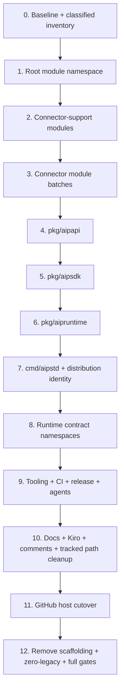
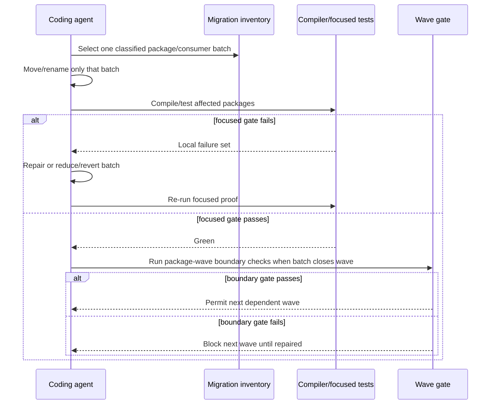
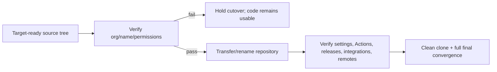
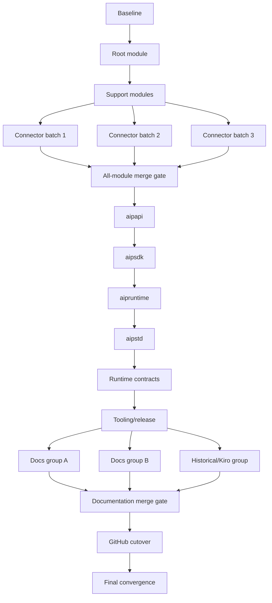

# Design Document

## Overview

This design rebrands the existing brownfield repository to **aiproxer** while preserving its current architecture and behavior. The technical problem is not choosing replacement strings; it is controlling the dependency graph so compile-time namespaces, runtime contracts, nested modules, tests, automation, release packaging, and documentation do not all break at once.

The design uses a **dependency-ordered sequence of bounded rename waves**. Every wave has explicit entry dependencies, a small mutation surface, focused validation, and a green exit checkpoint. Compile-time namespace changes are stabilized before runtime wire/config names; runtime names are stabilized before release/tooling; documentation and historical artifacts converge only after code naming freezes. The GitHub repository transfer/rename is a late owner-controlled cutover.

No production architecture layer is introduced. No code is split for Open Core/Enterprise purposes. This is an identity migration across the architecture that already exists.

### Goals

- Converge all maintained project identity on `aiproxer`.
- Use `github.com/aiproxer/aiproxer` as the canonical Go module and repository root.
- Migrate public packages to `aipapi`, `aipsdk`, and `aipruntime`, and the standard distribution to `aipstd`.
- Migrate project-owned wire/config/operational identifiers to `AIP`/`aip`/`aiproxer.com` forms as appropriate.
- Keep implementation failures local through small chronological waves and green checkpoints.
- Reach a final tracked tree with zero semantic matches from the Legacy Token Set.
- Preserve behavior, data, architecture boundaries, and test intent.

### Non-Goals

- Open Core vs Enterprise code/repository separation.
- Moving features between OSS and commercial packages.
- Licensing or entitlement redesign.
- General package restructuring, SOLID cleanup, or architecture simplification unrelated to names.
- Provider/protocol renaming.
- Backward-compatibility support for retired project-owned branding.
- Rewriting immutable Git object history or external issue/PR discussion history.

## Boundary Commitments

### This Spec Owns

- Repository/product/release naming.
- Root and nested Go module namespaces.
- Public package names and project-specific exported/local identifiers where branding is encoded.
- Standard distribution command/binary/build identity.
- Project-owned HTTP, environment, config, schema, user-agent/service, metric, tracing/logging, IPC, persistence, and generated-artifact names.
- Tests, fixtures, scripts, Make targets, workflows, release tooling, agent instructions/skills, Kiro artifacts, docs, comments, help, filenames, and directories.
- Canonical GitHub repository transfer/rename and post-cutover verification.
- Temporary migration mechanics and their mandatory removal.

### Out of Boundary

- Functional feature changes except where an external name itself is intentionally replaced.
- Commercial architecture or repository separation.
- Provider/vendor/standard protocol identifiers not owned by this project.
- Unrelated refactors discovered while touching files.
- Immutable historical Git commits and GitHub-hosted discussion content.

### Allowed Dependencies

- Existing root/core/plugin/SDK/runtime/composition architecture.
- Existing test and architecture guardrails.
- Existing connector-support and connector local-module replacement model.
- Existing GitHub repository transfer/rename behavior.
- Temporary per-file Go import aliases during a bounded public-package wave only.

### Revalidation Triggers

- Any change to the target module/repository path.
- Any change to the target public package names.
- Any decision to preserve a retired runtime name as an alias.
- Discovery of a durable branded identifier requiring data migration.
- Changes to connector module topology or local replacement strategy.
- Changes to the timing or mechanics of repository host cutover.

## Architecture

### Existing Architecture Analysis

The repository uses stable public contracts, an internal policy-owning core, frontend/backend/feature plugins, infrastructure/composition, a standard distribution command, and independent connector modules. This rebrand must preserve those ownership boundaries.

Important brownfield constraints:

- Root imports derive from one Go module path.
- Connector-support and connector directories are independent Go modules and depend on the root and sometimes on each other through local relative replacements.
- The canonical API and SDK packages are hub dependencies, so moving them causes wide compile-time fallout if not consumer-batched.
- Standard project-specific HTTP headers are centralized but consumed across frontends/config/tests/docs.
- Environment names and project identity are referenced by test infrastructure, scripts, quality/release workflows, and persistence tooling.
- Release configuration hard-codes project/build/binary identity.
- Active and archived repository documentation contains source-brand names and is explicitly in the feature scope.

### Architecture Pattern & Boundary Map

**Selected pattern:** dependency-ordered migration waves with invariant checkpoints.



The numbering above describes design waves, not task IDs. `tasks.md` decomposes each wave into agent-sized units.

**Architecture integration:**

- Existing core/plugin/SDK boundaries remain unchanged except for target names.
- No generic compatibility or rename abstraction is added.
- Compile-time namespace migration precedes runtime behavior-contract migration.
- Runtime contract migration precedes release/docs convergence.
- Repository host transfer is separated from code mutation so lack of organization permission cannot strand the codebase mid-compile failure.

### Target Namespace Matrix

| Surface | Target identity | Notes |
|---|---|---|
| Product/repository/release project | `aiproxer` | User-facing canonical brand |
| GitHub repository + Go root module | `github.com/aiproxer/aiproxer` | Canonical module/import root |
| Project FQDN namespace | `aiproxer.com` | Only where a domain-qualified project identifier is appropriate |
| Three-letter abbreviation | `aip` | Casing follows the identifier convention |
| Canonical API package | `pkg/aipapi` | Existing canonical contracts; name-only migration |
| Extension SDK package | `pkg/aipsdk` | Existing plugin/facade contracts; name-only migration |
| Public runtime package | `pkg/aipruntime` | Existing runtime facade; name-only migration |
| Standard command/binary | `aipstd` | Command dir, build ID, binary, examples |
| Custom HTTP namespace | `X-AIP-*` | Target-only final defaults |
| Environment namespace | `AIP_*` | Runtime/test/CI/scripts |
| Metrics | `aip_*` | Meaning/labels unchanged |

The mapping source side is the Legacy Token Set defined by Issue #429 and discovered baseline variants. It stays out of durable new artifacts to avoid making the specification a final-tree violation.

## Migration Control Model

### Invariant 1: One primary failure cause per wave

A wave may update its direct tests/fixtures and immediate dependents, but it must not start a second independent namespace family while the first is red. For example, the canonical API package move completes before the SDK package move begins.

### Invariant 2: Every batch exits green

A batch has:

1. a bounded path/consumer set;
2. one explicit name mapping;
3. focused compiler/tests/checks;
4. a stop condition on unexpected broad failures.

A coding agent must reduce or revert an over-broad batch rather than continue layering edits on an unexplained red tree.

### Invariant 3: Temporary aliases are local and expiring

For a Go package move, a consumer may temporarily import the **target path** under its pre-wave local identifier so the filesystem/import-path move can be separated from local symbol churn. This is preferable to a duplicate compatibility package because the compiler still resolves only the target package.

Rules:

- aliases may exist only in the active package wave;
- new code must use the target local name;
- no exported bridge package is created;
- aliases carrying Legacy Token Set spelling are removed before the wave/final convergence gate;
- no equivalent runtime dual-read shim is permitted for headers/env/config solely for branding compatibility.

### Invariant 4: Semantic classification precedes bulk editing

Before edits, generate an **untracked** migration inventory from Issue #429 patterns and baseline searches. Classify each match as:

- module/import;
- public package/Go identifier;
- runtime wire/config;
- persistence/observability;
- tooling/CI/release;
- docs/agent/Kiro/historical;
- false positive / third-party / unrelated term.

Bulk replacement may operate only on a classified target class and exact mapping. A raw three-character global substitution is prohibited.

### Invariant 5: Zero-legacy scanner is out-of-tree

The final scanner needs the source spellings to detect them, but committing those spellings would violate the target state. Therefore its pattern file/script is generated or supplied outside the tracked tree using Issue #429 and baseline inventory. The scanner checks:

- `git ls-files` path names;
- textual content of `git ls-files` entries;
- optional generated release metadata/build output for target naming.

A permanent in-repository guard may assert positive target invariants (for example canonical module path/header/env prefixes), but it must not embed retired spellings simply to reject them.

## Chronological Migration Waves

### Wave 0 — Baseline and inventory

**Purpose:** establish known-good evidence and reduce unknown scope before any rename.

Actions:

- capture current root quality/unit/architecture status;
- run existing all-module checks;
- record any pre-existing failures separately;
- build the untracked classified migration inventory;
- identify potentially durable branded identifiers;
- freeze the target namespace matrix.

**Exit:** baseline is understood and every match class has an owner/wave.

### Wave 1 — Root module namespace

Change only the root module declaration and root-module import prefix to `github.com/aiproxer/aiproxer`. Do not move `pkg` or `cmd` directories in this wave.

**Why first:** all later target package imports need the target module root. Internal Go compilation provides high-signal errors.

**Exit:** root module tidies, compiles, tests, and architecture checks pass under the target module root.

### Wave 2 — Connector-support module namespace

Migrate each connector-support module declaration plus its root dependency and local replacement. Keep relative source locations unchanged.

**Exit:** each support module independently tidies/tests with `GOWORK=off`; root remains green.

### Wave 3 — Connector modules in bounded batches

Partition independent connector modules into small batches (recommended 4–6 modules per agent task, adjusted down when a connector is complex). For each batch:

- change module declaration;
- change project-owned `require` targets;
- change root/support `replace` targets while preserving relative paths;
- update Go imports;
- tidy/test the batch immediately.

Do not open all connector `go.mod` files in one task.

**Exit:** repository all-module checks pass and no module metadata refers to the Legacy Token Set.

### Wave 4 — Canonical API package (`pkg/aipapi`)

Use a filesystem-aware move (`git mv` or equivalent), change package declarations if required, and migrate consumers in dependency zones:

1. direct public SDK/runtime and core consumers;
2. plugins/infrastructure/standard composition;
3. testkit/tools;
4. connector-support/connectors.

Tests move with the package. Temporary local aliases may keep a consumer batch compiling, but must be removed by wave exit.

**Exit:** `pkg/aipapi` is the sole canonical package path; root plus connector module gates are green.

### Wave 5 — Extension SDK package (`pkg/aipsdk`)

Repeat the package-wave method after `aipapi` is stable. Preserve subpackage layout and public contract semantics.

Consumer order:

1. core/runtime/composition/registry;
2. frontend/backend/feature plugins;
3. testkit/tools;
4. connector-support/connectors.

**Exit:** `pkg/aipsdk` is the sole SDK path; architecture/import guardrails and module checks are green.

### Wave 6 — Public runtime and standard distribution

First move the public runtime facade to `pkg/aipruntime` and migrate its consumers. Once green, move the standard distribution command to `cmd/aipstd`. Then update executable identity, command help/version branding, local build paths, and standard-distribution-specific fixtures.

**Exit:** standard distribution builds/runs from the target command path while core/plugin behavior remains unchanged.

### Wave 7 — Runtime contract namespaces

Runtime-name changes are isolated from compile-time package moves.

Subwaves:

1. `X-AIP-*` custom HTTP headers and their frontend/config/contract fixtures;
2. `AIP_*` runtime/test/CI environment names;
3. project-owned config/schema/agent/user-agent/service/IPC identifiers;
4. `aip_*` metrics and tracing/logging resource identities;
5. discovered durable branded identifiers, each with data-safe migration evidence if required.

No final dual-read of retired project names is introduced.

**Exit:** runtime behavior tests pass using target names only, with non-brand semantics unchanged.

### Wave 8 — Developer tooling, CI, release, and agent surfaces

After all source paths/contracts are target-stable:

- Make/script/checker paths and environment names;
- GitHub workflows/configuration;
- release project/build/binary/archive identity;
- install/package/container examples and generation inputs;
- repository agent skills, prompts, rules, code-review configuration.

**Exit:** local quality commands and CI/release-oriented commands invoke only target paths/names.

### Wave 9 — Documentation and historical tracked artifacts

Now perform content convergence across README/docs, steering/templates, AGENTS, active/archive Kiro artifacts, examples, comments/help, goldens, filenames, and directories.

Disjoint documentation directories may be handled in parallel only after code naming freeze. Every worker receives the same target namespace matrix and must not invent synonyms.

**Exit:** target docs refer to valid target code paths, and tracked-path/content scan is close to zero except any items explicitly reserved for host cutover.

### Wave 10 — GitHub repository cutover

This is an owner/operator checkpoint.

Preconditions:

- target organization `aiproxer` exists and acting owner has required permissions;
- target repository name is available and transfer constraints are satisfied;
- source tree/automation is target-ready;
- rollback/coordination window is agreed.

Operation:

- transfer/rename repository to `github.com/aiproxer/aiproxer`;
- update local remotes used by maintainers;
- verify Actions, branch/ruleset behavior, secrets/environments, integrations/webhooks, releases, canonical links, and repository metadata.

GitHub redirects from the former host location are accepted as external platform behavior, not a maintained compatibility contract.

### Wave 11 — Final convergence

Remove all temporary aliases/manifests/scaffolding, run the external Legacy Token Set scan over paths and contents, execute full quality/test/module/parity gates, then clean-clone from the canonical target location and perform standard distribution/release smoke verification.

**Exit:** zero legacy branding in the tracked tree; full validation green; clean clone works from target host.

## File Structure Plan

The target architecture remains structurally the same. Only branded package/command paths are renamed.

```text
.
├── cmd/
│   └── aipstd/                  # Standard distribution command
├── pkg/
│   ├── aipapi/                  # Canonical protocol-neutral contracts
│   ├── aipsdk/                  # Plugin/extension SDK and subpackages
│   ├── aipruntime/              # Public runtime facade
│   └── ...                      # Unbranded public packages unchanged
├── internal/                    # Existing core/plugins/infra boundaries unchanged
├── connector-support/           # Independent target-namespace Go modules
├── connectors/                  # Independent target-namespace Go modules
├── docs/                        # Target-name docs after code freeze
├── .github/                     # Target CI/release/repository references
├── .agents/                     # Target agent skills/instructions
└── .kiro/                       # Target steering/templates/specs, including archives
```

The implementation must not create a second compatibility copy of any moved public package.

## System Flows

### Package-wave execution



### Repository cutover flow



## Requirements Traceability

| Requirement | Design realization |
|---|---|
| 1 | Target Namespace Matrix; scope boundaries |
| 2 | Semantic inventory; out-of-tree zero-legacy scanner; Wave 9/11 |
| 3 | Waves 1–3 module dependency order |
| 4 | Waves 4–6 one-public-package-at-a-time migration |
| 5 | Wave 7 runtime contract subwaves; no dual-read rule |
| 6 | Inventory classification + persistence/observability subwaves |
| 7 | Wave 8 tooling/CI/release/agent convergence |
| 8 | Migration Control Model; green checkpoint sequence |
| 9 | Wave 10 owner/operator GitHub cutover |
| 10 | All wave gates + final clean clone/full verification |

## Components and Interfaces

This rebrand does not add production components. The following are **migration work units** used to prevent implementation drift.

| Work unit | Intent | Requirements | Output |
|---|---|---|---|
| Classified Migration Inventory | Map every source-brand occurrence to a wave or false-positive decision | 2, 6, 8 | Untracked inventory |
| Module Graph Migrator | Change root/support/connector module namespaces in dependency order | 3, 8 | Green module graph |
| Public Package Wave | Move one hub package and consumer batches without duplicate compatibility trees | 4, 8, 10 | Target-only package path |
| Runtime Contract Wave | Change live project-owned names and fixtures together | 5, 6, 10 | Target-only runtime names |
| Tooling/Release Convergence | Align automation and distribution with stabilized code names | 7, 10 | Target build/release pipeline |
| Documentation Convergence | Rewrite maintained and archived tracked text/path names | 2, 7 | Target-only docs/tree |
| Host Cutover | Move canonical repository location after code readiness | 9, 10 | Canonical GitHub target |
| Final Scanner/Gates | Prove no tracked legacy names and no behavior regressions | 2, 10 | Implementation GO/NO-GO |

## Data Models

No domain data model is intentionally changed.

For **project-branded durable identifiers discovered during inventory**, classify each item:

1. **Ephemeral identity** — safe rename with no stored-state migration (for example temporary process/service labels).
2. **Persistent but reconstructible** — rename plus rebuild/regeneration procedure.
3. **Persistent authoritative state** — explicit forward data migration, verification, and rollback before removing the previous physical name.
4. **Semantic/non-brand identifier** — do not rename.

This classification prevents a cosmetic rename from orphaning billing/session/continuity/config state.

## Error Handling and Rollback

### Batch-level failure

- Stop the active batch.
- Do not start the next dependency wave.
- Use compiler/test errors to repair the bounded set.
- If failure breadth exceeds the intended batch, revert/reduce the batch.

### Module-resolution failure

- Verify module declaration, `require`, `replace`, and import roots together.
- Run module-local checks with the same `GOWORK` behavior used by repository scripts.
- Never bypass resolution by fetching a stale external source namespace.

### Runtime-contract failure

- Keep change and tests in the same subwave.
- Do not restore a permanent legacy alias to make tests green.
- Fix callers/fixtures/configuration to use the target contract.

### Persistent-identifier failure

- Stop before destructive rename.
- Restore from rollback path or retain physical storage until migration proof is complete.
- Separate storage migration from unrelated name waves if necessary.

### GitHub cutover failure

- Do not mutate additional source namespaces to compensate.
- Keep source at the target module identity and hold the external host step until permissions/name constraints are resolved.
- If transfer partially succeeds, verify canonical repository state before proceeding to final convergence.

## Testing Strategy

### Per-batch focused tests

Every task names the smallest useful proof set: package `go test`, module-local `go test ./...`, focused contract tests, build of `./cmd/aipstd`, or a relevant script/checker.

### Wave-boundary tests

- Root module wave: root tidy/build/unit/architecture checks.
- Connector-support and connector waves: existing all-module checks plus module-local tests.
- `aipapi`/`aipsdk`/`aipruntime` waves: public package tests, direct consumer zones, root unit/architecture checks, then module checks for downstream connectors.
- Runtime contract wave: frontend/core/config/testkit contract tests plus affected integration fixtures.
- Tooling/release wave: quality scripts, CI-equivalent local commands where feasible, release config validation/build.
- Final convergence: full repository quality/test/parity/module gates and clean-clone smoke.

### Positive identity assertions

Where durable tests are useful, prefer positive assertions such as:

- root module equals `github.com/aiproxer/aiproxer`;
- public package paths are `pkg/aipapi`, `pkg/aipsdk`, `pkg/aipruntime`;
- project custom headers begin with `X-AIP-`;
- maintained project env names begin with `AIP_`;
- release standard binary is `aipstd`.

These tests enforce the target state without embedding retired spellings.

## Migration Strategy

The overall migration is intentionally sequential on the critical path. Parallelism is permitted only inside a wave where files/modules are dependency-independent and a merge checkpoint follows before the next wave.



Connector batches may be parallel only after the support-module checkpoint and only if they do not modify shared support/root files. Documentation batches may be parallel only after source/tooling naming freeze. Public package waves are sequential because each is a hub dependency of the next and because separating them dramatically improves failure attribution.

## Brownfield Design Validation

### Validation findings incorporated

1. **Multi-module graph:** design repaired to migrate root, connector-support, and connector modules separately.
2. **Hub package blast radius:** design repaired to migrate one public package family at a time, with consumer-zone batches.
3. **Runtime compatibility conflict:** design explicitly rejects permanent dual-name compatibility because Issue #429 requires a clean identity break.
4. **Durable state risk:** design adds discovery/classification and data-safe migration for genuinely branded persisted identifiers.
5. **Final-scan self-reference:** design keeps the source pattern inventory out of the tracked tree so the new spec does not defeat its own zero-legacy criterion.
6. **Host permission uncertainty:** repository transfer is a late operator checkpoint rather than an early prerequisite that could block code migration.
7. **Commercial-boundary creep:** explicit boundary prevents this rename from becoming an Open Core/Enterprise split.

**Verdict: GO.** The design is implementation-ready provided coding agents respect task dependencies and do not collapse the staged waves into a single repository-wide replacement.
