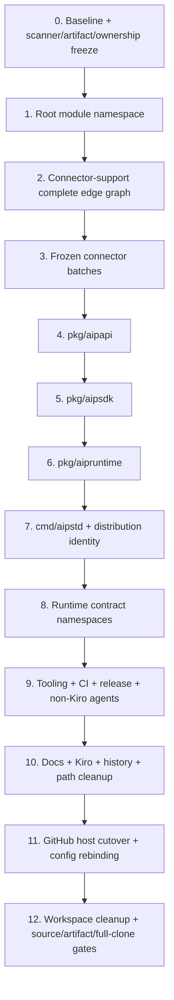
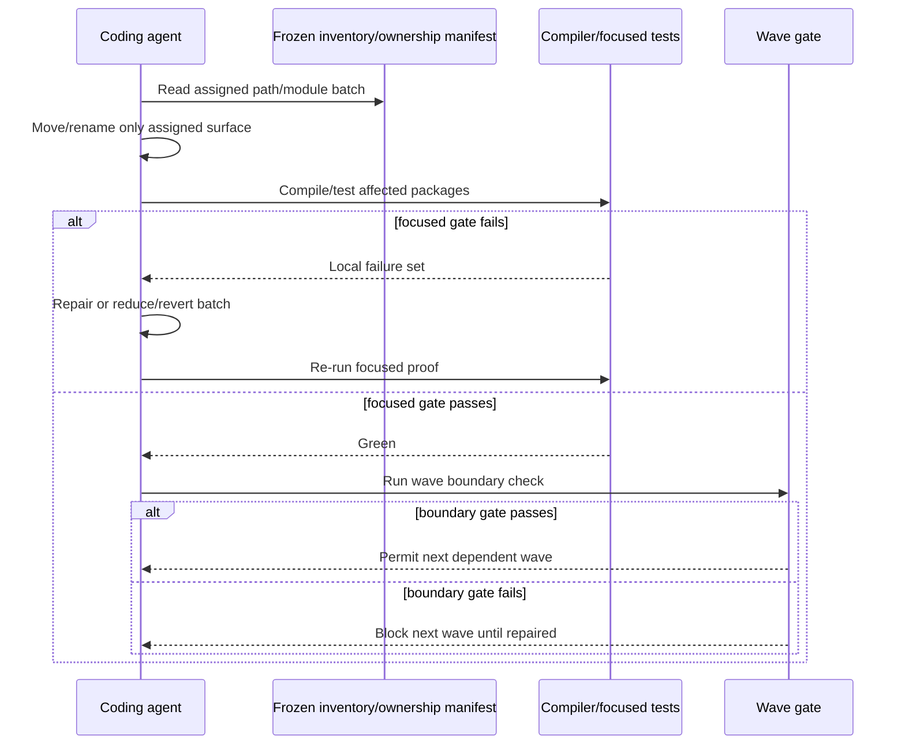
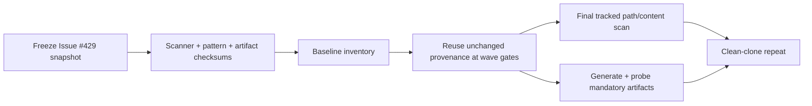
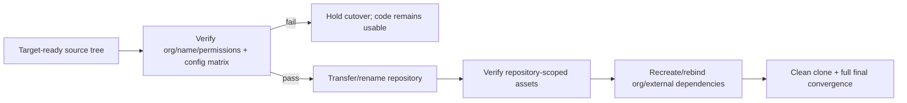
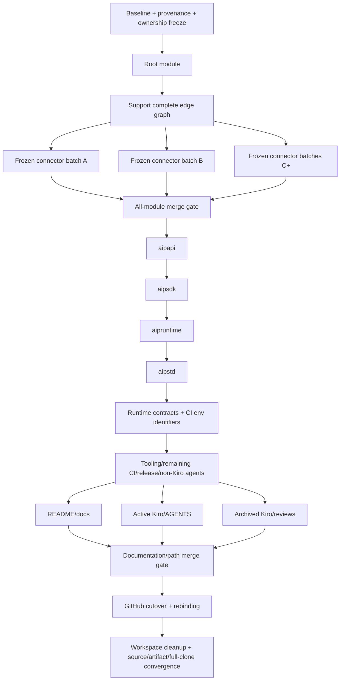

# Design Document

## Overview

This design rebrands the existing brownfield repository to **aiproxer** while preserving its current architecture and behavior. The technical problem is not choosing replacement strings; it is controlling a repository-wide dependency graph so compile-time namespaces, runtime contracts, nested modules, tests, automation, release packaging, generated artifacts, documentation, and repository hosting do not all break at once.

The design uses a **dependency-ordered sequence of bounded rename waves**. Every wave has explicit entry dependencies, deterministic ownership, a small mutation surface, focused validation, and a green exit checkpoint. Compile-time namespace changes stabilize before runtime wire/config names; runtime names stabilize before broad tooling/release convergence; documentation and historical artifacts converge only after code naming freezes. The GitHub repository transfer/rename remains a late owner-controlled cutover.

No production architecture layer is introduced. No code is split for Open Core/Enterprise purposes. This is an identity migration across the architecture that already exists.

### Goals

- Converge all maintained project identity on `aiproxer`.
- Use `github.com/aiproxer/aiproxer` as the canonical Go module and repository root.
- Migrate public packages to `aipapi`, `aipsdk`, and `aipruntime`, and the standard distribution to `aipstd`.
- Migrate project-owned wire/config/operational identifiers to `AIP`/`aip`/`aiproxer.com` forms as appropriate.
- Keep implementation failures local through small chronological waves and green checkpoints.
- Make parallel work deterministic through immutable module/path ownership.
- Make zero-legacy verification reproducible across agents through frozen scanner provenance.
- Reach a final tracked tree and generated distribution set with zero semantic matches from the Legacy Token Set.
- Preserve behavior, data, architecture boundaries, and test intent.

### Non-Goals

- Open Core vs Enterprise code/repository separation.
- Moving features between OSS and commercial packages.
- Licensing or entitlement redesign.
- General package restructuring, SOLID cleanup, or architecture simplification unrelated to names.
- Provider/protocol renaming.
- Backward-compatibility support for retired project-owned branding.
- Rewriting immutable Git object history or external issue/PR discussion history.

## Boundary Commitments

### This Spec Owns

- Repository/product/release naming.
- Root and nested Go module namespaces.
- Public package names and project-specific exported/local identifiers where branding is encoded.
- Standard distribution command/binary/build identity.
- Project-owned HTTP, environment, config, schema, user-agent/service, metric, tracing/logging, IPC, persistence, and generated-artifact names.
- Tests, fixtures, scripts, Make targets, workflows, release tooling, agent instructions/skills, Kiro artifacts, docs, comments, help, filenames, and directories.
- Canonical GitHub repository transfer/rename and post-cutover verification/rebinding.
- Temporary migration mechanics and their mandatory removal from the workspace.
- Out-of-tree scanner provenance/evidence used only to prove convergence.

### Out of Boundary

- Functional feature changes except where an external name itself is intentionally replaced.
- Commercial architecture or repository separation.
- Provider/vendor/standard protocol identifiers not owned by this project.
- Unrelated refactors discovered while touching files.
- Immutable historical Git commits and GitHub-hosted discussion content.

### Allowed Dependencies

- Existing root/core/plugin/SDK/runtime/composition architecture.
- Existing test and architecture guardrails.
- Existing connector-support and connector local-module replacement model.
- Existing GitHub repository transfer/rename behavior.
- Temporary per-file Go import aliases during a bounded public-package wave only.
- Out-of-tree scanner/pattern/evidence files with recorded checksums.

### Revalidation Triggers

- Any change to the target module/repository path.
- Any change to the target public package names.
- Any decision to preserve a retired runtime name as an alias.
- Discovery of a durable branded identifier requiring data migration.
- Changes to connector module topology or local replacement strategy.
- Changes to the timing or mechanics of repository host cutover.
- Any post-freeze change to Issue #429 that changes the Legacy Token Set.
- Any scanner implementation/contract or artifact-manifest change after provenance freeze.

## Architecture

### Existing Architecture Analysis

The repository uses stable public contracts, an internal policy-owning core, frontend/backend/feature plugins, infrastructure/composition, a standard distribution command, and independent connector modules. This rebrand must preserve those ownership boundaries.

Important brownfield constraints:

- Root imports derive from one Go module path.
- Connector-support and connector directories are independent Go modules and depend on the root and sometimes on each other through local relative replacements.
- The canonical API and SDK packages are hub dependencies, so moving them causes wide compile-time fallout if not consumer-batched.
- Standard project-specific HTTP headers are centralized but consumed across frontends/config/tests/docs.
- Environment names and project identity are referenced by test infrastructure, scripts, CI workflows, quality/release tooling, and persistence infrastructure.
- A single `.github/**` workflow can contain environment names, module paths, command paths, artifact names, and repository names owned by different migration concerns; identifier-family ownership must therefore be explicit and sequential.
- Release configuration hard-codes project/build/binary identity and can produce artifacts not present in the tracked source tree.
- Active and archived repository documentation contains source-brand names and is explicitly in the feature scope.
- Repository transfer preserves many repository-scoped assets, but organization/owner-scoped policy and access dependencies can require target-owner recreation or rebinding.

### Architecture Pattern & Boundary Map

**Selected pattern:** dependency-ordered migration waves with deterministic ownership and invariant checkpoints.



The numbering above describes design waves, not task IDs. `tasks.md` decomposes each wave into agent-sized units.

**Architecture integration:**

- Existing core/plugin/SDK boundaries remain unchanged except for target names.
- No generic compatibility or rename abstraction is added.
- Compile-time namespace migration precedes runtime behavior-contract migration.
- Runtime contract migration precedes broad release/docs convergence.
- Same-file sequential edits are permitted only when identifier-family ownership is explicitly disjoint, as with `.github/**` environment-name substitutions vs later non-environment CI identity changes.
- Repository host transfer is separated from code mutation so lack of organization permission cannot strand the codebase mid-compile failure.

### Target Namespace Matrix

| Surface | Target identity | Notes |
|---|---|---|
| Product/repository/release project | `aiproxer` | User-facing canonical brand |
| GitHub repository + Go root module | `github.com/aiproxer/aiproxer` | Canonical module/import root |
| Project FQDN namespace | `aiproxer.com` | Only where a domain-qualified project identifier is appropriate |
| Three-letter abbreviation | `aip` | Casing follows the identifier convention |
| Canonical API package | `pkg/aipapi` | Existing canonical contracts; name-only migration |
| Extension SDK package | `pkg/aipsdk` | Existing plugin/facade contracts; name-only migration |
| Public runtime package | `pkg/aipruntime` | Existing runtime facade; name-only migration |
| Standard command/binary | `aipstd` | Command dir, build ID, binary, examples |
| Custom HTTP namespace | `X-AIP-*` | Target-only final defaults |
| Environment namespace | `AIP_*` | Runtime/test/CI/scripts |
| Metrics | `aip_*` | Meaning/labels unchanged |

The mapping source side is the Legacy Token Set defined by the frozen Issue #429 source revision and discovered baseline semantic variants. Concrete retired spellings stay out of durable new artifacts to avoid making the specification a final-tree violation.

## Migration Control Model

### Invariant 1: One primary failure cause per wave

A wave may update its direct tests/fixtures and immediate dependents, but it must not start a second independent namespace family while the first is red. For example, the canonical API package move completes before the SDK package move begins.

### Invariant 2: Every batch exits green

A batch has:

1. a bounded path/consumer set;
2. one explicit name mapping or identifier-family ownership;
3. focused compiler/tests/checks;
4. a stop condition on unexpected broad failures.

A coding agent must reduce or revert an over-broad batch rather than continue layering edits on an unexplained red tree.

### Invariant 3: Temporary aliases are local and expiring

For a Go package move, a consumer may temporarily import the **target path** under its pre-wave local identifier so the filesystem/import-path move can be separated from local symbol churn. This is preferable to a duplicate compatibility package because the compiler still resolves only the target package.

Rules:

- aliases may exist only in the active package wave;
- new code must use the target local name;
- no exported bridge package is created;
- aliases carrying Legacy Token Set spelling are removed before the package-wave gate;
- no equivalent runtime dual-read shim is permitted for headers/env/config solely for branding compatibility;
- final convergence removes all migration-only helpers from the workspace, not merely from Git tracking.

### Invariant 4: Semantic classification precedes bulk editing

Before edits, generate an out-of-tree migration inventory from the frozen Issue #429 source revision and baseline searches. Classify each match as:

- module/import;
- public package/Go identifier;
- runtime wire/config;
- persistence/observability;
- tooling/CI/release;
- docs/agent/Kiro/historical;
- generated artifact surface;
- false positive / third-party / unrelated term.

Bulk replacement may operate only on a classified target class and exact mapping. A raw three-character global substitution is prohibited.

### Invariant 5: Scanner provenance is frozen and reproducible

The scanner needs retired source spellings but those spellings must not become permanent tracked content. Before the first scan, freeze an **out-of-tree provenance bundle** containing:

- Issue #429 URL and `updated_at` value used as the source revision;
- SHA-256 of the exact UTF-8 issue body snapshot;
- scanner contract identifier `aiproxer-rebrand-scan/v1`;
- SHA-256 of the scanner implementation used for all gates;
- deterministic generated Legacy Token Set pattern file plus SHA-256;
- generated-artifact manifest plus SHA-256;
- baseline commit SHA;
- canonical invocation.

Canonical invocation contract:

```text
python3 "$AIP_REBRAND_SCANNER" scan \
  --repo . \
  --patterns "$AIP_REBRAND_PATTERNS" \
  --artifacts "$AIP_REBRAND_ARTIFACT_MANIFEST" \
  --format json
```

The implementation log or CI artifact stores the metadata/checksums and results, not the retired spellings in the repository. Every later scan reuses the same checksummed bundle. If Issue #429 changes materially after freeze, the owner must explicitly approve a rebaseline; prior downstream scan evidence becomes stale and must be regenerated.

### Invariant 6: Generated artifacts are mandatory scan inputs when producible

The baseline inventory creates an artifact manifest from repository build/release producers. If an artifact family can be produced in the implementation environment, final convergence must produce and scan it.

Per-artifact probes include, as applicable:

- release archives: archive filename, entry names, extracted tracked/textual payloads, and included executable probes;
- release metadata/checksums/package manifests: filenames and textual metadata;
- standard executable: filename, `--help`/`--version` output where supported, and Go build/module metadata (`go version -m` or equivalent);
- package/container outputs: package/image/tag names, labels, environment/entrypoint/config metadata, and textual manifests;
- other generated distributables discovered by the inventory: explicit probe recorded in the artifact manifest.

A tracked-tree-only zero result is insufficient when the repository's enabled release/build pipeline produces additional artifacts.

### Invariant 7: Parallel ownership is immutable before dispatch

Parallel workers never choose “the next” module or broad overlapping directory at execution time.

Before any parallel wave:

- freeze an immutable, non-overlapping module/path assignment in the implementation handoff;
- record a checksum of the assignment;
- assign each connector/path exactly once;
- reserve shared files for the serial merge/close task;
- require the merge checkpoint before the next dependency wave.

### Invariant 8: CI and repository-document ownership is explicit

Some files are touched in more than one chronological wave, but identifier ownership must not overlap.

**`.github/**` ownership:**

- Runtime environment-name subwave owns **only project-owned environment-variable identifiers** inside `.github/**`, along with the same environment names in runtime/tests/scripts.
- Later CI convergence owns repository/module/command/artifact/release/path branding inside `.github/**` and must not re-derive environment mappings.
- CI convergence ends with a full Legacy Token Set scan of `.github/**` so the two sequential passes converge on one target-only workflow state.

**Agent/Kiro/document ownership:**

- Non-Kiro active agent automation: `.agents/skills/**`, `.agents/catalog.json`, `.cursor/**`, `.jules/**`, `.coderabbit.yaml`, and equivalent non-Kiro agent/rule configuration discovered by inventory. It explicitly excludes `.agents/reviews/**`, root `AGENTS.md`, and all `.kiro/**`.
- Active Kiro/repository instructions: root `AGENTS.md`, `.kiro/AGENTS.md`, `.kiro/steering/**`, `.kiro/rules/**`, `.kiro/settings/**`, `.kiro/templates/**`, and active `.kiro/specs/*` excluding `.kiro/specs/archive/**`.
- Historical tracked review/spec material: `.kiro/specs/archive/**`, `.agents/reviews/**`, and other inventory-classified historical review paths not owned by active agent automation.

These path partitions are disjoint and may be parallelized only after code/tooling naming freeze.

## Chronological Migration Waves

### Wave 0 — Baseline, provenance, inventory, and ownership freeze

**Purpose:** establish known-good evidence and reduce unknown scope before any rename.

Actions:

- capture current root quality/unit/architecture status;
- run existing all-module checks;
- record any pre-existing failures separately;
- snapshot Issue #429 and freeze `aiproxer-rebrand-scan/v1` provenance/checksums;
- build the classified migration inventory;
- enumerate all producible generated artifact families and their scan probes;
- identify potentially durable branded identifiers;
- freeze the target namespace matrix;
- freeze non-overlapping connector batch membership before parallel connector work.

**Exit:** baseline is understood; scanner provenance and artifact manifest are reproducible; every match class has an owner/wave; every connector belongs to exactly one frozen batch.

### Wave 1 — Root module namespace

Change only the root module declaration and root-module import prefix to `github.com/aiproxer/aiproxer`. Do not move `pkg` or `cmd` directories in this wave.

**Why first:** all later target package imports need the target module root. Internal Go compilation provides high-signal errors.

**Exit:** root module tidies, compiles, tests, and architecture checks pass under the target module root.

### Wave 2 — Connector-support complete dependency graph

For each connector-support module, migrate:

- module declaration;
- source imports of root/support project modules;
- root-module `require`/`replace` edges;
- every inter-support `require`/`replace` edge;
- local replacement targets while preserving intended relative source topology.

Process support modules in dependency order and validate each module before the next. After all support modules are green, validate the complete support graph so no inter-support edge remains on the source namespace.

**Exit:** every support module independently tidies/tests with `GOWORK=off`; every support-to-root/support-to-support edge resolves to the target namespace; root remains green.

### Wave 3 — Connector modules in frozen bounded batches

Use only the immutable module-to-batch assignment frozen in Wave 0. Recommended batch size is 4–6 modules, adjusted downward for complex connectors. For each assigned module:

- change module declaration;
- change project-owned `require` targets;
- change root/support `replace` targets while preserving relative paths;
- update Go imports;
- tidy/test immediately.

Parallel workers must not edit support/root/shared script files and may not reassign modules. The serial close task proves every connector was covered exactly once.

**Exit:** repository all-module checks pass and no module metadata/import edge refers to the Legacy Token Set.

### Wave 4 — Canonical API package (`pkg/aipapi`)

Use a filesystem-aware move (`git mv` or equivalent), change package declarations if required, and migrate consumers in dependency zones:

1. direct public SDK/runtime and core consumers;
2. plugins/infrastructure/standard composition;
3. testkit/tools;
4. connector-support/connectors.

Tests move with the package. Temporary local aliases may keep a consumer batch compiling, but must be removed by wave exit.

**Exit:** `pkg/aipapi` is the sole canonical package path; root plus connector module gates are green.

### Wave 5 — Extension SDK package (`pkg/aipsdk`)

Repeat the package-wave method after `aipapi` is stable. Preserve subpackage layout and public contract semantics.

Consumer order:

1. core/runtime/composition/registry;
2. frontend/backend/feature plugins;
3. testkit/tools;
4. connector-support/connectors.

**Exit:** `pkg/aipsdk` is the sole SDK path; architecture/import guardrails and module checks are green.

### Wave 6 — Public runtime and standard distribution

First move the public runtime facade to `pkg/aipruntime` and migrate its consumers. Once green, move the standard distribution command to `cmd/aipstd`. Then update executable identity, command help/version branding, local build paths, and standard-distribution-specific fixtures.

**Exit:** standard distribution builds/runs from the target command path while core/plugin behavior remains unchanged.

### Wave 7 — Runtime contract namespaces

Runtime-name changes are isolated from compile-time package moves.

Subwaves:

1. `X-AIP-*` custom HTTP headers and their frontend/config/contract fixtures;
2. `AIP_*` runtime/test/script environment names **plus only environment-variable identifiers inside `.github/**`**;
3. project-owned config/schema/user-agent/service/IPC identifiers;
4. `aip_*` metrics and tracing/logging resource identities;
5. discovered durable branded identifiers, each with data-safe migration evidence if required.

No final dual-read of retired project names is introduced. The `.github/**` files touched in subwave 2 are revisited later only for non-environment identifier families.

**Exit:** runtime behavior tests pass using target names only, with non-brand semantics unchanged; CI files contain the target environment names even though broader CI naming convergence is still pending.

### Wave 8 — Developer tooling, CI, release, and non-Kiro agent surfaces

After all source paths/contracts are target-stable:

- Make/script/checker paths and non-environment project identities;
- `.github/**` repository/module/command/artifact/path/release identities other than the already-migrated environment-name family;
- full cross-wave `.github/**` zero-legacy scan;
- release project/build/binary/archive identity;
- install/package/container generation inputs;
- active non-Kiro agent automation under the exact path partition defined by Invariant 8.

**Exit:** local quality commands and CI/release-oriented commands invoke only target paths/names; `.github/**` has no semantic Legacy Token Set matches; non-Kiro active agent automation is target-only.

### Wave 9 — Documentation, active Kiro, and historical tracked artifacts

Perform content convergence after code/tooling/release naming freezes. Parallel workers use the disjoint path partitions from Invariant 8:

- README and `docs/**` plus documentation-specific filenames/directories;
- active Kiro/repository instruction partition;
- historical Kiro/review partition.

After those workers merge, a serial remainder task handles source comments/help/goldens/examples/config samples and any inventory-classified path not already owned.

**Exit:** target docs refer to valid target code paths; each path was owned exactly once; tracked-path/content scan is zero except external host state reserved for cutover.

### Wave 10 — GitHub repository cutover and configuration rebinding

This is an owner/operator checkpoint.

Preconditions:

- target organization `aiproxer` exists and acting owner has required permissions;
- target repository name is available and transfer constraints are satisfied;
- source tree/automation is target-ready;
- rollback/coordination window is agreed;
- host configuration has been inventoried and classified.

Configuration classes:

| Class | Examples | Required handling |
|---|---|---|
| Repository-scoped, expected to remain associated | issues/PRs/history, repository settings, repository webhooks, repository secrets, deploy keys, releases, repository-level rules/configuration | Verify after transfer; do not assume success merely because transfer completed |
| Organization/owner-scoped or external | organization rulesets/policies, organization secrets/variables, teams/role bindings, GitHub App/install access, package/container registry permissions, Pages custom-domain/DNS dependencies, external integrations | Recreate/rebind at target owner when required, then verify |
| Platform-managed redirect | old repository URL redirect | Accept as GitHub behavior; never use as maintained canonical identity |

Operation:

- transfer/rename repository to `github.com/aiproxer/aiproxer`;
- update local remotes used by maintainers;
- verify repository-scoped assets;
- recreate/rebind target-owner dependencies where required;
- verify Actions, branch/ruleset behavior, secrets/environments, integrations/webhooks, releases, packages/containers, Pages/DNS where applicable, canonical links, and repository metadata.

### Wave 11 — Final convergence

Remove all migration-only aliases/manifests/helper shims/compatibility bridges from the workspace, leaving only external scanner inputs/evidence outside the repository for verification. Then:

1. run the frozen scanner over tracked paths and textual tracked contents;
2. generate every artifact family required by the frozen artifact manifest and run its defined probes;
3. run full root quality/test/architecture/parity gates and full all-module checks;
4. clean-clone from the canonical target location;
5. in the clean clone, rerun the platform-appropriate complete all-module validation with CI-equivalent `GOWORK` behavior, standard distribution/release smoke, generated-artifact probes, and the same frozen zero-legacy scan.

**Exit:** zero legacy branding in tracked source and generated distributables; full validation green; clean clone works from target host with the complete module graph.

## File Structure Plan

The target architecture remains structurally the same. Only branded package/command paths are renamed.

```text
.
├── cmd/
│   └── aipstd/                  # Standard distribution command
├── pkg/
│   ├── aipapi/                  # Canonical protocol-neutral contracts
│   ├── aipsdk/                  # Plugin/extension SDK and subpackages
│   ├── aipruntime/              # Public runtime facade
│   └── ...                      # Unbranded public packages unchanged
├── internal/                    # Existing core/plugins/infra boundaries unchanged
├── connector-support/           # Independent target-namespace Go modules
├── connectors/                  # Independent target-namespace Go modules
├── docs/                        # Target-name docs after code freeze
├── .github/                     # CI/repository automation; two ordered identifier-family passes
├── .agents/                     # Active skills vs historical reviews partitioned explicitly
└── .kiro/                       # Active vs archive paths partitioned explicitly
```

The implementation must not create a second compatibility copy of any moved public package.

## System Flows

### Package-wave execution



### Scanner/artifact evidence flow



### Repository cutover flow



## Requirements Traceability

| Requirement | Design realization |
|---|---|
| 1 | Target Namespace Matrix; scope boundaries |
| 2 | Semantic inventory; mandatory source + generated-artifact scanner; Waves 9/11 |
| 3 | Waves 1–3 complete module dependency order and frozen batches |
| 4 | Waves 4–6 one-public-package-at-a-time migration |
| 5 | Wave 7 runtime contract subwaves; explicit `.github/**` env ownership; no dual-read rule |
| 6 | Inventory classification + persistence/observability subwaves |
| 7 | Wave 8 tooling/CI/release/non-Kiro agent convergence; `.github/**` cross-wave scan |
| 8 | Migration Control Model; scanner provenance; immutable ownership; green checkpoint sequence |
| 9 | Wave 10 repository-vs-organization configuration matrix and owner/operator cutover |
| 10 | Workspace cleanup; full source/artifact/module gates; full clean-clone verification |

## Components and Interfaces

This rebrand does not add production components. The following are **migration work units** used to prevent implementation drift.

| Work unit | Intent | Requirements | Output |
|---|---|---|---|
| Scanner Provenance Bundle | Freeze Issue source, scanner, patterns, artifact manifest, invocation, and checksums | 2, 8, 10 | Reproducible out-of-tree evidence |
| Classified Migration Inventory | Map every source-brand occurrence to a wave or false-positive decision | 2, 6, 8 | Checksummed out-of-tree inventory |
| Ownership Manifest | Assign every connector/path in a parallel wave exactly once | 3, 8 | Immutable handoff |
| Module Graph Migrator | Change root/support/connector module namespaces in dependency order | 3, 8 | Green module graph |
| Public Package Wave | Move one hub package and consumer batches without duplicate compatibility trees | 4, 8, 10 | Target-only package path |
| Runtime Contract Wave | Change live project-owned names and fixtures together | 5, 6, 10 | Target-only runtime names |
| CI Ownership Passes | First environment identifiers, then non-environment identities, followed by whole-workflow scan | 5, 7, 8 | Target-only `.github/**` |
| Tooling/Release Convergence | Align automation/distribution and generate scan-worthy artifacts | 2, 7, 10 | Target build/release pipeline |
| Documentation/Kiro Convergence | Rewrite maintained and archived tracked text/path names with disjoint ownership | 2, 7, 8 | Target-only docs/tree |
| Host Cutover | Transfer repository and verify/rebind repository/organization configuration | 9, 10 | Canonical GitHub target |
| Final Scanner/Gates | Prove no source/artifact legacy names and no behavior regressions | 2, 10 | Implementation GO/NO-GO |

## Data Models

No domain data model is intentionally changed.

For **project-branded durable identifiers discovered during inventory**, classify each item:

1. **Ephemeral identity** — safe rename with no stored-state migration (for example temporary process/service labels).
2. **Persistent but reconstructible** — rename plus rebuild/regeneration procedure.
3. **Persistent authoritative state** — explicit forward data migration, verification, and rollback before removing the previous physical name.
4. **Semantic/non-brand identifier** — do not rename.

This classification prevents a cosmetic rename from orphaning billing/session/continuity/config state.

### Migration evidence records

Implementation-only evidence (not permanent source-brand content) should record:

- baseline commit and command results;
- scanner provenance/checksums;
- classified inventory checksum;
- artifact-manifest checksum and per-artifact probe results;
- immutable connector/path ownership manifest checksum;
- durable identifier classification/migration evidence;
- repository-host configuration classification and post-cutover verification.

These records may live in CI artifacts or an external implementation log; they must not require committing retired spellings to the final tracked tree.

## Error Handling and Rollback

### Batch-level failure

- Stop the active batch.
- Do not start the next dependency wave.
- Use compiler/test errors to repair the bounded set.
- If failure breadth exceeds the intended batch, revert/reduce the batch.
- Do not reassign frozen parallel ownership ad hoc; update/rechecksum the manifest explicitly if a repartition is necessary before work resumes.

### Module-resolution failure

- Verify module declaration, `require`, `replace`, and source import roots together.
- For connector-support failures, inspect support-to-support edges as well as root edges.
- Run module-local checks with the same `GOWORK` behavior used by repository scripts.
- Never bypass resolution by fetching a stale external source namespace.

### Runtime-contract / CI failure

- Keep change and tests in the same subwave.
- Do not restore a permanent legacy alias to make tests green.
- For `.github/**`, distinguish environment-name ownership from later non-environment CI ownership rather than letting two tasks apply overlapping replacements.
- Run the whole `.github/**` cross-wave scan when CI convergence closes.

### Persistent-identifier failure

- Stop before destructive rename.
- Restore from rollback path or retain physical storage until migration proof is complete.
- Separate storage migration from unrelated name waves if necessary.

### Scanner-provenance drift

- If the Issue source, scanner, pattern generator, or artifact manifest changes after freeze, do not compare new results to old evidence as if they were equivalent.
- Require explicit owner-approved rebaseline, new checksums, and rerun all affected downstream zero-legacy gates.

### GitHub cutover failure

- Do not mutate additional source namespaces to compensate.
- Keep source at the target module identity and hold the external host step until permissions/name constraints are resolved.
- If transfer partially succeeds, verify canonical repository state before proceeding.
- If a repository-scoped asset is missing or an organization-scoped dependency is unavailable, recreate/rebind only that host configuration; do not introduce source-level legacy compatibility.

## Testing Strategy

### Per-batch focused tests

Every task names the smallest useful proof set: package `go test`, module-local `go test ./...`, focused contract tests, build of `./cmd/aipstd`, or a relevant script/checker.

### Wave-boundary tests

- Root module wave: root tidy/build/unit/architecture checks.
- Connector-support wave: every support module plus complete inter-support edge validation.
- Connector wave: frozen per-module batches plus existing all-module scripts.
- `aipapi`/`aipsdk`/`aipruntime` waves: public package tests, direct consumer zones, root unit/architecture checks, then module checks for downstream connectors.
- Runtime contract wave: frontend/core/config/testkit contract tests plus affected integration fixtures; environment-name changes include only the environment identifier family inside `.github/**`.
- CI/tooling wave: quality scripts, full `.github/**` source-brand scan after remaining CI edits, CI-equivalent commands where feasible.
- Release wave: release config validation, local snapshot/build, and artifact probes from the frozen manifest.
- Final convergence: full repository quality/test/parity/module gates plus mandatory source/artifact scans.
- Clean clone: **the same complete all-module script and CI-equivalent `GOWORK` behavior**, not a representative connector subset, plus standard distribution/release/configuration smoke and repeated source/artifact scans.

### Positive identity assertions

Where durable tests are useful, prefer positive assertions such as:

- root module equals `github.com/aiproxer/aiproxer`;
- public package paths are `pkg/aipapi`, `pkg/aipsdk`, `pkg/aipruntime`;
- project custom headers begin with `X-AIP-`;
- maintained project env names begin with `AIP_`;
- release standard binary is `aipstd`.

These tests enforce the target state without embedding retired spellings.

## Migration Strategy

The overall migration is intentionally sequential on the critical path. Parallelism is permitted only inside a wave where an immutable ownership manifest proves modules/paths are dependency-independent and a merge checkpoint follows before the next wave.



Connector batches may be parallel only after support-module validation and ownership freeze, and only if they do not modify shared support/root files. Documentation/Kiro/archive batches may be parallel only after source/tooling naming freeze and only under the explicit path partitions above. Public package waves are sequential because each is a hub dependency of the next and because separating them dramatically improves failure attribution.

## Brownfield Design Validation

### Validation findings incorporated

1. **Multi-module graph:** root, connector-support, and connector modules migrate separately; support source imports plus inter-support `require`/`replace` edges are explicit.
2. **Hub package blast radius:** one public package family migrates at a time with consumer-zone batches.
3. **Runtime compatibility conflict:** permanent dual-name compatibility remains prohibited because Issue #429 requires a clean identity break.
4. **Durable state risk:** discovery/classification and data-safe migration cover genuinely branded persisted identifiers.
5. **Scanner self-reference and reproducibility:** source patterns remain out-of-tree, but the Issue snapshot, scanner contract/implementation, pattern set, artifact manifest, and invocation are frozen/checksummed.
6. **Generated artifact escape:** producible release/build/package/container outputs are mandatory final scan inputs through explicit per-artifact probes.
7. **Parallel connector ambiguity:** immutable module-to-batch membership is frozen before parallel execution.
8. **CI same-file overlap:** environment identifiers inside `.github/**` belong to the runtime env subwave; all remaining CI branding belongs to the later CI wave; a full cross-wave scan closes the surface.
9. **Agent/Kiro path overlap:** active non-Kiro agent automation, active Kiro/AGENTS material, and archived Kiro/review material have disjoint exact path partitions.
10. **Workspace shim ambiguity:** final convergence removes migration-only helpers from the workspace; only external scanner inputs/evidence may remain.
11. **Host configuration uncertainty:** repository transfer is a late operator checkpoint with repository-vs-organization configuration classification, verification, and recreation/rebinding where necessary.
12. **Clean-clone undercoverage:** the target-host clean clone runs the complete all-module gate with CI-equivalent `GOWORK` behavior, not a representative subset.
13. **Commercial-boundary creep:** explicit boundary prevents this rename from becoming an Open Core/Enterprise split.

**Verdict: GO.** The design is implementation-ready provided coding agents respect task dependencies, frozen ownership/provenance, and do not collapse the staged waves into a single repository-wide replacement.
