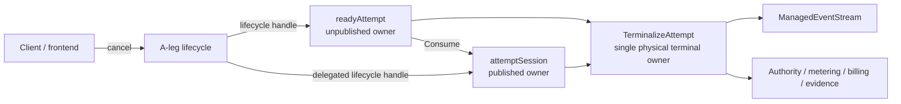
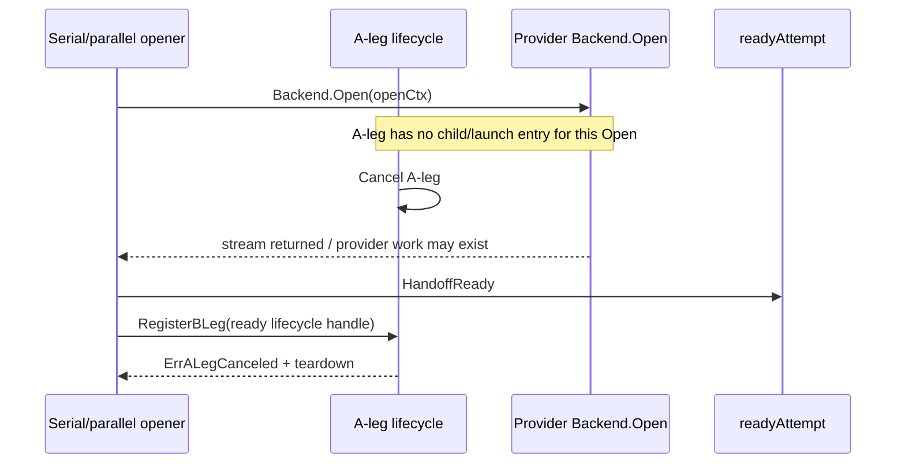
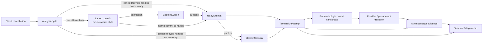
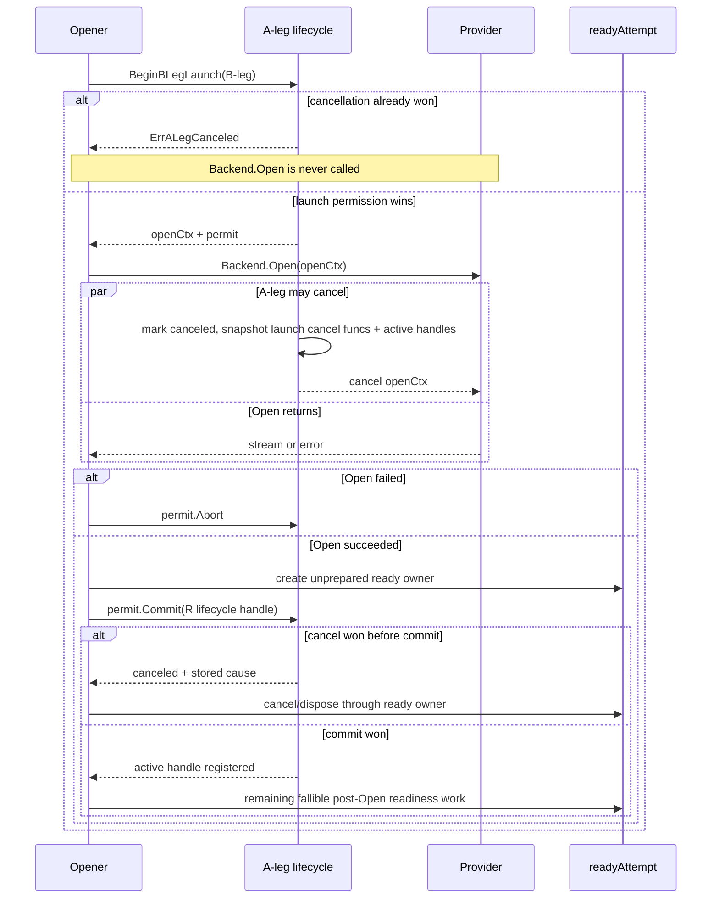
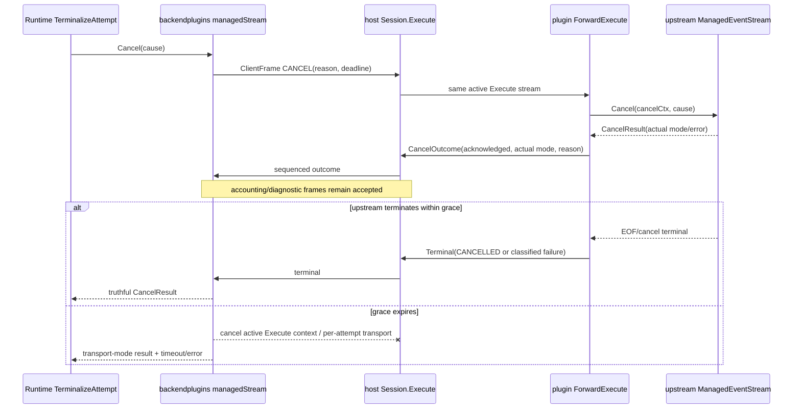
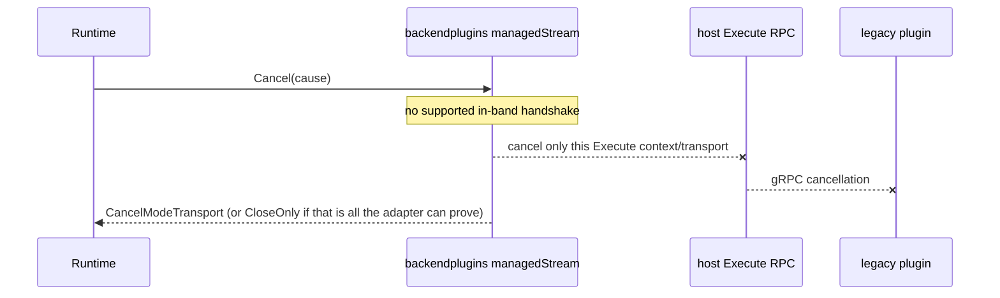
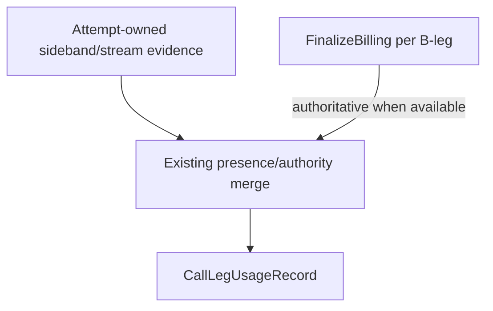
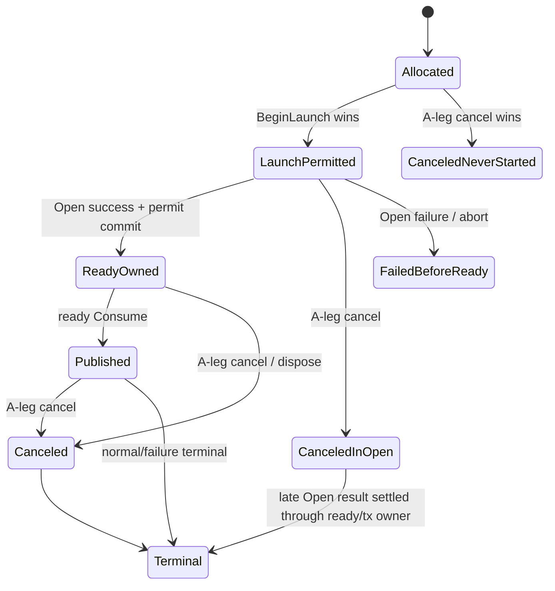
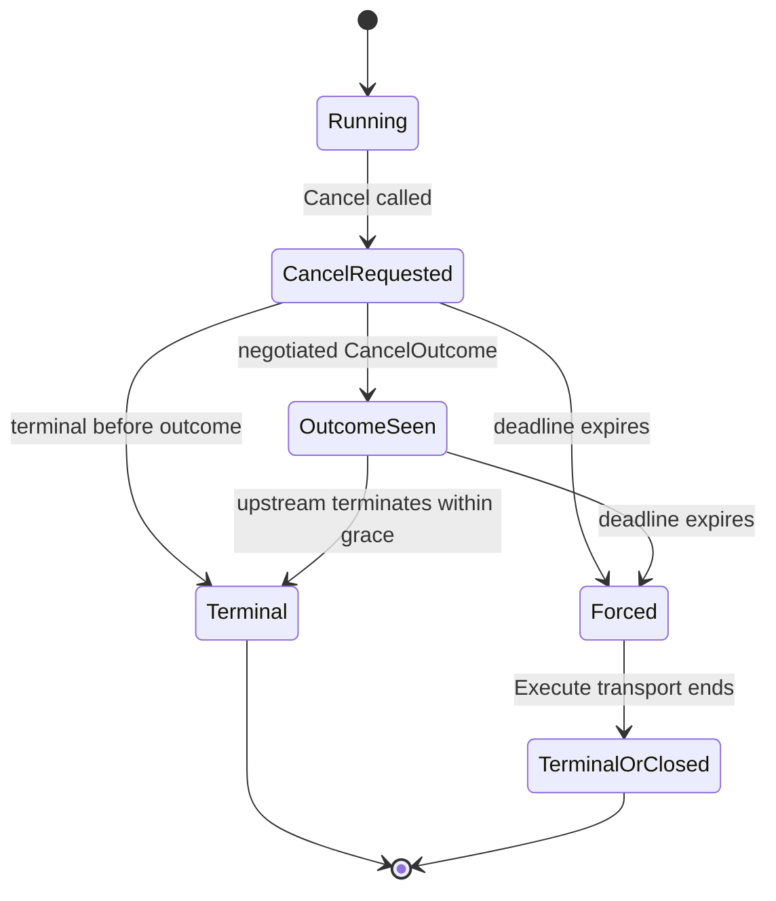
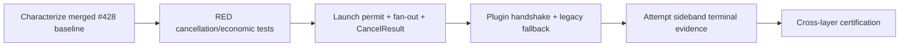

# Design Document

## Overview

This design formalizes issue #431 on top of the merged PR #428 request/attempt lifecycle architecture. The system already has the correct coarse-grained ownership model: `readyAttempt` owns an unpublished B-leg, `attemptSession` owns a published B-leg, and `attemptSession.TerminalizeAttempt` is the sole production authority for physical stream teardown and attempt-local economic settlement.

The remaining defect is **between A-leg cancellation and provider activation**, plus an incomplete cancellation contract below the runtime boundary:

1. `Backend.Open` can still cross after explicit A-leg cancellation because provider activation happens before the B-leg is visible to A-leg lifecycle.
2. A-leg child cancellation is serial, so one slow B-leg can delay siblings.
3. lifecycle wrappers fabricate `CancelModeProvider` instead of returning the physical stream's cancellation result.
4. executable connector `CANCEL` / `CANCEL_OUTCOME` frames do not currently form a real active-Execute handshake.
5. provider-only accounting sideband can remain buffered outside the ordinary response-pipeline drain when a losing/canceled attempt terminalizes.

The target architecture adds three focused mechanisms without creating another attempt lifecycle owner:

- an **A-leg launch permit** that linearizes cancellation with the provider-activation boundary;
- a **truthful, negotiated cancellation handshake** over the existing backend-plugin Execute stream, with bounded graceful-to-force fallback;
- an **attempt-owned provider evidence accumulator/drain** that feeds the existing terminal billing record.

### Goals

- Prevent any B-leg whose launch has not won before A-leg cancellation from invoking `Backend.Open`.
- Cancel an already-permitted in-flight Open promptly when A-leg cancellation wins later.
- Cancel active sibling B-legs concurrently and independently.
- Preserve PR #428's `readyAttempt` / `TerminalizeAttempt` single-owner lifecycle.
- Return the actual physical cancellation mode/error through lifecycle wrappers.
- Make executable connector cancellation a real same-Execute protocol with deterministic legacy fallback.
- Preserve provider-billable evidence through cancellation, race-loser, replacement and late-open terminalization.
- Preserve exactly-once B-leg billing and post-usage financial authority.
- Certify the contracts with deterministic RED tests, TCKs, race/leak tests and architecture ratchets.

### Non-Goals

- No second request/attempt ownership refactor.
- No new frontend cancel API or client-visible canonical event.
- No selector grammar, failover policy, or winner-selection redesign.
- No universal provider cancellation endpoint.
- No shared connector-process termination as a B-leg force fallback.
- No monetary hold lifecycle, stream-time customer rating, balance mutation or journal posting.
- No generic actor/workflow/DI/resource-registry framework.

## Boundary Commitments

### This Spec Owns

- A-leg launch/cancel linearization in `internal/core/leglifecycle`;
- integration of the launch permit into all B-leg provider-open paths;
- concurrent A-leg fan-out over existing ready/session lifecycle handles;
- physical `CancelResult` propagation through PR #428 attempt terminalization;
- additive backend-plugin cancellation feature/minor and same-Execute control handling;
- host-adapter graceful cancellation state and legacy transport fallback;
- attempt-local provider sideband retention/drain for terminal billing;
- contract tests and architecture ratchets for the above.

### Existing Owners That Remain Authoritative

- `readyAttempt`: unpublished B-leg ownership and publication invalidation;
- `attemptSession.TerminalizeAttempt`: physical Cancel/Close, observer finish, authority, metering, B-leg release, billing leg, and attempt evidence;
- `attemptSlot`: current-attempt publication/close linearization;
- `turnTerminal`: request/A-leg terminal lifetime and request-level settlement;
- routing/recovery: candidate policy, failover, TTFT, affinity, interleaved state;
- `internal/core/billing`: financial record/rating policy;
- backend adapters/connectors: provider-specific cancellation mechanics;
- backend-plugin ABI: executable connector process contract.

### Revalidation Triggers

Re-run design validation if implementation changes any of:

- the one-production-entry `TerminalizeAttempt` rule;
- ready-owned unpublished cancellation or ready-before-publication;
- `ManagedEventStream.CancelResult` semantics;
- B2BUA positive attempt sequence / BillingCallID terminal record semantics;
- backend-plugin major version or automatic-retry policy;
- no-retry-after-output behavior;
- process-sharing semantics for executable connectors.

## Existing Architecture After PR #428



This ownership graph is correct and is preserved. The problem is that provider activation currently happens before `R` becomes visible to `A`.

### Current Provider-Activation Window



Sticky registration prevents the late B-leg from surviving, but it cannot prevent avoidable provider activation.

## Target Architecture



The key rule is: **the A-leg always has either a launch entry or an attempt lifecycle handle for every B-leg that is allowed to cross provider activation.** There is no unowned economic window.

## Flow 1: Atomic Launch / Cancel Linearization

### Launch Permit Contract

`leglifecycle.ALeg` gains a private, single-use launch state. Representative API:

```go
type LaunchPermit struct { /* private state */ }

type LaunchCommitResult struct {
    Canceled bool
    Cause    CancelCause
}

func (a *ALeg) BeginBLegLaunch(
    parent context.Context,
    bLegID string,
) (openCtx context.Context, permit *LaunchPermit, err error)

func (p *LaunchPermit) Commit(handle BLegAttempt) (LaunchCommitResult, error)
func (p *LaunchPermit) Abort()
```

The names are illustrative; implementation may choose equivalent private names.

### State and Locking

`ALeg` conceptually tracks:

```go
type launchEntry struct {
    cancel context.CancelFunc // never store Context itself
}

type ALeg struct {
    mu       sync.Mutex
    canceled bool
    cause    CancelCause
    launches map[string]launchEntry
    blegs    map[string]BLegAttempt
}
```

Rules:

1. `BeginBLegLaunch` derives `openCtx` from the caller context and creates `cancel`.
2. Under the A-leg mutex it either:
   - observes `canceled` and returns `ErrALegCanceled` without granting permission; or
   - installs `launches[bLegID] = {cancel}` and returns the permit.
3. The caller invokes `Backend.Open` **only after** receiving the permit.
4. `Commit` runs under the same A-leg mutex:
   - if A-leg is live, remove the launch entry and install the ready lifecycle handle atomically;
   - if cancellation already won, remove the launch entry, return the stored cause, and do not install the handle.
5. `Abort` removes the launch entry and cancels/releases its derived context exactly once.
6. The permit is single-use; Commit/Abort races converge without duplicate ownership effects.

### Linearization Proof



If launch permission wins first, some provider work may legitimately be incurred before a later cancel. That B-leg is financially real and must terminalize with best available evidence. The invariant is not “zero provider work after the user starts thinking about cancel”; it is “no provider activation after the A-leg cancellation transition wins the shared authority.”

## Flow 2: Integrating the Permit with PR #428 Ready Ownership

### Required Open-Path Ordering

The implementation must preserve #428's final ready-owned cancellation model.

For every successful provider Open:

1. allocate authoritative B-leg ID/sequence and complete existing pre-backend admission;
2. acquire A-leg launch permit immediately before the actual provider activation boundary;
3. invoke `Backend.Open` with the permit-derived context;
4. construct attempt-local resources that are required to create the `attemptSession`;
5. transfer acquisition into an **unprepared `readyAttempt` immediately after Open**;
6. atomically commit the launch permit to `ready.lifecycleHandle()`;
7. perform later fallible post-Open work and `ready.Prepare` while ready ownership is already A-leg-visible;
8. on any failure after step 5, dispose/cancel the ready owner rather than touching the raw stream;
9. publish only through existing ready consumption.

This is especially important for the serial path, where current interleaved persistence can run after Open but before `HandoffReady`. That work must no longer leave a raw stream outside A-leg cancellation ownership.

Parallel workers already create ready ownership near the successful Open boundary; they must be adapted to the same permit transition without reintroducing shared recovery mutation.

### No Alternate Physical Cleanup

A launch permit owns only the **Open context cancellation** before ready ownership exists. It does not own a backend stream. Once Open returns a stream, all physical stream teardown must occur via `readyAttempt` / `attemptSession.TerminalizeAttempt`.

## Flow 3: Concurrent A-Leg Cancellation Fan-Out

Current `ALeg.Cancel` serially executes `Cancel+Close` for each child. The target separates state transition from I/O:

```mermaid
sequenceDiagram
    participant C as Cancel caller
    participant L as A-leg lifecycle
    participant O1 as in-flight Open 1
    participant B1 as active B-leg 1
    participant B2 as active B-leg 2

    C->>L: Cancel(cause)
    L->>L: lock; mark canceled; snapshot launches/handles; unlock
    L-->>O1: cancel launch context (non-blocking)
    par child 1
        L->>B1: lifecycle Cancel+Close with bounded child ctx
    and child 2
        L->>B2: lifecycle Cancel+Close with bounded child ctx
    end
    B1-->>L: result/error
    B2-->>L: result/error
    L-->>C: aggregate error after all bounded children settle
```

Constraints:

- no A-leg mutex while invoking attempt I/O;
- finite fan-out only over the snapshot taken at cancellation;
- per-child deadline uses `CoordinatorConfig.CancelTimeout` / existing default;
- total fan-out latency is bounded by the slowest child, not sum of children;
- repeated A-leg cancel remains idempotent;
- launch cancellation functions are called promptly and independently of child graceful cancellation.

Intentional goroutines must have explicit ownership and be covered by the repository goroutine allowlist/race/leak gates.

## Flow 4: Truthful Physical Cancellation Result

PR #428 lifecycle handles currently invoke `TerminalizeAttempt` but return `CancelModeProvider` unconditionally. The target carries the physical stream's result through the attempt terminal owner.

Representative extension:

```go
type attemptTerminalResult struct {
    Result       coreterm.Result
    Cancellation lipapi.CancelResult
}
```

During the winning `TerminalizeAttempt` callback:

1. detach the physical `ManagedEventStream` once;
2. if terminal intent requires cancellation, call `inner.Cancel(cancelCtx, cause)` and capture the exact `CancelResult`;
3. run Close according to existing owner semantics;
4. continue observer/authority/metering/B-leg/billing/evidence effects even if cancel returned an error;
5. publish the one terminal result, including cancellation result, to lifecycle callers.

Ready/session lifecycle handles then return that captured result instead of manufacturing a mode.

If terminalization was already won by another caller and no physical cancellation action was performed by the current call, the lifecycle result must not fabricate a provider action. Tests should pin the chosen idempotent result semantics.

## Flow 5: Negotiated Backend-Plugin Cancellation Handshake

### ABI Evolution

Do not hard-code protocol minor 8 forever. At implementation time:

- allocate the **next available** backend-plugin v1 minor (8 at this specification's baseline);
- add `FeatureCancellationHandshake = "cancellation_handshake_v1"`;
- add a wire cancellation mode enum equivalent to `none/provider/transport/close_only`;
- add an optional/additive `mode` field to `CancelOutcome`;
- keep existing `ClientFrameCancel`, reason and `CancelDeadlineUnixMS` fields;
- negotiate the feature as optional so old connector binaries remain compatible.

No new unary cancel RPC is introduced.

### Connector-Side Execute Pump

The shared `backendplugin.ForwardExecute` remains the standard connector execution helper but becomes a small explicit coordinator instead of a one-direction pump.

Required concurrency model:

- exactly one client-control reader owns `ExecuteStream.Recv` after the initial START;
- exactly one upstream reader owns `ManagedEventStream.Recv`;
- exactly one sequencer/sender owns server frame sequence numbers and `ExecuteStream.Send`;
- cancellation actions are bounded by the cancel frame deadline/effective policy;
- control-reader/upstream-reader completion has explicit join/cancel ownership; no orphan goroutines.

`CLOSE_INPUT` stays semantically distinct from CANCEL.

### Negotiated Cancellation Flow



### Outcome Semantics

The handshake distinguishes:

1. **requested**: host placed the cancel control frame on the active Execute stream;
2. **processed/outcome**: connector consumed the frame and attempted cancellation, reporting actual mode/error class;
3. **terminal**: the active attempt ended;
4. **forced**: grace expired and host aborted the per-attempt Execute transport.

A `CancelOutcome` is not itself terminal proof. Provider-level acknowledgment may be reflected only where the provider protocol exposes it; otherwise terminal completion is the stop proof.

### Deadline Composition

The effective cancellation deadline must never widen an existing bound. Use the earliest applicable deadline among:

- caller/attempt cleanup deadline;
- A-leg configured cancel timeout;
- backend-plugin runtime policy cancel deadline;
- explicit cancel-frame deadline.

Every layer may shorten but not extend the upstream bound.

## Flow 6: Legacy Connector Fallback

When `cancellation_handshake_v1` is not negotiated:



Rules:

- do not send a new semantic contract the peer did not negotiate;
- do not claim provider acknowledgment;
- intentional transport death must classify as cancellation, not a retryable provider fault;
- force scope is the active Execute RPC/operation, never `CloseInstance` for the shared connector.

## Flow 7: Attempt-Owned Provider Evidence Preservation

### Current Problem

Normal response receive drains `UsageEvidenceSource` before/after `Recv` and feeds response-pipeline state. A canceled/unpublished/losing attempt can terminalize through `TerminalizeAttempt` without necessarily passing through that same drain, especially when provider accounting frames arrive during cancellation.

### Target Evidence Owner

Extend `attemptSession` with a bounded provider-evidence accumulator using the existing per-attempt dedupe-key semantics. Conceptually:

```go
type attemptUsageEvidence struct {
    // private lock/map or existing usageMu-backed state
    byDedupeKey map[string]lipapi.Event
    unkeyed     []lipapi.Event // only when existing contracts allow it
}
```

The implementation should prefer reusing/refactoring `internalUsageKeys` and existing bounded sideband rules instead of creating parallel dedupe authorities.

### Drain Points

- immediately after provider Open/readiness where currently required;
- normal receive before and after upstream `Recv`;
- terminalization immediately before physical Cancel where source permits;
- after `Cancel` returns, before Close;
- after Close only if the source contract still allows a final drain safely.

All accepted evidence is attributed to the explicit attempt owner, never by re-snapshotting `attemptSlot`.

### Aggregation

Use existing provider-authority and scoped usage semantics (`authorityUsageEvent`, scoped aggregation / existing billing evidence merge) so multiple unique accounting frames are combined. Do not replace the accumulator with “last usage event wins.”

### Terminal Billing Precedence



Precedence remains:

1. authoritative `FinalizeBilling` evidence when available;
2. provider-reported sideband/stream evidence as fallback or cost augmentation under existing merge rules;
3. existing weaker estimates where already permitted;
4. explicit unavailable evidence when nothing trustworthy is known.

No path may infer authoritative zero from absence.

## Components and Interfaces

| Component | Boundary | Responsibility | Requirements |
|---|---|---|---|
| A-leg launch permit | core lifecycle | Linearize cancellation with provider activation; cancel in-flight Open | 2.1–2.7, 3.1 |
| A-leg cancel fan-out | core lifecycle | Snapshot/cancel launches and active children concurrently | 3.1–3.7 |
| Ready/session lifecycle result bridge | core runtime | Preserve physical CancelResult through #428 owner | 1.1–1.3, 4.1–4.8 |
| Attempt terminalizer extension | core runtime | Capture cancel result and terminal sideband evidence without adding owner | 4.6–4.7, 6.1–6.7, 7.1–7.6 |
| Backend-plugin handshake | SDK/wire | Active-Execute CANCEL consumption, outcome mode, terminal sequencing | 5.1–5.9 |
| `ForwardExecute` coordinator | SDK/connector side | Concurrent control/upstream read with one sequenced sender | 3.3–3.4, 5.1–5.5 |
| Host adapter cancel state | infra adapter | Wait for outcome/terminal, force per-attempt fallback, legacy path | 3.3–3.6, 4.4–4.8, 5.2–5.9 |
| Attempt usage evidence accumulator | core runtime | Dedupe, aggregate, terminal drain provider evidence | 6.1–6.7, 7.2–7.5 |
| Terminal billing integration | core runtime/billing seam | Apply existing finalizer/fallback precedence exactly once | 7.1–7.9 |
| TCK/ratchets | tests | Certify active cancellation, economics and ownership | 10.1–10.11 |

## Data and State Models

### A-Leg State

```text
ALeg
  canceled: bool
  cause: CancelCause
  launches: BLegID -> launch cancel function
  active:   BLegID -> ready/session lifecycle handle
```

State transitions:



### Host Adapter Cancellation State



The state is attempt-local and bounded. It does not become a process-global attempt registry.

## Error Handling

### Launch Errors

- `BeginBLegLaunch` after cancellation returns `ErrALegCanceled` and no Open occurs.
- cancellation during Open cancels `openCtx`; if Open obeys context, the existing open-failure path terminalizes the allocated B-leg.
- if Open ignores cancellation and returns a stream, launch commit observes cancellation and the new ready owner is canceled/disposed exactly once.
- B-leg attempt sequence and “never started” vs “provider attempted” evidence remain explicit; do not rewrite sequence or derive it from IDs.

### Cancellation Errors

- physical `ManagedEventStream.Cancel` error is retained in `CancelResult`/terminal result while terminal cleanup continues best-effort;
- A-leg cancellation aggregates child errors after concurrent fan-out but remains sticky;
- timeout of graceful plugin cancellation triggers per-attempt transport force-abort and returns a transport/timeout result;
- a negative connector outcome does not revive the attempt or trigger failover after cancellation won.

### Terminal Evidence Errors

- failure to drain optional sideband does not suppress attempt terminalization;
- already-received evidence remains available even if later transport force-abort loses future frames;
- `FinalizeBilling` failure falls back to the best accumulated stream/sideband evidence under existing presence/authority rules;
- durable billing append behavior remains the existing idempotent/replay contract; cancellation must not start a replacement provider request because persistence failed.

## Concurrency and Locking

### Core Lifecycle

- A-leg mutex covers only cancellation state, launch map and active-handle map transitions.
- No backend Open/Cancel/Close, terminalization, billing, observer or store call occurs under the A-leg mutex.
- launch permit Commit/Abort is single-use and race-safe.
- active cancellation fan-out uses a finite snapshot and bounded child contexts.

### Connector Helper

- one reader per stream direction where the transport permits concurrent send/recv;
- one server-frame sequencer owns `Sequence` and Send;
- cancel/deadline watcher has explicit stop/join ownership;
- no goroutine survives Execute completion;
- accounting frames and terminal frames preserve monotonic sequence validation.

### Adapter

- cancellation state synchronization must not hold locks while blocking on gRPC/plugin I/O;
- Close and Cancel converge on one Execute shutdown/join path;
- repeated Cancel/Close is idempotent and cannot double-cancel the provider stream through #428 terminal ownership.

## Security and Privacy

- CancelCause diagnostics use low-cardinality cause class; unbounded user-provided detail must not become metric labels.
- No prompt, secret, credential, raw request body or provider-private cancellation payload is logged by the new flow.
- Provider-specific cancellation objects stay inside backend adapters/connectors.
- Force fallback is scoped to a single attempt/Execute operation, protecting unrelated tenants/sessions sharing a connector.
- Protocol negotiation remains fail-closed for unknown **required** features and preserves disabled transport retries.

## Performance Considerations

- launch permits add O(active/in-flight B-legs) state already bounded by route/attempt budgets;
- cancellation fan-out reduces worst-case multi-leg latency from roughly sum(child grace) to max(child grace) plus scheduling overhead;
- no per-request unbounded queue is introduced;
- provider evidence keeps existing sideband bounds/dedupe limits;
- handshake adds control frames only on cancellation, not normal hot-path output;
- normal successful execution should remain allocation/behavior neutral apart from a small permit transition around provider Open.

## File / Package Change Plan

### Core lifecycle/runtime

Likely files:

- `internal/core/leglifecycle/coordinator.go` — launch permits, concurrent fan-out, tests;
- `internal/core/runtime/executor_open_attempt.go` — acquire/commit permit around actual provider activation and early ready transfer;
- `internal/core/runtime/parallel_race.go` — use common permit/ready transition without changing reducer ownership;
- `internal/core/runtime/attempt_session.go` — physical CancelResult propagation and attempt-owned evidence;
- `internal/core/runtime/response_pipeline_observations.go` / focused evidence helper — normal drain feeds attempt accumulator;
- `internal/core/runtime/billing_leg.go` / terminal evidence helpers — best-evidence fallback only, no financial-policy move.

### Backend-plugin SDK / ABI

Likely files:

- `api/backendplugin/v1/backend.proto` and generated code;
- `pkg/lipsdk/backendplugin/bounds.go` / protocol feature constants;
- `pkg/lipsdk/backendplugin/enums.go`, `types.go`, `convert.go`, frame validation as needed;
- `pkg/lipsdk/backendplugin/forward_execute.go`;
- `pkg/lipsdk/backendplugin/host/session.go` only where negotiation/control propagation requires it;
- `pkg/lipsdk/backendplugin/contracttest/contracttest.go`.

### Infra adapter / connectors

- `internal/infra/backendplugins/adapter/stream.go` — cancellation state machine, deadline, outcome signal, legacy fallback;
- standard connector service descriptors/feature advertisements so updated connectors negotiate `cancellation_handshake_v1`;
- connector-specific physical cancel code only where a provider already exposes a stronger mechanism.

### Tests / architecture

- runtime deterministic cancellation/open/fan-out/billing tests;
- backendplugin/host/adapter handshake and legacy tests;
- connector TCK cancellation scenario;
- backend-family cancellation-mode contract tests;
- `internal/archtest` ratchets for launch authority, raw stream registration, terminal owner and ABI/evidence boundaries.

## Requirements Traceability

| Requirement | Design owner / proof |
|---|---|
| 1.1–1.6 | Preserve #428 owners; additive SDK minor only |
| 2.1–2.7 | A-leg launch permit + early ready transfer |
| 3.1–3.7 | A-leg concurrent bounded fan-out + per-attempt graceful/force |
| 4.1–4.8 | Terminal physical CancelResult bridge + diagnostics |
| 5.1–5.9 | Negotiated same-Execute cancellation handshake + legacy fallback |
| 6.1–6.7 | Attempt-owned provider evidence accumulator/drain |
| 7.1–7.9 | Existing terminal billing owner with strengthened evidence precedence |
| 8.1–8.7 | Existing recovery/commitment rules + cancellation classification |
| 9.1–9.5 | Low-cardinality secret-safe observability |
| 10.1–10.11 | RED tests, TCKs, billing matrix, race/goleak, arch ratchets, final gates |

## Test Strategy

### RED First

Before production changes, add deterministic tests proving current failures:

- explicit A-leg cancellation wins while a delayed parallel branch is waiting, yet current code later calls its `Backend.Open`;
- cancellation wins during a deliberately blocking Open and current explicit A-leg authority cannot cancel the Open context;
- two active B-legs where first cancellation blocks demonstrate serial sibling delay;
- lifecycle handle returns provider mode even though physical stream returns transport/close-only;
- negotiated-looking cancel frame is transmitted but `ForwardExecute` never invokes active upstream Cancel;
- provider sideband produced during loser/cancel teardown is absent from fallback billing when finalizer is unavailable/fails.

### Focused GREEN Coverage

- launch permit state machine: cancel-before-begin, begin-before-cancel, cancel-vs-commit, abort, repeated operations;
- serial, replacement, parallel, delayed arm and interleaved provider-open integration;
- non-cooperative Open returning after cancel;
- concurrent fan-out with one poisoned child;
- exact physical cancel/close count under Recv/Close/cancel races;
- truthful modes provider/transport/close-only and cancel errors;
- negotiated backend-plugin cancel outcome, negative/timeout/terminal races, frame ordering;
- legacy connector fallback and intentional transport-death classification;
- sideband dedupe/aggregation before/during/after cancellation;
- finalizer success/failure/unsupported precedence and exactly-once terminal leg append.

### Certification

- connector contract TCK must assert the actual active upstream stream receives cancellation;
- backend-family lifecycle contracts certify expected mode without demanding unsupported provider APIs;
- `go test -race` targeted packages on supported CI;
- `goleak`/existing goroutine policy for new control/fan-out goroutines;
- architecture tests protect #428 ownership and new launch/ABI/evidence boundaries;
- final `make quality-checks`, `make test-unit`, `make parity-checks` and relevant platform checks.

## Migration / Implementation Sequence



The order intentionally establishes the runtime cancellation ownership first, then the process-boundary handshake, then evidence hardening. This avoids simultaneously changing physical teardown and billing ownership without discriminating tests.

## Brownfield Design Validation Verdict

**GO** on merged `main` (`7a6c7532`).

Validation repairs applied before approval:

1. PR #428 is no longer a future prerequisite; it is the actual merged baseline, including ready-owned unpublished cancellation.
2. The serial post-Open/pre-ready gap is addressed by transferring successful Open ownership to an unprepared ready owner before later fallible post-Open persistence/readiness work.
3. The backend-plugin feature binds to the next available protocol minor at implementation time rather than permanently hard-coding minor 8.
4. Cancellation deadlines compose by earliest deadline and never widen an existing cleanup budget.
5. Provider sideband terminal fallback reuses the existing authoritative/scoped aggregation semantics rather than introducing last-event-wins billing.
6. The design keeps physical stream teardown exclusively inside the PR #428 attempt owner.

No unresolved product or architecture blocker remains.
