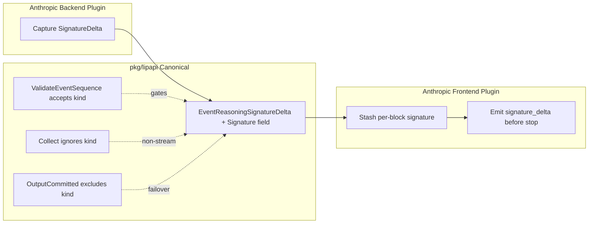

# Design Document

## Overview
**Purpose**: This feature delivers Anthropic extended-thinking signature preservation to operators running Anthropic-to-Anthropic pass-through, so downstream clients can replay thinking blocks in multi-turn tool-use conversations.
**Users**: Operators and clients using the LLM Interactive Proxy with an Anthropic backend and an Anthropic client frontend.
**Impact**: Adds a new canonical event carrier for the thinking signature, captures it in the Anthropic protocol adapter, and emits it (`signature` field + `signature_delta` event) on the downstream Anthropic streaming wire. Non-streaming and non-Anthropic paths are unchanged.

### Goals
- Preserve the Anthropic thinking signature end-to-end for streaming Anthropic-to-Anthropic pass-through.
- Carry the signature as a distinct canonical signal (separate from reasoning text) so non-Anthropic frontends ignore it.
- Handle multiple interleaved thinking blocks, each with its own signature.
- Keep the canonical sequence contract, output-commit/failover semantics, and the no-retry-after-first-output invariant intact.

### Non-Goals
- Non-streaming Anthropic thinking blocks (the non-stream path intentionally omits thinking).
- Fabricating signatures for reasoning synthesized from non-Anthropic backends.
- Other providers' reasoning wire shapes (no signature concept).
- Changing which thinking content is emitted.

## Boundary Commitments

### This Spec Owns
- A new canonical event kind `EventReasoningSignatureDelta` and a `Signature` field on `lipapi.Event`.
- Registration of that kind in the canonical sequence validators and the event-envelope size check.
- Capture of `anthropic.SignatureDelta` in the Anthropic Messages protocol adapter.
- Emission of `signature` and `signature_delta` on the Anthropic frontend streaming wire.

### Out of Boundary
- Non-stream Anthropic encode (`WriteNonStreamJSON`) — unchanged.
- Other frontends (Gemini, OpenAI legacy, OpenAI Responses) — unchanged; they ignore the new kind via existing `default` switch cases.
- Core orchestration, routing, failover, and continuity — unchanged.
- The Anthropic SDK upgrade path — the existing `anthropic-sdk-go@v1.55.0` already exposes `SignatureDelta`.

### Allowed Dependencies
- `pkg/lipapi` canonical contracts (this spec extends them).
- `github.com/anthropics/anthropic-sdk-go@v1.55.0` (`anthropic.SignatureDelta`, `.Signature`).
- `internal/core/stream` flush helpers (existing).

### Revalidation Triggers
- Canonical event contract shape changes (new kind/field).
- Anthropic streaming wire shape changes (signature/signature_delta).
- Parity: Anthropic frontend x Anthropic backend matrix.

## Architecture

### Existing Architecture Analysis
The proxy translates Anthropic Messages SSE through a canonical event stream. The Anthropic backend (`anthropicmessages/map_events.go`) maps `ContentBlockDeltaEvent` variants to canonical events; `ThinkingDelta` maps to `EventReasoningDelta` and `SignatureDelta` is currently dropped. The Anthropic frontend (`anthropic/encode.go`) emits `content_block_start`/`thinking_delta`/`content_block_stop` for thinking blocks but no `signature`/`signature_delta`. The canonical `Event` struct and `ValidateEventSequence` are the interoperability contract.

### Architecture Pattern & Boundary Map

**Project Boundary Questions (Go LIP)**:
- **Core-owned or plugin-owned?** Plugin-owned. The change lives in the Anthropic protocol adapter and frontend plus the canonical contract; core orchestration is untouched.
- **New canonical concept, or provider/adapter-specific?** A new canonical carrier (`EventReasoningSignatureDelta`) for a provider-specific value, mirroring how `EventReasoningDelta` already carries provider reasoning text. The carrier is canonical; the value is Anthropic-specific and ignored by other frontends.
- **Streaming-first path preserved?** Yes. The signature flows on the streaming canonical path; non-stream `Collect` ignores the kind, consistent with non-stream Anthropic omitting thinking.
- **Provider SDK leakage avoided?** Yes. `anthropic.SignatureDelta` is referenced only inside `internal/plugins/backends/protocols/anthropicmessages`; the canonical carrier uses a plain `string` `Signature` field.
- **No retry/failover after first client-visible output preserved?** Yes. The new kind is excluded from `OutputCommitted` (signature is integrity metadata arriving after reasoning text, which already commits).
- **Secure-session, diagnostics, or startup-security posture affected?** No.
- **Extension platform seam used or extended?** No seam applies; this is a contract + adapter change.

### Technology Stack

| Layer | Choice / Version | Role in Feature | Notes |
|-------|------------------|-----------------|-------|
| Canonical contracts | `pkg/lipapi` (Go stdlib only) | New event kind + field | No new deps |
| Backend adapter | `anthropic-sdk-go@v1.55.0` | Read `SignatureDelta` | Already a dependency |
| Frontend adapter | `internal/plugins/frontends/anthropic` | Emit signature/signature_delta | stdlib `encoding/json` |

## File Structure Plan

### Modified Files
- `pkg/lipapi/events.go` — add `EventReasoningSignatureDelta` kind constant, `Signature string` field on `Event`, register the kind in both `ValidateEventSequence` content-class groups, bound `Signature` in `ValidateEventEnvelope`, add a no-op `case` in `CollectWithLimits`.
- `pkg/lipapi/output_commit.go` — intentionally does NOT add the new kind to `OutputCommitted` (documented via a comment).
- `internal/plugins/backends/protocols/anthropicmessages/map_events.go` — add `case anthropic.SignatureDelta:` emitting `EventReasoningSignatureDelta`.
- `internal/plugins/frontends/anthropic/encode.go` — extend `anthropicSSEThinkingBlock` with `Thinking`/`Signature` fields, add `anthropicSSEDeltaSignature` struct, add `thinkingSignature` stash + `EventReasoningSignatureDelta` case, emit `signature_delta` in `closeThinkingBlock`.
- `internal/plugins/frontends/anthropic/doc.go` — update the thinking/extended-blocks row to "Supported (encode, thinking + signature)".

No new files. No other frontend files change (they ignore the new kind via `default`).

## Components and Interfaces

### Canonical contracts — `pkg/lipapi/events.go`

| Field | Detail |
|-------|--------|
| Intent | Carry the Anthropic thinking signature as a distinct canonical signal. |
| Requirements | 2.1, 2.2, 2.3, 2.4, 6.1, 6.2, 6.3 |

**Responsibilities & Constraints**
- New kind `EventReasoningSignatureDelta EventKind = "reasoning_signature_delta"`.
- New `Event.Signature string` field (used by the new kind; empty for other kinds).
- `ValidateEventEnvelope`: `len(ev.Signature) > MaxRefStringBytes` returns a validation error (reuse the existing ref-string cap).
- Both `ValidateEventSequence` validators: add `EventReasoningSignatureDelta` to the content-class group that requires `sawMessage` (so it is accepted after `EventMessageStarted` and rejected before it, and not rejected as unknown).
- `CollectWithLimits`: explicit no-op `case EventReasoningSignatureDelta:` (signature is not aggregated into `Collected.Reasoning`).

**Contracts**: Event [x]

##### Event Contract
- Published by: Anthropic protocol adapter.
- Subscribed by: Anthropic frontend (streaming only).
- Ordering: arrives after the reasoning text deltas for the same thinking block; idempotent single occurrence per block.

### Anthropic backend — `internal/plugins/backends/protocols/anthropicmessages/map_events.go`

| Field | Detail |
|-------|--------|
| Intent | Capture upstream `SignatureDelta` into the canonical stream. |
| Requirements | 1.1, 1.2, 1.3 |

**Responsibilities & Constraints**
- In the `ContentBlockDeltaEvent` switch, after `case anthropic.ThinkingDelta:`, add `case anthropic.SignatureDelta:` that pushes `lipapi.Event{Kind: lipapi.EventReasoningSignatureDelta, Signature: t.Signature}` when `t.Signature != ""`.
- No signature is synthesized when the upstream provides none (the case simply never fires).

### Anthropic frontend (stream) — `internal/plugins/frontends/anthropic/encode.go`

| Field | Detail |
|-------|--------|
| Intent | Emit signature on the thinking block start and `signature_delta` before stop. |
| Requirements | 3.1, 3.2, 3.3, 3.4, 4.1, 4.2 |

**Responsibilities & Constraints**
- `anthropicSSEThinkingBlock`: add `Thinking string `json:"thinking"`` and `Signature string `json:"signature"`` (both empty on `content_block_start`, matching real Anthropic).
- New struct `anthropicSSEDeltaSignature` (`content_block_delta` with `delta.type = "signature_delta"`, `delta.signature`).
- In `WriteStreamSSE`: add `thinkingSignature string`; `case lipapi.EventReasoningSignatureDelta:` sets `thinkingSignature = ev.Signature`.
- `closeThinkingBlock`: before `content_block_stop`, if `thinkingSignature != ""`, emit `content_block_delta` with `signature_delta` on `thinkingBlockIdx`; reset `thinkingSignature = ""`.
- Per-block isolation: `thinkingSignature` resets on each close, so interleaved thinking blocks each emit their own signature.

## Data Models

### Domain Model
- `Event` gains a `Signature string` field. A new `EventKind` constant `EventReasoningSignatureDelta` identifies signature-carrying events. No aggregate or transactional boundary changes.

### Event Schemas
- `EventReasoningSignatureDelta`: `{Kind: "reasoning_signature_delta", Signature: <string>}`. Size-bounded by `ValidateEventEnvelope`. Not aggregated by `Collect`. Not output-committing.

## Error Handling
- Missing signature (synthesized reasoning): `thinkingSignature` stays empty; `closeThinkingBlock` emits no `signature_delta` — no error, no fabricated value.
- Oversized signature: `ValidateEventEnvelope` rejects it at the codec/mapping boundary with a field-level validation error.
- Signature before message frame: `ValidateEventSequence` rejects the stream as invalid.

## Testing Strategy

### Unit Tests
- `pkg/lipapi`: `ValidateEventSequence` accepts `EventReasoningSignatureDelta` after `MessageStarted` and rejects it before; `ValidateEventEnvelope` rejects an oversized `Signature`; `OutputCommitted` returns false for the new kind; `Collect` ignores the kind without error and without mutating `Collected.Reasoning`.
- `anthropicmessages`: a `SignatureDelta` maps to `EventReasoningSignatureDelta{Signature: ...}`; absence of `SignatureDelta` emits no such event.

### Integration Tests (frontend stream)
- `anthropic` `WriteStreamSSE`: thinking `content_block_start` carries `signature:""`; `signature_delta` fires before `content_block_stop` with the stashed signature and matching index; no `signature_delta` when no signature event arrived; two interleaved thinking blocks each emit their own `signature_delta` on their own index.

### Parity / E2E
- Extend `internal/plugins/frontends/parity/visible_thinker_reasoning_test.go` (or add a parity case) covering an Anthropic frontend x Anthropic backend path asserting `signature_delta` and the `signature` field round-trip.
- No-op regression tests for `gemini`, `openailegacy`, `openairesponses`: feeding `EventReasoningSignatureDelta` produces no wire output and no panic.

## Requirements Traceability

| Requirement | Summary | Components | Interfaces | Flows |
|-------------|---------|------------|------------|-------|
| 1.1, 1.2, 1.3 | Upstream capture | Anthropic backend | Event | Capture flow |
| 2.1, 2.2, 2.3, 2.4 | Canonical carrier | `pkg/lipapi` events | Event | Canonical flow |
| 3.1, 3.2, 3.3, 3.4 | Downstream emission | Anthropic frontend | Wire | Emit flow |
| 4.1, 4.2 | Multi-block | Anthropic frontend | Wire | Interleaved flow |
| 5.1, 5.2, 5.3 | Isolation | Other frontends, non-stream | - | - |
| 6.1, 6.2, 6.3 | Validation | `pkg/lipapi` validators | Event | - |
