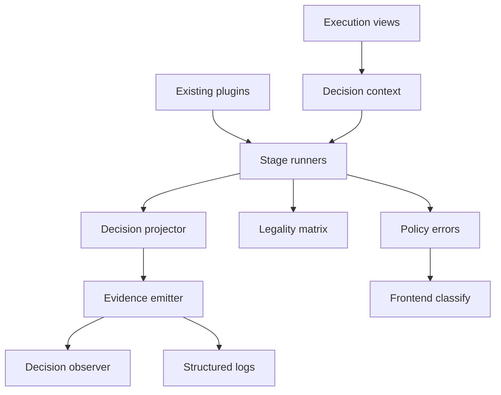
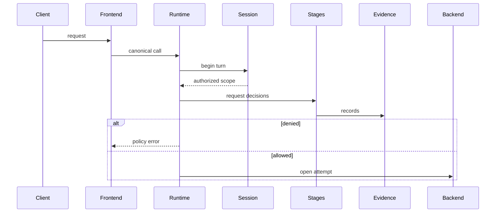
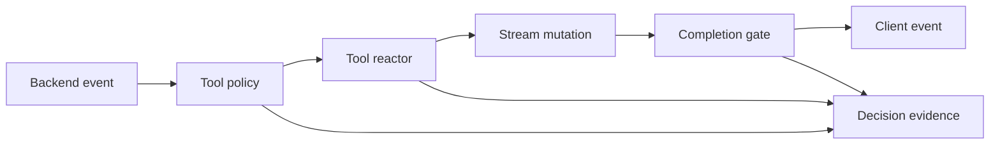
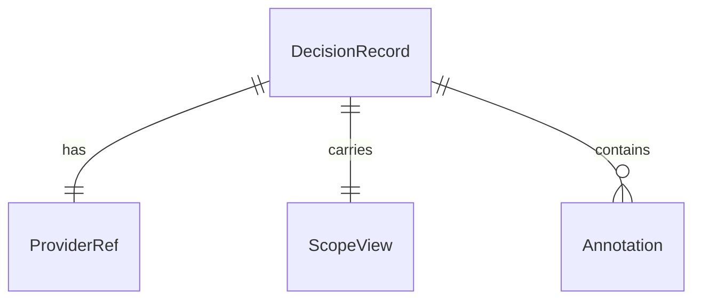

# Design Document

## Overview

The admission-policy-decision-core feature introduces a shared decision and evidence foundation for the LLM Interactive Proxy extension pipeline. It gives platform operators and feature/plugin authors a consistent way to describe policy outcomes across existing admission, request shaping, tool, completion, and observation stages without changing client protocols or replacing current plugin interfaces.

The design follows a hybrid compatibility approach. Existing extension interfaces remain source-compatible, while core stage runners project their current outcomes into a shared policy-decision record, validate stage/outcome legality, and emit audit-safe evidence. Later concrete budget, rate-limit, PII, prompt-injection, dangerous-tool, and admin features can consume the shared vocabulary without this spec implementing those policy rules.

### Goals

- Define a protocol-neutral, typed policy decision record and evidence observer contract.
- Validate which decision outcomes are legal at each existing extension lifecycle position.
- Preserve existing extension behavior while projecting outcomes into shared evidence.
- Add stable policy denial/failure/malformed error roots for frontend-safe classification.
- Carry safe principal/scope attribution through decision contexts and evidence.

### Non-Goals

- Implement concrete budget, billing, rate-limit, PII, redaction, prompt-injection, harmful-content, brand-safety, or dangerous-tool policies.
- Replace existing submit, request transform, pre-request, tool policy, tool reactor, route hint, traffic, usage, or completion plugin interfaces.
- Add OAuth, SAML, SCIM, user-directory, admin GUI, reporting, cross-session search, or cloud distribution behavior.
- Persist policy decision records in a durable query store; later control-plane persistence specs own storage and reporting.
- Forward policy metadata to backend providers by default.

## Boundary Commitments

### This Spec Owns

- Shared SDK-level policy decision types: lifecycle stage, provider identity, outcome, effect, reason code, client-safe category/message, failure behavior, evidence visibility, annotations, and safe scope attribution.
- Core validation of stage/outcome legality for the existing legal extension pipeline.
- Compatibility projection from existing extension results into shared policy decision evidence.
- Stable policy-denial, policy-failure, and malformed-policy-decision error roots for executor-to-frontend classification.
- Operator-visible, audit-safe evidence emission for decision outcomes without requiring usage or traffic observers to understand policy semantics.
- Additive safe-scope fields on existing decision metadata where the current metadata only exposes legacy principal information.

### Out of Boundary

- Concrete policy rule implementations and their configuration semantics.
- Durable control-plane event stores, query APIs, dashboards, charts, or search.
- Authentication provisioning, directory synchronization, or user/group management.
- Provider-specific policy semantics or backend metadata forwarding.
- Changing existing successful client wire shapes or requiring client protocol changes.
- Replacing existing extension interfaces with a new mandatory provider interface.

### Allowed Dependencies

- `pkg/lipsdk/feature` for legal stage IDs and descriptors.
- `pkg/lipsdk/scope`, `execview`, `session`, and `workspace` for safe request context.
- `pkg/lipapi` for stable executor error roots consumed by frontend adapters.
- `internal/core/extensions`, `internal/core/execctx`, and `internal/core/runtime` for stage execution, context assembly, and stream integration.
- Frontend adapters may depend on `internal/plugins/frontends/execerr` and `pkg/lipapi` policy errors for protocol-specific error rendering; core packages must not import frontend plugin packages.
- Existing `log/slog`, metrics, and observer patterns; no new third-party dependency is allowed.

### Revalidation Triggers

- Adding, removing, or renaming policy decision outcomes, effects, or stage IDs.
- Changing frontend mapping of policy denials, failures, or malformed decisions.
- Changing when pre-execution decisions run relative to secure-session BeginTurn, route planning, or backend attempts.
- Changing post-output policy behavior in ways that could affect failover, completion gates, or stream ordering.
- Emitting richer evidence fields that could include sensitive or high-cardinality values.
- Forwarding decision metadata to backend providers or client-visible success payloads.

## Architecture

### Existing Architecture Analysis

The repository already has the right skeleton for this feature:

- `pkg/lipsdk/feature/stages.go` defines the legal extension pipeline and mutation roles.
- `internal/core/extensions/*` contains stage runners with stable ordering, failure behavior, panic isolation, metrics, and tracing.
- `internal/core/runtime/executor_prepare_secure.go` invokes pre-backend extension stages before route planning and backend attempts.
- `internal/core/runtime/attempt_stream.go` invokes tool policies, tool reactors, completion gates, usage observers, and traffic observers on the streaming path.
- `pkg/lipsdk/scope` and `internal/core/execctx.Views` provide safe principal/scope attribution established by the previous control-plane-principal-scope spec.
- `internal/plugins/frontends/execerr` is the central classification point for executor errors before protocol-specific rendering.

The main gap is consistency: existing extension surfaces use separate outcome types and error shapes. This design adds a shared projection/evidence layer rather than replacing those surfaces.

### Architecture Pattern & Boundary Map

Selected pattern: hybrid compatibility extension. Public SDK types define the shared decision vocabulary; core extension runners validate and emit decision evidence; existing plugin contracts remain intact.



**Architecture Integration**

- Selected pattern: hybrid compatibility; it matches the previous principal-scope migration pattern and avoids a breaking plugin migration.
- Domain/feature boundaries: shared decision vocabulary is SDK/core-owned; concrete enterprise policies remain feature-plugin-owned.
- Existing patterns preserved: legal stage IDs, frozen request snapshots, materialized ordering, fail-open/fail-closed handling, frontend error classification, and streaming-first execution.
- New components rationale: shared decision records, legality validation, evidence emission, and error taxonomy are cross-stage concepts not cleanly owned by any one existing hook package.
- Steering compliance: provider SDKs stay at backend edges; frontend protocol rendering remains in frontend adapters; core owns shared policy semantics.

**Optional Hexagonal Lens**

- Domain policy: protocol-neutral decision outcomes, legal stage/outcome invariants, and safe evidence constraints.
- App/use-case orchestration: extension stage runners coordinate existing providers, validate outcomes, apply failure behavior, and emit evidence.
- Driving adapters: frontends map stable policy errors into legal wire shapes.
- Driven adapters: policy decision observers and structured logs receive evidence; later persistence adapters are out of scope.
- Composition root: runtime bundle wires a noop/default evidence observer and configured observers without globals.
- Ports/query seams: policy decision observer is an outbound event seam; no query seam is introduced in this spec.

**Project Boundary Questions**

- Core-owned or plugin-owned? Shared decision semantics and evidence are core/SDK-owned; concrete policy rules are plugin-owned.
- New canonical concept, or provider/adapter-specific behavior? New SDK-level control-plane concept, not a `pkg/lipapi` request/event payload concept.
- Streaming-first path preserved? Yes. Stream event and completion behavior remains on the canonical stream; no second non-streaming path is introduced.
- Provider SDK leakage avoided? Yes. Decision records carry strings, enums, safe scope values, and timestamps only.
- No retry/failover after first client-visible output preserved? Yes. Post-output denials/failures surface through the active stream and never trigger transparent replacement attempts.
- Secure-session, diagnostics, or startup-security posture affected? Yes. Revalidate secure-session timing, diagnostics exposure, and frontend error mapping.
- Extension platform seam used or extended? The existing legal extension pipeline is extended with decision projection, legality validation, and evidence emission.

### Technology Stack

| Layer | Choice / Version | Role in Feature | Notes |
|-------|------------------|-----------------|-------|
| Go SDK contracts | Go 1.26.x module packages under `pkg/lipsdk` | Shared decision and observer contracts | Additive public surface only |
| Canonical errors | `pkg/lipapi` | Stable policy error roots for frontend classification | No provider or transport types |
| Core runtime | `internal/core/extensions`, `internal/core/runtime` | Stage validation, projection, evidence emission | Preserves existing pipeline |
| Frontend adapters | `internal/plugins/frontends/execerr` | Client-safe classification | Protocol rendering stays at frontend edge |
| Observability | `log/slog`, existing metrics/observer seams | Operator-visible evidence | No new dependency |

## File Structure Plan

### Directory Structure

```text
pkg/lipsdk/policydecision/
|- doc.go              # Package contract and safety rules
|- types.go            # Outcome Effect FailureBehavior EvidenceVisibility ProviderRef
|- record.go           # DecisionRecord and clone helpers
|- context.go          # DecisionContext and request attribution view
|- observe.go          # Observer ChainObserver NoopObserver
|- legality.go         # SDK readable legal outcome descriptors
|- limits.go           # Evidence normalization and timeout defaults

pkg/lipapi/
|- policy_errors.go    # Stable policy denial failure malformed error roots

internal/core/extensions/
|- decision_context.go # Build DecisionContext from execctx and stage metadata
|- decision_legality.go # Validate stage outcome legality using feature stage IDs
|- decision_project.go # Project legacy extension outcomes into DecisionRecord
|- decision_evidence.go # Emit observer events and structured logs safely
|- decision_timeout.go # Enforce bounded provider evaluation where a timeout is configured
|- decision_errors.go  # Convert invalid decisions and provider failures to lipapi errors

internal/core/runtime/
|- executor_prepare_secure.go # Add scope-rich decision context and pre-backend evidence hooks
|- attempt_stream.go          # Add tool response completion decision evidence on stream path

internal/plugins/frontends/execerr/
|- execerr.go          # Classify policy denial failure malformed roots
```

### Modified Files

- `pkg/lipsdk/feature/stages.go` - add or expose decision legality metadata only if the new `policydecision` package cannot reference existing descriptors without a cycle.
- `pkg/lipsdk/prerequest/handler.go` - add safe `Scope` to `Meta`; preserve existing fields and behavior.
- `pkg/lipsdk/request/transform.go` - add safe `Scope` to `RequestMeta`; preserve existing fields and behavior.
- `pkg/lipsdk/toolpolicy/policy.go` - add safe `Scope` to `Meta`; preserve existing decision enum.
- `pkg/lipsdk/hooks/toolreactor.go` - add safe `Scope` to `ToolMeta`; preserve existing `ToolDecision` enum.
- `pkg/lipsdk/completion/meta.go` - add safe `Scope`, session, and workspace context needed for evidence; preserve current identifiers.
- `pkg/lipsdk/usage/observe.go` and `pkg/lipsdk/traffic/observe.go` - no policy semantics added; remain independent observers.
- `internal/core/extensions/pre_request.go` - project allow, deny, annotations, failure, and skip outcomes into shared evidence.
- `internal/core/extensions/request_transform.go` - project pass, mutation, failure, and malformed validation into shared evidence.
- `internal/core/extensions/tool_policy.go` - project allow, deny, failure, and malformed decisions into shared evidence.
- `internal/core/extensions/completion_run.go` - project pass, replace, replay, reject, ignored post-output replace, failure, and malformed outcomes into shared evidence.
- `internal/core/hooks` tool reactor runner files/tests - project tool pass, rewrite, replace, swallow, failure, and malformed outcomes into shared evidence without changing event behavior.
- Existing submit, tool-catalog, route-hint, attempt-lifecycle, traffic, and usage paths - emit only compatible observational evidence where current behavior maps cleanly; do not add new route influence, observer semantics, or cross-observer coupling.
- `internal/core/extensions/snapshot.go` - carry a policy decision observer and timeout budget source in `RequestRuntimeSnapshot` and `SnapshotOptions`.
- `internal/infra/runtimebundle/build.go` - wire default/noop policy decision observation from config and feature registrations if available.
- `internal/plugins/frontends/execerr/execerr.go` - map policy errors into client-safe classifications distinct from existing error kinds.

## System Flows

### Pre Backend Admission



Key decision: pre-backend decisions run after secure-session authority is established and before route planning commits any backend attempt.

### Stream Stage Decisions



Key decision: after client-visible output commits, policy denials or failures can surface only on the active stream; they do not cause transparent retry or failover.

## Requirements Traceability

| Requirement | Summary | Components | Interfaces | Flows |
|-------------|---------|------------|------------|-------|
| 1.1 | Protocol-neutral outcomes | Decision Contract, Legality Matrix | `policydecision.Outcome` | Pre Backend Admission, Stream Stage Decisions |
| 1.2 | Distinguish allow deny annotate mutate replace pass | Decision Contract, Projector | `policydecision.Effect` | Stream Stage Decisions |
| 1.3 | Stable reason and client-safe category | Decision Contract, Policy Errors | `policydecision.ReasonCode`, `lipapi.PolicyDenialError` | Pre Backend Admission |
| 1.4 | Mutation/replacement metadata | Decision Record, Evidence Emitter | `policydecision.Record` | Stream Stage Decisions |
| 1.5 | Reject invalid outcomes | Legality Matrix, Policy Errors | `ValidateRecord` | Pre Backend Admission |
| 1.6 | Shared metadata | Decision Record | `policydecision.Record` | All flows |
| 1.7 | Projection preserves behavior | Compatibility Projector | `Project*` helpers | All flows |
| 2.1 | Safe scope available | Decision Context Builder | `policydecision.Context` | All flows |
| 2.2 | Unknown scope preserved | Decision Context Builder | `scope.PrincipalScopeView` | All flows |
| 2.3 | Secrets excluded | Decision Context, Evidence Emitter | safe scope only | All flows |
| 2.4 | Internal provenance | Decision Context Builder | `Origin`, `ParentTraceID` | All flows |
| 2.5 | Local identity semantics | Decision Context Builder | `scope.PrincipalScopeView` | Pre Backend Admission |
| 2.6 | Scope separate from principal | SDK metadata updates | `Scope` plus `Principal` fields | All flows |
| 3.1 | Pre-execution decisions before backend | Runtime Integration, Stage Runners | pre-request runner | Pre Backend Admission |
| 3.2 | Request content decisions before route planning | Runtime Integration | request transform and pre-request projection | Pre Backend Admission |
| 3.3 | Canonical tool lifecycle | Tool Policy Projection, Tool Reactor Projection | `lipapi.ToolEvent` | Stream Stage Decisions |
| 3.4 | Response decisions on stream path | Completion Projection | `completion.Outcome` | Stream Stage Decisions |
| 3.5 | Secure-session not bypassed | Runtime Integration | secure-session views | Pre Backend Admission |
| 3.6 | Legal outcomes visible | Legality Matrix | descriptor API | All flows |
| 4.1 | Deterministic order | Stage Runners, Snapshot | materialized sorted chains | All flows |
| 4.2 | Deny stops providers | Stage Runners, Projector | decision effects | Pre Backend Admission |
| 4.3 | Ordered mutation evidence | Projector, Evidence Emitter | per-provider records | All flows |
| 4.4 | Conflict resolution | Legality Matrix, Projector | selected outcome record | All flows |
| 4.5 | Route semantics explicit | Legality Matrix | route influence not supported unless explicit | Pre Backend Admission |
| 4.6 | Legacy order preserved | Compatibility Projector | projection helpers | All flows |
| 5.1 | Pre-output denial wire shape | Policy Errors, Frontend Classifier | `execerr.KindPolicyDenied` | Pre Backend Admission |
| 5.2 | Post-output no retry | Runtime Integration, Completion Projection | output committed behavior | Stream Stage Decisions |
| 5.3 | Success shapes preserved | Compatibility Projector | no-op when unchanged | All flows |
| 5.4 | Safe client messages | Policy Errors | client-safe category/message | All flows |
| 5.5 | Nearest safe category | Frontend Classifier | policy error classification | All flows |
| 5.6 | Failure classification separate | Frontend Classifier | distinct policy kinds | All flows |
| 6.1 | Fail-closed provider errors | Stage Runners, Policy Errors | failure behavior | All flows |
| 6.2 | Fail-open skipped evidence | Projector, Evidence Emitter | skipped records | All flows |
| 6.3 | Timeout behavior | Decision Context, Stage Runners | evaluation deadline metadata | All flows |
| 6.4 | Cancellation behavior | Stage Runners | context cancellation classification | All flows |
| 6.5 | Panic/malformed isolation | Safety wrapper, Policy Errors | malformed/failure roots | All flows |
| 6.6 | Illegal outcome malformed | Legality Matrix, Policy Errors | `ErrPolicyMalformed` | All flows |
| 7.1 | Evidence fields | Decision Record, Evidence Emitter | `policydecision.Record` | All flows |
| 7.2 | Decision distinguishable | Policy Errors, Evidence Emitter | outcome/reason fields | All flows |
| 7.3 | Safe default evidence | Evidence Emitter | redacted record contract | All flows |
| 7.4 | Privileged diagnostics posture | Evidence Emitter | visibility flags | All flows |
| 7.5 | Cross-evidence correlation | Decision Context, Record | trace A-leg B-leg attempt ids | All flows |
| 7.6 | Independent evidence path | Decision Observer | `policydecision.Observer` | All flows |
| 7.7 | Bounded default fields | Evidence Emitter | safe attrs only | All flows |
| 8.1 | No backend attempt committed | Runtime Integration, Evidence | no-attempt record | Pre Backend Admission |
| 8.2 | No post-output retry | Runtime Integration | committed-output checks | Stream Stage Decisions |
| 8.3 | Event ordering preserved | Stream Integration | existing stream order | Stream Stage Decisions |
| 8.4 | Capabilities checked after shaping | Runtime Integration | effective call validation | Pre Backend Admission |
| 8.5 | Provider semantics excluded | Decision Contract | provider-neutral types | All flows |
| 8.6 | Denial vs failed attempt distinguishable | Evidence Emitter | no_backend_attempt reason | Pre Backend Admission |
| 9.1 | Existing integrations preserved | Compatibility Projector | no mandatory migration | All flows |
| 9.2 | Existing outcomes represented | Compatibility Projector | projection helpers | All flows |
| 9.3 | Backend unaware by default | Decision Contract | no provider forwarding | All flows |
| 9.4 | No client protocol changes | Frontend Classifier | existing renderer paths | All flows |
| 9.5 | Lossy projection preserves behavior | Compatibility Projector | compatible evidence only | All flows |
| 9.6 | No mandatory interface migration | SDK Metadata Updates | additive fields | All flows |
| 10.1 | No budget or spend rules | Boundary Commitments | out-of-scope | N/A |
| 10.2 | No concrete safety rules | Boundary Commitments | out-of-scope | N/A |
| 10.3 | No provisioning flows | Boundary Commitments | out-of-scope | N/A |
| 10.4 | No GUI or reporting | Boundary Commitments | out-of-scope | N/A |
| 10.5 | No behavior change without policies | Compatibility Projector | no-op defaults | All flows |

## Components and Interfaces

| Component | Domain/Layer | Intent | Req Coverage | Key Dependencies | Contracts |
|-----------|--------------|--------|--------------|------------------|-----------|
| Decision Contract | SDK | Shared policy decision vocabulary and record shape | 1.1-1.7, 7.1, 8.5 | `feature`, `scope` P0 | State, Event |
| Decision Context | SDK/Core | Safe request attribution and lifecycle metadata for decisions | 2.1-2.6, 7.5 | `execctx`, `scope` P0 | State |
| Legality Matrix | SDK/Core | Legal stage/outcome validation | 1.5, 3.6, 4.4, 6.6 | `feature` P0 | Service |
| Compatibility Projector | Core extensions | Convert existing extension outcomes into shared records | 1.7, 4.6, 9.1-9.6 | existing SDK packages P0 | Service |
| Evidence Emitter | Core extensions | Deliver audit-safe decision records to observers/logs | 7.1-7.7, 8.1, 8.6 | `slog`, observer P0 | Event |
| Policy Errors | API/Core | Stable policy denial/failure/malformed roots | 5.1-5.6, 6.1, 6.5, 6.6 | `lipapi` P0 | Service |
| Runtime Integration | Core runtime | Attach context, invoke projection/evidence, preserve invariants | 3.1-3.5, 8.1-8.4 | executor, stream P0 | Service |
| Frontend Classifier | Frontend helper | Map stable policy errors to client-safe outcomes | 5.1-5.6, 9.4 | `execerr` P0 | API |

### SDK Contracts

#### Decision Contract

| Field | Detail |
|-------|--------|
| Intent | Define a stable, protocol-neutral decision vocabulary for policy outcomes and evidence |
| Requirements | 1.1-1.7, 7.1, 8.5 |

**Responsibilities & Constraints**

- Use explicit Go enum types with unknown zero values.
- Carry safe metadata only; no raw prompts, payloads, headers, credentials, or provider wire types.
- Represent current extension outcomes without forcing existing providers to change interfaces.

**Service Interface**

```go
package policydecision

type Outcome string

const (
    OutcomeUnknown Outcome = "unknown"
    OutcomeAllow   Outcome = "allow"
    OutcomeDeny    Outcome = "deny"
    OutcomeSkip    Outcome = "skip"
    OutcomeError   Outcome = "error"
)

type Effect string

const (
    EffectNone     Effect = "none"
    EffectAnnotate Effect = "annotate"
    EffectMutate   Effect = "mutate"
    EffectReplace  Effect = "replace"
    EffectReplay   Effect = "replay"
    EffectSwallow  Effect = "swallow"
)

type FailureBehavior string

const (
    FailureBehaviorUnspecified FailureBehavior = ""
    FailureBehaviorFailOpen    FailureBehavior = "fail_open"
    FailureBehaviorFailClosed  FailureBehavior = "fail_closed"
)

type EvidenceVisibility string

const (
    EvidenceDefault    EvidenceVisibility = "default"
    EvidencePrivileged EvidenceVisibility = "privileged"
)

type ProviderRef struct {
    ID    string
    Stage string
}

type Record struct {
    TraceID          string
    ALegID           string
    BLegID           string
    AttemptSeq       int
    Stage            string
    Provider         ProviderRef
    Outcome          Outcome
    Effect           Effect
    ReasonCode       string
    ClientCategory   string
    ClientMessage    string
    FailureBehavior  FailureBehavior
    Visibility       EvidenceVisibility
    Scope            scope.PrincipalScopeView
    Annotations      map[string]string
    OutputCommitted  bool
    BackendAttempted bool
}
```

- Preconditions: `Stage` must be a legal feature stage when the record is emitted by core.
- Postconditions: mutable maps/slices are cloned before observer delivery.
- Invariants: `ClientMessage` is safe for wire use; privileged-only detail is not stored in default fields.

#### Decision Context

| Field | Detail |
|-------|--------|
| Intent | Provide safe attribution and lifecycle context for decision evaluation and evidence |
| Requirements | 2.1-2.6, 7.5 |

**Responsibilities & Constraints**

- Preserve authoritative scope separately from legacy principal projection.
- Represent internal/auxiliary origin through existing scope fields.
- Avoid storing or exposing unsafe request details.

```go
type Context struct {
    TraceID        string
    ALegID         string
    BLegID         string
    AttemptSeq     int
    Stage          string
    ProviderID     string
    Scope          scope.PrincipalScopeView
    Principal      execview.PrincipalView
    Session        session.SessionView
    Workspace      workspace.WorkspaceView
    Annotations    map[string]string
    OutputCommitted bool
    EvaluationTimeout time.Duration
    EvaluationDeadline time.Time
}
```

**Timeout Contract**

- `EvaluationTimeout == 0` means no new timeout is applied; legacy extension behavior remains source- and behavior-compatible unless a configured provider/stage explicitly sets a budget.
- Timeout budgets come from a frozen per-request timeout source attached to `RequestRuntimeSnapshot`; the default source returns zero for every stage/provider. This spec introduces the source and enforcement helper, but not concrete operator policy configuration for budgets.
- When `EvaluationTimeout > 0`, core derives a child context with the earlier of the parent deadline and `now + EvaluationTimeout` before invoking the provider.
- If the parent request context is canceled first, the runner returns the original cancellation/deadline error and emits no policy-denial evidence.
- If the derived evaluation deadline expires while the parent is still active, the runner treats the provider as timed out, emits a policy failure record or fail-open skipped record according to that provider's failure behavior, and does not wait indefinitely for the provider result.
- Timed provider calls use an internal one-result goroutine wrapper only when a non-zero budget is configured. The wrapper uses a buffered result channel, never blocks request completion while waiting for a late provider, and records this as an explicit exception to the no-per-request-goroutine preference because Go cannot preempt a non-cooperative plugin call synchronously.
- Providers are still required to honor `context.Context`; late results after timeout are ignored. For mutable stages, the timeout wrapper invokes providers against an isolated cloned call/event and commits changes back only if the provider returns before the timeout, avoiding late mutation of live runtime state.

### Core Extension Components

#### Legality Matrix

| Field | Detail |
|-------|--------|
| Intent | Validate that a shared decision outcome/effect is legal for a stage |
| Requirements | 1.5, 3.6, 4.4, 6.6 |

**Responsibilities & Constraints**

- Use existing `pkg/lipsdk/feature` stage IDs.
- Reject unknown stage IDs and illegal outcome/effect combinations.
- Keep the table readable for diagnostics and tests.

```go
type AllowedDecision struct {
    Stage   string
    Outcome policydecision.Outcome
    Effects []policydecision.Effect
}

func ValidateDecisionRecord(record policydecision.Record) error
func AllowedDecisionsForStage(stage string) []AllowedDecision
```

**Concrete Legality Table**

The table is intentionally stricter than `feature.StageMutationRole`: the feature stage role says what the stage family may do, while this table says which shared policy-decision records core may emit or accept for that stage.

| Stage ID | Legal outcome/effect pairs | Notes |
|----------|----------------------------|-------|
| `feature.StageIDTransportAuth` | `allow/none`, `deny/none`, `error/none` | Authentication remains a frontend/transport edge concern; evidence may record stable denials only. |
| `feature.StageIDSessionOpen` | `allow/none`, `allow/annotate`, `allow/mutate`, `error/none` | Session/workspace enrichment can mutate trusted context, not canonical request content. |
| `feature.StageIDSubmit` | `allow/none`, `allow/annotate`, `allow/mutate`, `deny/none`, `error/none` | Submit hooks may mutate/reject whole calls through existing hook semantics. |
| `feature.StageIDToolCatalog` | `allow/none`, `allow/mutate`, `error/none` | Catalog filters shape advertised tools before backend execution. |
| `feature.StageIDRequestWide` | `allow/none`, `allow/mutate`, `error/none` | Request transforms mutate canonical call content before capability checks. |
| `feature.StageIDPreRequest` | `allow/none`, `allow/annotate`, `deny/none`, `skip/none`, `error/none` | Admission can annotate or deny; it does not mutate content. |
| `feature.StageIDRouteHinting` | `allow/none`, `allow/annotate`, `skip/none`, `error/none` | Route hints remain advisory through existing route preference contracts; policy records do not directly mutate route plans. |
| `feature.StageIDAttemptLifecycle` | `allow/none`, `allow/annotate`, `skip/none`, `error/none` | Attempt lifecycle records are observational. |
| `feature.StageIDStreamEventMutation` | `allow/none`, `allow/mutate`, `error/none` | Per-event stream mutation can shape canonical events without replacing a whole completion. |
| `feature.StageIDToolEventReaction` | `allow/none`, `allow/mutate`, `allow/replace`, `deny/none`, `skip/swallow`, `error/none` | Tool reactors may pass, rewrite, replace, swallow, or fail according to existing hook semantics. |
| `feature.StageIDCompletionGating` | `allow/none`, `allow/replace`, `allow/replay`, `deny/none`, `skip/none`, `error/none` | Post-output replacement/replay records are legal evidence but runtime preserves current ignore/no-failover behavior once output is committed. |
| `feature.StageIDTrafficObservation` | `allow/none`, `allow/annotate`, `skip/none`, `error/none` | Traffic observation must not affect request execution. |
| `feature.StageIDEgressEncoding` | `allow/none`, `allow/mutate`, `error/none` | Frontend-owned encoding can shape legal wire framing, not shared canonical semantics. |

**Illegal and Conflict Handling**

- Unknown stage IDs, `OutcomeUnknown`, unknown effects, or outcome/effect pairs not listed above are malformed policy decisions.
- `OutcomeDeny` is valid only with `EffectNone`; content replacement or mutation must not be smuggled into denial evidence.
- `OutcomeError` is valid only with `EffectNone`; provider failures are represented by failure behavior and error evidence, not by partial mutation effects.
- `EffectReplay` is legal only for completion gates, and `EffectSwallow` is legal only for skipped tool-event reactions.
- Within one lifecycle position, the existing sorted runner order remains authoritative. Deny stops later providers at that position unless an existing runner explicitly allows continued observation.
- Multiple mutation/replacement records are not merged by the policydecision package; the stage runner applies existing behavior in order and emits one record per provider decision. The final applied runtime value is the existing runner's current value.

#### Timeout Enforcement

| Field | Detail |
|-------|--------|
| Intent | Bound configured decision-provider evaluation without changing legacy default behavior |
| Requirements | 6.1-6.4 |

```go
type TimeoutResult[T any] struct {
    Value T
    Err error
    TimedOut bool
    ParentCanceled bool
}

func RunDecisionProviderWithTimeout[T any](ctx context.Context, timeout time.Duration, call func(context.Context) (T, error)) TimeoutResult[T]
```

- `internal/core/extensions.TimeoutBudgetSource` is a frozen snapshot dependency with `TimeoutFor(stage, providerID string) time.Duration`; nil/default returns zero.
- Stage runners call the timeout helper only when a provider/stage budget is non-zero.
- Timeouts are converted to policy failure evidence and then handled through the provider's configured failure behavior.
- Parent cancellation is returned as cancellation and does not become `ErrPolicyDenied`, `ErrPolicyFailure`, or `ErrPolicyMalformed`.
- Timeout evidence uses reason code `policy_timeout` and includes stage/provider/failure behavior, but not raw request or response content.

#### Compatibility Projector

| Field | Detail |
|-------|--------|
| Intent | Convert current extension results into shared decision records without changing behavior |
| Requirements | 1.7, 4.1-4.6, 9.1-9.6 |

**Responsibilities & Constraints**

- One projection helper per existing stage family.
- Projection never changes ordering or return values of existing runners.
- Lossy projections must mark only compatible evidence and preserve runtime behavior.

```go
func ProjectPreRequestDecision(ctx policydecision.Context, providerID string, decision prerequest.Decision) policydecision.Record
func ProjectRequestTransformResult(ctx policydecision.Context, providerID string, mutated bool, err error) policydecision.Record
func ProjectToolPolicyDecision(ctx policydecision.Context, providerID string, decision toolpolicy.Decision) policydecision.Record
func ProjectToolReactorDecision(ctx policydecision.Context, providerID string, decision hooks.ToolDecision) policydecision.Record
func ProjectCompletionOutcome(ctx policydecision.Context, providerID string, outcome completion.Outcome) policydecision.Record
func ProjectSubmitOutcome(ctx policydecision.Context, providerID string, rejected bool, annotations map[string]string, err error) (policydecision.Record, bool)
func ProjectToolCatalogOutcome(ctx policydecision.Context, providerID string, mutated bool, err error) (policydecision.Record, bool)
func ProjectRouteHintOutcome(ctx policydecision.Context, providerID string, changed bool, err error) (policydecision.Record, bool)
func ProjectAttemptObservation(ctx policydecision.Context, providerID string, err error) (policydecision.Record, bool)
```

- Advisory and observational projection helpers return `ok=false` when an existing outcome cannot be represented without inventing new semantics; runtime behavior is still preserved and no lossy policy effect is fabricated.
- Traffic and usage observers remain separate driven seams. Policy decision evidence may correlate with their trace/leg identifiers, but usage and traffic observers never receive policy semantics and policy observers never receive raw traffic payloads by default.

#### Evidence Emitter

| Field | Detail |
|-------|--------|
| Intent | Emit bounded, safe policy decision evidence independently of usage and traffic observers |
| Requirements | 7.1-7.7, 8.1, 8.6 |

**Responsibilities & Constraints**

- Deliver records to a policy decision observer and structured logs.
- Default observer is no-op.
- Default evidence excludes raw prompts, payloads, headers, secrets, and unbounded user strings.
- Observer failures do not change request execution unless a later spec explicitly introduces mandatory evidence persistence.

```go
type Observer interface {
    OnPolicyDecision(ctx context.Context, record policydecision.Record) error
}

type NoopObserver struct{}
type ChainObserver struct{ /* observers */ }
```

**Evidence Normalization Contract**

Public records are normalized before observer delivery and before structured logging. The normalized copy is what observers receive; runtime behavior continues to use existing extension results, not observer-returned data.

```go
func NormalizeRecord(record Record) Record
```

| Field family | Default bound / rule |
|--------------|----------------------|
| Stage, outcome, effect, failure behavior, visibility | Must be known enum/table values; unknown values are malformed before emission. |
| Provider ID and provider stage | Trim ASCII/Unicode whitespace; max 128 bytes after UTF-8 encoding; empty provider ID becomes `unknown`. |
| Trace, A-leg, B-leg identifiers | Trim; max 128 bytes; no raw tokens or resume credentials. |
| Reason code and client category | Lowercase safe-token form `[a-z0-9_.-]`; max 96 bytes; invalid/empty values are replaced with `unspecified`. |
| Client message | Client-safe text only; max 256 bytes; control characters removed; empty denial/failure messages use stable frontend defaults. |
| Annotation keys | Max 40 entries; key max 64 bytes; safe-token form `[a-zA-Z0-9_.:-]`; invalid keys dropped. |
| Annotation values | Max 256 bytes; control characters removed; values are truncated with a `truncated=true` annotation when any truncation occurs. |
| Scope values | Use `scope.PrincipalScopeView.Clone()`; do not add raw credentials, headers, or unvetted claims. |

- Normalization lives in `policydecision.NormalizeRecord(record Record) Record` and is called by the core evidence emitter before logs/observers.
- Validation remains separate: `ValidateDecisionRecord` rejects illegal semantics, while normalization bounds otherwise valid strings and maps for safe emission.
- Observer chains receive cloned normalized records. Mutating a record in one observer cannot affect another observer or runtime state.
- Observer errors are logged at debug/warn level with bounded provider/stage fields and do not change request execution in this spec.
- High-cardinality fields such as trace IDs and leg IDs may be structured log attributes, but they must not become metric labels.

### Runtime and Frontend Components

#### Policy Errors

| Field | Detail |
|-------|--------|
| Intent | Provide stable executor error roots for policy denial, failure, and malformed decisions |
| Requirements | 5.1-5.6, 6.1, 6.5, 6.6, 7.2 |

```go
var ErrPolicyDenied error
var ErrPolicyFailure error
var ErrPolicyMalformed error

type PolicyDecisionError struct {
    Kind          PolicyDecisionErrorKind
    Stage         string
    ProviderID    string
    ReasonCode    string
    ClientCategory string
    ClientMessage string
    Cause         error
}

func IsPolicyDecisionError(error) bool
```

#### Runtime Integration

| Field | Detail |
|-------|--------|
| Intent | Thread decision context, projection, evidence, and errors through existing executor and stream paths |
| Requirements | 3.1-3.5, 6.4, 8.1-8.4 |

**Responsibilities & Constraints**

- Build `policydecision.Context` from `execctx.Views` and stage metadata.
- Emit no-backend-attempt evidence for pre-execution denial.
- Preserve existing backend attempt and B2BUA lineage semantics.
- Preserve output-committed behavior for completion gates and stream decisions.

#### Frontend Classifier

| Field | Detail |
|-------|--------|
| Intent | Classify policy errors distinctly while preserving frontend-specific rendering ownership |
| Requirements | 5.1-5.6, 9.4 |

**Responsibilities & Constraints**

- Extend `execerr.Kind` with policy denial/failure/malformed categories.
- Return client-safe message/category only.
- Do not duplicate protocol-specific rendering in core.

## Data Models

### Domain Model

The domain model is a request-scoped decision record, not a persisted aggregate.



Key invariants:

- A record identifies one provider decision or projected stage outcome.
- A record uses one legal stage ID.
- A record's outcome/effect pair must be legal for its stage.
- A record's default fields are safe for operator logs and diagnostics.
- A record delivered outside the runner has passed normalization bounds for strings, annotations, and scope clones.

### Data Contracts & Integration

- Policy decision records are in-memory/event DTOs in this spec.
- JSON tags should be present on public SDK record types to support future diagnostics and observers.
- No storage schema or migration is introduced.

## Error Handling

### Error Strategy

- Policy denials are stable client-reject outcomes before output and active-stream outcomes after output.
- Policy provider failures follow fail-open/fail-closed behavior and emit evidence.
- Malformed decisions include illegal stage/outcome/effect combinations and invalid projected outputs.
- Context cancellation remains cancellation and is not converted into policy denial.
- Configured decision-provider timeouts are policy failures handled through fail-open/fail-closed behavior; parent request cancellation remains cancellation.

### Error Categories and Responses

| Category | Root | Client behavior | Operator evidence |
|----------|------|-----------------|-------------------|
| Policy denied | `ErrPolicyDenied` | frontend-safe reject category | decision record with provider and reason |
| Policy failure | `ErrPolicyFailure` | fail-closed error or fail-open skip | decision record with failure behavior |
| Policy malformed | `ErrPolicyMalformed` | fail-closed error or fail-open skip | decision record with malformed reason |
| Cancellation | context error | existing cancellation handling | no unrelated policy denial |

### Monitoring

- Existing extension metrics continue to report stage timing and fail-open skips.
- Decision evidence emits structured records with bounded fields.
- Logs include trace and leg identifiers, stage, provider ID, outcome, reason code, and failure behavior.

## Testing Strategy

### Unit Tests

- `pkg/lipsdk/policydecision`: clone isolation, zero-value validation, safe field defaults, JSON shape, and observer chain behavior for 1.1-1.7 and 7.1-7.7.
- `internal/core/extensions`: legality table accepts only allowed stage/outcome/effect combinations and rejects malformed records for 3.6 and 6.6.
- Legality table tests cover every `feature.StageID*`, reject unknown stages, reject `OutcomeUnknown`, and prove `replay` and `swallow` are legal only at their explicitly listed stages.
- Timeout helper tests distinguish provider timeout, parent cancellation, parent deadline, fail-open skip, and fail-closed failure evidence for 6.1-6.4.
- Evidence normalization tests enforce provider/message/reason/annotation length and token bounds, clone scope/maps, and keep raw or oversized annotation values out of emitted records for 7.3 and 7.7.
- Projection helpers: pre-request, request transform, tool policy, tool reactor, and completion outcomes map to shared records while preserving existing behavior for 1.7, 4.6, and 9.1-9.6.
- `pkg/lipapi`: policy error roots support `errors.Is`/`errors.As`, client-safe fields, and cause wrapping for 5.1-5.6.
- Metadata updates: additive `Scope` fields clone safely and preserve legacy principal fields for 2.1-2.6.

### Integration Tests

- Runtime pre-request denial emits policy evidence, returns a frontend-classified policy denial, and records no backend attempt for 3.1, 5.1, 8.1, and 8.6.
- Request transform mutation emits ordered mutation evidence and capability negotiation sees the effective call for 4.3 and 8.4.
- Tool policy denial occurs before tool reactors, emits canonical tool evidence, and does not use frontend tool syntax for 3.3.
- Completion replace/reject after output-committed preserves no-failover behavior and deterministic stream ordering for 5.2, 8.2, and 8.3.
- Fail-open provider errors continue execution and emit skipped evidence; fail-closed provider errors surface stable policy failures for 6.1 and 6.2.

### Frontend/Protocol Tests

- `execerr.ClassifyExecute` maps policy denied, failure, and malformed errors separately from capability, auth, session, backend, and internal errors for 5.6 and 7.2.
- OpenAI Responses, OpenAI legacy, Anthropic, and Gemini frontends preserve successful response shapes when no policy changes occur for 5.3 and 9.4.
- Client-facing policy messages exclude provider IDs when not safe, raw prompts, raw backend payloads, secrets, headers, and unsafe claims for 5.4 and 7.7.

### Architecture and Regression Tests

- Public SDK import tests confirm `pkg/lipsdk/policydecision` does not import internal packages or provider SDKs.
- Core import guardrails confirm concrete plugins do not become dependencies of shared decision code.
- Existing extension tests remain green, proving no mandatory migration.

## Security Considerations

- Decision context and records carry only safe scope values and bounded strings.
- All observer/log records pass the evidence normalization contract before leaving core extension runners.
- `ClientMessage` and `ClientCategory` are the only fields intended for frontend use.
- Default evidence omits raw prompt text, tool arguments, backend payloads, headers, tokens, resume tokens, and unsafe claims.
- Privileged diagnostic details require existing diagnostics exposure posture and are not introduced as public client fields.

## Performance & Scalability

- Decision projection should allocate only per emitted record and clone maps only at observer boundaries.
- Non-zero evaluation timeouts may allocate one bounded goroutine and one buffered result channel per timed provider invocation; the zero-timeout legacy path must not allocate this wrapper.
- No background workers or durable writes are introduced.
- No-op observer path must remain cheap for deployments without policy decision observation.
- Evidence emission must not add high-cardinality metric labels.

## Migration Strategy

- This is an additive compatibility migration.
- Existing plugin interfaces remain source-compatible.
- Existing behavior remains unchanged when no concrete decision providers are configured.
- Later specs may add first-class policy providers or durable evidence stores using this foundation.
