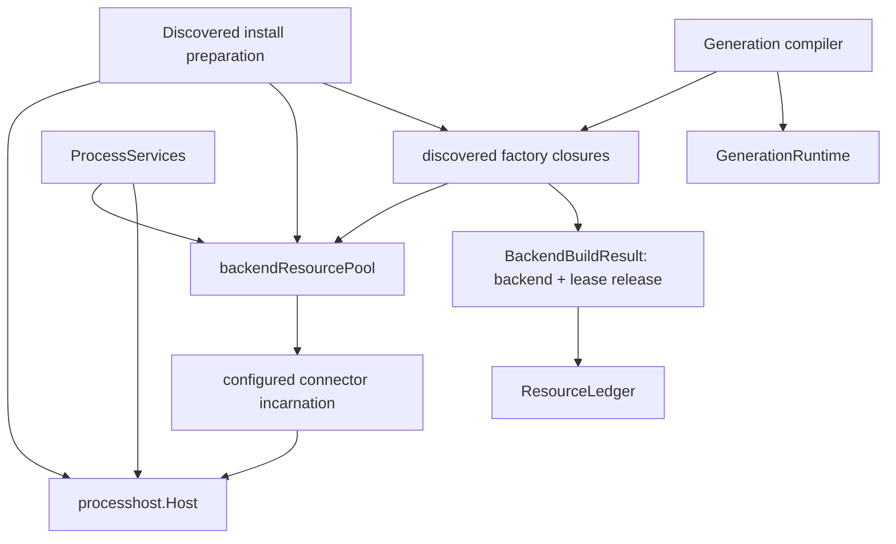

# Design Document

## Overview

This design removes redundant physical reconstruction of unchanged discovered executable `per_instance` backend connectors during material runtime-generation reload while preserving Go-LIP's immutable-generation consistency model.

The architecture adds one package-private, process-scoped connector-resource reconciliation owner above `processhost.Host`. The owner maps a complete semantic physical-resource identity to the current reusable physical incarnation while also retaining an ownership set of every successfully constructed incarnation that has not completed physical cleanup. Generation compilation acquires a lease claim. An unchanged candidate receives the already-configured backend/session resource plus a generation-owned lease release; a changed or invalidated identity constructs a fresh physical incarnation exactly through the current host/adapter path.

`ResourceLedger` remains the generation cleanup authority. `processhost.Host` remains the sole executable-process/IPC supervisor. The pool does **not** take over process slots, peer authentication, invalidation, reaping, or `Host.Close`; it only owns semantic reconciliation, dependent claims, and the timing of the existing per-resource composite cleanup.

The design is intentionally not a component runtime. There is no generic dependency graph, service locator, DI container, HMR, live plugin discovery, reusable public resource framework, or request-hot-path lookup.

### Goals

- Reduce physical connector reconstruction on material reload from all enabled eligible connectors to only changed or unusable identities.
- Preserve immutable `GenerationRuntime`, request/async generation pinning, last-good rollback, retained old-generation work, and no-drop retirement.
- Make physical identity complete/fail-closed for all construction/configure inputs.
- Give each physical incarnation one entry-level exactly-once cleanup capability while allowing several generation leases.
- Make Acquire/Close/build shutdown behavior linearizable and cancellation-safe.
- Preserve processhost security and supervision rather than layering a second process manager.
- Preserve established standard host-session operation concurrency and explicitly measure the cross-generation effect of sharing one Session.
- Establish deterministic high-cardinality operation-count evidence before enabling production reuse.

### Non-Goals

- Replace `runtimehost.Manager`, `GenerationRuntime`, `ResourceLedger`, `ProcessServices`, or `processhost.Host`.
- Pool built-in/in-process backend factories.
- Change `shared_artifact` process semantics or restart-required overlap behavior.
- Share generation-local executor/model-registry/catalog/routing/feature/policy/billing state.
- Add connector watchers, rescans, HMR, dynamic install/upgrade/remove, or an idle TTL cache.
- Add a public resource-pool API, manifest capability, ABI field, config flag, or concurrency flag.
- Increase standard `backendplugin/host.Session` Execute parallelism or remove its current lifecycle serialization.
- Guarantee that an external connector can never fail while a candidate performs a query-shaped operation.

## Boundary Commitments

| Concern | Existing authority | Treatment |
|---|---|---|
| process lifetime | `ProcessServices` / `processResourceOwner` | owns pool shutdown |
| generation cleanup | `ResourceLedger` | owns lease release |
| request/async lifetime | runtimehost generation refs | unchanged |
| process/IPC supervision | `processhost.Host` | unchanged |
| exact executable trust | `VerifiedArtifact` | digest contributes to identity |
| connector protocol | `pkg/lipsdk/backendplugin` | unchanged |
| discovered catalog | startup-fixed discovery/trust | unchanged |
| generation projections | runtimebundle/compiler | rebuilt per generation |
| physical cleanup timing | new private entry | composite cleanup exactly once |

Revalidate this design if a configure/launch input changes lifetime, `ConfiguredInstance` gains a new generation-preparation lifecycle action, processhost ownership semantics change, reuse expands beyond discovered `per_instance`, standard Session concurrency changes, or request execution begins consulting the pool.

## Existing Architecture and Target

Today an unchanged discovered `per_instance` backend is reconstructed for every material generation:

```text
Gen17 -> logical backend A -> physical A#17

compile Gen18
  -> same logical backend A -> physical A#18 (Activate + Configure)

publish Gen18
  old work -> A#17
  new work -> A#18

retire Gen17 -> cleanup A#17
```

The unique host activation handle is deliberate and remains required whenever a **new** physical incarnation is constructed.

Target for an unchanged identity:

```text
ProcessServices
  └─ backendResourcePool
      └─ identity A -> incarnation 41
          ├─ backend/session functions
          ├─ composite physical cleanup (entry-owned)
          ├─ claims = 2
          └─ owned until cleanup completes
               ▲       ▲
             Gen17   Gen18
```

Changed identity remains two physical resources:

```text
A-old -> incarnation 41 <- Gen17
A-new -> incarnation 42 <- Gen18 candidate
```

## Selected Architecture



The pool is a connector-specific reconciliation/ownership index, not a service registry. Request execution receives only backend functions already captured in an immutable generation.

## Construction and Ownership Timing

Discovered factory closures are installed before `ProcessServices` exists. Therefore the pool is created beside the discovered host and captured lexically:

```text
prepareDiscoveredPluginInstall
  acquire staging
  verify artifacts
  create processhost.Host
  create backendResourcePool
  install factories capturing host + pool
             │
             ▼
BuildHost
  transfer host + pool + artifacts + staging
             │
             ▼
NewProcessServices
  register staging cleanup
  register artifact cleanup
  register host cleanup
  register pool cleanup

reverse process close order:
  pool -> host -> artifacts -> staging
```

The same relative order is required on pre-transfer/bootstrap failure. There is no global registry or setter race.

## Private State Model

Illustrative shapes:

```go
type backendResourcePool struct {
    mu       sync.Mutex
    closing  bool
    nextInc  uint64

    current map[backendResourceIdentity]*backendResourceEntry
    owned   map[*backendResourceEntry]struct{} // physical success until cleanup completes

    buildCtx    context.Context
    cancelBuild context.CancelFunc
    buildWG     sync.WaitGroup

    // Tracks Acquire calls that have entered the handoff protocol so Close can
    // establish a terminal boundary before residual cleanup.
    handoffWG sync.WaitGroup
}

type backendResourceEntry struct {
    identity    backendResourceIdentity
    incarnation uint64
    state       backendResourceState
    claims      int
    ready       chan struct{}

    backend  execbackend.Backend
    cleanup  func() error
    buildErr error

    cleanupOnce sync.Once
    cleanupErr  error
}

type backendResourceLease struct {
    pool  *backendResourcePool
    entry *backendResourceEntry
    once  sync.Once // one claim release only
}
```

Exact implementation may use a condition/counter instead of `handoffWG`, and may merge fields when safe. Required semantics are more important than these names.

There is deliberately no generic `Resource[T]`, `Scope`, `Provider`, `Component`, `Context`, `Registry`, or public `LeaseManager` abstraction.

## Physical Resource Identity

### Principle

Identity answers:

> Can two generation builds safely execute through the same already-configured connector instance without another physical Configure/build?

False negatives cost optimization. False positives can violate correctness, so equality is conservative.

### Inputs

At the physical construction/configure choke point, identity treatment covers:

1. logical configured instance ID;
2. factory kind;
3. exact `VerifiedArtifact.DigestHex`;
4. process model;
5. exact effective opaque Configure YAML bytes;
6. normalized `backendplugin.RuntimePolicy`, including host-owned normalization such as `DisableTransportRetries=true`;
7. configure-time `SecretBundle` by private digest when present;
8. any future generation-varying launch/configure input.

Use SHA-256 with domain-separated, length-delimited fields. Runtime policy projection explicitly enumerates every field. Secret names are sorted; names/values are length-framed and hashed; plaintext does not survive identity construction or appear in logs/status/errors.

`BackendStateIdentity` remains a separate, narrower affinity/health continuity contract and is not the physical reuse key.

### Startup-fixed versus reload-varying inputs

Current production discovered factory closures capture artifact/process-model and install-time runtime policy at startup; the current discovered path also does not hot-rotate an artifact through SIGHUP. These facts still participate in identity treatment because their lifetime can evolve and focused construction tests can exercise them, but the high-cardinality **reload** matrix must not pretend they are currently reloadable.

Evidence is split:

- generation-reload matrix: unchanged/config-changed/remove/invalidate dimensions that current reload can actually exercise;
- focused identity/construction matrix: artifact digest, secret fingerprint, normalized policy, process model, factory/instance identity.

`shared_artifact` remains non-pooled; a process-model difference that leaves `per_instance` eligibility does not mean “build another pooled resource.”

### Drift/fail-closed gate

A structural contract test must force deliberate review when the Configure/physical input surface changes. Production hashing should remain explicit rather than reflection-driven. If completeness cannot be proven, the path uses current isolated construction.

## Resource State Machine and Linearization

Conceptual states:

```text
building -> live -> detached -> closed
    │        │         ▲
    └------> failed    │ invalidation/final-release/close removes current
```

`current` is only the reusable semantic index. `owned` contains every successfully constructed physical entry until entry-level physical cleanup completes, even after invalidation detaches it from `current`.

### Acquire/Close linearization

`Acquire` and `Close` use the same pool mutex for their terminal decision:

- successful Acquire claim reservation/handoff linearizes while `closing == false`;
- Close linearizes when it sets `closing = true` under that mutex;
- after that point no new claim may be reserved and no pending build result may be published/handed off as a post-close success.

Close cancels pool-owned builders and waits both builder completion and Acquire handoff completion before residual cleanup. This prevents a lease from being handed a physical resource after fail-safe cleanup has already run.

### Pool-owned builder lifetime

An absent-key Acquire does not make the caller the physical builder owner. It:

1. installs a building entry and reserves the caller's prospective claim under the mutex;
2. starts exactly one short-lived **pool-owned** builder goroutine using a context derived from `pool.buildCtx`;
3. increments `buildWG` before the goroutine becomes runnable;
4. the caller then waits like any other claimant on `ready` or its own context.

The physical builder must receive the pool-owned context through `processhost.Activate`/Configure. The pooled path must not use `context.Background()` for the build lifetime.

Caller cancellation abandons only that caller's reserved claim. It does not cancel a build that may serve other claimants. If every claim disappears before a build succeeds, the completed physical result is not published as an idle entry; it is cleaned immediately.

Pool Close calls `cancelBuild()` before `buildWG.Wait()`. The processhost/transport stack is already context-aware; a blocked-build test proves the path exits on cancellation and cannot publish late.

### Waiter reservation protocol

For a building entry, every caller increments `claims` **before** it waits. The claim is already the ownership reservation that will become its lease if the build succeeds.

```text
Acquire(building)
  lock
  closing? -> reject
  claims++             // reserve before wait
  unlock

  wait ready | caller ctx

  canceled -> abandon reserved claim
  ready -> re-check state / close boundary
           success -> return lease for existing reserved claim
```

This removes the race in which the first caller builds and releases to zero before a waiter has incremented a ref. A deterministic scheduling test holds a waiter after reservation, releases the first returned lease, then proves physical cleanup cannot occur until the waiter abandons/releases its claim.

### Build completion

On success, builder completion reacquires the mutex:

- if pool is closing or the entry has zero remaining claims, do not publish it as reusable; record physical ownership long enough to clean it and wake waiters;
- otherwise attach backend/composite cleanup, add entry to `owned`, mark live, and wake waiters;
- no external cleanup/Configure/launch runs under the mutex.

On failure:

- remove the building entry from `current` if still exact;
- store build error and mark failed;
- wake waiters;
- do not negative-cache it;
- waiter claim abandonment eventually reaches zero without a physical cleanup because construction never completed.

A later independent Acquire may retry.

### Live reuse

A live hit reserves/increments its claim under the mutex and returns the immutable backend value plus a fresh lease release. It performs no factory call, process activation, Configure, or adapter build.

### Release

Lease `sync.Once` only prevents one generation lease from releasing its claim twice. It is **not** the physical cleanup authority.

On release:

```text
lease.once:
  lock
  decrement exact entry claim
  if claims > 0 -> unlock, return
  if current[key] == entry -> remove from current
  mark detached
  unlock
  entry.cleanupPhysical()
```

`entry.cleanupPhysical()` owns a separate `sync.Once` and stored result. Every path that may physically tear down the pooled resource—normal final release and pool fail-safe shutdown—calls this same method. It removes the entry from `owned` only after cleanup completes.

Thus final Release racing Pool.Close cannot execute physical cleanup twice.

## Physical Cleanup Ownership Handoff

This design distinguishes **process supervision ownership** from the **per-resource cleanup capability**.

Current physical construction produces two cleanup responsibilities:

1. `adapter.Build(...).Cleanup()` -> closes the configured host Session / connector instance RPC-side resource;
2. `ActivateResult.Cleanup` -> calls `processhost.Host.CloseInstance(hostActivationID)`, which removes the host instance and reaps its process slot when appropriate.

`buildDiscoveredPhysical` shall return one idempotent composite physical cleanup that preserves the current ordering/error-join behavior across those two operations. On a pool miss, the reconciliation entry consumes that composite cleanup. It is never copied into a generation ledger.

Each generation receives only:

```go
pluginreg.BackendBuildResult{
    Backend: entry.backend,
    Cleanup: lease.Release,
}
```

`buildBackends` continues transferring that cleanup into `ResourceLedger`.

`processhost.Host` retains its internal `instances`/`slots`, invalidation/reap logic, and `Host.Close` fail-safe cleanup. The pool does not own a `Process` object or replace host supervision; it owns only when the existing per-instance composite cleanup may be invoked without violating another generation's lease.

An exactly-once regression shall count session close, `CloseInstance`/activation cleanup, entry cleanup, and later `Host.Close` to prove these paths do not become competing physical owners.

## Physical Construction Integration

Refactor `buildDiscoveredBackend` only enough to separate:

1. effective input/eligibility preparation;
2. physical construction of a new unique host activation/session/adapter resource;
3. pool Acquire returning a leased generation result.

Conceptually:

```go
func buildDiscoveredBackend(...) (pluginreg.BackendBuildResult, error) {
    input, err := prepareDiscoveredPhysicalInput(...)
    if err != nil { ... }
    if pool == nil || !eligible(input) {
        return buildDiscoveredPhysical(ctx, input)
    }

    id, shareable, err := physicalIdentity(input)
    if err != nil { ... }
    if !shareable {
        return buildDiscoveredPhysical(ctx, input)
    }

    return pool.Acquire(ctx, id, func(buildCtx context.Context, inc uint64) (physicalBackendResource, error) {
        return buildDiscoveredPhysical(buildCtx, input, inc)
    })
}
```

Every **new** per-instance physical build retains the current unique host activation ID behavior. Pool reuse avoids entering that build path at all.

## Candidate Preparation and Generation-Local State

A reuse hit performs no Configure/Start/Stop/Close/mutating preflight. Candidate rollback releases only its lease and cannot invalidate the shared resource merely because unrelated candidate validation failed.

Generation-local structures are still recreated:

```text
leased backend values
   -> BackendInventory
   -> new modelregistry.Runtime / snapshot / refresh ownership
   -> new executor/routing/policy/billing views
   -> new handler / GenerationBundle / ResourceLedger
```

Query-shaped metadata operations may therefore reach the same physical Session from overlapping generations. This is acceptable only under the established standard-host concurrency behavior below.

If future generation preparation introduces a mutating lifecycle call against an external connector, that path becomes non-shareable until separately redesigned.

## Established Connector Operation Concurrency

### Standard host contract today

Production uses `backendplugin/host.Session` through the default discovered connector path.

- `Session.Execute` holds the existing `lifecycleMu` for the full execute RPC; two Execute calls on the same Session are serialized, and `Close` cannot tear down the transport during Execute.
- `Resolve`, `ListModels`, optional `CountTokens`, and optional `FinalizeBilling` do not take that client lifecycle mutex. The gRPC server already leases a configured instance around those calls; connectors are therefore already exposed to metadata/auxiliary overlap with other operations today.

This specification preserves those facts. It does not remove `lifecycleMu`, introduce a new semaphore, or change the public `ConfiguredInstance` ABI.

### Cross-generation consequence

With fresh Gen17/Gen18 Sessions today, overlap can transiently provide two independent Execute serialization domains. With one pooled Session, retained Gen17 and new Gen18 Execute calls share the same existing serialization domain.

That is a capacity/scheduling change during overlap, not a canonical request transformation. It must be explicit rather than hidden behind an “observationally identical” claim.

A deterministic test shall hold an old-generation Execute open, start a new-generation Execute on the same pooled Session, and prove behavior follows the existing Session serialization without deadlock, cancellation corruption, or wrong-generation cleanup. Supporting benchmark/evidence should record the overlap effect.

If that established serialization makes connector reuse operationally unacceptable for the intended long-lived-stream workload, implementation must re-scope instead of changing Session concurrency under this spec.

Focused race/conformance tests shall also cover overlapping-generation `Resolve`, `ListModels`, CountTokens, FinalizeBilling, and execution through the standard host. Non-standard injected/test session implementations are pooled only when they satisfy the same established host behavior; otherwise they bypass reuse.

## Invalidation and Detached Entries

Semantic identity and physical incarnation differ:

```text
identity X
  incarnation 7 -- fails/detaches, still leased by Gen17
  incarnation 8 -- new current resource for later generation
```

Invalidation flow for an entry:

1. under pool synchronization compare the exact `(identity, entry/incarnation)`;
2. if it is the current entry, remove only that exact incarnation from `current` and mark detached;
3. leave it in `owned` while existing lease claims remain or until terminal pool cleanup invokes entry cleanup;
4. future Acquire sees no current reusable entry and may build a new incarnation;
5. delegate the physical process-generation invalidation/reap to existing `processhost.Host`;
6. do not live-substitute a replacement into published generations;
7. stale callbacks from incarnation 7 cannot remove incarnation 8.

Final lease release later invokes the same entry-level cleanup once; it may find the process already reaped, using existing idempotent/error-normalization semantics.

Tracking detached entries in `owned` is essential: terminal `Pool.Close` can enumerate and fail-safe clean an invalidated resource even if a retained generation leaked/failed to release its lease before process teardown.

## Process Shutdown

`runtimebundle.Host.Close` remains the process shutdown coordinator, and runtimehost generation drain remains the expected first stage.

Relevant target order:

```text
generation admission stopped / generations drain
  -> lease releases
  -> ProcessServices.Close
       backendResourcePool.Close
         1. lock: set closing (linearization point), reject later Acquire
         2. cancel pool build context
         3. unlock
         4. wait pool-owned builders and Acquire handoffs
         5. lock: detach/snapshot all residual owned entries, including invalidated/detached
         6. unlock
         7. call entry.cleanupPhysical on residual entries
       processhost.Host.Close
       VerifiedArtifact.Close
       staging removal
```

Pool Close never holds its mutex while waiting for builders/handoffs or running physical cleanup. Builders use pool-owned cancellation and cannot publish after the close boundary. Entry cleanup is once-guarded, so a concurrent final lease release and shutdown converge safely.

Under normal successful host shutdown, generation drain should make residual claims empty before ProcessServices close. Residual cleanup remains a terminal fail-safe for broken/aborted ownership paths; after terminal process shutdown, old leases are not promised a usable connector.

## Error Handling

- Preserve existing runtimebundle/processhost error wrapping and public reload categories.
- Add no public `resource_reuse_failed` category.
- Failed build leaves no reusable current resource and is not permanently cached.
- Caller cancellation while waiting returns the caller context error and abandons only its reservation.
- Pool Close cancellation is pool-owned and terminates builders for process shutdown.
- Final normal lease cleanup errors flow through existing ResourceLedger aggregation.
- Residual process-shutdown cleanup errors join existing ProcessServices close errors.
- Entry cleanup stores one result so racing cleanup callers observe one physical cleanup outcome.

## Concurrency Rules to Prove

1. two concurrent absent Acquires -> one builder, two pre-reserved claims, one incarnation;
2. first returned lease release before second waiter wakes -> no physical cleanup until waiter abandons/releases;
3. waiter cancellation -> only that claim drops; builder/other claims survive;
4. final release racing new Acquire -> Acquire either reserves before detach or builds after detach; never receives closing entry;
5. Close linearizes against Acquire -> no post-close claim/build publication;
6. Close cancels a blocked pool-owned builder and waits it; no late publication after host teardown;
7. final release racing Close -> entry-level physical cleanup exactly once;
8. invalidation detaches current but leaves entry process-owned until cleanup; Close can enumerate it;
9. stale invalidation cannot detach newer incarnation;
10. candidate rollback racing retained old-generation release preserves correct claim count and cleanup timing.

## Scale and Identity Evidence

### High-cardinality generation-reload matrix

At least 100 synthetic discovered `per_instance` connector rows, no external credentials, deterministic counters for factory physical build, activation/launch, Configure, cleanup, lease acquire/release.

| Scenario | Expected physical construction |
|---|---|
| baseline unrelated reload before reuse | O(N), characterize current behavior |
| target unrelated reload, N unchanged | 0 new builds/activations/Configure |
| one/K backend configs changed | exactly 1/K new physical resources |
| remove/disable subset | no build for removed rows; old resource retained by old generation |
| candidate rollback after reuse hits | no physical cleanup of active resources |
| candidate builds K new then fails | K new resources cleaned |
| invalidate one then compile same config | exactly one fresh incarnation |

### Focused identity/construction matrix

Independent focused tests exercise physical input dimensions that are startup-fixed in current production reload but are correctness-critical identity inputs:

| Difference | Expected |
|---|---|
| artifact digest | identity miss; fresh physical build when otherwise eligible |
| secret fingerprint | identity miss; fresh build when secrets are effective input |
| normalized RuntimePolicy | identity miss; fresh build |
| process model | no alias; `shared_artifact` follows existing non-pooled/restart-required path |
| factory kind / logical instance | no alias |

This separation avoids claiming hot artifact/policy/process-model reload support that does not exist today.

### Supporting benchmark

Record candidate compile time/allocations and available synthetic/native resource observations. Primary correctness/ROI remains deterministic operation counts. No request throughput/token-latency gain is claimed.

Also characterize retained-old-generation/new-generation Execute scheduling on one pooled standard Session so the known serialization tradeoff is visible in implementation evidence.

## File Structure Plan

Possible private files:

```text
internal/infra/runtimebundle/
  backend_resource_identity.go
  backend_resource_pool.go
  backend_resource_identity_test.go
  backend_resource_pool_test.go
  discovered_factories.go
  plugin_catalog.go / composition_root.go / process_services*.go
  reload_backend_resource_reuse_test.go

internal/archtest/
  backend_resource_reconciliation_test.go
```

No new generic `resource`, `container`, `dependency`, or lifecycle framework package is required.

## Testing Strategy

TDD order:

1. baseline/high-cardinality and identity RED tests;
2. reserved-claim/Acquire-Close/detached ownership/builder cancellation RED tests;
3. exactly-once physical cleanup/ownership handoff RED tests;
4. candidate isolation and standard Session operation-concurrency RED tests;
5. private identity + pool implementation;
6. process ownership transfer and discovered-factory integration;
7. generation reload matrix, invalidation and retained-work integration;
8. race/goleak/security/conformance/no-drop regressions;
9. benchmark/evidence and final simplification gate.

Existing ResourceLedger, processhost, discovered overlap/restart-required, backend security/conformance, retained-generation, and reload last-good/no-drop suites remain regression authorities.

## Rejected Alternatives

### Reconfigure an existing resource in place

Rejected: mutates provider state under an old generation.

### Put semantic generation reconciliation in processhost

Rejected: conflates LIP configuration identity with physical process supervision.

### Reuse `BackendStateIdentity`

Rejected: does not cover artifact, policy, secret, process-model, or future physical inputs.

### Return one `BackendBuildResult` cleanup to multiple generations

Rejected: permits early/double physical teardown.

### Track only `current` entries

Rejected after review: invalidation removes an entry from `current` while retained generations can still lease it, leaving Pool.Close unable to enumerate residual owned resources.

### Let the initiating Acquire own the builder

Rejected after review: caller cancellation/shutdown lifetime becomes ambiguous and can leave Close waiting on an unbounded background operation. The pool owns builder context/goroutine lifetime.

### Increment waiter refs only after build publication

Rejected after review: the first claimant can release to zero before a scheduled waiter acquires its ref. Claims are reserved before waiting.

### Add idle cache or TTL

Rejected: adds eviction/resource-pressure policy with no demonstrated need.

### Change Session Execute concurrency as part of reuse

Rejected: this would broaden the refactor into host/ABI concurrency semantics. Preserve current serialization, measure its overlap effect, and re-scope pooling if unacceptable.

### Pool all backend types / share whole model runtime

Rejected: no evidence-backed ROI and would weaken clear generation ownership.

## Design Success Criteria

The refactor succeeds only if:

1. unchanged eligible reloads produce zero new physical Activate/Configure work;
2. changed/unusable identities get fresh physical incarnations before publication;
3. candidate rollback cannot mutate/close the last-good shared connector;
4. every waiting Acquire reserves ownership before waiting, eliminating zero-ref handoff races;
5. Close has a terminal linearization point, cancels/joins pool builders, and prevents late publication;
6. invalidated/detached physical entries remain process-owned/enumerable until cleanup;
7. final release, invalidation aftermath, and process shutdown converge on one entry-level exactly-once physical cleanup;
8. processhost remains the sole physical supervisor and pool close precedes host/artifact/staging teardown;
9. generation-local runtime state remains separate and request execution performs no pool lookup;
10. established standard Session concurrency is preserved and its cross-generation Execute serialization is explicitly characterized;
11. identity tests cover all physical input dimensions without pretending startup-fixed inputs are hot-reloadable;
12. no public config/ABI or generic runtime framework is introduced;
13. deterministic scale evidence still justifies the implementation after accounting for concurrency/lifecycle complexity.
