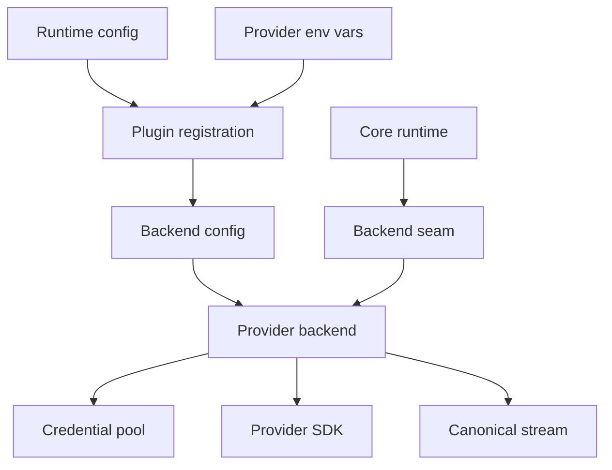
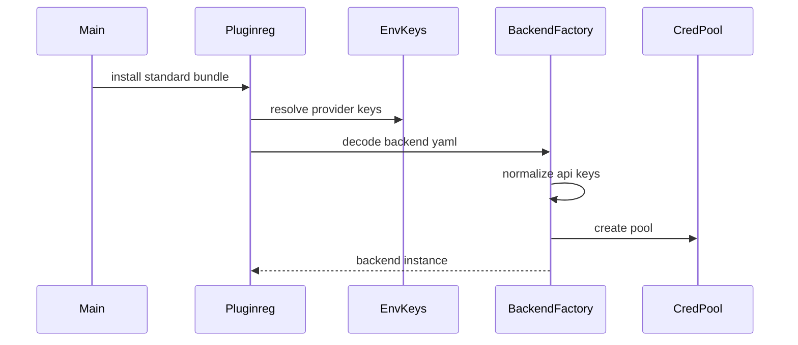
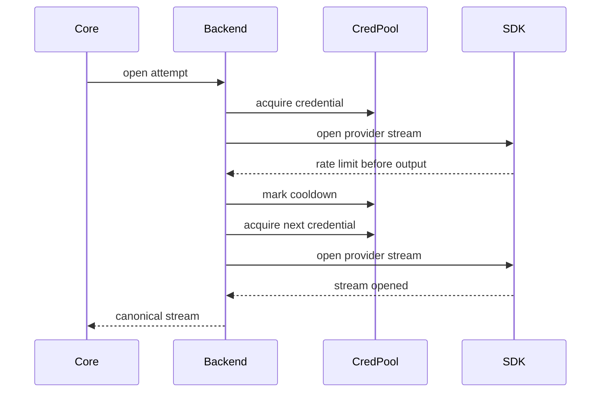
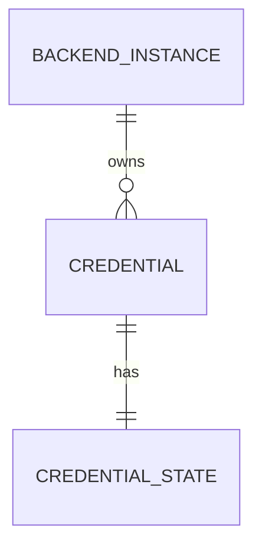

# Design Document

## Overview

This feature stabilizes the Go backend connector architecture for the official hosted-provider API families: OpenAI Responses, legacy OpenAI-compatible chat completions, Anthropic Messages, and Gemini generateContent. The design preserves the existing backend plugin packages and runtime executor seam while adding a credential-pool model that separates routable backend instance identity from API-key usefulness state.

The primary users are operators and maintainers. Operators gain cleaner configuration for multiple API keys without selector clutter, and maintainers gain a bounded adapter-edge design that avoids porting Python LIP's per-key backend instance topology into Go.

The feature changes the current system by adding multi-key credential pools, provider-local credential rotation before first canonical output, config/env normalization for `api_keys`, and deterministic tests for connector parity and retry behavior. It does not change canonical request/event contracts or routing selector syntax.

### Goals

- Port official hosted-provider backend behavior through Go-native backend adapter boundaries.
- Separate backend instance identity from API-key credential state.
- Preserve core-owned inter-backend failover and the no-retry-after-first-output invariant.
- Reuse existing protocol implementations and refbackend/conformance harnesses.

### Non-Goals

- OAuth connector support or borrowed native-client credentials.
- Bedrock or ACP implementation changes beyond preserving compatibility.
- Core routing selector syntax changes.
- A broad OpenAI-compatible provider profile framework without a concrete provider need.
- New provider SDK dependencies beyond those already present in `go.mod`.

## Boundary Commitments

### This Spec Owns

- Adapter-edge credential pools for official hosted-provider backend plugins.
- Config and env normalization that maps `api_key`, `api_keys`, and numbered provider env vars into credential lists.
- Provider-local pre-output credential rotation and error classification for OpenAI Responses, OpenAI legacy, Anthropic, and Gemini.
- Deterministic tests and refbackend fixtures needed to prove credential pool behavior and protocol parity.
- Documentation examples for backend instances as deployment identities.

### Out of Boundary

- `pkg/lipapi` canonical model changes.
- `pkg/lipsdk` plugin contract changes.
- `internal/core/routing` selector grammar or candidate identity changes.
- Runtime attempt sequencing or B2BUA store semantics, except tests that prove the existing semantics are preserved.
- OAuth, Bedrock, ACP, live-provider test suites, and dynamic plugin loading.

### Allowed Dependencies

- Backend plugins may continue to import official provider SDKs listed in `go.mod`.
- `internal/pluginreg` may decode YAML with `gopkg.in/yaml.v3` and pass normalized config into backend plugins.
- `internal/plugins/backends/credpool` may use only standard library packages and project-internal non-provider utilities.
- Provider packages may import `credpool`; `credpool` must not import provider packages, SDK packages, `internal/core/routing`, or `internal/core/runtime`.
- Runtime tests may import test fakes and existing core/runtime packages, but production core code must not learn about credentials.

### Revalidation Triggers

- Any change to `execbackend.Backend` or plugin factory signatures.
- Any change that makes credential ids visible in routing selectors, candidate keys, B-leg records, or public diagnostics.
- Any change to canonical request/event semantics, capability negotiation, or no-retry-after-first-output behavior.
- Any new official backend family added to this credential-pool model.
- Any change to env var ingestion semantics for numbered credentials.

## Architecture

### Existing Architecture Analysis

The current codebase already has the target backend packages and the correct dependency direction. `internal/core/runtime` opens attempts through `execbackend.Backend`, performs capability negotiation, records B-leg lineage, and swallows recoverable pre-output failures. Backend packages translate canonical calls into provider SDK requests and convert provider streams back into canonical events.

The gap is credential management. Current official hosted-provider configs accept a single `APIKey`, `pluginreg.ResolveUpstreamAPIKeysFromEnv` reads one key per family, and no package models per-key cooldown or auth-invalid state. Existing routing ids already represent backend instances, so this feature must add credential pools without changing selector semantics.

### Architecture Pattern & Boundary Map

Selected pattern: adapter-edge state with provider-local SDK integration. A small shared `credpool` package owns credential selection and state transitions. Provider packages own SDK client construction, provider error classification, and when to ask the pool for another credential. Core runtime remains unaware of API keys.



Key decisions:

- Backend instance id remains a routeable deployment identity.
- Credential state is local to backend adapters and never becomes a selector key.
- Shared logic is limited to credential state, key normalization, and retry-after parsing.
- Provider-specific SDK and error details stay in provider packages.

### Technology Stack

| Layer | Choice / Version | Role in Feature | Notes |
| --- | --- | --- | --- |
| Language | Go 1.26.2 | Implementation language | Version from `go.mod` |
| Config | `gopkg.in/yaml.v3` v3.0.1 | Decode `api_key` and `api_keys` plugin config | Existing dependency |
| OpenAI SDK | `github.com/openai/openai-go/v3` v3.32.0 | OpenAI Responses and legacy backend calls | Backend packages only |
| Anthropic SDK | `github.com/anthropics/anthropic-sdk-go` v1.37.0 | Anthropic Messages backend calls | Backend package only |
| Gemini SDK | `google.golang.org/genai` v1.54.0 | Gemini generateContent backend calls | Backend package only |
| Testing | `testing`, `httptest`, fuzz tests | Deterministic adapter and conformance coverage | No live-provider dependency |

## File Structure Plan

### Directory Structure

```text
internal/plugins/backends/
  credpool/
    pool.go              # Credential state, selection, and mutation contracts
    retry_after.go       # Retry-After and provider cooldown hint parsing
    errors.go            # Exhaustion and classification-facing errors
    pool_test.go         # Selection, cooldown, auth invalid, and concurrency tests
    retry_after_test.go  # Retry-After parsing tests
  openaicred/            # Shared OpenAI-family credential pool + HTTP client seam (Responses + legacy)
    pool.go, client.go, classify.go, credentials.go
    *_test.go
  openairesponses/
    plugin.go            # Config shape and backend construction with credential pool
    invoke.go            # Provider SDK request handling with selected credential
    integration_test.go  # Key rotation, exhaustion, refbackend 401/429 (in lieu of a separate credentials_test.go)
  openailegacy/
    plugin.go            # Config shape and backend construction with credential pool
    invoke.go            # Provider SDK request handling with selected credential
    integration_test.go  # Same coverage pattern as openairesponses
  anthropic/
    plugin.go            # Config shape and backend construction with credential pool
    invoke.go            # Provider SDK request handling with selected credential
    integration_test.go  # Anthropic key rotation and exhaustion tests
  gemini/
    plugin.go            # Config shape and backend construction with credential pool
    invoke.go            # GenAI client construction with selected credential
    integration_test.go  # Gemini key rotation and exhaustion tests
internal/pluginreg/
  keys.go                # Provider env key list resolution, including numbered vars
  backends_install.go    # YAML normalization for api_key and api_keys
  keys_test.go           # Env ingestion tests
  build_backend_test.go  # Config compatibility tests
internal/refbackend/
  openairesponses/server.go      # Optional rate limit and auth fixtures
  openaichat/server.go           # Optional rate limit and auth fixtures
  anthropicmessages/server.go    # Optional rate limit and auth fixtures
  gemini/server.go               # Optional rate limit and auth fixtures
internal/testkit/conformance/
  backend_credentials_test.go     # Cross-backend credential behavior checks
internal/core/runtime/
  executor_backend_credentials_test.go # Runtime invariants around backend ids and post-output failures
config/
  config.multi-instance.example.yaml   # Operator examples for api_keys and true multi-instance routing
```

### Modified Files

- `internal/plugins/backends/openairesponses/plugin.go` - change config from single-key-only to normalized credential list while preserving `APIKey` compatibility.
- `internal/plugins/backends/openailegacy/plugin.go` - same config and pool integration for legacy chat completions.
- `internal/plugins/backends/anthropic/plugin.go` - same config and pool integration for Anthropic.
- `internal/plugins/backends/gemini/plugin.go` - same config and pool integration for Gemini.
- `internal/pluginreg/backends_install.go` - decode `api_keys`, merge with `api_key` and env defaults, and pass normalized keys to providers.
- `internal/pluginreg/keys.go` - resolve numbered env vars into ordered slices per provider family.
- `config/config.multi-instance.example.yaml` - document one instance with multiple keys and multiple instances for genuine upstream targets.

## System Flows

### Startup Config Normalization



The normalization order is explicit: YAML `api_keys` and `api_key` are instance-local, env keys are defaults when YAML provides no credentials, and empty/duplicate keys are removed before pool creation.

### Pre-Output Credential Rotation



Credential rotation is provider-local and ends before the backend returns a canonical stream or yields the first canonical output event. If no credential is usable, the backend returns a classified pre-output failure and the core decides whether another backend instance can be attempted.

## Requirements Traceability

| Requirement | Summary | Components | Interfaces | Flows |
| --- | --- | --- | --- | --- |
| 1.1, 1.2, 1.3 | Scope limited to official hosted-provider backends | Provider backend integrations, File Structure Plan | Backend config contracts | Startup Config Normalization |
| 2.1, 2.2, 2.3 | Port behavior, not Python topology | Provider backend integrations, Conformance tests | Canonical mapping tests | Pre-Output Credential Rotation |
| 3.1, 3.2, 3.3, 3.4 | Separate backend identity from credentials | Config normalizer, Credential pool, Runtime invariant tests | `BackendCredentials`, selectors unchanged | Startup Config Normalization |
| 4.1, 4.2, 4.3, 4.4 | Model per-key usefulness state | Credential pool, Retry-after parser, Provider classifiers | `Pool`, `MarkRateLimited`, `MarkAuthInvalid` | Pre-Output Credential Rotation |
| 5.1, 5.2, 5.3, 5.4 | Preserve retry ownership boundaries | Provider adapters, Core runtime tests | `CredentialAttempt`, recoverable pre-output errors | Pre-Output Credential Rotation |
| 6.1, 6.2, 6.3, 6.4 | Support deployment config and key pools | Pluginreg config normalizer, Env key resolver | YAML `api_key`, YAML `api_keys`, env key lists | Startup Config Normalization |
| 7.1, 7.2, 7.3, 7.4, 7.5 | Reuse protocol implementations with narrow helpers | Existing provider packages, `credpool`, `openaicaps` | Provider overlay boundaries | Startup Config Normalization |
| 8.1, 8.2, 8.3 | Fail explicitly on capability gaps | Existing capability negotiation, provider caps | `ResolveCaps`, capability profiles | Backend open attempt |
| 9.1, 9.2, 9.3, 9.4 | Streaming and event mapping remain contracts | Provider stream mappers, conformance tests | `lipapi.EventStream` | Provider stream mapping |
| 10.1, 10.2, 10.3 | Emulator-first evidence | Refbackend fixtures, conformance harness | `httptest` handlers and fixtures | Deterministic test flows |
| 11.1, 11.2, 11.3, 11.4 | Tests lock architecture and parity | Credential pool tests, pluginreg tests, runtime tests, provider tests | Test fixtures and fakes | All flows |

## Components and Interfaces

| Component | Domain/Layer | Intent | Req Coverage | Key Dependencies | Contracts |
| --- | --- | --- | --- | --- | --- |
| Credential Pool | Backend adapter support | Store and select per-instance credentials with usefulness state | 3.3, 4.1, 4.2, 4.3, 4.4, 5.1, 5.3, 7.5 | Standard library P0 | Service, State |
| Retry Hint Parser | Backend adapter support | Normalize retry-after and cooldown hints | 4.3, 11.2 | Standard library P1 | Service |
| Plugin Config Normalizer | Standard distribution | Convert YAML and env credentials into backend configs | 3.1, 6.1, 6.2, 6.3, 6.4 | `yaml.v3` P0, backend configs P0 | Service |
| Provider Backend Integrations | Backend plugins | Apply credential pools to SDK-backed provider calls | 1.1, 2.1, 5.1, 5.3, 7.1, 8.1, 9.1 | SDKs P0, `credpool` P0 | Service, Event |
| Provider Error Classifiers | Backend plugins | Map SDK failures to credential actions and core errors | 4.2, 4.3, 4.4, 5.3 | SDK error types P1 | Service |
| Refbackend Error Fixtures | Test support | Deterministic 401 and 429 behavior for tests | 10.1, 10.2, 10.3, 11.2 | `httptest` P1 | API |
| Conformance and Runtime Tests | Test support | Prove stable ids, parity, and retry invariants | 2.3, 9.4, 11.1, 11.2, 11.3, 11.4 | Existing testkit P1 | Batch |

### Backend Adapter Support

#### Credential Pool

| Field | Detail |
| --- | --- |
| Intent | Own per-key usefulness state for one backend instance. |
| Requirements | 3.3, 4.1, 4.2, 4.3, 4.4, 5.1, 5.3, 7.5 |

**Responsibilities & Constraints**

- Own ordered credentials attached to one backend instance.
- Select only currently usable credentials.
- Track temporary cooldowns and permanent auth invalidation.
- Expose no provider SDK types and no routing candidate concepts.
- Be safe for concurrent requests sharing the same backend instance.

**Dependencies**

- Inbound: provider backend packages use the pool during `Open` (P0).
- Outbound: standard library time and sync primitives (P0).
- External: none.

**Contracts**: Service [x] / API [ ] / Event [ ] / Batch [ ] / State [x]

##### Service Interface

```go
type Credential struct {
    ID     string
    Secret string
}

type Clock func() time.Time

type State string

const (
    StateUsable      State = "usable"
    StateCooldown    State = "cooldown"
    StateAuthInvalid State = "auth_invalid"
)

type Pool struct { /* unexported fields */ }

func New(credentials []Credential, clock Clock) (*Pool, error)
func (p *Pool) Acquire(now time.Time, exclude map[string]struct{}) (Credential, error)
func (p *Pool) MarkRateLimited(id string, until time.Time)
func (p *Pool) MarkAuthInvalid(id string)
func (p *Pool) Snapshot(now time.Time) []CredentialStatus
```

- Preconditions: credentials are normalized before construction; empty secrets are rejected.
- Postconditions: `Acquire` never returns a credential in cooldown or auth-invalid state.
- Invariants: credential ids are local to the pool and are never surfaced as routing ids; `Clock` is defined in `credpool` and does not import or depend on core runtime clock types.

##### State Management

- State model: `usable`, `cooldown until time`, `auth invalid`.
- Persistence: in-memory only for this spec.
- Concurrency strategy: internal lock around selection and mutation.

**Implementation Notes**

- Integration: provider packages create one pool per backend instance.
- Validation: unit tests cover ordering, cooldown expiry, auth invalidation, exhaustion, and concurrent access.
- Risks: avoid making this a generic backend health framework; keep time injection limited to deterministic credential-state tests.

#### Retry Hint Parser

| Field | Detail |
| --- | --- |
| Intent | Convert provider retry hints into credential cooldown deadlines. |
| Requirements | 4.3, 11.2 |

**Responsibilities & Constraints**

- Parse standard `Retry-After` duration and HTTP-date values.
- Accept provider-local fallback duration when no reliable hint exists.
- Return explicit parse failure so provider classifiers can choose conservative behavior.

**Dependencies**

- Inbound: provider error classifiers (P1).
- Outbound: standard library `net/http` header values and `time` (P1).

**Contracts**: Service [x] / API [ ] / Event [ ] / Batch [ ] / State [ ]

##### Service Interface

```go
func CooldownFromRetryAfter(value string, now time.Time) (time.Time, bool)
```

- Preconditions: caller supplies trimmed or raw header value.
- Postconditions: returned time is after `now` when `ok` is true.
- Invariants: parser does not inspect provider SDK errors directly.

### Standard Distribution

#### Plugin Config Normalizer

| Field | Detail |
| --- | --- |
| Intent | Normalize backend YAML and env credentials into provider config structs. |
| Requirements | 3.1, 3.2, 3.3, 6.1, 6.2, 6.3, 6.4 |

**Responsibilities & Constraints**

- Support existing `api_key` field.
- Add `api_keys` as an ordered list field.
- Use env keys only when YAML provides no credential material for that backend instance.
- Remove empty entries and duplicate secrets while preserving first occurrence order.
- Preserve explicit multiple backend instances when config defines distinct plugin ids.

**Dependencies**

- Inbound: `InstallStandardBundleOn` and backend factory functions (P0).
- Outbound: provider config structs (P0), `gopkg.in/yaml.v3` (P0).

**Contracts**: Service [x] / API [ ] / Event [ ] / Batch [ ] / State [ ]

##### Service Interface

```go
type HostedBackendYAML struct {
    BaseURL string   `yaml:"base_url"`
    APIKey  string   `yaml:"api_key"`
    APIKeys []string `yaml:"api_keys"`
}

type UpstreamAPIKeys struct {
    OpenAI    []string
    Anthropic []string
    Gemini    []string
}

func ResolveUpstreamAPIKeysFromEnv() UpstreamAPIKeys
func EffectiveAPIKeys(yamlKey string, yamlKeys []string, defaults []string) []string
```

- Preconditions: backend factory has decoded YAML into the hosted shape.
- Postconditions: returned keys are trimmed, non-empty, de-duplicated, and ordered.
- Invariants: this layer does not create backend instances from env var suffixes.

**Implementation Notes**

- Integration: `OPENAI_API_KEY`, `OPENAI_API_KEY_2`, `OPENAI_API_KEY_3` and equivalent Anthropic/Gemini names populate family defaults.
- Validation: pluginreg tests cover backward compatibility, list precedence, duplicate removal, and no instance generation.
- Risks: existing tests that expect string fields in `UpstreamAPIKeys` need updates.

### Backend Plugins

#### Provider Backend Integrations

| Field | Detail |
| --- | --- |
| Intent | Use the credential pool while preserving each provider's existing protocol mapper and stream mapper. |
| Requirements | 1.1, 2.1, 2.2, 5.1, 5.2, 5.3, 5.4, 7.1, 7.2, 7.3, 7.4, 8.1, 8.2, 8.3, 9.1, 9.2, 9.3 |

**Responsibilities & Constraints**

- Keep canonical-to-provider mapping functions provider-local.
- Use selected credentials when constructing SDK clients or request options.
- Retry another credential only for provider-classified pre-output credential failures.
- Return a canonical event stream only after the selected credential has successfully opened the provider stream.
- Never switch credentials after the first canonical output event is returned or yielded.

**Dependencies**

- Inbound: core executor through `execbackend.Backend.Open` (P0).
- Outbound: provider SDKs (P0), `credpool` (P0), `lipapi` errors (P0).

**Contracts**: Service [x] / API [ ] / Event [x] / Batch [ ] / State [ ]

##### Service Interface

```go
type Config struct {
    BaseURL    string
    APIKey     string
    APIKeys    []string
    HTTPClient *http.Client
}
```

- Preconditions: base URL is valid according to existing provider rules.
- Postconditions: `New` produces a backend that behaves identically for single-key configs and adds local key rotation for multi-key configs.
- Invariants: provider SDK types remain inside provider packages.

##### Event Contract

- Published events: canonical backend events through `lipapi.EventStream`.
- Subscribed events: provider stream chunks or SDK iterator events.
- Ordering: provider event order is preserved; retry with another credential occurs only before any canonical event is emitted.

**Implementation Notes**

- Integration: OpenAI and Anthropic may construct clients per credential or use request options; Gemini can construct a GenAI client with the selected key during `Open`.
- Validation: existing mapping and integration tests must remain green; new credential tests use local `httptest` or refbackend fixtures.
- Risks: provider SDK retries should not obscure per-key cooldown. Configure or account for SDK retry behavior during tests.

#### Provider Error Classifiers

| Field | Detail |
| --- | --- |
| Intent | Convert provider SDK failures into credential state updates and core-visible errors. |
| Requirements | 4.2, 4.3, 4.4, 5.3, 10.3 |

**Responsibilities & Constraints**

- Identify rate-limit or quota failures before output and mark the selected credential with cooldown.
- Identify auth failures and mark the selected credential auth-invalid.
- Preserve non-credential failures as provider-local errors.
- Wrap exhausted credential conditions with `lipapi.RecoverablePreOutputError` only when no output has been produced.

**Dependencies**

- Inbound: provider backend open loops (P0).
- Outbound: provider SDK error types (P1), `credpool` (P0), `lipapi` upstream errors (P0).

**Contracts**: Service [x] / API [ ] / Event [ ] / Batch [ ] / State [ ]

##### Service Interface

```go
type CredentialFailureKind string

const (
    CredentialFailureRateLimited CredentialFailureKind = "rate_limited"
    CredentialFailureAuthInvalid CredentialFailureKind = "auth_invalid"
    CredentialFailureOther       CredentialFailureKind = "other"
)

type CredentialFailure struct {
    Kind          CredentialFailureKind
    RetryAfter    time.Time
    HasRetryAfter bool
    Cause         error
}
```

- Preconditions: classifier receives the selected credential id and the SDK error from a pre-output operation.
- Postconditions: credential-related errors cause exactly one pool state update.
- Invariants: classifiers are provider-local; shared packages do not depend on SDK error types.

### Test Support

#### Refbackend Error Fixtures

| Field | Detail |
| --- | --- |
| Intent | Provide deterministic auth and rate-limit responses for credential tests. |
| Requirements | 10.1, 10.2, 10.3, 11.2 |

**Responsibilities & Constraints**

- Extend only the in-scope refbackend packages when provider tests need protocol-shaped 401 or 429 responses.
- Preserve existing default success fixtures.
- Allow tests to assert which bearer key reached the handler without leaking secrets into logs.

**Dependencies**

- Inbound: provider integration tests (P1).
- Outbound: standard library `net/http` and `httptest` (P1).

**Contracts**: Service [ ] / API [x] / Event [ ] / Batch [ ] / State [ ]

##### API Contract

| Method | Endpoint | Request | Response | Errors |
| --- | --- | --- | --- | --- |
| POST | Provider endpoint | Provider SDK request | Provider-shaped success body or stream | 401 auth, 429 rate limit with optional retry-after |

#### Conformance and Runtime Tests

| Field | Detail |
| --- | --- |
| Intent | Prove protocol parity and architecture invariants across the feature. |
| Requirements | 2.3, 9.4, 10.1, 10.2, 11.1, 11.2, 11.3, 11.4 |

**Responsibilities & Constraints**

- Add failing tests before behavior changes.
- Verify stable backend ids with one credential and multiple credentials.
- Verify no post-output retry or credential switch.
- Verify provider overlays do not change unrelated protocol mapping.

**Dependencies**

- Inbound: implementation tasks and review gates (P0).
- Outbound: existing testkit, refbackend packages, runtime fakes (P1).

**Contracts**: Service [ ] / API [ ] / Event [ ] / Batch [x] / State [ ]

##### Batch / Job Contract

- Trigger: `go test ./internal/plugins/backends/...`, `go test ./internal/pluginreg/...`, targeted runtime tests, and conformance tests.
- Input: local fixtures and `httptest` handlers only.
- Output: deterministic pass/fail evidence for each requirement group.
- Idempotency and recovery: no live provider state or external credentials.

## Data Models

### Domain Model



- `BackendInstance`: stable runtime id plus provider deployment config, represented by existing plugin config and routing ids.
- `Credential`: pool-local id plus API key secret.
- `CredentialState`: usefulness marker used only by the backend adapter.

### Logical Data Model

- `BackendInstance.ID`: existing runtime backend id from plugin config; routeable and diagnostic.
- `Credential.ID`: pool-local generated stable id, not routeable and not public API.
- `Credential.Secret`: API key material, never logged.
- `CredentialStatus.State`: `usable`, `cooldown`, or `auth_invalid`.
- `CredentialStatus.CooldownUntil`: optional timestamp for temporary unavailability.

### Data Contracts & Integration

- YAML accepts legacy `api_key: string` and new `api_keys: []string`.
- Env defaults accept singular and numbered provider vars.
- Provider `Config` structs expose both `APIKey` and `APIKeys` for backward compatibility during migration.
- No new persisted data store is introduced.

## Error Handling

- Empty credential lists create a backend open failure with clear provider/config context.
- 429 or provider quota errors before output mark the selected credential in cooldown and may try another local credential.
- 401 or provider auth errors before output mark the selected credential auth-invalid and may try another local credential.
- Exhausted credentials before output return `lipapi.RecoverablePreOutputError` so the core may fail over to another backend instance.
- Any credential or provider error after canonical output begins surfaces as post-output failure; no local or core retry is allowed.

## Security Considerations

- API key secrets must not appear in logs, errors, selector strings, candidate keys, B-leg records, snapshots, or diagnostics.
- Credential ids are pool-local opaque labels and must not be derived from full secrets.
- Config tests should verify trimming and duplicate handling without printing secrets.
- Provider SDK imports remain restricted to backend plugin packages.

## Performance and Concurrency

- Credential selection is in-memory and lock-protected; it must not perform I/O.
- Pool state is per backend instance, so lock contention is bounded by traffic to that instance.
- Provider SDK client construction strategy is provider-local. If per-key client creation is expensive, provider packages may cache clients per credential id within the backend instance.
- No goroutines are introduced by the credential pool.

## Testing Strategy

- `credpool` unit tests: ordering, duplicate rejection/normalization assumptions, cooldown expiry, auth invalidation, exhaustion, and concurrent acquire/mark operations. Covers 4.1, 4.2, 4.3, 4.4, 11.2.
- `pluginreg` tests: legacy `api_key`, new `api_keys`, env singular and numbered keys, YAML precedence, duplicate removal, and no generated backend ids. Covers 3.1, 3.2, 3.3, 6.2, 6.3, 6.4, 11.3.
- Provider backend tests: each in-scope backend retries a second key on pre-output 429, marks auth-invalid on 401, and returns recoverable pre-output exhaustion when no key remains. Covers 1.1, 5.1, 5.3, 10.1, 11.2.
- Streaming tests: provider stream mapping remains ordered and unchanged for successful single-key and multi-key paths. Covers 2.1, 9.1, 9.2, 9.3, 11.4.
- Runtime tests: backend candidate key remains the backend instance id/model, and post-output recoverable-looking errors are surfaced rather than retried. Covers 5.2, 5.4, 11.3.
- Conformance tests: targeted text, multimodal, tool, terminal, and usage propagation checks remain deterministic through refbackend fixtures. Covers 2.3, 9.4, 10.2, 10.3, 11.1.

## Migration and Compatibility

- Existing single-key YAML remains valid.
- Existing env var behavior remains valid for `OPENAI_API_KEY`, `ANTHROPIC_API_KEY`, and `GEMINI_API_KEY`.
- New numbered env vars add credentials to the default pool; they do not create backend instances.
- Existing explicit multi-instance configs continue to represent distinct upstream targets and remain the way to express operator-visible routing identities.
- Bedrock and ACP configs are unaffected.

## Open Questions and Risks

- SDK retry behavior may hide immediate 429 responses. Provider tests must either configure SDK retries deterministically or account for SDK retry settings.
- Retry-after metadata exposure differs by SDK. Provider classifiers may need fallback cooldown defaults when headers are unavailable.
- Broad OpenAI-compatible provider profile support is intentionally deferred; if a concrete provider target appears during implementation, design revalidation is required before adding a generic profile framework.

## Review Gate Result

The design review gate passed after checking numeric requirement coverage, boundary commitments, file structure specificity, component ownership, allowed dependencies, and executability. No real requirements gap was found.
