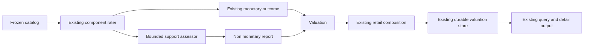
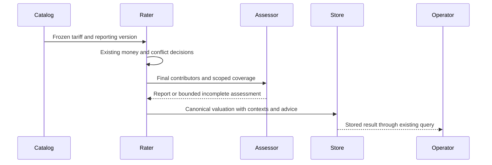

# Design Document

## Overview

Expose uncertain component intersections as durable, non-monetary advice while continuing to charge under the frozen tariff. No new permissive/strict billing selector is introduced: unknown intersection alone never changes a line, total, completeness, or settlement decision. Proven errors retain the #666 monetary safeguards.

The extension has three responsibilities: a versioned SDK result/snapshot contract, a core-owned bounded assessor using the existing support predicate, and preservation through existing composition/storage/query paths. Advisory interpretation is opt-in through newly published immutable tariff material so previously frozen snapshots and six #666 valuation fingerprints remain reproducible.

### Goals

- Surface unknown overlap on successful E, Q, and R component valuations.
- Keep money and typed conflict behavior independent of advice.
- Preserve scoped evidence, canonical output, and historical identities.
- Make reporting limits visible without introducing a settlement denial.

### Non-Goals

No strict charging mode, write-off policy, inferred duplicate charge, provider heuristic, new relationship kind, stream-time work, new endpoint/UI, journal schema migration, or general solver rewrite. P preserves provider claims rather than applying local component tariffs and receives no locally inferred support advisory.

## Boundary Commitments

### This Spec Owns

- SDK Contracts owns frozen reporting-version metadata and the optional typed report on valuations.
- Support Assessor owns eligibility, bounded candidate discovery, relation queries, and deterministic report construction; existing quantity/conflict authorities remain monetary owners.
- Catalog Integration owns lossless publication and reconstruction of new tariff fields.
- Retail Integration owns retention of assessment contexts and reports when independently rated groups are composed.
- Durable Integration owns validation, immutable persistence/replay, and existing query/detail exposure.

### Out of Boundary

Admission/credit/exposure, terminal usage ownership, provider SDK adapters, pricing arithmetic, allocation, financial postings, schema migrations, historical backfill, and HTTP/GUI invention. Advice must not acquire monetary authority or become a secondary financial journal.

### Allowed Dependencies

SDK depends on existing metering/economics value objects and stdlib only. Core billing consumes SDK contracts, its compiled schema program and resolved coverage, never Bun/SQL or providers. Existing infra billingcompose/billingstore consume domain/SDK contracts. No new service registry, worker, pool, context storage, or asynchronous lifecycle is needed.

### Revalidation Triggers

Any change to contributor selection, branch ownership, report budgets, canonical JSON, tariff content hashing, valuation context hashing, retail grouping, or durable replay requires affected SDK/core/catalog/store tests. Changed public economics fields require catalog-source and external-host compatibility checks. Storage changes must certify both dialects via the existing parity catalog.

## Architecture

### Existing Architecture Analysis

At baseline `6e97e0d9`, `ReferenceRater` compiles schemas once. Rating reduces evidence once, builds positive-charge maps, and uses `shadowScope.relation` through the structural conflict resolver. `overlapCandidates` enumerates containment-related pairs only; it cannot discover sibling uncertainty. A separate solver reporter uses quantity-derived positive nodes and a narrower branch-root interpretation. Its text is joined only to an existing error.

`Valuation.CanonicalJSON` and `Fingerprint` cover the serialized struct. `ContextHash` binds economic snapshots; billingstore uniqueness checks canonical bytes under that context. Merely adding advice to old outputs would therefore create replay conflicts. Snapshot versioning and composition provenance are prerequisites, not optional polish.

### Architecture Pattern and Boundary Map



The assessor is a synchronous private domain function, not a second rater or service. It reads the established positive-charge results after suppression, without feeding any verdict back into pricing. Provider/core boundaries, streaming-first execution, public runtime non-money options, and no post-output retry remain unchanged. No feature hook is needed for an intrinsic post-usage valuation contract.

### Technology Stack

Go and stdlib JSON, SHA-256, sorting, and existing graph structures; existing Bun storage and SQLite/PostgreSQL parity. Versions remain those pinned by `go.mod`. No dependency or worker is added.

## File Structure Plan

| Boundary | Files | Responsibility |
|---|---|---|
| SDK Contracts | new `pkg/lipsdk/economics/support_advisory.go`, `support_advisory_test.go` | Typed contexts/reports, validation, canonical ordering, finite public limits |
| SDK Contracts | modify `pkg/lipsdk/economics/component_rating.go`, `valuation.go`, `valuation_context.go`, `phase9_valuation_context_repair5_red_test.go` | Optional frozen version, content hash, result fields, clone/canonical/wire/context support |
| SDK Contracts | new `pkg/lipsdk/economics/support_advisory_compat_test.go` | Independently pinned legacy preimages and new contract tests |
| Support Assessor | new `internal/core/billing/component_rater_advisory.go`, `component_rater_advisory_test.go` | Candidate traversal, budget accounting, relation reuse, report construction |
| Support Assessor | modify `internal/core/billing/component_rater.go`, `component_rater_support.go`, `component_rater_overlap.go`, `component_rater_quantity_solver.go` | Final positive-contributor handoff, coverage-verdict handoff, v1 legacy-text bypass; budget-aware reachability reuse without changing existing unbudgeted conflict behavior |
| Support Assessor | new `internal/core/billing/billing_uncertainty_policy_test.go` | Revenue invariance, uncertain subsets, branch roots, ruled minimums, cross-scope vectors |
| Catalog Integration | modify `internal/infra/billingcompose/catalog.go`; new `support_advisory_catalog_test.go` | Preserve reporting version through default/route snapshots and `RatingCatalogView` reconstruction |
| Retail Integration | modify `internal/core/billing/retail_rating.go`; new `retail_support_advisory_test.go` | Context/report merge, group isolation, final canonical order and truncation |
| Durable Integration | new `internal/infra/billingstore/support_advisory_roundtrip_test.go`, `support_advisory_postgres_test.go` | Existing append/get/list/detail/replay and settlement integration |
| Durable Integration | modify `internal/infra/billingstore/dbparity_test.go`, `dbparity_postgres_test.go` | Register shared advisory cases in existing component contracts |
| Validation | new `internal/archtest/billing_support_advisory_test.go`; budget changes only through the explicit footprint gate below | Enforce ownership/non-money dependency boundaries, scope and line budgets |

Existing persistence/query implementation should need no SQL change because it serializes the canonical valuation; modify `v2_economics_store.go` or `economic_detail.go` only if a failing contract test demonstrates field loss. Any such edit belongs to Durable Integration, not SDK or assessor tasks. Keep new files below applicable maintainability caps; do not increase budgets by assumption.

## Components and Interfaces

| Component | Contract | Responsibilities |
|---|---|---|
| SDK Contracts | State and serialization | Optional immutable version, context identity, report, validation/canonicalization |
| Support Assessor | Private synchronous function | Discover relevant candidates within budgets, query existing relation, return advice only |
| Catalog Integration | Existing snapshot-source contract | Canonical field preservation and publication validation |
| Retail Integration | Existing valuation composition | Keep source contexts separate; deterministic merge; no pair recomputation across groups |
| Durable Integration | Existing append/query methods | Store/retrieve canonical output and reject conflicting replay |

### SDK Contracts

Add `SupportAdvisoryVersion string` with `json:"support_advisory_version,omitempty"` to both `TariffSnapshot` and `RatingCatalogView`. Allowed values: empty (exact baseline behavior) and `component-support-advisory-v1`. Reject other values in snapshot/view validation. Copy it through canonical body, content-hash preimage, Clone, view-to-tariff, and catalog default/route construction. Empty fields must disappear from preimages; old snapshot bytes/content hashes remain exact. Adopting v1 requires new published ID/version when an old key already exists; catalog same-key different-content rejection stays intact.

Add two optional valuation fields:

```go
SupportAdvisoryContexts []SupportAdvisoryContext `json:"support_advisory_contexts,omitempty"`
SupportAdvisory         *SupportAdvisoryReport   `json:"support_advisory,omitempty"`
```

A context contains `Version string`, `Tariff RatingSnapshotRef`, and `TariffContent SnapshotContentRef`; it identifies the source tariff actually used, including route-specific groups. Its key is the canonical tuple of reporting version, tariff ID/version/rater ID, and content reference/hash; retrieval timestamps are excluded just as existing context identity excludes them. Contexts carry no monetary data. The rater initializes exactly one context from `r.snapshot.Ref`, `r.snapshot.Content`, and the enabled version before calling the assessor, even if the report is absent. An enabled empty program, fixed-fee-only evaluation, or empty contributor population is a complete clean assessment with a context and no report. This distinguishes absence of pairs from historical unassessed data.

A report contains ordered `Pairs []SupportAdvisoryPair` and `IncompleteContexts []SupportAdvisoryIncomplete`. A pair carries a context key, existing reduction `ScopeKey string`, and two canonical `metering.ComponentKey` values. It carries no line ID: retail composition may rename duplicate line IDs, while support identity is component plus scope/context. `Incomplete` carries a context key and a typed reason: `candidate_budget`, `graph_budget`, `pair_limit`, or `evidence_unavailable`. It refers to the whole context, avoiding an unbounded list of scope omissions. A report is nil when it has neither pairs nor incomplete contexts. An enabled empty context list is not valid; historical results omit both fields.

Public limits for v1:

- Maximum reported pairs per final valuation: 128.
- Maximum advisory source contexts per final valuation: `MaxValuationRefs + 3` (1027): at most one independently rated inference group per selected observation reference, plus two fixed-fee groups and one proxy-service group. Context metadata cannot silently disappear.
- Candidate relation examinations per independently rated group: 4096.
- Additional graph node/edge visits per independently rated group: 65536.

These are bounded visibility limits, not billing limits. Never reject valid monetary output solely because the assessor runs out of work. Existing input/result integrity validation remains binding. The valid composed-result bound is fixed: `retailQuantityGroups` partitions selected observations rather than duplicating them; each group is nonempty, so inference groups cannot outnumber the 1024 validated observation references. The fixed-fee loop has two scopes and the proxy service has at most one group. Deduplication can only reduce the 1027-context bound. Use the pre-narrowing group population for this proof, not the final retained `InputObservations` of a group, which can become empty after selection. The 1027 limit is a constructor invariant for valid bounded inputs, pinned by tests with maximal distinct pre-narrowing groups and all three ancillary groups. Any DTO limit validation runs only at the existing final `Valuation.Validate` point after existing rating errors have been handled; do not add an earlier runtime rejection in `composeRetailValuation` or change existing error precedence.

`Canonical` deep-clones keys/content, orients pairs by canonical component key, sorts contexts/scopes/pairs/incomplete reasons, and deduplicates exact duplicates. Validation rejects unknown versions/reasons, invalid keys, self-pairs, missing context references, and bounds violations. It does not re-run graph analysis. Limit errors for incoming forged DTOs are integrity errors, not an assessor-limit result.

### Identity and Replay Contract

Include `SupportAdvisoryContexts` in `Valuation.CanonicalContextJSON` as an appended optional field. Include context metadata and report in canonical valuation JSON and thus the existing fingerprint. This deliberately gives an enabled evaluation a new economic interpretation identity, while report variation under that identity still conflicts on replay.

No field is retroactively attached to old snapshots/results. For empty snapshot version, retain the complete #666 path including text-only advisories and six pinned fingerprints. For v1, preserve the typed error tree/text and first-conflict ordering, but do not join the old solver's free-text unknown-containment advisory. The structured report is the sole v1 uncertainty output. Keep the old quantity calculation and contradiction checks unchanged; do not execute its redundant unknown reporter for v1, and retain that reporter and its text exactly for legacy material. Pin a branch-root fixture where the old reporter calls a pair unknown but the resolved relation proves separation: legacy text remains historical, while v1 returns no unknown pair for it. No canonical JSON decoder may discard these typed fields on re-append.

For an enabled clean result, context metadata is present but the uncertainty report is absent. Requirement 7.5 means serialization remains stable for the same frozen context; it does not claim that a newly published context has the old snapshot's identity. Existing stored legacy records remain byte-identical. No new identity algorithm or database uniqueness constraint is introduced; the existing context-hash seam supplies the distinction.

### Support Assessor

Proposed private seam:

```go
func (r *ReferenceRater) assessSupportUncertainty(
    valuation economics.Valuation,
    contributors map[string]map[string]struct{},
    coverage map[string]completeCoverVerdict,
) *economics.SupportAdvisoryReport
```

The assessor has no error channel into monetary rating. If already-resolved evidence is unexpectedly unavailable, discard the in-flight pair and return an incomplete context with `evidence_unavailable`; do not substitute a partial proof or imply clean coverage. The report constructor uses valid canonical contributor keys supplied by the rater; failures of external DTO validation remain ordinary integrity errors at that boundary. Missing coverage is a regression to detect in tests and operator reporting, not a reason to waive an otherwise valid charge. No database or network calls occur here. A normal limit outcome is a valid report with an incomplete-context entry; input cancellation remains governed by the calling I/O boundary and existing rater semantics.

Contributor maps come from the same rated-line outcome as `payableByScope`, narrowed by the final suppression/status decisions. Use positive effective exact charge, not quantity positivity or rounded nanos; zero quantities with positive minimum charges count, free/zero/unpriced/suppressed lines do not. Fixed and intentionally additive non-support charges never enter the component node population. The existing overlap resolver hands its per-scope `coverByScope` map to the caller through a private analysis result; use those already-resolved proofs here. Every contributor scope is a subset of the rateable scopes processed by that resolver. Missing proof is an integration defect represented by `evidence_unavailable`; do not add a third cover resolution. The `ReferenceRater` receiver supplies the compiled program, and the caller supplies the initialized valuation context. Use `shadowScope.relation` unchanged: containment first, forest separation second, resolved partition separation third, unknown otherwise. Branch-root membership comes from `inBranch`; do not reuse the strict-descendant advisory helper as a second v1 authority.

The existing containment-candidate enumerator misses unknown siblings. Add a candidate index over ancestors of retained contributors, per scope, in deterministic node-ID order. Only contributors sharing an ancestor enter possible-unknown buckets. Do not build the Cartesian pair list. Deduplicate unordered candidates, enumerate canonical contributor order, and exclude containment-related pairs only through the predicate's answer. Budget every additional reachability visit, bucket expansion, duplicate-candidate visit, and relation examination; memoization is per evaluation and preserves immutability. Budget-aware relation queries return `(componentLineRelation, assessed bool)`; exhaustion inside any reachability or separation step returns `assessed=false`, discards the in-flight pair, and marks the context `graph_budget`. A partial ancestor set must never become `shared=false` or a partial branch closure become a separation verdict. The assessor owns its own per-scope budgeted reachability cache; it does not borrow memoized closure sets from the conflict path. Previously resolved coverage booleans/member lists are immutable inputs, not charged graph traversal. All new closure construction and cache consumption that enumerates nodes/edges is charged to the advisory visit counter; budget accounting is therefore independent of which conflict queries ran first. Existing conflict evaluation remains unbudgeted and unchanged.

Dense siblings can legitimately require quadratic output. The design does not promise exhaustive subquadratic analysis: it reports the first deterministic bounded prefix plus incompleteness. Disconnected trees must not enter a global pair sweep. At any limit, stop assessment, retain valid emitted pairs, mark the context incomplete, and return the pre-existing money unchanged. A report limit after observing pair 129 yields 128 entries plus `pair_limit`; exactly 128 with no additional unknown pair may be complete.

### Catalog and Retail Integration

Publication/version validation occurs before the tariff becomes usable; no new YAML billing state, automatic account, or provider name branching. Adoption has two existing path families. Tariff-only post-usage hosts can use `SnapshotCatalog.PutTariff` or supply a v1 `RatingCatalogView` directly. Customer default/route rating also requires a pricing-card entry, so add the catalog-owned method `PutPricingWithSupportAdvisory(snapshot billing.PricingSnapshot, schemas []metering.ComponentSchema, version string) error`. Extend private `putPricingTariff` to accept the version, derive the existing tariff, attach schemas/version, clear stale Content, canonicalize and domain-validate before taking the publication lock, then atomically store the card and matching tariff at one key. Existing `PutPricing` and `PutPricingWithSchemas` pass empty version and preserve old behavior. `PricingSnapshot` and `PricingSnapshotToTariff` remain untouched. Same-key changed advisory content is rejected, not upgraded in place. Existing SetDefaults, SetRoutePricing, CustomerRatingSnapshots and model-card lookups then work unchanged; Snapshot copies the version from the stored matching tariff into its view. No PutTariff-only key is claimed bindable as a customer card. This confines publication work to catalog ownership and preserves task parallel safety. Copying the flag alone is insufficient: content hashes must bind it, and same-ref/different-content publication must fail.

Each independently rated group retains its own context metadata and report. `combineRetailValuation` merges contexts/reports without deriving cross-group pairs. `appendRetailLines` renames line IDs only; reports key components/scopes/contexts so no line-ID rewrite is needed. Source evidence narrowing must retain the context attached to selected contributors. `composeRetailValuation` retains all contexts when overwriting the top-level tariff with the base tariff. ContextHash then distinguishes changes to a route override's reporting version even if rates/line IDs stay identical.

For deterministic global limits, canonicalize source report entries and take the lowest 128 pair keys after merge; every context losing an entry is marked `pair_limit`. Preserve existing incomplete reasons. Do not retain whichever group's report happened to be appended first. Canonicalize each incoming local report before merging; at most 128 retained plus 128 incoming pair entries exist transiently, then reduce to the lowest 128. Context and incomplete-context sets remain bounded by 1027.

### Durable Integration

Use `billing_valuations.canonical_json`, existing fingerprint/context hash, append transaction, and Get/List/detail decoding. No column/table/index migration, sidecar journal, historical backfill, or second write owner. Advice is immutable payload, not settlement commands. A tampered report under the same valuation identity is `ErrIdentityConflict`; byte-identical retry remains idempotent.

Existing query/detail DTOs returning `economics.Valuation` naturally expose the optional fields. Any explanation consuming the old unknown error text remains backward-compatible, and may show structured report labels when present; this spec does not invent a UI or new transport. Absence of metadata means historical unassessed, not verified disjointness.

## System Flows



Legacy tariff version empty bypasses the new assessor. v1 version selects reporting semantics only; it cannot select stricter charging. No new asynchronous effect, teardown owner, or stream-time dependency is introduced.

## Requirements Traceability

| IDs | Components and proof |
|---|---|
| 1.1, 1.2, 1.3, 1.4, 1.5 | Support Assessor uses the existing relation and resolved branch membership; independent structural vectors |
| 2.1, 2.2, 2.3, 2.4 | Final exact-charge contributor filter, canonical identity, scope isolation and intentional-charge exclusions |
| 3.1, 3.2, 3.3, 3.4 | Assessor cannot mutate money; budget results are reports; E/R settlement equality controls |
| 4.1, 4.2, 4.3, 4.4 | Existing conflict path retained; version-empty legacy bypass; advice never read by financial arithmetic |
| 5.1, 5.2, 5.3, 5.4, 5.5 | SDK context/report, complete/incomplete visibility, existing durable query/explanation output |
| 6.1, 6.2, 6.3, 6.4, 6.5 | Canonical pair order and deterministic budgets; retail context merge; operation-count tests |
| 7.1, 7.2, 7.3, 7.4, 7.5, 7.6 | Frozen optional snapshot version and context hash; legacy goldens; immutable replay and dialect parity |

## Error Handling

Unknown intersection and assessment exhaustion produce no sentinel and do not join `error`. Proven errors retain the old chain. Unknown reporting versions or malformed external result fields are contract-integrity errors; wrap existing SDK validation sentinels using `%w`. Storage/network errors keep existing retry/transaction semantics and are not relabeled as overlap uncertainty. Adding advice does not forgive a real catalog/schema/evidence integrity failure.

## Testing Strategy

- Contract fixtures (5.1-5.4, 7.1-7.5): pin legacy canonical bytes/content hashes/context/fingerprints independently; clone/validation/sorting; reject dangling context keys, unknown versions and forged oversized input. Remove each new binding in a scratch mutation and require the relevant test to fail.
- Structural oracle (1.1-1.5, 2.3): independently constructed reachability/branch fixtures, not calls to the production relation for expected values. Shared subset siblings yield unknown; branch roots and their descendants are separated only by resolved coverage; unresolved/ambiguous partitions do not prove separation; different trees emit no pair.
- Monetary invariance (2.1-4.4): reference 100/20/30 vector settles 50 under legacy and v1; advisory only on v1. Positive exact amount rounding to zero and zero-quantity minimum charge qualify; free, zero, suppressed and unpriced members do not. Existing proven-overlap/ambiguity/contradiction classes and diagnostic bytes stay pinned.
- Scope/composition (6.1-6.3, 7.1): E/Q/R, two B-legs, different directions/units/scopes, route-specific tariffs, duplicate component line renames, observation permutations, mixed legacy/v1 groups and changed override marker with identical money. Correct contexts survive final base-tariff overwrite.
- Boundaries (3.4, 6.4, 6.5): pair 128/129, 4096 candidate limit, 65536 graph visits; no false clean status on partial closure; exhaustive low-budget oracle prefix; deterministic truncation through different group-merge orders; operation counters show no disconnected global cross product and bounded dense-sibling work.
- Durability/settlement (3.2, 5.5, 7.2-7.6): SQLite and direct PostgreSQL append/get/list/detail, identical retry, changed report conflict, transaction rollback, complete customer settlement with unknown advice and same debit amount, incomplete-report settlement allowed, known-conflict no-complete-settlement controls, no old-row rewrite.

## Verification and Rollout

Inner loop uses `make dev-test PKGS='...'` for affected SDK/core/catalog/store packages. Coherent implementation must pass `make quality-checks`, `make test-unit`, explicit `go test ./internal/archtest ./internal/qa`, `make test-db-parity-sqlite`, and `make test-db-parity-postgres-direct`. Because new store/parity cases and dense-graph tests change cost, run the Windows-authoritative `make test-cost` once on the coherent final implementation; do not increase that budget without maintainer authorization. Run targeted fuzzing on new bounded JSON/report validation where practical. The exhaustive #666 model and determinism suites are affected regression consumers; preserve all six legacy fingerprints and agreement corpus expectations.

Rollout requires advisory-capable readers before publishing v1 tariffs. Old binary readers ignore additive JSON fields, so they cannot be relied on for lossless replay/re-append of v1 results; do not downgrade workers that own v1 material. Existing host/catalog publication is the only adoption mechanism. Historical records are never backfilled. Publication of new content under an existing ref remains rejected. No generic lifecycle mechanism is warranted: frozen snapshots are immutable values and billingstore remains the only durable owner.

### Production Footprint Prerequisite

Baseline architecture checks passed directly on `6e97e0d9`: `TestPhase20RefreshedBudgetHeadroomExact` and `TestBillingEconomicsGrowthAllowanceLive`. The audited core baseline is 143695 lines with the pinned 143720 ceiling; measured live core is 143700, leaving 20 lines. The measured growth overlay is 57665 against 57726, leaving 61 lines. The 165-row manifest is a closed allowlist: a new core billing production file requires an approved row even if the total otherwise fits; per-file ceilings also apply. This spec does not claim a several-hundred-line assessor fits 25 lines of headroom. Before core implementation, task 1 measures the affected files and produces the proposed allowance diff using the actual repository harness. If a new allowance is needed, obtain the repository's explicit maintainer approval with measured scope/provenance; otherwise demonstrate a genuine same-scope simplification that fits the existing limits. Do not delete unrelated comments or move code merely to evade the cap. No affected catalog, assessor, or retail production task (3.1, 3.2, 3.3, 4.1, 4.2) may proceed past this gate without one of those two outcomes. Validation footprint ownership includes only the explicitly authorized allowance surface: `internal/archtest/billing_convergence_growth.go`, `billing_convergence_growth_test.go`, `billing_convergence_growth_history.go`, `budgets.go`, and `phase20_budget_exactness_test.go`. Any approved new-file row/count/credit/cap and exact audit updates must be internally consistent and keep excess tests intact. Keep the existing excess-negative tests and audited-plus-25 arithmetic intact. The footprint decision is an explicit implementation prerequisite, not a hidden promise of free capacity.
