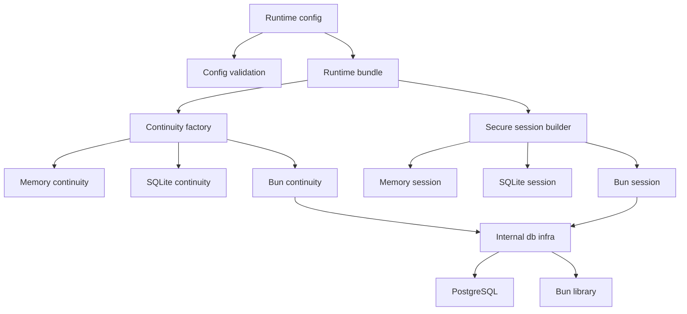
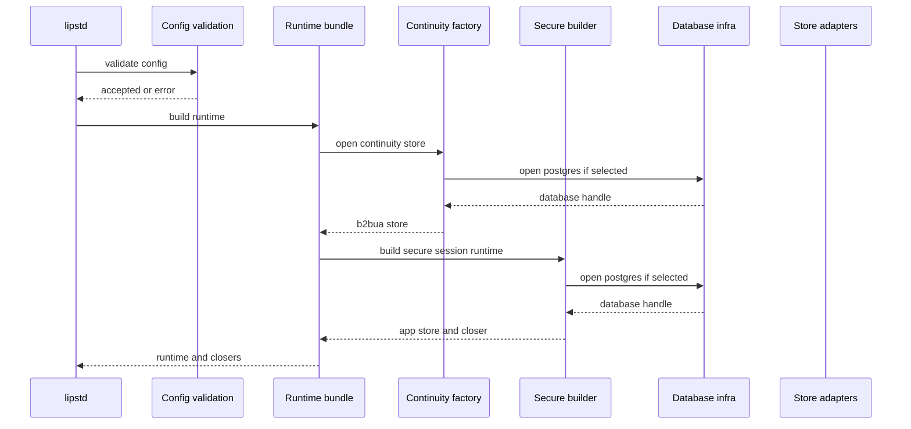
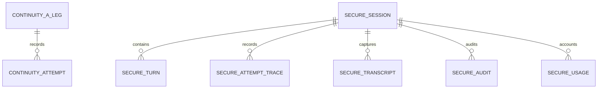

# Design Document

## Overview

This feature adds managed-durable database support to the Go LLM Interactive Proxy persistence layer while preserving current memory and SQLite behavior. Operators gain independent persistence choices for B2BUA continuity and secure sessions; maintainers keep the existing consumer-owned store contracts and explicit runtime wiring.

The design uses a hybrid extension approach: current SQLite runtime paths remain valid, and new Bun-backed adapters provide the managed-durable path. Bun and database driver details stay inside infrastructure and store adapter packages; no public canonical, SDK, frontend, backend, or plugin contract exposes the database abstraction.

### Goals
- Support independently configured memory, local durable, and managed durable stores for continuity and secure sessions.
- Preserve observable behavior for current memory and SQLite deployments.
- Add Bun-backed persistence behind existing store ports with explicit startup validation, secret-safe errors, and deterministic shutdown.
- Provide parity tests for durable behavior and optional PostgreSQL integration validation.

### Non-Goals
- No automatic migration between SQLite and PostgreSQL or between local and managed databases.
- No changes to client-facing LLM protocols, canonical request/event contracts, routing semantics, or plugin SDK contracts.
- No distributed coordination guarantee beyond the selected database backend's store behavior.
- No replacement of existing SQLite adapters as the default `store: sqlite` path in this design.

## Boundary Commitments

### This Spec Owns
- Config semantics for selecting `memory`, `sqlite`, or `postgres` persistence independently for continuity and secure sessions.
- Shared internal database helpers for opening PostgreSQL, wrapping `*sql.DB` with Bun, applying pool settings, and redacting connection details from errors; these helpers are platform infrastructure, not business-facing ports.
- Bun-backed store adapters for continuity and secure sessions that implement existing ports.
- Runtime wiring, closers, validation, sample config, and tests for the new managed-durable path.

### Out of Boundary
- Public contract changes in `pkg/lipapi`, `pkg/lipsdk`, frontend plugins, backend plugins, or feature plugin contracts.
- Automatic data migration, data export/import commands, or schema migration tooling beyond idempotent adapter-owned table preparation.
- Changes to core routing/failover behavior, no-retry-after-output behavior, canonical streaming, or protocol translation.
- Provider SDK integration or provider-specific semantics.

### Allowed Dependencies
- Existing store ports: `internal/core/b2bua.Store`, `internal/core/securesession/app.Store`, and `app.SessionUsageRollup`.
- Existing runtime composition roots: `internal/core/continuity.OpenStore`, `internal/infra/runtimebundle.Build`, and `buildSecureSessionRuntime`.
- New internal database infrastructure in `internal/infra/db`; only composition/runtime wiring and concrete store adapters may import it.
- `github.com/uptrace/bun` with SQLite and PostgreSQL dialect packages, plus Bun PostgreSQL driver support pinned in `go.mod` during implementation.
- Current `modernc.org/sqlite` driver for existing SQLite adapters.

### Hexagonal Dependency Rules
- `internal/infra/db` must not define business-facing ports, domain concepts, or use-case orchestration.
- Bun-backed store packages are concrete driven adapters. Core orchestration depends only on `b2bua.Store`, `app.Store`, and `SessionUsageRollup`; concrete adapters are selected only at factory and composition seams.
- No `*sql.DB`, `*sql.Tx`, `*bun.DB`, Bun query builder, SQL driver, or database driver error type may cross existing store ports.
- Transaction mechanics are adapter-owned for single store operations in this feature; transaction intent visible to core remains the existing store method call boundary.

### Revalidation Triggers
- Any change to `b2bua.Store`, `app.Store`, `SessionUsageRollup`, or `pkg/lipsdk/continuity` contracts.
- Any change that routes `store: sqlite` through Bun instead of the existing SQLite adapters.
- Any change to canonical request/event contracts, client-facing protocols, or routing semantics.
- Any change to database config field names, durable audit gating, startup failure behavior, or secret redaction rules.

## Architecture

### Existing Architecture Analysis

The existing runtime already uses clean store seams. Continuity is opened first through `continuity.OpenStore`, then secure sessions are built using `buildSecureSessionRuntime` and a lineage adapter over the same `b2bua.Store`. Both domains already have memory and SQLite adapters, and the runtime collects closers for stores that own database resources.

The main current limitations are enum/config support, lack of PostgreSQL open/wrap infrastructure, lack of Bun-backed adapters, and no optional PostgreSQL validation harness.

### Architecture Pattern & Boundary Map

Selected pattern: ports-and-adapters extension with shared internal infrastructure. The store ports remain consumer-owned; Bun-backed adapters and database helpers are implementation details.



Key decisions:
- `sqlite` remains on existing raw-SQL SQLite adapters for backward compatibility.
- `postgres` uses Bun-backed adapters.
- In-memory behavior is unchanged.
- Shared connection reuse is deferred; each configured PostgreSQL store owns its own database handle unless a later design adds safe ownership semantics.

### Technology Stack

| Layer | Choice / Version | Role in Feature | Notes |
| --- | --- | --- | --- |
| Runtime | Go 1.26.x | Existing runtime and tests | Version pinned in `go.mod`. |
| Data abstraction | `github.com/uptrace/bun` pinned in `go.mod` | Query builder/model scanning for new Bun adapters | Internal-only dependency. |
| PostgreSQL driver | Bun `pgdriver` pinned in `go.mod` | Open managed durable PostgreSQL connections | Used through `database/sql` connector. |
| SQLite | Existing `modernc.org/sqlite` | Current local durable path | Existing adapters stay active. |
| Config | `gopkg.in/yaml.v3` | Parse store and database tuning config | Existing config loading path. |

## File Structure Plan

### Directory Structure

```text
internal/
├── infra/
│   └── db/
│       ├── doc.go              # Package boundary and allowed dependency policy
│       ├── open.go             # OpenPostgres and SQLite helper reuse where needed
│       ├── bun.go              # NewBunDB dialect wrapper
│       ├── pool.go             # Apply database pool settings
│       ├── redact.go           # Secret-safe database error redaction helpers
│       └── *_test.go           # Unit tests for dialects, pool validation, redaction
├── core/
│   ├── config/
│   │   ├── model.go            # Add DatabaseConfig and postgres_dsn fields
│   │   ├── validate.go         # Validate postgres stores, pool settings, durable audit
│   │   └── *_test.go           # Config validation coverage
│   ├── continuity/
│   │   ├── store.go            # Add postgres store branch
│   │   └── bunstore/
│   │       ├── store.go        # Bun-backed b2bua.Store implementation
│   │       ├── 20250426000000_continuity_baseline.go # Bun migrate baseline DDL (caller filename → migration id)
│   │       └── store_test.go   # Contract and parity tests
│   └── securesession/
│       ├── adapters/
│       │   └── bunstore/
│       │       ├── store.go    # Bun-backed app.Store implementation
│       │       ├── 20250426000000_securesession_baseline.go # Bun migrate baseline DDL (caller filename → migration id)
│       │       ├── models.go   # Bun row models and scan/convert helpers
│       │       └── store_test.go
│       └── storecontract/
│           └── bun_contract_test.go # Contract entry for Bun-backed store
└── archtest/
    └── database_abstraction_imports_test.go # Optional import guardrail
```

### Modified Files
- `internal/infra/runtimebundle/secure_session.go` — add `postgres` secure-session branch and durable audit handling.
- `internal/infra/runtimebundle/build.go` — preserve closer collection; no shared-pool ownership in v1.
- `internal/core/continuity/store.go` — add `postgres` branch and secret-safe error wrapping.
- `internal/core/config/model.go` — add `DatabaseConfig`, `PostgresDSN` fields for continuity and secure sessions.
- `internal/core/config/validate.go` — validate `postgres`, DSNs, pool settings, and durable audit over any durable store.
- `config/config.yaml` — add commented PostgreSQL and pool tuning examples.
- `go.mod`, `go.sum` — add Bun and PostgreSQL driver dependencies.

## System Flows

### Startup Store Selection



Startup fails at the selected store boundary when database preparation fails. No fallback to memory or SQLite is allowed for explicit durable selections.

## Requirements Traceability

| Requirement | Summary | Components | Interfaces | Flows |
| --- | --- | --- | --- | --- |
| 1.1 | Continuity supports memory/local/managed selections | Config validation, continuity factory | `ContinuityConfig` | Startup Store Selection |
| 1.2 | Secure sessions support memory/local/managed selections | Config validation, secure builder | `SecureSessionConfig` | Startup Store Selection |
| 1.3 | Independent store selection | Runtime bundle, separate store builders | Config structs | Startup Store Selection |
| 1.4 | Defaults preserved | Config validation, existing builders | Existing config defaults | Startup Store Selection |
| 1.5 | Local durable compatibility | Existing SQLite adapters | Existing store ports | Startup Store Selection |
| 1.6 | Managed durable requires connection settings | Config validation | `PostgresDSN` | Startup Store Selection |
| 1.7 | Unsupported values rejected | Config validation | Validation errors | Startup Store Selection |
| 1.8 | Missing durable settings rejected | Config validation | Validation errors | Startup Store Selection |
| 2.1 | Continuity A-leg restart durability | Bun continuity store | `b2bua.Store` | Store operation tests |
| 2.2 | B-leg and attempts restart durability | Bun continuity store | `b2bua.Store` | Store operation tests |
| 2.3 | Monotonic B-leg sequence | Bun continuity store | `b2bua.Store` | Transaction path |
| 2.4 | Attempt lineage parity | Bun continuity store | `b2bua.Store` | Transaction path |
| 2.5 | Attempt load ordering | Bun continuity store | `b2bua.Store` | Store operation tests |
| 2.6 | Continuity startup failure | DB infra, continuity factory | Redacted errors | Startup Store Selection |
| 3.1 | Secure-session restart durability | Bun secure-session store | `app.Store` | Contract tests |
| 3.2 | Secure-session evidence parity | Bun secure-session store | `app.Store`, `SessionUsageRollup` | Contract tests |
| 3.3 | Monotonic activity/evidence | Bun secure-session store | `app.Store` | Transaction path |
| 3.4 | Diagnostics summary parity | Bun secure-session store | `app.Store` | Contract tests |
| 3.5 | Durable audit accepts any durable store | Config validation, secure builder | Manager config | Startup Store Selection |
| 3.6 | Durable audit rejects non-durable store | Config validation | Validation errors | Startup Store Selection |
| 4.1 | Required DB fields validated | Config validation | `DatabaseConfig` | Startup Store Selection |
| 4.2 | Malformed/unsafe settings rejected | Config validation | Validation errors | Startup Store Selection |
| 4.3 | Secret-safe failure errors | DB infra redaction | Error helpers | Startup Store Selection |
| 4.4 | No silent fallback | Continuity factory, secure builder | Store constructors | Startup Store Selection |
| 4.5 | Pool tuning validation | Config validation, DB infra | `DatabaseConfig` | Startup Store Selection |
| 4.6 | Sample config documented | Config sample | YAML config | N/A |
| 5.1 | In-memory continuity preserved | Existing memory store | `b2bua.Store` | Existing tests |
| 5.2 | Local durable continuity preserved | Existing SQLite store | `b2bua.Store` | Existing tests |
| 5.3 | Existing secure sessions preserved | Existing memory/SQLite stores | `app.Store` | Existing tests |
| 5.4 | Store contracts preserved | All adapters | Existing interfaces | Contract tests |
| 5.5 | No local data migration required | Runtime wiring | Existing SQLite path | Startup Store Selection |
| 5.6 | No automatic cross-product migration | Design boundary | N/A | N/A |
| 6.1 | Durable continuity validation | Store tests | `b2bua.Store` | Test suite |
| 6.2 | Durable secure-session validation | Store contracts | `app.Store` | Test suite |
| 6.3 | Optional external DB skip | PostgreSQL tests | Test env var | Test suite |
| 6.4 | Default memory/local validation | Existing and new tests | Existing interfaces | Test suite |
| 6.5 | No client protocol changes | Boundary guard | N/A | N/A |
| 6.6 | No canonical contract changes | Boundary guard | N/A | N/A |
| 6.7 | DB abstraction not public | Arch guard | Import rules | N/A |

## Components and Interfaces

| Component | Domain/Layer | Intent | Req Coverage | Key Dependencies | Contracts |
| --- | --- | --- | --- | --- | --- |
| Database Infrastructure | Infra | Open, wrap, tune, close, and redact database handles | 1.6, 2.6, 4.1-4.5 | `database/sql` P0, Bun P0 | Service |
| Config Validation | Core config | Validate store enums, DSNs, pool settings, durable audit rules | 1.1-1.8, 3.5-3.6, 4.1-4.5 | Config model P0 | Service |
| Continuity Bun Store | Core adapter | Implement `b2bua.Store` over Bun for managed durable continuity | 2.1-2.6, 5.4, 6.1 | DB infra P0, Bun P0 | Service, State |
| Secure Session Bun Store | Core adapter | Implement `app.Store` and `SessionUsageRollup` over Bun | 3.1-3.6, 5.4, 6.2 | DB infra P0, Bun P0 | Service, State |
| Runtime Wiring | Composition root | Select stores, enforce no fallback, register closers | 1.1-1.8, 2.6, 3.5, 4.4, 5.1-5.5 | Config P0, stores P0 | Service |
| Validation Tests | Test support | Prove parity and optional PostgreSQL behavior | 6.1-6.4 | Store contracts P0 | Batch |
| Boundary Guard | Architecture tests | Prevent DB abstraction leakage | 6.5-6.7 | Import graph P1 | Batch |

### Infrastructure Layer

#### Database Infrastructure

| Field | Detail |
| --- | --- |
| Intent | Centralize internal database opening, Bun dialect wrapping, pool tuning, and secret-safe redaction. |
| Requirements | 1.6, 2.6, 4.1, 4.2, 4.3, 4.4, 4.5 |

**Responsibilities & Constraints**
- Owns `OpenPostgres`, `NewBunDB`, `ApplyPoolSettings`, and `RedactDSN`-style helpers.
- Does not expose Bun or SQL handles to public packages.
- Does not define store ports, domain interfaces, or application use-case contracts.
- May be imported only by runtime composition code and concrete store adapters.
- Applies pool settings only when configured; zero values preserve driver defaults.
- Pings/prepares selected managed database before returning a usable store handle.

**Service Interface**
```go
type Dialect string

const (
    DialectSQLite   Dialect = "sqlite"
    DialectPostgres Dialect = "postgres"
)

type PoolSettings struct {
    MaxOpenConns    int
    MaxIdleConns    int
    ConnMaxLifetime time.Duration
    ConnMaxIdleTime time.Duration
}

func OpenPostgres(dsn string) (*sql.DB, error)
func NewBunDB(sqldb *sql.DB, dialect Dialect) (*bun.DB, error)
func ApplyPoolSettings(sqldb *sql.DB, settings PoolSettings)
func RedactDSN(dsn string) string
```

Preconditions: DSN is non-empty for PostgreSQL; dialect is known; `*sql.DB` is non-nil. Postconditions: callers receive an owned handle or an error safe to wrap without leaking secrets.

### Core Config Layer

#### Config Validation

| Field | Detail |
| --- | --- |
| Intent | Keep operator-facing store selection and tuning validation explicit before runtime build. |
| Requirements | 1.1-1.8, 3.5, 3.6, 4.1, 4.2, 4.5 |

**Responsibilities & Constraints**
- Extends store values to `memory`, `sqlite`, `postgres`.
- Adds `Database DatabaseConfig` to the top-level runtime config and validates it from `Validate` before runtime build.
- Adds `PostgresDSN` to continuity and secure-session config.
- Adds top-level shared `DatabaseConfig` for pool tuning; this applies to PostgreSQL handles created by this feature.
- Treats durable audit as allowed for `sqlite` or `postgres`, rejected for `memory`.

**Config Contract**
```go
type Config struct {
    Database      DatabaseConfig      `yaml:"database"`
    Continuity    ContinuityConfig    `yaml:"continuity"`
    SecureSession SecureSessionConfig `yaml:"secure_session"`
}

type DatabaseConfig struct {
    MaxOpenConns    int    `yaml:"max_open_conns"`
    MaxIdleConns    int    `yaml:"max_idle_conns"`
    ConnMaxLifetime string `yaml:"conn_max_lifetime"`
    ConnMaxIdleTime string `yaml:"conn_max_idle_time"`
}

type ContinuityConfig struct {
    Store       string `yaml:"store"`
    SQLitePath  string `yaml:"sqlite_path"`
    PostgresDSN string `yaml:"postgres_dsn"`
}

type SecureSessionConfig struct {
    Store       string `yaml:"store"`
    SQLitePath  string `yaml:"sqlite_path"`
    PostgresDSN string `yaml:"postgres_dsn"`
}
```

The shown structs are partial; existing fields remain intact.

### Store Adapter Layer

#### Continuity Bun Store

| Field | Detail |
| --- | --- |
| Intent | Provide managed durable continuity while preserving `b2bua.Store` semantics. |
| Requirements | 2.1, 2.2, 2.3, 2.4, 2.5, 2.6, 5.4, 6.1 |

**Responsibilities & Constraints**
- Implements all `b2bua.Store` methods without changing method signatures.
- Acts as a driven adapter selected only by the continuity factory or runtime composition path.
- Keeps `*sql.DB`, `*bun.DB`, Bun query builders, SQL driver errors, and transaction handles inside the adapter boundary.
- Uses transactions for A-leg resolution/create and B-leg sequence allocation.
- Uses explicit ordering for loaded attempts.
- Owns dialect-aware table preparation for the continuity schema.
- Implements `Close() error` by closing the Bun handle it owns.

**State Management**
- A-leg rows remain keyed by A-leg ID with a unique non-empty continuity key.
- B-leg sequence increments are protected by a database transaction.
- Attempt records are upserted by A-leg/B-leg/sequence identity where applicable.

#### Secure Session Bun Store

| Field | Detail |
| --- | --- |
| Intent | Provide managed durable secure-session storage with contract parity. |
| Requirements | 3.1, 3.2, 3.3, 3.4, 3.5, 3.6, 5.4, 6.2 |

**Responsibilities & Constraints**
- Implements `app.Store` and `app.SessionUsageRollup` without changing public contracts.
- Acts as a driven adapter selected only by secure-session runtime composition.
- Keeps `*sql.DB`, `*bun.DB`, Bun query builders, SQL driver errors, and transaction handles inside the adapter boundary.
- Preserves transaction boundaries for attempt trace/outcome, transcript, audit, and usage writes.
- Preserves monotonic last-activity behavior.
- Owns dialect-aware table preparation for secure-session tables.
- Does not change diagnostics or manager APIs.

**State Management**
- Session ID remains the aggregate root.
- Attempt traces and usage evidence remain append/update records associated with session, turn, and B-leg identifiers.
- Summary queries remain read-only projections over stored session evidence.

### Composition Layer

#### Runtime Wiring

| Field | Detail |
| --- | --- |
| Intent | Connect validated config to the correct store implementations and lifecycle ownership. |
| Requirements | 1.1-1.8, 2.6, 3.5, 4.4, 5.1-5.5 |

**Responsibilities & Constraints**
- Adds `postgres` branches for continuity and secure-session stores.
- Preserves existing memory and SQLite branches.
- Fails startup when selected durable stores cannot open or prepare.
- Appends store closers exactly once per owned handle.
- Does not share PostgreSQL handles between domains in this design.

## Data Models

### Domain Model

The feature does not introduce new domain entities. It reuses existing persistence concepts:
- Continuity: A-leg, B-leg, continuity key, weighted-first-consumed marker, attempt record.
- Secure session: session, resume fingerprint, turn, attempt trace, transcript item, audit item, usage item, summary projection.

### Logical Data Model



### Physical Data Model

Physical table names and columns follow existing SQLite store schemas where possible. Dialect-specific DDL is adapter-owned and explicit SQL. PostgreSQL equivalents must preserve:
- primary keys and unique constraints,
- partial uniqueness for non-empty continuity/session keys,
- indexes used by summary, lookup, and attempt evidence queries,
- foreign-key cascade behavior for secure-session child rows,
- integer timestamp storage compatible with existing `time.Unix(0, value)` use.

## Error Handling

### Error Strategy

- Config validation errors are returned before runtime build and name the invalid field.
- Startup database errors include the affected store domain and selected backend, but not raw DSNs or credentials.
- Store operation errors wrap lower-level errors with operation context and preserve existing domain not-found behavior.
- Explicit durable store selections never fall back to memory or SQLite after a failure.

### Error Categories and Responses

| Category | Source | Response |
| --- | --- | --- |
| Config error | unsupported store, missing DSN, invalid pool tuning | `config.Validate` returns field-specific error. |
| Startup error | connection/ping/migration failure | Runtime build returns redacted store-specific error. |
| Not found | missing A-leg/session rows | Existing domain not-found behavior is preserved. |
| Operation error | query/transaction failure | Store wraps error with operation context. |

## Testing Strategy

### Unit Tests
- `internal/infra/db`: dialect selection rejects nil/unknown inputs; PostgreSQL opener redacts DSNs in wrapped errors; pool settings apply only valid values.
- `internal/core/config`: `postgres` store validation, missing DSN errors, durable audit with `postgres`, durable audit rejection with `memory`, pool duration/count validation.
- Bun store constructors reject nil database handles and prepare schemas for SQLite-backed test handles where applicable.

### Integration Tests
- Continuity Bun store: create/fetch/resolve A-leg, monotonic B-leg sequence, attempt upsert/load ordering, weighted-first-consumed update, restart survival for durable handles.
- Secure-session Bun store: run `storecontract.RunAll`; verify usage rollup and diagnostics summary parity.
- Runtime bundle: `postgres` selection attempts to open the configured store; explicit failure does not fallback; closers run for owned stores.

### Optional PostgreSQL Tests
- Tests requiring PostgreSQL are gated by `LIP_TEST_POSTGRES_DSN`.
- When the env var is unset, tests call `t.Skip` with an explicit message.
- When set, the test suite verifies Req 2.1-2.6 and Req 3.1-3.6 against PostgreSQL.

### Boundary Tests
- Import guard verifies Bun and PostgreSQL driver imports do not appear in `pkg/lipapi`, `pkg/lipsdk`, protocol plugin packages, or unrelated core packages outside allowed adapter/infra paths.
- Existing tests for memory and SQLite stores continue to run in default validation.

## Security Considerations

- DSNs and credentials are operator secrets; errors and logs must not include full DSNs.
- Config validation should reject NUL-containing or structurally unsafe connection settings where detectable before opening.
- No new diagnostics endpoint exposes database connection details.
- Existing diagnostics authentication requirements remain unchanged.

## Performance & Scalability

- SQLite keeps existing connection behavior, including single-open-connection tuning in current adapters.
- PostgreSQL pool tuning is optional and bounded by validation; zero values preserve driver defaults.
- Sequence allocation and secure-session append paths rely on database transactions rather than in-process locks, supporting multi-process deployments to the extent the selected database provides consistency.
- Performance validation is functional/parity oriented in this spec; load tuning is deferred unless benchmarks reveal regressions.

## Migration Strategy

- Existing memory and SQLite deployments require no data migration.
- Switching from SQLite to PostgreSQL is a manual operator migration outside this feature.
- Table preparation is idempotent for newly selected PostgreSQL stores, but it is not a cross-product migration tool.

## Supporting References

- `.kiro/specs/bun-database-abstraction/research.md` — gap analysis, options, and discovery findings.
- `.dev/database_abstraction_implementation_plan.md` — prior implementation plan used as background, not as an approved contract.
- Bun documentation via Context7 — confirms `bun.NewDB`, `pgdialect`, `sqlitedialect`, `pgdriver`, `RunInTx`, and `On("CONFLICT ...")` support.
