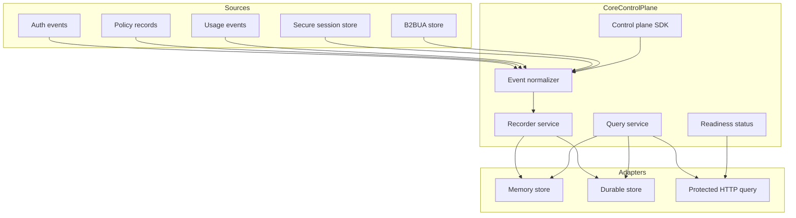
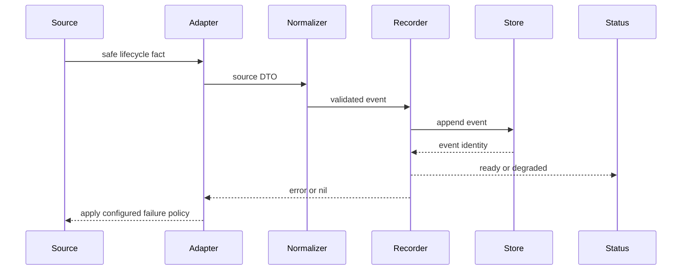
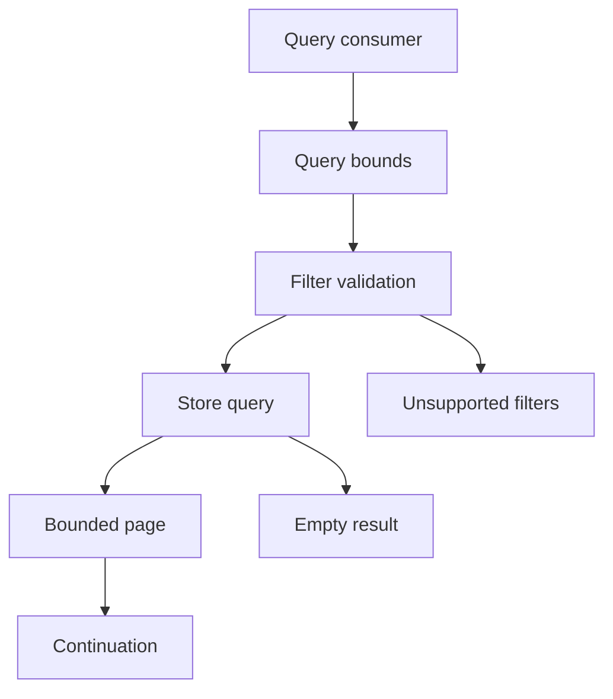
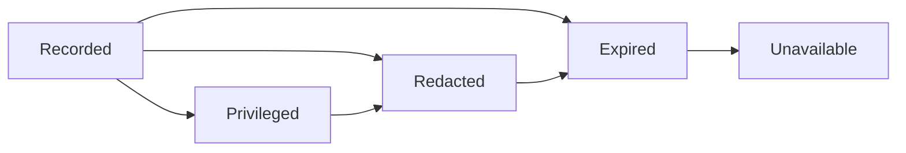
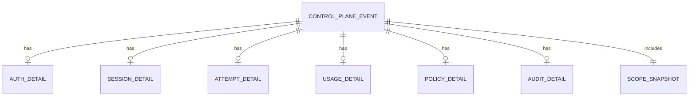
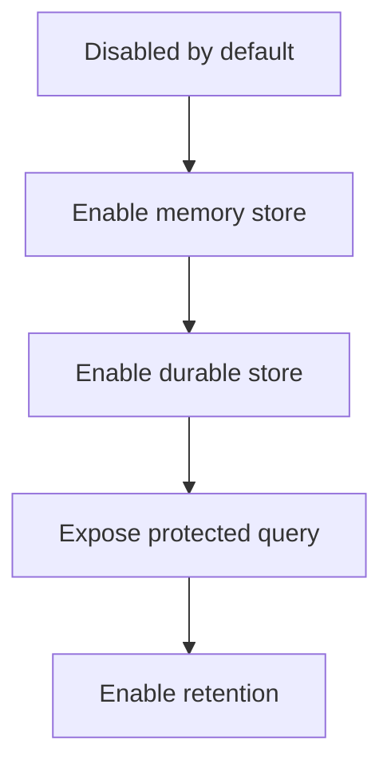

# Design Document

## Overview

This feature adds a control-plane evidence foundation for the Go LIP runtime. It records safe, scope-attributed lifecycle evidence from auth, secure-session, attempt, usage, policy, and audit paths; exposes bounded query-ready views; and reports readiness/degraded states without changing canonical streaming behavior.

The design is a brownfield extension. Existing secure-session diagnostics, B2BUA continuity, token accounting, auth events, usage/traffic observers, and policy decision observers remain intact. A new control-plane contract and core service consume those facts through decorators and observer adapters, normalize them into one evidence model, and serve query DTOs for operators and later admin/reporting/budget features.

### Goals

- Provide one stable control-plane evidence/query contract with event identity, availability state, redaction state, correlation fields, and safe scope attribution.
- Capture lifecycle evidence through existing runtime seams without making current observers, diagnostics, or stores understand the new query capability.
- Support bounded cross-session queries, stable continuation, unsupported-filter reporting, readiness status, retention/redaction state, and startup fail-closed behavior where configured.
- Preserve streaming-first execution, secure-session authority, no provider SDK leakage, and no retry/failover after first client-visible output.

### Non-Goals

- Billing charges, allowance enforcement, spend caps, rate limiting, or policy decision engines.
- OAuth, SAML, SCIM, user-directory management, identity provisioning, PII or prompt-injection detection.
- Admin GUI, charts, settings UI, cloud marketplace integration, or provider telemetry forwarding.
- Automatic historical migration between existing backing stores.
- Raw prompt, response, token, header, or credential storage in the default control-plane ledger.

## Boundary Commitments

### This Spec Owns

- The stable control-plane evidence and query contracts under `pkg/lipsdk/controlplane`.
- Core normalization, validation, redaction-state handling, cursor validation, query bounds, readiness status, and failure classification under `internal/core/controlplane`.
- Control-plane event persistence adapters for memory and existing Bun-supported durable stores.
- Runtimebundle wiring that fans existing auth, policy, usage, secure-session, and B2BUA evidence into the recorder.
- A protected operator query/readiness HTTP adapter when configured; no GUI or charts.
- Contract, adapter, runtime wiring, diagnostics, security, and non-interference tests for this feature.

### Out of Boundary

- Existing secure-session diagnostics remain owned by `internal/core/securesession` and `internal/stdhttp`.
- Existing token-counting behavior and ledger semantics remain owned by `internal/core/tokenaccounting` and `internal/infra/tokenaccounting`.
- Existing routing, failover, B2BUA allocation, capability negotiation, and stream recovery behavior remain owned by runtime/routing/continuity packages.
- Existing auth decisions and policy decision outcomes are not changed; this feature only observes and records safe evidence.
- Retention/redaction processing does not mutate routing, policy, usage, or session outcomes for in-flight requests.
- Raw capture storage and privileged transcript content remain outside the default control-plane event records.

### Allowed Dependencies

- `pkg/lipsdk/scope`, `pkg/lipsdk/auth`, `pkg/lipsdk/policydecision`, `pkg/lipsdk/usage`, and `pkg/lipsdk/traffic` for safe existing evidence DTOs.
- `internal/core/securesession/app`, `internal/core/b2bua`, `internal/core/tokenaccounting/ledger`, `internal/core/config`, `internal/core/runtime`, and `internal/core/extensions` as integration sources.
- `internal/infra/db`, Bun v1.2.18, `database/sql`, `modernc.org/sqlite`, and existing PostgreSQL Bun wiring for storage adapters.
- `internal/infra/runtimebundle` and `internal/stdhttp` as composition and protected HTTP mounting points.
- No provider SDK, frontend protocol wire type, HTTP request/response type, SQL row/transaction type, or ORM type may cross into `pkg/lipsdk/controlplane` or `internal/core/controlplane` contracts.

### Revalidation Triggers

- Any shape change to `pkg/lipsdk/controlplane` event/query/status contracts.
- Any change to scope presence semantics, redaction states, evidence availability states, or cursor semantics.
- Any change to auth event delivery, policy observer delivery, usage observer error behavior, secure-session recording, or B2BUA attempt recording.
- Any change to mandatory recording fail-closed points or startup readiness policy.
- Any change that records raw payloads, raw headers, bearer/resume/API/OAuth tokens, or provider wire data.
- Any change to streaming order, output-commit detection, or retry/failover after first client-visible output.

## Architecture

### Existing Architecture Analysis

The repo already has strong source seams but no unified query substrate:

- Auth emits safe `AuthDecisionEvent` and `SessionStartEvent` through `coreauth.EventSink`.
- Policy decisions emit normalized `policydecision.Record` through fail-open observers.
- Secure-session stores persist rich session, attempt, transcript, usage, audit, summary, and readiness facts.
- B2BUA stores allocate A-leg/B-leg identifiers and persist attempt lineage.
- Token accounting records request/attempt/backend/model usage rows and has required-write behavior.
- Runtimebundle is the composition root for auth sinks, policy observers, usage/traffic observers, secure-session stores, token accounting, diagnostics, and startup posture.

The design adds a narrow control-plane capability rather than expanding secure-session or token-accounting into a general event database.

### Architecture Pattern & Boundary Map

Selected pattern: hexagonal, event-ledger projection. Core owns control-plane contracts, normalization, query semantics, and runtime policy. Adapters own storage and HTTP details. Existing subsystems remain source authorities for their current diagnostics and runtime behavior.


**Architecture Integration**

- Core-owned or plugin-owned? Core-owned control-plane semantics with plugin/future-feature access through `pkg/lipsdk/controlplane`.
- New canonical concept, or provider-specific behavior? New SDK-level control-plane evidence concept, not a `pkg/lipapi` canonical request/event concept and not provider-specific.
- Streaming-first path preserved? Yes. Recording is side-effect evidence around existing stream boundaries; non-streaming remains collection over canonical stream events.
- Provider SDK leakage avoided? Yes. Provider SDK and wire types stay in backend adapters; control-plane records use strings, enums, numeric counters, and safe DTOs.
- No retry/failover after first client-visible output preserved? Yes. Post-output recording errors degrade control-plane status only and cannot request replacement attempts.
- Secure-session, diagnostics, or startup-security posture affected? Yes. Secure-session recording decorators, protected diagnostics mounting, and startup fail-closed rules require focused revalidation.
- Extension platform seam used or extended? Existing auth event sink, policy observer, usage observer, secure-session store, and B2BUA store seams are adapted. No new hook stage is required.

### Technology Stack

| Layer | Choice / Version | Role in Feature | Notes |
|-------|------------------|-----------------|-------|
| Public SDK | Go 1.26.4, `pkg/lipsdk/controlplane` | Stable event/query/status contracts | Additive public package |
| Core services | Go stdlib | Validation, normalization, recording policy, query orchestration | No new third-party dependency |
| Data / Storage | Bun v1.2.18, `database/sql`, `modernc.org/sqlite` v1.53.0, existing Postgres Bun helpers | Memory, SQLite, and Postgres adapters | Follows existing durable store pattern |
| Runtime wiring | `internal/infra/runtimebundle` | Explicit construction, fan-out, readiness, closers | No DI container or globals |
| HTTP diagnostics | stdlib `net/http`, existing diagnostics shared-secret wrapper | Optional protected JSON query/status adapter | No admin GUI |

## File Structure Plan

### Directory Structure

```text
pkg/lipsdk/controlplane/
  doc.go                 # Public contract purpose, safety rules, and non-goals
  types.go               # Event, category, evidence state, visibility, redaction state, identifiers
  details.go             # Typed auth/session/attempt/usage/policy/audit detail structs
  query.go               # Query filters, page, cursor, result DTOs, unsupported filters
  status.go              # Capability status and stable error classifications

internal/core/controlplane/
  errors.go              # Stable core errors and error classification helpers
  normalizer.go          # Converts source DTOs into validated control-plane events
  recorder.go            # Recording policy, non-interference behavior, and status updates
  queries.go             # Query service, bounds, continuation validation, unsupported filter handling
  retention.go           # Retention/redaction command model and state transitions
  ports.go               # Store and clock/id interfaces consumed by core services
  scope.go               # Presence-aware scope flattening and safe value validation
  validate.go            # Event/query/detail invariant checks
  status.go              # Capability status transitions and safe reasons

internal/infra/controlplane/ledgerstore/
  memory.go              # In-memory store for tests and non-durable local operation
  store.go               # Bun-backed durable store implementation
  migrations.go          # Migration registration and dialect dispatch
  schema.go              # Explicit SQLite/Postgres DDL and index definitions
  scan.go                # Storage-row to SDK DTO mapping
  contract/contract.go   # Reusable store contract tests

internal/infra/controlplane/observers/
  auth_sink.go           # coreauth.EventSink adapter and fan-out helper
  policy_observer.go     # policydecision.Observer adapter
  usage_observer.go      # usage.Observer adapter
  b2bua_store.go         # b2bua.Store recording decorator
  securesession_store.go # secure-session app.Store recording decorator

internal/infra/runtimebundle/
  control_plane.go       # Config-driven construction, fan-out wiring, readiness, closers
  options.go             # BuildOptions additions for injected control-plane store/recorder if needed
  build.go               # Attach recorder/query/status to Built and wrap source seams
  built.go               # Expose control-plane query/status handles for stdhttp

internal/core/config/
  model.go               # ControlPlaneConfig, recording policy, query, retention, store settings
  validate.go            # Control-plane config validation and fail-closed posture checks

internal/stdhttp/admin/controlplane/
  handler.go             # Protected JSON status/query handler
  dto.go                 # HTTP request/response DTO mapping to SDK query contracts
  errors.go              # Stable HTTP error mapping without raw infra details

internal/archtest/
  controlplane_boundaries_test.go # Import and dependency guardrails
```

### Modified Files

- `internal/core/runtime/attempt_stream.go` - keep existing stream behavior; use wrapped observers/stores instead of adding provider-specific recording branches.
- `internal/infra/runtimebundle/auth_events.go` - fan out auth event delivery to existing sink and control-plane sink while preserving configured failure policy.
- `internal/infra/runtimebundle/build.go` - construct control-plane runtime before source seam wiring and pass status/query handles into `Built`.
- `internal/infra/runtimebundle/built.go` - expose `ControlPlaneQueries` and `ControlPlaneStatus` for protected stdhttp mounting.
- `internal/stdhttp/server.go` - mount the protected control-plane handler only when configured and diagnostics posture allows it.
- `config/config.yaml` and config examples - document disabled/default behavior, durable-store examples, query path, and recording policies.

## Configuration and Readiness Contract

The control-plane feature is disabled by default. Enabling recording or query exposure requires explicit typed configuration and startup validation in `internal/core/config` and `internal/infra/runtimebundle`.

### Configuration Shape

| Field | Default | Valid values | Behavior |
|-------|---------|--------------|----------|
| `control_plane.enabled` | `false` | boolean | Enables recorder construction and source seam wrapping. Disabled preserves current runtime behavior and reports disabled status if queried through injected handles. |
| `control_plane.store` | `memory` when enabled | `memory`, `sqlite`, `postgres` | Selects event store. Durable policies require `sqlite` or `postgres`. |
| `control_plane.sqlite_path` | empty | file path | Required when store is `sqlite`; follows existing path validation and SQLite DSN posture. |
| `control_plane.postgres_dsn` | empty | DSN string | Required when store is `postgres`; errors are redacted before operator/client exposure. |
| `control_plane.recording_policy` | `best_effort` | `best_effort`, `required_pre_work` | Applies to lifecycle categories that are safe to fail before upstream work. `required_pre_work` fails startup unless store readiness succeeds. |
| `control_plane.required_categories` | empty | list of auth, session, attempt, usage, policy, audit | Restricts mandatory recording to selected categories; categories not listed remain best-effort. |
| `control_plane.query.enabled` | `false` | boolean | Enables protected HTTP query/status mounting when diagnostics posture allows it. |
| `control_plane.query.path_prefix` | empty | absolute path | Required when query is enabled; mounted behind diagnostics shared-secret protection. |
| `control_plane.query.default_page_size` | `100` | positive integer | Used when query omits a limit. |
| `control_plane.query.max_page_size` | `500` | positive integer >= default | Upper bound for all query pages. |
| `control_plane.query.max_time_window` | empty | Go duration | Optional maximum time range for broad event queries. |
| `control_plane.retention.enabled` | `false` | boolean | Enables startup/operator retention processing; no hidden worker unless explicitly configured later. |
| `control_plane.retention.window` | empty | Go duration | Required when retention is enabled. |
| `control_plane.redaction_default` | `standard` | `standard`, `strict` | Default query visibility profile for protected operator routes. |

### Readiness Rules

- If `control_plane.enabled` is false, runtimebundle does not wrap source seams and status is `disabled`.
- If `control_plane.enabled` is true and the selected store cannot be opened or migrated, startup fails when `recording_policy` is `required_pre_work` or query exposure is enabled; otherwise the capability is `unavailable` and source paths remain best-effort.
- If query exposure is enabled without diagnostics shared-secret posture, startup fails closed using the same protected diagnostics policy as other privileged routes.
- If a best-effort append/query/retention/redaction operation fails after startup, status becomes `degraded` with a bounded safe reason code.
- If a required pre-work recording attempt fails before protected upstream work, the caller receives the classified error and backend execution does not begin.
- Post-output recording failures never change already-surfaced client output and never request retry/failover.

## System Flows

### Evidence Recording Flow



Key decisions: adapters pass only safe DTOs; normalization rejects unsafe or contradictory records; callers decide fail-open vs fail-closed using lifecycle stage and configured recording policy.

### Query Flow



Key decisions: every query is bounded before store access, unsupported filters are explicit, disabled capability is distinct from an empty result, and continuation tokens are opaque to consumers.

### Retention and Redaction Flow



Key decisions: safe correlation fields remain available when policy allows; details and aggregates are represented separately so aggregates are not presented as raw records.

## Requirements Traceability

| Requirement | Summary | Components | Interfaces | Flows |
|-------------|---------|------------|------------|-------|
| 1.1, 1.2, 1.3 | Capture auth, session, and attempt evidence | Source Adapters, Event Normalizer, Recorder Service | `controlplane.Event`, source adapters | Evidence Recording Flow |
| 1.4, 1.5, 1.6 | Capture usage, policy, and audit evidence | Usage Observer Adapter, Policy Observer Adapter, SecureSession Store Decorator | `UsageDetail`, `PolicyDetail`, `AuditDetail` | Evidence Recording Flow |
| 1.7, 1.8 | Stable identities, ordering, category, availability | Recorder Service, Event Store | `EventID`, `EvidenceState`, `Cursor` | Query Flow |
| 2.1, 2.2, 2.3, 2.4 | Query sessions, attempts, usage, policy/audit | Query Service, Event Store, HTTP Query Adapter | `SessionQuery`, `AttemptQuery`, `UsageQuery`, `EvidenceQuery` | Query Flow |
| 2.5, 2.6, 2.7 | Supported filters, bounded pages, continuation | Query Service, Event Store | `Page[T]`, `UnsupportedFilter`, `Cursor` | Query Flow |
| 2.8, 2.9 | Empty results and disabled capability | Query Service, Status Service, HTTP Adapter | `CapabilityStatus`, stable query errors | Query Flow |
| 3.1, 3.2, 3.3 | Preserve trace/session/A-leg/B-leg/attempt correlation and output commitment | Event Normalizer, Source Adapters | `Correlation`, `AttemptDetail` | Evidence Recording Flow |
| 3.4, 3.5, 3.6, 3.7 | Avoid contradictions and expose source/availability context | Event Normalizer, Query Service | `SourceRef`, `EvidenceState` | Query Flow |
| 4.1, 4.2, 4.3 | Safe scope attribution and presence semantics | Scope Flattener, Event Normalizer, Store | `scope.PrincipalScopeView`, `ScopeSnapshot` | Evidence Recording Flow |
| 4.4, 4.5, 4.6, 4.7, 4.8 | Secret/raw payload exclusion and redaction state | Event Normalizer, Store Validation, HTTP Adapter | `Visibility`, `RedactionState` | Retention and Redaction Flow |
| 5.1, 5.2, 5.3 | Runtime non-interference and post-output safety | Recorder Service, Source Adapters, Runtimebundle Wiring | `RecordingPolicy`, status updates | Evidence Recording Flow |
| 5.4, 5.5, 5.6, 5.7 | Mandatory pre-work recording, stream collection, shutdown visibility | Recorder Service, Runtimebundle Wiring, Status Service | `RecordingPolicy`, `CapabilityStatus` | Evidence Recording Flow |
| 6.1, 6.2, 6.3 | Retention and redaction visibility | Retention Controller, Query Service, Store | `RedactionState`, `EvidenceState` | Retention and Redaction Flow |
| 6.4, 6.5, 6.6 | Aggregate vs detail safety and in-flight non-interference | Query Service, Retention Controller, Recorder Service | `UsageAggregate`, `Visibility` | Retention and Redaction Flow |
| 7.1, 7.2, 7.3 | Ready/degraded/unavailable/disabled and failure reasons | Status Service, Runtimebundle Wiring, HTTP Adapter | `CapabilityStatus`, stable errors | Query Flow |
| 7.4, 7.5, 7.6 | Query bounds, disabled behavior, startup fail-closed posture | Query Service, Config Validation, Runtimebundle Wiring | query errors, config validation | Query Flow |
| 8.1, 8.2, 8.3 | Preserve existing secure-session, accounting, and B2BUA evidence semantics | Source Adapters, Runtimebundle Wiring | store decorators | Evidence Recording Flow |
| 8.4, 8.5, 8.6 | Observer compatibility and explicit source limitations | Source Adapters, Query Service | observer adapters, `UnsupportedFilter` | Query Flow |
| 9.1, 9.2, 9.3 | Future feature query contracts for evidence, usage, policy, audit | SDK Contract, Query Service | `pkg/lipsdk/controlplane` DTOs | Query Flow |
| 9.4, 9.5 | Unsupported capability indication and store-agnostic query consumers | Query Service, HTTP Adapter | `ErrUnsupportedFilter`, `CapabilityStatus` | Query Flow |
| 10.1, 10.2, 10.3, 10.4 | Exclude billing, identity provisioning, policy engines, and GUI | Boundary, Config Validation, Components | no contracts | None |
| 10.5, 10.6, 10.7 | No provider forwarding, no historical migration, preserve routing/session/streaming | Boundary, Source Adapters, Runtimebundle Wiring | no contracts | Evidence Recording Flow |

## Components and Interfaces

| Component | Domain/Layer | Intent | Req Coverage | Key Dependencies | Contracts |
|-----------|--------------|--------|--------------|------------------|-----------|
| SDK Contract | Public SDK | Stable event/query/status DTOs | 1.7, 1.8, 2, 4, 9 | `scope` P0 | Service, Event, State |
| Event Normalizer | Core | Validate and convert source facts into safe events | 1, 3, 4 | SDK Contract P0 | Service |
| Recorder Service | Core | Apply recording policy and append evidence | 1, 5, 7 | Event Store P0 | Service, State |
| Query Service | Core | Serve bounded query views and continuation | 2, 3, 6, 7, 9 | Event Store P0 | Service |
| Status Service | Core | Track disabled, ready, degraded, and unavailable state | 5, 7 | Recorder Service P0 | State |
| Scope Flattener | Core | Preserve safe scope fields for filtering and result reconstruction | 4, 9 | scope P0 | State |
| Retention Controller | Core | Mark or prune expired/redacted evidence | 6 | Event Store P1 | Batch, State |
| Event Store | Core port and adapters | Persist and query evidence | 1.7, 2, 4, 6, 7 | Bun and DB helpers P1 | Service, State |
| Source Adapters | Infra adapters | Fan existing evidence seams into recorder | 1, 3, 5, 8 | Auth, policy, usage, stores P0 | Event |
| Runtimebundle Wiring | Composition root | Build stores, wrap seams, expose status/query | 5, 7, 8, 10 | Config P0 | Service |
| HTTP Query Adapter | Driving adapter | Protected operator status/query JSON | 2, 7, 9 | stdhttp diagnostics P1 | API |

### Public SDK Layer

#### SDK Contract

| Field | Detail |
|-------|--------|
| Intent | Define stable, safe control-plane event, query, page, status, and error DTOs. |
| Requirements | 1.7, 1.8, 2.1, 2.5, 2.6, 2.7, 3.5, 4.1, 4.2, 4.3, 4.7, 7.1, 7.4, 9.1, 9.2, 9.3, 9.4, 9.5 |

**Responsibilities & Constraints**

- Provides additive `pkg/lipsdk/controlplane` types for future feature plugins and internal adapters.
- Uses explicit Go structs/enums; no transport, SQL, Bun, provider SDK, or frontend wire types.
- Uses `scope.PrincipalScopeView` for attribution and preserves unknown vs known-empty values.
- Defines `Page[T]` as a generic read DTO with opaque `Cursor` and `UnsupportedFilter` reporting.

**Contracts**: Service [x] / API [ ] / Event [x] / Batch [ ] / State [x]

##### Service Interface

```go
type Recorder interface {
    Record(ctx context.Context, ev Event) (RecordResult, error)
}

type Queries interface {
    Status(ctx context.Context) (CapabilityStatus, error)
    Sessions(ctx context.Context, q SessionQuery) (Page[SessionSummary], error)
    Attempts(ctx context.Context, q AttemptQuery) (Page[AttemptRow], error)
    Usage(ctx context.Context, q UsageQuery) (Page[UsageRow], error)
    UsageAggregate(ctx context.Context, q UsageAggregateQuery) (Page[UsageAggregate], error)
    PolicyAudit(ctx context.Context, q EvidenceQuery) (Page[PolicyAuditRow], error)
    Events(ctx context.Context, q EventQuery) (Page[Event], error)
}
```

- Preconditions: `ctx` is non-nil and query bounds are validated by the implementation.
- Postconditions: results contain only safe fields and report unsupported filters explicitly.
- Invariants: cursors are opaque; event IDs are stable within a configured backing store.

##### Event Contract

- `Event` carries `EventID`, optional `SourceEventKey`, `Category`, `OccurredAt`, `RecordedAt`, `Correlation`, `Scope`, `Visibility`, `EvidenceState`, `RedactionState`, and exactly one typed detail block.
- `Category` values: auth, session, attempt, usage, policy, audit, lifecycle.
- `EvidenceState` values: recorded, partial, unavailable, redacted, expired, unsupported.
- `RedactionState` values: none, summarized, redacted, hashed, privileged.
- Idempotency: `SourceEventKey` deduplicates repeated projection of the same source fact when available.
### Core Layer

#### Event Normalizer

| Field | Detail |
|-------|--------|
| Intent | Convert auth, session, attempt, usage, policy, and audit source DTOs into validated control-plane events. |
| Requirements | 1.1, 1.2, 1.3, 1.4, 1.5, 1.6, 3.1, 3.2, 3.3, 3.4, 3.5, 3.6, 3.7, 4.1, 4.2, 4.3, 4.4, 4.5, 4.6, 4.7, 4.8 |

**Responsibilities & Constraints**

- Enforces one category and one typed detail block per event.
- Rejects or summarizes unsafe data before persistence.
- Preserves correlation fields without deriving authority from client-provided wire fields.
- Marks source, availability, and redaction state for projected or partial facts.

**Dependencies**

- Inbound: Source Adapters - source DTO conversion (P0)
- Outbound: SDK Contract - event DTOs and enums (P0)
- Outbound: Scope Flattener - presence-aware filter values (P0)

**Contracts**: Service [x] / API [ ] / Event [ ] / Batch [ ] / State [ ]

##### Service Interface

```go
type Normalizer struct { /* constructed with clock and id helpers */ }

func (n *Normalizer) FromAuthDecision(ev auth.AuthDecisionEvent) (controlplane.Event, error)
func (n *Normalizer) FromSessionStart(ev auth.SessionStartEvent) (controlplane.Event, error)
func (n *Normalizer) FromPolicyDecision(rec policydecision.Record) (controlplane.Event, error)
func (n *Normalizer) FromUsage(ev usage.Event) (controlplane.Event, error)
func (n *Normalizer) FromAttempt(rec AttemptSourceRecord) (controlplane.Event, error)
func (n *Normalizer) FromAudit(rec AuditSourceRecord) (controlplane.Event, error)
```

#### Recorder Service

| Field | Detail |
|-------|--------|
| Intent | Apply recording policy, append events, and maintain capability status without altering normal runtime outcomes. |
| Requirements | 1.7, 1.8, 5.1, 5.2, 5.3, 5.4, 5.5, 5.6, 5.7, 7.1, 7.2, 7.3, 7.5, 7.6 |

**Responsibilities & Constraints**

- Supports disabled, best-effort, and required-before-upstream recording policies per lifecycle category.
- Returns errors to source adapters only when policy requires fail-closed before protected upstream work.
- Converts best-effort failures into degraded status and bounded operator-visible reasons.
- Does not start hidden goroutines unless owned by runtimebundle with explicit shutdown.

**Dependencies**

- Inbound: Source Adapters and future feature plugins - record events (P0)
- Outbound: Event Store - append and readiness (P0)
- Outbound: Status state - degraded/unavailable/disabled reporting (P0)

**Contracts**: Service [x] / API [ ] / Event [x] / Batch [ ] / State [x]

##### Service Interface

```go
type RecordingPolicy string

const (
    RecordingDisabled RecordingPolicy = "disabled"
    RecordingBestEffort RecordingPolicy = "best_effort"
    RecordingRequiredPreWork RecordingPolicy = "required_pre_work"
)

type Service struct { /* dependencies omitted */ }

func (s *Service) Record(ctx context.Context, ev controlplane.Event) (controlplane.RecordResult, error)
func (s *Service) Status(ctx context.Context) (controlplane.CapabilityStatus, error)
```

#### Query Service

| Field | Detail |
|-------|--------|
| Intent | Serve bounded cross-session read views with stable continuation and unsupported-filter reporting. |
| Requirements | 2.1, 2.2, 2.3, 2.4, 2.5, 2.6, 2.7, 2.8, 2.9, 3.4, 3.5, 3.6, 6.3, 6.4, 7.1, 7.4, 9.1, 9.4, 9.5 |

**Responsibilities & Constraints**

- Validates query limits before store access and rejects too-broad requests with stable errors.
- Applies supported filters and returns unsupported filters without silently widening results.
- Encodes/decodes opaque continuation cursors tied to query shape and visibility level.
- Distinguishes disabled capability, empty result, unavailable evidence, and unsupported capability.

**Dependencies**

- Inbound: HTTP Query Adapter and future feature consumers (P0)
- Outbound: Event Store - read models and event pages (P0)
- Outbound: Status Service - disabled/degraded state (P1)

**Contracts**: Service [x] / API [ ] / Event [ ] / Batch [ ] / State [x]

##### Service Interface

Uses the `controlplane.Queries` interface from the SDK contract.

#### Retention Controller

| Field | Detail |
|-------|--------|
| Intent | Apply configured retention and redaction profiles to control-plane evidence without affecting active requests. |
| Requirements | 6.1, 6.2, 6.3, 6.4, 6.5, 6.6 |

**Responsibilities & Constraints**

- Runs only from runtime-owned lifecycle paths, startup maintenance, or explicit operator action.
- Marks detail records redacted/expired or prunes them according to policy while preserving allowed correlation metadata.
- Keeps aggregate rows logically distinct from detailed evidence rows.

**Contracts**: Service [ ] / API [ ] / Event [ ] / Batch [x] / State [x]

##### Batch Contract

- Trigger: startup maintenance or configured periodic runtime owner.
- Input: retention profile, cutoff time, visibility profile.
- Output: count of marked/pruned records and updated capability status.
- Idempotency: repeated runs after the same cutoff produce no additional visible records.

#### Status Service

| Field | Detail |
|-------|--------|
| Intent | Track capability state and safe degradation reasons for recording, query, retention, redaction, and backing-store failures. |
| Requirements | 5.2, 5.7, 7.1, 7.2, 7.3, 7.5, 7.6 |

**Responsibilities & Constraints**

- Maintains disabled, ready, degraded, and unavailable states for operator consumption.
- Stores only bounded safe reason codes and timestamps, not raw infrastructure errors.
- Receives updates from recorder, query service, retention controller, store readiness, and runtimebundle startup checks.

**Contracts**: Service [ ] / API [ ] / Event [ ] / Batch [ ] / State [x]

#### Scope Flattener

| Field | Detail |
|-------|--------|
| Intent | Convert `scope.PrincipalScopeView` into filterable presence-aware fields while preserving safe result reconstruction. |
| Requirements | 4.1, 4.2, 4.3, 4.7, 4.8, 9.1 |

**Responsibilities & Constraints**

- Preserves unknown vs known-empty values for principal, credential, tenant, organization, workspace, project, department, and cost center.
- Clones roles, safe claims, and policy labels before storage or query output.
- Rejects unsafe field classes and enforces bounded map sizes before persistence.

**Contracts**: Service [ ] / API [ ] / Event [ ] / Batch [ ] / State [x]

### Adapter Layer

#### Event Store

| Field | Detail |
|-------|--------|
| Intent | Persist and query normalized evidence through memory and Bun-backed adapters. |
| Requirements | 1.7, 1.8, 2, 4.2, 4.3, 6, 7 |

**Responsibilities & Constraints**

- Implements a consumer-owned core store port; SQL/Bun types never cross into core or SDK contracts.
- Provides monotonic ordering per store and opaque cursor support based on stable event ordering.
- Stores filterable scope dimensions as presence-aware columns and full safe scope as bounded JSON for result reconstruction.
- Provides explicit SQLite/Postgres schema migrations and store contract tests.

**Dependencies**

- Inbound: Recorder Service, Query Service, Retention Controller (P0)
- External: Bun v1.2.18, `database/sql`, `modernc.org/sqlite`, existing Postgres helper (P1)

**Contracts**: Service [x] / API [ ] / Event [ ] / Batch [ ] / State [x]

##### Service Interface

```go
type Store interface {
    Append(ctx context.Context, ev controlplane.Event) (controlplane.RecordResult, error)
    Sessions(ctx context.Context, q controlplane.SessionQuery) (controlplane.Page[controlplane.SessionSummary], error)
    Attempts(ctx context.Context, q controlplane.AttemptQuery) (controlplane.Page[controlplane.AttemptRow], error)
    Usage(ctx context.Context, q controlplane.UsageQuery) (controlplane.Page[controlplane.UsageRow], error)
    UsageAggregate(ctx context.Context, q controlplane.UsageAggregateQuery) (controlplane.Page[controlplane.UsageAggregate], error)
    PolicyAudit(ctx context.Context, q controlplane.EvidenceQuery) (controlplane.Page[controlplane.PolicyAuditRow], error)
    Events(ctx context.Context, q controlplane.EventQuery) (controlplane.Page[controlplane.Event], error)
    ApplyRetention(ctx context.Context, cmd RetentionCommand) (RetentionResult, error)
    CheckReadiness(ctx context.Context) error
}
```

#### Source Adapters

| Field | Detail |
|-------|--------|
| Intent | Bridge existing auth, policy, usage, secure-session, and B2BUA seams into the recorder while preserving existing behavior. |
| Requirements | 1, 3, 5, 8, 10.7 |

**Responsibilities & Constraints**

- Auth sink adapter fans out to the existing auth sink and recorder; configured auth failure policy remains authoritative.
- Policy observer adapter records normalized policy decisions and remains fail-open.
- Usage observer adapter records safe usage events and does not store raw usage JSON by default.
- Secure-session and B2BUA store decorators delegate first or record first according to lifecycle policy and event type; they do not alter store semantics.
- Decorators use source event keys to deduplicate repeated projected facts.

**Contracts**: Service [ ] / API [ ] / Event [x] / Batch [ ] / State [ ]

##### Event Contract

- Subscribed events: auth decisions, session starts, policy decisions, usage events, secure-session create/touch/attempt/usage/audit calls, B2BUA attempt records.
- Delivery guarantee: same as source path; best-effort by default, fail-closed only before upstream work when configured.
- Ordering guarantee: event `OccurredAt` reflects source time when supplied; store identity provides deterministic query ordering.

##### Source Event Mapping

| Source seam | Trigger | Category / detail | Source event key | Record timing | Failure behavior |
|-------------|---------|-------------------|------------------|---------------|------------------|
| `coreauth.EventSink.OnAuthDecision` | Auth decision dispatched | auth / `AuthDetail` | `auth:{trace_id}:{outcome}:{reason_code}` | After existing event construction, before delegating to final sink fan-out result | Follows auth event policy; fail-closed only when existing auth event delivery policy is fail-closed and recording is required pre-work |
| `coreauth.EventSink.OnSessionStart` | Session-start event dispatched | session / `SessionDetail` | `session-start:{trace_id}:{session_id}:{a_leg_id}` | After existing event construction, before final sink fan-out result | Same as auth sink policy |
| `policydecision.Observer.OnPolicyDecision` | Normalized policy decision emitted | policy / `PolicyDetail` | `policy:{trace_id}:{stage}:{provider_id}:{a_leg_id}:{b_leg_id}:{attempt_seq}:{reason_code}` | After policy decision is known; never before the decision outcome is applied | Always fail-open; observer failures update degraded status only |
| `usage.Observer.OnUsage` | Usage observation emitted | usage / `UsageDetail` | `usage:{trace_id}:{session_id}:{b_leg_id}:{attempt_seq}:{plane}` | After existing usage event construction; before returning observer chain error | Best-effort by default; when existing usage observer chain returns an error, preserve existing behavior and classify control-plane failure separately |
| `securesession.app.Store.Create` | Secure session created | session / `SessionDetail` | `secure-create:{session_id}` | Record after delegate succeeds so authoritative session id and A-leg are known | Best-effort unless configured required before upstream and create is part of protected pre-work |
| `securesession.app.Store.TouchActivity` | Session activity touched | session / `SessionDetail` | `secure-touch:{session_id}:{activity_source}:{activity_time}` | Record after delegate succeeds | Best-effort |
| `securesession.app.Store.AppendAttemptTrace` | Attempt trace appended | attempt / `AttemptDetail` | `secure-attempt-trace:{session_id}:{b_leg_id}:{attempt_seq}` | Record after delegate succeeds | Best-effort |
| `securesession.app.Store.UpdateAttemptOutcome` | Attempt outcome updated | attempt / `AttemptDetail` | `secure-attempt-outcome:{session_id}:{b_leg_id}` | Record after delegate succeeds | Best-effort; post-output failures never trigger retry/failover |
| `securesession.app.Store.AddUsage` | Session usage added | usage / `UsageDetail` | `secure-usage:{session_id}:{turn_id}:{b_leg_id}:{created_at_or_hash}` | Record after delegate succeeds | Best-effort |
| `securesession.app.Store.AppendAudit` | Audit row appended | audit / `AuditDetail` | `secure-audit:{session_id}:{turn_id}:{action}:{created_at_or_seq}` | Record after delegate succeeds | Best-effort unless audit durability and recording policy require pre-work guarantee |
| `b2bua.Store.RecordAttempt` | B2BUA attempt recorded | attempt / `AttemptDetail` | `b2bua-attempt:{a_leg_id}:{b_leg_id}:{seq}` | Record after delegate succeeds | Best-effort; never changes attempt routing outcome |

Source keys are deterministic when source records expose a stable sequence or identity. If a source lacks a stable sequence at adapter entry, the adapter uses a bounded hash of safe correlation fields and event time; it must not hash raw payloads, headers, tokens, or provider wire data.

#### Runtimebundle Wiring

| Field | Detail |
|-------|--------|
| Intent | Construct control-plane runtime, wrap source seams, validate startup posture, and expose query/status handles. |
| Requirements | 5.4, 5.7, 7.1, 7.2, 7.5, 7.6, 8.4, 10.5, 10.6, 10.7 |

**Responsibilities & Constraints**

- Builds memory, SQLite, or Postgres control-plane stores from typed config.
- Adds recorder adapters to existing observer chains without removing operator-supplied observers.
- Adds closers to `Built.Closers` and owns any background retention worker shutdown.
- Fails startup only when enabled policy requires durable evidence/readiness.

**Contracts**: Service [x] / API [ ] / Event [ ] / Batch [ ] / State [x]

#### HTTP Query Adapter

| Field | Detail |
|-------|--------|
| Intent | Expose protected operator status/query JSON without adding GUI or protocol-facing behavior. |
| Requirements | 2, 7, 9.1, 9.4, 10.4, 10.5 |

**Responsibilities & Constraints**

- Mounts only when diagnostics and control-plane query exposure are explicitly enabled.
- Uses existing diagnostics shared-secret protection.
- Maps query DTOs to JSON and stable errors without leaking raw infrastructure errors.
- Does not expose privileged raw fields by default.

**Contracts**: Service [ ] / API [x] / Event [ ] / Batch [ ] / State [ ]

##### API Contract

| Method | Endpoint | Request | Response | Errors |
|--------|----------|---------|----------|--------|
| GET | configured base path `/status` | none | `CapabilityStatus` | disabled, unavailable |
| GET | configured base path `/sessions` | query params | `Page[SessionSummary]` | invalid_query, too_broad, unsupported_filter |
| GET | configured base path `/attempts` | query params | `Page[AttemptRow]` | invalid_query, too_broad, unsupported_filter |
| GET | configured base path `/usage` | query params | `Page[UsageRow]` | invalid_query, too_broad, unsupported_filter |
| GET | configured base path `/policy-audit` | query params | `Page[PolicyAuditRow]` | invalid_query, too_broad, unsupported_filter |
| GET | configured base path `/events` | query params | `Page[Event]` | invalid_query, too_broad, unsupported_filter |

## Data Models

### Domain Model

- `Event`: one normalized lifecycle evidence record with category, correlation, safe scope, state, visibility, and typed detail.
- `Correlation`: trace, request, session, A-leg, B-leg, attempt sequence, frontend, backend, model, and optional source identifiers.
- `ScopeSnapshot`: safe `PrincipalScopeView` plus flattened query dimensions preserving unknown vs known-empty state.
- `RecordResult`: stable event identity and dedupe outcome.
- `CapabilityStatus`: disabled, ready, degraded, unavailable with safe reason code and last failure time.
- `Page[T]`: bounded result set, continuation cursor, unsupported filters, and visibility metadata.

### Logical Data Model



**Structure Definition**

- `CONTROL_PLANE_EVENT`: event identity, source key, category, occurred time, recorded time, correlation fields, visibility, evidence state, redaction state, source name, and safe summary.
- Detail tables or encoded detail rows: typed detail for auth, session, attempt, usage, policy, and audit categories.
- `SCOPE_SNAPSHOT`: flattened filterable dimensions and bounded JSON for roles, safe claims, policy labels, origin, and parent trace.

**Consistency & Integrity**

- Append of event plus detail/scope happens in one store operation.
- Optional `SourceEventKey` provides idempotent dedupe for source adapters.
- Retention/redaction operations update evidence state and detail visibility without changing source runtime stores.
- Query cursors use stable event ordering and query-shape validation to prevent accidental cursor reuse across different filters.

### Physical Data Model

The durable adapter uses one append-only event table with explicit dialect-aware DDL. This spec intentionally does not create per-category detail tables in the first implementation; category-specific validation remains in Go types and normalizer logic. Detail tables can be introduced later by a migration if query pressure or retention policy requires it.

**Primary table: `control_plane_events`**

- Identity: monotonic store sequence, opaque event id, optional source event key, category, source name, source version.
- Timing: occurred timestamp and recorded timestamp.
- Correlation columns: trace id, request id, session id, A-leg id, B-leg id, attempt sequence, frontend id, backend id, model, outcome, effect, reason code, visibility.
- State columns: evidence state, redaction state, privileged flag, unavailable reason, unsupported reason.
- Scope filter columns: presence/value pairs for principal, credential, tenant, organization, workspace, project, department, and cost center.
- JSON columns: bounded safe `scope_json`, bounded safe `detail_json`, and optional bounded safe `summary_json` for category-specific fields that are not first-class filters.

**Indexes and constraints**

- Unique constraint on non-empty source event key for idempotent projection.
- Ordering index on store sequence and recorded timestamp.
- Query indexes on category/time, trace, session, A-leg, B-leg, backend/model, outcome/effect/reason, and filterable scope dimensions.
- Check constraints where portable across SQLite/Postgres for known category/state enum strings; Go validation remains authoritative for dialect gaps.
- Migration tables follow existing package-local Bun migration pattern with a control-plane-specific migration table name.

### Data Contracts & Integration

- SDK DTOs are Go structs with JSON tags for future protected HTTP and admin consumers.
- Default query JSON excludes privileged/raw fields and includes redaction/availability state for omitted values.
- No client-facing LLM protocol response includes control-plane evidence by default.
- No backend provider request includes scope metadata or control-plane evidence by default.

## Error Handling

### Error Strategy

- `ErrDisabled`: control-plane query/recording capability is disabled.
- `ErrUnavailable`: backing store or required capability is unavailable.
- `ErrDegraded`: capability is usable but recording/query/retention/redaction failures have occurred.
- `ErrInvalidQuery`: query shape, cursor, or bounds are invalid.
- `ErrTooBroad`: query omits required bounds or exceeds max page/window limits.
- `ErrUnsupportedFilter`: one or more requested filters cannot be applied by recorded evidence.
- `ErrUnsafeEvidence`: event normalization detected unsafe fields or invalid category/detail shape.

### Error Categories and Responses

- Client/operator query errors: return stable query classifications and safe details.
- Runtime best-effort recording errors: update degraded status and log bounded operator diagnostics; preserve request outcome.
- Mandatory pre-work recording errors: fail before protected upstream work begins.
- Post-output recording errors: never trigger retry, failover, or replacement.
- Storage errors: wrap internally, classify at adapter boundary, and avoid leaking DSNs, SQL, driver text, or infrastructure internals to client-facing protocols.

### Monitoring

- Status endpoint reports disabled/ready/degraded/unavailable and safe reason codes.
- Logs include bounded component, category, source, reason code, and correlation fields where safe.
- Metrics may be added through existing metrics bundle later, but high-cardinality labels such as trace, session, A-leg, B-leg, backend model values, or raw reason strings must not be metric labels.

## Testing Strategy

### Unit Tests

- `pkg/lipsdk/controlplane`: validate enum values, event/detail shape invariants, `Page[T]`, cursor shape binding, and safe JSON behavior.
- `internal/core/controlplane`: verify normalization for auth, session, attempt, usage, policy, and audit records; reject unsafe/raw fields; preserve scope unknown vs known-empty values.
- `internal/core/controlplane`: verify query bounds, unsupported-filter reporting, disabled vs empty result behavior, and continuation validation.
- `internal/core/controlplane`: verify retention/redaction state transitions and aggregate-vs-detail distinction.
- `internal/infra/controlplane/observers`: verify source adapters preserve existing observer/store behavior and apply fail-open/fail-closed policy correctly.

### Integration Tests

- Store contract tests for memory and SQLite durable adapters covering append, dedupe, query filters, pagination, continuation, retention/redaction, readiness, and unsupported filters.
- Optional Postgres integration tests gated by existing environment-variable policy and build tags.
- Runtimebundle tests proving control-plane wiring adds observer/store fan-out without dropping user-provided observers or changing existing secure-session diagnostics.
- stdhttp tests proving protected status/query routes mount only when configured and return stable errors without raw infrastructure details.
- Compatibility tests proving existing secure-session list/detail/transcript/audit/by-A-leg diagnostics remain unchanged.

### End-to-End and Regression Tests

- Auth plus secure-session plus backend attempt flow records auth, session, attempt, usage, and policy evidence with shared trace/session/A-leg/B-leg correlation.
- Pre-output failover and parallel-race flow records surfaced, swallowed, failed, cancelled, and losing attempt states without contradictory query rows.
- Post-output store failure does not trigger retry or failover and leaves request output unchanged while control-plane status becomes degraded.
- Mandatory pre-work recording failure fails before backend execution and exposes a safe operator-visible reason.
- Query continuation over multiple pages does not duplicate or skip visible records under stable query conditions.

### Performance and Concurrency Tests

- Bounded page and time-window validation prevents unbounded scans.
- Concurrent record/query tests under the memory store verify race safety.
- SQLite durable contract tests verify deterministic ordering and idempotent source event keys.
- Retention/redaction operations remain idempotent and do not alter in-flight request behavior.

## Security Considerations

- Control-plane event records and query results exclude raw bearer tokens, API keys, OAuth tokens, resume tokens, credential secrets, raw transport headers, and raw request/response payloads by default.
- Privileged raw capture remains outside default event details; references or summaries are marked privileged/redacted when allowed by policy.
- `raw_usage_json` from existing secure-session usage is not surfaced in default control-plane query results; usage query returns typed safe token/cost/accounting fields and redaction state.
- Protected HTTP query routes use existing diagnostics shared-secret posture and never become client-facing LLM protocol responses.
- Scope maps and labels are bounded, classified as safe, and cloned at observer boundaries.
- Startup fail-closed checks apply when enabled diagnostics/audit posture requires durable control-plane evidence.

## Performance & Scalability

- Every query has a default and maximum page size.
- Time windows or other selective filters are required for broad event queries in durable stores.
- Indexes cover category/time, scope dimensions, trace/session/A-leg/B-leg, backend/model, and outcome/reason filters.
- Event payload details are safe summaries rather than raw payload blobs.
- Recording stays synchronous by default for clear failure semantics; if asynchronous recording is introduced, it must have explicit queue bounds, cancellation, status, and shutdown ownership.

## Migration Strategy



- Phase 1: add contracts, core validation, memory store, source adapters, and tests with control-plane disabled by default.
- Phase 2: add durable store migrations and runtimebundle wiring for SQLite/Postgres.
- Phase 3: add protected query/status HTTP adapter and compatibility tests.
- Phase 4: add retention/redaction processing and operational documentation.
- Rollback: disable control-plane recording/query config; existing runtime, diagnostics, and observers continue through their existing paths.
