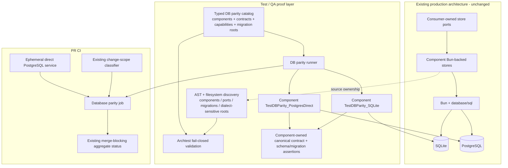
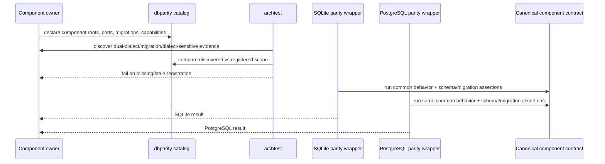
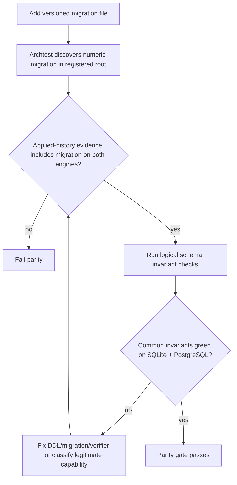
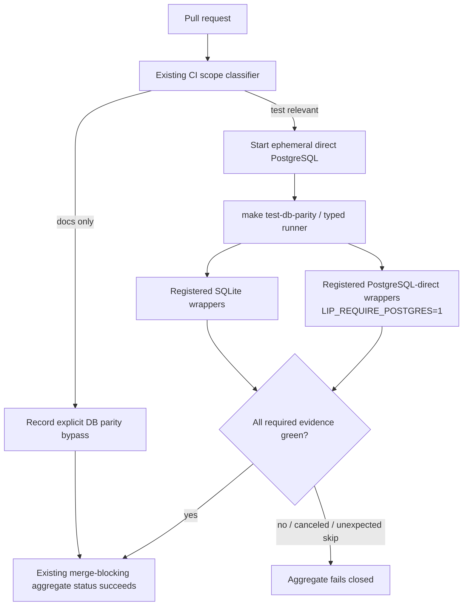
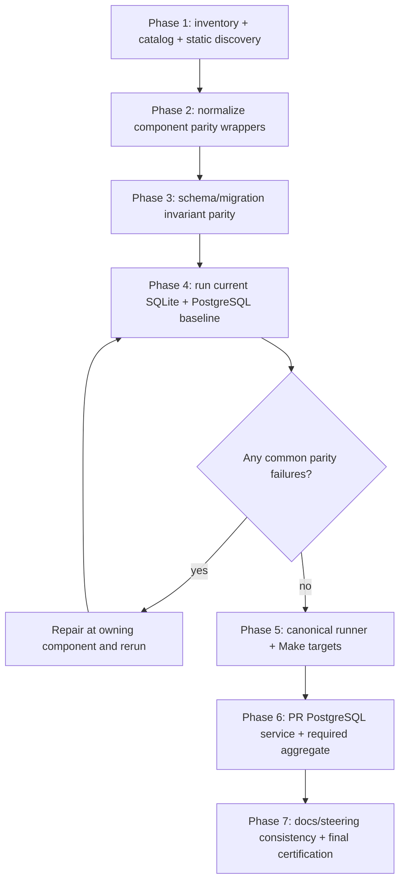

# Design Document

## Overview

This feature turns SQLite/PostgreSQL parity from an implicit property of shared Bun code into an explicit, executable repository invariant. It keeps all production persistence behind existing consumer-owned ports and Bun-backed adapters, then adds a test-side catalog that enumerates each dual-dialect component, its common contract surfaces, migrations, and intentional backend-specific capabilities. Component-owned parity wrappers execute the same logical contract against real SQLite and PostgreSQL fixtures, while architecture tests discover unregistered dual-dialect/migration candidates and fail closed.

The merge path gains a dedicated direct-PostgreSQL service-container job plus SQLite parity execution. Its result is propagated through an already merge-blocking aggregate CI status, so parity cannot silently disappear because a PostgreSQL environment variable was absent or because a new workflow check was not added to branch protection. Existing PgBouncer/transaction-pooler, distributed-authority, billing-convergence, migration, race, and release gates remain specialized evidence outside the basic direct-engine parity matrix.

The implementation begins with a brownfield certification wave. It inventories the current eight candidate migration families, normalizes their parity entry points, strengthens asymmetric schema/contract evidence, runs the complete matrix on both engines, and repairs any actual divergence before enabling fail-closed CI.

### Goals
- Certify current common persistence behavior and schema invariants on both SQLite and PostgreSQL.
- Make every future dual-dialect component/migration discoverable and registered in one typed test-side catalog.
- Run common logical contracts against both real engines through stable component-local parity entry points.
- Represent intentional SQLite/PostgreSQL/topology differences explicitly rather than as silent skips.
- Make direct-engine parity a merge-blocking PR invariant without adding production runtime machinery.
- Preserve existing specialized PostgreSQL pooler/distributed/release evidence.

### Non-Goals
- Replace Bun or `database/sql`.
- Add a generic production persistence framework or service registry.
- Require identical SQL/DDL text between engines.
- Add MySQL or another database dialect.
- Make SQLite distributed-strict across multiple processes.
- Migrate operator data between database products.
- Refactor unrelated store/domain logic that already satisfies the common contracts.

## Boundary Commitments

### This Spec Owns
- Internal database-parity catalog and validation model.
- Static discovery/architecture guardrails for unregistered dual-dialect components, migrations, and dialect-sensitive ownership.
- Stable component-local SQLite/PostgreSQL-direct parity test entry points.
- Shared behavioral, transactional, migration, and logical-schema parity evidence for every registered component.
- Explicit backend/topology capability metadata and evidence anchors.
- A canonical local/CI database-parity runner and Makefile targets.
- Ephemeral direct-PostgreSQL PR CI execution and fail-closed aggregation into an existing merge-blocking status.
- Baseline remediation of current parity failures and current schema-verification gaps discovered during implementation.
- Documentation/steering synchronization for the executable database parity contract.

### Out of Boundary
- Public LLM API/canonical protocol changes.
- New runtime database selection features.
- New commercial billing semantics or financial policy.
- Data export/import or SQLite↔PostgreSQL migration tooling.
- PgBouncer implementation or a new hosted database service.
- Replacing component-owned store contracts with testkit interfaces.
- Moving all migrations into one central migration package.

### Allowed Dependencies
- Existing component-owned consumer interfaces and contract-test packages.
- `internal/infra/db` test helpers and existing PostgreSQL test environment/harness utilities.
- Bun/sqlite/postgres dependencies already pinned in `go.mod`.
- `internal/archtest` and `internal/qa` for static and repository-policy gates.
- Existing Makefile, CI scope classifier, CI required-status pattern, and specialized PostgreSQL targets.
- Existing component schema/migration helpers, including `VerifySchema` where already appropriate.

### Revalidation Triggers
- A new production package claims both SQLite and PostgreSQL support.
- A registered store type implements a new consumer-owned persistence interface/capability.
- A new versioned migration file appears under a registered migration root.
- Dialect-specific SQL/locking/error behavior moves outside registered roots.
- SQLite or PostgreSQL support is removed from a component.
- PgBouncer/transaction-pooler rules change.
- CI scope/required-status topology changes.
- A component changes migration table ownership or test package layout.
- Active `high-concurrency-performance-hardening` or A-leg lifecycle work changes secure-session/continuity store contracts, schemas, transaction shape, or persistence ownership.

## Architecture

### Existing Architecture Analysis

The production architecture already has the right dependency direction. Core/application code consumes narrow store contracts; concrete SQLite/PostgreSQL mechanics live in Bun-backed driven adapters or infrastructure packages. Several runtime composition paths now open SQLite through Bun as well as PostgreSQL, which means the original “two completely separate store implementations” risk has already been reduced substantially.

The remaining risk is semantic rather than structural. Examples in the current tree include PostgreSQL `UPDATE ... RETURNING` versus SQLite read/update allocation, PostgreSQL `FOR UPDATE` versus SQLite immediate-write transaction serialization, manual placeholder/bool adaptation in the control-plane store, SQLite-specific BUSY retry behavior, and separate dialect DDL bodies. Those differences are sometimes required and sometimes potential drift surfaces.

Testing is also strong but fragmented. Several components already share contract suites across engines; others have equivalent tests without a standardized parity entry point. PostgreSQL tests are integration-tagged and environment-gated. Current direct/pooler Make targets intentionally cover a subset of database components, and the inspected PR workflow does not provide repository-wide real-PostgreSQL parity despite documentation implying broader execution.

### Architecture Pattern & Boundary Map

Selected pattern: **test-side parity catalog + component-owned contract adapters + static discovery + real-engine CI**.



**Architecture Integration**:
- **Selected pattern**: keep database mechanics component-owned; centralize only the proof inventory/orchestration.
- **Domain/feature boundaries**: contracts remain with the consuming domain; parity metadata names them but does not redefine them.
- **Existing patterns preserved**: Bun, explicit composition, consumer-owned interfaces, build-tagged real-service integration tests, archtest/QA repository gates.
- **New components rationale**: a typed catalog prevents package-list drift; stable wrappers let one runner execute heterogeneous component contracts; discovery catches omitted components/migrations; CI makes PostgreSQL evidence mandatory.
- **Steering compliance**: no reflection/DI/runtime registry, no `init()` state, no public DB types, no provider/plugin changes.

**Optional Hexagonal Lens**:
- **Domain policy**: existing store contracts and their logical invariants.
- **App/use-case orchestration**: unchanged.
- **Driven adapters**: existing Bun durable stores; targeted defects fixed here only when parity tests fail.
- **Composition root**: unchanged runtimebundle/host wiring; CI composition is separate test infrastructure.
- **Ports/query seams**: existing consumer-owned ports; the parity catalog references these contracts rather than inventing new production ports.

**Project Boundary Questions (Go LIP)**:
- Core-owned or plugin-owned? **Neither as a new product feature**: enforcement lives in internal test/QA infrastructure; component fixes remain with their existing owners.
- New canonical concept? **No**. This is persistence verification infrastructure.
- Streaming-first path preserved? **Yes; no execution-path change.**
- Provider SDK leakage avoided? **Yes; no provider dependencies.**
- No retry/failover after visible output preserved? **Unaffected.**
- Secure-session/diagnostics/startup security affected? **Secure-session store tests and DB startup evidence only; semantics remain unchanged unless a parity defect is fixed.**
- Extension seam used? **No; database parity is repository verification, not an extension feature.**

### Technology Stack

| Layer | Choice / Version | Role in Feature | Notes |
|---|---|---|---|
| Test orchestration | Go toolchain pinned by repo | Typed catalog, runner, AST/filesystem validation | No runtime dependency |
| Persistence | Existing Bun + `database/sql` | Production abstraction under test | Preserved |
| SQLite proof | Existing `modernc.org/sqlite` | Real local engine parity fixture | No external service |
| PostgreSQL proof | Existing pgdriver/pgx-compatible opening helpers | Real direct-engine parity fixture | CI service container, no secrets |
| Architecture policy | `internal/archtest`, `internal/qa` | Discovery, catalog/test/doc/CI consistency | Fail closed |
| CI | Existing GitHub Actions workflows | Ephemeral PostgreSQL + merge-blocking aggregate | Reuse current scope classifier |

## File Structure Plan

### Directory Structure

```text
internal/
├── testkit/
│   └── dbparity/
│       ├── catalog.go              # Typed component/contract/capability/migration-root inventory
│       ├── catalog_test.go         # Catalog invariants and deterministic ordering
│       ├── command.go              # Pure command-plan construction for testability
│       └── cmd/
│           └── main.go             # Internal parity runner: list/sqlite/postgres-direct/all
├── archtest/
│   └── database_parity_test.go     # Discover candidates/migrations/dialect roots; compare to catalog
└── qa/
    └── database_parity_policy_test.go # Pin Make/CI/docs fail-closed wiring

# Each registered component keeps domain knowledge locally. Pattern examples:
internal/core/continuity/bunstore/
├── dbparity_test.go                # TestDBParity_SQLite + common suite composition
└── dbparity_postgres_test.go       # integration-tagged TestDBParity_PostgresDirect

internal/core/securesession/storecontract/
├── ... existing shared contract ...
└── dbparity_*_test.go              # thin wrappers/reuse existing RunAll

internal/infra/<component>/...
└── dbparity[_postgres]_test.go      # same stable wrapper pattern
```

The exact component test package may differ when the canonical contract already lives in a sibling `storecontract`/`contract` package. The catalog records the executable Go test package, while `SourceRoots` and `MigrationRoots` record production ownership separately.

### Modified Files
- `Makefile` — add canonical `test-db-parity`, SQLite-only, and PostgreSQL-direct targets delegating to the typed runner; preserve specialized pooler/distributed targets.
- `.github/workflows/ci.yml` — add direct PostgreSQL service job and feed its result into the existing required aggregate status for test-relevant changes.
- `.github/workflows/qa.yml` — remove/repair stale assumptions only as needed; do not duplicate the mandatory DB job in two workflows.
- `internal/testkit/postgres_env.go` — reuse existing fail-closed semantics; only narrow changes if required for stable parity wrapper behavior.
- `internal/testkit/postgres_makefile_gate_test.go` — preserve specialized target assertions and add general parity target invariants or move general assertions to `internal/qa`.
- Registered store test files — consolidate common contract entry points and add stable parity wrappers.
- Registered migration/schema tests/helpers — strengthen logical invariant verification on whichever backend is weaker.
- `.kiro/steering/testing.md`, `.kiro/steering/tech.md`, `docs/release-gates.md`, `docs/database-persistence.md` — align commands, component scope, common-vs-topology evidence, and actual CI execution.
- `AGENTS.md` — add a concise contributor rule only if current repository guidance has a suitable database/testing policy section; do not duplicate the full catalog.

## System Flows

### Flow A: Register and certify a current component



The wrappers may have backend-specific fixture setup, but they must converge on the same common logical assertions. Backend-specific capabilities are separate subtests/evidence anchors, not forks of the common contract.

### Flow B: Future migration change



### Flow C: Pull-request merge gate



Pooler-only evidence remains outside this direct service flow and is explicitly selected by the existing pooler target.

## Requirements Traceability

| Requirement | Summary | Components | Interfaces | Flows |
|---|---|---|---|---|
| 1 | Authoritative inventory | Parity Catalog, Discovery Guard | Catalog metadata | A |
| 2 | Shared behavioral parity | Component parity wrappers, canonical contracts | Existing store ports | A |
| 3 | Transaction/concurrency parity | Component common + backend-specific suites | Existing store ports | A, C |
| 4 | Schema/migration parity | Migration discovery, logical schema assertions | Component migration helpers | A, B |
| 5 | Capability/exception model | Parity Catalog | Capability metadata | A |
| 6 | Dialect-sensitive guardrails | Discovery Guard | Source-root ownership | A, B |
| 7 | Mandatory real-engine CI | Parity Runner, CI Database Job, Required Aggregator | Existing Postgres env contract | C |
| 8 | Current-state remediation | Baseline certification wave across all registered components | All registered ports | A–C |
| 9 | Stable workflow/docs | Runner, Make targets, QA policy tests, docs | CLI/Make test commands | C |
| 10 | Runtime compatibility | Boundary rules | Existing Bun/store ports | N/A |

## Components and Interfaces

| Component | Domain/Layer | Intent | Req Coverage | Key Dependencies | Contracts |
|---|---|---|---|---|---|
| DB Parity Catalog | test infrastructure | Authoritative list of dual-dialect components, ports, capabilities, migrations | 1, 5, 9, 10 | repo paths, component metadata | State/Batch |
| Discovery Guard | architecture test | Detect unregistered/stale dual-dialect/migration/dialect-sensitive ownership | 1, 4, 6 | Go AST, filesystem, catalog | Batch |
| Component Parity Wrapper Pattern | component tests | Stable SQLite/Postgres entry points invoking canonical domain contracts | 2–5, 8 | existing contract suites, DB fixtures | Batch |
| Logical Schema Verifiers | component tests/helpers | Assert equivalent schema protections using engine-native metadata | 4, 8 | Bun, SQLite metadata, PG catalogs | Batch |
| DB Parity Runner | test infrastructure | Execute registered wrappers without duplicate package lists | 7, 9 | `go test`, catalog | Batch |
| CI Database Parity Job | CI | Run SQLite + real direct PostgreSQL on PRs | 7–9 | service container, runner | Batch |
| Required CI Aggregator Wiring | CI policy | Make DB parity result merge-blocking through existing required status | 7, 9 | current CI required job | Batch |
| Documentation/Policy Guard | QA/docs | Keep docs/Make/workflows aligned with executable catalog | 7, 9 | catalog, repository files | Batch |

### Test Infrastructure

#### DB Parity Catalog

| Field | Detail |
|---|---|
| Intent | One typed source of truth for what dual-dialect parity means and which packages prove it |
| Requirements | 1, 5, 9, 10 |

**Responsibilities & Constraints**
- Explicit static Go data; no reflection registration and no `init()` hooks.
- Contains test metadata only; production packages must not import it.
- Stable component IDs suitable for error output and future CI filtering.
- Separates production source roots from executable test package paths.
- Records current consumer-owned contract surfaces and capability classes.
- Records migration roots, not duplicated migration ID lists; IDs are discovered from files.
- Records backend-specific exceptions with rationale and evidence anchor.

**Conceptual State Model**
```go
type BackendClass string

const (
    Common               BackendClass = "common"
    SQLiteSpecific       BackendClass = "sqlite"
    PostgresDirect       BackendClass = "postgres-direct"
    PostgresDistributed  BackendClass = "postgres-distributed"
    PostgresPooler       BackendClass = "postgres-pooler"
)

type Capability struct {
    ID        string
    Class     BackendClass
    Evidence  string
    Rationale string // required for non-common capabilities
}

type Component struct {
    ID             string
    SourceRoots    []string
    TestPackages   []string
    StoreContracts []string
    MigrationRoots []string
    Capabilities   []Capability
}
```

The final implementation may use slightly different field names, but it must preserve these semantics and deterministic validation.

#### Discovery Guard

| Field | Detail |
|---|---|
| Intent | Ensure catalog completeness and bound dialect-sensitive ownership |
| Requirements | 1, 4, 6 |

**Discovery inputs**
- Versioned Go migration files under production roots (numeric timestamp prefix, excluding tests/non-migrations through deterministic rules).
- Packages creating Bun migration registries.
- Composition/config paths that advertise both `sqlite` and `postgres` for one store capability.
- Packages/source files containing approved dialect-sensitive constructs (`dialect.SQLite`, `dialect.PG`, shared `DialectSQLite`/`DialectPostgres`, explicit PG/SQLite schema metadata, driver-specific SQLite error handling, or equivalent implementation-time patterns).
- Important compile-time consumer-interface assertions on registered store types where present; implementation should add assertions for significant durable ports that are currently implicit.

**Validation rules**
- Every discovered dual-dialect candidate maps to exactly one catalog component or explicitly shared DB infrastructure.
- Every catalog path exists.
- Every migration root's discovered migration IDs are exercised by that component's parity suite and recorded in both engine migration histories.
- Every component has stable SQLite and PostgreSQL-direct parity entry points in its registered test package(s).
- Every non-common capability has rationale + evidence.
- Discovery/allowlist failures name the concrete path and expected remediation.

### Component Test Layer

#### Stable Parity Entry Points

Each registered component exposes stable test entry points, preferably:

```go
func TestDBParity_SQLite(t *testing.T)

//go:build integration
func TestDBParity_PostgresDirect(t *testing.T)
```

The entry points are intentionally thin. They prepare the backend-specific fixture and invoke one component-owned common suite that includes applicable behavior, migration, schema, persistence, and concurrency subtests. Existing contract packages (`storecontract.RunAll`, `contract.RunSuite`, etc.) remain authoritative and should be composed rather than copied.

**PostgreSQL behavior**
- Required direct wrapper calls the existing PostgreSQL gate helper in fail-closed mode when invoked by the runner.
- Admin and runtime DSNs may point to the same ephemeral direct CI service.
- Pooler-only tests are not hidden inside the direct wrapper; they retain separate explicit evidence.

**SQLite behavior**
- Uses real `modernc.org/sqlite` files/DSNs matching production transaction settings required by the component.
- SQLite-specific retry/serialization capabilities are separate evidence where not part of the common contract.

#### Logical Schema Verification

Schema contracts should be represented as component-owned logical invariants, then implemented with engine-specific metadata access. The initial remediation must at least cover correctness-relevant objects already relied upon by code/tests:

- required tables/columns and semantic type category;
- nullability/default assumptions that change behavior;
- primary/foreign/unique constraints;
- partial/unique/correctness-critical indexes;
- check constraints and immutable-ledger protections where applicable;
- migration-history rows for every discovered migration ID;
- retired tables/columns/triggers that must remain absent.

Do not attempt a textual SQLite-DDL vs PostgreSQL-DDL diff.

### Test Orchestration

#### DB Parity Runner

| Field | Detail |
|---|---|
| Intent | Derive executable parity scope from the catalog and run stable wrappers |
| Requirements | 7, 9 |

**Supported modes**
- `list` — deterministic human/machine-readable component/capability inventory.
- `sqlite` — run required SQLite wrappers only; no external service.
- `postgres-direct` — fail closed if required PostgreSQL DSNs are unavailable; run integration-tagged direct wrappers and explicitly exclude pooler-only tests.
- `all` — SQLite followed by PostgreSQL-direct.

**Execution rules**
- Build `go test` package lists from catalog data, never a second manually curated list.
- Preserve repository `GO_TEST_FLAGS`/parallelism semantics where applicable.
- Propagate subprocess exit status.
- Redact DSNs from command/error output; print component IDs/package names only.
- Unit-test command planning separately from real engine execution.

### CI Layer

#### PR Database-Parity Job

Use the existing `ci.yml` scope classifier. For test-relevant PRs:
1. checkout and set up Go;
2. start a pinned direct PostgreSQL service container with non-production credentials;
3. health-check the service;
4. export runtime and admin DSNs to the local service;
5. set fail-closed PostgreSQL test mode;
6. execute the canonical parity runner/Make target;
7. upload only safe logs if useful; never echo raw DSNs.

For documentation-only PRs, emit an explicit bypass message.

#### Required Aggregate Wiring

The existing required `repo-hygiene` pattern already uses `if: always()` and explicit failure checks to avoid skipped-required-check deadlocks. Extend that pattern so test-relevant PRs fail the required status when database parity is not `success`. Keep docs-only bypass successful. This avoids relying on an out-of-band branch-protection edit to make the new job authoritative.

### Capability Model

The catalog is not an excuse list. A capability may be non-common only when the production contract actually differs.

Initial classes to preserve explicitly:
- **Common**: core CRUD/query/persistence/idempotency/order semantics promised by both durable engines.
- **SQLite-specific**: SQLite BUSY/LOCKED retry behavior and local writer-serialization mechanics when externally observable/required.
- **PostgreSQL distributed**: multi-instance strict row-lock/capacity guarantees not promised by SQLite.
- **PostgreSQL pooler**: transaction-pooler-safe DML/opening behavior under the existing dual-endpoint topology contract.

If a capability can satisfy the same logical contract through different SQL, keep it **Common** and test both. Do not classify implementation-detail differences as product exceptions.

## Error Handling

### Error Strategy

- **Catalog/discovery error**: fail architecture test with component/path and missing/stale metadata.
- **SQLite parity failure**: report component/subtest; no fallback to PostgreSQL result.
- **PostgreSQL unavailable in mandatory CI**: fail closed before tests; optional developer invocations may choose the SQLite-only mode instead.
- **Unexpected PostgreSQL skip**: fail the required wrapper/runner rather than counting skip as success.
- **Capability mismatch**: fail if a common contract diverges; allow only cataloged backend-specific evidence with rationale.
- **Migration mismatch**: fail with component, migration ID, backend, and missing invariant/history marker.
- **CI job cancellation/failure**: required aggregate reports failure for test-relevant PRs.

### Monitoring

No production telemetry is added. CI output should include:
- component ID;
- backend mode;
- contract/migration/schema subtest result;
- elapsed time;
- explicit capability-class skips/exclusions when applicable.

Never include raw DSNs or credentials.

## Testing Strategy

### Unit / Static Tests
- Catalog ID/path/capability uniqueness and deterministic ordering.
- Discovery detects the current migration families and fails on synthetic unregistered candidates.
- Migration-file scanner excludes `_test.go` and documented non-migration cases deterministically.
- Stable parity wrapper presence/test-package validation.
- Capability exceptions require rationale/evidence.
- Runner command planning and secret-safe output.
- QA tests pin Makefile/workflow/docs references to the canonical parity command.

### SQLite Parity Tests
- Run every registered component's stable SQLite wrapper.
- Exercise the component's common behavior suite.
- Apply migrations from empty DB, rerun idempotently, verify discovered migration history.
- Verify logical schema invariants.
- Exercise SQLite-specific capabilities separately where required.

### PostgreSQL Direct Parity Tests
- Run every registered component's integration-tagged direct wrapper with fail-closed PostgreSQL environment.
- Run the same common behavior suite as SQLite.
- Apply/verify migration and schema invariants in isolated schemas/store IDs to avoid package collisions.
- Exercise PostgreSQL distributed direct-only capabilities separately where appropriate, while keeping pooler-specific tests outside this mode.

### CI Contract Tests
- Workflow policy test proves PostgreSQL service + required env + canonical parity command are wired.
- Required aggregate test proves parity failures/cancellations block test-relevant PRs and docs-only bypass remains successful.
- Test helper proves mandatory direct mode cannot silently skip without DSN.
- Existing pooler Makefile contract tests remain green.

## Migration Strategy

This is a test/verification migration, not operator data migration.



Do not enable the merge-blocking aggregate before the full registered baseline is green, otherwise current unknown defects can block unrelated work without an established classification/fix path.

## Supporting References

- `research.md` — brownfield inventory, gap analysis, and decision rationale.
- Issue #438 comments — original audit and recommended contract/capability + real-engine enforcement model.
- Existing specialized direct/pooler targets and PostgreSQL harness — reuse rather than replace.
