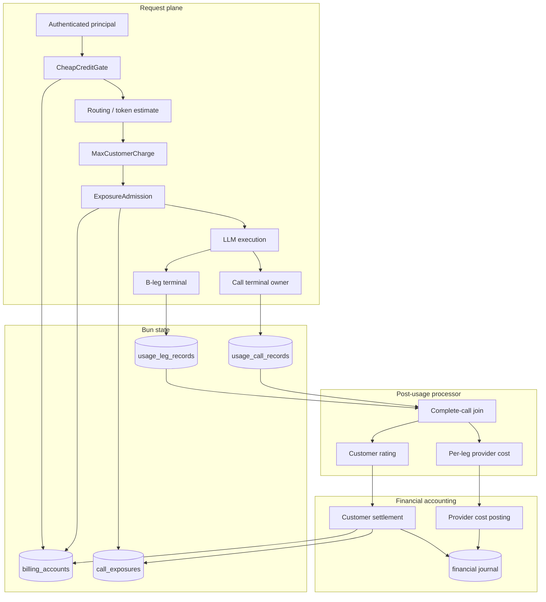
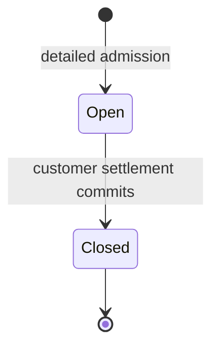
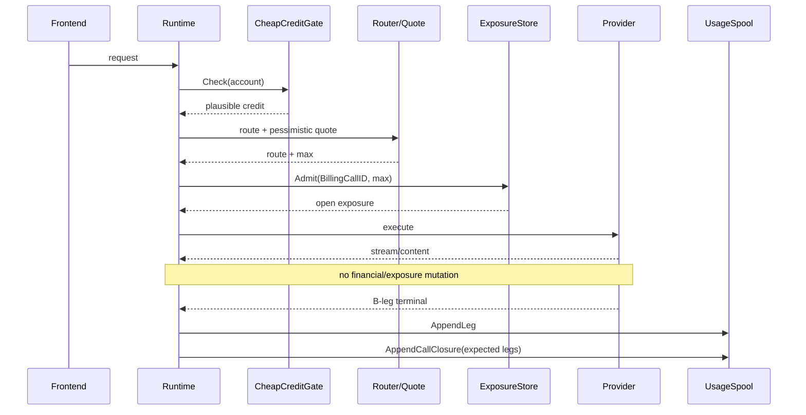
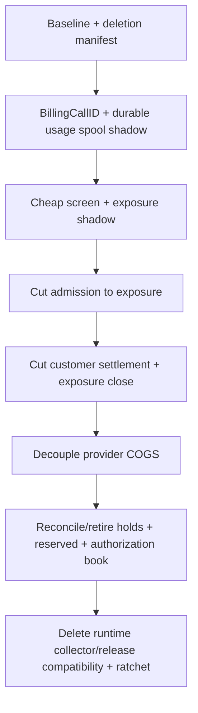

# Design Document

## Overview

This design replaces Go-LIP's monetary authorization-hold lifecycle with telecom-style **two-stage affordability + operational exposure + post-usage accounting**.

Settled customer balance remains pure financial state reconstructed from the double-entry journal. Admission no longer posts authorization journal entries or mutates `reserved_nano`. Detailed admission atomically inserts one immutable open-exposure row after routing; that row stays unchanged until post-usage customer settlement posts the actual charge and closes the exposure.

Runtime produces terminal usage facts rather than assembling a financial transaction. Each B-leg appends one immutable leg usage record; the request terminal owner appends one call-closure record containing the expected B-leg IDs. A post-usage processor joins those records, posts customer billing exactly once, closes exposure, and processes provider COGS independently per B-leg.

### Goals

- Reject obviously insolvent requests before expensive routing.
- Enforce prepaid/postpaid limits under concurrent calls without touching financial balance during setup/execution.
- Remove authorization holds, reserved balance, authorization journal, hold release/remainder logic, and runtime billing aggregation/barriers.
- Give each incoming inference invocation its own billing identity independent of long-lived A-leg/session identity.
- Preserve durable at-least-once usage processing and at-most-once financial effects.
- Retain the existing financial journal, immutable snapshots, B2BUA economics, Bun infrastructure and reconciliation strengths.
- Make provider-cost reconciliation independent of customer billing availability.

### Non-Goals

- Per-token debiting or in-flight monetary termination.
- Invoice/tax/payment-provider workflows or FX.
- Generic event sourcing/message bus/workflow framework.
- Changing provider protocols or retry/failover semantics.
- Replacing non-money quota/concurrency systems.
- Low-balance concurrency=1 as the primary correctness mechanism.

## Architecture

### Existing Architecture Analysis

Retain exact money/value types, immutable pricing/policy/operator-rate snapshots, pure `EstimateMaxCustomerCharge`, final provider evidence, the financial journal/source keys/fingerprints/account sequence, prepaid/postpaid account states, Bun SQLite/PostgreSQL, post-turn processing, provisioning, reports and reconciliation.

Replace:

```text
quote -> financial authorization hold -> authorization journal + reserved_nano
      -> execute -> runtime TUR aggregation/barrier
      -> all-or-nothing customer+provider settlement -> authorization release
```

with:

```text
cheap account screen -> route + quote -> atomic operational exposure insert
      -> execute with no billing/exposure mutation
      -> durable per-leg usage + call closure
      -> customer settlement + exposure close
      -> independent per-leg provider COGS
```

### Boundary Map



> **Invariant:** before execution, billing may read settled financial state and atomically register operational exposure. During execution it performs no monetary or exposure mutation. After execution, only durable terminal usage records drive financial posting.

### Ownership

- Domain policy: exact money, max quote, customer rating, provider-cost rating, exposure formula.
- App orchestration: cheap screen, exposure admission, complete-call processing, customer settlement, provider-cost processing, reconciliation.
- Driving adapters: runtime pre-route/post-route/terminal seams, admin recovery/reporting.
- Driven adapters: Bun account/exposure/usage/journal store, immutable catalog.
- Composition: `internal/infra/runtimebundle`.

Provider SDKs remain edge-only; no public money concepts are required in `pkg/lipapi`; streaming/no-retry-after-output semantics remain unchanged.

## Domain Model

### BillingCallID

One proxy-owned ID per incoming billable inference invocation. It is stable across that request's failover/parallel B-legs and different for later calls on the same A-leg/session.

Customer billing key: `(account_id, billing_call_id)`. Provider-cost key: `(billing_call_id, b_leg_id)`. A-leg/session remain correlation only.

### Financial headroom

```text
SettledHeadroom = Balance - CreditFloor
```

`CreditFloor=0` for prepaid; `CreditFloor=-CreditLimit` for postpaid. No reserved financial balance participates.

### CallExposure

Stores account, BillingCallID, max amount/currency, customer pricing/policy refs, fingerprint, created/closed time, plus safe admission diagnostics (balance/floor/open exposure/headroom before/after).

Normal lifecycle:



The amount and quote refs never change while open.

### Terminal usage records

`LegUsageRecord` is persisted independently per B-leg and carries BillingCallID, lineage, backend/provider/model, terminal outcome/surfaced state, timestamps, final usage/cost evidence and operator-rate ref.

`CallUsageRecord` carries BillingCallID, account/A-leg/session correlation, outcome, customer pricing/policy refs, timestamps and exact expected B-leg IDs. It does not embed leg payloads. The terminal owner seals it only after no more B-leg can be allocated for that BillingCallID.

Call/leg records use stable keys + semantic fingerprints: identical replay is idempotent; same key/different fingerprint is an integrity error.

### Processed operations

A customer operation exists for every complete call, including exact-zero charge. A provider-cost operation exists per B-leg, including reconciled zero. Zero operations need no artificial zero journal entries.

## Admission

### Stage 1 — CheapCreditGate

Runs after authenticated principal resolution and before route expansion, rate/model lookup and tokenization. It reads only account readiness/currency/balance/floor and typed `MinPreRouteHeadroom`. It performs no provider work, usage write, exposure insert, journal write or account mutation.

`MinPreRouteHeadroom=0` lets zero-headroom accounts reach detailed admission for potentially free routes; a positive value intentionally rejects micro-headroom calls earlier. Missing/not-ready/reconcile-required account or authoritative store outage fails closed.

### Stage 2 — quote + exposure admission

Reuse/refactor current `EstimateMaxCustomerCharge`: preserve no-cache pessimism, client-vs-model output ceiling, fixed/resource charges, max-of-routes for one surfaced customer charge, sum for multi-leg/pass-through policy, and conservative unknown/overflow/currency handling.

Store algorithm:

```text
BEGIN account-scoped transaction
  lock billing_accounts row
  verify ready/currency
  settled_headroom = balance - credit_floor
  open_exposure = SUM(max_exposure_nano WHERE account_id=? AND closed_at IS NULL)
  require settled_headroom >= open_exposure + new_max
  insert immutable call_exposure
COMMIT
```

No account update, financial journal posting or mutable exposure-total counter is required.

### Safety proof

```text
SafetyMargin = Balance - CreditFloor - Sum(OpenExposure)
```

Admission requires `SafetyMargin >= NewMax`. Settlement atomically reduces Balance by `Actual` and closes exposure `Max`, with `Actual <= Max`:

```text
SafetyMarginAfter = SafetyMarginBefore + (Max - Actual) >= SafetyMarginBefore
```

All admissions, customer settlements and balance/credit-policy mutations for one account acquire the same account serialization point.

## Runtime Flow



A pre-provider failure after exposure admission follows the same terminal path and may produce a zero customer operation. Runtime does not directly release exposure.

## Durable Usage Spool

Authoritative mode requires Bun-backed durable usage storage. In-memory outbox remains tests/non-authoritative only.

A call is claimable when the call closure exists and every expected B-leg has one valid terminal row. Append order does not matter.

Failure to append after client-visible output cannot alter the response or trigger provider retry. It triggers detached retry and critical diagnostics. Simultaneous total loss/unavailability of all durable replicas before any append succeeds is outside the guarantee.

## Customer Billing

The worker claims a complete call, resolves immutable customer snapshots, rates the call, then applies one account transaction containing replay check, exposure lookup, actual<=max and floor checks, non-zero journal posting, materialized balance update, customer operation row and exposure close.

Exact-zero charge records the customer operation and closes exposure but creates no zero-value journal transaction.

If actual exceeds max or the floor would be crossed, do not clamp/overrun: mark reconcile-required and retain exposure for verified repair.

## Independent Provider Cost

Each B-leg is processed independently:

```text
authoritative provider cost
  OR final quantities + immutable operator rate
  -> provider cost operation
  -> non-zero: COGS debit / provider payable credit
  -> zero: operation marker
  -> missing/unrateable accepted leg: unreconciled_cost
```

Provider-cost delay/failure does not block or undo valid customer settlement/exposure closure.

## Financial Journal

Only actual money belongs in the journal:

- customer usage: debit customer financial account / credit usage revenue;
- funding/payment: debit cash/clearing / credit customer account;
- provider COGS: debit inference COGS / credit provider payable;
- corrections: linked reversal + replacement.

No authorization hold/release postings exist in the target call path. Existing exact arithmetic, account sequence, immutable entries and trial-balance/rebuild logic remain.

## Storage

| Area | Key | Purpose |
|---|---|---|
| `billing_accounts` | account | settled balance/mode/credit/readiness |
| `call_exposures` | account + BillingCallID | immutable max until customer settlement |
| `usage_leg_records` | BillingCallID + BLegID | B-leg terminal evidence |
| `usage_call_records` | BillingCallID | call closure + separate claim state |
| customer operation | account + BillingCallID | exactly-once logical billing, including zero |
| provider cost operation | BillingCallID + BLegID | exactly-once COGS/zero/unreconciled |
| financial journal | existing IDs | authoritative money history |

`call_exposures` is indexed for account-scoped sum of open amounts. Baseline deliberately avoids a mutable exposure aggregate counter. Bun/driver types remain infrastructure-only.

## Reconciliation and Recovery

Financial rebuild uses opening balance plus customer-account journal credits minus debits. Exposure reconciliation independently sums open exposure rows.

Journal/operation conflicts, impossible actual>max, floor violation or materialized balance mismatch transition account to `reconcile_required`; both admission stages deny while repair/post-usage reconciliation may continue.

TTL alone never closes stale exposure. Recovery requires positive evidence that the call cannot continue and either complete usage exists or an operator-approved idempotent no-charge repair is recorded.

## Error Strategy

| Failure | Behavior |
|---|---|
| account store unavailable at cheap screen | fail closed before routing |
| below cheap threshold | deny before routing |
| quote unknown/unbounded | deny before provider work |
| exposure admission unavailable/insufficient | fail closed |
| usage append fails after output | preserve response; detached retry + critical health |
| incomplete leg set | wait/retry; exposure stays open |
| customer rating/snapshot failure | no posting; exposure stays open |
| actual > max / floor violation | reconcile-required |
| provider cost missing | unreconciled_cost; customer billing unaffected |
| exact replay | idempotent success |
| conflicting replay | integrity failure |
| reporting failure | read-side error only |

## Testing Strategy

- Pure tests: cheap threshold, quote, customer rating, provider cost, exact arithmetic.
- Store contracts: account serialization, exposure replay, usage append replay, arbitrary append order, zero/non-zero customer settlement, independent provider cost, rebuild.
- Property/concurrency tests: admission/settlement/top-up/credit-policy interleavings and SafetyMargin.
- B2BUA: failover, parallel, rejected legs, surfaced winner, differing rates, multiple BillingCallIDs on one A-leg.
- Failure: DB outage at both admission stages, terminal spool retry, worker replay, provider unreconciled cost, stale recovery.
- Architecture: no stream financial mutation; no monetary hold/reserved path; no runtime evidence barrier; no A-leg-only settlement key.

## Migration Strategy



Shadow comparison may calculate both paths, but exactly one hard-credit mechanism is authoritative.

## Brownfield Deletion Targets

Retire normal-call `Authorization`, `AuthorizationStore`, `AuthorizationLookup`, `HoldReleaser`, `BillingAdmissionCleanup`, `authorization_holds`, `reserved_nano`, authorization-book postings, hold expiry/remainder/release, hold-dependent rating lookup, `billingTurnCollector.evidenceByALeg`, billing parallel barrier/TUR rebuild, and the provider-cost-complete prerequisite for customer settlement.

## Requirements Traceability

| Requirement | Owner |
|---|---|
| 1 | financial vs exposure boundary |
| 2 | BillingCallID |
| 3 | CheapCreditGate |
| 4 | max quote |
| 5–6 | CallExposure + SafetyMargin |
| 7 | runtime isolation |
| 8 | durable leg/call spool |
| 9 | customer operation + exposure close |
| 10 | independent provider cost |
| 11 | existing financial journal |
| 12 | reconciliation/recovery |
| 13–14 | hold/collector deletion |
| 15 | Bun persistence |
| 16 | reporting separation |
| 17 | TDD/property/architecture ratchets |

## Final Invariant

```text
cheap settled-credit read
 -> route + pessimistic quote
 -> atomic open-exposure insert
 -> execute with no billing/exposure mutation
 -> durable terminal usage records
 -> deterministic customer rating
 -> idempotent double-entry customer posting + exposure close
```

Provider COGS is a separate per-B-leg post-usage path.
