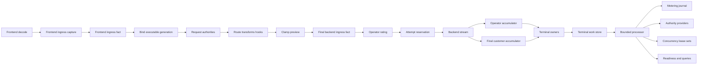
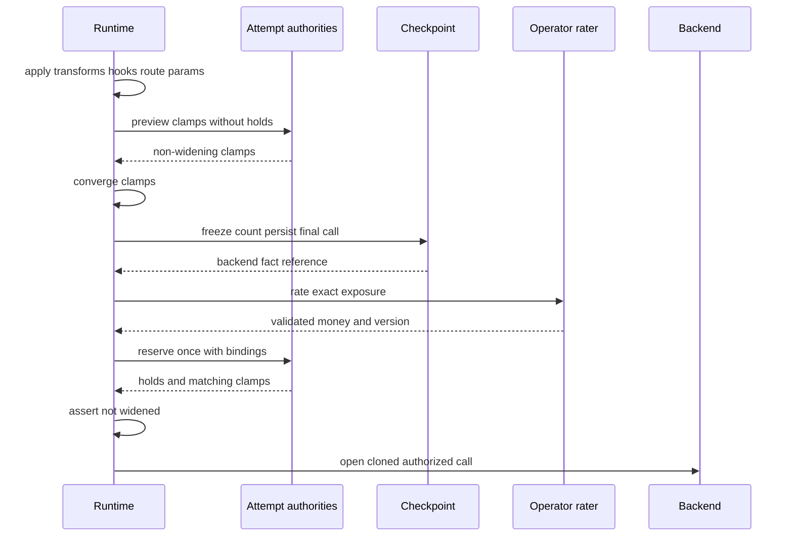

# Design Document

**Source context:** Production-readiness hardening after review of the merged dual-plane economics and concurrency implementation rooted in PR #128, specified by PR #130, and delivered through PRs #133, #134, #135, #141, #142, #143, #144, and #145.

## Overview

The `dual-plane-economics-and-concurrency-production-readiness` feature makes the existing OSS metering, rating, authority, snapshot, and concurrency foundation trustworthy enough for later enterprise economic controls. It preserves proven authority stores, public vocabulary, routing integration, and transaction-pooled PostgreSQL support while correcting the remaining semantic and lifecycle gaps.

The design hardens four connected boundaries: independent customer/operator evidence, validated descriptor-bound provider execution, one durable terminal lifecycle, and executable immutable runtime generations. It completes the four-boundary journal, adds a technical terminal-work outbox, and replaces sequential multi-rule occupancy with atomic distributed lease sets. Proprietary commercial finance remains outside this specification.

### Goals

- Settle customer usage from frontend-visible evidence and operator liability from per-attempt backend evidence.
- Rate and authorize the exact final backend-bound exposure.
- Make provider identity, ordering, strength, and failure posture executable and validated.
- Persist restart-safe frontend-ingress, backend-ingress, backend-egress, and frontend-egress facts.
- Serialize competing terminal paths through one owner per lifecycle.
- Recover required terminal side effects through durable idempotent work.
- Publish generations containing the actual authorities and raters used by requests.
- Preserve strict active-request limits under contention, renewal failure, and crash.
- Certify the combined system through race, fuzz, fault, PostgreSQL, protocol, and benchmark gates.

### Non-Goals

- Customer offers, markups, wallets, credit policy, payments, invoices, tax, refunds, or customer financial journals.
- GUI, SSO/SAML/SCIM, compression implementation, or security/content-policy engines.
- Replacing routing, B2BUA, secure-session, provider adapters, canonical streaming, or the usage-authority store.
- Distributed two-phase commit with external providers.
- Proving transport acknowledgement beyond runtime release of canonical output.
- Rewriting the merged foundation from scratch.

## Design Validation Record

The initial design was validated against the remediated requirements, current `main`, steering, archived predecessor specs, runtime terminal paths, public extension contracts, and direct/transaction-pooled persistence.

| ID | Initial defect | Final correction |
| --- | --- | --- |
| **V-01** | Customer output filtered provider-oriented terminal usage. | Dedicated final-canonical customer accumulator; provider cost cannot enter customer facts. |
| **V-02** | Provider instances and descriptors were independent lists. | Descriptor-bound request, attempt, concurrency, and rater registrations. |
| **V-03** | Non-allow results with holds were unresolved. | V2 rejects them; compatibility compensates the current provider before posture handling. |
| **V-04** | One retry row represented a whole terminal plan. | One independently idempotent action per fact, provider operation, correction, or lease set. |
| **V-05** | Recovery implied local/external atomicity. | Durable intent plus idempotency; no distributed transaction claim. |
| **V-06** | Fact identity lacked identity version and source revision. | Versioned lifecycle/boundary/event/revision identity. |
| **V-07** | Ingress persistence ignored trusted-scope timing. | Early immutable capture, later trusted binding, persistence before authority. |
| **V-08** | Published generations were metadata-only. | Generations contain the actual authority/concurrency/rater registrations. |
| **V-09** | Old provider/generation lifetime was unspecified. | Live references and pending provider IDs remain resolvable until drain. |
| **V-10** | Terminal coverage omitted encoder and post-lease/pre-backend exits. | One terminal command vocabulary covers every request and attempt exit. |
| **V-11** | Multi-rule concurrency was sequential acquire/rollback. | Atomic set acquire, renew, release, and replay. |
| **V-12** | Fail-closed renewal allowed the request to outlive proven occupancy. | Cancel before expiry or preserve uncertain-but-occupied capacity. |
| **V-13** | `BillingReady` implied commercial readiness. | `EconomicControlReady` names the OSS technical posture. |
| **V-14** | Certification omitted state-machine fuzzing and disabled-path overhead. | Added model/fault gates and no-feature benchmarks. |
| **V-15** | Exposure-changing clamps arrived after rating/reservation. | Side-effect-free bounded clamp preview precedes final freeze, rating, and reservation. |

**Validation verdict:** PASS after corrections. All 119 final acceptance criteria map to a component and task.

## Design Rules

| Rule | Constraint |
| --- | --- |
| **D1** | Customer evidence is logical-request scoped; operator liability is backend-attempt scoped. |
| **D2** | Customer input/output use frontend boundaries; operator input/output/cost use backend boundaries. |
| **D3** | Candidate mutation and clamp convergence finish before final rating/reservation. |
| **D4** | Provider instance, stable ID, stage, priority, strength, and failure behavior are one registration. |
| **D5** | External decisions, holds, settlements, ratings, leases, versions, and money are untrusted input. |
| **D6** | Durable event identity is stable across retry/restart and includes identity version and revision. |
| **D7** | Corrections append; targets exist in the same stream, are acyclic, and aggregate deterministically. |
| **D8** | Completion, close, cancel, error, encoder, and panic paths receive one terminal outcome. |
| **D9** | Required terminal effects complete or have durable intent before live state claims durable completion. |
| **D10** | Published generations contain the actual objects that perform admission and settlement. |
| **D11** | Built-in multi-rule concurrency uses atomic lease sets and conservative ambiguous occupancy. |
| **D12** | Runtime persistence is transaction-pool safe; migrations use direct/admin connections. |
| **D13** | Accumulation remains streaming-first and terminal failures never retry after output. |
| **D14** | Durable/operational surfaces exclude raw content, credentials, balances, and unbounded labels. |
| **D15** | OSS owns technical controls and seams; proprietary commercial finance stays external. |
| **D16** | Disabled paths preserve existing behavior and low overhead. |
| **D17** | Every phase starts with red contracts and ends with focused green evidence. |

## Boundary Commitments

### This Spec Owns

Customer/operator terminal separation; final exposure/rating binding; provider registrations and validation; four-boundary technical facts; terminal owners and technical outbox; executable generations; atomic distributed lease sets; additive migrations, readiness, observability, performance, and release evidence.

### Out of Boundary

Commercial pricebooks, wallets, credit accounts, payments, invoices, tax, customer finance, GUI, compression/security engines, provider SDK/wire types in public/core contracts, and cross-service two-phase commit.

### Dependency Direction

- Public SDK/core may use existing canonical, scope, authority, metering, economics, control-plane, routing, B2BUA, secure-session, database, migration, metrics, and tracing abstractions.
- Public SDK/core shall not import provider SDK, HTTP handler, SQL/ORM model, queue SDK, or proprietary module types.
- External modules shall not import `internal/` packages or mutate the executor.
- Strict correctness shall not depend on fail-open observers or raw prompt/response persistence.

## Current Architecture Alignment

**Preserve:** atomic usage-authority mutation sets; public economic vocabulary; final backend call assembly and widening guard; request/attempt coordinators and panic isolation; durable stores and pooler support; B2BUA lineage, completion gates, secure-session scope, and no retry after output.

**Refactor:** provider-derived customer settlement, provider/descriptor parallel slices, shallow validation, request-local fact identity, competing terminal paths, ignored cleanup failures, metadata-only refresh, and sequential multi-rule leases.

**Add:** final customer and operator accumulators, customer/attempt journal streams, terminal-work outbox/processor, executable generation source, lease-set operations, and `EconomicControlReady`.

## Architecture



### Hexagonal Boundary

- **Domain:** economic-plane invariants, result validation, fact identity/corrections, terminal/work states, lease-set rules.
- **Application:** admission order, terminal claim, durable intent, retry sequencing, generation binding, reconciliation.
- **Driving adapters:** standard request execution and privileged admin/query surfaces.
- **Driven adapters:** journals, work stores, providers, concurrency stores, metrics/tracing.
- **Composition:** runtimebundle and public runtime facade construct immutable generations, stores, workers, and registrations.

## Public Contract Changes

### Descriptor-Bound Registrations

```go
package authority

type RequestPriority string
type AttemptPriority string

type RequestRegistration struct {
    Descriptor ProviderDescriptor
    Priority   RequestPriority
    Provider   RequestProvider
}

type AttemptRegistration struct {
    Descriptor ProviderDescriptor
    Priority   AttemptPriority
    Provider   AttemptProvider
}

type ConcurrencyRegistration struct {
    Descriptor ProviderDescriptor
    Provider   ConcurrencyProvider
}
```

Request priorities are `concurrency`, `credit_wallet`, `quota_budget_rate`, and `advisory`; attempt priorities are `hard_spend`, `quota_rate`, and `advisory`. Validation requires bounded unique IDs, compatible stages, known priorities/postures, and non-observer authority implementations. Legacy provider slices are deprecated and accepted only through deterministic explicit registrations—never index-generated durable identities.

### External Result Validation

```go
func (d Decision) ValidateFor(reg ProviderDescriptor, stage Stage) error
func (s Settlement) ValidateFor(handles []string, p metering.EconomicPerspective) error
func (d LeaseDecision) ValidateFor(in LeaseAdmission, reg ProviderDescriptor) error
func (r RatingResult) ValidateFor(req RatingRequest) error
```

Reservations require unique non-empty handles and exactly one present nonnegative quantity or money value. Money requires normalized currency and checked arithmetic. Clamps must be known and non-widening. Settlement handles must belong to the submitted provider-owned set. Rating perspective, currency, version, lines, and rounding must be coherent. Lease ID, generation, expiry, TTL, and posture must be valid.

V2 providers may not return holds with deny/advisory/error. Compatibility adapters compensate current-provider holds before prior-stack compensation. Advisory `deny` becomes advisory evidence; required deterministic denial never fails open.

### Clamp Preview

Clamp-capable attempt authorities optionally implement:

```go
interface {
    PreviewAttempt(context.Context, AttemptAdmission) (Decision, error)
}
```

Preview is side-effect free: it may return validated non-widening clamps and evidence but no holds. The runtime applies merged clamps in a bounded strictly narrowing loop. It then freezes/counts/persists the final call, rates exact quantities, and invokes normal `AdmitAttempt` once. A reservation-stage exposure-changing clamp not already previewed is compensated and rejected.

### Rating and Generation Contracts

Rating requests include perspective, boundary, lifecycle, safe correlation/scope, frontend/backend/model, fact references, quantities, conservative output assumption, currency, timestamp, and bound version. Results include total money, rate lines, perspective, rater ID, version, effective time, and implemented rounding policy. The reference rater uses checked rational arithmetic, explicit required/optional rate presence, range checks, and mixed-currency rejection.

`pkg/lipsdk/runtimegen` defines a `GenerationContribution` containing descriptor-bound request/attempt authorities, concurrency registration, customer/operator rater registrations, version, timestamps, and state. A `GenerationSource` returns the contribution. Static YAML compilation produces the same shape as an external source without creating an economics↔authority import cycle.

A stable provider ID is the recovery address for its own historical opaque handles. Incompatible replacement receives a new ID; an old ID remains configured/resolvable while live requests or pending work reference it.

## Metering Model

### Lifecycle Streams

- `customer-request:<logical-request-id>` contains frontend ingress and frontend egress.
- `operator-attempt:<attempt-id>` contains backend ingress and backend egress for one B-leg.
- Auxiliary calls have operator attempt streams and join customer billing only under explicit policy.
- Provider cost is legal only on operator facts. Customer money comes from independent customer rating/authority evidence.

### Deterministic Identity

`SourceEventRef` carries identity version, lifecycle ID, boundary, event kind, source ID, and revision. `source_event_key` is a canonical bounded encoding/digest. Sequence is producer-stable and monotonic. Store uniqueness is `(store_id, source_event_key)` and fact identity is `(store_id, stream_id, fact_id)`. Equal replay is a no-op; conflicting replay is an integrity error.

### Ingress Timing

1. Clone/sanitize frontend call immediately after canonical validation and before submit mutation.
2. Resolve trusted scope and deferred counts without mutating the clone.
3. Persist frontend ingress before request authority.
4. Complete candidate shaping, hooks, route parameters, and clamp preview.
5. Freeze/count/persist final backend ingress before rating and attempt reservation.
6. Bind fact references to rating and reservations.

Required persistence failure fails strict economic admission closed. Advisory metering may follow configured posture but cannot claim durability.

### Corrections

Negative values are legal only for validated correction deltas. Correction/replacement targets must exist in the same store/stream; cycles are rejected. Cumulative facts replace only explicitly present components. Authoritative replacement does not erase unrelated components. Aggregation rejects duplicate conflicts, overflow, and mixed currency while retaining immutable history.

## Runtime Evidence and Final Exposure

### Customer Accumulator

A request-owned accumulator observes canonical events after response hooks and completion-gate resolution, immediately before release to the frontend encoder. It records customer-policy components actually released by runtime and never consumes provider usage or cost. Encoder/transport failure is a terminal outcome; the proxy does not claim byte acknowledgement.

Customer settlement uses the frontend-ingress fact, final customer output snapshot, independent customer rater, and one logical-request authority lifecycle.

### Operator Accumulator

Every committed B-leg owns provider usage/cost evidence for partial, cumulative, final, canceled, failed, swallowed, and parallel-losing outcomes. Authoritative evidence corrects estimates through explicit revision/supersession. Every incurred attempt settles independently.

### Final Attempt Sequence



## Single Terminal Ownership

Each logical request and backend attempt has one terminal owner. Existing lifecycle helpers delegate to it. States are `open`, `terminalizing`, `work_pending`, `settled`, `release_pending`, `released`, and `failed`.

`Recv`, `Close`, cancellation, EOF, partial/error, deadline/TTFT, completion-gate replacement, parallel loss, swallowed attempt, frontend encoder failure, post-lease/pre-backend denial, backend-open failure, and panic compete through CAS. The winner snapshots mutable accumulators once, creates actions, and publishes the result; other callers await/observe it. Per-attempt owners may finish before the request owner. Only the surfaced request owner settles customer authority and releases logical concurrency. No path retries after visible output.

## Durable Terminal Work

The outbox is technical, not a financial journal. One row represents one independently idempotent action: append fact, settle/release request provider, settle/release attempt provider, compensate provider, release lease set, or apply authoritative correction.

A work row carries store/source/work identity, payload version, kind/state, provider ID, safe lifecycle correlation, bound versions, payload, attempts, retry time, claim lease, bounded error, and timestamps. States are pending, claimed, retry, completed, and quarantined.

For required external or separately durable effects, the terminal owner records intent first, invokes with the same stable idempotency key, then marks completion. Timeout/ambiguous commit remains retryable. Independent provider actions are separate, so successful providers are not repeated. The design does not claim atomicity across the outbox and external systems.

A composition-root-owned processor uses transaction-pool-safe claims, bounded global/per-provider concurrency, short claim renewal, backoff/jitter, and quarantine. Stable provider IDs route work. Startup reports pending IDs that are no longer resolvable; provider removal is blocked until drain.

## Executable Runtime Generations

An internal generation contains immutable request/attempt coordinators, concurrency registration, customer/operator rater registrations, provider descriptors, source/version/state, and publication time. The compiler combines static config with optional public contributions, validates the complete required generation, constructs the actual objects, and publishes atomically.

A refresh failure leaves the previous executable generation active and reports degraded source state separately; it never relabels old evaluators. A request binds one generation after trusted scope and before request authority. Attempts use the request generation by default. Facts, reservations, settlement, correction, and terminal work retain generation/provider/rating versions. Live references keep old generations reachable; pending work routes by stable provider ID.

Required behavior test: refresh changes `max_active_requests` from five to two and changes a rating rule. Existing requests remain on `g1`; new requests enforce `g2`; settlement evidence identifies the object that made each decision.

## Distributed Concurrency Lease Sets

The built-in authority exposes atomic `AcquireSet`, `RenewSet`, `ReleaseSet`, and `QuerySets` operations. A set has stable request/rule-set identity, one generation, and one terminal state. Rules are normalized and locked in deterministic order. PostgreSQL checks capacity/reclaims expiry/mutates all members in one transaction; SQLite uses one write transaction; memory uses one keyed/sharded critical section. Replay returns the complete prior set.

Configuration requires bounded `lease_ttl`, `renew_before`, and `0 < renew_before < lease_ttl`. External set decisions receive the same shape validation. Legacy single-lease providers are limited to one-rule local/advisory compatibility.

Heartbeat renews the complete set atomically. Ambiguous failure remains conservatively occupied. Under strict fail-closed posture, runtime cancels and terminalizes early enough to avoid running beyond unproven expiry; alternatively a durable uncertain state remains counted until reconciliation. Release/rollback is durable terminal work. Auxiliary requests inherit the parent set; retries/failover/parallel attempts do not add logical occupancy.

## Components and File Plan

| Component | Responsibility |
| --- | --- |
| Customer/Operator accumulators | Independent final request and per-attempt evidence |
| FinalExposureBuilder | Clamp convergence, freeze, count, fact, rating, reservation binding |
| Registration/Result validators | Public provider identity, posture, and untrusted-result boundary |
| Fact identity/aggregate | V2 identity, supersession graph, deterministic reconstruction |
| Request/Attempt terminal owners | Single terminalization outcome |
| TerminalWork service/store/processor | Durable intent, claims, retry, provider routing, quarantine |
| Generation compiler/publisher | Actual immutable authorities and raters |
| LeaseSet service/store | Atomic distributed active-request occupancy |
| Economic readiness/query projections | Protected-traffic posture and bounded diagnostics |

Expected changes span public `authority`, `economics`, `metering`, new `runtimegen`, `lipruntime`, core runtime/metering/terminalwork/snapshotgen/concurrency, infra journal/outbox/lease stores/runtimebundle, control-plane/admin adapters, migrations, tests, and release docs. Core/public packages remain free of SQL, HTTP, provider SDK, and proprietary imports.

## Physical Data Model

### Metering V2

`metering_facts` adds `store_id`, identity version, source key, stream/fact identity, stable sequence/revision, kind, perspective/boundary/lifecycle, safe correlation, provenance/presence, timestamp, and payload. Primary identity is `(store_id, stream_id, fact_id)`; source uniqueness is `(store_id, source_event_key)`. A same-store/same-stream supersession table enforces correction edges. Filter indexes remain bounded by stream, request, attempt, time, perspective/boundary/lifecycle, and configured safe fields.

### Terminal Work

`economic_terminal_work` stores `(store_id, work_id)`, unique `(store_id, source_key)`, payload version, kind/state, provider/correlation, bound versions, safe payload, retry schedule, claim lease, error code, and timestamps. Indexes cover due work, provider backlog, and request history. The claim lease coordinates workers, not users.

### Lease Sets

Current lease rows gain identity version, lease-set ID, set generation/state, and optional compact set header. Legacy rows migrate as one-member sets without changing history.

## Error Handling and Readiness

- Deterministic denial is client-safe and never leaks provider/rule/balance details.
- Required pre-work dependency failure is fail-closed.
- Advisory failure is degraded/open.
- Post-output failure preserves output and leaves durable pending work.
- Malformed external/durable data is rejected or quarantined.
- Permanent work failure is operator-visible and never discarded.

```text
EconomicControlReady =
  executable required generation ready
  AND required request/attempt/concurrency providers ready
  AND required raters ready
  AND metering schema and journal ready
  AND terminal-work store and processor ready
  AND no blocking migration or provider-resolution mismatch
```

This is OSS technical readiness, not payments/invoicing/tax readiness. Pending post-output work degrades; unavailable durable intent or required admission control is unavailable. Memory/SQLite are not reported as distributed strict posture.

## Security, Privacy, and Performance

Persist only safe quantities, IDs, versions, states, and bounded errors. Do not persist raw canonical calls in facts/work. Release request-local content references after counting/intent. Map provider errors before persistence. Keep queries privileged and bounded. Never use user content as metric labels or reversible content in source keys.

Customer accumulation remains incremental. Ingress adds one fact per lifecycle. Worker concurrency is bounded. PostgreSQL claims/lease sets lock targeted keys so unrelated principals/streams proceed concurrently. Memory/SQLite remain local; PostgreSQL is the strict distributed reference. Benchmarks cover disabled overhead, independent/hot identities, fact replay, terminal work, and five-slot contention.

## Migration Strategy

1. Add validators and descriptor-bound contracts.
2. Add V2 schema and shadow/compatibility facts.
3. Switch customer/operator evidence.
4. Enable terminal owners and outbox.
5. Publish executable generations.
6. Enable atomic lease sets.
7. Run certification/canary, then deprecate legacy shortcuts.

All storage changes are additive. Legacy fact/lease identities are explicitly versioned; historical requests without ingress facts are marked incomplete, not fabricated. Legacy leases become one-member sets. PostgreSQL migration uses direct/admin mode; pooled runtime verifies schema. Provider removal is blocked while pending work references it. Rollback disables new admission while existing terminal work continues draining. This spec drops no legacy storage.

## Testing Strategy

- **Contracts:** accumulator isolation, registration/posture truth tables, hostile result shapes, money/rate/rounding/currency, fact graph, terminal/work state models, generation binding, lease sets.
- **Runtime:** compression/filtering, retries/failover/parallel losers, auxiliary calls, cancel/close/encoder/gate/panic, concurrent `Recv`/`Close`, post-output outages, refresh behavior, no retry after output.
- **Persistence:** memory, SQLite, direct PostgreSQL, PgBouncer transaction mode, migrations, verification-only startup, store isolation, ambiguous commit, worker crash, partial completion, lease contention.
- **Protocols:** equivalent frontend customer semantics for OpenAI Responses/Chat, Anthropic, Gemini, and supported operations.
- **Race/fuzz/fault:** terminal owners, accumulators, workers, generations, heartbeat; facts/corrections, provider results, money, work, lease sets; panic, timeout, outage, malformed result, ambiguous success, crash/restart; goleak.
- **Release:** focused suites, `make quality-checks`, `make test`, `make parity-checks`, Linux strict race, PostgreSQL migration/direct/pooled gates, dedicated fuzz smoke, enterprise-module compile/run, no-feature/contention benchmarks, and clean `make qa`.

## Success Scenario

A principal has five strict active-request slots across two instances. Five requests bind executable generation `g1`; a sixth is denied. One request receives 10,000 frontend input tokens, is compressed to 2,500 backend input tokens, races two providers, and releases 900 customer output tokens after filtering while the winner reports 1,200 provider output tokens and both attempts incur cost.

The customer stream records 10,000 input and 900 released output with independent customer money. Two operator streams retain their own input, output, outcome, and cost. `Close` races final `Recv`, but one terminal owner creates actions. The database fails after one provider settles; unfinished actions recover after restart without repeating the completed provider. Refresh changes the limit to two for new requests while live `g1` requests retain their generation. A strict renewal failure cancels before occupancy becomes unproven. Facts, holds, lease sets, pending work, versions, and readiness remain queryable without raw content or proprietary finance.
