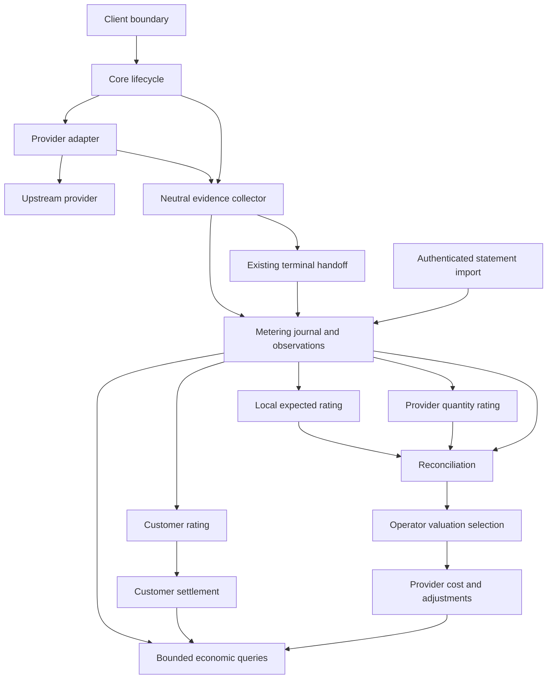
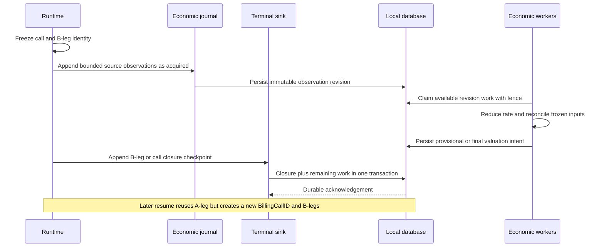

# Design Document

## Overview

Replace the financial path's single selected token/cost evidence with a versioned, component-oriented evidence and valuation model. Independently retain what the proxy measured, what its frozen tariff predicts, what the provider reported, and what a later statement claims. Request-scoped inference economics are B-leg-rooted; A-leg/session continuity and BillingCallID remain grouping and projection scopes rather than independent inference-usage authorities. Reconciliation compares those records; it does not destroy disagreement by choosing a winner.

This design extends the current metering journal, B2BUA terminal lifecycle, billing store and host injection. It does not build another executor, event bus, accounting database service, or price-discovery system. The reference implementation must be useful end to end before release, not merely contain unused extensibility interfaces.

**Baseline:** original discovery was pinned to `3da34d7875443355d65cb9d7df649555dfad3edb`; current B2BUA/resumability/multimodal assumptions were revalidated against `5a8174161a2d4d502ee55692b9c0121ae8c74800` on 2026-09-11. Paths marked **existing** were inspected in the source investigation. Paths marked **new** are proposed implementation locations, not claims about existing code. Full evidence and gap analysis are in `research.md`.

### Goals

Preserve independent evidence; store quantities and charges per component; support multimodal input/output and non-token units with exact arithmetic; root request-scoped inference usage in B-leg execution; independently rate customers from policy-selected B-leg usage plus explicitly separate commercial/service charges; reconcile provider discrepancies; roll up all attributable B-leg COGS; permit a separately compiled billing integration; migrate without duplicate debits or permanent parallel rating engines.

### Non-goals

No provider tariff acquisition/database project, new inference endpoints or providers, vendor-specific invoice parser catalog, tax engine, payment processor, invoice UI, automated dispute case management, rebranding, or repository split. Existing tariff data is an input. Generic statement import, corrections and their tests are included; proprietary importer implementations are not.

## Boundary Commitments

### This spec owns

Canonical evidence V2 and compatibility readers; provider normalization contracts; local measurement attachment; statement and allowance observation contracts; component-valued economics; reference rating and reconciliation; persistence, postings and query projections; safe host bindings; migration and all affected accounting producers and consumers.

### Out of boundary

Routing choice, failover policy, B2BUA identity authority, secure-session semantics, backend tokenizers themselves, prompt-cache residence policy, commercial price ingestion and the actual Open Core packaging split remain with their owners. This work consumes or exposes narrow ports to them.

### Allowed dependencies and changes

Use existing public `metering`, `economics`, `scope` and backend-plugin contracts. Core may consume public SDK types but never provider SDKs or concrete feature implementations. Bun and SQL remain in infrastructure. Ordinary `lipruntime.Options` stays non-money. A narrowly named **new `lipruntime.BuildWithBilling` entry point** is an explicit, reviewed extension to the current public composition surface: it accepts a separate typed binding and delegates to the same host construction as `Build`. This is necessary because the current monetary injection point is internal-only. Update the corresponding steering/architecture rule deliberately; do not pretend an external module can import `internal/infra/runtimebundle`.

### Revalidation triggers

Changes to canonical/sideband usage, terminal ownership, immutable request generations, connector ABI, provider profile compiler, pricing snapshot identity, SQL migrations, public host options, or #532 fast-path eligibility require the appropriate contract review. #429 naming changes require path re-inventory. #394 requires refreshed affected benchmarks, not a cyclic implementation dependency.

## Architecture

### Existing architecture and targeted defects

`metering.Quantity` and `metering.Fact` already supply extensible components, provenance and immutable source identity. The current aggregate uses `map[string]int64` keyed only by component. Its assumptions are too narrow for multiple units, qualifiers and source-separated evidence. The financial path independently collapses data into `FinalBillingEvidence`, which has six token counters and one cost. `fallbackOperatorCost` adds input/output and cache/reasoning rates; it does not encode the inclusion contract used by the generic metering layer. `RateProviderCost` selects provider money or fallback rating, and currently treats absence of accepted evidence as reconciled zero. `CallRatingResult` returns a single customer amount. These are changed, not wrapped with another competing financial engine.

Preserve `BillingCallID`, authoritative B-leg sequence, independent call/leg closure records, journal balancing, customer/provider worker separation, cheap credit screen, operational exposure admission and no retry after output. Preserve useful checkpoint and tokenizer seams. Do not revive the retired usage-append outbox or token-ledger money path.

### Pattern and boundary map



**Core owns lifecycle and evidence collection, not financial math during stream receive.** Backend adapters own wire-field meaning, not customer pricing. Metering owns neutral observations/reduction; billing owns rating/reconciliation policy and posting intent; infrastructure owns durable execution and SQL. Non-streaming still collects canonical streaming. Financial processing never requires raw prompts or output.

### Component summary

| Component | Owner | Responsibilities | Requirement groups |
|---|---|---|---|
| Evidence V2, decimal/unit/key contracts | public metering SDK | Source-separated immutable observations and exact measures | 1–3, 5, 9–11 |
| Collector and boundary measurement | core metering plus runtime attachment | Freeze identity, capture independent local data, terminal envelope | 4–6, 10, 14 |
| Provider normalizers | backend family or executable connector | Wire evidence, inclusion schemas, qualifiers, safe raw fields | 3, 5, 9, 16 |
| Valuation and tariff contracts | public economics SDK | Inputs, snapshots, charge lines, rating basis | 2, 7–8 |
| Rating/reconciliation/selection policy | existing core billing domain | Pure valuation, comparison and adjustment intent | 7–8, 12–14 |
| Journal and billing adapters | existing infrastructure stores | Append, projections, work queues, transactions, migrations | 10–14, 17 |
| Public monetary binding | SDK billing contracts plus runtime facade | External composition without internal imports | 14–15 |
| Query/control adapter | billing reports plus standard HTTP | Scoped economic evidence and discrepancy reporting | 6, 12, 16 |
| Contract and migration certification | existing testkit/archtest/QA | Deterministic tests, compatibility, performance and cutover | 17–18 |

### Technology stack

Use the Go toolchain pinned by the repository `go.mod`; standard JSON, `math/big` for bounded post-turn exact arithmetic, existing Bun drivers, existing gRPC/protobuf tooling, and the existing host lifecycle. No new broker, Redis, schema-registry server, reflection registry, or general-purpose billing DSL is required. Generators remain repository-owned and deterministic.

## File Structure Plan

| Existing owner or file | Required change |
|---|---|
| `pkg/lipsdk/metering/{quantity,fact,source_event,recorder,query}.go` | Keep V1 compatibility contracts readable; introduce V2 alongside them with one explicit conversion boundary, not ambiguous dual-value fields. |
| `internal/core/metering/aggregate/aggregate.go` | Upgrade effective reduction to complete component keys and separate observation streams; V1 adapter feeds the same tested reduction semantics. |
| `internal/core/metering/checkpoint/` | Reuse immutable correlation/scope capture; attach source-separated evidence and representation identity. |
| `internal/core/runtime/{attempt_usage_evidence,billing_leg,billing_collector,metering_egress,customer_evidence}.go` | Replace destructive billing evidence selection with neutral capture and V2 terminal references; preserve attempt ownership and terminal claims. |
| `internal/core/billing/{records,call_usage,rating,estimate,provider_cost,call_rating}.go` | Introduce versioned evidence references and line-level results; confine old token-only records/rating to explicit legacy handling. |
| `internal/core/billing/{call_post_usage_worker,call_provider_cost_worker}.go` | Durable independent work, revision-aware results and idempotent adjustment intent. |
| `internal/infra/metering/journalstore/` | V2 envelope storage, bounded component projections, replay checks and shared transaction writer. |
| `internal/infra/billingstore/` | V2 call/leg records, valuation/detail/reconciliation tables, fenced cutover and adjustment posting. |
| `internal/infra/billingcompose/{catalog,resolver}.go` | Adapt current tariff sources to generic rule snapshots; do not build a price acquisition service. |
| `internal/infra/billingadmission/` | Quote non-token offers and require a finite bound under strict policy. |
| `internal/infra/runtimebundle/billing_compose.go` | Reuse existing monetary composition with typed external adapter support and single ownership. |
| `pkg/lipruntime/build.go` | Factor only common assembly; `Build` remains unchanged in behavior and the new explicit binding delegates to that assembly. |
| `pkg/lipsdk/backendplugin/`, `api/backendplugin/v1/backend.proto`, host adapters | Add negotiated V2 economic sideband and finalization payloads; never hand-edit generated protobuf outputs. |
| `internal/plugins/backends/anthropic/`, `openairesponses/`, `openresponsescompat/`, `protocols/geminigenerate/`; `connectors/codex/` | First real producer certification families. Complete remaining discovered producers under Task 8. |
| `internal/standardplugins/featurehost/keepwarm.go`, `pkg/lipsdk/promptcache/accounting.go` | Use the same charge identity/provenance contract for maintenance; no synthetic foreground charge. |
| `internal/providerprofiles/` | Bind normalization/schema capability to family profiles rather than add provider-name switches in core. |
| `internal/core/billing/reports.go`, `internal/infra/billingstore/reports_call_explanation.go`, `pkg/lipsdk/controlplane/` | New economic-detail query model; preserve old summary APIs as labelled projections. |
| `internal/archtest/`, `internal/testkit/dbparity/`, `internal/qa/` | Guard ownership, complete identity keys, non-money stock behavior and database/connector certification. |

**New files inside those owners:** `metering/observation.go`, `metering/decimal.go`, `metering/component_key.go`, `metering/observation_compat.go`, `economics/valuation.go`, `economics/component_rating.go`, `billing/reconciliation.go`, `billing/cost_selection.go`, `billing/adjustment.go`, and focused tests. Names are proposed; their responsibilities are mandatory. A new public `pkg/lipsdk/billing` package contains only the minimal external host binding DTOs/ports, not the existing full internal store surface. Do not create new top-level core packages simply to avoid line budgets.

## Data Models

### D1. Orthogonal identities and views

Use these separate axes, never a single overloaded `source` or `cost` flag:

| Axis | Values or meaning |
|---|---|
| Perspective | operator, customer, technical |
| Subject | logical call, backend attempt, trusted submission, provider charge, resource interval, account window, statement line |
| Acquisition | local tokenizer, local transport measurement, local estimator, provider count API, provider response, provider header, provider finalizer, statement importer |
| Evidence origin | local, provider, statement; derived outputs reference their inputs instead of claiming a new measurement origin |
| Measurement semantics | delta, cumulative present-field snapshot, gauge, explicit replacement/correction |
| Quality | observed, estimated, unavailable, not applicable; provider-reported does not imply independently verified |
| Valuation basis | local_expected, provider_quantity_local, provider_reported, statement_reported, customer_policy, allocated_cost |
| State | evidence completeness; comparison status; posting status are separate fields |

`BillingCallID` is not an A-leg identifier. One A-leg/session may contain arbitrarily many calls over time, including calls created after an earlier provider or protocol `DONE`; one call may contain multiple B-legs; a B-leg may contain several provider charge events. `DONE`, EOF, terminal, or call-closure semantics seal only that execution scope and never prove the A-leg/session can no longer progress. Keep `RequestID`, `CallID`, `ALegID`, `BLegID`, `AttemptSeq`, `SubmissionID`, `ProviderAccountKey`, `ProviderRequestID`, `ProviderChargeID`, `ParentWorkID`, `ResourceID` and `PeriodID` separate. Adapter-supplied provider IDs are namespaced by provider account and endpoint family. The runtime owns client/tenant/call/B-leg attribution; an untrusted header cannot override it.

**Economic ownership invariant:** every request-scoped provider inference quantity or charge is attached to a B-leg (and, where useful, to a provider charge event beneath that B-leg). BillingCallID groups B-legs created by one invocation and provides admission/settlement coordination; A-leg/session provides continuity and aggregate reporting. Neither is an independent provider-usage source. Genuine non-request economics such as cache storage, reserved capacity, subscription/account-period fees or other shared resources retain their resource/account-period subject and may contribute to calls only through explicit conserved allocation.

For brokered providers, the direct upstream charge and a reported underlying inference cost are different economic layers; an underlying-cost detail is not an additional payable unless an explicit payer/coverage contract says so. Cost is recorded once for its economic owner. An attribution edge references that charge; an aggregate never becomes another additive leaf. A charge can be inclusive of children, or children can be additive, but not both in the same rollup. Shared allocations carry a policy/version and exact weights that sum to one, including an explicit unallocated remainder. A resource cost lacking reliable allocation stays resource-scoped.

### D2. Canonical evidence V2 and exact quantity

Introduce `metering.Observation` as the canonical V2 evidence DTO; keep `metering.Fact` as an explicit V1 compatibility DTO and nonfinancial authority projection. Both use the **existing metering journal family**, not independent authoritative stores. Every live financial consumer moves to V2. V1 projections must not be re-ingested as new independent observations.

Illustrative Go contract shape (field names are binding; signatures may use established repository error wrappers):

```go
type Decimal struct {
    Coefficient string `json:"coefficient"` // signed base-10 integer, canonical
    Scale       uint8  `json:"scale"`       // value = coefficient * 10^-scale
}
type EconomicDirection string
const (
    DirectionInput    EconomicDirection = "input"
    DirectionOutput   EconomicDirection = "output"
    DirectionResource EconomicDirection = "resource"
    DirectionAccount  EconomicDirection = "account"
)
type Dimension struct { Name, Value string }
type ComponentKey struct {
    Direction  EconomicDirection
    Component  string
    Unit       string
    SchemaID   string
    Dimensions []Dimension
}
type Measure struct {
    Key       ComponentKey
    Value     *Decimal // nil means absent, never implicit zero
    Quality   string
    MethodRef string
    Reason    string
}
type ChargeKind string
type CoverageRelation string
const (
    CoverageInclusive CoverageRelation = "inclusive"
    CoverageAdditive  CoverageRelation = "additive"
)
type ChargeRef struct {
    StoreID       string
    ObservationID string
    Revision      uint64
    ChargeItemID  string
}
type ChargeCoverageRef struct {
    Ref      ChargeRef
    Relation CoverageRelation
}
type ReportedCharge struct {
    ChargeItemID string
    Component    *ComponentKey // nil for a genuine provider aggregate
    Amount       *Decimal
    Currency     string
    Kind         ChargeKind // component, aggregate, surcharge, tax, adjustment, credit
    Covers       []ChargeCoverageRef
}
type Observation struct {
    Version       uint32
    ID            string
    SourceEventKey string
    Revision      uint64
    StreamID      string
    Sequence      uint64
    Origin        string
    Acquisition   string
    Authority     string
    Subject       SubjectRef
    Correlation   CorrelationV2
    Semantics     string
    ObservedAt    time.Time
    ReceivedAt    time.Time
    MappingRef    string
    Measures      []Measure
    Charges       []ReportedCharge
    Supersedes    []ObservationRef
    Evidence      []SafeEvidenceField
}
```

`SubjectRef` is a tagged union with subject kind and scoped identity fields from D1; validation rejects foreign combinations. `CorrelationV2` contains D1 lineage plus trusted tenant/store scope. `ObservationRef` identifies store, observation ID and revision plus payload hash. `ChargeRef` is likewise store-scoped and must resolve to the exact observation revision and charge item; bare provider-local charge IDs are never sufficient cross-record references. `SafeEvidenceField` has allowlisted header name or JSON path, exact numeric/string lexeme, original null/absence state and acquisition channel. No raw prompt/object blob field exists.

Charge coverage is a validated graph, not free-form metadata. `inclusive` means the referenced charge is already contained in the parent amount; `additive` means it remains separately payable in the same rollup. Before any valuation or COGS rollup, validation rejects self-reference and cycles, duplicate or contradictory relations for the same edge, cross-store references, a child being both inclusive and additive in one rollup, and ambiguous overlapping inclusive parents unless a separate explicit allocation record resolves the ownership. Shared allocation weights use exact rational/decimal values, include any explicit unallocated remainder, and must conserve exactly to one before attributed amounts become billable. Invalid coverage remains stored as conflicting/incomplete evidence but is not eligible for rating or posting.

Decimal constraints: at most 38 coefficient digits and scale 0–18; normalize insignificant fractional zeros and negative zero before hashing. Reject NaN/infinity, coercion through float64, exponent expansion beyond limits and unsupported precision. Token/count components require exact integers; fractional credits, seconds and resource products have explicit schema quanta. Parsing raw scientific notation is allowed only through bounded decimal parsing. Provider raw lexemes that cannot normalize safely remain bounded rejected evidence with a diagnostic, not a silently rounded usable amount.

Existing `economics.Money`/billing nano-money remains the ledger posting unit. Rating retains exact pre-round decimal/rational values and explicitly rounds at the configured line, call or period boundary into checked integer nano-units. No float arithmetic in evidence, rating, comparison or FX. Reuse current checked arithmetic where compatible. Arbitrary precision math is post-turn and operand-bounded; hot capture uses integer counters wherever exact.

Component key = economic direction + component + unit + schema + sorted unique dimensions. Direction is economically significant: `image/input/token` and `image/output/token`, or `audio/input/second` and `audio/output/second`, are different keys even when the physical unit matches. Reject contradictory direction/schema combinations, duplicate dimension names and duplicate measures for the same key in an observation. Standard bounded qualifiers include modality/media kind, cache lifetime, service tier, region, quality/resolution, frame rate, resource class and billing pool. Arbitrary customer text is not a qualifier. Namespaces permit future components without a SQL migration. The normalization schema defines aggregate/subset/partition/transform relationships; it is not inferred from component names.

### D3. Canonical token and non-token definitions

Required text-token meters include `input_token_uncached`, `cache_read_input_token`, `cache_write_input_token`, `output_token`, plus informational `input_token_total`, `total_token` and separately meaningful `reasoning_output_token`. Cache-write lifetime is a qualifier, so 5-minute and 1-hour writes do not collapse. Text-token names may retain their legacy semantic names, but V2 still records direction explicitly and validation rejects contradictory keys.

Multimodal economics are first-class rather than a generic afterthought:

| Direction | Component examples | Legitimate units/qualifiers | Boundary rule |
|---|---|---|---|
| input | image | image, token, tile, megapixel; detail/quality/resolution | Measure the representation actually sent to the provider after resize/re-encode. |
| output | image | image, token, megapixel; quality/resolution | Measure/provider-report generated media before customer-side conversion; separately observe delivered media if needed. |
| input | audio | token, millisecond/second, byte | Measure post-transcode provider-bound audio, not merely client upload duration. |
| output | audio | token, millisecond/second | Preserve generated duration/tokens before trim/transcode and customer-delivered form separately. |
| input | video | token, millisecond/second, frame, megapixel-second | Preserve provider-bound frame/rate/resolution semantics after transformation. |
| output | video | token, millisecond/second, frame, megapixel-second | Preserve generated duration/frame/quality semantics before downstream transformation. |
| input | file/document | page, byte, token, document | Provider-family mapping states whether billing follows raw bytes, parsed pages/tokens, or another unit. |
| resource | provider tool/compute/storage | request/query, second, byte-second, token-second | Do not coerce resource economics into media or text-token usage. |

A provider may report one or several of these units for the same media object. They coexist when economically meaningful; conversion between tokens, seconds, pixels, frames, bytes, pages or counts requires an explicit versioned schema/rating rule and is never inferred merely to make unlike providers look uniform. Requests, submissions, tool calls, provider credits and allowance gauges likewise have separate units and schemas.

For an inclusive input schema: `uncached = input_total - cache_read - cache_write` **only when the complete declared partition is known**. For Anthropic's documented separate counters, `input_tokens` is the uncached component; total input is derived by adding cache fields when present. For an OpenAI-compatible cached-subset schema, cached input is subtracted once; a provider with no cache-write billing dimension declares it not applicable, not a fabricated reported zero. Missing fields stay missing.

Output may include reasoning; reasoning is informational under that tariff unless the schema and rule explicitly split output into disjoint visible/reasoning components. Cached audio can intersect two breakdown axes; if the intersection is unavailable, do not invent a cross-product. A rule requiring unavailable intersections returns partial. The old `input + cache + reasoning` fallback is not a valid generic formula.

### D4. Valuations and charge lines

`economics.Valuation` has ID, version, perspective, basis, subject, complete input observation references, rater/version, tariff snapshot/hash, policy snapshot/hash, qualifier snapshot, line items, aggregate totals by currency, coverage/completeness and creation time. A line has a unique rule/item identity, full meter key or fixed-fee identity, quantity and unit, unit price or rate numerator/denominator, exact amount, rounded amount, rounding scope, included-unit status, source and adjustment links.

Persist four operator views separately:

- **E:** frozen operator tariff applied to independent local measurements, with estimated/unavailable status as necessary.
- **Q:** the same appropriate frozen tariff applied to provider quantities. This is locally calculated, not a provider monetary claim.
- **P:** actual provider-reported charges, retaining aggregate-only reporting where applicable.
- **S:** later statement charges at the statement's real granularity.

Customer **R** uses the independent frozen customer contract. Local subscription amortization is another `allocated_cost` valuation and never masquerades as P. Native provider amount and optional converted reporting amount are distinct, linked by a frozen FX reference; absence of FX yields separate currency totals and pending financial conversion, not a default rate of one.

Rate snapshots bind provider/model version, requested/effective service tier, region, endpoint/batch mode and relevant qualifiers. Freeze intent at admission/attempt open; if actual provider tier differs, preserve the intended quote and create a distinct effective-context valuation. Historical re-rating creates a new valuation version; it does not change E retroactively. Snapshot IDs alone are insufficient unless immutable content or a content-addressed durable reference remains resolvable.

### D5. Physical storage

Extend existing stores using additive migrations first. Monetary mode uses the same logical database/transaction manager for authoritative metering evidence, current call/leg closure and local posting work. `ComposeBilling` validates this arrangement; no assumed cross-database atomic transaction. A deployment needing a remote commercial ledger must acknowledge the local durable envelope first and consume it idempotently through the external port.

| Table/family | Canonical content and indexes |
|---|---|
| Existing `metering_facts` | Versioned V1/V2 envelope; existing store/stream/source identity plus V2 subject/origin/provider account/time search columns. Unique source event + revision within store. Preserve old rows and fingerprints. |
| New `metering_components` | Rebuildable per-observation measure/charge projections, full key hash **and canonical key**, exact coefficient/scale, money currency and presence. FK to canonical observation within the same DB; index store + subject + component key. |
| Existing `usage_call_records`, `usage_leg_records` | V2 closure payload and immutable evidence references, explicit format/fingerprint version, authoritative attempt sequence, trusted payer and lineage. Legacy payload remains readable. |
| New `billing_valuations`, `billing_valuation_lines` | Immutable valuation envelope plus transactionally derived line projection; unique input-set hash + rater/policy/rate version + basis. |
| New `billing_reconciliations` | Comparison input hashes, scope, policy version, component deltas, totals, coverage, diagnostic code and result revision. |
| Existing financial journals/operation snapshots | Continue balanced postings; add valuation/adjustment references and unique revision-aware operation source keys. |
| New `billing_cost_heads` | Rebuildable current selected/posted valuation reference and revision for each economic charge; compare-and-swap for adjustments. |
| New `billing_unit_operations` and balances | Optional customer-owned credit/allowance postings keyed by customer, unit/pool and period; never supplier utilization gauges. Extend existing operational exposure rather than add another runtime admission authority. |
| Existing provider/customer work | Add evidence/valuation revision cursor, lease/claim fencing and retry reason. Separate supplier work from customer account locks. |

Canonical JSON stores decimal coefficients as strings. SQL must not sum coefficient strings, interpret absent as zero, or compare decimal values lexically. Use the domain reducer for exact rollups; bounded numeric projection is permitted only with a proved range/scale. Monetary postings remain checked integer nanos. Keys, uniqueness and FK constraints are store-scoped. A hash is an accelerator, not a substitute for canonical-key comparison.

For immutable record + component projection + downstream work insertion, use one local transaction. Expose an infrastructure transaction writer from `journalstore` so `billingstore` can compose it; domain contracts contain no `bun.Tx`. Optional observability projections can be eventually consistent and rebuilt, but financial acknowledgement cannot depend on an uncommitted observer. Existing best-effort `MeteringRecorder` logging is not upgraded by documentation into guaranteed monetary durability.

Tables supporting PostgreSQL must preserve SQLite semantics and transaction-pooler safety: no session locks, temporary tables or session-pinned prepared state. Long-lived pool ownership remains Host-owned. Add the extended family to existing database-parity contracts rather than introducing an unrelated migration runner.

## Components and Interfaces

### C1. Evidence collector and normalization

Public metering contracts define immutable DTOs, component schemas, validation and `ObservationSink.Append(context.Context, Observation) error`. A terminal envelope writer groups observations and neutral call/attempt closure. Normalizer implementations live at the adapter or connector edge and are selected once per immutable provider profile/generation. They receive provider-local decoded fields and produce the versioned neutral observation/sideband DTOs; no generic public raw-provider normalizer interface is introduced and no provider-shaped parameter object reaches core. External connectors participate by emitting the same negotiated neutral DTOs through the backend-plugin ABI.

The collector is request/attempt-owned; it holds local and remote observations in separate streams. Source/event identity is assigned when first acquired, not generated again at finalization. Include request-scoped provider charge identity plus event revision. A finalizer matching earlier evidence references it; it does not append another billable charge solely because the transport channel differs.

**Exact hook map:**

| Hook | Attachment and rule |
|---|---|
| Frontend ingress | After authenticated identity/current-turn classification, before request mutation; freeze customer measurement/submission context. Local commands can remain non-inference traffic. |
| Final backend payload | After provider payload construction and all applicable rewrites, before the first upstream body byte. An adapter returns neutral measurement summaries for the exact text/media/document representation, including post-resize/transcode properties where billing-relevant. Canonical-call token/media estimates remain estimates if adapters add or transform invisible fields. |
| Upstream headers and status | Adapter captures safe charge/usage identifiers and account gauges; transport-attempted does not imply provider acceptance. |
| Backend stream ingress | Measure/provider-observe text and generated media before customer transforms such as filter, compression, transcode, trim, resize or projection; keep provider-side B-leg output economics, independent local output measurement and customer-delivered observation separate. |
| Sideband drain | Extend `UsageEvidenceSource`/backend-plugin accounting drain with negotiated V2 neutral payload; drain on open failure, normal receive, terminal, cancel and close. Never expose sideband as client content. |
| Finalization | Replace destructive `mergeStreamCostOntoLeg` behavior for V2 with append/revision correlation. Retain all source records and explicit conflicts. |
| Attempt terminal | Reuse `claimBillingLegRecord` and the captured attempt owner; produce exactly one closure with evidence references. Never look up the new current attempt to attribute late callbacks. |
| Call terminal | Preserve expected B-leg set/sequence and customer boundary evidence; seal the call independently of final provider cost availability. |
| Maintenance/compaction | Keep workload/parent lineage and original resource or auxiliary charge scope; route through the same observation contract, not a synthetic successful foreground request. |
| Resource lifecycle | Reuse the owning cache/resource maintenance lifecycle to emit create, renewal, expiry/delete and bounded interval observations. Intervals carry start/end, resource/payer and stable interval identity; overlapping coverage cannot be added twice. Modelled residence cost remains estimated if actual provider eviction or billable lifetime is unknown. No financial pricing in maintenance transport callbacks. |
| Late evidence/import | Authenticate and append by provider/account/event revision to the journal; trigger revision-aware rating/reconciliation work without reopening inference. |

Output tokenization must be invariant to chunking. Use an available incremental tokenizer with documented equivalence, or one bounded final count over the existing replay/measurement spool; do not introduce an unbounded second response copy. If the representation cannot be reconstructed exactly, preserve the estimator method and partial status. No assumption that provider-hidden reasoning or actual cache hits can be independently known.

### C2. Connector and producer coverage

Add an optional evidence V2 protobuf message to host-only accounting frames and finalization response; retain old field numbers and V1 decoding. Declare a dedicated negotiated feature flag and format version. Validate frame size/field count and JSON/protobuf conversion in both directions. New fields are not silently meaningful to old hosts: strict requests require negotiated support; observation-only mode may explicitly run with partial coverage. Generated files are produced with repository targets.

The first mandatory real families are Anthropic caching/lifetime semantics; OpenAI/OpenResponses cached and reasoning subsets with genuine reported cost only where supplied; Gemini modality/cache/storage-related evidence when actually available; Codex request usage plus **account-window gauges**. Remaining existing accounting producers are migrated by family using the Task 1 inventory, including hosted compatibility helpers and executable connectors. Every existing producer gets one explicit disposition: V2 certified, lossless V1-to-V2 bridge, or unsupported advanced evidence with negotiated limits. No provider name is guessed into the generic kernel.

Account-window snapshots use origin provider, semantics gauge, subject provider account + pool + window/reset. Multiple Codex windows remain separate. A request may reference the snapshot observed during its response, but that relationship does not prove request debit. Exact per-request points require a debit ID/value from the provider. Snapshot differencing is at most a separately labelled estimate with exclusivity/epoch assumptions, never the default billing source.

### C3. Rating and independent retail offers

Provide narrow public economics ports. Signatures below define substitution seams, not implementation code:

```go
type Rater interface {
    Rate(ctx context.Context, in RatingInput) (Valuation, error)
}
type Quoter interface {
    Quote(ctx context.Context, in QuoteInput) (ExposureQuote, error)
}
type StatementImporter interface {
    Import(ctx context.Context, in StatementBatch) (ImportResult, error)
}
type ReconciliationReader interface {
    Query(ctx context.Context, in ReconciliationQuery) (ReconciliationPage, error)
}
```

`RatingInput` includes explicit perspective/basis/subject, immutable observation set, scope, effective qualifiers and snapshot refs; it cannot request implicit use of the other plane. `QuoteInput` includes finite candidate/work limits and the same commercial policy version. `ExposureQuote` contains amount/credit bounds, assumptions and evidence capability requirements. `StatementBatch` contains provider account, statement/line/revision IDs, original subject and validated observations; raw provider parsing happens before this port. `ImportResult` returns accepted, replayed, unmatched and rejected IDs without executing model calls.

The default rater is a small deterministic rule evaluator over typed snapshots: linear quantity price, once-per-specified-scope fixed fee, ceiling-to-block quantity, minimum charge, conditional rule selection and ordered all-units or graduated tiers. Declare whether threshold selection uses the entire request context or only billable uncached tokens. Conflict/overlap validation occurs at snapshot publication. An aggregate observation cannot be added alongside its priced children unless a named surcharge explicitly requires that. Monthly shared tiers/minimums require a period-scoped valuation job or custom rater; do not approximate them by repeating the monthly rule per B-leg.

Retail inference policy declares a **B-leg selection policy** plus component rating rules. Request-scoped inference quantities always come from normalized B-leg observations; the policy decides which B-legs are customer-billable (for example surfaced/winner only, selected attempts, or explicitly all attempts). Supplier COGS remains all attributable operator-payable B-leg/resource economics regardless of retail selection. Customer-boundary measurements may be priced only as separately declared proxy/service charges (for example upload/download/transformation service), not as a competing inference-usage truth. Cost pass-through is an explicit alternative commercial basis. Fixed fee per call or submission runs once at that scope, never inside the selected-leg loop. Failed/race-loser and local-command inclusion are explicit offer rules. Existing customer policies are migrated with their previous scope and semantics; **do not silently change historic retail pricing to the new default**.

Submission identity comes from trusted frontend current-turn/continuation authority or a supported harness integration. Repeated historical user messages are not new submissions. A backend agent loop may contain many tool turns; it does not thereby create many human submissions. Unreliable attribution disables prompt-priced strict offers, not all inference. This work supplies the identity contract and reference adapter coverage, not a universal natural-language classifier.

Customer credit plans use their own account/pool/period. A host may provision an included allowance and return credit debits in the customer posting plan. Reservations and final unit debits use the same existing exposure lifecycle and a transactionally authoritative unit balance, not supplier gauges. Default reference support is explicit fixed/usage credit charging and allowance consumption; automated subscription sales/renewal are not included. Monetary overage that depends on allowance availability must quote a safe upper bound and evaluate current entitlement atomically at settlement or use the host's explicit pre-reserved entitlement. No stale read-then-spend of included credits.

### C4. Reconciliation and selected operator cost

Reconciliation is pure over compatible frozen input sets. Group by economic subject/charge, account/payer, coverage, currency, schema, full meter key and effective measurement/price context. Account gauges and period statements are never compared directly with request debits.

For compatible scalar coverage:

```text
quantity_delta = provider_quantity - local_quantity
E = local tariff(local independently measured quantities)
Q = local tariff(provider quantities)
metering_cost_effect = Q - E
reported_price_residual = P - Q
end_to_end_cost_delta = P - E
```

Do not compute a missing term as zero. A residual can identify a pricing/context mismatch, but without provider rate detail it is not proof of a tariff error. Emit `suspected_pricing_difference` rather than a definitive causal label. Differences involving estimates carry confidence/coverage labels. With no independent cache evidence, cache-classification reconciliation is partial; total input may still be comparable.

Tolerance for a comparable expected value E and reported value P is `abs(P-E) <= max(absolute_limit, relative_limit * abs(E))`, all exact arithmetic. When E is zero, only the absolute limit applies; relative difference is absent with reason zero denominator. Policies define scope, unit, currency and precision. Keep signed delta and absolute delta, including those within tolerance. Aggregate gross absolute discrepancy and affected count so offsetting errors do not hide systematic problems.

Comparison statuses: `matched`, `within_tolerance`, `discrepant`, `partial`, `incomparable`, `missing_local`, `missing_provider`, `pending_statement`, `conflict`. These are separate from `cost_selected` and `posted`. An operator selection policy may choose P, S or Q for a provisional/final COGS view; all alternatives remain stored. Missing P can legitimately lead to estimated Q, but never to a claim of independent reconciliation. No accepted provider evidence plus an attempted/possibly executed request is **unknown**, not reconciled zero. Proven never-started/not-billable work may be known zero with its basis.

Queries report known subtotal, count/IDs of missing charges, selected-basis mix and completeness per currency. Margin is complete only if revenue and COGS coverage/currency are complete. Do not report an unknown cost as a positive margin. Supplier credential payer classification separates operator-payable, customer-BYOK and unallocated payer.

### C5. Statement and adjustment handling

The generic authenticated importer accepts normalized records and performs identity validation, replay/conflict detection and exact-granularity matching. Request charge ID match is preferred; only complete compatible account/period/SKU coverage permits aggregate matching. Missing join keys produce an unmatched record, not timestamp-nearest attribution. Batch/statement coverage can reference a set of observed charges without asserting a per-request allocation.

A late provider correction, statement or revised selection creates a new valuation and reconciliation result. Under a lock or compare-and-swap of `billing_cost_heads`, first validate monetary comparability. Calculate **new selected amount minus previously posted selected amount** only when both selected valuations use the same native currency, or when both are mapped through the same explicit frozen FX conversion basis whose identity and exact rate material are retained. If currencies differ without such a frozen conversion, leave the correction pending or reject it as incomparable and perform **no** valuation-link insertion, journal delta, or head transition. For a valid comparison, insert the valuation link, balanced delta journal and head transition atomically. Unique operation key includes economic charge identity, old/new selected valuation identities, currency or frozen FX basis, and adjustment revision. Replay returns the existing operation; a different payload under the same key conflicts. Negative deltas reverse the applicable COGS/payable entries using existing debit/credit semantics rather than inserting an invalid negative gross charge.

A statement that covers several already-posted charges compares against their sum and posts only the aggregate adjustment once. No duplicate per-B-leg posting of the entire statement total. Customer settlement never waits for unrelated supplier statements. Cost-pass-through offers can elect a provisional amount and later permitted adjustment; the policy must freeze that choice. Default independent customer offers receive no automatic upstream-driven rebill.

### C6. Lifecycle and durable work

Capture is bounded measurement/evidence work, not stream-time financial mutation. A-leg/session has no accounting-final state: it is a resumable continuity container and may receive a new BillingCallID and new B-legs after any prior response/DONE marker. Existing B-leg/attempt and BillingCallID closure remain exactly-once checkpoints for their own execution scope only. Economic observations may be appended/reduced while a B-leg is active and may also arrive later by revision; neither case reopens an earlier execution checkpoint or depends on the parent session becoming impossible to resume.



Use the existing terminal handoff and operational exposure record for execution closure/recovery; do not recreate a second terminal usage outbox. Incremental V2 observations use the canonical metering/economic journal path and revision identity, not a parallel monetary writer. Financial rating/posting still occurs through bounded host-owned workers rather than directly inside receive callbacks. A failure to append after output cannot be repaired by generating another provider completion. Mark host accounting health degraded, stop new strict monetary admissions when required durability is unavailable, retain recoverable intent, and let recovery mark the affected B-leg incomplete until reconciled. A crash cannot promise to recover provider evidence never received; the design preserves the uncertainty and supports later provider import.

Economic workers use bounded batches and durable revision cursors, retry scheduling and claim leases/fences. Newly durable observations may be reduced and used for provisional economics while a B-leg is active, but authoritative monetary settlement occurs only at the applicable frozen B-leg/call/commercial checkpoint required by policy; **it never waits for A-leg/session finality**. Call closure is therefore a settlement coordination checkpoint, not an inference-usage source and not a declaration that the session cannot resume. Processing can be retried, but business effects are idempotent database transactions. Rating/reconciliation calculation does not hold customer balance locks. Supplier jobs do not mutate customer balances. Store arbitrary correction histories durably, not in an ever-growing per-session map.

### C7. Public binding and Open Core boundary

The current `ComposeBilling` uses internal types and therefore is not itself an external-module plugin API. Publish minimal binding DTOs/ports in `pkg/lipsdk/billing`, expressed only through public scope/metering/economics types. Required binding members cover cheap credit screen, quote/exposure admit, terminal evidence handoff, and explicit lifecycle ownership. The provider-neutral `Observation`/connector-sideband DTOs and the narrow public `Rater`, `Quoter`, `StatementImporter`, and `ReconciliationReader` contracts are the supported external economics seams; provider-shaped normalization remains inside the supplying adapter/connector. Binding-created post-turn workers and custom raters are owned by the binding and registered once with Host cleanup; supplied borrowed stores are not implicitly closed.

New signature:

```go
func BuildWithBilling(ctx context.Context, opts Options,
    binding billing.Binding) (*Runtime, error)
```

`Build` and `BuildWithBilling` use one private common builder and exactly one `runtimebundle.BuildHost`. The latter validates the complete binding and translates its ports to existing `ProductionOptions` adapters. It does not expose SQL handles, the executor or all internal billing interfaces. Stock `Build` and `cmd/lipstd` never infer billing from YAML. No field is added to ordinary public `Options` for accounts, money, billing stores or customer tariffs.

The binding contract includes `ID`, `Version`, `Validate`, named typed admission/terminal ports and owned-resource registration. Quote/admission and terminal methods operate on public immutable request/attempt DTOs, `ExposureQuote`, and `TerminalEnvelope`; no opaque `any` payload/service map. The repository's own billing composition implements that same boundary. Reject typed-nil members and multiple monetary bindings. Existing non-money authority registrations may coexist for distinct quotas, but must not create a second monetary authority or consume the same customer entitlement twice.

Certify with a separate test module importing only public packages. Its custom rater charges per trusted submission/credit independent of provider token price, passes through a synthetic non-token component, and preserves one host/reload/cleanup path. This is a narrowly necessary pre-split contract extension, not the actual movement of billing implementations to a proprietary repository.

## Error Handling, Security and Performance

Typed errors include invalid decimal/unit/schema, identity conflict, unsupported evidence capability, missing measurement, missing immutable tariff, incomparable coverage, ambiguous statement, incomplete cost, persistence unavailable, stale worker fence and posting conflict. Invalid raw evidence is quarantined as bounded safe diagnostics; it does not become a successful zero. Strict price/capability failures occur before provider execution. Post-output faults preserve terminal semantics and cannot trigger failover.

Defaults: at most 128 component entries per observation, 16 dimensions per key, 64 bytes per dimension name, 256 bytes per value, 512 bytes per external identity, 64 KiB normalized observation, 64 KiB safe raw economic fields per observation, 1,024 observations per attempt and 1 MiB retained attempt accounting metadata. These are contract bounds, not permission to allocate eagerly. Actual limits are validated against negotiated connector frame budgets; lower transport limits prevail. Exceeding bounds retains a bounded truncated/incomplete marker and prevents the affected result being represented as complete. Required strict capabilities are checked before execution where predictable; unexpected overflow terminates capture safely and degrades accounting health, never retries inference.

Canonical numeric evidence retains exact lexemes and sanitized paths; raw transport body retention is not required. A digest of sanitized evidence must be labelled as such. Secrets, cookies, prompts, tool text and generated output never enter financial payloads. Tenant-scope query/import authorization is mandatory; account/charge IDs are data fields, never metric labels. Retention deletes optional raw attachments under policy, not sealed financial facts or required adjustment linkage. Use existing retention ownership; immutable triggers must not be bypassed for casual cleanup.

No per-token SQL, no per-request unbounded goroutines, no provider-name switches in core, and no response-size-proportional extra copies for accounting. Disabled-path certification requires zero additional allocations and zero additional I/O in the accounting-disabled focused benchmark, with latency statistically consistent across repeated samples. Enabled capture benchmarks record allocations, bounded memory at size limits, terminal transaction count and worker throughput. Fix material regressions; do not raise existing test-cost/core-line budgets merely to make this spec pass. Architectural budget changes require explicit evidence of added necessary behavior and deletion of superseded paths.

## Migration Strategy

```mermaid
flowchart LR
    Baseline[Characterize baseline] --> Contracts[V2 contracts and readers]
    Contracts --> Storage[Additive storage]
    Storage --> Capture[Capture and shadow rating]
    Capture --> Compare[Compare and certify]
    Compare --> Fence[Durable writer fence]
    Fence --> Active[Activate V2 postings]
    Active --> Retire[Retire live legacy paths]
```



1. Pin starting SHA and collect all producers/consumers, archive status, schema/fingerprint versions and benchmark fixtures. Inventory is revalidation, not permission to redesign requirements.
2. Add V2 contracts, canonical serializers and legacy readers. Keep existing fingerprint bytes for old rows. V2 fingerprints include explicit format/version, subject, origin, source/revision, full key, exact values, safe evidence and input refs; sort only semantically unordered sets.
3. Add tables/columns/indexes/constraints and replay fixtures. Existing scalar pricing snapshots map into named **legacy semantics** rules; don't claim this fixes historical pricing retroactively. Existing old evidence cannot be split into independent local/provider values unless provenance proves it.
4. Capture V2 and run valuation/reconciliation shadow mode with posting disabled. V1 is the only monetary writer. Observations/valuations are stored once under stable IDs; compatibility reports are projections only.
5. Correct verified current arithmetic/evidence defects using explicit new policy/format versions, not rewriting old tariffs or charges. Compare semantic expectations, not mandatory equality to known faulty old results.
6. Cut over per configured store/account deployment boundary using durable epoch and worker fencing. Stop old claims, drain or explicitly classify in-flight V1 calls, pin their rating owner, then admit V2 calls. One logical charge/adjustment has one writer. New-format calls cannot be settled by old workers.
7. Roll back capture before cutover safely. After V2 postings, roll back only to a build supporting those formats/epochs; otherwise quiesce strict admissions and use compatible recovery. Do not direct an old binary at new-format postings.
8. Delete V1 live financial producers, fallback selectors and redundant conversions. Retain only historical readers and required one-way protocol/nonfinancial authority projections. Migrate all existing supported producer families or explicitly expose negotiated unsupported coverage. Archive only after all task evidence is recorded.

## Additional Contract Details

### Identity, reduction and economic authority

The canonical source-event identity encoder uses version + trusted store/account scope + origin/acquisition producer + subject + source stream + source event identifier; revision is a separate uniqueness member. Provider account IDs are opaque safe identifiers, never credentials. Preserve provider-supplied sequence/revision when available. Otherwise assign a stable host receipt ordinal within the captured attempt stream and retain it through durable replay. Never deduplicate by quantity equality alone.

Each observation is homogeneous in source authority. Add `Authority` to the observation envelope with values `observed_claim`, `estimated`, `verified_statement` or `unavailable`; importing a provider statement does not make it verified automatically. Verification authority is granted by authenticated importer policy and retained provenance. Do not upgrade local quantity authority when attaching provider money. If quantity and money came from different acquisitions, split observations and link them.

Normal observations require nonnegative quantities/charges; negative values are legal only for explicit correction/credit semantics. Gauge range belongs to its schema; do not silently clamp a provider value. Corrections cannot supersede another tenant, subject or origin. Supersession references must exist or remain explicitly pending; cycles and self-references are errors. A full replacement replaces its declared source snapshot coverage; a present-field correction leaves other keys unchanged. Duplicate event identity with different payload is a conflict even within one batch. Conflicting cumulative observations without reliable ordering remain conflicting; neither maximum value nor last database arrival is a valid universal truth rule.

Canonical serializers sort only unordered sets (dimensions, coverage refs); source/event sequence is semantic. V2 fingerprint preimages include the explicit version and all economically significant identity, value, provenance and coverage fields. Provider raw lexemes are preserved in evidence; their normalized numeric value controls math. Late receipt timestamp is not permitted to change an existing source event's identity on replay.

Exact rating intermediates use reduced rational numerator/denominator where decimal expansion would exceed evidence scale. Bound each intermediate numerator/denominator to 128 digits and denominator greater than zero. Crossing limits or integer-nano overflow yields a typed error. Persist the exact rational pre-round result, not a silently truncated decimal. Canonical decimals remain bounded to the D2 evidence contract. Rounding records identify line/call/period scope; sum-of-rounded-lines and round-of-total are different policy choices and must never be interchanged during replay.

### Public binding port map

| Binding member | Contract input/output | Maps to existing internal responsibility |
|---|---|---|
| `CreditScreen` | Trusted customer scope, account reference and policy version -> allow/deny/degraded result | Cheap pre-route credit gate; no new financial posting |
| `ExposureAdmission` | Frozen quote, call identity, finite execution limits and unit reservations -> admitted handle or typed rejection | Existing atomic exposure admission and recovery intent |
| `Quote` | Public `QuoteInput` -> bounded `ExposureQuote` with requirement capabilities | Existing admission quote adapter; selected custom customer offer |
| `TerminalUsage` | Public `TerminalEnvelope` -> durable acknowledgement or typed failure | Existing terminal sink; never a best-effort observer |
| `Lifecycle` | Explicit owned-resource registrations with start/close callbacks and identity | Existing Host process ownership and generation retirement |

`TerminalEnvelope` contains format version, store/customer scope, call/attempt closure identities/outcomes, authoritative attempt sequence, frozen rate/policy references, neutral V2 observations, parent/workload coverage and payload hash. It contains no SQL driver, executor pointer, request body or mutable service map. It can be persisted by a reference local binding or consumed by an external binding with an idempotent durable acknowledgement. Public rater and import ports remain separate from the runtime binding; workers use them after terminal persistence. Resource start errors unwind through the same Host cleanup path. No custom binding can turn a fail-open diagnostic callback into a monetary acknowledgement.

An upper exposure ceiling is valid only when it bounds the selected customer's contractual liability under the frozen offer, or is a documented conservative bound on actually enforceable work. A configuration number is not by itself proof of a bound on an uninterruptible provider job. Provider COGS can exceed customer liability; preserve that difference. Strict offers with no defensible bound are rejected, while independent fixed-price customer offers can still be bounded without knowing final supplier cost.

### Operator query and import contract

Use the existing configured, protected billing reports mount; the following are **new relative routes** under `ReportsPath`, not assumptions about current endpoints:

| Method and relative route | Data and access |
|---|---|
| `GET /calls/{call_id}/economics` | Scoped source-separated component evidence, valuations and adjustments |
| `GET /a-legs/{a_leg_id}/economics` | Per-currency known subtotal, completeness, payer and contribution lineage |
| `GET /reconciliations` | Required selective scope/time/subject filter, stable cursor, maximum 500 results |
| `GET /provider-accounts/{account_id}/allowance-observations` | Provider account-window history, never inferred request invoices |
| `GET /statement-lines` | Scoped matched/unmatched statement and revision references |
| `POST /statement-observations` | Optional host-enabled import-only permission, bounded normalized batch and idempotency key |

The existing authorization mechanism must bind tenant/account scope before service invocation. Ordinary customer inference credentials do not grant supplier-economic query or import access. Unknown/malformed scope returns a bounded 4xx; duplicate identical imports return replay results, while changed content under an existing identity returns conflict. Imported payloads cannot choose a different trusted tenant or bypass matching. Pagination/filter validation is enforced at both service and SQL boundaries. Query DTOs carry schema/version and exact values as strings.

For component projection rows, include `item_kind` (measure or reported charge), source observation ref, stable item identifier, full canonical component key where present, value/presence, charge coverage and currency. Aggregate reported charges have their own item identity and no invented component key. Rebuild by deterministic replay and compare canonical key bytes as well as any index hash. When canonical metering and monetary storage are configured separately, strict integrated billing refuses that unsupported transactional arrangement rather than silently weakening acknowledgement.

## Testing Strategy and Acceptance Vectors

Reference tests are deterministic; all prices below are synthetic test fixtures, not provider tariffs.

| Vector | Required outcome |
|---|---|
| Inclusive input total 1,000; read 600; write 100; output 200. Rates per token 0.01/0.001/0.02/0.03 | Uncached 300; amounts 3 + 0.6 + 2 + 6 = **11.6**. No additional input-total charge. |
| Anthropic-style input 300; read 600; write 100 | Same normalized partition; do not subtract caches from 300. |
| Output 200 includes reasoning 50, same tariff | Output billed once at 200, not 250. A disjoint differing-reasoning tariff requires an explicit visible-output derivation. |
| Provider reports quantity but no money | Q can exist; P is absent. E exists only from independent local evidence. |
| Provider reports aggregate 12 but only partial per-component money | Store aggregate 12 and partial lines; no invented allocation or sum of 12 plus its included lines. |
| Local 100 tokens, remote 110, common rate 0.01, remote money 1.32 | E=1, Q=1.1, quantity-cost effect=0.1, residual=0.22, total difference=0.32. |
| Provider reports gauge 12.5 then 13.0 percent while concurrent calls run | Two account-window observations; no asserted 0.5-percent debit for either call. |
| Known cost 3 for failed attempt, 5 for winner, 2 for race loser | Call COGS=10; customer charge follows its offer independently. An additional missing cost makes 10 a partial subtotal. |
| Replayed event, same identity different payload, reordered delivery | Replay no-op; conflict rejected; correct declared sequence/revision replay deterministic. |
| Provider COGS posted 10, later authoritative selected value 8 | Append balanced -2 adjustment; re-import has zero additional effect. |
| Shared resource 10 with allocation weights 0.6 and 0.4 | Two attributed views 6 and 4; original cost posted once. Parent inclusive aggregate not added again. |
| One submission, three tool-continuation calls, one transport retry | One submission fee; provider usage remains separately attributable per actual attempt. |
| 0.125 provider credits and 1.250 seconds | Exact round-trip and rating; no conversion to tokens or currency without an explicit rule. |
| Never-started versus attempted with missing usage | First can be known zero by outcome proof; second remains unknown. |
| Account A USD and account B EUR; no FX | Separate totals; no single-currency complete margin. |
| Crash between canonical append/projection/work insertion; stale worker after cutover | Atomic rollback or fully committed envelope; stale writer fenced; no duplicate posting. |
| Local tokenizer result vs provider count API | Distinct acquisition provenance; no false independent match. |
| More than one source measurement channel, partial snapshots and late resets | Component/source streams stay isolated; gauge resets are not negative usage refunds. |
| 4K client image resized to 1024px before provider input | Customer-boundary and provider-bound observations differ; provider inference rating uses the B-leg/provider-bound image quantity and qualifiers. |
| Provider returns 12s audio, proxy trims/transcodes to 10s delivered audio | Supplier/output evidence preserves provider-side 12s or reported tokens; customer-delivered 10s is a separate service observation, not a replacement. |
| Mixed text + image + audio request and image output | Direction/modality/unit keys remain disjoint; no text-token coercion or input/output collision; each tariff line rates only compatible components. |
| Response reaches DONE, same A-leg resumes later | Earlier BillingCallID/B-legs remain sealed and posted; resume creates a new BillingCallID/B-legs, with A-leg total increasing only as a projection. |
| Call has failed retry + race loser + surfaced winner | Operator COGS includes all payable B-legs; ordinary retail inference usage includes only B-legs selected by the frozen customer policy. |

Unit tests cover decimal/schema/normalization/reduction/rating/reconciliation. Contract tests cover public external-module binding, connector V2 negotiation, provider-family field mapping and existing authority projections. Integration tests cover complete terminal-to-storage-to-valuation-to-posting-to-report flow and all-leg/auxiliary lineage. Database tests use `dbparity.DefaultCatalog()` and canonical commands. Race tests cover late callbacks, parallel losers, dedupe, epoch changes and cleanup. Performance tests compare frozen baseline and bounded enabled/disabled capture; use Windows `make test-cost` evidence for test infrastructure impact.

## Requirements Traceability

Every numeric acceptance criterion is assigned to the design sections below and to one or more leaf tasks. Groups contain six criteria each; the table explicitly lists each ID to support automated coverage checks.

| Requirement IDs | Summary | Components and interfaces | Flows and tests |
|---|---|---|---|
| 1.1, 1.2, 1.3, 1.4, 1.5, 1.6 | Independent economic evidence | D1, D4; C1, C4 | Source-separated capture and E/Q/P/S/R acceptance vectors |
| 2.1, 2.2, 2.3, 2.4, 2.5, 2.6 | Extensible quantities and charge detail | D2–D5; C3 | Exact arithmetic, schema, storage and rating tests |
| 3.1, 3.2, 3.3, 3.4, 3.5, 3.6 | Normalization and inclusion semantics | D2–D3; C1–C3 | Cache, reasoning, modality and partition fixtures |
| 4.1, 4.2, 4.3, 4.4, 4.5, 4.6 | Independent local boundary metering | C1 hook map; C2 | Prepared/attempted boundaries, chunk invariance and fast-path fallback |
| 5.1, 5.2, 5.3, 5.4, 5.5, 5.6 | Provider evidence acquisition and connector compatibility | D1–D2; C1–C2 | Negotiated ABI and family TCK |
| 6.1, 6.2, 6.3, 6.4, 6.5, 6.6 | B2BUA attribution and cost completeness | D1, D5; C4–C5 | All-leg, partial subtotal, allocation and payer fixtures |
| 7.1, 7.2, 7.3, 7.4, 7.5, 7.6 | Versioned component rating | D4; C3 | Snapshot replay, exact rates and unsupported evidence |
| 8.1, 8.2, 8.3, 8.4, 8.5, 8.6 | Independent customer charging and submission semantics | C3; C5; public binding | Retail offer and continuation fixtures |
| 9.1, 9.2, 9.3, 9.4, 9.5, 9.6 | Subscription and account-window evidence | D1; C2; account-window queries | Gauge/reset/concurrency and real debit fixtures |
| 10.1, 10.2, 10.3, 10.4, 10.5, 10.6 | Immutable lifecycle and delivery semantics | D2, D5; C1, C5–C6 | Replay, late evidence, restart and failure tests |
| 11.1, 11.2, 11.3, 11.4, 11.5, 11.6 | Durable representation and query projections | D5; query contract | Dual-dialect, projection rebuild and legacy fixtures |
| 12.1, 12.2, 12.3, 12.4, 12.5, 12.6 | Discrepancy reconciliation | C4; reconciliation query | Exact delta, tolerance and comparability vectors |
| 13.1, 13.2, 13.3, 13.4, 13.5, 13.6 | Late statements and financial adjustments | C5–C6; StatementImporter | Statement matching and balanced adjustment replay |
| 14.1, 14.2, 14.3, 14.4, 14.5, 14.6 | Exposure and financial safety | C3, C6–C7; exposure binding | Strict admission, finite bounds and supplier isolation |
| 15.1, 15.2, 15.3, 15.4, 15.5, 15.6 | Architecture and external integration | Boundary Commitments; File Structure Plan; C7 | External-module, single-host and deletion guards |
| 16.1, 16.2, 16.3, 16.4, 16.5, 16.6 | Security and operational reporting | Security; query/import contract | Redaction, access, bounded queries and retention |
| 17.1, 17.2, 17.3, 17.4, 17.5, 17.6 | Brownfield migration and release sequencing | Migration Strategy; C6 | Shadow, fencing, cutover and rollback certification |
| 18.1, 18.2, 18.3, 18.4, 18.5, 18.6 | Certification and bounded cost | Testing Strategy; Performance; C7 | Complete test and cost gate plan |
