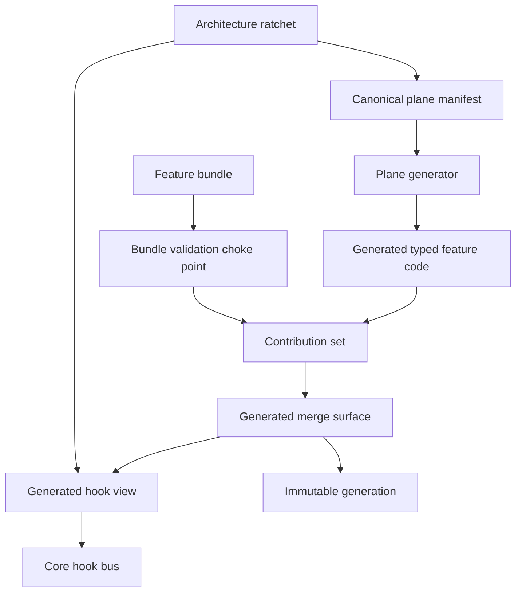
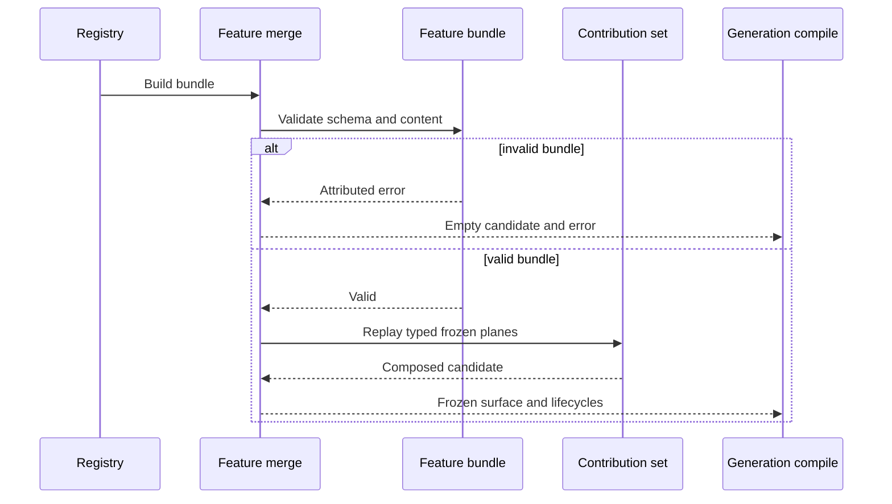
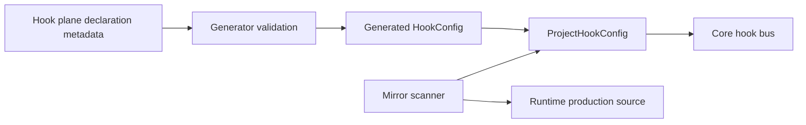

# Design Document

## Overview

This feature corrects three independent-review failures in the completed extension-plane consolidation and removes the remaining lifecycle-only compatibility transport. It retains the established typed manifest, generated storage, immutable generation, transactional replay, and diagnostics architecture. The implementation changes only the existing generation accessor, bundle assembly choke point, manifest generator, hook consumer boundary, legacy merge surface, architecture ratchet, and verification evidence.

Runtime and SDK maintainers gain a truthful fail-closed boundary: absent generations remain safe, malformed bundles cannot reach composition, hook projection is generated from canonical declarations, and one generated surface carries planes plus the separate lifecycle side channel.

### Goals

- Restore nil-safe terminal-decision generation access without changing non-nil behavior.
- Enforce `FeatureBundle` schema negotiation before any plane or lifecycle publication.
- Generate the hook-bus projection from canonical plane declarations and remove the exemption that hid its mirror.
- Delete obsolete lifecycle-only merge APIs while preserving behavioral coverage.
- Produce fresh allocation, architecture, race, QA, independent-review, and merged-main evidence.

### Non-Goals

- Change the 25 standard plane contracts, combination rules, identity rules, or diagnostics semantics.
- Decide or implement arbitrary dynamic SDK plane support.
- Optimize request-path latency or certify #394 load and HOLD targets.
- Relocate core packages, add a DI/projection framework, or change plugin/provider behavior.

## Boundary Commitments

### This Spec Owns

- Nil behavior of `GenerationBundle` accessors affected by the plane migration.
- Bundle schema validation at the common generated feature contribution boundary.
- Canonical hook-projection declaration metadata, generation, consumption, and architecture enforcement.
- Removal of `MergedFeatureSurface` and lifecycle-only dual-path helpers.
- Corrective verification, evidence, and links to adjacent work.

### Out of Boundary

- `ContributionSet` and `FrozenPlaneSet` map/reflection fallback removal or support completion.
- #394 latency diagnosis, load testing, optimization, and HOLD certification.
- Kernel/stage package decomposition and unrelated extension consumer projections.
- Changes to public `FeatureBundle` shape or standard plane count.

### Allowed Dependencies

- `pkg/lipsdk/feature` may use public SDK hook contracts from `pkg/lipsdk/hooks`.
- `internal/core/hooks` may depend on the generated SDK hook configuration type.
- `internal/featurebundle` may depend on `FeatureBundle.Validate` and generated frozen replay.
- `internal/infra/runtimebundle` may consume generated merge and hook views but may not enumerate hook planes.
- `internal/archtest` may parse canonical declaration metadata and emit deterministic Go.
- No new external dependency is permitted.

### Revalidation Triggers

- Any `FeatureBundle` schema rule or field change.
- Any hook-plane addition, removal, type change, or projection-target change.
- Any change to lifecycle ordering or the `GeneratedMergeSurface` contract.
- Any reintroduction of ungenerated production planes or dynamic-plane compatibility changes.
- Any request-hot-path map, reflection, lock, or allocation change.

## Architecture

### Existing Architecture Analysis

- Standard planes are declared in `plane_manifest.go`; `plane_generated.go` provides typed storage, replay, request views, binders, and diagnostics.
- `ContributeBundle` is the common assembly seam, but it currently validates only through plane replay and ignores bundle schema metadata.
- `HooksConfigFromFrozen` is a handwritten consumer adapter and two exact symbols are exempted from W5c mirror detection.
- `MergedFeatureSurface` has collapsed to `Lifecycles`; generation compilation receives it only through a no-op compatibility parameter.
- Published generations remain immutable. This correction neither introduces new resources nor alters lifecycle ownership.

### Architecture Pattern & Boundary Map



**Architecture Integration**:
- **Selected pattern**: Existing declaration-driven code generation plus fail-closed composition; no new runtime framework.
- **Domain/feature boundaries**: SDK owns feature and hook contracts; featurebundle owns assembly; runtimebundle owns wiring; core hooks own execution; archtest owns generation and ratchets.
- **Existing patterns preserved**: Typed generated storage, immutable generations, fail-before-mutate candidate assembly, explicit host policy injection, deterministic architecture reports.
- **New components rationale**: Only a generated `HookConfig` view and declaration metadata are added; both replace handwritten code.
- **Steering compliance**: No reflection registry, DI container, provider branch, new dependency, dynamic loading, or request-time lookup.

**Project Boundary Questions**:
- **Core-owned or plugin-owned?** Composition correction is SDK/runtimebundle-owned; core retains hook execution policy; plugins remain unchanged.
- **New canonical concept?** No. The hook view projects existing SDK contracts.
- **Streaming-first path preserved?** Yes; no stream execution behavior changes.
- **Provider SDK leakage avoided?** Yes; only existing provider-neutral SDK hook and terminal-decision contracts are used.
- **No retry/failover after output preserved?** Yes; no routing or execution retry code changes.
- **Security/diagnostics/startup posture affected?** Diagnostics and startup composition are revalidated; security policy is unchanged.
- **Extension platform seam used or extended?** The existing declaration/generator seam is tightened.

### Technology Stack

| Layer | Choice / Version | Role in Feature | Notes |
|-------|------------------|-----------------|-------|
| SDK | Go 1.26.6 generics | Typed plane, bundle, and hook-view contracts | Existing dependencies only |
| Runtime | Explicit immutable generation composition | Validate and publish feature surfaces | No request-time registry |
| Tooling | Go AST and formatter | Parse manifest and emit deterministic projection | Extends existing generator |
| Verification | Go testing, architecture report, Linux race detector | Regression and certification evidence | #394 remains separate |

## File Structure Plan

### Modified Production Files

- `internal/infra/runtimebundle/generation_bundle.go` - restore nil-safe generated terminal-provider access.
- `internal/featurebundle/merge_generated.go` - validate bundles at the common contribution choke point and retain the single generated surface.
- `internal/featurebundle/merge_surface.go` - retain registry bundle construction and host merge orchestration while deleting lifecycle-only legacy types and dual returns.
- `internal/infra/runtimebundle/compile_generation.go` - consume only the generated surface and remove the no-op legacy extension parameter.
- `internal/infra/runtimebundle/candidate_compile.go` - consume the simplified generated merge return.
- `pkg/lipsdk/feature/plane.go` - add typed declaration metadata for generated consumer-view membership.
- `pkg/lipsdk/feature/plane_manifest.go` - annotate the four canonical hook planes with their hook-view targets.
- `internal/archtest/plane_generator.go` - parse and validate hook-view metadata.
- `internal/archtest/plane_emitter.go` - emit the typed hook view and projection.
- `pkg/lipsdk/feature/plane_generated.go` - regenerated output only; never edited by hand.
- `internal/core/hooks/bus.go` - alias the generated hook config while retaining bus sorting/execution.
- `internal/infra/runtimebundle/build_feature_hooks.go` - consume generated hook projection and delete per-plane reads.
- `internal/archtest/plane_rules.go` - remove the hook projection bypass and scan handwritten projections normally.
- `internal/archtest/plane_rules_tables.go` - delete `AllowedHookProjections` and helper.
- `internal/archtest/plane_report.go` - update catalog descriptions to the generated hook view and single generated merge engine.
- `testdata/architecture/extension_planes_baseline.json` - refresh deterministic expected architecture facts only after ratchets pass.

### Modified Test and Evidence Files

- `internal/infra/runtimebundle/*terminal*test.go` or focused generation bundle test - nil receiver and pointer-accessor audit.
- `internal/featurebundle/merge_surface_test.go` and `merge_surface_characterization_test.go` - invalid schema, rollback, lifecycle, and simplified merge coverage.
- `internal/featurebundle/dual_path_parity_test.go` - remove obsolete legacy comparison and retain generated behavioral assertions.
- `internal/testkit/planeparity/planeparity.go` and tests - remove legacy surface oracle or reduce to generated-only invariants.
- `internal/infra/runtimebundle/hooks_projection_parity_test.go` - verify generated hook view, host policy, nil/empty, and ordering.
- `internal/infra/runtimebundle/extension_projection_characterization_test.go` and observer/typed-nil tests - remove legacy parameters while preserving current behaviors.
- `internal/archtest/plane_generator_test.go` - metadata validation and deterministic generated projection tests.
- `internal/archtest/plane_rules_test.go`, `plane_rules_consumers_test.go`, and whitelist tests - prove handwritten hook projection rejection with no exemption.
- `.kiro/specs/extension-plane-review-corrections/evidence.md` - final corrective command, benchmark, race, architecture, review, and merged-main evidence.

### Created Follow-Up Artifact

- GitHub issue and future Kiro spec for dynamic-plane SDK hardening - choose fail-closed closed-manifest behavior or complete dynamic composition; no implementation in this spec.

## System Flows

### Feature Bundle Assembly



Lifecycles append only after validation and replay succeed. Any failure returns an empty candidate and leaves an existing destination unchanged.

### Hook Projection Generation



Generated files are excluded as authoritative generated output; handwritten runtime projections are not exempt and therefore fail W5c.

## Requirements Traceability

| Requirement | Summary | Components | Interfaces | Flows |
|-------------|---------|------------|------------|-------|
| 1.1-1.5 | Nil-safe absent/published generation behavior | Generation Accessor | `TerminalDecisionProvider` | Generation access |
| 2.1-2.8 | Schema negotiation and rollback | Bundle Validation Choke Point, Generated Merge Surface | `FeatureBundle.Validate`, `ContributeBundle` | Feature bundle assembly |
| 3.1-3.6 | Generated hook projection and ratchet | Hook View Generator, Hook Bus Config, Mirror Scanner | hook metadata, `ProjectHookConfig` | Hook projection generation |
| 4.1-4.5 | Single generated plane/lifecycle surface | Generated Merge Surface, Runtime Compiler | merge APIs, `Lifecycles` | Feature bundle assembly |
| 5.1-5.6 | Architecture and SDK boundaries | Generator, SDK types, architecture gates | manifest and generated contracts | Both flows |
| 6.1-6.8 | Performance and verification evidence | Verification Harness | generator check, arch report, benchmark, race and QA commands | Certification |
| 7.1-7.5 | Corrective delivery and adjacent tracking | Evidence and Delivery | corrective spec, linked issues and PRs | Certification |

## Components and Interfaces

| Component | Domain/Layer | Intent | Req Coverage | Key Dependencies | Contracts |
|-----------|--------------|--------|--------------|------------------|-----------|
| Generation Accessor | Runtime composition | Preserve nil-safe immutable provider reads | 1.1-1.5 | FrozenPlaneSet P0 | Service |
| Bundle Validation Choke Point | Feature assembly | Validate bundle schema before replay/publication | 2.1-2.8, 4.3 | FeatureBundle P0 | Service |
| Generated Merge Surface | Feature assembly | Carry frozen planes and ordered lifecycles | 2.1-2.8, 4.1-4.5 | ContributionSet P0 | State |
| Hook View Generator | SDK tooling | Generate typed hook configuration from declarations | 3.1-3.6, 5.1-5.3 | Manifest P0 | Batch, State |
| Hook Bus Config | Core execution | Consume generated hook view plus host policy | 3.1-3.3, 5.4 | SDK feature/hooks P0 | State |
| Mirror Scanner | Architecture gate | Reject handwritten hook projection | 3.4-3.6, 5.1-5.3 | Go AST P0 | Batch |
| Verification Harness | QA and delivery | Certify correction and record adjacent evidence | 6.1-6.8, 7.1-7.5 | Repository gates P0 | Batch |

### Runtime Composition

#### Generation Accessor

| Field | Detail |
|-------|--------|
| Intent | Return the frozen terminal provider or nil without dereferencing an absent generation |
| Requirements | 1.1-1.5 |

**Responsibilities & Constraints**
- Preserve zero behavior for nil receivers.
- Preserve `FrozenPlaneSet` as the authoritative provider source.
- Do not add a duplicate provider field or mutable rebinding.

**Contracts**: Service [x] / API [ ] / Event [ ] / Batch [ ] / State [ ]

```go
func (b *GenerationBundle) TerminalDecisionProvider() terminaldecision.Provider
```

- **Preconditions**: None; nil receiver is valid.
- **Postconditions**: Returns nil for absent/no-provider generations; otherwise returns the generation-frozen provider.
- **Invariant**: Published generation values never change.

#### Bundle Validation Choke Point

| Field | Detail |
|-------|--------|
| Intent | Validate complete bundle schema and replay planes transactionally |
| Requirements | 2.1-2.8, 4.3 |

**Responsibilities & Constraints**
- Validate the complete bundle before `PlaneSet.ReplayTo`.
- Wrap validation failures with contributor identity.
- Publish no lifecycle until contribution succeeds.
- Retain plane replay validation even though it duplicates plane checks at assembly time.

**Contracts**: Service [x] / API [ ] / Event [ ] / Batch [ ] / State [ ]

```go
func ContributeBundle(
    dst *feature.ContributionSet,
    contributorID string,
    bundle feature.FeatureBundle,
) error
```

- **Preconditions**: `dst` is non-nil; contributor identity is normalized by the caller or replay.
- **Postconditions**: On success all bundle planes are contributed; on error `dst` is unchanged.
- **Invariant**: Unsupported bundle schema never reaches a candidate generation.

#### Generated Merge Surface

| Field | Detail |
|-------|--------|
| Intent | Represent the only production merge result for extension planes and lifecycles |
| Requirements | 2.1-2.8, 4.1-4.5 |

**Responsibilities & Constraints**
- Retain `Frozen`, `Lifecycles`, and private mutable working set.
- Preserve source ordering: registered feature bundles, host observers, candidate bundles.
- Remove all projection to or return of `MergedFeatureSurface`.

**Contracts**: Service [x] / API [ ] / Event [ ] / Batch [ ] / State [x]

```go
type GeneratedMergeSurface struct {
    Frozen     feature.FrozenPlaneSet
    Lifecycles []plugin.Lifecycle
}

func MergeFeatureSurfacesWithHost(
    registry FeatureBundleRegistry,
    registrations []lipsdk.Registration,
    host HostContributions,
    extras ...feature.FeatureBundle,
) (GeneratedMergeSurface, error)
```

- **Postconditions**: Success returns one complete surface; failure returns its zero value.
- **Invariant**: Plane and lifecycle publication is all-or-nothing per candidate composition.

### SDK Generation and Core Consumption

#### Hook View Generator

| Field | Detail |
|-------|--------|
| Intent | Derive hook configuration fields and reads from canonical declarations |
| Requirements | 3.1-3.6, 5.1-5.3 |

**Responsibilities & Constraints**
- Add an optional typed hook-view target field to `Plane[T]` declaration metadata.
- Accept metadata only for the four compatible hook SDK value types.
- Reject duplicate target names and malformed metadata during generation.
- Emit imports, `HookConfig`, and `ProjectHookConfig` deterministically.
- Keep host `ToolReactorErrorPolicy` explicit and outside plane declarations.

**Contracts**: Service [ ] / API [ ] / Event [ ] / Batch [x] / State [x]

```go
type HookConfig struct {
    SubmitHooks            []hooks.SubmitHook
    RequestPartHooks       []hooks.RequestPartHook
    ResponsePartHooks      []hooks.ResponsePartHook
    ToolReactors           []hooks.ToolReactor
    ToolReactorErrorPolicy hooks.ToolReactorErrorPolicy
}

func ProjectHookConfig(
    frozen FrozenPlaneSet,
    policy hooks.ToolReactorErrorPolicy,
) HookConfig
```

- **Postconditions**: Slice fields preserve nil/empty and defensive-copy behavior from generated getters; policy equals host input.
- **Invariant**: Every emitted plane field is traceable to one canonical declaration annotation.

#### Hook Bus Config

| Field | Detail |
|-------|--------|
| Intent | Let core execute hooks without a second field mirror |
| Requirements | 3.1-3.3, 5.4 |

**Responsibilities & Constraints**
- Define `hooks.Config` as a type alias to `feature.HookConfig`.
- Retain bus materialization and stable sorting in `internal/core/hooks`.
- Runtimebundle calls generated projection directly.

**Contracts**: Service [ ] / API [ ] / Event [ ] / Batch [ ] / State [x]

#### Mirror Scanner

| Field | Detail |
|-------|--------|
| Intent | Make W5c zero-mirror evidence unconditional for hook projections |
| Requirements | 3.4-3.6, 5.1-5.3 |

**Responsibilities & Constraints**
- Remove hook-specific exact-symbol allowlisting.
- Continue excluding generated files through the existing generated-file contract.
- Detect handwritten hook plane reads in production projection functions.

**Contracts**: Service [ ] / API [ ] / Event [ ] / Batch [x] / State [ ]

### Verification and Delivery

#### Verification Harness

| Field | Detail |
|-------|--------|
| Intent | Produce fresh, auditable evidence for the corrective baseline |
| Requirements | 6.1-6.8, 7.1-7.5 |

**Responsibilities & Constraints**
- Run focused, generated, architecture, repository, smoke, benchmark, and Linux race gates.
- Record exact commit and CI run/job identities.
- Preserve the original closeout evidence as historical rather than rewriting it.
- Link separate dynamic-plane hardening and #394 fixed-cost evidence.

**Contracts**: Service [ ] / API [ ] / Event [ ] / Batch [x] / State [ ]

## Error Handling

### Error Strategy

- Nil generation access is normal zero behavior, not an error.
- Bundle validation errors wrap the original SDK error with the contributor ID at the assembly boundary.
- Plane replay retains existing `AttributedError` plane and contributor fields.
- Merge functions return a zero generated surface on any bundle, host, candidate, validation, or conflict failure.
- Generator metadata errors identify the plane declaration and malformed/duplicate hook target.
- Architecture violations identify file, line, symbol, and plane ID through existing `MirrorFinding`.

## Testing Strategy

### Unit Tests

- Call `TerminalDecisionProvider` on a nil `*GenerationBundle`; assert nil and no panic, then audit all neighboring pointer accessors against their documented zero values (1.1, 1.4).
- Table-test empty zero/V1, non-empty zero/V1, lifecycle-only zero/V1, and unsupported schema bundles through `ContributeBundle` and `MergeBundlesGenerated` (2.1-2.6).
- Use a fake `FeatureBundleRegistry` to prove malformed third-party output fails through registry and host/candidate merge paths with no state/lifecycle publication (2.7-2.8, 4.3).
- Test generator rejection of duplicate, unknown, and type-incompatible hook targets plus deterministic successful emission (3.3, 3.6).
- Test generated hook projection for populated, absent, nil, explicit-empty, order, defensive-copy, and every host policy case (3.1-3.3).

### Integration Tests

- Compile and publish generations with absent and present terminal providers; verify request pinning and rollback remain unchanged (1.2-1.5).
- Exercise registered feature, host observer, and candidate bundle ordering through the simplified single-surface API (4.1-4.3).
- Migrate typed-nil, exclusive conflict, and lifecycle characterization from legacy comparisons to generated state (4.5).
- Scan synthetic and production source to prove handwritten hook projection fails while generated output passes (3.4-3.5).

### Performance and Certification

- Rerun the 31-case seam benchmark suite and record `ns/op`, `B/op`, and `allocs/op` against Wave 0 (6.4-6.6).
- Run generated-output check and deterministic architecture report twice; require zero forbidden mirrors without a hook allowlist (6.2-6.3).
- Run `make quality-checks`, `make test`, `make qa`, and `lipstd --help` smoke (6.8).
- Run exact Linux race verification for `internal/core/extensions` and `internal/infra/runtimebundle` against the final corrective commit (6.7).
- Require independent review and fresh merged-main verification before archive and VERIFIED status (6.8, 7.5).

## Performance & Scalability

- Bundle validation and duplicate plane validation occur only during assembly, not request execution.
- Generated hook projection performs direct typed field access/getters and introduces no request-time map, reflection, lock, or key search.
- The nil guard adds one predictable branch to generation-level terminal-provider access; benchmark evidence records its fixed cost.
- Allocation equality and structural hot-path checks are blocking. Latency/load/HOLD judgments remain with #394.

## Migration Strategy

1. Add RED regression tests for nil access, malformed schemas, manual hook projection detection, and legacy-surface behavior to preserve.
2. Implement nil and schema corrections at their existing choke points.
3. Add hook declaration metadata, generator output, and core alias; migrate runtime consumers before removing allowlists.
4. Migrate legacy-surface tests and production callers, then delete compatibility types and helpers.
5. Refresh generated output, architecture baseline, benchmarks, and evidence; run independent review.
6. Merge implementation, verify fresh `origin/main`, archive this corrective spec, and restore VERIFIED status.
