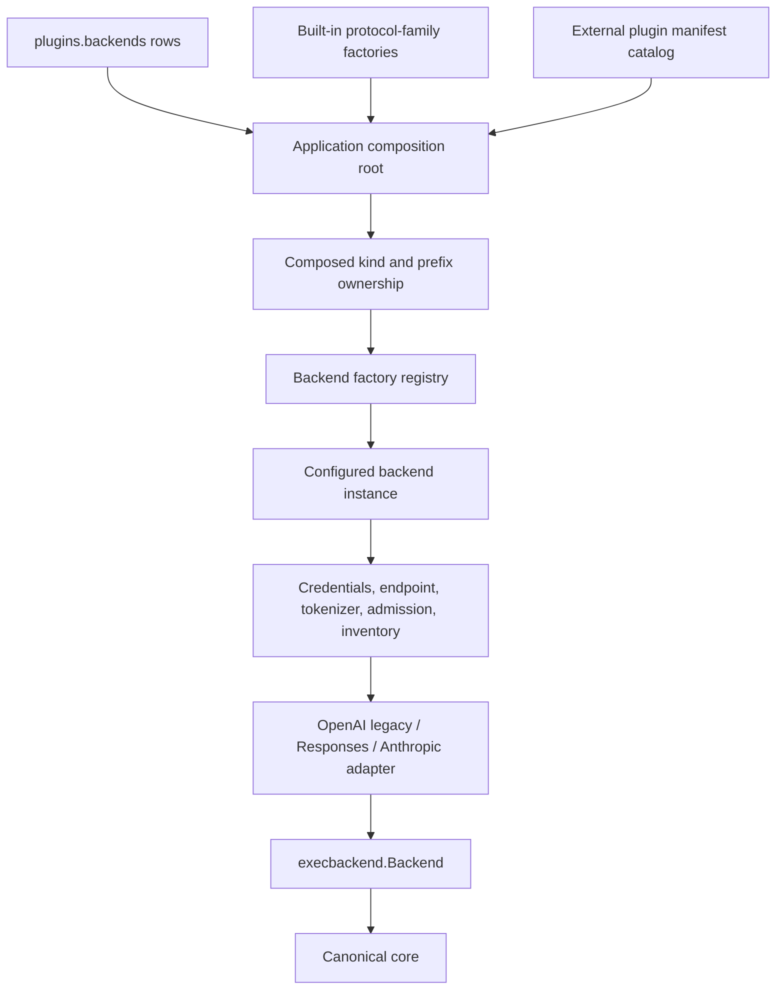
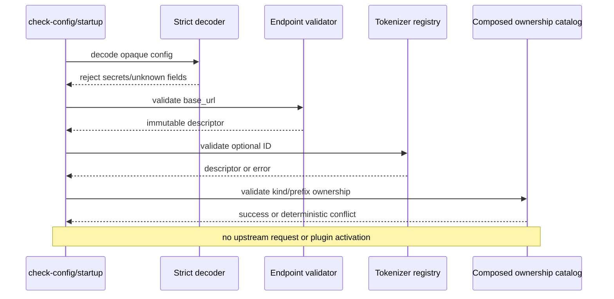
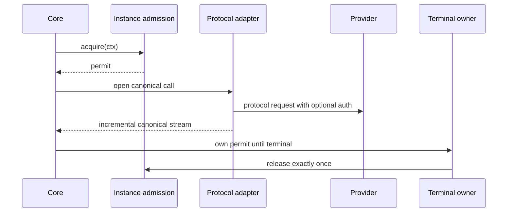

# Design Document

## Generic Compatible Backend Modes

## Overview

This feature completes and hardens Go-LIP's three config-defined compatible backend kinds while migrating them into the final backend composition architecture:

- `custom-openai-legacy-compatible`
- `custom-openai-responses-compatible`
- `custom-anthropic-compatible`

The selected pattern is **built-in protocol-family modes at the application composition edge**. These modes reuse the essential built-in OpenAI legacy, OpenAI Responses, and Anthropic adapters. They do not become executable plugins, add provider dependencies, or cross the external backend-plugin ABI.

The design preserves operator-facing backend rows and route semantics while replacing transitional implementation assumptions. Shared infrastructure resolves environment-referenced credentials, validates endpoint URLs, composes prefix ownership, attaches tokenizers and per-instance admission, publishes inventory, and exposes diagnostics. Core routing, failover, output commitment, sessions, accounting policy, and canonical events remain unchanged.

## Goals

- Configure compatible endpoints without code, recompilation, or plugin installation.
- Preserve three stable kinds and multiple independent instances.
- Align with the completed backend connector plugin architecture.
- Reject literal YAML credentials and support unauthenticated endpoints.
- Define safe URL and composed-prefix semantics.
- Add common tokenizer and per-instance concurrency controls.
- Preserve canonical behavior and inventory provenance through reused adapters.
- Keep `internal/core` and external plugin-host infrastructure free of generic-kind branches.

## Non-Goals

- External plugin manifests, ABI, process hosting, or distribution.
- OpenRouter or provider-specific connector behavior.
- Arbitrary YAML request/response transformations.
- New canonical request/event concepts.
- Runtime installation or hot reload.
- Changing credential policy for native built-ins or executable plugins.

## Boundary Commitments

### This Spec Owns

- Strict generic-compatible instance config.
- Built-in registration/classification of the three kinds.
- Environment-only credential references for these kinds.
- Endpoint validation and joining.
- Composed prefix ownership checks.
- Common tokenizer and concurrency attachment.
- Compatible inventory integration and provenance.
- Canonical parity tests and operator documentation.

### Out of Boundary

- Provider plugin discovery, trust, manifests, IPC, and process lifecycle.
- Provider-specific authentication, attribution, routing, billing, extensions, or errors.
- Core routing and retry policy.
- Frontend or feature plugin systems.

## Dependency Constraints

- `internal/core` does not import or name generic compatible kinds or concrete adapters.
- External plugin host/discovery packages do not special-case these kinds.
- Generic mode packages import only shared config/runtime abstractions and their essential adapter.
- Protocol adapters do not import tokenizer registries, plugin discovery, routing catalogs, or admission implementations.
- Credential resolution accepts references and never persists values into diagnostics.
- Prefix validation consumes generic descriptors from the composed catalog, not connector packages.
- No provider SDK or external connector module is introduced.
- Root builds remain valid with `GOWORK=off` and absent connector modules.

## Requirements Traceability

| Requirement | Summary | Components | Main flows |
|---|---|---|---|
| 1 | Built-in classification | Built-in mode descriptors, architecture gates | Composition and build |
| 2 | Stable instance config | Strict decoder, factory descriptors | Decode and construct |
| 3 | Environment-only secrets | Credential reference validator/resolver | Validate and resolve |
| 4 | Safe URLs | Endpoint descriptor | Validate and join |
| 5 | Prefix ownership | Composed ownership catalog | Compose and reserve |
| 6 | Concurrency | Common per-instance admission | Admit, execute, release |
| 7 | Tokenizer | Shared tokenizer resolver | Resolve and attach |
| 8 | Canonical parity | Reused adapters, parity harness | Execute and stream |
| 9 | Inventory | Shared inventory providers | Discover and publish |
| 10 | Diagnostics/docs | Inspect projection and guides | Validate and inspect |
| 11 | Migration | Built-in composition and module gates | Rebase and release |
| 12 | TDD evidence | Contract, parity, race, leak, arch tests | Delivery gates |

## Architecture

### Context

The backend plugin architecture produces a hybrid composition root:

1. a small built-in factory bundle;
2. a discovered external factory catalog;
3. one registry used by configured backend rows;
4. core consuming only the internal backend port.

Generic compatible modes belong to the built-in bundle because they are dependency-free protocol aliases. Dynamically configured instances do not make their implementation dynamically loaded.



## Component Model

### 1. Strict compatible-mode config

The decoder accepts only:

```yaml
backend_prefix: string
base_url: string
api_key_env_var_root: string?
tokenizer: string?
max_concurrent_requests: integer?
models: shared inventory config?
```

It detects forbidden `api_key`, `api_keys`, and inline credential-secret fields so errors are explicit. Strictness is scoped to these three compatible-mode configs: the decoder validates the YAML mapping key set before typed decode rather than changing the repository-wide, currently non-strict `config.DecodeYAMLNode` behavior. A successfully decoded model contains references and policy, never literal credentials.

Conceptual shape:

```go
type CompatibleModeConfig struct {
    BackendPrefix         string
    Endpoint              EndpointDescriptor
    APIKeyEnvVarRoot      string
    TokenizerID           string
    MaxConcurrentRequests int
    Models                InventoryConfig
}
```

Exact package/type names follow the final adjacent architecture.

### 2. Built-in mode descriptors

Each family exposes or is accompanied by a descriptor containing:

- stable factory kind;
- protocol family;
- transport capabilities;
- construction callback;
- compatible inventory strategy;
- origin `built_in_compatible`.

Descriptors are installed by the built-in composition bundle. They are not external connector exports and do not appear in manifests.

### 3. Immutable endpoint descriptor

One validated descriptor stores the base URL and provides operation-specific joins for:

- OpenAI Chat Completions;
- OpenAI Responses;
- OpenAI models;
- Anthropic Messages;
- Anthropic models.

Joining is path-aware, preserves explicit ports and intentional prefixes, rejects userinfo, and cannot diverge between execution and inventory.

### 4. Credential reference and resolver

Config stores only an optional env-root name. During runtime construction, a shared resolver:

- validates the root;
- reads numbered keys using existing convention;
- drops empty values;
- creates independent pool state per instance;
- returns no credentials when none exist.

Adapters receive a compatible-mode-only optional credential provider. The OpenAI-compatible construction path bypasses empty-pool acquisition and only constructs authenticated SDK request options after selecting a key. The Anthropic-compatible construction path adds `option.WithAPIKey` only after selecting a non-empty key. Native built-in dummy-credential behavior and executable-plugin secret projection remain unchanged. Secret values are excluded from snapshots and diagnostics.

### 5. Composed ownership catalog

Ownership is generation-scoped and assembled in two stages:

- before activation: built-in kinds and prefixes, enabled generic instance prefixes, and manifest-discovered external factory kinds;
- after a discovered instance is activated: advertised route prefixes from its resolved profile, checked before the candidate generation is published.

`check-config` performs only the first, manifest-available stage and never activates a process. Startup/reload performs both stages. This preserves manifest v1 and the executable plugin ABI.

Conceptual record:

```go
type BackendOwner struct {
    Origin      OriginKind
    FactoryKind string
    InstanceID  string
    Prefix      string
    SourceID    string
}
```

The catalog detects duplicate or reserved prefixes and returns both bounded owners. No manual list is authoritative.

Ordering:

1. load built-in descriptors;
2. discover and validate external manifest exports without process launch;
3. decode enabled backend rows;
4. compose manifest-available ownership and detect conflicts;
5. construct built-ins and activate configured external instances;
6. merge resolved external route prefixes and reject conflicts;
7. publish the immutable `GenerationRuntime` through the owning `Host` and serve.

### 6. Common tokenizer attachment

A small composition-edge resolver, backed by the existing `internal/infra/tokenizers` implementations and `internal/core/tokenaccounting` contracts, maps an optional bounded identifier to tokenizer/counting capability. This spec creates that missing resolver and its initial documented identifier vocabulary; it does not introduce `internal/core/tokenization`. The mode factory attaches the result to backend metadata or counting providers. Wire adapters remain unaware of tokenizer names. Unknown IDs fail before runtime publication.

### 7. Common per-instance admission

A common admission contribution is created from runtime instance identity and `max_concurrent_requests`. It is expressed through the landed concurrency-authority rule/dimension model and acquired at the runtime backend-attempt seam, with release transferred to existing terminal ownership. It does not use the reload-only `attemptGate` and does not place a semaphore inside protocol codecs.

```text
request accepted
  -> acquire instance permit or return/cancel
  -> open backend operation
  -> transfer permit ownership to terminal owner
  -> release exactly once on every terminal path
```

Terminal ownership covers streaming completion, explicit close, cancellation, provider error, panic recovery, and setup rollback. Separate instances receive separate limiter state.

### 8. Protocol-family construction

The mode factory assembles:

- endpoint descriptor;
- optional credential pool;
- common HTTP/runtime policy;
- adapter flavor;
- remote/static inventory provider;
- tokenizer/counting attachment;
- admission contribution;
- instance/kind/prefix provenance.

It invokes the same adapter constructors used by the essential family with dependency-free compatible settings only.

### 9. Inventory integration

Inventory uses the same endpoint and credential providers as execution. Static inventory follows shared precedence. Published rows retain instance ID, factory kind, prefix, native/canonical IDs, source, freshness, and capability evidence. Check-config validates structure but does not discover remotely.

### 10. Diagnostics projection

Bounded diagnostics expose:

- origin `built_in_compatible`;
- factory kind;
- instance ID;
- prefix;
- sanitized endpoint identity;
- auth configured yes/no, never values;
- tokenizer ID;
- concurrency policy;
- inventory state.

They do not expose manifest, digest, process, or plugin health states.

## Data and Control Flows

### Configuration validation



### Runtime execution



## Validation Rules

### Config

- Required: `backend_prefix`, `base_url`.
- Optional: env root, tokenizer, max concurrency, models.
- Forbidden with targeted errors: literal keys and credential secrets.
- Unknown fields fail strict decoding.
- Negative concurrency fails.

### Endpoint

- absolute `http`/`https` only;
- host required;
- no userinfo or fragment;
- preserve port/path prefix;
- deterministic operation join table;
- no network validation.

### Prefix

- trimmed and non-empty;
- no `/` or `:`;
- unique among enabled instances;
- no built-in or discovered external collision;
- deterministic two-owner diagnostics.

### Tokenizer

- empty means current default;
- non-empty must resolve through shared registry;
- no adapter-specific switching.

### Concurrency

- zero/omitted follows documented default;
- positive creates independent instance admission;
- cancellation-safe acquisition and exactly-once release.

## Error Model

Existing classified config, admission, transport, and canonical backend errors are reused. New stable reason categories cover forbidden credential fields, invalid env root, invalid URL, invalid join, invalid/colliding prefix, unknown tokenizer, invalid concurrency, and admission saturation/cancellation.

Errors identify runtime instance and bounded conflicting owner. They never include credential values or full opaque YAML.

## Security Considerations

- YAML cannot carry literal secrets for these modes.
- Environment values are resolved only during construction and retained in secret-aware containers.
- No-auth endpoints omit credential headers.
- URL userinfo is rejected.
- Diagnostics sanitize endpoint data.
- Composed collision checks prevent route shadowing.
- No executable discovery/process trust surface is added.
- Provider-specific behavior requires design revalidation.

## Concurrency and Lifecycle

- Limiters are per runtime instance.
- Acquire obeys context deadlines.
- Setup failure releases immediately.
- Streaming releases through terminal ownership exactly once.
- Close/cancel races use existing CAS/once terminal semantics.
- Runtime rollback disposes instance resources without affecting siblings.
- Inventory refresh is separate from execution capacity unless common policy explicitly says otherwise.

## Migration Strategy

1. Confirm and map the already-landed backend plugin architecture (`pluginreg`, essential built-ins, discovered factories, and `runtimebundle.Host`/`GenerationRuntime` ownership).
2. Add characterization tests for current generic behavior.
3. Introduce final strict config and forbidden-secret tests.
4. Establish built-in mode descriptors and composed ownership.
5. Move/rebuild factory construction beside essential protocol families.
6. Add tokenizer and admission through common seams.
7. Preserve inventory and canonical parity while deleting transitional code.
8. Update docs/examples.
9. Run root/module/absence gates without external connectors.

Existing valid `kind`, `id`, `backend_prefix`, and routes remain stable. Literal-secret YAML intentionally becomes invalid and must move to environment variables.

## Testing Strategy

### Contract/config

- strict decoding and forbidden fields;
- env-root validation and numbered resolution;
- no-key valid operation;
- URL validation and join matrix;
- ownership conflict matrix;
- tokenizer/concurrency validation.

### Composition/architecture

- modes available in minimal built-in bundle;
- no branches/imports in core or external plugin host;
- no optional table or external module dependency;
- manifest-discovered factory-kind collisions without process launch;
- fake resolved-profile prefix collisions before generation publication;
- `GOWORK=off` build with connector modules absent.

### Runtime

- independent same-kind instances;
- conditional auth headers;
- streaming/non-streaming admission;
- cancellation and terminal release;
- race/leak and rollback isolation.

### Protocol parity

Differential fixtures compare each generic mode with its essential adapter for request mapping, text, reasoning, tools, multimodal, usage, errors, cancellation, and terminal ordering.

### Inventory/diagnostics

- remote/static precedence;
- provenance and bounds;
- failed refresh behavior;
- check-config performs no network;
- built-in-compatible origin and secret-safe output.

## Design Validation Summary

The initial design was corrected so that:

- manifest-available ownership is validated before activation and resolved external prefixes before generation publication;
- secrets cannot enter the decoded model;
- concurrency uses common terminal-aware admission rather than codec semaphores;
- tokenizer resolution remains outside adapters;
- one endpoint descriptor serves execution and inventory;
- diagnostics distinguish built-in modes from executable plugins;
- parity includes reasoning, multimodal, usage, errors, and terminal ordering;
- minimal root/module isolation remains provable.

Final verdict: **GO after corrections**.
