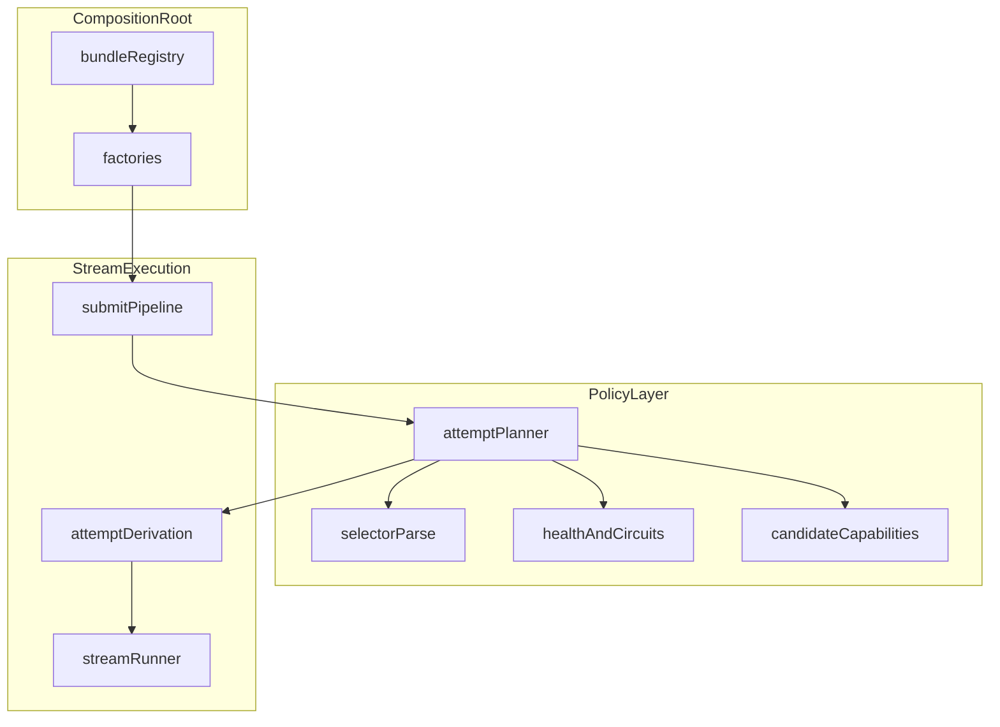

# Design Document: go-core-reimplementation-stage-two

Spec directory: `go-core-reimplementation-stage-two`

**Assumption:** Findings in [`v1_code_review.md`](v1_code_review.md) are fixed on `main` or are encoded as regression work in **task 1** of [`tasks.md`](tasks.md) before large stage-two refactors land.

---

## Purpose

Deliver an **architecturally honest** standard distribution: registries and factories are the real composition mechanism, configuration matches runtime behavior, hook metadata matches contracts, routing policy is explicit and cap-bounded, continuity stores are selectable and durable where required, and feature plugins are real—not switchboard placeholders.

---

## Approach

- Keep **static linking**; achieve extensibility through explicit **registration + factories**, not Go’s `plugin` package.
- Split **policy** (planning, health, caps, candidate capabilities) from **stream execution** (open stream, event pumps, post-output rules).
- Treat the **client canonical call as immutable baseline**; derive **attempt-local** copies per B-leg.
- Expand **protocol fidelity** only through **canonical adapters** and narrow shared helpers, never a new central translation monolith.
- Prove changes with **TDD** and expanded conformance/replay (**tasks 18–19** in `tasks.md`).

---

## Overview

**Users:** maintainers extending bundled plugins, operators configuring routing and stores, and feature authors using hook and reactor surfaces.

**Impact:** moves bundle construction, HTTP mounting, lifecycle, stores, and policy out of hidden switchboards into **registry-driven composition roots** and focused core packages, while preserving streaming-first execution and B2BUA semantics.

### Goals

1. Make the architecture **truthful**: config, SDK, runtime, and bundle composition must agree.
2. Keep the **core small** and provider-agnostic (no provider SDK imports in core).
3. Make retries and failover **attempt-local**, never mutation-leaky across attempts.
4. Turn distinctive LIP behavior into **stable policy and plugin seams** (routing policy, continuity stores, phase-specific hooks).
5. Expand protocol fidelity for **tool-use history** on the supported subset without pairwise translators.

### Non-Goals

- Out-of-process plugins, dynamic `plugin` loading, realtime A/V, full admin UI, exhaustive vendor-only parameters (see [`requirements.md`](requirements.md) scope).

---

## What this spec owns

- **Composition model:** registry/factory wiring for the standard bundle; deterministic lifecycle; config-driven frontend enablement and mounts.
- **Execution model:** immutable baseline call, per-attempt derivation, accurate hook metadata, stream runner responsibilities vs policy planner responsibilities.
- **Routing policy layer:** `max_attempts`, health/circuit exclusion, weighted and first-request semantics, model-only selector policy (reject or explicit resolve).
- **Continuity:** pluggable memory and SQLite stores; diagnostics over the configured store.
- **Capabilities:** candidate-aware or model-aware resolution integrated with planning.
- **Feature plugins:** real factories, opaque config, explicit tool-reactor failure policy, deterministic ordering.
- **Conformance:** expanded goldens/replay for tool history and failover lineage (**tasks 14.3**, **18**).

## What this spec does not own

- Vendor SDK upgrade schedules, cloud billing, or hosted multi-tenant control planes.
- Full parity with the Python repository in one milestone.
- Networked highly-available store clustering (SQLite-first only for durable local/edge in this spec).

---

## Package and contract impact

**May change (expected touch surfaces)**

- `cmd/lipstd`, `internal/stdhttp`, `internal/pluginreg` (or successor bundle registry packages).
- `internal/core/runtime` (split/refactor), new `internal/core/policy` (or equivalent), `internal/core/continuity`, `internal/core/hooks` orchestration glue.
- `pkg/lipsdk` (factory contracts, optional `plugin`, `store`, `routing` subpackages), **without** leaking provider SDK types into stable surfaces (**15.1** in requirements).
- `internal/plugins/*` (frontends, backends, features, stores), `testdata`, integration tests.

**Should remain stable unless explicitly revised with migration notes**

- `pkg/lipapi` public canonical shapes: extend only with versionable, documented fields; avoid breaking streaming/event ordering contracts without a migration path.
- Hook **phase semantics** (submit once per logical request; request-part per attempt; response-part per event; tool reactor per tool event)—changes require design revalidation and task updates.

---

## Downstream revalidation

When implementation changes any of the following, re-run or extend the associated validation:

| Change | Revalidation |
|--------|----------------|
| Canonical call/event/history fields (`pkg/lipapi`) | **Tasks 14**, **14.1–14.4**, **18**; fuzz/golden suites touching decode |
| Hook metadata structs (`pkg/lipsdk/hooks`) | **Tasks 1**, **1.1**, **9**, **13** |
| Routing selector or planner semantics | **Tasks 10–10.3**, **17**, **18** |
| Store schema or interfaces | **Tasks 11–11.2**, **18** |
| Registry or factory signatures | **Tasks 3–6**, **3.1** |

---

## Steering compliance (design checklist)

1. **Core vs plugin:** orchestration, routing policy, B2BUA continuity rules stay core-owned; protocol encode/decode and provider calls stay in plugins (**12.1–12.3**).
2. **Canonical vs provider-specific:** new concepts land in `pkg/lipapi` only when cross-protocol; otherwise adapter-local (**8.5**).
3. **Streaming-first:** non-streaming remains collector-over-events; no second semantic stack.
4. **No SDK in core:** provider SDKs only in `internal/plugins/**` (and narrow helpers), never `internal/core` or `pkg/lipapi`.
5. **No retry after first output:** stream runner preserves existing post-output prohibition; policy only plans attempts, it does not violate output-commit rules.

---

## Policy vs execution (reference)



---

## High-level architecture

```text
                         +----------------------+
                         |   cmd/lipstd         |
                         |  standard bundle     |
                         +----------+-----------+
                                    |
                                    v
                         +----------------------+
                         | bundle registry       |
                         | - frontend factories  |
                         | - backend factories   |
                         | - feature factories   |
                         | - store factories     |
                         | - observer factories  |
                         +----------+-----------+
                                    |
                      constructs via factories using config
                                    |
                                    v
+-------------------+    +-----------------------+    +---------------------+
| frontend plugins  | -> | core runtime          | -> | backend plugins     |
| decode/encode     |    | - attempt engine      |    | invoke provider/API |
| mount metadata    |    | - routing policy      |    | map to canon events |
+-------------------+    | - continuity access   |    +---------------------+
                         | - hook middleware     |
                         | - capability resolver |
                         +-----------+-----------+
                                     |
                                     v
                         +-----------------------+
                         | stores / observers     |
                         | - memory               |
                         | - sqlite               |
                         | - diagnostics          |
                         | - wiretap (optional)   |
                         +-----------------------+
```

The crucial difference from v1 is that the standard distribution stops being a hidden switchboard and becomes a registry-backed composition root.

---

## Core design principles

### 1. Static linking is fine; hardcoded composition is not

Stage two still uses a statically linked Go bundle.

We are **not** using Go’s native `plugin` package.

But every bundled component must be instantiated through factories registered in one place, not through repeated switch statements in runtime-adjacent packages.

### 2. The client request is immutable baseline state

The runtime owns a logical request baseline and derives per-attempt copies.

```text
client call
   |
   v
BaselineCall (immutable)
   |
   +--> submit hooks (once)
   |
   +--> attempt derivation #1 -> request hooks -> backend A
   |
   +--> attempt derivation #2 -> request hooks -> backend B
   |
   +--> attempt derivation #3 -> request hooks -> backend C
```

No attempt may mutate the baseline call.

### 3. Routing policy is separate from stream execution

The executor should orchestrate.
It should not also become the full routing policy engine.

Stage two separates:

- **selector parsing**
- **policy resolution**
- **health/circuit state**
- **attempt planning**
- **stream execution / retry**

### 4. Hooks are middleware with explicit phase contracts

Hook families are not generic “plugins”. They are phase-specific middleware.

We keep the families distinct because their semantics differ:

- submit hooks — once per logical request
- request-part hooks — once per attempt on a fresh derived call
- response-part hooks — once per canonical event
- tool reactors — once per canonical tool event

---

## Proposed package and responsibility map

```text
cmd/lipstd/
  main.go                  # load config, construct bundle, run

internal/bundle/std/
  registry.go              # bundled factory registration
  compose.go               # build runtime surfaces from config

pkg/lipsdk/
  registration.go          # existing ids / kinds / validation
  hooks/                   # stable hook contracts
  plugin/                  # lifecycle + factory contracts
  routing/                 # stable policy-facing contracts (new)
  store/                   # stable continuity/attempt store contracts (new)

pkg/lipapi/
  canonical request/event types
  validation and limits

internal/core/runtime/
  engine.go                # high-level request execution
  attempt.go               # immutable baseline -> attempt derivation
  execute_stream.go        # retry / replacement stream handling

internal/core/policy/
  selector.go              # selector parsing integration
  planner.go               # planning with health + attempt caps
  health.go                # backend/model health state + cooldowns
  breaker.go               # circuit state transitions

internal/core/continuity/
  service.go               # continuity/session behavior over selected store

internal/core/middleware/
  submit.go
  request_parts.go
  response_parts.go
  toolreactor.go

internal/plugins/
  frontends/
  backends/
  features/
  stores/
  observers/
```

The exact package names can shift slightly, but the separations should hold.

---

## Registry and factory model

### Stable factory contracts

Introduce stable factory contracts in `pkg/lipsdk/plugin` (or adjacent stable SDK packages).

Suggested shape:

```go
// illustrative only

type FrontendFactory interface {
    Registration() lipsdk.RegistrationDescriptor
    BuildFrontend(ctx context.Context, cfg lipsdk.ConfigPayload, deps FrontendDeps) (FrontendInstance, error)
}

type BackendFactory interface {
    Registration() lipsdk.RegistrationDescriptor
    BuildBackend(ctx context.Context, cfg lipsdk.ConfigPayload, deps BackendDeps) (BackendInstance, error)
}

type FeatureFactory interface {
    Registration() lipsdk.RegistrationDescriptor
    BuildFeature(ctx context.Context, cfg lipsdk.ConfigPayload, deps FeatureDeps) (FeatureInstance, error)
}

type StoreFactory interface {
    Registration() lipsdk.RegistrationDescriptor
    BuildStore(ctx context.Context, cfg lipsdk.ConfigPayload, deps StoreDeps) (StoreInstance, error)
}
```

The standard bundle registers factories explicitly:

```text
internal/bundle/std/registry.go
```

And `cmd/lipstd` uses those registries to build the live bundle.

### Why this matters

This makes the architecture honest without requiring dynamic plugin loading.

---

## Attempt engine design

### Runtime split

Stage two should split current executor responsibilities into focused units.

```text
request in
  |
  v
SubmitPipeline.RunOnce
  |
  v
Continuity.ResolveOrCreateALeg
  |
  v
Policy.PlanAttempt
  |
  v
AttemptBuilder.DeriveCall
  |
  v
RequestPartPipeline.RunForAttempt
  |
  v
Backend.Open
  |
  v
StreamRunner
    - response-part pipeline
    - tool-reactor pipeline
    - output-commit tracking
    - recoverable replacement loop
```

### Attempt-local state model

```go
// illustrative only

type BaselineCall struct {
    Canonical lipapi.Call
}

type AttemptContext struct {
    TraceID    string
    ALegID     string
    BLegID     string
    AttemptSeq int
    Candidate  routing.AttemptCandidate
}

type AttemptPlan struct {
    Ctx  AttemptContext
    Call lipapi.Call // fresh derived copy
}
```

### Key rule

The retry stream never stores a mutable baseline call that has already been degraded or rewritten.

It stores:

- immutable baseline
- current attempt context
- planning state
- current stream handle

---

## Routing policy and health design

### Design objectives

Routing must remain expressive but move from string-driven behavior to policy-driven behavior.

We keep selector syntax because it is useful and operator-friendly, but we layer policy on top.

### Policy components

1. **selector resolver**
   - resolves raw header/default selector or named route policy
2. **planner**
   - expands selector
   - applies excluded candidates
   - applies health/circuit state
   - applies `max_attempts`
3. **health manager**
   - tracks candidate outcomes
   - cools down repeatedly failing candidates
4. **circuit breaker**
   - turns repeated recoverable failures into temporary exclusion
5. **session steering state**
   - persists first-request consumption at A-leg scope

### Health state inputs

Health decisions should be fed by attempt outcomes already emitted by the runtime:

- success
- swallowed pre-output failure
- surfaced failure
- cancellation

### Why this matters

This makes dynamic routing a core capability without bloating the executor.

---

## Continuity and attempt storage design

### Store model

Stage two should split or clearly structure storage responsibilities:

- A-leg continuity/session rows
- B-leg allocation / sequence
- attempt lineage records
- optional policy/health persistence later

### Implementations

Required stage-two implementations:

- **memory store** for tests/dev
- **SQLite store** for durable local deployments

SQLite is the recommended first persistent store because it is:

- easy to embed in Go
- operationally simple
- sufficient for single-node or edge deployments
- a good stepping stone before any networked store

### Lifecycle

Persistent stores should be lifecycle-managed plugins.

---

## Hook and middleware design

### Middleware contracts

All middleware phases must receive accurate metadata.

Suggested principle:

- metadata is derived by core, never inferred by plugins from globals
- failures are explicit and phase-specific

### Tool reactor policy

Tool reactors currently fail open by default because the interface has no failure mode.

Stage two should make this explicit.

Options:

1. add `FailureMode()` to tool-reactor contract
2. wrap tool reactors in feature instance config that specifies failure policy

I prefer **explicit failure mode on the stable contract** for symmetry with other hook families.

### Hook ordering

Keep deterministic ordering:

- order ascending
- id ascending
- registration order tie-break

That part of v1 is already good and should stay.

---

## Frontend mounting design

Stage two removes hardcoded frontend mounts from runtime-adjacent code.

Each frontend factory should provide mount metadata or an HTTP registration callback.

Suggested shape:

```go
// illustrative only

type FrontendInstance interface {
    Mounts() []MountSpec
    Lifecycle() plugin.Lifecycle // optional
}

type MountSpec struct {
    Pattern string
    Handler http.Handler
}
```

The bundle composition root then mounts only enabled frontends.

This also allows future custom mount paths or multiple mounted surfaces per frontend.

Default routing inputs should follow the same rule. If a frontend needs a fallback route selector, default backend, or equivalent default-routing input when the client omits routing headers/fields, that value must come from documented registry metadata or routing-policy configuration, not from ad hoc handler-local constants in bundle wiring.

---

## Capability negotiation redesign

### Problem being solved

Backend capabilities are too coarse when attached to the whole backend instance.

### Stage-two approach

Use model-aware capability resolution:

```go
// illustrative only

type CapabilityResolver interface {
    DescribeCandidate(ctx context.Context, cand routing.AttemptCandidate, call lipapi.Call) lipapi.BackendCaps
}
```

For some providers this can be:

- static table by backend+model prefix
- loaded config metadata
- plugin-owned resolver

This does not need to become remote discovery in stage two.

---

## Protocol fidelity expansion

Stage two should focus on the high-value history cases that unblock realistic use:

1. OpenAI Chat assistant tool-call history
2. OpenAI Responses function-call / function-call-output history items
3. canonical tool-result continuity that round-trips across supported frontend/backend combinations

Do not chase every vendor-specific edge immediately.
Focus on the tool-use subset that makes continuity and failover credible.

---

## Observability and diagnostics

Stage two should keep diagnostics simple but more operationally useful.

Recommended additions:

- route-planning decision traces
- current candidate health state
- per-A-leg attempt lineage inspection
- plugin inventory endpoint (enabled plugins, versions, mount patterns)
- optional observer plugin seam for wire capture / usage tracking

These should be plugins or observers where possible, not hardcoded into the executor.

---

## Key design rules

1. Core packages never import provider SDKs.
2. Core packages never import bundled plugin packages.
3. Every attempt starts from immutable baseline state.
4. Request-part hooks are per-attempt, not sticky.
5. Frontend enablement is real, not declarative theater.
6. Routing policy is distinct from stream execution.
7. Store selection is real, not placeholder config.
8. Plugin lifecycle is mandatory for resource-owning plugins.
9. Capability negotiation is candidate-aware.
10. No new god object is allowed.

---

## Stage-two completion signal

Stage two is done when the implementation can reasonably support the following statement:

> The Go proxy is now a small canonical core plus registry-driven protocol adapters and feature plugins, with durable continuity, health-aware routing, attempt-local mutation semantics, and real hook/plugin lifecycles.
