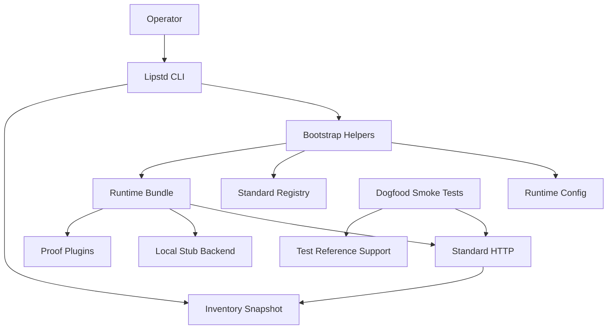
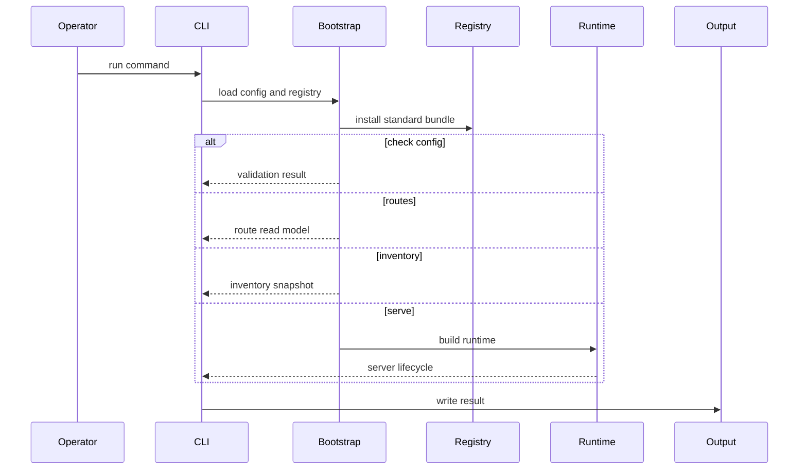
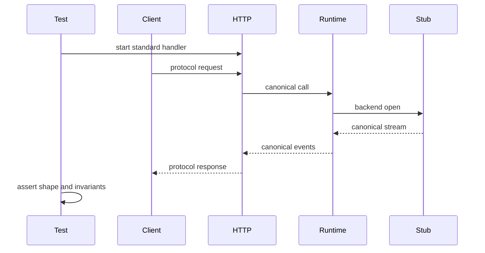

# Design Document

## Overview

This feature turns the existing Go LIP standard distribution into a dogfoodable alpha target for maintainers and early operators. It does not redesign the proxy core; it packages the existing runtime, standard bundle, diagnostics, extension platform, and reference/proof assets into clear command-line workflows, no-key local validation paths, focused smoke tests, and operator documentation.

The design preserves the repository's canonical-middle and streaming-first architecture. New behavior is constrained to standard-distribution composition, diagnostics/read models, test harnesses, a deliberately scoped local stub backend, existing reference feature plugins, and documentation. Core routing, B2BUA continuity, provider adapters, and public canonical contracts remain stable unless explicitly revalidated.

### Goals

- Provide maintainer workflows for `check-config`, `routes`, `inventory`, and `serve` without breaking the existing default serve path.
- Provide a no-key local dogfood path that exercises standard server behavior without importing test-only reference backends into production wiring.
- Add default-suite smoke coverage across the four bundled frontend protocol surfaces.
- Prove extension seams with curated proof plugins and inventory visibility.
- Strengthen diagnostics/startup safety and boundary regression coverage.

### Non-Goals

- Full production hardening beyond alpha-safe startup and diagnostics posture.
- Claims of live-provider parity or exhaustive conformance coverage.
- Broad Python feature ports such as ProxyMem, sandboxing, SSO, CBOR wire capture, or dynamic tool-output compression.
- New pairwise protocol translators or provider SDK use outside existing adapter and refclient boundaries.
- Replacing the existing standard bundle or runtime orchestration architecture.

## Boundary Commitments

### This Spec Owns

- `lipstd` operator commands for config validation, route inspection, inventory inspection, and serving.
- A no-key local dogfood backend surface that is clearly marked as deterministic and non-provider-equivalent.
- Example configs and documentation that guide local dogfood usage and optional live smoke usage.
- Focused smoke tests that exercise the standard server path across OpenAI Responses, OpenAI legacy chat, Anthropic, and Gemini frontend surfaces.
- Proof-plugin hardening for auto-append, tool policy, traffic/usage accounting, and redacted transcript capture.
- Inventory consistency between CLI output and HTTP diagnostics output.
- Startup and config validation for diagnostics exposure on non-local trust boundaries.
- Regression gates for core/plugin/provider-SDK boundaries and dogfood-specific streaming invariants.

### Out of Boundary

- Provider API parity beyond existing conformance matrices and optional live smoke scripts.
- Production-grade memory, verifier, sandbox, dangerous-command, SSO, CBOR capture, and compression features.
- Changing canonical request or event contracts unless a later design explicitly revalidates all frontend/backend adapters.
- Moving routing/failover/B2BUA ownership into feature plugins.
- Importing `internal/refbackend` or `internal/refclient` from production runtime wiring.

### Allowed Dependencies

- `cmd/lipstd` may depend on standard-distribution composition packages: `internal/pluginreg`, `internal/infra/runtimebundle`, `internal/stdhttp`, `internal/core/config`, `internal/core/diag`, and `internal/core/routing`.
- The local stub backend may depend on `pkg/lipapi`, core backend contracts, and standard Go packages only; it must not import provider SDKs or test-only packages.
- Dogfood smoke tests may depend on `internal/refclient` and `internal/refbackend` from `_test.go` files only.
- Feature proof plugins may depend on `pkg/lipsdk` and `pkg/lipapi`; they must not depend on `internal/core` implementation packages.
- Docs may reference existing runtime and extension concepts, but must not imply live-provider parity or production support for deterministic stubs.

### Revalidation Triggers

- Any canonical request/event shape change requires revalidation of all protocol adapters and conformance tests.
- Any change to routing selector semantics, failover, or output-commit behavior requires runtime and dogfood smoke revalidation.
- Any change to diagnostics exposure, metrics, pprof, or secure-session diagnostics requires startup-security and no-secret inventory revalidation.
- Any change to `FeatureBundle` or stage occupancy requires inventory, pluginreg merge, and extension-platform boundary revalidation.
- Any change to standard bundle registration requires mandatory-plugin and config-example validation.

## Architecture

### Existing Architecture Analysis

The repository already has a runnable `cmd/lipstd` path, explicit standard bundle composition, typed runtime config, secure-session startup posture, diagnostic inventory, reference clients/backends for tests, and reference feature plugins. The gap is operator packaging and evidence, not core orchestration. The design therefore extends existing seams instead of introducing a separate app framework or DI container.

Important existing constraints:
- `cmd/lipstd/main.go` currently parses `--config` and immediately boots the server.
- `diag.InventoryHandler` already produces a secret-safe `InventorySnapshot` for HTTP diagnostics.
- `internal/refbackend` and `internal/refclient` are test support and must stay out of production wiring.
- Some broad conformance tests are `integration`-tagged; Stage 5 needs a smaller default-suite smoke set.

### Architecture Pattern & Boundary Map

Selected pattern: explicit composition-root extension of the existing small-core architecture. CLI commands are driving adapters; runtimebundle and stdhttp remain composition/runtime surfaces; local stub is a driven backend adapter; proof plugins remain feature plugins behind SDK seams.



Architecture integration:
- Core-owned behavior remains in `internal/core` and `internal/infra/runtimebundle`.
- CLI behavior remains in `cmd/lipstd` and calls shared read-model helpers rather than reimplementing inventory logic.
- Local stub behavior is a backend plugin with deterministic canonical output, not a provider emulator and not a test-only refbackend import.
- Smoke tests use test-only reference clients/backends only from `_test.go` files.

Optional hexagonal lens:
- Domain policy: routing and secure-session invariants remain existing core policy.
- App/use-case orchestration: command workflows coordinate config load, validation, inspection, and serve startup.
- Driving adapters: CLI commands and HTTP frontends drive runtime behavior.
- Driven adapters: local stub backend and hosted backend plugins produce canonical event streams.
- Composition root: `cmd/lipstd` and `internal/infra/runtimebundle` construct concrete dependencies.
- Query seams: inventory and routes are read models over config, registry, and runtime assembly.

Project boundary answers:
- Core-owned or plugin-owned: routing, B2BUA, diagnostics safety, and legal stage ordering are core/standard-runtime owned; proof behaviors are plugin-owned.
- New canonical concept: no new canonical concept is required; local stub emits existing canonical events.
- Streaming-first: local stub and smoke tests use canonical streams; non-streaming remains frontend collection over streams.
- Provider SDK leakage: production code adds no provider SDK imports; refclients remain `_test.go` support.
- No retry/failover after first output: dogfood smoke adds a standard-server regression for this invariant.
- Secure-session/diagnostics/startup posture: diagnostics secret and local-only exposure rules are explicitly revalidated.
- Extension platform seam: proof plugins use existing session, request transform, tool catalog, tool policy, traffic, usage, capture, redaction, and completion seams.

### Technology Stack

| Layer | Choice / Version | Role in Feature | Notes |
|-------|------------------|-----------------|-------|
| CLI | Go stdlib `flag`, `os`, `encoding/json` | `lipstd` commands and stdout contracts | No new CLI framework |
| Runtime | Existing `runtimebundle` and `stdhttp` | Standard server assembly and serving | Preserve current composition |
| Backend Adapter | New local stub backend plugin | No-key deterministic backend for dogfood | No provider SDKs |
| Diagnostics | Existing `diag.InventorySnapshot` | Shared CLI and HTTP inventory read model | No config payload exposure |
| Tests | Go `testing`, `httptest`, existing refclients/refbackends | Default-suite dogfood smoke | No live credentials by default |
| Docs | Markdown | Operator workflow and migration clarity | Link from README |

## File Structure Plan

### Directory Structure

```text
cmd/lipstd/
  main.go                    # dispatches default serve and explicit subcommands
  commands.go                # command parsing, command names, exit behavior
  bootstrap.go               # shared config, registry, feature merge, and optional runtime build helpers
  routes.go                  # route inspection read model and stdout encoding
  inventory.go               # CLI inventory command using diag snapshot builder
  *_test.go                  # command parsing, validation, routes, and inventory behavior

internal/plugins/backends/localstub/
  plugin.go                  # backend factory and deterministic backend implementation
  config.go                  # typed local stub config validation
  stream.go                  # canonical deterministic event stream generation
  plugin_test.go             # canonical output, usage, tool event, and config tests

internal/pluginreg/
  backends_install.go        # registers optional local-stub backend factory
  standard_table.go          # includes local-stub in standard factory table without making it mandatory
  standard_bundle_test.go    # verifies optional registration and mandatory-set stability

internal/core/diag/
  inventory.go               # exports shared snapshot construction for CLI and HTTP
  inventory_extensions.go    # preserves extension occupancy and privilege reporting
  inventory*_test.go         # CLI and HTTP parity, no-secret output, disabled/error feature rows

internal/core/config/
  diagnostics_security.go    # validates non-local diagnostics protection posture
  diagnostics_security_test.go

internal/stdhttp/
  server.go                  # continues to mount diagnostics and frontends using shared config rules
  dogfood_smoke_test.go      # default-suite standard-server smoke tests across frontends
  security_guard_test.go     # startup safety cases for diagnostics posture

internal/plugins/features/refautoappend/
internal/plugins/features/reftoolpolicy/
internal/plugins/features/reftraffictranscript/
  *_test.go                  # proof behavior tests strengthened for Stage 5

internal/archtest/
  extension_platform_boundaries_test.go  # extended if new local-stub/proof rules need explicit coverage

config/examples/
  local-stub.yaml
  openai-responses-stub.yaml
  openai-legacy-stub.yaml
  anthropic-stub.yaml
  gemini-stub.yaml

docs/
  dogfood-alpha.md           # primary operator workflow for Stage 5
  runtime-flow.md            # link/update for commands and local dogfood path
  plugin-authoring.md        # proof-plugin boundary notes
  feature-migration-map.md   # proof vs deferred Python-era features
README.md                    # short link to dogfood-alpha.md
```

### Modified Files

- `cmd/lipstd/main.go` — keep default serve compatibility while delegating to command dispatch.
- `cmd/lipstd/wiring.go` — reuse mandatory standard-plugin helpers for command validation.
- `internal/core/diag/inventory.go` — add a shared snapshot function consumed by both HTTP handler and CLI command.
- `internal/core/config/validate.go` — call diagnostics exposure validation.
- `internal/stdhttp/server.go` — no broad rewrite; remains the serving path and uses existing diagnostics protection.
- `internal/pluginreg/standard_table.go` — add optional local-stub backend factory.
- `internal/pluginreg/backends_install.go` — wire local-stub backend registration.
- `docs/extension-points.md`, `docs/plugin-authoring.md`, `docs/feature-migration-map.md`, `README.md` — align dogfood and proof-plugin documentation.

## System Flows

### CLI Command Flow



Key decision: read-only commands stop before request serving and avoid live-provider calls. `serve` remains the only command that starts the HTTP listener.

### Dogfood Smoke Flow



Key decision: smoke tests exercise standard HTTP middleware and frontend mounting; broader conformance remains separate.

Dogfood smoke harness commitment:
- The default-suite smoke harness uses the same assembled HTTP handler path as the standard server, not frontend-only mount tests.
- The preferred harness boundary is `stdhttp.RunWithRuntime` behavior factored into a reusable in-process standard-server handler setup, or an equivalent extracted helper that preserves the same middleware stack.
- The smoke harness must include: request ID / trace injection, access logging wrapper, inner panic recovery, transport auth middleware, bundled frontend mounts, effective default-route selection, and diagnostics/security posture checks that affect startup.
- The smoke harness may avoid a real network listener by using `httptest`, but it must not bypass startup validation, `stackHTTPHandler`, or the same frontend/runtime wiring used by `serve`.
- Existing frontend-mount-only tests remain valuable for protocol-specific behavior, but they do not satisfy Stage 5 smoke requirements by themselves.

## Requirements Traceability

| Requirement | Summary | Components | Interfaces | Flows |
|-------------|---------|------------|------------|-------|
| `1.1`, `1.2` | Validate config without serving and surface errors | LipstdCommand, BootstrapPlan | CLI result | CLI Command Flow |
| `1.3` | Show effective routes | RoutesReadModel | CLI JSON or text output | CLI Command Flow |
| `1.4` | Show configured inventory without credentials | InventoryReadModel | `diag.InventorySnapshot` | CLI Command Flow |
| `1.5` | Serve configured protocol surfaces and shutdown | ServeCommand | Existing `stdhttp.RunWithRuntime` | CLI Command Flow |
| `2.1`, `2.2`, `2.3` | No-key local dogfood path and examples | LocalStubBackend, ExampleConfigs | Local stub config | Dogfood Smoke Flow |
| `2.4`, `6.1`, `6.2`, `6.6` | Safe diagnostics posture | DiagnosticsSecurityValidator | Config validation errors | CLI Command Flow |
| `2.5`, `3.6`, `8.1`, `8.4` | Distinguish stub, conformance, live smoke | DogfoodDocs, SmokeHarness | Docs and test gates | Dogfood Smoke Flow |
| `2.6` | Keep test refs out of production wiring | ArchitectureGates, SmokeHarness | `_test.go` import boundary | Dogfood Smoke Flow |
| `3.1`, `3.2`, `3.3`, `3.4` | Four frontend smoke paths | DogfoodSmokeHarness, LocalStubBackend | Refclient test requests | Dogfood Smoke Flow |
| `3.5` | Deterministic smoke failures | DogfoodSmokeHarness | Test diagnostics | Dogfood Smoke Flow |
| `4.1` | First-prompt auto append proof | AutoAppendProof | Existing feature bundle | CLI Command Flow |
| `4.2` | Tool catalog and tool-call policy proof | ToolPolicyProof | `toolcatalog.Filter`, `toolpolicy.Policy` | Dogfood Smoke Flow |
| `4.3` | Traffic and usage accounting proof | TrafficAccountingProof | `traffic.Observer`, `usage.Observer` | Dogfood Smoke Flow |
| `4.4` | Redacted capture proof | RedactedCaptureProof | capture sink and redactor | Dogfood Smoke Flow |
| `4.5` | Disabled proof plugin has no effect | ProofPluginInventory | `InventorySnapshot` | CLI Command Flow |
| `5.1`, `5.2`, `5.6` | Active extension visibility and CLI HTTP parity | InventoryReadModel | `diag.InventorySnapshot` | CLI Command Flow |
| `5.3`, `5.4`, `5.5` | Privilege, error, and no-secret inventory | InventoryReadModel | Inventory JSON | CLI Command Flow |
| `6.3`, `6.4`, `6.5` | Live credential mode, unsafe startup failure, session authority | BootstrapPlan, DiagnosticsSecurityValidator | Config validation | CLI Command Flow |
| `7.1`, `7.2`, `7.3` | Import and SDK boundary guards | ArchitectureGates | Arch tests | None |
| `7.4` | Canonical revalidation after mutation | ExtensionRegressionTests | Hook/stage tests | Dogfood Smoke Flow |
| `7.5` | No retry after visible output | StreamingInvariantSmoke | Runtime smoke test | Dogfood Smoke Flow |
| `8.2`, `8.3`, `8.5` | Route/inventory docs, proof map, doc consistency | DogfoodDocs | Markdown docs | None |

## Components and Interfaces

| Component | Domain/Layer | Intent | Req Coverage | Key Dependencies | Contracts |
|-----------|--------------|--------|--------------|------------------|-----------|
| LipstdCommand | CLI driving adapter | Dispatch commands and standardize exit behavior | 1.1-1.5 | BootstrapPlan P0 | Service |
| BootstrapPlan | Composition helper | Share config, registry, feature merge, and optional build steps | 1.1-1.5, 6.3-6.4 | config P0, pluginreg P0, runtimebundle P1 | Service |
| RoutesReadModel | CLI read model | Present effective default route and enabled backend targets | 1.3, 8.2 | config P0, pluginreg P1 | Service |
| InventoryReadModel | Diagnostics read model | Produce one inventory snapshot for CLI and HTTP | 1.4, 4.5, 5.1-5.6 | diag P0, pluginreg P1 | Service API |
| LocalStubBackend | Driven backend adapter | Provide deterministic no-key canonical streams | 2.1-2.5, 3.1-3.6 | lipapi P0, execbackend P0 | Service |
| DogfoodSmokeHarness | Test harness | Verify frontend protocol paths through standard server | 3.1-3.6, 7.5 | stdhttp P0, refclient P1 | Batch |
| ProofPluginSet | Feature plugins | Demonstrate extension seams without core feature logic | 4.1-4.5 | lipsdk P0 | Service |
| DiagnosticsSecurityValidator | Config safety | Fail unsafe diagnostics exposure before serving | 2.4, 6.1-6.6 | config P0 | Service |
| ArchitectureGates | Test guardrails | Prevent boundary regressions | 2.6, 7.1-7.4 | archtest P0 | Batch |
| DogfoodDocs | Documentation | Provide operator and migration guidance | 2.5, 8.1-8.5 | docs P1 | State |

### CLI and Composition

#### LipstdCommand

| Field | Detail |
|-------|--------|
| Intent | Dispatch `check-config`, `routes`, `inventory`, and `serve` while preserving default serve compatibility |
| Requirements | 1.1, 1.2, 1.3, 1.4, 1.5 |

Responsibilities and constraints:
- Parse command name and `--config` without introducing a third-party CLI framework.
- Keep `lipstd --config <path>` equivalent to serve unless explicitly changed in docs and tests.
- Return non-zero exit outcomes for validation and startup failures.

Service interface:
```go
type CommandName string

const (
    CommandServe       CommandName = "serve"
    CommandCheckConfig CommandName = "check-config"
    CommandRoutes      CommandName = "routes"
    CommandInventory   CommandName = "inventory"
)

type CommandOptions struct {
    Name       CommandName
    ConfigPath string
    Output     io.Writer
    ErrorOut   io.Writer
}

func RunCommand(ctx context.Context, opts CommandOptions) int
```

Preconditions:
- `ConfigPath` points to a readable YAML file.
- `Output` and `ErrorOut` default to process stdout/stderr when nil.

Postconditions:
- Read-only commands do not start request serving.
- Serve starts the same runtime path currently used by `cmd/lipstd`.

#### BootstrapPlan

| Field | Detail |
|-------|--------|
| Intent | Centralize shared standard-distribution setup so commands do not duplicate bootstrap logic |
| Requirements | 1.1, 1.2, 1.4, 1.5, 6.3, 6.4 |

Responsibilities and constraints:
- Load and validate config, model aliases, standard registry, mandatory factories, feature surface, and logger setup according to command needs.
- Build runtime only when serving or when an inspection command explicitly requires built state.
- Avoid backend request execution during read-only commands.

Service interface:
```go
type BootstrapMode int

const (
    BootstrapInspect BootstrapMode = iota
    BootstrapServe
)

type BootstrapResult struct {
    Config        *config.Config
    Registry      *pluginreg.Registry
    Registrations []lipsdk.Registration
    FeatureSurface pluginreg.MergedFeatureSurface
    App           *runtime.App
    Built         *runtimebundle.Built
}

func BuildBootstrap(ctx context.Context, configPath string, mode BootstrapMode) (BootstrapResult, error)
```

### Read Models

#### RoutesReadModel

| Field | Detail |
|-------|--------|
| Intent | Provide deterministic route inspection for CLI and documentation |
| Requirements | 1.3, 8.2 |

Service interface:
```go
type RoutesSnapshot struct {
    EffectiveDefaultRoute string       `json:"effective_default_route"`
    Backends              []RouteBackend `json:"backends"`
    ModelAliases          []RouteAlias   `json:"model_aliases"`
}

type RouteBackend struct {
    ID      string `json:"id"`
    Kind    string `json:"kind"`
    Enabled bool   `json:"enabled"`
}
```

The snapshot is a config/registry read model. It does not execute routing attempts or contact providers.

#### InventoryReadModel

| Field | Detail |
|-------|--------|
| Intent | Share one secret-safe inventory snapshot between HTTP diagnostics and CLI inventory |
| Requirements | 1.4, 4.5, 5.1, 5.2, 5.3, 5.4, 5.5, 5.6 |

Service interface:
```go
func InventorySnapshotForConfig(ctx context.Context, cfg *config.Config, extras *diag.InventoryExtras) (diag.InventorySnapshot, error)
```

Constraints:
- Config payloads remain opaque and are never serialized.
- Bundle errors are surfaced as error strings tied to plugin rows.
- CLI inventory and HTTP inventory use the same snapshot builder.

### Backend Adapter

#### LocalStubBackend

| Field | Detail |
|-------|--------|
| Intent | Provide deterministic no-key canonical backend behavior for local dogfood and smoke tests |
| Requirements | 2.1, 2.2, 2.3, 2.5, 3.1, 3.2, 3.3, 3.4, 3.6 |

Responsibilities and constraints:
- Emit canonical text, usage, and optional tool-call events from static config.
- Support streaming-first execution by returning a canonical event stream.
- Be disabled unless configured; not part of mandatory standard distribution requirements.
- Identify itself as deterministic local dogfood support, not a provider emulator.

Compatibility contract:
- Factory kind: `local-stub`.
- Typical runtime instance ID in examples: `local-stub` or `local-stub-primary`.
- Default model exposed in examples: one deterministic model ID such as `stub-default`, used consistently by routes, examples, and smoke tests.
- Required capabilities: streaming and non-streaming text completion; usage emission support; optional tool-call event emission when configured.
- Non-goals: multimodal provider emulation, provider-specific error fidelity, authentication semantics beyond local dogfood, or parity claims with any hosted backend family.

Service contract:
```go
type Config struct {
    Text         string `yaml:"text"`
    InputTokens  int    `yaml:"input_tokens"`
    OutputTokens int    `yaml:"output_tokens"`
    ToolName     string `yaml:"tool_name"`
}
```

Validation:
- Empty text defaults to a deterministic assistant message.
- Token counts must be non-negative.
- Tool event fields are optional and only emitted when configured.

### Proof Plugins

#### ProofPluginSet

| Field | Detail |
|-------|--------|
| Intent | Curate existing reference plugins as proof of extension boundaries |
| Requirements | 4.1, 4.2, 4.3, 4.4, 4.5, 8.3 |

Proof mapping:
- `refautoappend` proves session-open and request-transform behavior.
- `reftoolpolicy` proves tool catalog filtering and emitted tool-call policy behavior.
- `reftraffictranscript` proves traffic observation, usage observation, capture, and redaction.
- `refverifier` remains optional proof for completion-gate and auxiliary seams when configured.

Constraints:
- Proof plugins stay disabled unless configured.
- Proof plugins must not import `internal/core` implementation packages.
- Capture proof writes only redacted data.

### Safety and Guardrails

#### DiagnosticsSecurityValidator

| Field | Detail |
|-------|--------|
| Intent | Reject unsafe diagnostic exposure before serving traffic |
| Requirements | 2.4, 6.1, 6.2, 6.4, 6.6 |

Rules:
- Health checks may remain unauthenticated when configured.
- Attempts, inventory, route trace, pprof, metrics, model diagnostics, and secure-session summaries require `diagnostics.shared_secret` unless the listener and access posture are local-only.
- Existing shared-secret length validation remains unchanged.

Protected surface matrix:

| Surface | Local-only posture with empty secret | Non-local posture with empty secret | Secret-protected posture |
|---------|--------------------------------------|-------------------------------------|--------------------------|
| `health` | allowed | allowed | allowed |
| `attempts` | allowed | rejected at startup | allowed |
| `inventory` | allowed | rejected at startup | allowed |
| `route_trace` | allowed | rejected at startup | allowed |
| `metrics` | allowed | rejected at startup | allowed |
| `pprof` | allowed | rejected at startup | allowed |
| model catalog diagnostics | allowed | rejected at startup | allowed |
| secure-session summaries | allowed only when separately enabled | rejected at startup | allowed |

#### ArchitectureGates

| Field | Detail |
|-------|--------|
| Intent | Keep dogfood support from weakening core/plugin/provider boundaries |
| Requirements | 2.6, 7.1, 7.2, 7.3, 7.4, 7.5 |

Validation scope:
- Production `cmd/lipstd` and standard bundle do not import `internal/refbackend` or `internal/refclient`.
- `pkg/lipsdk` and `pkg/lipapi` do not import core internals or provider SDKs.
- `internal/core` does not import concrete plugins or provider SDKs.
- Dogfood smoke includes a no-retry-after-visible-output regression.

## Data Models

### Domain Model

No new business aggregate is introduced. The feature adds operator read models and deterministic local backend output over existing canonical calls and events.

### Logical Data Model

- `RoutesSnapshot`: derived from config, model aliases, and standard default model metadata.
- `InventorySnapshot`: existing diagnostic read model shared by CLI and HTTP.
- `LocalStubBackend.Config`: static deterministic backend behavior for local dogfood.

### Data Contracts & Integration

CLI output contracts:
- `inventory` emits the same JSON structure as HTTP inventory.
- `routes` emits a small JSON route read model.
- `check-config` emits human-readable success or validation error text; error details also appear on stderr.

No persistent storage schema is added.

## Error Handling

### Error Strategy

- Config and startup validation errors fail fast before serving.
- CLI read-only command failures return non-zero exits and actionable stderr messages.
- Smoke test failures identify frontend protocol and backend path.
- Inventory build errors are represented in plugin rows rather than causing inventory to omit the plugin.

### Error Categories and Responses

- User/operator errors: invalid config, unknown command, unsafe diagnostics posture, invalid local-stub config.
- System errors: runtime build failure, server listen failure, diagnostics handler construction failure.
- Boundary errors: forbidden imports, provider SDK leakage, test-only ref support imported by production code.

## Testing Strategy

### Unit Tests

- `cmd/lipstd`: command parsing, default serve compatibility, `check-config` success/failure, routes output without serving, inventory output using shared snapshot.
- `internal/plugins/backends/localstub`: config defaults, invalid token counts, canonical text stream, usage event emission, optional tool-call event sequence.
- `internal/core/config`: diagnostics exposure validation for loopback/non-loopback, metrics, pprof, inventory, route trace, and secure-session summaries.
- `internal/core/diag`: CLI and HTTP inventory snapshot parity and no-secret output.
- Existing proof plugins: auto-append first logical request, tool policy catalog and emitted tool denial, traffic/usage/capture redaction behavior.

### Integration Tests

- `internal/stdhttp`: default-suite dogfood smoke for OpenAI Responses, OpenAI legacy chat, Anthropic, and Gemini frontends against local stub or test refbackend path.
- Standard server smoke includes middleware stack enough to exercise auth/diagnostics/startup behavior, not only frontend mount helpers.
- Config example validation for every file under `config/examples`.
- Standard bundle registration tests ensure local-stub is available but not mandatory.

### Regression and Architecture Tests

- Architecture tests prevent `internal/refbackend` and `internal/refclient` imports outside `_test.go` support paths.
- Boundary tests continue to prevent provider SDK imports in `pkg/lipapi`, `pkg/lipsdk`, and `internal/core`.
- Runtime dogfood smoke asserts no transparent retry/failover after client-visible output has started.
- Mutation-stage tests verify canonical validation after proof-plugin mutations.

## Security Considerations

- Diagnostics, metrics, profiling, and secure-session summaries are sensitive operator surfaces. Non-local exposure without `diagnostics.shared_secret` is rejected before serving.
- Inventory output is metadata-only: plugin IDs, factory kinds, enabled states, stage occupancy, privileges, and bundle errors. It does not include plugin config payloads, API keys, local keys, resume tokens, diagnostic secrets, or raw captures.
- Local stub configs are safe by default and bind to loopback in examples.
- Live-provider smoke remains optional and environment-gated.

## Performance & Scalability

- CLI read-only commands avoid serving and provider calls; they perform config, registry, and feature-bundle inspection only.
- Local stub backend is deterministic and in-memory; it is not a performance benchmark target.
- Dogfood smoke tests are intentionally smaller than the full conformance matrix to keep default test runs fast.

## Supporting References

- `.kiro/specs/go-stage-five-dogfood-alpha-extension-proof/research.md` — gap analysis and discovery findings.
- `.kiro/steering/product.md` — product identity, canonical middle, and extension boundaries.
- `.kiro/steering/tech.md` — stack, provider SDK policy, and startup-security defaults.
- `.kiro/steering/structure.md` — package ownership and test-only reference support boundaries.
- `docs/extension-points.md` — extension stage vocabulary and inventory expectations.
- `docs/plugin-authoring.md` — feature plugin boundary expectations.
- `docs/feature-migration-map.md` — proof vs deferred Python-era features.
