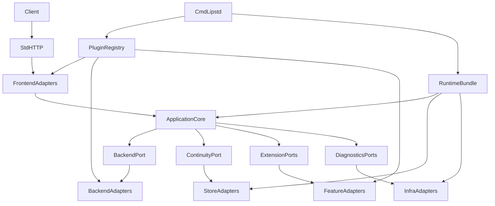
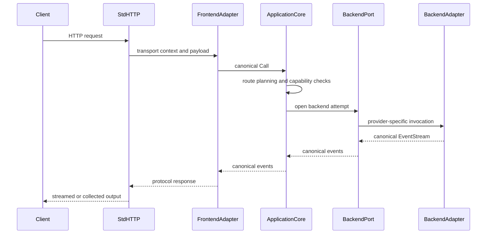
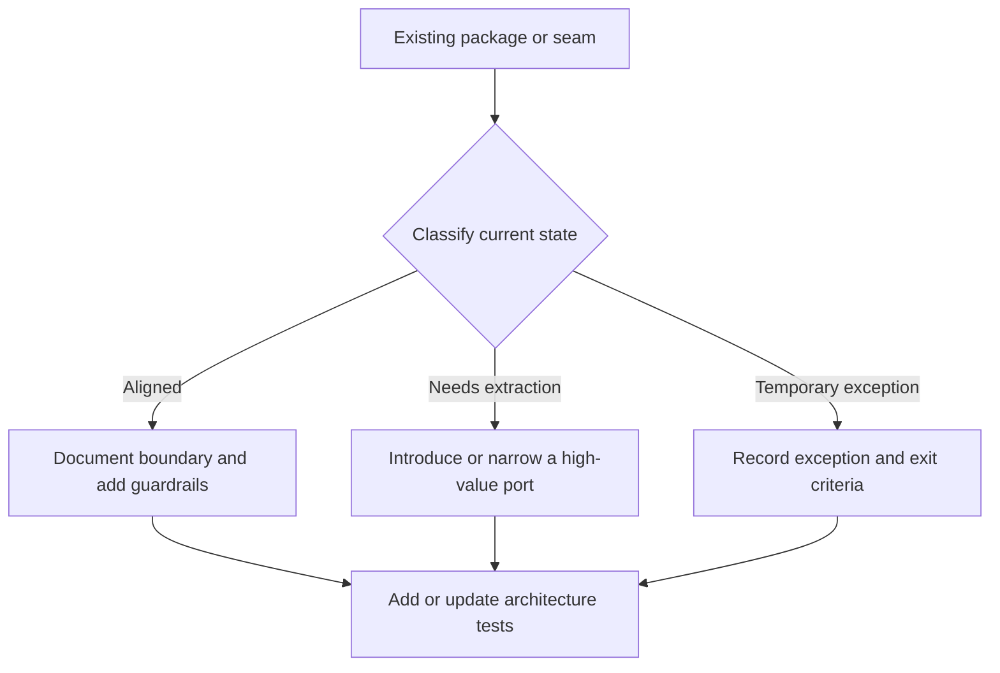

# Design - Introduce Hexagonal Architecture

Spec name: `introduce-hexagonal-architecture`

## Overview
This design formalizes the existing Go LLM Interactive Proxy as a pragmatic hexagonal architecture without forcing a textbook package rewrite. The work focuses on making the current core-plus-adapters shape explicit, tightening a few high-value seams, and extending architecture guardrails so future development does not recreate the Python LIP coupling trap.

The target users are maintainers and plugin authors who need a stable, testable way to evolve routing, streaming, continuity, auth, storage, and plugin integration behavior. The feature changes the current system by documenting and enforcing core policy ownership, adapter boundaries, and explicit composition rules while preserving the current runtime structure where it is already healthy.

The design intentionally favors dependency direction and ownership over textbook package taxonomy. It does not require a repo-wide `app/domain/adapters` split, a generic `ports` bucket, or interface extraction for every seam. Where an existing concrete service, function seam, or frozen contract already gives the core a clean boundary, the design keeps it.

### Goals
- Make the current core/adapters split explicit in hexagonal terms.
- Preserve routing, streaming, continuity, and canonical translation semantics while improving boundary clarity.
- Introduce only selective new ports where current seams are too runtime-shaped or too coupled.
- Expand architecture tests so the intended dependency direction is mechanically enforceable.

### Non-Goals
- Broad directory renaming into `app/domain/adapters` for appearance alone.
- Rewriting existing working runtime, routing, or streaming behavior without a clear coupling benefit.
- Introducing DI containers, reflection-driven assembly, or native Go plugins.
- Moving protocol legality, provider semantics, or transport concerns into the core.

## Requirements Traceability

| Requirement | Summary | Components | Interfaces | Flows |
|-------------|---------|------------|------------|-------|
| 1.1-1.6 | Define the application core and keep it transport/provider-agnostic | Core Boundary Map, Runtime Executor Boundary | Boundary map contract, executor boundary contract | Request execution flow |
| 2.1-2.5 | Keep driving adapters at the system edge | Driving Adapter Map | Transport/decode/encode ownership contract | Request/response edge flow |
| 3.1-3.8 | Keep outbound integrations behind stable consumer-owned seams | Port Rationalization Plan | Port inventory and classification rules | Core-to-adapter invocation flow |
| 4.1-4.6 | Maintain inward dependency direction and explicit wiring | Composition Roots, Architecture Guardrails | Composition root contract, guardrail policy | Bootstrap flow |
| 5.1-5.5 | Preserve product-defining proxy semantics | Runtime Executor Boundary | Canonical stream + retry/commit constraints | Request execution flow |
| 6.1-6.6 | Support safe incremental migration | Migration Classifier | Classification and exception register rules | Incremental migration flow |
| 7.1-7.6 | Improve testability and cross-cutting discipline | Driving Adapter Map, Architecture Guardrails | Cross-port context rules, contract test rules | Cross-cutting concern flow |
| 8.1-8.7 | Adopt a pragmatic rather than ceremonial hexagonal model | Core Boundary Map, Port Rationalization Plan, Architecture Guardrails | Port-creation decision rule | Incremental migration flow |

## Architecture

### Existing Architecture Analysis
The repository already follows many of the right structural instincts. `internal/core/runtime/executor.go` owns routing, negotiation, continuity, and backend-attempt orchestration. `internal/stdhttp/server.go` keeps transport middleware, diagnostics mounting, and frontend registration at the edge. `cmd/lipstd/main.go` and `internal/infra/runtimebundle/build.go` already use explicit composition instead of hidden framework assembly.

The main weakness is not missing architecture but incomplete formalization. Some seams are expressed through runtime-shaped structs or registry/bundle details rather than clearly named application-owned ports, and the existing architecture tests only prove part of the desired dependency rule.

### Architecture Pattern & Boundary Map
**Selected pattern:** Pragmatic hexagonal architecture over the existing package map.

**Architecture Integration:**
- Selected pattern: ports-and-adapters around the existing canonical orchestration core.
- Domain/feature boundaries: `internal/core/*` remains the policy and orchestration center; `pkg/lipapi` remains the stable canonical contract surface adjacent to the core; transport/provider/storage/integration concerns remain at the edge.
- Existing patterns preserved: canonical-in-the-middle, streaming-first execution, explicit composition, plugin-first extensibility, no provider SDKs in core.
- New components rationale: mostly documentation, seam rationalization, and architecture-test expansion rather than new runtime subsystems.
- Steering compliance: preserves small core, core-owned routing/failover/B2BUA, provider isolation, and no pairwise translators.
- Seam placement rule: any newly named internal seam should live near the consuming capability or other narrowly scoped boundary, not in a repo-wide `ports` or `interfaces` package.



**Key decisions**
- Treat `pkg/lipapi` as the canonical public contract surface adjacent to the core, not as the policy core itself.
- Treat `internal/core/*` as the application core that owns orchestration and policy decisions without requiring new package names.
- Treat `internal/stdhttp/` and `internal/plugins/frontends/*` as driving adapters.
- Treat backend plugins, continuity store implementations, transport-auth providers, and observability integrations as driven adapters.
- Keep `cmd/lipstd/`, `internal/pluginreg/`, and `internal/infra/runtimebundle/` as explicit composition roots and assembly helpers.
- Prefer consumer-owned seams that may be small interfaces, function-typed contracts, or narrow frozen structs; do not require interface extraction where an existing seam already gives the core replaceability and testability.
- Prefer concrete use-case services for inbound calls from driving adapters unless multiple real consumers justify an inbound interface.

### Technology Stack

| Layer | Choice / Version | Role in Feature | Notes |
|-------|------------------|-----------------|-------|
| Core contracts | Go 1.26.x + `pkg/lipapi` | Canonical request/event model and core-owned semantics | Existing stable center; no new dependency |
| Application core | `internal/core/*` | Routing, executor, continuity, stream, extensions | Existing package family formalized as the core |
| Driving adapters | `internal/stdhttp`, frontend plugins | Transport/auth/decode/encode edge | Existing structure preserved |
| Driven adapters | backend plugins, continuity stores, observability infra | Upstream/provider/store integration | Existing structure preserved, with selective seam clarification |
| Composition | `cmd/lipstd`, `internal/pluginreg`, `internal/infra/runtimebundle` | Explicit wiring and lifecycle ownership | Remains explicit; no DI container |
| Verification | `internal/archtest`, package tests, integration tests | Enforce dependency direction and boundary rules | Expanded rather than replaced |

## System Flows

### Request Execution Under the Hexagonal Model


Key decisions
- Transport auth, protocol decode, and protocol encode stay at the edge.
- Core policy remains the sole owner of route planning, pre-output recovery, and output-commit rules.
- Outbound adapters only translate between core contracts and infrastructure/provider contracts.

### Incremental Migration Flow


Key decisions
- Migration is classifier-driven, not package-churn-driven.
- Existing healthy seams stay in place and are formalized.
- Exceptions are explicit and reviewable rather than hidden in core packages.

## Components and Interfaces

| Component | Domain/Layer | Intent | Req Coverage | Key Dependencies (P0/P1) | Contracts |
|-----------|--------------|--------|--------------|--------------------------|-----------|
| Core Boundary Map | Architecture/Core | Define which packages are inside the application core and which are adapters | 1.1-1.6, 8.1-8.5 | Steering docs (P0), current package map (P0) | Service, State |
| Runtime Executor Boundary | Core | Preserve executor/routing/continuity ownership and isolate adapter concerns | 1.1-1.6, 5.1-5.5 | `internal/core/runtime` (P0), `internal/core/routing` (P0) | Service |
| Driving Adapter Map | Driving adapters | Define transport/auth/decode/encode ownership | 2.1-2.5, 7.3-7.4 | `internal/stdhttp` (P0), frontend plugins (P0) | Service, API |
| Port Rationalization Plan | Core/Adapter boundary | Identify which seams need explicit ports and which can stay as-is | 3.1-3.8, 8.3-8.7 | current seam inventory (P0), pluginreg/runtimebundle (P1) | Service, State |
| Composition Roots | Assembly | Keep construction explicit and outward-facing | 4.1-4.6 | `cmd/lipstd` (P0), `runtimebundle` (P0), `pluginreg` (P0) | Service |
| Migration Classifier | Architecture process | Classify packages as aligned, extract, or exception | 6.1-6.6 | package inventory (P1), follow-up tasks (P1) | State |
| Architecture Guardrails | Verification | Enforce dependency direction and contract visibility | 4.5-4.6, 7.1-7.5, 8.4 | `internal/archtest` (P0), package tests (P0) | Batch, State |

### Core / Architecture

#### Core Boundary Map

| Field | Detail |
|-------|--------|
| Intent | Define the project-specific meaning of the hexagon without directory churn |
| Requirements | 1.1, 1.2, 1.5, 1.6, 8.1, 8.2, 8.5 |

**Responsibilities & Constraints**
- Declare `pkg/lipapi` as the canonical public contract surface that carries versionable request, event, capability, and error shapes.
- Declare `internal/core/*` as the application and orchestration core that owns routing, failover eligibility, continuity, stream commitment, and extension-stage policy.
- Declare `internal/stdhttp/` and frontend plugins as driving adapters.
- Declare backend plugins, continuity stores, transport-auth providers, and observability integrations as driven adapters.
- Keep composition roots outside the core.
- Keep provider SDK types, transport types, and process wiring details out of `pkg/lipapi` and `internal/core/*`.

##### Boundary Clarification: `pkg/lipapi` vs `internal/core/*`

| Surface | Role | Allowed additions | Forbidden additions |
|---------|------|-------------------|---------------------|
| `pkg/lipapi` | Stable canonical contract surface adjacent to the core | Canonical request/event/capability/error concepts that must be visible across adapters or SDK seams | Orchestration policy, route-planning logic, provider SDK types, transport middleware types, composition helpers |
| `internal/core/*` | Policy and orchestration core | Executor logic, routing, continuity, extension-stage orchestration, capability negotiation, internal coordination helpers | Concrete frontend/backend/plugin imports, provider SDK types, transport/server types, global wiring |

This separation is intentional: the architecture story does not require every core-adjacent type to live under `internal/core`, but it does require all policy decisions to remain there. `pkg/lipapi` is a contract boundary, not a place to relocate orchestration concepts for architectural symmetry.

**Dependencies**
- Inbound: steering files - architecture truths (P0)
- Outbound: design and architecture tests - enforce declared ownership (P0)
- External: none

**Contracts**: Service [x] / API [ ] / Event [ ] / Batch [ ] / State [x]

##### Service Interface
```text
Boundary Map Contract
- Input: package family and responsibility classification
- Output: one of {application core, driving adapter, driven adapter, composition root, support-only}
- Preconditions: package purpose is documented
- Postconditions: allowed dependencies are explicit
- Invariants: classification never moves transport/provider semantics into the core
```

**Implementation Notes**
- Integration: encoded in design docs, steering updates if needed, and architecture tests.
- Validation: import-boundary tests prove the declared map remains true.
- Risks: becoming too abstract; keep the map tied to concrete packages already in use.

#### Runtime Executor Boundary

| Field | Detail |
|-------|--------|
| Intent | Preserve executor, routing, stream, and continuity packages as core-owned orchestration |
| Requirements | 1.1-1.5, 5.1-5.5 |

**Responsibilities & Constraints**
- Keep route planning, failover eligibility, attempt lineage, and no-post-output-failover rules inside `internal/core/runtime` and related core packages.
- Keep provider SDK, transport, and storage details out of executor logic.
- Allow selective extraction of clearer ports only where current seams are too runtime-shaped.

**Dependencies**
- Inbound: canonical call/event contracts from `pkg/lipapi` - request/stream semantics (P0)
- Outbound: backend seam, continuity store, extension snapshot services (P0)
- External: none directly; no provider SDK imports (P0)

**Contracts**: Service [x] / API [ ] / Event [ ] / Batch [ ] / State [ ]

##### Service Interface
```text
Executor Boundary Contract
- Input: canonical Call + request context + runtime snapshot
- Output: canonical EventStream or classified error
- Preconditions: call validates, context is non-nil, runtime snapshot is immutable per request
- Postconditions: route planning, negotiation, and recovery decisions stay in core
- Invariants: no transparent retry after visible output; canonical stream remains primary path
```

**Implementation Notes**
- Integration: preserve `runtime.Executor`, `routing`, `extensions`, and related core packages as the policy center.
- Validation: regression tests around retry/commit behavior and import tests around core purity.
- Risks: over-extracting ports can make stream orchestration harder to follow.

### Driving Adapters

#### Driving Adapter Map

| Field | Detail |
|-------|--------|
| Intent | Make transport/auth/decode/encode ownership explicit at the edge |
| Requirements | 2.1-2.5, 7.3, 7.4 |

**Responsibilities & Constraints**
- Keep HTTP middleware, auth challenges, protocol decode, protocol encode, and diagnostics mounting outside the core.
- Ensure frontends convert transport payloads into canonical calls and canonical events back into legal protocol output.
- Prevent transport concerns from leaking into core-facing contracts.

**Dependencies**
- Inbound: client protocols over HTTP (P0)
- Outbound: core execution entrypoint (P0)
- External: transport-auth providers and diagnostics middleware (P1)

**Contracts**: Service [x] / API [x] / Event [ ] / Batch [ ] / State [ ]

##### API Contract
| Method | Endpoint | Request | Response | Errors |
|--------|----------|---------|----------|--------|
| HTTP | frontend-specific mounts | protocol request | protocol stream or non-stream response | protocol-legal 4xx/5xx |

**Implementation Notes**
- Integration: keep `internal/stdhttp` as transport wiring and frontend packages as decode/encode adapters.
- Validation: handler integration tests should assert canonical boundary entry and legal protocol output.
- Risks: auth or validation logic creeping into core if transport context is not carefully bounded.

#### Core-Facing Request Context Contract

| Field | Detail |
|-------|--------|
| Intent | Define the transport-agnostic context data that may cross from the edge into the core |
| Requirements | 3.1-3.3, 7.3, 7.4 |

**Responsibilities & Constraints**
- Allow only transport-agnostic request metadata to cross into the core and plugin-visible execution context.
- Reuse existing stable SDK/context snapshots where possible instead of introducing HTTP-shaped types.
- Keep raw `http.Request`, `http.ResponseWriter`, and transport-auth implementation details outside the core.

**Dependencies**
- Inbound: transport auth middleware and frontend mounts (P0)
- Outbound: `internal/core/execctx`, `pkg/lipsdk/execview`, `pkg/lipsdk/session`, `pkg/lipsdk/workspace` (P0)
- External: OpenTelemetry and request middleware at the transport edge (P1)

**Contracts**: Service [x] / API [ ] / Event [ ] / Batch [ ] / State [x]

##### State Management
- State model: immutable request-scoped view bundle attached to context
- Persistence & consistency: copied snapshots only; no transport-owned mutable references cross the boundary
- Concurrency strategy: request-scoped values are immutable after attachment

##### Service Interface
```text
Core-Facing Context Contract
- Allowed fields: request trace ID, attempt lineage identifiers, principal summary and claims, session view, workspace view, route preferences, and correlation annotations
- Current stable carriers: `pkg/lipsdk/execview.PrincipalView`, `pkg/lipsdk/execview.AttemptView`, `pkg/lipsdk/session.SessionView`, `pkg/lipsdk/workspace.WorkspaceView`, and `internal/core/execctx.Views`
- Forbidden fields: raw HTTP request or response objects, auth-provider implementation types, frontend protocol payloads, provider SDK handles
- Ownership: transport extracts and normalizes; core consumes typed snapshots only
```

**Implementation Notes**
- Integration: keep auth providers in the transport edge and surface only normalized principal/attempt/session/workspace views into the core-facing context packages.
- Validation: architecture tests and targeted package tests should verify that core-facing context packages do not import `net/http` beyond transport-only seams.
- Risks: adding convenience transport fields later can reopen coupling unless the context contract remains explicit.

### Core / Adapter Boundary

#### Port Rationalization Plan

| Field | Detail |
|-------|--------|
| Intent | Decide which seams become explicit ports and which remain acceptable as existing seams |
| Requirements | 3.1-3.6, 8.3-8.5 |

**Responsibilities & Constraints**
- Inventory current seams such as backend execution, continuity store access, transport-auth principal propagation, extension-service facades, and observability sinks.
- Retain seams that are already low-coupling and well-owned.
- Extract or rename only seams that currently force adapters to depend on runtime internals or obscure core ownership.
- Define any new seam from the consuming core package or capability boundary, not from an adapter package.
- Allow a seam to stay as a concrete type or function contract when that shape is already sufficient for substitution and tests.

**Dependencies**
- Inbound: core packages that consume outward capabilities (P0)
- Outbound: backend adapters, store adapters, auth providers, extension services (P0)
- External: none

**Contracts**: Service [x] / API [ ] / Event [ ] / Batch [ ] / State [x]

##### State Management
- State model: seam inventory with classification `{keep, extract, exception}`
- Persistence & consistency: design artifact first; later reflected in tasks and tests
- Concurrency strategy: not runtime state; no shared mutable process registry beyond existing explicit roots

##### Starter Seam Classification Baseline

| Seam | Current owner / shape | Classification | Rationale | Exit criteria |
|------|------------------------|----------------|-----------|---------------|
| Backend execution (`runtime.Backend`) | `internal/core/runtime` struct consumed by `runtimebundle` and `pluginreg` | `extract` | It is a true outbound boundary, but its current name and placement are runtime-shaped rather than clearly owned as an executor-consumed seam | `pluginreg` no longer needs to import the main executor package only to name the backend seam; extraction may be a dedicated seam package or promotion of the existing narrow contract if that gives the same ownership clarity |
| Continuity store (`b2bua.Store`) | Core-owned store seam opened by composition | `keep` | Already expresses a real core-facing store boundary with low coupling and no transport/provider leakage | Keep unless a concrete coupling problem appears |
| Principal propagation (`httpauth` -> `execctx.Views`) | Transport auth normalizes into typed views | `keep` | Existing typed view model is already transport-agnostic enough for the core if kept narrow | Keep the allowed-field contract explicit and prevent raw HTTP types from crossing inward |
| Extension runtime services (`RequestRuntimeSnapshot`) | Core snapshot wiring exposing state, workspace, auxiliary, traffic, and request services | `extract` | The snapshot is useful, but some consumers may depend on a broader service bundle than they need | Split only where a consumer is forced to depend on unrelated capabilities; cohesive grouped facades may remain if they preserve clarity and testability |
| Observability sinks and route observers | Mixed core hooks plus infra-backed observers | `extract` | Good existing seam, but ownership and allowed metadata need a clearer contract for long-term guardrails | Keep the current observer seam if its metadata contract is already sufficient; otherwise narrow the emitted contract without pushing logging or transport concerns into the core |
| Registry standard-table coupling to runtime types | `internal/pluginreg` imports `internal/core/runtime` | `exception` | Acceptable short-term because standard composition is explicit, but it weakens the cleanest ports-and-adapters story | Exception is either retired by backend seam extraction or explicitly retained as a permanent bounded composition-only dependency with a dedicated architecture test |

##### Extract Seam Target Decisions

| Seam | Owning package | Internal or SDK-facing | Minimum contract shape | Allowed import direction | Migration stop condition |
|------|----------------|------------------------|------------------------|--------------------------|--------------------------|
| Backend execution | Executor-owned seam adjacent to `internal/core/runtime` and consumed by the executor path | Internal-only | Minimal backend contract with capability description and canonical attempt-open semantics; this may remain a narrow struct-of-functions if that is the clearest stable shape | `runtimebundle`, `pluginreg`, and backend adapters may depend on the seam package or contract; the seam must not depend on concrete backends, transport packages, or routing policy packages outside executor consumption | `pluginreg` and runtime assembly code can construct backend adapters without importing the main executor package only for backend contract naming |
| Extension runtime services | Narrowed contracts published from `internal/core/extensions` near the consuming service families | Internal-only | Per-service contracts only where consumers need less than the current snapshot bundle; cohesive grouped facades may remain when they map to one stable capability family | Feature adapters depend on service-specific contracts or approved grouped facades; service contracts depend only inward to core-friendly types | Feature adapters no longer receive unrelated capabilities just because the snapshot bundle is convenient |
| Observability sinks and route observers | Internal core/infra seam adjacent to diagnostics and executor observation | Internal-only | Observer contract carrying request ID, trace ID, attempt lineage, route decision summary, and redacted annotations only, unless the current SDK seam already expresses that contract adequately | Core emits observer contracts; infra adapters consume them; no transport or provider payload types flow back inward | Route/traffic observer implementations compile against a stable observer contract without importing broader executor internals |

**Implementation Notes**
- Integration: likely high-value candidates are backend execution, continuity store, auth/principal context, and selected extension services.
- Validation: architecture tests should target dependency direction at the seam, not just package names.
- Risks: extracting too many ports creates interface ceremony; extracting too few leaves coupling hidden.

### Composition / Verification

#### Composition Roots

| Field | Detail |
|-------|--------|
| Intent | Keep explicit wiring outside the core and prevent hidden assembly backdoors |
| Requirements | 4.1-4.6 |

**Responsibilities & Constraints**
- Preserve `cmd/lipstd`, `internal/pluginreg`, and `internal/infra/runtimebundle` as the concrete assembly path.
- Prevent creation of alternate global registries, lazy singleton assembly, or inward dependency on concrete adapters.
- Allow the composition root to depend on adapters and the core; do not allow the inverse.

**Dependencies**
- Inbound: config loading and process startup (P0)
- Outbound: plugin registry, runtime bundle, stdhttp, logger/tracing/metrics infra (P0)
- External: process environment and OS signal handling (P1)

**Contracts**: Service [x] / API [ ] / Event [ ] / Batch [ ] / State [ ]

##### Service Interface
```text
Composition Root Contract
- Input: config, registry, feature surface, infra options
- Output: assembled runtime, HTTP server wiring, closers, and lifecycle ownership
- Preconditions: registry and config are validated
- Postconditions: no hidden adapter construction remains inside core logic
- Invariants: composition is explicit, static, and testable
```

**Implementation Notes**
- Integration: preserve the current `cmd/lipstd -> pluginreg -> runtimebundle -> stdhttp` flow.
- Validation: extend current guardrail tests around registry ownership and forbidden hidden composition.
- Risks: tightening seams here requires care so standard-bundle assembly stays understandable.

#### Migration Classifier

| Field | Detail |
|-------|--------|
| Intent | Provide an incremental migration plan instead of a rewrite plan |
| Requirements | 6.1-6.6 |

**Responsibilities & Constraints**
- Classify existing components as already aligned, needing seam extraction, or temporary exceptions.
- Record the reason for each exception and the target follow-up.
- Keep migration tied to real coupling reduction rather than aesthetic package changes.

**Dependencies**
- Inbound: current package inventory (P0)
- Outbound: future task plan and exception register (P1)
- External: none

**Contracts**: Service [ ] / API [ ] / Event [ ] / Batch [ ] / State [x]

##### State Management
- State model: architecture migration register by package or seam
- Persistence & consistency: design artifact and follow-up tasks
- Concurrency strategy: not applicable

##### Initial Migration Register

| Package / Seam | Status | Why | Expected follow-up |
|----------------|--------|-----|--------------------|
| `pkg/lipapi` | `aligned` | Already stable, canonical, and provider-agnostic | Preserve as-is; guard against SDK leakage |
| `internal/core/runtime` and `internal/core/routing` | `aligned` | Already own product-defining orchestration semantics | Preserve ownership and add stronger dependency tests |
| `internal/stdhttp` | `aligned` | Already acts as transport edge and middleware host | Keep out of core and validate edge-only concerns |
| `internal/plugins/frontends/*` | `aligned` | Already decode and encode around canonical contracts | Preserve as driving adapters |
| `internal/plugins/backends/*` | `aligned` | Already localize provider SDK usage | Preserve as driven adapters |
| `internal/infra/runtimebundle` | `extract` | Assembly is explicit, but backend and extension service seams it wires are more runtime-shaped than desired | Repoint high-value seams to clearer core-owned internal ports while preserving explicit wiring |
| `internal/pluginreg` | `exception` | Explicit composition root helper, but currently depends on runtime backend seam | Keep bounded until backend seam extraction lands or formally ratify as a permanent composition-only exception |
| `internal/core/extensions` runtime services | `extract` | Useful platform surface, but port inventory is not yet explicit enough | Clarify service ownership and allowed adapter dependencies |

##### Exception Register

| Exception | Owner | Exact allowed dependency | Justification | Guardrail test | Exit trigger |
|-----------|-------|--------------------------|---------------|----------------|-------------|
| `internal/pluginreg` may import the current backend seam while standard bundle composition remains explicit | Core/runtime maintainers | `internal/pluginreg` -> backend seam contract only; no wider dependency on executor policy packages | Standard bundle assembly is explicit and bounded, and this dependency exists only to register/build backend adapters | Add or extend `internal/archtest` to permit only the named backend seam import while continuing to forbid broader `internal/core` leakage from composition helpers | Retire when backend seam extraction is complete; otherwise convert to a documented permanent composition-only allowance with the same narrow scope |

**Implementation Notes**
- Integration: produce a package/seam inventory during tasks, not by renaming everything up front.
- Validation: each extracted seam should reduce one identified dependency problem.
- Risks: exception registers becoming a dumping ground if not time-bounded.

#### Architecture Guardrails

| Field | Detail |
|-------|--------|
| Intent | Turn the target architecture into mechanically checked rules |
| Requirements | 4.5, 4.6, 7.1-7.5, 8.4 |

**Responsibilities & Constraints**
- Extend current import-boundary tests to cover stricter hexagonal rules.
- Verify that adapters depend on core contracts or explicitly allowed seams rather than runtime internals where the design calls for extraction.
- Keep tests focused on significant boundary violations rather than trivial naming-style checks.
- Avoid guardrails that require inbound interfaces, forced package renames, or one-interface-per-adapter ceremony.

**Dependencies**
- Inbound: design decisions and package map (P0)
- Outbound: `internal/archtest`, targeted integration tests (P0)
- External: `go list`-based dependency inspection (P1)

**Contracts**: Service [ ] / API [ ] / Event [ ] / Batch [x] / State [x]

##### Batch / Job Contract
- Trigger: CI, local `go test`, architecture review gates
- Input / validation: package dependency graph, forbidden import rules, seam ownership rules
- Output / destination: failing tests with actionable boundary errors
- Idempotency & recovery: deterministic repeated checks over the same tree

##### Dependency Rule Matrix

| Package family | Allowed dependencies | Forbidden dependencies | Guardrail intent |
|----------------|----------------------|------------------------|------------------|
| `pkg/lipapi` | stdlib, canonical support packages | provider SDKs, `internal/stdhttp`, concrete plugins | Keep canonical contracts stable and provider-agnostic |
| `pkg/lipsdk` | stdlib, stable SDK subpackages | provider SDKs, concrete plugins, `internal/stdhttp` middleware types | Keep plugin-facing SDK stable and transport-neutral except dedicated transport SDK packages |
| `internal/core/*` | `pkg/lipapi`, `pkg/lipsdk`, internal core packages, explicitly approved support seams | `internal/stdhttp`, concrete frontends, concrete backends, concrete feature plugins, provider SDKs | Keep core as the policy center |
| `internal/stdhttp` | core contracts, runtimebundle outputs, transport auth providers, diagnostics and infra helpers | concrete backend SDK types, provider semantics in handlers | Keep HTTP concerns at the edge |
| `internal/plugins/frontends/*` | `pkg/lipapi`, `pkg/lipsdk` where needed, core execution entrypoints | direct provider SDK imports, backend plugin imports, transport-global mutable state | Keep frontends as driving adapters only |
| `internal/plugins/backends/*` | `pkg/lipapi`, `pkg/lipsdk` where needed, official provider SDKs, adapter-local helpers | `internal/stdhttp`, concrete frontend imports, core policy packages beyond stable seams | Keep provider logic at the edge |
| new internal seam packages | consuming core capability, canonical contracts, narrow support types | generic repo-wide `ports/interfaces/services` buckets, concrete adapters, transport packages, provider SDKs | Keep seams close to their owning capability and prevent architecture theater |
| `internal/pluginreg` | plugin factories, config decoding support, the named backend seam exception only | broader `internal/core/*` imports beyond the allowed backend seam, hidden singletons, `init()`-driven standard wiring | Keep composition explicit and confine the exception to one seam |
| `internal/infra/runtimebundle` | config, infra clients, continuity store seam, request-runtime service seams, executor-owned backend seam, metrics/tracing helpers | concrete frontend packages, transport middleware packages, hidden singletons, broad imports of unrelated core policy packages | Keep runtime assembly explicit while depending only on the seams it wires |

Exception policy
- Guardrails must treat exceptions as named, narrowly scoped allowances rather than open-ended exemptions.
- Every exception must declare an owner, an exact permitted dependency edge, and an exit trigger.
- If an exception becomes a permanent design choice, the design must say so explicitly and architecture tests must codify the final allowed scope.

**Implementation Notes**
- Integration: build on `internal/archtest/extension_platform_boundaries_test.go` and related guardrails.
- Validation: add only rules that correspond to explicit design decisions.
- Risks: overfitting tests to transient package names rather than enduring ownership rules.

##### Recommended First Guardrail Additions

The first implementation slice should add only guardrails that enforce already-observed architectural intent:

1. `internal/pluginreg` may import the backend seam package only, and no broader `internal/core/*` packages.
2. `internal/infra/runtimebundle` may import the backend seam package and other named core support seams it wires, but not unrelated core policy packages.
3. `pkg/lipapi` and `pkg/lipsdk` must remain free of provider SDK imports and transport-server package imports.
4. New internal seam packages, if introduced, must not depend on concrete adapters or provider SDKs.
5. Architecture tests must not fail solely because a driving adapter uses a concrete core service instead of an inbound interface.

## Data Models

### Domain Model
This feature does not introduce new runtime business entities. Its "domain" is the architectural model of the proxy itself:
- application core
- driving adapters
- driven adapters
- composition roots
- support-only packages
- seam classifications `{keep, extract, exception}`

The core business invariants remain the existing proxy invariants:
- canonical-in-the-middle translation
- streaming-first execution
- no transparent failover after visible output
- core-owned routing, continuity, and recovery policy

### Logical Data Model
**Structure Definition**
- `ArchitectureBoundary`: package family, role, allowed dependencies, forbidden dependencies.
- `SeamClassification`: seam name, current owner, current consumers, target status, rationale.
- `MigrationException`: package or seam, coupling description, justification, exit criteria.

**Consistency & Integrity**
- Each package family has one declared architectural role.
- Each new explicit port must correspond to a real coupling or substitution problem.
- Each exception must have an owner and a follow-up reason.

### Data Contracts & Integration
This feature is primarily about Go package and interface contracts, not wire payloads.
- Core-facing contracts stay in canonical/core language.
- Adapter-facing translations remain local to the adapter packages.
- Read-only admin, diagnostics, and reporting paths may use dedicated query DTOs and query adapters when that is simpler than forcing write-side repository shapes.
- Architecture-test inputs are package patterns and forbidden dependency rules.

## Error Handling

### Error Strategy
This feature does not add end-user error surfaces. It adds design and verification rules.
- Design-time violations: captured as unmet traceability, missing ownership decisions, or unsupported exception entries.
- Test-time violations: surfaced through failing architecture tests with specific dependency or ownership messages.
- Runtime behavior: unchanged except where later tasks intentionally extract a seam and preserve existing behavior.

### Monitoring
Success is monitored through:
- architecture test coverage growth
- reduction of runtime-internal coupling at selected seams
- no regression in executor, routing, streaming, or continuity behavior during migration tasks

## Testing Strategy

### Unit Tests
- Extend import-boundary tests for core purity and seam ownership.
- Add seam-specific tests where a new port replaces a runtime-shaped dependency.
- Add tests that allow dedicated query/read adapters without requiring them to masquerade as aggregate repositories.
- Add regression tests for any classifier or architecture-rule evaluator introduced by implementation tasks.

### Integration Tests
- Verify standard distribution assembly still works after any seam extraction.
- Verify transport auth and frontend mounting continue to operate through the edge path.
- Verify executor, routing, and continuity semantics remain unchanged after boundary tightening.

### Performance/Load
- No new performance target is introduced by this design itself.
- Any seam extraction in hot paths must be proven allocation-neutral or operationally insignificant during implementation review.

## Risks & Mitigations
- Risk: over-rotating into a textbook package rewrite. Mitigation: require every move to justify a real dependency or ownership improvement.
- Risk: weakening routing, streaming, or continuity semantics while reshaping seams. Mitigation: treat core proxy invariants as explicit non-regression gates.
- Risk: creating interface ceremony with little benefit. Mitigation: extract only high-value ports and allow good existing seams to remain.
- Risk: creating a generic `ports` layer that becomes a new dumping ground. Mitigation: keep seams near the consuming capability and reject repo-wide architecture buckets without a clear ownership reason.
- Risk: architecture tests that chase naming instead of ownership. Mitigation: write tests around dependency direction and forbidden imports, not aesthetics.

## Supporting References
- `cmd/lipstd/main.go`
- `internal/infra/runtimebundle/build.go`
- `internal/stdhttp/server.go`
- `internal/core/runtime/executor.go`
- `internal/pluginreg/standard_table.go`
- `internal/archtest/extension_platform_boundaries_test.go`
- `AGENTS.md`
- `.kiro/steering/structure.md`
- `.kiro/steering/tech.md`
- `.kiro/steering/api-standards.md`
- `.kiro/steering/routing-and-orchestration.md`
