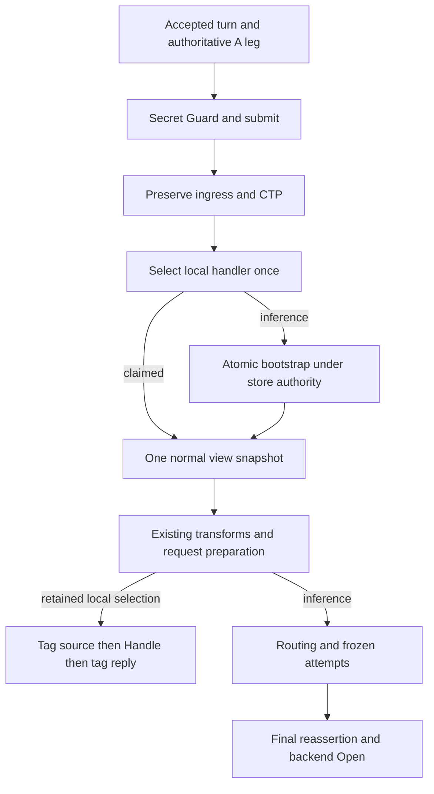

# Model-specific persistent system steering

## Overview

Materialize the approved #735 plan as a small producer of existing conversation-view steering. One atomic store decision selects ordered overlays before the first eligible inference snapshot. Empty and ambiguous decisions freeze too; already-used unmarked A-legs are skipped. Storage failure rejects before provider execution.

### Goals
- First-turn model visibility, lifetime reinjection, atomic Memory/SQLite/PostgreSQL persistence and untouched client truth.
- Reuse canonical projection and adapters; no new dependencies or public contracts.

### Non-Goals
The Deferred list in `requirements.md` remains outside this slice. Task 1 creates no follow-up issues or production/test edits.

## Boundary Commitments

### This Spec Owns
- Feature config and immutable pure ordered matching in `internal/plugins/features/modelsystemprompt`.
- Concrete producer composition/store adaptation in `internal/standardplugins/featurehost`.
- Generic invocation order, retained local decision and routing-owned logical identity in `internal/core/runtime`.
- Atomic batch/completion in `internal/infra/conversationview`, with existing continuity allocation authority for activation eligibility.

### Out of Boundary
No public SDK plane, metadata session opener extension, provider surgery, new planner/terminal protocol, money seam or cache policy. Projection and adapters change only for a proven in-scope correction.

### Allowed Dependencies
Feature logic uses canonical/SDK steering types and stdlib only; it does not import core or SQL. Featurehost imports the concrete matcher and internal persistence/core ports. Core consumes its own generic port, never the concrete feature. Generic runtimebundle forwards typed CorePorts; it does not import or branch on the feature. Conversation persistence remains the SQL adapter; continuity remains B-leg authority.

### Revalidation Triggers
Changes to selector compilation/leaf shapes, override freezing, local Match/Handle ordering, store wrappers, continuity allocations, schema/migrations, generation publication, fast-path census, client recording or pre-Open projection require affected consumer checks.

## Architecture

### Seams Reused and source findings
- `routing.CompileSelector` (`internal/core/routing/compile.go:19`) resolves aliases, parses and defaults model-only backends without candidate selection/native binding. `Primary.Model` (`selector.go:50`) is logical; `NativeModel` is wire identity. Frontend default route comes from `config.EffectiveDefaultRouteSelector`.
- `prepareSubmitAndALegSecure` currently snapshots at `executor_prepare_secure.go:625`, then applies `routeAuth` at 720; use a separate frozen effective-intent clone before the snapshot rather than raw working selector.
- `prepareRequest` currently calls `runLocalTurnStage` at `executor_prepare_request.go:211` after projection. Split selection from execution; `local_turn.go:143-167` supplies existing Match/error/claim validation semantics and 168-210 supplies tag/Handle/reply semantics.
- `snapshotAndProject` (`conversation_view.go:77`) is the one normal read. Existing final reassertion, snapshot propagation and adapter contracts remain authoritative.
- `steering.Writer` only commits one Put at a time. The new optional internal batch/completion capability is necessary for 3.1-3.3; neither a loop of Put calls nor an attempt hook is atomic/early enough.
- `MemoryStore.NextBLeg` (`b2bua/store.go:331`) mutates `legState.nextSeq` under its existing mutex before attempt records exist. `LoadAttempts` cannot establish absence of allocations.
- Bun `NextBLeg` (`continuity/bunstore/store.go:248`) owns `a_legs.next_b_seq`; PostgreSQL increments with UPDATE RETURNING. Conversation-view PG locking uses that same A-leg row; its current SQLite lock helper is only a SELECT and is insufficient for the new operation.
- `CorePorts` (`featurehost/inputs.go:60`) is existing internal wiring; `build_large_body_assessor.go:103-110` currently recognizes only interleaved/terminal steering producers.

### Project Boundary Questions
Matching/policy is feature-owned; routing intent and invocation ordering are core-owned. No new canonical concept or provider SDK dependency is introduced. Streaming/non-stream collection and no retry after first client-visible output stay unchanged. Secure-session admission and privacy are preserved; bootstrap errors use existing authority release/finalization. No backend is opened during decision computation.



Local Handle remains at its established later preparation seam. Selection is retained even when it declines; no second Match pass. Preserve existing transform/recorder ordering, and the one model-view binding, rather than introducing another model registry/catalog snapshot.

## File Structure Plan

### New Files (names below are proposed, not existing APIs)
- `internal/plugins/features/modelsystemprompt/config.go`, `matcher.go` — strict validation, compiled immutable rules, ordered SDK PutRequest values; adjacent focused tests.
- `internal/core/runtime/conversation_bootstrap.go` — consumer-owned generic callback port and pure logical intent extraction; adjacent runtime regression tests.
- `internal/core/b2bua/inference_history.go` — optional allocation-authority callback on MemoryStore, no feature knowledge; adjacent allocation race schedule tests.
- `internal/infra/conversationview/bootstrap.go`, `reference_bootstrap.go`, `bun_bootstrap.go` — internal contract, staged memory publication and durable transaction; extend existing store contract suites.
- `internal/core/continuity/bunstore/20261008000000_conversation_bootstrap.go` — forward migration registration and dual-dialect completion DDL.
- `internal/standardplugins/featurehost/model_system_prompt.go` — concrete generation producer and Memory authority adaptation; adjacent composition tests.
- `docs/model-system-prompt.md` — short operator guide/config example.

### Modified Files / bounded areas
- `internal/core/runtime/local_turn.go`, `executor_prepare_secure.go`, `executor_prepare_detached.go`, `executor_prepare_request.go`, `executor_config.go` — retained Match selection, pre-snapshot bootstrap and generic dependency.
- `internal/standardplugins/featurehost/inputs.go`, `runtime.go`, `process.go`, `generation.go`, `conversation.go` — process authority binding, generation composition, CorePorts and optional capability forwarding.
- `internal/infra/runtimebundle/candidate_options.go`, `build_large_body_assessor.go` and existing executor construction files — forward generic port, conservative census occupancy, no concrete feature import.
- `internal/infra/conversationview/bun_store.go`, `internal/core/continuity/bunstore/20250426000000_continuity_baseline.go` — EnsureSchema and forward-migration registration only; do not change historical migration bodies.
- Existing continuity decorators that wrap Memory authority, standard feature registration/config validation and dbparity schema/store suites — preserve optional capability reachability and migration contracts.
- Existing runtime conversation-view/reassertion/client-record tests, host generation/fast-path tests and OpenAI/Anthropic/Gemini family tests — extend behavioral cases, not a new matrix.
- `docs/conversation-view.md` and the existing tracked config example — link the guide/show registration; no broad documentation rewrite.

## Components and Interfaces

| Component | Package | Intent | Requirements |
|---|---|---|---|
| Config and matcher | `internal/plugins/features/modelsystemprompt` | Validate/compile and emit ordered immutable requests | 1.1, 1.2, 1.3, 1.4, 1.5 |
| Intent and local selection | `internal/core/runtime` | One Match, authoritative logical intent, pre-snapshot invocation | 2.1, 2.2, 2.3, 2.4, 2.5 |
| Atomic store and allocation authority | `conversationview`, `b2bua` | Frozen completion, all-or-nothing batch, shared-engine authority | 3.1, 3.2, 3.3, 3.4, 3.5 |
| Existing projection and truth boundaries | runtime, conversationprojection, family adapters | Reinjection/reassertion, hidden client truth and bounded evidence | 4.1, 4.2, 4.3, 4.4, 4.5 |
| Generation producer and delivery | featurehost, generic runtimebundle, docs | Immutable compile, removal persistence, conservative fallback | 5.1, 5.2, 5.3, 5.4 |

### Generic runtime port (proposed internal exported surface)

```go
type InitialModelIntent struct {
    Model string
    Ambiguous bool
}
type ConversationBootstrap func(
    context.Context, string,
    func() (InitialModelIntent, error),
) error
```

The string is authoritative A-leg ID. Runtime captures accepted selector plus frozen override in the lazy pure intent resolver. The producer invokes it only inside the store decision callback; completed/preexisting decisions do not resolve or match again. Nil port means disabled. Featurehost supplies the closure through CorePorts and executor construction. There is no feature-name switch or runtime service lookup.

Intent compilation uses the same alias resolver/default backend as routing. Traverse every `Selector.Alternatives` primary, parallel target, weighted target and nested weighted parallel target; collect trimmed `Primary.Model` values. One distinct value yields Model; multiple yield Ambiguous; malformed/unresolved/empty intent rejects through existing request errors without a completion. Do not call PrepareSelector with a native resolver, health/credential selection, weighted choice or B-leg allocation. Later backend transforms/preferences do not reseat the initial decision.

### Local selection and preparation

Retain handler, validated MatchResult, Meta and validated source tag requests on request-local identity state. Preserve handler ordering, nil skipping, pre-claim FailOpen continuation/FailClosed rejection and no fallback after claim. Select against the preserved ingress after submit/CTP, before bootstrap/snapshot; do not inspect projected steering. Preserve required-tagger failure. Later Handle consumes that retained selection with source tagging before Handle, panic/error/reply validation, reply tagging before release and tag-result merge without rereading model/view state. Failure at the moved seam releases request authority as the existing fail-after-admit path does.

Secure and detached paths each invoke the same generic seam before their normal snapshot. Detached parent lineage never becomes the bootstrap target. Preserve ingress/CTP before injection; any client recorder receiving backend workingCall must instead receive preserved client truth when the behavioral regression proves contamination, without changing backend accounting.

### Atomic persistence contract (internal, optional)

Add `BootstrapSteering(ctx, aLegID, producerID, decide)` to an optional conversation-store capability, not to public Store/Writer contracts. `decide` is synchronous bounded pure/no-I/O computation returning bounded outcome/model evidence and an ordered batch of existing `PutSteeringRequest`; the result contains completion/reuse evidence and existing mutation states needed for observations. No observer runs inside the authority/transaction. Featurehost adapts SDK PutRequests using existing canonical conversion/validation; no public batch API is introduced.

Authority order is: completion lookup first; reuse if present; otherwise authoritative allocation-history check; preexisting history commits zero overlays/`preexisting_skip` without calling decide; otherwise call decide; validate the whole batch including collisions/shared capacity; stage slots/revisions using existing Put semantics; publish overlays and completion together. The owner key is `model-system-prompt`, independent of generation or config hash. No-match/ambiguous completion leaves projection revision/content unchanged; empty markers do not fabricate steering mutations. Failed transactions may evaluate again; a committed decision never does.

Memory's conversation store and B2BUA store are separate authorities. Add the optional MemoryStore method `WithBLegAllocationAuthority(ctx context.Context, aLegID string, apply func(hasAllocated bool) error) error`: validate existence/TTL and hold the same mutex used by NextBLeg while invoking the synchronous memory-store operation. `hasAllocated` is `legState.nextSeq > 0` (conservative even if ID allocation failed), not `LoadAttempts`. Lock order is B2BUA mutex then ReferenceStore mutex; no callback calls back into continuity, no I/O/observers under either lock, and retirement notifications stay after unlock. ReferenceStore stages cloned leg state then publishes batch+marker under its existing mutex. This is existing store authority, not a feature-owned process cache/lock.

Bun obtains both history and conversation state inside one transaction on the existing continuity database. PG locks `a_legs` with SELECT of `next_b_seq` FOR UPDATE. SQLite's FIRST transactional statement is a no-op UPDATE of the target A-leg (`SET next_b_seq = next_b_seq`) to acquire a write reservation BEFORE any completion/history/state read; it changes no sequence or projection revision. Only then read completion/history and perform the batch. This works across independent DB handles without depending on DSN `_txlock`. Missing row, busy/storage/cancellation errors reject with rollback; do not retry only the callback or continue with a stale read. Existing NextBLeg writes serialize against the reservation/row lock.

Featurehost validates enabled prerequisites before publication: atomic store, reader, authoritative Memory allocation capability or a Bun conversation store on the SAME authoritative continuity database. Unknown/mismatched custom-store pairings fail explicitly; never guess from empty steering. Forward optional capability through `autoRegisteringConversationStore` and applicable continuity decorators; registration errors propagate for the new operation, rather than being ignored. Do not auto-create a synthetic durable authoritative A-leg to hide a missing one.

## Data Model and lifecycle

- Memory: completion map in existing `legView`; producer key maps bounded outcome/count/model evidence, not another plaintext payload. Memory publication preserves nextSlot/revisions exactly on failure.
- Bun: `a_leg_steering_bootstrap` keyed `(a_leg_id, producer_id)`, outcome, matched_count and bounded logical model evidence; FK to `a_legs` ON DELETE CASCADE. Existing overlay table owns text. Forward migration plus EnsureSchema/schema verification extend existing continuity/conversation-view dbparity entries; no new runtime registry.
- Bounded model evidence is diagnostic only, not a second matching key; use a fixed maximum byte bound and valid UTF-8 truncation/omission. No model metric labels, prompt text or raw digests.

| State/resource | Depends on | Owner | Quiesce / final release |
|---|---|---|---|
| Compiled rules/producer closure | validated store capability | immutable generation | existing manager pin/drain/retire; no overlay deactivation |
| Completion/overlays | authoritative A-leg | existing conversation store | existing retirement observer or FK cascade, not generation retirement |
| Memory history authority | B2BUA leg state | existing MemoryStore | lexical lock release; retired callback after unlock |
| Bun transaction | borrowed process DB | existing process DB owner | lexical rollback/commit; producer never closes DB |
| Backend emission | successful preparation/snapshot | existing attempt owner | irreversible; existing commitment prevents transparent recovery after output |

Concurrent schedule: A and B arrive unmarked with different frozen generations/intents. The authority winner commits its decision; the loser reads completion and never calls decide. If pre-feature NextBLeg wins first, bootstrap skips. If bootstrap wins first, NextBLeg waits and sees a committed decision before backend preparation continues. Intermediate write/capacity failure releases authority with unchanged batch state. Reload compiles without writing A-leg state; rejected candidate remains inert.

Alternatives rejected: no change misses first-turn steering; repeated Writer.Put has partial commits; candidate hooks are too late; a process cache cannot coordinate independent durable handles; generic plane/DI/lifecycle machinery adds unnecessary public scope. Adopt existing projection and SQL transaction mechanisms; add only the private callback/batch needed by the first consumer.

## Error Handling and Observability

Enabled config/prerequisite errors reject candidate construction. Bootstrap storage/capacity/collision errors fail closed before backend Open using existing request release/finalize. Ambiguity and preexisting inference are successful empty decisions, not guessed steering. Observe attempted/failed and committed matched/no-match/skip/reuse outcomes content-free; overlay creation observations occur only after successful commit and retain existing mutation accounting. Sanitize validation/storage errors so append bytes never reach ordinary diagnostics.

## Testing Strategy

Behavioral tasks use claim/source/mutant tables, RED then GREEN. Reuse store, runtime projection/reassertion, generation/fast-path and family suites; no documentation shape pins or new feature-specific architecture scanner.
- Config tables: no/single/multiple/order, exact append preservation, invalid field/ID/regex/text/bounds (1.1-1.5).
- Shared Memory/SQLite/PG contract: callback-free reuse, zero marker, first winner/order, feature-ID collision, capacity with other producers, intermediate rollback including slots/revisions, allocation-history versus unrecorded attempts, retirement, SQLite reopen and independent-handle contention; PG independent handles mandatory (2.5, 3.1-3.5).
- Runtime seam: first/later visibility, default/alias/override/logical-native distinction, mixed leaves, Match exactly once, claimed local then first inference, secure/detached owner isolation, failure releases, one normal view read/no attempt bootstrap (2.1-2.4, 4.1).
- Reload/fallback: match/no-match/ambiguous/preexisting freeze, new legs new rules, invalid reload isolation, removal retains overlays, first-turn wire fallback once and stored-steering blocker after removal (5.1-5.3).
- Three-turn prefix with original instructions; ingress/CTP/continuation/structural recorder/output exclusion versus PTB inclusion; retry/failover/parallel snapshot and late-removal reassertion; three bounded provider-family sentinels and plaintext-absent diagnostics (4.1-4.5).

Canonical inner-loop commands: `make dev-test PKGS='<owned packages>'`, `make dev-build PKGS='<owned packages>'` (and scoped dev-lint when needed). Final sequential gates: `make regex-hotpath-check`, `make quality-checks`, `make test`, `make test-db-parity`; PostgreSQL must be usable, not skipped. TMPDIR `/home/mateusz/.cache/tmp/opencode/feature-735` is verified ext4. Docs smoke: scoped build of `./cmd/lipstd` then `go run ./cmd/lipstd --help`. Remote `race-fuzz-nightly.yml` supports an input `ref`; final-SHA race evidence requires authorized dispatch and that exact tested SHA. Never run local race or claim absent remote evidence.

## Configuration and delivery

Use existing `plugins.features` registration ID `model-system-prompt`, outer `enabled: true`, config `rules` list. Compile enabled registrations before publication; default disabled. Do not silently trim append text or introduce per-turn rendering. Explain remote model disclosure and explicit PTB plaintext captures in the guide. Budget: at most 1,500 non-test Go lines/about 40 files, tests about 2x production, hard 100 modified Go files; split/reassess rather than override. No push/PR/merge/commit is authorized for this design task.
