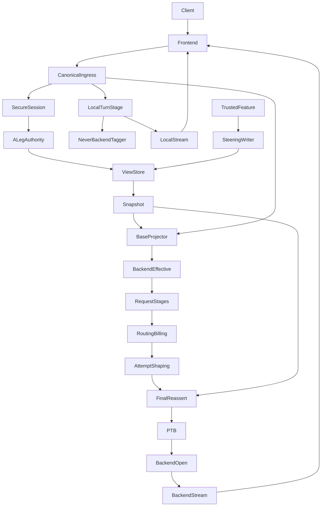
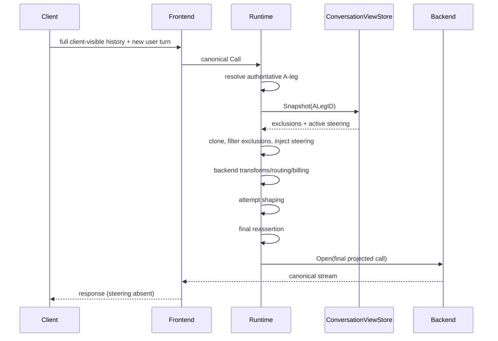
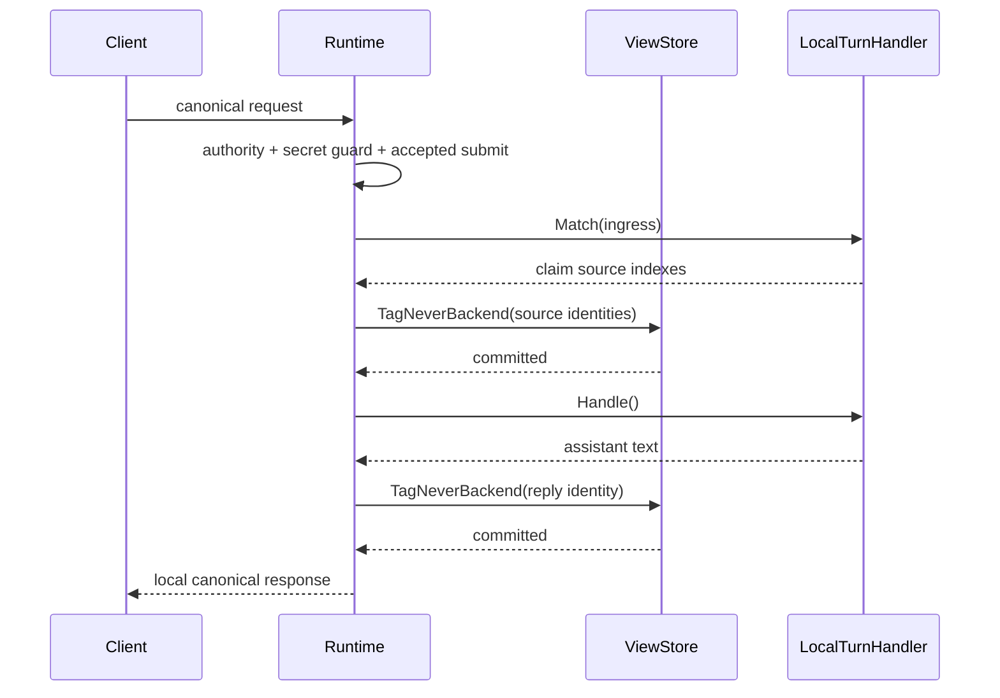
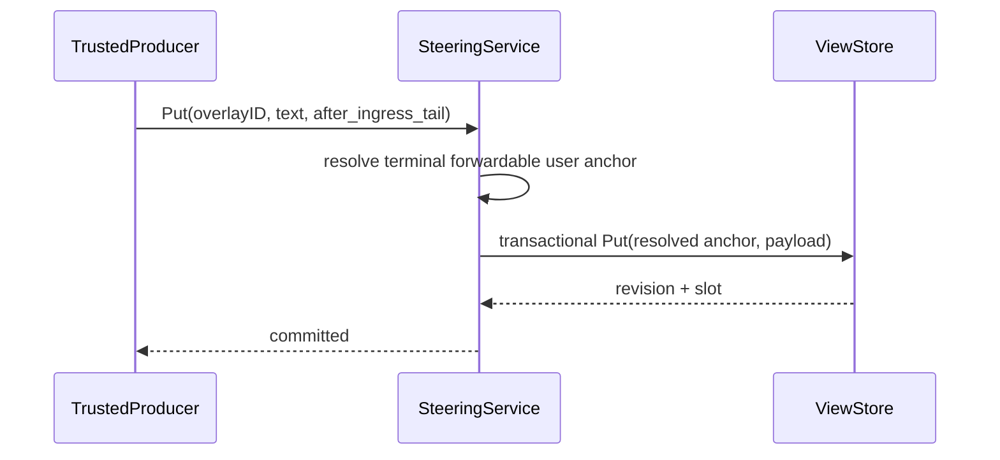
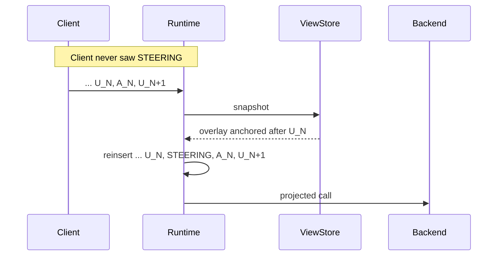
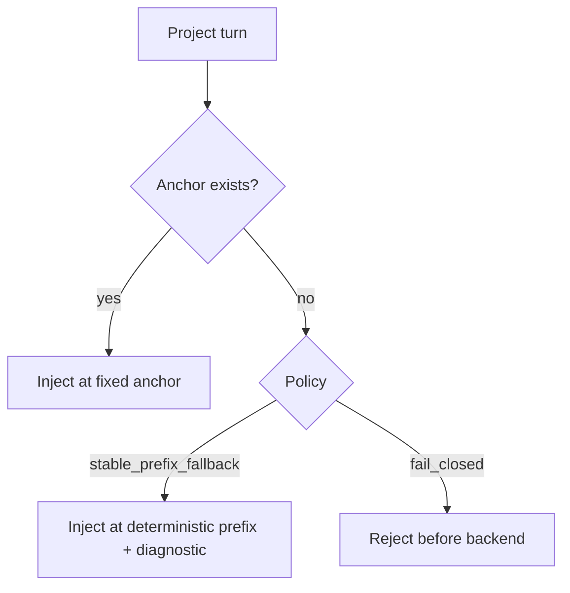

# Design Document
## Overview
This feature introduces a protocol-neutral **conversation-view projection** for proxy-owned content at the A-leg/B-leg boundary.
The projection supports two opposite visibility directions:
- **client-visible / backend-hidden (`never_backend`)** — complete messages remain part of A-leg/client truth, but their semantic identities are persisted and those messages are removed from every inference B-leg;
- **backend-visible / client-hidden (persistent steering)** — complete proxy-owned steering messages never enter client responses or client continuation history, but their payload and placement are persisted under the authoritative A-leg and reconstructed on every applicable B-leg.
The hidden-steering path adds a critical constraint: because the client never sees the steering, it cannot return it on later turns. The proxy therefore owns both the message and its placement. Placement is deliberately cache-aware. An unchanged steering revision must stay at a fixed model-visible location as conversation history grows, so the projection remains append-only/prefix-stable across normal turns. A moving-tail reinjection is expressly not acceptable.
The central model is:
```text
A-leg/client truth                         B-leg/model truth
------------------                         -----------------

client-visible normal msg  ───────────────> client-visible normal msg

client-visible local msg   ───── X
(proxy command/notice)             \
                                    \  removed by projection

backend-only steering      <not present> ─> injected by proxy state
```
### Architectural invariants
**I1 — Never-backend safety**
> A complete message whose `never_backend` identity is committed for an authoritative A-leg MUST NOT occur in any PTB payload or backend `Open` call for that A-leg.
**I2 — Backend-only invisibility**
> A persistent steering overlay MUST NOT be emitted through client frontend responses, CTP payload augmentation, or proxy continuation recording merely because it is model-visible.
**I3 — Steering completeness**
> Every active steering overlay in the frozen logical-turn snapshot MUST occur exactly once in every applicable final backend-facing call, or the call MUST fail before PTB/Open.
**I4 — Snapshot consistency**
> One logical turn observes one immutable conversation-view snapshot. Initial, failover, parallel, retry-before-output, TTFT and interleaved B-legs do not re-read mutable visibility state.
**I5 — Cache stability**
> If client/model-relevant history changes only by appending forwardable history and the steering snapshot is unchanged, the projected model-visible history from turn N is a prefix of turn N+1. Persistent steering never follows the moving tail.
### Goals
- Provide one canonical place for A-leg-only and B-leg-only complete messages.
- Keep client-side local messages replay-safe without trusting client metadata.
- Persist backend-only steering because clients cannot replay it.
- Make mid-session hidden steering cache-friendly through fixed activation anchors.
- Keep session-wide hidden guidance stable through a deterministic prefix slot.
- Preserve route/context/billing/capability correctness by projecting before backend-oriented processing.
- Reassert the frozen view after late attempt shaping and before PTB/backend open.
- Provide a generic successful local-turn seam without implementing command behavior.
- Provide a narrow trusted steering writer without implementing verifier/quota/command producers.
- Reuse MemoryStore/Bun A-leg lifetime and avoid widening public/base continuity stores.
- Preserve protocol/provider neutrality and streaming-first frontend behavior.
### Non-Goals
- Interactive command grammar/handlers or routing-setting behavior.
- Quality Verifier policy, scheduling, verifier-model calls, or recall logic.
- Quota/usage notification policy/scheduling.
- Automatic migration of interleaved-thinking memo shaping.
- Arbitrary fragment insertion/deletion.
- Client-authored hidden/steering flags.
- Generic asynchronous event/notification scheduler.
- Core-managed provider prompt-cache TTL, `cache_control`, or cache-key policy.
- Treating hidden steering as a secrecy boundary against the remote model.
## Existing Architecture Analysis
### Canonical authority
`pkg/lipapi.Call` has two mutually exclusive conversation authorities:
```text
legacy:
  Instructions []Message
  Messages     []Message

item:
  Items []Item
```
`Message.Metadata` is proxy-owned and not serialized. It is useful for current-turn provenance but cannot identify a message after client replay.
The new mechanism does not add a client-visible `Visibility` field to canonical messages. Visibility is trusted A-leg state outside the client-controlled call.
### Runtime request preparation
The runtime already resolves authoritative session/A-leg state before route planning and then freezes a canonical baseline used by candidate attempts.
The new base projection belongs after authoritative A-leg resolution and client-evidence handling, but before backend-oriented request/pre-request transforms, routing, context sizing, billing and capability work.
### Candidate open
All normal inference attempts ultimately produce a canonical `wireCall`, capture PTB from it and invoke:
```go
be.Open(openCtx, wireCall, candidate)
```
This is the authoritative final projection guard.
### Frontend response path
Frontends consume canonical `lipapi.EventStream`. A local successful response can therefore use the same output abstraction as inference without adding synthetic-response branches to each frontend.
### Continuity
B2BUA MemoryStore and Bun continuity already implement optional A-leg capabilities such as route overrides and interleaved state while preserving the narrow base store contract. Conversation-view state follows the same pattern.
### Existing hidden-ish injections
Interleaved thinking currently adds tail-anchored memo guidance. Its lifetime and semantics are feature-specific; it is not a persistent hidden steering store and should not be refactored as part of this feature.
## Architecture Pattern and Boundary Map
**Selected pattern:** A-leg-owned conversation-view state + pure deterministic projection + shared final reassertion.

### Optional hexagonal lens
- **Domain/policy:** `internal/core/conversationview`.
- **Application orchestration:** runtime snapshot/project/reassert and local-turn sequencing.
- **Driving adapters:** client frontends and trusted feature producers.
- **Driven adapters:** MemoryStore/Bun conversation-view persistence.
- **Public producer ports:** `pkg/lipsdk/nonforwardable`, `pkg/lipsdk/localturn`, `pkg/lipsdk/steering`.
- **Composition root:** runtimebundle/process/generation construction.
### Project boundary questions
| Question | Decision |
|---|---|
| Core- or plugin-owned? | Core owns projection and A-leg visibility authority; trusted plugins/features consume narrow SDK ports. |
| New canonical wire concept? | No. The canonical request remains ordinary messages/items. Visibility state is proxy-owned. |
| Streaming-first preserved? | Yes. Local success is a finite canonical stream; non-streaming still collects. |
| Provider SDK leaks? | None in core/SDK contracts. |
| Retry semantics changed? | No post-output retry added. |
| Secure-session affected? | Uses its authoritative A-leg, no new client authority. |
| Continuity base interface changed? | No; optional focused capability only. |
| Prompt-cache ownership changed? | No; structural prefix preservation only. |
## Key Design Decisions
### D1 — One umbrella domain, two directional concepts
A single boolean `non_forwardable` is misleading because visibility is directional.
```text
never_backend:
    source exists on A-leg
    proxy stores identity
    B-leg projection removes it

persistent steering:
    source does not exist on A-leg
    proxy stores full message + position
    B-leg projection injects it
```
Both belong to a conversation-view snapshot because runtime needs one coherent answer to: **what should this A-leg look like to the backend right now?**
### D2 — Complete-message granularity
V1 only adds/removes complete messages.
Reasons:
- semantic identity is stable enough for replay;
- arbitrary part surgery is difficult across multimodal/provider-specific structures;
- tool/reasoning/reference dependencies can be validated around whole messages;
- later producer features can deliberately emit standalone local/steering messages.
### D3 — Semantic identity is versioned and representation-neutral
Internal identity input:
```go
type MessageAtomV1 struct {
    Role    lipapi.Role
    Content []NormalizedContent
}
```
Transient item ID/status/phase/metadata is excluded.
Identity:
```text
v1:sha256(canonical(MessageAtomV1))
```
For fixed placement among repeated identical messages:
```go
type MessageAnchor struct {
    Identity   MessageIdentity
    Occurrence uint32
}
```
Occurrence is computed within the projected forwardable message trajectory at registration time and later resolved against equivalent replay.
### D4 — One coherent state snapshot per A-leg turn
Core port shape:
```go
type Reader interface {
    Snapshot(ctx context.Context, aLegID string) (Snapshot, error)
}

type Tagger interface {
    TagNeverBackend(
        ctx context.Context,
        aLegID string,
        tags []TagRequest,
    ) (TagResult, error)
}

type SteeringStore interface {
    PutSteering(
        ctx context.Context,
        aLegID string,
        req PutSteeringRequest,
    ) (SteeringState, error)

    DeactivateSteering(
        ctx context.Context,
        aLegID string,
        overlayID string,
    ) (SteeringState, error)
}
```
`Store` implementations may satisfy all three, but callers depend on the narrow capability they consume.
Logical snapshot:
```go
type Snapshot struct {
    StateRevision uint64
    NeverBackend  []Tag
    Steering      []SteeringOverlay
}
```
The runtime reads it once. A successful current-turn local tag is merged into the request-local copy.
### D5 — State is A-leg-owned, not generation-owned
Conversation-view state belongs to continuity:
- generation reload does not erase it;
- shared PostgreSQL processes see it on their next per-turn read;
- producer removal does not deactivate prior steering/tags;
- A-leg deletion deletes dependent state.
The writer/controller is process/composition-owned, not an executor-global mutable map.
### D6 — Exclusion stores digest, steering stores payload
`never_backend`:
```go
type Tag struct {
    Identity  MessageIdentity
    Reason    ReasonCode
    CreatedAt time.Time
}
```
No message plaintext required.
Persistent steering:
```go
type SteeringOverlay struct {
    OverlayID           string
    Revision            uint64
    SlotOrdinal         uint64
    Active              bool
    Message             StoredMessageV1
    Placement           StoredPlacement
    AnchorMissingPolicy AnchorMissingPolicy
    Reason              ReasonCode
    CreatedAt           time.Time
    UpdatedAt           time.Time
}
```
Full `Message` content is necessary because the client will never return it.
`StoredMessageV1` persists only model-visible role/content. It never persists `Message.Metadata`, trace IDs or request-specific wrappers.
## Data Model
### StoredMessageV1
V1 persistent steering is deliberately narrow:
```go
type StoredMessageV1 struct {
    Role lipapi.Role
    Text string
}
```
A concrete implementation may reuse canonical clone/validation helpers, but the durable logical schema is versioned so future richer steering does not make existing rows ambiguous.
Bounds:
- text: ≤ 64 KiB;
- active overlays: ≤ 64/A-leg;
- total active steering payload: ≤ 256 KiB/A-leg.
### PlacementKind
```go
type PlacementKind string

const (
    PlacementStablePrefix PlacementKind = "stable_prefix"
    PlacementAfterMessage PlacementKind = "after_message"
)
```
The producer-facing API offers:
```go
type RequestedPlacementKind string

const (
    RequestedStablePrefix     = "stable_prefix"
    RequestedAfterIngressTail = "after_ingress_tail"
)
```
`after_ingress_tail` is not stored literally. The application service resolves it while it has the accepted/current backend-effective trajectory and persists `PlacementAfterMessage` + `MessageAnchor`.
### AnchorMissingPolicy
```go
type AnchorMissingPolicy string

const (
    AnchorStablePrefixFallback AnchorMissingPolicy = "stable_prefix_fallback"
    AnchorFailClosed           AnchorMissingPolicy = "fail_closed"
)
```
There is intentionally no `current_tail` fallback.
### Stable slot order
The store assigns `SlotOrdinal` monotonically for a placement. It is immutable for a stable `OverlayID`.
This prevents:
- Go map iteration reorder;
- SQL row-order drift;
- replacement moving a long-lived message.
### Logical relational model
One possible Bun model:
```text
a_leg_never_backend_messages
  a_leg_id
  identity_version
  identity_digest
  reason
  created_at
  PRIMARY KEY(a_leg_id, identity_version, identity_digest)

a_leg_steering_overlays
  a_leg_id
  overlay_id
  overlay_revision
  slot_ordinal
  active
  message_version
  message_role
  message_text
  placement_kind
  anchor_identity_version
  anchor_identity_digest
  anchor_occurrence
  anchor_missing_policy
  reason
  created_at
  updated_at
  PRIMARY KEY(a_leg_id, overlay_id)
  UNIQUE(a_leg_id, slot_ordinal)

a_leg_conversation_view_state
  a_leg_id
  state_revision
  next_slot_ordinal
```
Implementation may reduce physical tables if the same transactional invariants are maintained.
## Persistent Steering Placement
### D7 — Stable prefix
`stable_prefix` is for session-wide/context-independent steering.
Canonical definition:
> place after the deterministic static instruction region and existing stable-prefix overlays, before mutable conversation history.
Legacy authority:
```text
Instructions: original static instructions + stable overlays
Messages:     client conversation
```
Item authority:
```text
leading instruction/message items + stable overlays + conversation items
```
The projector must not reorder the original static prefix.
Adding/replacing/deactivating a stable-prefix overlay changes an early prefix and is recorded as an explicit cache discontinuity. That is unavoidable, but unchanged later turns stay stable.
### D8 — Fixed activation boundary
`after_ingress_tail` is for guidance that becomes active during a session.
Registration service preconditions:
- there is a current terminal **forwardable user message**;
- it is not tagged `never_backend`;
- it is a safe complete message boundary;
- its semantic identity/occurrence can be resolved.
The service stores:
```text
PlacementAfterMessage(
  Identity = v1:...,
  Occurrence = N
)
```
Activation turn:
```text
S, ..., U_N, STEERING
```
Later:
```text
S, ..., U_N, STEERING, A_N, U_N+1
```
No "current tail" calculation occurs after registration.
### Why the terminal user boundary is constrained in V1
Arbitrary mid-history insertion can land:
- between a tool call and tool result;
- within provider reasoning/item linkage;
- before an assistant item that semantically belongs to the same turn.
The motivating hidden-steering workflow needs an instruction immediately after the current user input and before the model response. Restricting the V1 anchor to that safe point gives strong cache semantics without a general conversation-splicing engine.
### D9 — Anchor loss
A client may compact/truncate history and remove the anchor.
At that point the old prompt prefix is already discontinuous.
Policies:
**stable_prefix_fallback**
```text
anchor absent
   ↓
move this overlay to deterministic stable-prefix fallback
   ↓
emit anchor_missing_fallback diagnostic
   ↓
continue
```
**fail_closed**
```text
anchor absent
   ↓
reject before backend execution
```
Never:
```text
anchor absent → append to current tail
```
because that makes placement wander and hides a semantic change.
## Cache-Stability Contract
### D10 — Prefix equality is a testable canonical property
Let:
```text
M(T) = normalized model-visible message trajectory after base projection for turn T
```
For unchanged steering snapshot and append-only forwardable history:
```text
M(T) is a prefix of M(T+1)
```
up to the previous final request content.
This does not claim provider cache hit if other request dimensions changed; it guarantees the visibility mechanism itself did not cause avoidable divergence.
### D11 — Render once per steering revision
A producer supplies the complete steering text at Put time. The runtime persists it and reuses it.
Forbidden inside model-visible persistent content:
- current timestamp;
- request/trace/turn ID;
- B-leg/model-attempt ID;
- random marker regenerated each turn;
- dynamic "turn N" counters.
If a producer needs new content, it explicitly replaces the overlay and receives a new revision/cache-discontinuity event.
### D12 — Explicit mutation is allowed to break cache once
Create, content replacement, placement change and deactivate alter model-visible context.
They are not hidden from observability:
```text
conversation_view_cache_discontinuity_total{
    operation="create|replace|move|deactivate",
    placement="stable_prefix|after_message"
}
```
Avoid overlay ID or raw digest as a metric label.
### D13 — Provider cache policy remains separate
No new core behavior changes:
- `Call.PromptCacheKey`;
- vendor cache controls;
- provider cache TTL;
- explicit cache resources;
- cache residency scheduling.
The existing prompt-cache residency contract observes the effective provider request after these canonical choices. This feature only ensures stable history structure.
## Projection Algorithm
### Base projection
Input:
- accepted canonical client call;
- authoritative A-leg;
- frozen `Snapshot`.
Algorithm:
```text
1. Deep clone client call.
2. Build semantic message identities for concrete message trajectory.
3. Remove `never_backend` messages.
4. Remove dependent in-call references to concrete removed item IDs.
5. Resolve active steering placements against the filtered trajectory.
6. Inject stable-prefix overlays in SlotOrdinal order.
7. Inject fixed-anchor overlays after their resolved user anchors in SlotOrdinal order.
8. Validate canonical call.
9. Return backend-effective call + projection evidence.
```
Projection never mutates the original call.
### Item authority
Insertion/removal works on concrete `ItemKindMessage` items.
The helper must preserve:
- all retained IDs/ordering;
- tool call/result ordering;
- reasoning/compaction/extension items;
- references not targeting removed concrete messages.
A projected item call must pass `Call.Validate()`.
### Legacy authority
Projection handles `Instructions` and `Messages` separately:
- exclusion identities apply to complete messages in either sequence;
- stable-prefix steering belongs in the instruction prefix;
- fixed-anchor steering belongs in message history after the durable user anchor.
## Runtime Flows
### Flow 1 — Normal turn with client-visible local history and persistent steering

### Flow 2 — Local-only client-visible turn

No route/B-leg/provider/billing authorization occurs after claim.
### Flow 3 — Register mid-session hidden steering

If the producer commits before the logical turn takes its conversation-view snapshot, that turn includes the overlay. If it commits after snapshot, the next logical turn includes it.
A future same-turn recall feature must sequence registration before opening its recall logical turn.
### Flow 4 — Subsequent reinjection at fixed position

### Flow 5 — Anchor disappeared

## Final Backend Reassertion
### D14 — Reassert after mutable attempt shaping
The base projected call is correct for route/context/billing, but attempt transforms/interleaved shaping may mutate it.
Before PTB/Open the runtime uses the frozen snapshot to ensure:
- no excluded semantic message is present;
- each persistent overlay is present exactly once;
- each overlay is at its intended resolved placement relative to the candidate call;
- candidate adaptation did not silently discard/reposition required steering.
The exact implementation should avoid string-marker heuristics. It can carry request-local provenance for overlay instances because the snapshot is authoritative; provenance helps remove/rebuild projection-owned copies without being a replay identity.
### Candidate rejection versus request failure
If a candidate cannot represent the required canonical role/placement:
- when this is a candidate-specific capability/adaptation issue, exclude/reject that candidate through normal pre-open semantics;
- when projection state itself is invalid/ambiguous for every candidate, fail the logical request.
Never silently downgrade by deleting or relocating required steering.
## SDK Contracts
### `pkg/lipsdk/nonforwardable`
Trusted narrow registrar:
```go
type Registrar interface {
    TagMessages(
        context.Context,
        ALegRef,
        []MessageRef,
        ReasonCode,
    ) error
}
```
Exact types should reuse stable SDK scope/session views rather than exposing internal A-leg records.
### `pkg/lipsdk/localturn`
```go
type Handler interface {
    ID() string
    Order() int
    FailureMode() hooks.FailureMode

    Match(
        context.Context,
        lipapi.Call,
        Meta,
    ) (MatchResult, error)

    Handle(
        context.Context,
        HandleInput,
    ) (Reply, error)
}
```
`MatchResult` can only claim complete normalized message indexes.
`Reply` is bounded assistant text, not an arbitrary stream.
### `pkg/lipsdk/steering`
Logical contract:
```go
type OverlayID string

type PlacementKind string

const (
    StablePrefix     PlacementKind = "stable_prefix"
    AfterIngressTail PlacementKind = "after_ingress_tail"
)

type AnchorMissingPolicy string

const (
    StablePrefixFallback AnchorMissingPolicy = "stable_prefix_fallback"
    FailClosed           AnchorMissingPolicy = "fail_closed"
)

type PutRequest struct {
    OverlayID           OverlayID
    Message             Message
    Placement           PlacementKind
    AnchorMissingPolicy AnchorMissingPolicy
    Reason              ReasonCode
}

type State struct {
    OverlayID    OverlayID
    Revision     uint64
    SlotOrdinal  uint64
    Active       bool
}

type Writer interface {
    Put(context.Context, PutRequest) (State, error)
    Deactivate(context.Context, OverlayID) (State, error)
}
```
The concrete writer is bound to/validates authoritative A-leg scope via explicit application context/construction. Client frontends never receive it.
### Trusted construction
Do not put steering writer in a process-global registry.
Preferred options:
- inject into an official feature's constructor/application service at composition;
- pass through an existing typed feature service bag if implementation discovers an already appropriate one.
If no existing typed construction seam fits, add one focused SDK/composition field; do not introduce a generic `map[string]any` service locator.
## Persistence Semantics
### MemoryStore
Add conversation-view state to `legState`:
```go
type legConversationView struct {
    Revision     uint64
    NeverBackend map[MessageIdentity]Tag
    Steering     map[string]SteeringOverlay
    NextSlot     uint64
}
```
All operations run under the existing A-leg mutex.
Snapshot returns deep owned copies.
### Bun
Mutations use the existing A-leg transaction/lock pattern:
```text
lock A-leg row
validate current state/bounds
apply tag/overlay mutation
advance state/overlay revision if semantic mutation
touch A-leg
commit
```
No-op Put/deactivate refreshes liveness according to the store's existing policy but does not fabricate a content revision.
PostgreSQL/SQLite behavior is contract-tested identically.
## Concurrency Semantics
There are two linearization points:
1. **state mutation commit** — exclusion/overlay replacement becomes authoritative;
2. **turn snapshot** — logical turn freezes the state it will use.
Cases:
```text
Put commits before T snapshot  -> T uses new overlay
T snapshots before Put commit  -> T stays on old overlay; T+1 uses new overlay
```
No watcher is needed.
Parallel candidate arms use exactly the same frozen snapshot.
## Interaction With Continuation
### Client-visible local content
May be recorded in proxy continuation because it is part of client truth. Later materialization filters it from B-leg.
### Backend-only steering
Must **not** be added to the frontend continuation record. It is reconstructed after materialization from conversation-view state.
This avoids:
- exposing steering to clients that fetch/replay continuation;
- duplicating it when materialized history is later projected;
- making frontend continuation another authority store.
## Interaction With Prompt Caching
### OpenAI-family
Exact/common prefixes are economically valuable. Fixed activation-boundary steering ensures a steering message inserted on recall/turn N becomes part of append-only model history thereafter instead of moving behind each new user message.
### Anthropic-family
The generic canonical design maps naturally to mid-conversation persistent instructions when the adapter supports such role/placement. The core does not hard-code Anthropic cache markers.
### Gemini-family
Stable/common prompt prefixes benefit from unchanged prefix placement. The core similarly avoids cache-provider semantics.
### Sentinel strategy
Do not add a Cartesian matrix.
Use bounded representative adapters/translation tests:
- one OpenAI-family path;
- one Anthropic-family path;
- one Gemini-family path.
They prove:
- projected ordering survives translation;
- hidden steering is not frontend-visible;
- no adapter silently drops/moves required canonical content.
## Observability
Suggested metrics:
```text
conversation_view_filtered_messages_total{reason_class}
conversation_view_steering_injections_total{placement}
conversation_view_steering_mutations_total{operation,placement}
conversation_view_anchor_missing_total{policy}
conversation_view_cache_discontinuities_total{operation,placement}
conversation_view_projection_failures_total{stage}
```
Do not label by:
- overlay ID;
- message digest;
- A-leg ID;
- steering text;
- command/verifier-specific values.
Structured debug logs may carry trace/A-leg correlation according to existing diagnostic rules plus bounded overlay ID/revision, but not steering text by default.
## Error Handling
| Failure | Behavior |
|---|---|
| Snapshot read fails | fail closed before backend |
| `never_backend` tagging fails | no local side effect/reply release |
| Steering Put exceeds bounds | atomic failure; old state remains |
| Anchor invalid at Put | reject mutation |
| Anchor missing at projection + fallback | deterministic prefix fallback + diagnostic |
| Anchor missing + fail-closed | no backend request |
| Final reassert cannot restore invariant | no PTB/Open |
| Candidate cannot preserve steering role/placement | candidate reject; no silent drop/move |
| Local handler claimed then fails | request fails; no inference fallback |
## SOLID Review
### Single Responsibility
- semantic identity: message equivalence only;
- conversation-view store: A-leg visibility state only;
- projector: derive model-visible call only;
- local-turn handler: feature application behavior only;
- steering writer: state mutation application service only;
- runtime: sequencing;
- Bun/Memory: persistence;
- frontend/backend: translation.
### Open/Closed
New frontends/backends inherit projection at canonical boundaries. New producer features use narrow writers/handlers rather than adding runtime branches.
### Liskov
Memory and Bun stores satisfy the same snapshot/mutation semantics. Local streams satisfy the existing EventStream consumer contract.
### Interface Segregation
Reader, Tagger, SteeringWriter and local-turn Handler are separate. Base continuity stays narrow.
### Dependency Inversion
Runtime/application services depend on ports. Stores implement them. Producers use SDK contracts. Core imports no provider SDK.
## Security Considerations
- Conversation-view mutation is trusted proxy authority.
- No client protocol can mark messages local-only or inject steering.
- Backend-only steering is withheld from client transport/history but is visible to the remote provider/model.
- Producers must not use it for credentials/secrets.
- Steering plaintext at rest is bounded application data; existing DB/storage access controls apply.
- Ordinary metrics/logs are content-free.
- Existing secret guard continues before local-turn feature logic.
## Performance and Scalability
### Hot path
One bounded snapshot read per logical backend turn.
Projection complexity is linear in:
- canonical message count;
- up to 4096 exclusion digests;
- up to 64 active overlays.
Implementation should materialize exclusion membership as an in-memory set in the snapshot.
No DB read per candidate arm.
### Cache performance
Primary performance requirement is negative: **do not destroy cache locality**.
Benchmarks/tests should measure:
- projection allocation cost;
- no-overlay/no-tag fast path;
- 64-overlay upper bound;
- 4096-tag lookup;
- prefix-equality across growing histories.
## Testing Strategy
### Unit tests
- identity normalization/equivalence/occurrence anchoring;
- exclusion filtering;
- stable-prefix/after-message placement;
- duplicate overlay prevention/slot ordering;
- anchor fallback/fail;
- prefix invariant across 3+ turns.
### Store contract tests
Memory + SQLite + PostgreSQL:
- tag idempotency/batch atomicity/cap;
- overlay Put no-op/replace/deactivate;
- slot/revision monotonicity;
- aggregate byte limits;
- deletion/recreation;
- restart/load;
- concurrent mutations/snapshots.
### Runtime composed tests
- CTP includes client-local but no hidden steering;
- PTB excludes client-local and includes hidden steering;
- route/context/billing sees projected call;
- late transform tries to undo both directions;
- initial/failover/parallel/TTFT/interleaved all share reassertion;
- producer removal/generation reload leaves stored state active.
### Local-turn tests
Fake handlers only:
- Match → source tag → Handle ordering;
- reply tag before release;
- no B-leg/provider/billing;
- no post-claim fallback.
### Continuation/frontend tests
- legacy full-history replay;
- OpenResponses previous-response materialization;
- local reply remains client-visible but filtered later;
- hidden steering never stored/replayed through frontend continuation.
### Cache/translation sentinel tests
- activation turn and next two turns satisfy exact-prefix normalized trajectory;
- unchanged overlay bytes/order stay equal;
- replace/deactivate recorded as discontinuity then stabilizes;
- anchor removal exercises fallback/fail;
- OpenAI/Anthropic/Gemini family representative translation retains ordering.
### Race/quality
- concurrent Put/deactivate/tag vs snapshot;
- shared-state generation reload;
- targeted `go test -race`;
- `make quality-checks`, `make test-unit`, architecture tests;
- SQLite default tests + PostgreSQL gated integration.
## Requirements Traceability
| Requirement | Design realization |
|---|---|
| 1 | D3, semantic atom/anchor |
| 2 | D4-D6, Memory/Bun state |
| 3 | D6, tag store |
| 4 | local-turn sequencing |
| 5 | base projection algorithm/runtime flow |
| 6 | D14 final reassertion/PTB choke point |
| 7 | `pkg/lipsdk/localturn` + runtime stage |
| 8 | finite local EventStream |
| 9 | D6-D9, `pkg/lipsdk/steering`, persistent overlays |
| 10 | D10-D13, cache tests/fixed placement |
| 11 | continuation/client-vs-backend flows |
| 12 | observability/security |
| 13 | bounded snapshot/TDD/quality gates |
## Migration / Compatibility
No existing A-leg rows require data migration beyond additive empty tables/state. Absence of conversation-view rows means empty snapshot.
Existing behavior with no tags/overlays and no claiming local handler remains functionally unchanged.
No changes are required to:
- client request/response wire formats;
- backend plugin ABI for visibility concepts;
- route selector grammar;
- billing records;
- provider cache-control APIs;
- base/public continuity interfaces.
## Final Design Assessment
The added steering requirement does not invalidate the original exclusion architecture; it reveals the correct higher-level boundary.
The final abstraction is:
> **An authoritative A-leg conversation-view snapshot determines the canonical model-visible B-leg trajectory. Client-only messages are removed; proxy-only persistent steering is injected; the result is used for economics/routing and reasserted at the final backend boundary.**
For hidden persistent steering, the decisive rule is:
> **placement is durable state.**
A steering message is not regenerated "somewhere" each turn. Its content, revision, slot, and activation boundary remain stable until an explicit mutation. That property is what makes invisible steering both reliable and prompt-cache friendly.
