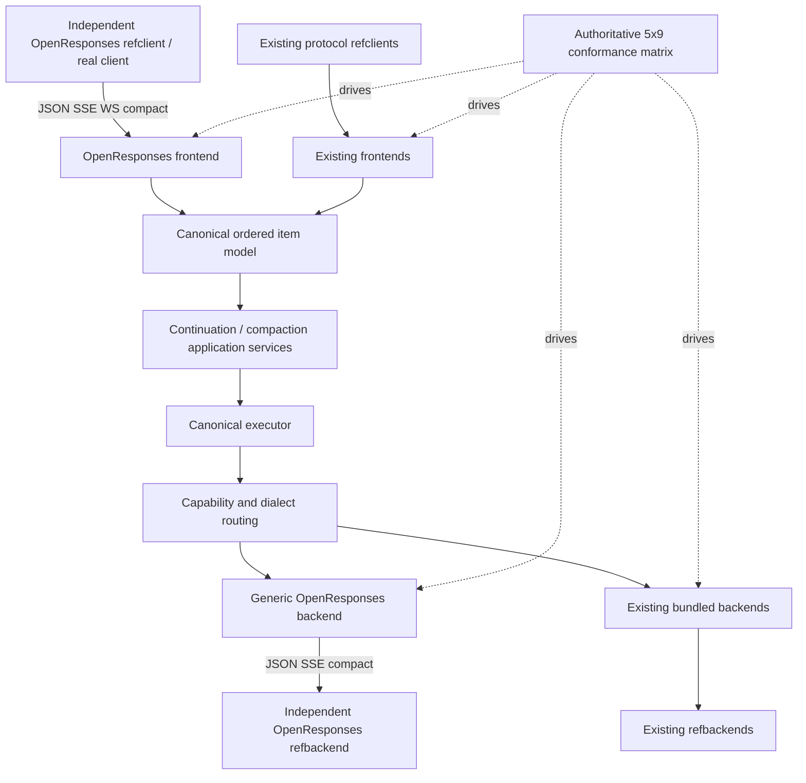

# Design Document

## OpenResponses API Support

## Overview

This feature adds OpenResponses `2026-04-24` as a distinct versioned protocol family in Go-LIP. It provides:

- a client-facing frontend for HTTP JSON, HTTP SSE, standalone compaction, and persistent sequential WebSocket turns;
- a dependency-free generic backend mode for remote OpenResponses-capable providers and routers over HTTP JSON/SSE and compaction;
- independent test-only OpenResponses client and remote-backend emulators; and
- exhaustive feature-aware translation evidence by adding OpenResponses to both sides of the repository's authoritative frontend×backend conformance matrix.

OpenResponses is based on the OpenAI Responses vocabulary but is not an alias. The protocols retain separate wire packages, operation identities, routes, defaults, errors, resource builders, extension policy, and conformance profiles.

The selected pattern is **ports and adapters with a versioned protocol anti-corruption layer, an additive protocol-neutral ordered item trajectory, explicit canonical projectors, proxy-owned continuation, independent black-box protocol emulators, and a generated Cartesian compatibility matrix**.

## Goals

- Implement the pinned profile honestly and reproducibly.
- Support OpenResponses JSON, SSE, compact, and WebSocket clients.
- Route canonical calls to generic or provider-specific remote endpoints.
- Preserve ordered messages, calls/results, reasoning, phase, compaction, and bounded extensions.
- Keep response IDs, continuation, routing, failover, and commitment under proxy authority.
- Preserve all existing protocol behavior.
- Prove interoperability with independent client/server wire implementations.
- Exercise every bundled frontend against every bundled backend through the canonical middle.
- Make unsupported semantics fail before upstream network work.
- Maintain excellent code quality through TDD, deterministic fixtures, feature-level evidence, race/fuzz/leak tests, and coverage/no-regression gates.

## Non-Goals

- Replacing or renaming existing protocol adapters.
- Serving OpenAI Responses and OpenResponses from one sniffed route.
- Pairwise frontend-to-backend translator packages.
- Raw protocol tunneling around core.
- Supporting background asynchronous job resources initially.
- Executing provider-hosted tools inside Go-LIP.
- Requiring upstream WebSocket pooling initially.
- Making provider-bound opaque items portable.
- Sharing production OpenResponses codecs with the reference emulators.
- Treating statement coverage alone as compatibility proof.

## Boundary Commitments

### This Spec Owns

- OpenResponses identity/profile/source pinning.
- Project-owned production wire codecs and fixtures.
- OpenResponses frontend routes and transports.
- Protocol-neutral ordered canonical items and explicit projectors.
- Item/dialect/extension capability negotiation.
- Proxy-owned response IDs and continuation.
- Protocol-neutral context compaction.
- Generic remote OpenResponses backend mode.
- Independent `internal/refclient/openresponses` and `internal/refbackend/openresponses` packages.
- OpenResponses additions to the authoritative FE×BE matrix.
- Feature-level cell metadata, positive/negative evidence, and release gates.
- Required adjacent plugin/parity architecture updates.

### Out of Boundary

- Provider-specific OpenRouter routing, pricing, inventory, billing, or attribution.
- General conversation resource APIs.
- Arbitrary provider request/header pass-through.
- Dynamic connector installation.
- Upstream WebSocket session affinity/pooling.
- Rewriting existing non-OpenResponses matrix semantics except where canonical changes require a tested compatibility fix.

## Dependency Constraints

- `internal/core`, `pkg/lipapi`, and `pkg/lipsdk` shall not import OpenResponses wire, HTTP, WebSocket, provider SDK, refclient, or refbackend packages.
- Frontend/backend adapters may share only production protocol-owned profile/wire packages.
- The generic backend shall not import provider-specific connectors.
- Existing adapters shall not import OpenResponses frontend/backend packages.
- Continuation storage remains infrastructure-owned behind a core-owned port.
- WebSocket mechanics remain frontend/infrastructure-owned.
- Provider-native IDs remain private attempt evidence.
- External plugin DTOs remain protocol-neutral and versioned.
- `internal/refclient/openresponses` and `internal/refbackend/openresponses` are test-only and shall not appear in production dependency graphs.
- The two reference emulators shall not import production OpenResponses adapters, production profile codecs, or production state-machine encoders/decoders.
- Immutable testdata bytes, official source digests, and protocol-neutral scenario descriptions may be shared; executable codec logic may not.
- Normal root build/unit tests require no JavaScript runtime; the pinned official suite is a separate invocation.

## Requirements Traceability

| Requirement | Summary | Main components |
|---|---|---|
| 1 | Distinct identity/version | profile catalog, operations, architecture gates |
| 2 | Route/HTTP behavior | route claims, frontend handler, resource builder |
| 3 | Ordered canonical items | item contracts, authority constructors, walkers |
| 4 | Tools/extensions/capabilities | typed unions, dialect requirements, candidate admission |
| 5 | Streaming/resource fidelity | event normalizer/state machine/collector |
| 6 | Continuation | proxy ID issuer, service/store, recorder |
| 7 | Compaction | neutral operation/capability, frontend/backend mapping |
| 8 | WebSocket | session owner, local store, shared event output |
| 9 | Generic backend | config, endpoint, wire client, stream parser |
| 10 | Security/operations | bounds, diagnostics, lifecycle |
| 11 | Licensing/dependencies | source manifest, architecture tests |
| 12 | TDD/delivery | goldens, official suite, race/fuzz/leak/coverage |
| 13 | Emulators/matrix | independent refclient/refbackend, 45 cells, projectors |

## Architecture

### System Context



### Existing Architecture Retained

| Asset | Retained role | Required change |
|---|---|---|
| Frontend registry/composition | authentication and HTTP composition | add route claims and OpenResponses mount |
| `lipapi.Call` | canonical request envelope | add ordered authority and neutral controls |
| `lipapi.EventStream` | streaming-first result | add item lifecycle metadata/events |
| backend `Open` port | execution seam | reuse for create/compact with operation identity |
| capability negotiation | candidate legality | add items, phase, compaction, exact dialect requirements |
| routing/failover | candidate selection | consume complete requirements; policy unchanged |
| output commitment | no retry after visible output | unchanged across SSE/WS/JSON |
| endpoint/credential/inventory | generic backend plumbing | reuse for new backend family |
| runtime lifecycle | resource ownership | own continuation and WS sessions |
| `internal/refclient` | independent client evidence | add OpenResponses implementation |
| `internal/refbackend` | independent provider evidence | add OpenResponses implementation |
| `internal/testkit/conformance` | Cartesian translation proof | extend from 4×8 to 5×9 and enrich feature metadata |

## Selected Operation Model

```go
const (
    OperationOpenResponsesCreate Operation = "openresponses.create"
    OperationContextCompaction   Operation = "context.compaction"
)
```

Both operations return managed canonical event streams. Compaction initially uses non-streaming upstream transport but retains the same cancellation, error, retry, accounting, and close lifecycle.

## Protocol Profile and Source Pinning

```go
type ProfileDescriptor struct {
    Family            string
    Version           string
    SourceCommit      string
    SchemaDigest      string
    ComplianceDigest  string
    PortableItemTypes Set[string]
    RecognizedTypes   Set[string]
    RequiredFields    PresenceRules
    Limits            ProfileLimits
}
```

Source precedence:

1. normative BCP-14 prose for transport/lifecycle/continuation/extensions;
2. dated OpenAPI for recognized shapes and required presence;
3. official compliance for executable minimum;
4. repository-owned documented corrections for inconsistencies.

A machine-readable provenance manifest records upstream paths/digests, license notices, generation/minimization method, and profile deviations.

## Canonical Ordered Item Model

### Authority Rule

```go
type Call struct {
    Instructions []Message
    Messages     []Message
    Items        []Item
    Controls     RequestControls
    Requirements ProtocolRequirements
}
```

Validation:

- non-empty `Items` means item authority;
- when item authority exists, legacy fields may only be a constructor-owned normalized projection;
- legacy-only calls keep `Items` empty and may populate messages directly;
- conflicting raw authorities are invalid;
- shared walkers operate on a normalized ordered view.

### Item Contract

```go
type Item struct {
    Kind       ItemKind
    ID         string
    Status     ItemStatus
    Role       Role
    Phase      AssistantPhase
    Content    []ContentPart
    Reference  *ItemReference
    ToolCall   *ToolCallItem
    ToolResult *ToolResultItem
    Reasoning  *ReasoningItem
    Compaction *CompactionItem
    Extension  *OpaqueExtension
}
```

Portable initial kinds include message, item reference, function call/output, reasoning, compaction, and opaque extension. Content includes text, image/file/video references or bounded inline data, refusal, reasoning/summary, annotations, and assistant media references.

### Explicit Projector Contracts

Projectors are canonical utilities owned at the adapter/canonical boundary, not pairwise protocol translators.

```go
type OrderedView interface {
    Items() []Item
    Requirements() ProtocolRequirements
}

type LegacyProjectionResult struct {
    Instructions []Message
    Messages     []Message
    Requirements ProtocolRequirements
}
```

Required projector directions:

1. **Item authority → legacy backend view**
   - preserve the target's documented portable intersection;
   - preserve ordering, roles where representable, tools/results, common multimodal parts, controls, usage requirements;
   - reject phase, compaction, item references, replay material, extensions, video, structured output, or annotations where target cannot represent them.

2. **Legacy message authority → OpenResponses ordered items**
   - construct stable ordered message/tool/result items;
   - preserve system/instructions, multimodal content, tool identities, common generation controls;
   - attach exact replay requirements where the source contains provider-bound reasoning;
   - reject conflicting authorities and unsupported source extensions before network work.

Projectors return either a complete deterministic representation or a stable capability/projection error. They never return a partial result plus warning.

## Capability and Dialect Negotiation

Semantic capabilities include ordered items, assistant phase, video input, structured tool output, item references, compaction, opaque extensions, and existing text/vision/documents/tools/reasoning/replay/parallel tool calls.

```go
type ProtocolRequirements struct {
    ItemDialects       []DialectRequirement
    ReasoningDialects  []DialectRequirement
    CompactionDialects []DialectRequirement
    ExtensionTypes     []ExtensionRequirement
}
```

Candidate admission order:

1. operation/transport;
2. semantic capability;
3. exact dialect/implementor;
4. projector feasibility;
5. model/backend limits.

Any unmatched requirement is a pre-output hard reject. Failover may consider only candidates satisfying the same complete requirement set.

## Route Ownership and Frontend Configuration

```go
type RouteClaim struct {
    OwnerID string
    Method  string
    Path    string
    Kind    RouteKind
}
```

OpenResponses claims:

- `POST <base_path>/responses`
- `POST <base_path>/responses/compact`
- `GET <base_path>/responses` when WebSocket is enabled

Default `base_path` is `/openresponses/v1`. `/v1` is allowed only without a collision.

Conceptual configuration:

```yaml
- kind: openresponses
  enabled: true
  config:
    profile: "2026-04-24"
    base_path: /openresponses/v1
    continuation:
      persistent_store: standard
      ttl: 24h
      max_chain_depth: 64
      max_materialized_bytes: 67108864
    websocket:
      enabled: true
      max_connection_age: 60m
      idle_timeout: 5m
      max_queued_turns: 1
      max_queued_bytes: 8388608
      allowed_origins: []
      development_mode: false
      allow_any_origin: false
```

`websocket.max_queued_bytes` (default 8 MiB, one full-size turn envelope) is the
per-session queued-byte bound. The read pump reserves each queued envelope's byte
size against this bound and the session pump releases it on consume, so the total
turn payload buffered in one session queue never exceeds the bound regardless of
`max_queued_turns`. The validator couples it to the message/queue limits: it must
admit at least one full-size envelope (else the read pump could never place the
message it already holds) and must not exceed the 256 MiB ceiling. The default
keeps the safe single-turn behavior unchanged.

Origin relaxation is development-only: `websocket.allow_any_origin` relaxes the
strict Origin allowlist only when `websocket.development_mode` is also true, and
the validator rejects `allow_any_origin` without `development_mode`. The runtime
policy never relaxes unless both flags are set, so a config can never be
accidentally origin-open; the default is strict.

## Production OpenResponses Wire Package

A shared internal production protocol package contains dated request/resource/event types, union codecs, presence wrappers, validation, SSE primitives, compact codecs, WS envelopes, source provenance, and lifecycle validation. It exposes no HTTP handler, backend client, core type, provider policy, or test emulator implementation.

Known portable variants are typed. Recognized provider-derived variants are typed or raw-preserving and carry exact dialect requirements. Unknown valid prefixed variants become bounded `OpaqueExtension`. Unknown unprefixed variants fail unless pinned-profile allowlisted.

## Frontend Decode and Execution

```go
type DecodedCreate struct {
    Profile            ProfileID
    Model              string
    Items              []lipapi.Item
    Controls           lipapi.RequestControls
    Requirements       lipapi.ProtocolRequirements
    Stream             bool
    PreviousResponseID string
    Store              bool
    Residual           ResidualControls
}
```

Validation sequence:

1. authenticate and establish route/session authority;
2. enforce body/depth limits;
3. decode pinned schema and unknown fields;
4. validate combinations/unsupported modes;
5. map items/tools/content/controls;
6. bind opaque extensions;
7. resolve continuation;
8. construct one item-authority call;
9. derive complete requirements and limits;
10. reserve proxy response envelope and execute.

## Response Envelope and Event State Machine

```go
type ResponseEnvelope struct {
    ResponseID         string
    PreviousResponseID string
    CreatedAt          time.Time
    Model              string
    Profile            ProfileID
    Controls           EchoedControls
}
```

One state object builds JSON resources, SSE events, WebSocket event messages, and the canonical output trajectory used for continuation. It validates response/item/content lifecycle, IDs, indices, phase, status, sequence, terminal ownership, and required presence.

Legacy backend streams may be normalized only where semantics are unambiguous. The normalizer may synthesize message/text/tool boundaries but shall not invent assistant phase, compaction, provider replay, structured tool output, or unknown extensions.

## Proxy-Owned Continuation

```go
type ContinuationStore interface {
    Reserve(ctx context.Context, scope Scope, policy StoragePolicy) (ResponseID, error)
    PutTerminal(ctx context.Context, record ContinuationRecord) error
    Get(ctx context.Context, scope Scope, id ResponseID) (ContinuationRecord, error)
    Delete(ctx context.Context, scope Scope, id ResponseID) error
}
```

Materialization authenticates scope, retrieves with indistinguishable not-found behavior, validates profile/bounds, concatenates previous input/output/new input, merges requirements, preserves required lineage, and executes a new proxy response ID.

Native remote continuation may be a private optimization only under exact backend/profile/model lineage and policy-valid canonical fallback.

## Context Compaction

Compact becomes `OperationContextCompaction` with ordered input, model selection, compact controls, replay requirements, and non-streaming preference. Eligible backends must advertise compaction and compatible dialects. The frontend builds a complete `response.compaction` resource. A later create uses compact output as a new chain and omits the old response ID.

## Client-Facing WebSocket

One session owner serializes turns. One reader and one writer pump follow approved ownership discipline. State includes profile, authenticated scope, start time, active turn, bounded queue, connection-local continuation store, and limits.

`store:false` records exist only in the local store, disappear on reconnect/close, and are evicted only after classified 4xx/5xx-equivalent continuation failure. Disconnect/cancellation/unrelated transport failure retains the referenced parent while the connection remains alive.

## Generic Remote OpenResponses Backend

Stable proposed kind: `custom-openresponses-compatible`.

It reuses common endpoint, credentials, inventory, admission, ownership, diagnostics, and stream infrastructure. Configuration declares profile, model inventory, operation/transport capabilities, recognized types/slugs, continuation/compaction support, and limits.

Request mapping:

1. verify operation;
2. normalize item-authority or legacy-message-authority call through the correct constructor/projector;
3. validate profile/model capabilities and exact requirements;
4. map ordered items and common controls;
5. insert only allowlisted residual controls;
6. never forward proxy IDs;
7. apply credentials/options;
8. send JSON or start SSE.

Response parsing validates status/content type/limits, preserves ordering and phase, emits item lifecycle and usage, captures native refs privately, carries valid prefixed output opaquely, and rejects malformed/unprefixed/duplicate/post-terminal data.

## Independent Protocol Emulators

### Package Ownership

```text
internal/refclient/openresponses/   # client-side black-box implementation
internal/refbackend/openresponses/  # remote-provider server emulator
```

Both packages are test support. Production packages shall not import them. They shall not import:

- `internal/plugins/frontends/openresponses`;
- `internal/plugins/backends/openresponsescompat`;
- the production OpenResponses wire/profile codec package; or
- production state-machine/resource builders.

Architecture tests inspect imports and production dependency graphs.

### Shared Inputs

Permitted sharing:

- immutable official JSON fixtures copied under testdata;
- source/profile/schema/compliance digests;
- neutral binary fixtures such as a tiny image/PDF;
- declarative scenario IDs and expected semantic labels that contain no encoder/decoder logic.

Forbidden sharing:

- Go wire union types;
- marshal/unmarshal methods;
- SSE parser/writer implementation;
- lifecycle state machine;
- presence/default builders;
- validation code that would cause both sides to accept the same defect.

### Reference Client Design

The client emulator provides independent builders/parsers for:

- create JSON and SSE;
- compact request/resource;
- WebSocket create, sequential turns, continuation, and errors;
- tools, tool outputs, multimodal input, phase, reasoning, item references, extensions, usage, and required response fields.

It records raw requests and parsed semantic observations. It supports test credentials, custom base paths, deterministic IDs where client-generated values exist, bounded parsing, cancellation, and slow-consumer modes.

### Reference Backend Design

The server emulator provides a script registry:

```go
type Script struct {
    ExpectedRequest RequestExpectation
    Output          []WireStep
    Error           *ErrorStep
    DelayPlan       VirtualDelayPlan
    MalformedMode   MalformedMode
}
```

Capabilities:

- JSON/SSE create;
- compact;
- direct WS protocol scenarios for wire validation;
- request capture with redacted/bounded storage;
- valid text/tool/multimodal/reasoning/phase/item-reference/extension output;
- malformed discriminator/event/order/terminal/content-type/body modes;
- auth/rate-limit/4xx/5xx/disconnect modes;
- virtual-clock delay, slow write, cancellation observation, and bounded backpressure;
- atomic request counters used to prove pre-network rejection.

### Direct Emulator Interoperability

The independent client runs directly against the independent backend before production adapter tests. These wire-only tests cover all pinned official scenarios plus negative malformed/error fixtures. Passing direct tests establishes that both independent implementations agree with official fixtures, not that production is correct; production is triangulated in subsequent layers.

## Cross-API Compatibility Matrix

### Authoritative Lists

```go
func BundledFrontendIDs() []string {
    return []string{
        "openai-responses",
        "openai-legacy",
        "anthropic",
        "gemini",
        "openresponses",
    }
}

func BundledBackendIDs() []string {
    return []string{
        "openai-responses",
        "openai-legacy",
        "anthropic",
        "gemini",
        "bedrock",
        "acp",
        "openrouter",
        "nvidia",
        "openresponses",
    }
}
```

`AllCells()` yields exactly 45 unique cells. Tests assert the count, uniqueness, deterministic ordering, and complete metadata. Adding an ID creates a failing completeness test until every new cell is classified.

### Feature-Level Metadata

```go
type CompatibilityOutcome string

const (
    OutcomeLossless          CompatibilityOutcome = "lossless"
    OutcomeProjection        CompatibilityOutcome = "documented_deterministic_projection"
    OutcomeRejectBeforeNet   CompatibilityOutcome = "rejected_before_network"
    OutcomeOutOfScope        CompatibilityOutcome = "out_of_scope"
)

type FeatureEvidence struct {
    Outcome       CompatibilityOutcome
    ScenarioIDs   []string
    TestArtifacts []string
    Rationale     string
}

type MatrixCell struct {
    Frontend string
    Backend  string
    Features map[FeatureID]FeatureEvidence
}
```

Required features include JSON text, streaming text, instructions/roles, history, tools/results/tool choice, multimodal input, assistant media output, usage/finish/errors, reasoning/replay, assistant phase, item references, continuation, compaction, extensions, cancellation/backpressure, failover, and no-retry-after-visible-output.

`out_of_scope` is legal only when no such product surface exists. It is not a substitute for an unimplemented required feature.

### Explicit OpenResponses Frontend Row

| Backend | Positive obligation | Fail-closed obligation |
|---|---|---|
| OpenAI Chat Completions | portable messages/tools/common multimodal and streaming through explicit item→legacy projection | reject phase, compaction, incompatible replay/extensions/item refs/video/structured forms before request |
| OpenAI Responses | broad portable item/tool/reasoning intersection | reject incompatible dialects/extensions/phase or compaction semantics not honestly supported |
| ACP | positive prompt-text/resource subset (image/file URI references project to ACP resource prompt blocks) | reject tools, video/audio/structured multimodal, phase, replay, compaction, extensions, full-agent features with zero requests |
| Anthropic Messages | portable text/system/tools/results/image/document/streaming | reject incompatible phase, compaction, item refs, replay, video/extensions |
| Gemini/Vertex | contents/system/tools/function responses/multimodal/streaming | reject incompatible phase, compaction, replay/item refs/extensions |
| Amazon Bedrock | Converse messages/system/tools/results/image/document/streaming | reject incompatible phase, compaction, replay/item refs/extensions/video |
| OpenRouter | portable OpenAI-compatible subset plus connector-owned typed behavior | reject unconfigured proprietary controls/dialects and incompatible failover |
| NVIDIA | connector-supported OpenAI-compatible subset | reject unsupported phase/compaction/replay/extensions |
| OpenResponses | full portable pinned profile plus configured dialects | reject unsupported profile/dialect/malformed lifecycle |

### Explicit OpenResponses Backend Column

| Frontend/client | Positive obligation | Fail-closed obligation |
|---|---|---|
| OpenAI Chat Completions | message/tool/multimodal legacy authority → ordered items | reject conflicting authority and unsupported source extensions |
| OpenAI Responses | existing canonical message/reasoning/tool semantics → ordered items | reject exact replay/extensions without compatible OR dialect |
| Anthropic Messages | system/content blocks/tools/results/multimodal → ordered items | reject incompatible thinking signatures/cache/vendor blocks |
| Gemini/Vertex | contents/system/functions/multimodal → ordered items | reject cached-content/provider controls or unsupported content forms |
| OpenResponses | item authority → pinned wire | reject conflicting authority/profile/dialect/lifecycle |

### Canonical-Only Translation Rule

No package named for a frontend/backend pair is allowed. Frontends construct canonical calls. Backends consume normalized ordered views through reusable, target-aware projectors. Pair-specific behavior belongs only in matrix metadata and test fixtures—not production translation code.

### Zero-Upstream Rejection Proof

Every `rejected_before_network` feature scenario configures the corresponding reference backend request counter/capture callback. The assertion requires:

- stable client-facing capability/projection error;
- zero captured requests;
- zero credentials consumed/rotated;
- zero candidate output commitment;
- no sensitive semantic payload in logs/diagnostics.

## Error Model

Stable internal categories include unsupported profile, route conflict, invalid item lifecycle, unsupported item/content/tool, incompatible dialect, invalid/unknown response ID, continuation limits, compaction unsupported, WebSocket invalid message/age/queue state, malformed remote event/resource, and projection-not-representable.

HTTP, SSE, and WebSocket mappings are profile-specific and bounded. Internal route/backend/provider identity is not exposed unless existing safe policy permits it.

## Security Design

- Authenticate before decode/state/upgrade/backend work.
- Authoritative route/session state overrides client hints.
- Response IDs are high-entropy scoped proxy IDs.
- Missing/unauthorized IDs are indistinguishable.
- Native refs never leave private state.
- Extensions are discriminator/implementor/dialect bound and redacted.
- Projectors are all-or-nothing and cannot silently drop data.
- Reference request capture is bounded/redacted and test-only.
- Matrix tests include extension smuggling, replay leakage, and incompatible failover.
- Independent limits cover all HTTP/WS/JSON/item/schema/event/continuation/emulator queues and buffers.

## Runtime Reload and Lifecycle

Composition validates profile/config, route claims, backend-prefix ownership, continuation stores, backends/inventory, and frontend mounts before atomic publication. Existing WS sessions remain on the old generation. Shutdown stops admission, signals/cancels sessions, closes streams/stores, flushes policy-required persistence, closes backends, and verifies no goroutine/socket/permit/state leak.

Reference emulators use `httptest` and test-owned cleanup. Their virtual clocks, script queues, request captures, and connections close deterministically in `t.Cleanup`/test main leak checks.

## Migration Strategy

### Phase A: Characterize and lock boundaries

- Pin official sources/licenses.
- Characterize existing adapters and current 32-cell matrix.
- Add architecture tests preventing aliasing, wire leakage, pairwise translators, and emulator/production imports.
- Define matrix feature vocabulary and evidence registry.

### Phase B: Add canonical contracts and projectors

- Add ordered items, roles, phase, content, opaque extensions, walkers, and limits.
- Add item/dialect capability negotiation and compaction operation.
- Define/test item→legacy and legacy→item projectors before adapter changes.

### Phase C: Build production profile codec/state machine

- Implement pinned unions, presence, errors, SSE, compact, and WS envelopes.
- Add goldens/fuzz/lifecycle tests.

### Phase D: Add frontend, continuation, and compaction

- Add route claims, JSON/SSE, response envelopes, persistent continuation, and compact.

### Phase E: Add generic backend

- Add strict config/factory and JSON/SSE/compact mapping.
- Support both canonical authority forms through explicit constructors/projectors.

### Phase F: Add WebSocket

- Add authenticated sequential sessions, local continuation, limits, eviction, cancellation, race/leak coverage.

### Phase G: Build independent emulators

- Implement independent client and backend wire behavior.
- Run direct official-fixture-based interoperability tests.
- Add anti-tautology architecture gates.

### Phase H: Extend matrix and prove compatibility

- Add OpenResponses to both lists and all 45 cells.
- Implement/test row and column projectors.
- Run positive and negative feature evidence.
- Run full black-box and official conformance.
- Enforce coverage/no-regression and final release gates.

## Testing Strategy

### Layer 1: Unit and Golden

- source manifests/digests/licenses;
- every production and emulator wire union separately;
- required presence/null/default rules;
- canonical item validation and both projector directions;
- capability/dialect negotiation;
- response/event lifecycle;
- continuation/compaction contracts;
- endpoint/path/no-auth behavior.

### Layer 2: Direct Wire Emulator

`refclient/openresponses` → `refbackend/openresponses` for JSON, SSE, compact, WS, tools, multimodal, phase, reasoning, continuation, extensions, errors, malformed streams, and required presence.

### Layer 3: Frontend Adapter

Independent refclient → production frontend → canonical stub. Assert exact canonical authority, controls, requirements, continuation calls, and profile-shaped output.

### Layer 4: Backend Adapter

Canonical fixtures for both authority forms → production backend → independent refbackend. Assert exact raw upstream request and canonical output/events/errors.

### Layer 5: Complete FE×BE Matrix

- all 45 baseline non-streaming text cells;
- streaming in every supported cell;
- positive tools and multimodal cases where representable;
- negative zero-upstream cases for every unsupported feature;
- explicit ACP subset/exclusions;
- usage/finish/error and commitment behavior;
- linked feature evidence registry.

### Layer 6: Protocol-Specific Feature Suites

Reasoning/replay, assistant phase, item refs, continuation, compaction, extensions, assistant multimodal output, provider-specific dialect constraints, and native-ID privacy.

### Layer 7: Full Black-Box

Independent client → real frontend → core routing/failover/continuation → real backend → independent provider emulator for JSON, SSE, compact, and WS client transport.

### Layer 8: Official Compliance

Pinned official suite against the full black-box reference deployment. Source is immutable/mirrored and not fetched from a mutable branch at test time.

### Robustness

- fuzz production codecs/state machines and both emulators;
- malformed JSON/SSE/WS/resource/event sequences;
- slow reader/writer and bounded backpressure;
- cancellation before/after output;
- credential/failover before commitment;
- no retry after visible output;
- continuation cycles/amplification/eviction;
- runtime reload/shutdown;
- race and goroutine/socket/state leak tests;
- extension/replay redaction and cross-provider isolation.

### Coverage Quality

- collect package coverprofiles for touched/new packages;
- prohibit unexplained coverage regression;
- target at least 90% statement coverage for new deterministic production codec/state-machine and emulator packages;
- document reviewed exceptions for generated/unreachable branches;
- require named scenario and feature-branch evidence regardless of percentage;
- no required cell or feature may remain planned/unlinked.

### Architecture Gates

- no production import of `internal/refclient`/`internal/refbackend`;
- no emulator import of production OpenResponses codec/adapters;
- no protocol wire types in core/public SDK;
- no pairwise translator packages;
- no provider-specific import in generic backend;
- no external connector module in root requirements;
- no mutable network generation;
- root `GOWORK=off` build without JavaScript.

## Provider/Router Connector Strategy

Use the generic mode for standard bearer/no-auth, standard paths, portable profile plus explicitly declared extension slugs/types, standard usage/errors, and static/standard inventory. Use an external provider connector for proprietary auth, attribution, routing/fallback, billing, catalog, typed hosted tools, provider-specific errors, or native continuation policy.

## Design Decisions Summary

| Decision | Selected | Rejected |
|---|---|---|
| Protocol identity | separate dated OpenResponses | OpenAI alias |
| Client route | configurable non-colliding path | body/header sniffing |
| Canonical model | additive ordered items | raw tunnel/wire types in core |
| Translation | explicit canonical projectors | pairwise translators/silent drop |
| Continuation | proxy IDs/canonical state | raw upstream IDs |
| Compaction | core-routed operation | frontend shortcut |
| Client WebSocket | proxy termination | initial upstream WS requirement |
| Generic backend | project-owned codec/shared infrastructure | extend OAI SDK flavor |
| Extensions | typed portable + bounded dialect-bound opaque | arbitrary pass-through |
| Test client | independent `refclient/openresponses` | production-codec reuse |
| Test provider | independent `refbackend/openresponses` | production-codec reuse/single fake |
| Compatibility | generated 5×9 feature-aware matrix | hand-picked paths |
| Unsupported semantics | pre-network rejection | warning/drop/downgrade |
| Quality | scenario evidence + coverage/no-regression | percentage-only claim |

## Revalidation Triggers

Revisit requirements/design when:

- a new OpenResponses profile is supported;
- extension naming/item lifecycle changes;
- upstream persistent WebSocket is proposed;
- background/conversation resources are added;
- canonical item/event shape changes materially;
- plugin ABI changes compaction/item contracts;
- native continuation becomes required;
- continuation storage crosses process boundaries;
- arbitrary pass-through is proposed;
- a third-party SDK replaces project wire code;
- provider tools move into generic mode;
- route aliases/shared `/v1/responses` handling are proposed;
- an emulator would share executable production codec logic;
- a new frontend/backend is added to the authoritative matrix;
- a required cell is proposed as skipped/planned at release;
- pairwise translation code is proposed;
- the coverage target or scenario registry is weakened.
