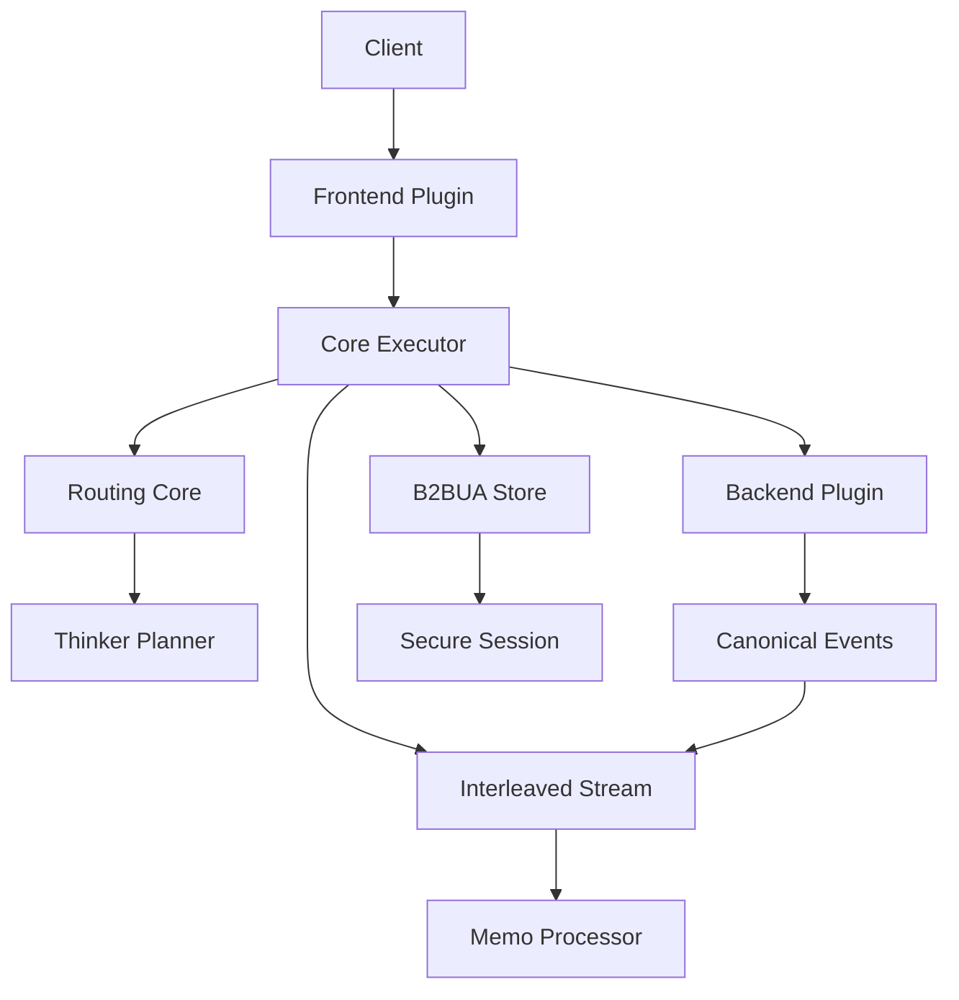
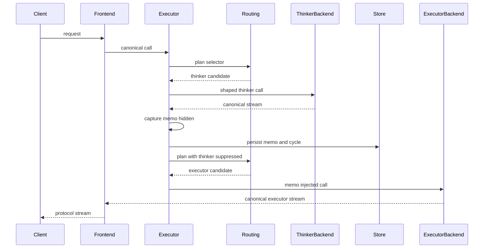
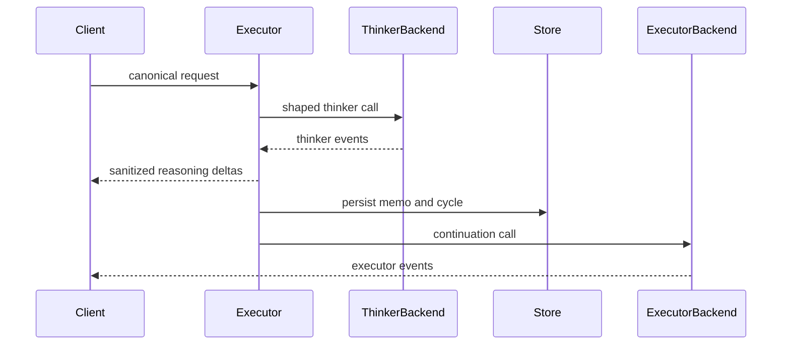
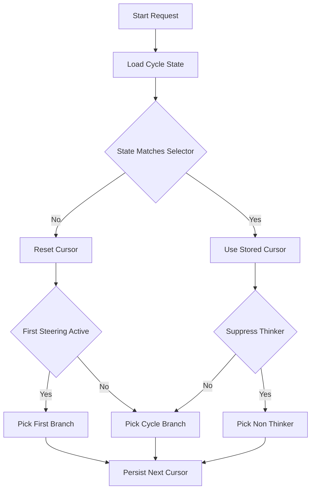
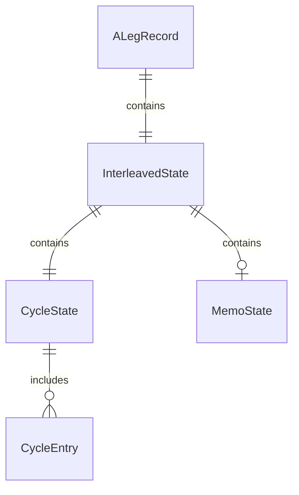
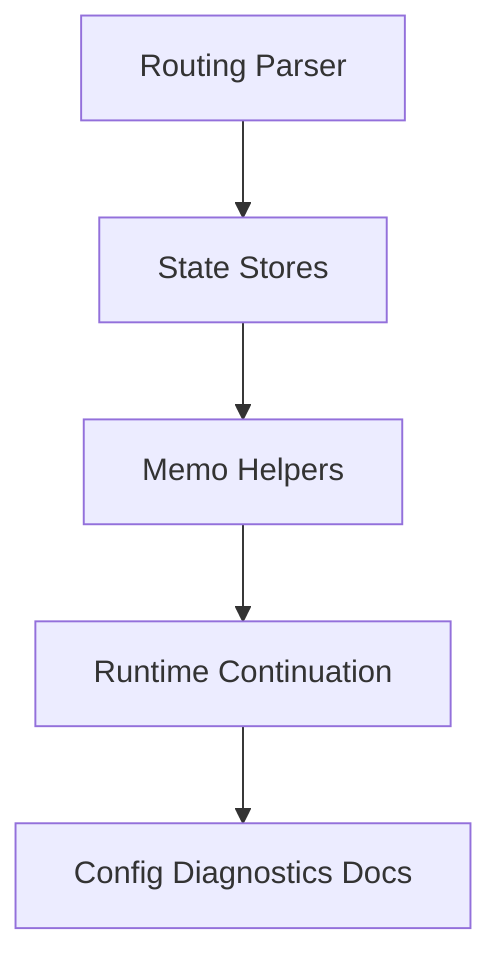

# Design Document

## Overview

This feature ports Python LIP interleaved thinking into Go LIP. It lets operators mark one weighted route branch as a thinker branch, capture that branch's planning output as a bounded memo, continue the same logical client request through an executor branch, and inject the memo into later executor turns.

The design preserves Go LIP's canonical-in-the-middle, streaming-first, and core-owned routing model. Routing syntax, thinker-cycle planning, B-leg continuation, and continuity state are core-owned. Provider translation remains at backend adapters, and memo extraction operates only on canonical events.

### Goals

- Provide feature parity for `[thinker]` selector syntax, weighted thinker cycles, hidden/visible continuation, memo capture, memo injection, and hybrid parallel executor selectors.
- Preserve existing routing, `[first]`, failover, parallel, secure-session, and extension behavior for selectors that do not use `[thinker]`.
- Keep memo handling provider-neutral, bounded, observable, and protected by existing session authority.

### Non-Goals

- Improve or redesign the Python-era thinker prompt beyond parity requirements.
- Add provider-specific planner semantics or provider SDK dependencies in core.
- Add external sub-calls outside the selected route plan.
- Change unrelated client protocol contracts.
- Generalize weighted and parallel operator mixing beyond the one explicit thinker-plus-parallel-executor hybrid form.

## Boundary Commitments

### This Spec Owns

- `[thinker]` route selector parsing, validation, and route planning semantics.
- Thinker-aware weighted cycle state and suppression behavior.
- Runtime orchestration for thinker B-leg followed by continuation executor B-leg within one A-leg.
- Bounded memo extraction and visible-stream sanitization over canonical events.
- Persisted interleaved thinking state tied to A-leg continuity and secure-session authority.
- Candidate-specific request shaping for thinker instructions, tool suppression, and executor memo injection.
- Operator configuration, diagnostics, docs, and regression coverage for interleaved thinking.

### Out of Boundary

- Backend provider prompt engineering beyond configured instruction text.
- Provider-specific wire parsing for memo extraction.
- New frontend protocols or backend adapters.
- External model sub-call orchestration unrelated to the configured route selector.
- A generic workflow engine for multi-step routing beyond thinker then executor continuation.
- Broad selector grammar changes outside the explicit hybrid exception.

### Allowed Dependencies

- `pkg/lipapi` canonical request and event contracts.
- `internal/core/routing` selector and planning policy.
- `internal/core/runtime` executor, attempt, stream, and lifecycle orchestration.
- `internal/core/b2bua`, `internal/core/continuity`, and `internal/core/securesession` state and authority paths.
- `internal/core/extensions` and `pkg/lipsdk` only for existing extension ordering and compatibility; concrete feature plugins are not imported by core.
- Standard library only for parsing, storage serialization, and memo extraction; no new third-party dependency is required.

### Revalidation Triggers

- Selector AST or grammar changes beyond `[thinker]` and the hybrid exception.
- Changes to `lipapi.Call`, `lipapi.Event`, or frontend stream legality.
- Changes to B2BUA store state shape or durable continuity schema.
- Changes to secure-session BeginTurn or resume authority.
- Changes to completion gate or request transform ordering that affect memo injection or continuation.
- Changes to no-retry-after-visible-output behavior.

## Architecture

### Existing Architecture Analysis

Go LIP already separates canonical contracts, core orchestration, plugins, and composition roots. Routing, failover, parallel races, first-request steering, B2BUA lineage, and no-retry-after-output are core-owned. Feature plugins can mutate requests and observe responses through SDK seams, but they must not own backend opening or route recovery.

Interleaved thinking crosses routing, runtime, stream handling, and continuity. It therefore cannot be implemented as a pure feature plugin. The design keeps policy in core and uses small provider-neutral helpers so backend adapters and frontends remain unchanged except for regression validation.

### Architecture Pattern & Boundary Map



**Architecture Integration**

- Selected pattern: pragmatic hexagonal ownership. Core owns orchestration policy; adapters keep protocol and provider details at the edge.
- Domain/feature boundaries: routing and continuation are core; memo extraction is a core helper over canonical events; config is runtime config; provider wire logic remains in backend plugins.
- Existing patterns preserved: explicit construction, canonical request/event model, B2BUA A-leg/B-leg lineage, stable extension ordering, and deterministic tests.
- New components rationale: the continuation stream and memo processor isolate the multi-step flow from existing receive-recovery logic.
- Steering compliance: no provider SDK leakage, no DI containers, no pairwise translators, streaming-first execution, and no silent recovery after visible output.

**Optional Hexagonal Lens**

- Domain policy: selector validation, thinker-cycle invariants, memo state invariants.
- App/use-case orchestration: executor opens thinker and executor B-legs, records state, and preserves output commitment rules.
- Driving adapters: existing frontends continue to decode/encode canonical calls and events.
- Driven adapters: backend plugins continue to translate canonical calls and events.
- Composition root: runtime bundle wires config and stores; plugin registry remains static and explicit.
- Ports/query seams: extend existing B2BUA store interface because routing state is consumed by core.

**Project Boundary Questions**

- Core-owned or plugin-owned? Core-owned for routing, continuation, state, and candidate-specific mutation; plugin-owned concerns are not required for v1 parity.
- New canonical concept, or provider-specific behavior? New core routing/state concepts; no provider-specific canonical wire field is required.
- Streaming-first path preserved? Yes. Hidden and visible modes are event-stream wrappers; non-streaming remains collection over the resulting canonical stream.
- Provider SDK leakage avoided? Yes. Memo extraction reads `lipapi.Event` only.
- No retry/failover after first client-visible output preserved? Yes. Visible thinker deltas commit the A-leg for recovery purposes.
- Secure-session, diagnostics, or startup-security posture affected? Yes. Interleaved state is protected by existing A-leg and secure-session authority; diagnostics must redact memo content.
- Extension platform seam used or extended? Existing request transforms and hooks remain ordered; interleaved candidate-specific shaping occurs in runtime after route selection because existing request-wide transforms lack candidate context.

### Technology Stack

| Layer | Choice / Version | Role in Feature | Notes |
| --- | --- | --- | --- |
| Language | Go 1.26.x | Core implementation | Existing pinned toolchain |
| Routing | `internal/core/routing` | Selector syntax and planning | Extended for `[thinker]` and hybrid branch targets |
| Runtime | `internal/core/runtime` | Continuation orchestration | Owns B-leg opening and output commitment |
| Stream events | `pkg/lipapi.EventStream` | Memo capture and client output | Provider-neutral; no new event kind required |
| Storage | B2BUA continuity stores | Cycle and memo state | Memory, SQLite, and bun-backed stores updated consistently |
| Config | typed runtime config and YAML | Operator settings | No new external dependency |

## File Structure Plan

### Directory Structure

```text
internal/core/routing/
  selector.go                     # weighted branch thinker metadata and hybrid branch target shape
  parser.go                       # thinker annotation parsing and validation
  weighted.go                     # thinker-aware weighted branch selection
  planner.go                      # thinker suppression and candidate metadata propagation
  thinker_cycle.go                # cycle sequence construction and cursor advancement
  *_test.go                       # parser, planner, fuzz, and hybrid selector regression tests

internal/core/interleavedstate/
  state.go                        # pure shared value types for role, cycle state, and memo references
  state_test.go                   # value validation and JSON round-trip tests

internal/core/interleavedthinking/
  config.go                       # runtime config defaults and validation types
  memo_state.go                   # persisted memo state model and bounded content rules
  memo_store.go                   # core-owned bounded memo store keyed by memo references
  memo.go                         # canonical event memo extraction and fallback rules
  sanitize.go                     # visible stream tag stripping and reasoning delta normalization
  shape.go                        # canonical call shaping for thinker and executor turns
  *_test.go                       # pure unit tests for config, state, memo, sanitize, shaping

internal/core/b2bua/
  store.go                        # A-leg thinker cycle state and memo reference fields
  store_test.go                   # memory store cycle/reference persistence and authority-adjacent behavior

internal/core/continuity/
  sdkwrap.go                      # store adapter propagation of thinker cycle and memo references
  bunstore/store.go               # durable cycle/reference persistence
  bunstore/store_test.go          # durable cycle/reference round-trip tests
  sqlitestore/store.go            # SQLite cycle/reference persistence
  sqlitestore/store_test.go       # SQLite cycle/reference round-trip tests

internal/core/securesession/
  app/manager.go                  # preserve interleaved state across authorized turns where A-leg state is surfaced
  adapters/b2bualineage/store.go  # lineage adapter mapping for new state if required

internal/core/runtime/
  executor.go                     # detects thinker candidates and returns interleaved stream wrapper
  executor_open_attempt.go        # applies candidate-specific shaping before negotiation and open
  attempt_open_params.go          # carries interleaved config and suppression context if split exists
  interleaved_stream.go           # hidden and visible thinker continuation stream orchestration
  interleaved_open.go             # helper for opening continuation executor attempts with thinker suppression
  interleaved_stream_test.go      # hidden, visible, cancellation, and failure behavior
  executor_interleaved_test.go    # composed executor characterization tests

internal/core/config/
  config.go                       # typed interleaved-thinking config block
  yaml.go                         # YAML decode and validation integration
  *_test.go                       # config defaults and invalid config tests

internal/infra/runtimebundle/
  build.go                        # passes interleaved config to executor
  *_test.go                       # runtime wiring tests

docs/
  python-to-go-migration.md       # migration behavior and parity notes
  feature-migration-map.md        # update feature status
  spec-bundle-routing-scenarios.md # new scenario IDs if added
```

### Modified Files

- `pkg/lipapi/call.go` — no new fields expected; may receive helper tests only if call shaping helpers remain in `lipapi`. Preferred design keeps helpers in `internal/core/interleavedthinking`.
- `pkg/lipapi/events.go` — no new event kind expected; may receive fixture tests if collection behavior needs limit validation.
- `internal/pluginreg/features_install.go` — no interleaved feature plugin registration is planned for v1; only touched if design review later chooses a plugin-owned config adapter.
- `internal/archtest/*` — add or update guardrails if new packages introduce risk of core importing concrete plugins.

## System Flows

### Hidden Thinker Flow



Hidden mode emits no thinker deltas to the client. If the thinker phase fails before visible output, normal pre-output recovery may apply. Once executor output is visible, existing output commitment rules apply.

### Visible Thinker Flow



Visible thinker deltas are client-visible output. The continuation cannot silently restart after those deltas if the executor phase fails.

### Thinker Cycle State



## Requirements Traceability

| Requirement | Summary | Components | Interfaces | Flows |
| --- | --- | --- | --- | --- |
| 1.1 | Accept bare thinker annotation | Routing Parser | Selector AST | Thinker Cycle State |
| 1.2 | Accept true-valued thinker forms | Routing Parser | Annotation Parser | Thinker Cycle State |
| 1.3 | Reject false and invalid thinker values | Routing Parser | Error Contract | Thinker Cycle State |
| 1.4 | Reject multiple thinker branches | Routing Validator | Selector AST | Thinker Cycle State |
| 1.5 | Reject first plus thinker on same branch | Routing Validator | Selector AST | Thinker Cycle State |
| 1.6 | Reject thinker outside weighted selector | Routing Parser | Error Contract | Thinker Cycle State |
| 1.7 | Preserve other branch annotations | Routing Parser, Planner | Selector AST | Thinker Cycle State |
| 2.1 | Build weighted thinker cycle | Thinker Cycle Planner | Cycle State | Thinker Cycle State |
| 2.2 | Persist cycle advancement | Thinker State Store | B2BUA Store | Hidden Thinker Flow |
| 2.3 | Reset stale cycle state | Thinker Cycle Planner | Cycle State | Thinker Cycle State |
| 2.4 | Honor first before cycle | Thinker Cycle Planner | Session State | Thinker Cycle State |
| 2.5 | Suppress thinker for continuation | Planner, Interleaved Stream | PlanOptions | Hidden Thinker Flow |
| 2.6 | Surface no eligible executor | Planner | Error Contract | Hidden Thinker Flow |
| 3.1 | Add thinker instructions | Call Shaper | Canonical Call | Hidden Thinker Flow |
| 3.2 | Suppress tools on thinker turn | Call Shaper | Canonical Call | Hidden Thinker Flow |
| 3.3 | Fail on invalid instructions | Config, Call Shaper | Config Contract | Hidden Thinker Flow |
| 3.4 | Avoid thinker shaping on executor | Call Shaper | Candidate Role | Hidden Thinker Flow |
| 3.5 | Preserve behavior when disabled | Config, Runtime | Config Contract | Hidden Thinker Flow |
| 4.1 | Extract memo block | Memo Processor | Canonical Events | Hidden Thinker Flow |
| 4.2 | Store fallback memo | Memo Processor | Memo State | Hidden Thinker Flow |
| 4.3 | Capture streaming output | Interleaved Stream | EventStream | Hidden Thinker Flow |
| 4.4 | Preserve interrupted memo | Interleaved Stream, Memo State | Memo State | Hidden Thinker Flow |
| 4.5 | Preserve memo metadata | Thinker State Store | Memo State | Hidden Thinker Flow |
| 4.6 | Bound memo size | Memo Processor, Config | Config Contract | Hidden Thinker Flow |
| 5.1 | Inject memo into executor | Call Shaper | Canonical Call | Hidden Thinker Flow |
| 5.2 | Suppress duplicate visible memo | Call Shaper | Memo State | Visible Thinker Flow |
| 5.3 | Decrement memo budget | Thinker State Store | Memo State | Hidden Thinker Flow |
| 5.4 | Expire memo after budget | Call Shaper, Store | Memo State | Thinker Cycle State |
| 5.5 | Deduplicate equivalent memo | Call Shaper | Canonical Call | Hidden Thinker Flow |
| 6.1 | Hidden thinker continuation | Interleaved Stream | EventStream | Hidden Thinker Flow |
| 6.2 | Visible thinker continuation | Interleaved Stream | EventStream | Visible Thinker Flow |
| 6.3 | Strip wrapper tags | Memo Processor | EventStream | Visible Thinker Flow |
| 6.4 | Suppress thinker during continuation | Interleaved Stream, Planner | PlanOptions | Hidden Thinker Flow |
| 6.5 | Recover pre-output thinker failure | Interleaved Stream | Recovery Policy | Hidden Thinker Flow |
| 6.6 | Preserve no retry after output | Interleaved Stream | Recovery Policy | Visible Thinker Flow |
| 6.7 | Cancel active work | Interleaved Stream | ManagedEventStream | Hidden Thinker Flow |
| 7.1 | Accept hybrid selector shape | Routing Parser | Selector AST | Thinker Cycle State |
| 7.2 | Run thinker branch in hybrid | Planner, Interleaved Stream | Candidate Role | Hidden Thinker Flow |
| 7.3 | Run embedded parallel executor | Planner, Runtime | AttemptGroup | Hidden Thinker Flow |
| 7.4 | Reject invalid hybrid structure | Routing Validator | Error Contract | Thinker Cycle State |
| 7.5 | Reject malformed hybrid | Routing Parser | Error Contract | Thinker Cycle State |
| 7.6 | Preserve parallel race semantics | Runtime, Planner | AttemptGroup | Hidden Thinker Flow |
| 8.1 | Restore state on session continue | Store, Runtime | B2BUA Store | Thinker Cycle State |
| 8.2 | Preserve state on authorized resume | Store, Secure Session | B2BUA Store | Hidden Thinker Flow |
| 8.3 | Deny state on auth failure | Secure Session, Runtime | Session Authority | Hidden Thinker Flow |
| 8.4 | Treat missing state as new session | Runtime, Planner | Session State | Thinker Cycle State |
| 8.5 | Ignore stale cycle safely | Planner, Store | Cycle State | Thinker Cycle State |
| 9.1 | Preserve legal frontend responses | Interleaved Stream | EventStream | Hidden, Visible |
| 9.2 | Use protocol-neutral deltas | Memo Processor | Canonical Events | Visible Thinker Flow |
| 9.3 | Fail explicit capability mismatch | Call Shaper, Executor | Capability Result | Hidden Thinker Flow |
| 9.4 | Handle visible-mode protocol limits | Interleaved Stream | EventStream | Visible Thinker Flow |
| 9.5 | Avoid provider-specific config | Config, Memo Processor | Config Contract | Hidden Thinker Flow |
| 10.1 | Configure feature settings | Config | Config Contract | Hidden Thinker Flow |
| 10.2 | Preserve disabled behavior | Config, Runtime | Config Contract | Hidden Thinker Flow |
| 10.3 | Observe selected routes | Runtime Diagnostics | Attempt Records | Hidden Thinker Flow |
| 10.4 | Observe memo state without content | Runtime Diagnostics | Log Contract | Hidden Thinker Flow |
| 10.5 | Fail closed invalid config | Config | Config Contract | Hidden Thinker Flow |
| 10.6 | Document parity and migration | Docs | Operator Docs | None |
| 11.1 | Preserve non-thinker routing | Routing Regression Tests | Selector AST | Existing Routing |
| 11.2 | Preserve disabled behavior | Config, Runtime | Config Contract | Existing Routing |
| 11.3 | Isolate state by session and selector | Store, Runtime | Memo State | Thinker Cycle State |
| 11.4 | Preserve extension ordering | Runtime, Extensions | Stage Ordering | Hidden Thinker Flow |
| 11.5 | Provide regression coverage | Test Suites | Test Contracts | All Flows |

## Components and Interfaces

| Component | Domain or Layer | Intent | Req Coverage | Key Dependencies | Contracts |
| --- | --- | --- | --- | --- | --- |
| Routing Parser and Validator | Core routing | Parse and validate thinker selectors | 1.1-1.7, 7.1, 7.4, 7.5, 11.1 | `routing.Selector` P0 | Service, State |
| Thinker Cycle Planner | Core routing | Select thinker or executor branches deterministically | 2.1-2.6, 7.2, 7.3, 7.6, 8.4, 8.5 | `SessionRoutingState` P0 | Service, State |
| Interleaved State Store | Core continuity | Persist cycle and memo state with A-leg authority | 2.2, 4.5, 5.3, 5.4, 8.1-8.5, 11.3 | `b2bua.Store` P0 | State |
| Call Shaper | Core helper | Apply thinker instructions, tool suppression, and memo injection | 3.1-3.5, 5.1-5.5, 9.3 | `lipapi.Call` P0 | Service |
| Memo Processor | Core helper | Extract, bound, and sanitize memo content | 4.1-4.6, 6.3, 9.2, 9.5 | `lipapi.Event` P0 | Service |
| Interleaved Stream Coordinator | Core runtime | Run thinker phase and continuation executor phase | 6.1-6.7, 7.2, 7.3, 7.6, 9.1, 9.4 | Executor open path P0 | Service, Event |
| Interleaved Config | Core config | Validate operator settings and defaults | 3.3, 3.5, 4.6, 10.1, 10.2, 10.5 | YAML config P0 | State |
| Diagnostics and Docs | Operations | Expose bounded state transitions and migration guidance | 10.3, 10.4, 10.6 | `diag`, docs P1 | Event |

### Core Routing

#### Routing Parser and Validator

| Field | Detail |
| --- | --- |
| Intent | Extend selector grammar with `[thinker]` and one hybrid weighted branch shape |
| Requirements | 1.1, 1.2, 1.3, 1.4, 1.5, 1.6, 1.7, 7.1, 7.4, 7.5, 11.1 |

**Responsibilities & Constraints**

- Accept bare and true-valued thinker annotations.
- Reject false, empty, duplicated, misplaced, or conflicting thinker annotations.
- Preserve current strict rejection of general weighted and parallel mixing.
- Allow only the scoped hybrid: one thinker branch and one non-thinker weighted branch whose target is a parallel executor group.

**Dependencies**

- Inbound: frontend-decoded route selector string — P0.
- Outbound: `routing.Selector` AST — P0.

**Contracts**: Service [x] / API [ ] / Event [ ] / Batch [ ] / State [x]

##### Service Interface

```go
// Existing entrypoint remains stable.
func Parse(raw string) (*Selector, error)

type WeightedBranch struct {
    Weight int
    IsFirst bool
    IsThinker bool
    Target WeightedTarget
}

type WeightedTarget struct {
    Primary *Primary
    Parallel *Parallel
}
```

- Preconditions: raw selector is non-empty after alias resolution.
- Postconditions: exactly one target kind is set on each weighted branch.
- Invariants: at most one thinker branch per weighted group; a branch cannot be both first and thinker.

#### Thinker Cycle Planner

| Field | Detail |
| --- | --- |
| Intent | Select weighted thinker cycle entries and propagate candidate role metadata |
| Requirements | 2.1, 2.2, 2.3, 2.4, 2.5, 2.6, 7.2, 7.3, 7.6, 8.4, 8.5, 11.1 |

**Responsibilities & Constraints**

- Build the cycle as non-thinker branches repeated by effective weight, followed by the thinker branch once.
- Persist next cursor state only after a valid branch or group is selected.
- Reset stale cycle state when selector key or sequence differs.
- Respect `[first]` when no valid cycle exists.
- Suppress thinker branches for continuation requests.
- Return parallel attempt groups when a selected weighted branch targets a parallel executor group.

**Dependencies**

- Inbound: `Selector`, `PlanOptions`, session routing state — P0.
- Outbound: `AttemptGroup`, `AttemptCandidate`, updated cycle state — P0.

**Contracts**: Service [x] / API [ ] / Event [ ] / Batch [ ] / State [x]

##### Service Interface

```go
type InterleavedRole string

const (
    InterleavedRoleNone InterleavedRole = ""
    InterleavedRoleThinker InterleavedRole = "thinker"
    InterleavedRoleExecutor InterleavedRole = "executor"
)

type AttemptCandidate struct {
    Primary Primary
    Key string
    MarkedFirst bool
    IsParallel bool
    Handicap time.Duration
    InterleavedRole InterleavedRole
    SelectorKey string
}

type PlanOptions struct {
    // existing fields remain
    SuppressThinker bool
    ThinkerCycle interleavedstate.CycleState
}
```

- Preconditions: parser validation has enforced thinker invariants.
- Postconditions: selected candidates carry role metadata when produced by thinker-aware planning.
- Invariants: suppressed thinker selection never returns a thinker candidate.

### Core State and Helpers

#### Interleaved State Store

| Field | Detail |
| --- | --- |
| Intent | Persist thinker cycle state and memo references under A-leg continuity |
| Requirements | 2.2, 4.5, 5.3, 5.4, 8.1, 8.2, 8.3, 8.4, 8.5, 11.3 |

**Responsibilities & Constraints**

- Store cycle state and memo references under the same A-leg authority used by routing continuity.
- Delegate memo body storage to a bounded core-owned memo store keyed by authoritative session or A-leg.
- Keep memo text bounded and avoid storing provider wire payloads in B2BUA lineage rows.
- Preserve state across supported durable stores.
- Never expose state before secure-session authority permits the turn.

**Dependencies**

- Inbound: runtime after secure-session preparation — P0.
- Outbound: memory, SQLite, bun continuity stores, and bounded memo store — P0.

**Contracts**: Service [ ] / API [ ] / Event [ ] / Batch [ ] / State [x]

##### State Management

- State model: `interleavedstate.CycleState` plus `interleavedstate.MemoRef` embedded on `b2bua.ALegRecord`; memo body and injection counters live in `interleavedthinking.MemoState` through the core memo store.
- Persistence: memory store stores typed cycle/reference state; SQL stores serialize the small cycle/reference state as bounded JSON unless implementation discovers an existing typed JSON helper is unsuitable.
- Consistency: cycle/reference updates are per A-leg; memo body updates are per authorized session or A-leg and use explicit memo store operations.
- Concurrency: store implementations use their existing locking or transaction patterns.

##### State Boundary

```go
type MemoRef struct {
    Key string
    Version int64
}
```

- Preconditions: secure-session authority has accepted the turn before memo state is read or applied.
- Postconditions: A-leg continuity can restore cycle position and locate the latest memo without storing large memo text in lineage rows.
- Invariants: memo references are scoped to the same authoritative session or A-leg that created them.

#### Call Shaper

| Field | Detail |
| --- | --- |
| Intent | Mutate canonical calls for thinker and executor turns |
| Requirements | 3.1, 3.2, 3.3, 3.4, 3.5, 5.1, 5.2, 5.3, 5.4, 5.5, 9.3 |

**Responsibilities & Constraints**

- For thinker candidates, prepend configured instructions and remove tool availability before negotiation.
- For executor candidates, inject eligible memo context and update memo budget.
- Avoid duplicate memo injection by checking existing text/reasoning content for the memo marker text.
- Keep mutations canonical; no provider-specific request fields.

**Dependencies**

- Inbound: runtime candidate open path with `AttemptCandidate` role — P0.
- Outbound: `lipapi.Call` clone used for negotiation and backend open — P0.

**Contracts**: Service [x] / API [ ] / Event [ ] / Batch [ ] / State [ ]

##### Service Interface

```go
type ShapeInput struct {
    Call lipapi.Call
    Candidate routing.AttemptCandidate
    Config Config
    State State
}

type ShapeResult struct {
    Call lipapi.Call
    State State
    MemoInjected bool
}

func ShapeCall(in ShapeInput) (ShapeResult, error)
```

- Preconditions: candidate role is known; config is validated.
- Postconditions: returned call validates with `lipapi.Call.Validate`.
- Invariants: thinker calls contain no tools; executor calls never receive expired memo state.

#### Memo Processor

| Field | Detail |
| --- | --- |
| Intent | Extract memo content and sanitize visible thinker deltas |
| Requirements | 4.1, 4.2, 4.3, 4.4, 4.6, 6.3, 9.2, 9.5 |

**Responsibilities & Constraints**

- Extract complete `<proxy_thinker_memo>...</proxy_thinker_memo>` content from canonical text or reasoning deltas.
- Fall back to bounded aggregate output when a complete block is absent.
- Strip memo wrapper tags from visible output.
- Emit visible thinker content as canonical reasoning deltas.

**Dependencies**

- Inbound: `lipapi.Event` stream from backend adapters — P0.
- Outbound: `MemoState` and sanitized events — P0.

**Contracts**: Service [x] / API [ ] / Event [x] / Batch [ ] / State [ ]

##### Service Interface

```go
type Recorder struct {
    MaxMemoBytes int
}

func (r *Recorder) Observe(ev lipapi.Event) []lipapi.Event
func (r *Recorder) Finish(interrupted bool) MemoState
```

- Preconditions: events are canonical and already validated by backend adapters where practical.
- Postconditions: memo state contains either block content or bounded fallback.
- Invariants: raw memo wrapper tags are not emitted as ordinary visible content.

### Runtime Orchestration

#### Interleaved Stream Coordinator

| Field | Detail |
| --- | --- |
| Intent | Sequence thinker and executor streams within one logical A-leg |
| Requirements | 6.1, 6.2, 6.4, 6.5, 6.6, 6.7, 7.2, 7.3, 7.6, 9.1, 9.4, 10.3, 10.4, 11.4 |

**Responsibilities & Constraints**

- Own one active inner stream at a time.
- In hidden mode, drain thinker events, capture memo, then open executor continuation before returning client-visible executor events.
- In visible mode, return sanitized thinker reasoning events, capture memo, then continue with executor events.
- Re-enter route planning with thinker suppression for continuation.
- Preserve attempt budgets, lineage, cancellation, and output commitment semantics.

**Dependencies**

- Inbound: `Executor.Execute` after initial thinker candidate is opened — P0.
- Outbound: `tryPlanOpenOnce`, `retryRecvStream`, `leglifecycle`, B2BUA store — P0.

**Contracts**: Service [x] / API [ ] / Event [x] / Batch [ ] / State [ ]

##### Service Interface

```go
type InterleavedStream struct {
    // implements lipapi.EventStream and lipapi.ManagedEventStream when needed
}

func NewInterleavedStream(params InterleavedParams) *InterleavedStream
```

- Preconditions: initial stream belongs to a thinker candidate.
- Postconditions: the client sees either executor-only output in hidden mode or thinker reasoning followed by executor output in visible mode.
- Invariants: no concurrent `Recv`; `Close` and cancellation forward to the active inner stream.

### Configuration and Operations

#### Interleaved Config

| Field | Detail |
| --- | --- |
| Intent | Validate operator settings and defaults |
| Requirements | 3.3, 3.5, 4.6, 10.1, 10.2, 10.5 |

**Responsibilities & Constraints**

- Provide defaults for instructions path, visibility mode, regular-turn memo budget, and memo size limit.
- Fail closed on invalid paths, negative budgets, or non-positive memo limits.
- Keep the feature inert unless a selector contains `[thinker]` and config is valid.

**Dependencies**

- Inbound: YAML runtime config — P0.
- Outbound: executor construction via runtime bundle — P0.

**Contracts**: Service [ ] / API [ ] / Event [ ] / Batch [ ] / State [x]

##### State Management

- Config fields: `enabled`, `instructions_file`, `stream_to_client`, `regular_turns_remaining`, `max_memo_bytes`.
- Defaults: disabled unless explicitly enabled; hidden mode by default; regular turns `2`; bounded memo size.
- Startup: invalid enabled config fails before serving traffic.

#### Diagnostics and Docs

| Field | Detail |
| --- | --- |
| Intent | Make interleaved behavior observable without leaking memo content |
| Requirements | 10.3, 10.4, 10.6, 11.5 |

**Responsibilities & Constraints**

- Log route roles, phase transitions, memo capture state, memo injection decisions, and suppression outcomes.
- Avoid raw prompt and memo content in high-cardinality logs and metrics.
- Update operator migration docs and spec bundle scenario docs.

**Dependencies**

- Inbound: runtime decisions — P1.
- Outbound: `diag.LogDecision`, docs — P1.

**Contracts**: Service [ ] / API [ ] / Event [x] / Batch [ ] / State [ ]

## Data Models

### Domain Model



- `InterleavedState` is authoritative for one A-leg's thinker cycle and latest memo.
- `CycleState` is selector-specific and may be reset without clearing `MemoState`.
- `MemoState` is bounded and may expire through regular-turn budget.

### Logical Data Model

```go
type State struct {
    Cycle interleavedstate.CycleState
    MemoRef *MemoRef
}

type CycleState struct {
    SelectorKey string
    Sequence []CycleEntry
    NextIndex int
}

type CycleEntry struct {
    Key string
    Role Role
}

type Role string

type MemoState struct {
    Memo string
    SourceSelector string
    Backend string
    Model string
    RequestID string
    CreatedAt time.Time
    InjectedCount int
    RegularTurnsRemaining int
    VisibleToClient bool
    ExtractionSource string
    StreamInterrupted bool
}

type MemoRef struct {
    Key string
    Version int64
}
```

**Consistency & Integrity**

- `MemoState.Memo` length never exceeds `MaxMemoBytes`.
- `CycleState.NextIndex` is valid modulo `len(Sequence)` when `Sequence` is non-empty.
- `RegularTurnsRemaining` never drops below zero.
- Memo state is never loaded or applied before secure-session authority succeeds.
- `MemoRef` never points outside the authoritative session or A-leg scope that created it.

### Physical Data Model

- Memory B2BUA store: typed thinker cycle state plus memo reference on `ALegRecord` and `legState`.
- Durable B2BUA stores: persist small cycle/reference state as bounded JSON associated with the A-leg row unless implementation discovers an existing typed JSON helper is unsuitable.
- Core memo store: stores bounded memo body and memo metadata keyed by `MemoRef` under authoritative session or A-leg scope.
- Store adapters must round-trip unknown-zero cycle/reference state as disabled/empty state.

## Error Handling

### Error Strategy

- Selector errors fail during route parsing before upstream execution.
- Invalid enabled config fails at startup or runtime bundle build.
- Missing thinker instructions fail before thinker backend execution.
- No eligible executor under suppression returns the existing no-eligible-candidate class.
- Hidden-mode thinker failures before visible output use existing pre-output recovery policy.
- Visible-mode failures after surfaced thinker output return client-visible terminal errors rather than silent failover.

### Error Categories and Responses

- User/operator input: invalid selector, invalid config, unsupported hybrid shape.
- Capability: selected thinker or executor cannot support the effective canonical call after shaping.
- Runtime: memo extraction overflow, store update failure, continuation open failure, cancellation.
- Security: secure-session denial prevents state access and upstream work.

### Monitoring

- Add bounded diagnostic attributes: `interleaved_phase`, `interleaved_role`, `memo_present`, `memo_visible`, `memo_injected`, `memo_expired`, `thinker_suppressed`.
- Do not log memo body, prompt text, full user messages, or unbounded selector values in metric labels.

## Testing Strategy

### Unit Tests

- `internal/core/routing`: parser accepts/rejects `[thinker]` forms, validates `[first]` conflict, validates hybrid shape, fuzz seed includes `[thinker]`.
- `internal/core/routing`: cycle planner repeats non-thinker branches by weight, appends thinker, resets stale selector state, honors `[first]`, and suppresses thinker for continuation.
- `internal/core/interleavedthinking`: memo extraction, tag stripping, fallback memo, limits, interrupted state, call shaping, tool suppression, memo injection, and dedupe.
- `internal/core/config`: interleaved config defaults and fail-closed validation.

### Integration Tests

- `internal/core/b2bua` and continuity stores: interleaved state persists and round-trips in memory, SQLite, and bun stores.
- `internal/core/runtime`: hidden thinker flow drains thinker output, stores memo, opens executor continuation, and emits only executor output.
- `internal/core/runtime`: visible thinker flow emits sanitized reasoning deltas, stores memo, opens executor continuation, and preserves terminal event legality.
- `internal/core/runtime`: continuation suppresses thinker and fails deterministically when no executor is eligible.
- `internal/core/runtime`: cancellation closes active thinker or executor stream without goroutine leaks.

### Conformance and Regression Tests

- Existing non-thinker weighted, failover, parallel, `[first]`, health, and context-size tests remain unchanged.
- Frontend encoder tests validate visible thinker reasoning deltas for OpenAI Responses, legacy OpenAI, Anthropic, and Gemini where supported.
- Spec bundle scenario IDs are added for parse-thinker, thinker-cycle, hidden continuation, visible continuation, and state persistence.

### Performance and Load

- Memo capture tests enforce `MaxMemoBytes` and do not allow unbounded hidden thinker buffering.
- Race or goleak-oriented tests cover stream cancellation and phase transitions where goroutines are involved.

## Security Considerations

- Memo state is session-scoped and must not be read or applied until secure-session authority succeeds.
- Memo text may include sensitive model-generated content. Diagnostics must report state transitions, sizes, and booleans without raw memo content.
- Resume denial, principal mismatch, or workspace mismatch prevents memo injection and cycle continuation for the denied request.
- Instructions file content is trusted operator configuration and should be loaded from validated config paths only.

## Performance & Scalability

- Hidden mode must not buffer unbounded thinker output; memo capture is bounded by `MaxMemoBytes` and visible output sanitization streams deltas incrementally.
- Cycle sequence expansion is bounded by configured weights. Existing weight validation and total-weight overflow checks remain applicable.
- Store updates are per A-leg and use existing store locking/transaction patterns.
- No background workers are introduced; continuation is request-scoped and context-cancelable.

## Migration Strategy



- Phase 1 validates selector grammar and planner behavior behind tests.
- Phase 2 adds state persistence with round-trip tests before runtime depends on it.
- Phase 3 adds provider-neutral memo and call shaping helpers.
- Phase 4 wires hidden and visible continuation in runtime.
- Phase 5 updates config, diagnostics, docs, and spec bundle indexes.

Rollback is configuration-based: disabling interleaved thinking or avoiding `[thinker]` selectors preserves existing behavior.
