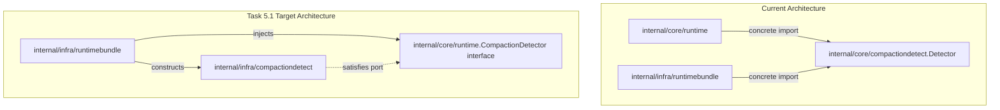

# Compaction Detector Characterization Evidence

- **Task**: 1.5 (P) Characterize compaction detector port semantics and lifetime
- **Spec**: `pre-oss-core-slimming`
- **Boundary**: Core Runtime Detector Port / Process Ownership (`internal/core/compactiondetect` -> `internal/infra/compactiondetect` + `internal/core/runtime` consumer port)
- **Status**: Completed & Verified

---

## 1. Executive Summary

Task 1.5 characterizes the complete runtime observation contracts, lifetime ownership, and structural invariants of `compactiondetect` before its dependency inversion in Task 5.1 and relocation to `internal/infra/compactiondetect` in Phase 5.
The objective is to establish the current `internal/core/compactiondetect` implementation as a replaceable oracle whose behavioral invariants, execution ordering, and single-process lifetime are pinned through mechanical AST inspections and runtime characterization tests.

### Key Characterization Invariants Pinned

1. **Exact Detector Methods Called by Core Runtime**:
   - `RequestOpened(meta RequestMeta, call lipapi.Call) []compaction.Event`
     - Invoked by `Executor.observeCompactionOpened` in `internal/core/runtime/executor_compaction.go`.
     - Observes logical request open after the first upstream B-leg opens successfully.
     - Maps correlation metadata 1:1 to `compaction.PreservationMeta`.
   - `PreviewResponse(meta ResponseMeta, ev lipapi.Event) compaction.ResponsePreview`
     - Invoked by `responsePipeline.observeCompactionReleaseFinalEvidence` in `internal/core/runtime/executor_compaction.go`.
     - Pure candidate recognition running **before** preserver callbacks; does not mutate detector state, rolling text windows, or emit events.
   - `ResponseReleased(meta ResponseMeta, ev lipapi.Event) []compaction.Event`
     - Invoked by `responsePipeline.observeCompactionReleaseFinalEvidence` in `internal/core/runtime/executor_compaction.go`.
     - Committed observation executed **after** preserver callbacks; updates rolling text window and commits transaction transitions.
   - *Note*: `PreviewRequest` is not called by core runtime (only tested in test suites); runtime depends exclusively on the three methods above.

2. **Contract Representability with Existing Contracts**:
   - All correlation metadata fields in `RequestMeta` and `ResponseMeta` (`TraceID`, `ALegID`, `BLegID`, `AttemptSeq`, `SessionID`) map directly to `compaction.PreservationMeta` without conversion loss.
   - All data inputs (`lipapi.Call`, `lipapi.Event`) and outputs (`compaction.ResponsePreview`, `[]compaction.Event`) are existing, stable types in `pkg/lipapi` and `pkg/lipsdk/compaction`.
   - No new public SDK types or metadata contracts are required to define the core runtime consumer port.

3. **Runtime Execution Ordering and Preservation Invariants**:
   - **Request-Open Seam**: Detector `RequestOpened` runs -> correlation fields (`TraceID`, `ALegID`, `BLegID`, `AttemptSeq`, `SessionID`, `TransactionID`, `RuleID`, `Evidence`) are populated into `PreservationMeta` -> Preserver `RequestOpened` runs -> Observer `OnCompaction` receives dispatched events.
   - **Response-Release Seam**: Pure `PreviewResponse` runs -> Preserver `BeforeResponseRelease` evaluates the candidate preview on the candidate event -> if preserver errors/panics, event mutation is rolled back -> committed `ResponseReleased` observes the final event -> Preserver `AfterResponseRelease` executes -> Observer `OnCompaction` receives dispatched completion events.

4. **Panic Isolation & Fail-Open Semantics**:
   - Runtime wraps all three detector calls in safe recover blocks (`safeCompactionRequestOpened`, `safeCompactionPreviewResponse`, `safeCompactionResponseReleased`).
   - Detector panics or invalid states are completely isolated: panic is recovered, zero-values/empty slices are returned, and user request/response streaming continues without interruption (fail-open).

5. **Mechanical Source & Single Process Lifetime Ownership Proof**:
   - **0 Goroutines**: AST inspection proves zero `go ` statements in `internal/core/compactiondetect` production code.
   - **0 Closers**: `*Detector` implements no `Close` method or `io.Closer` interface.
   - **0 External I/O**: Imports are strictly bounded to standard library (`crypto/sha256`, `encoding/binary`, `encoding/hex`, `strconv`, `strings`, `sync`, `time`, `unicode/utf8`) and public repository contracts (`pkg/lipapi`, `pkg/lipsdk/compaction`). No network, filesystem, database, or process I/O is performed.
   - **Process Lifetime Owner**: `ProcessServices` constructed in `runtimebundle` owns the single `*compactiondetect.Detector` instance. Replaced runtime generations share this reference; generations own no detector lifecycle or copy.

---

## 2. Runtime Call Seams and Contract Mapping

### 2.1 Core Runtime Call Inventory

| Seam / Runtime Caller | Detector Method Called | Input Arguments | Output Values |
|---|---|---|---|
| `Executor.observeCompactionOpened` (`internal/core/runtime/executor_compaction.go:69`) | `RequestOpened` | `compactiondetect.RequestMeta`, `lipapi.Call` | `[]compaction.Event` |
| `responsePipeline.observeCompactionReleaseFinalEvidence` (`internal/core/runtime/executor_compaction.go:147`) | `PreviewResponse` | `compactiondetect.ResponseMeta`, `lipapi.Event` | `compaction.ResponsePreview` |
| `responsePipeline.observeCompactionReleaseFinalEvidence` (`internal/core/runtime/executor_compaction.go:185`) | `ResponseReleased` | `compactiondetect.ResponseMeta`, `lipapi.Event` | `[]compaction.Event` |

### 2.2 Correlation Metadata Field Mapping

| `compactiondetect.RequestMeta` / `ResponseMeta` | `compaction.PreservationMeta` | Type | Representation Status |
|---|---|---|---|
| `TraceID` | `TraceID` | `string` | Exact 1:1 match |
| `ALegID` | `ALegID` | `string` | Exact 1:1 match |
| `BLegID` | `BLegID` | `string` | Exact 1:1 match |
| `AttemptSeq` | `AttemptSeq` | `int` | Exact 1:1 match |
| `SessionID` | `SessionID` | `string` | Exact 1:1 match |
| *(derived on open/preview)* | `TransactionID` | `string` | Stamped from emitted event / preview |
| *(derived on open/preview)* | `RuleID` | `string` | Stamped from emitted event / preview |
| *(derived on open/preview)* | `Evidence` | `compaction.Evidence` | Stamped from emitted event / preview |

---

## 3. Complete Inventory: `internal/core/compactiondetect`

### 3.1 Production Source Files (4 Files, 1,206 Physical Lines)

| File | Lines | Primary Responsibility / Symbols |
|---|---|---|
| `detector.go` | 715 | State management, concurrency locking, lazy sweep, lifecycle methods (`Detector`, `Config`, `New`, `RequestOpened`, `PreviewRequest`, `PreviewResponse`, `ResponseReleased`) |
| `doc.go` | 12 | Package documentation and architectural boundary definition |
| `heuristic.go` | 173 | Content-free token estimation, tail hashing, and conservative history heuristic matcher (`fingerprint`, `heuristicMatch`) |
| `rules.go` | 306 | Versioned coding-agent heuristic and signature pattern recognition (`rule`, `matchStartRule`, `matchCompleteRule`, marker constants) |

### 3.2 Test Source Files (6 Files, 1,502 Physical Lines)

| File | Lines | Coverage / Scope |
|---|---|---|
| `characterization_test.go` | 196 | Task 1.5 mechanical AST source inspection (0 goroutines, 0 Close, import whitelist), contract representability, and nil/blank safety |
| `content_free_test.go` | 67 | Content-free semantic fingerprinting and token estimation tests |
| `heuristic_test.go` | 196 | History-based compaction heuristic detection and conservative boundary rules |
| `preview_test.go` | 160 | Pure preview isolation without mutating state or active transactions |
| `rules_test.go` | 619 | Signature rule matching across coding-agent formats and protocol variants |
| `transactions_test.go` | 264 | Transaction lifecycle, state transitions, TTL eviction, and sweep mechanics |

---

## 4. Non-Test Import Audit: `internal/core/compactiondetect`

### 4.1 Production Call Sites (6 Files)

| File | Importing Path / Usage |
|---|---|
| `internal/core/runtime/executor_compaction.go` | Runtime compaction observation seams (`safeCompactionRequestOpened`, `safeCompactionPreviewResponse`, `safeCompactionResponseReleased`) |
| `internal/core/runtime/executor_config.go` | `CompactionRuntime.Detector *compactiondetect.Detector` |
| `internal/core/runtime/response_pipeline.go` | `responsePipeline.detector *compactiondetect.Detector` |
| `internal/infra/runtimebundle/process_services_types.go` | `ProcessServices.CompactionDetector *compactiondetect.Detector` |
| `internal/infra/runtimebundle/background_aux_lifecycle.go` | Process instantiation `ps.CompactionDetector = compactiondetect.New(compactiondetect.Config{})` |
| `internal/infra/runtimebundle/build_executor.go` | Generation runtime wiring `CompactionRuntime{Detector: in.CompactionDetector, ...}` |

---

## 5. Dependency Gap & Target Port Specification for Task 5.1

### 5.1 Current Architecture vs. Task 5.1 Target



### 5.2 Consumer Port Contract (to be created in Task 5.1)

```go
// package runtime; internal consumer port in internal/core/runtime/compaction_detector_port.go
type CompactionDetector interface {
    RequestOpened(compaction.PreservationMeta, lipapi.Call) []compaction.Event
    PreviewResponse(compaction.PreservationMeta, lipapi.Event) compaction.ResponsePreview
    ResponseReleased(compaction.PreservationMeta, lipapi.Event) []compaction.Event
}
```

### 5.3 Changes Required in Task 5.1:
1. Introduce `compaction_detector_port.go` in `internal/core/runtime`.
2. Change `CompactionRuntime.Detector` in `executor_config.go` from `*compactiondetect.Detector` to `CompactionDetector`.
3. Change `responsePipeline.detector` in `response_pipeline.go` from `*compactiondetect.Detector` to `CompactionDetector`.
4. Update safe panic wrappers in `executor_compaction.go` to consume `CompactionDetector`.
5. Remove all `internal/core/compactiondetect` imports from `internal/core/runtime`.

---

## 6. Verification and Characterization Evidence

### 6.1 Validation Commands Executed

```powershell
# 1. Focused Compaction Suites across core/compactiondetect and core/runtime
go test -count=1 ./internal/core/compactiondetect ./internal/core/runtime -run 'Compaction|compaction'
# Output: PASS (compactiondetect 0.520s, runtime 1.363s)

# 2. Full package suites
go test -count=1 ./internal/core/compactiondetect
# Output: ok github.com/matdev83/go-llm-interactive-proxy/internal/core/compactiondetect 0.516s

go test -count=1 ./internal/core/runtime
# Output: ok github.com/matdev83/go-llm-interactive-proxy/internal/core/runtime 4.415s

# 3. Downstream runtimebundle and architecture gates
go test -count=1 ./internal/infra/runtimebundle ./internal/archtest -run 'Compaction|compaction'
# Output: PASS (runtimebundle 1.290s, archtest 3.892s)
```

### 6.2 Characterization Summary Verdict

- **Mechanical Invariants**: PASS (0 goroutines, 0 Close methods, strictly bounded imports, 0 external I/O).
- **Contract Representability**: PASS (all inputs and outputs representable with existing `lipapi` and `pkg/lipsdk/compaction` types).
- **Execution Ordering**: PASS (RequestOpened -> Preserver RequestOpened -> Observer; PreviewResponse -> Preserver BeforeResponseRelease -> ResponseReleased -> Preserver AfterResponseRelease -> Observer).
- **Panic Isolation**: PASS (safe wrappers isolate panics and preserve fail-open execution).
- **Single Process Ownership**: PASS (`ProcessServices` remains single owner; generation reload shares detector instance).
