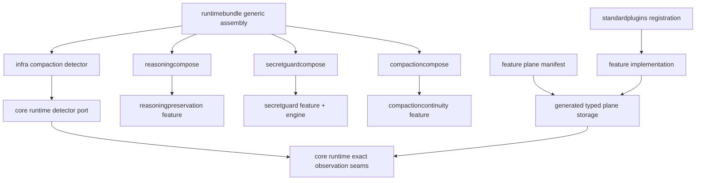
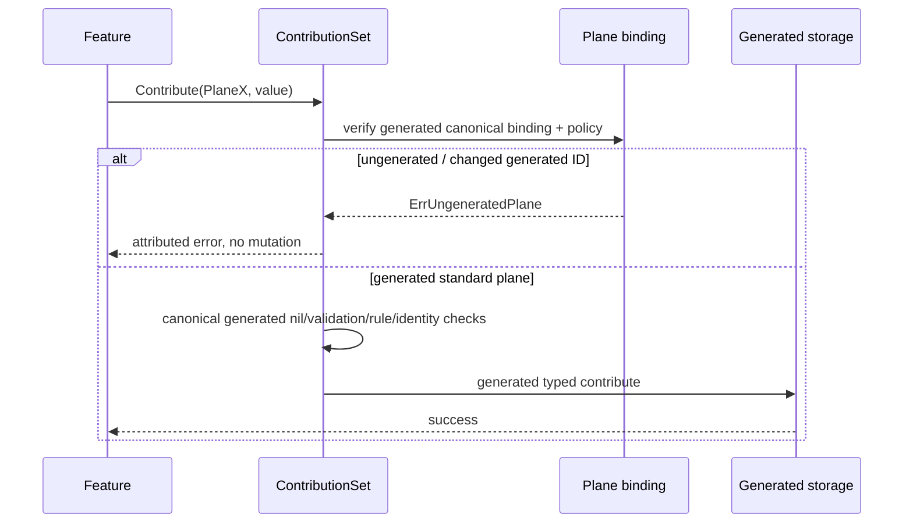
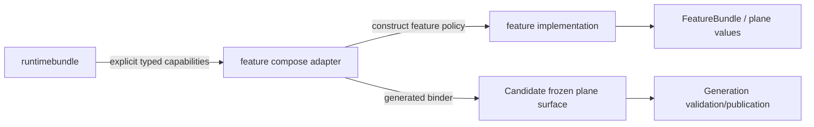
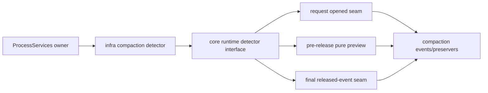

# Design Document

## Overview

**Purpose**: Finish the minimum core/extension ownership cleanup required before Go-LIP exposes its OSS plugin surface. The design makes the generated standard plane catalog the only supported v1 feature-plane transport, physically removes three clear optional-feature implementations from `internal/core`, and prevents `runtimebundle` from becoming a concrete-feature switchboard.

**Users**: OSS feature authors need a truthful SDK contract; maintainers need a small stable kernel boundary; operators need unchanged behavior across startup/reload; implementation agents need a bounded, mechanical migration plan rather than an open-ended architecture exercise.

**Impact**: This is a structural ownership migration over the already-correct extension-plane substrate. It does not add a new execution stage, change `FeatureBundle` schema, change the 25 standard plane IDs, or alter routing/stream semantics. It intentionally leaves a documented second full-closure program.

### Goals

- Resolve #554 by making generated standard planes the only supported v1 production plane set and deleting arbitrary map/reflection fallback.
- Make tool-call repair and secret matching/source logic physically feature-owned.
- Make core runtime depend on a narrow compaction detector port rather than a concrete heuristic implementation.
- Make `runtimebundle` free of direct concrete feature implementation imports.
- Preserve current process/generation/request lifetime authorities and immutable-generation behavior.
- Add hard architecture and change-surface ratchets that prevent re-growth.
- Publish an executable external-style feature-authoring proof and corrected docs.
- Finish within a release-bounded scope; record residual work for the second full-closure SDD.

### Non-Goals

- Fully dynamic arbitrary extension planes.
- A public or private service locator, DI container, Cordis runtime, effect graph, or runtime `requires/provides` system.
- A new public generic generation-binding extension API.
- Redesigning or relocating routing, B2BUA, billing, secure session, terminal work, provider adapters, frontends, canonical models, or extension stage runners.
- Full decomposition of `compactioncontinuity`, `conversationview`, `interleavedthinking`, `interleavedstate`, `terminaldecisionpolicy`, or every feature-adjacent `internal/core` package.
- #394 latency/load/HOLD optimization or certification.

## Boundary Commitments

### This Spec Owns

- The v1 closed standard-plane contribution contract and removal of ungenerated production fallback.
- Physical ownership of `toolcallrepair`, secret-guard matcher/catalog/source policy, and the concrete compaction detector.
- A private core consumer port for compaction detection.
- Dedicated explicit feature composition adapters for reasoning compression and secret guard.
- `runtimebundle` concrete-feature import elimination.
- Architecture ratchets, core-budget reset, external feature fixture, docs, and final release evidence.

### Out of Boundary

- New extension plane semantics or changes to the standard plane count.
- Replacing current dedicated `compactioncompose` with a common framework.
- Moving process/generation cleanup authorities.
- Removing every feature-specific public option currently exposed by `pkg/lipruntime`; such compatibility/API cleanup belongs to full closure unless required by the moves below.
- Turning feature packages into separately loaded Go-native plugins. Standard in-process features remain explicitly linked/registered.

### Allowed Dependencies

- Feature implementation -> `pkg/lipapi`, `pkg/lipsdk`, standard library, feature-local subpackages.
- `internal/infra/<feature>compose` -> concrete feature package + public SDK + generic internal composition/domain ports strictly required to assemble it.
- `runtimebundle` -> dedicated infra compose adapters, generic core/runtime types, SDK contracts; **not** concrete `internal/plugins/features/*`.
- `internal/core/runtime` -> public SDK/canonical types and consumer-owned private interfaces; **not** concrete detector or feature packages.
- `internal/standardplugins` -> concrete feature root packages for explicit standard registration/factory construction; not feature implementations under `internal/core`.

### Forbidden Dependencies / Shapes

- `internal/core/** -> internal/plugins/features/**`.
- `internal/infra/runtimebundle/** -> internal/plugins/features/**`.
- Any re-created production package at `internal/core/toolcallrepair`, `internal/core/secretguard`, or `internal/core/compactiondetect`.
- Production `map[string]any`/reflection storage for arbitrary extension planes.
- Feature ID switches in core/runtimebundle.
- A generic services map, `Resolve[T]`, `GetService`, reflection registry, or `any` dependency bag for feature composition.

### Revalidation Triggers

- A new standard plane or change to `Plane[T]` generated binding mechanics.
- A new process/generation-bound feature that cannot use an existing dedicated adapter pattern.
- A compaction detector method/lifetime change.
- A secret-guard source or access-mode change.
- New direct feature imports in generic composition.
- Any change to request snapshot publication/reload behavior.

## Architecture

### Existing Architecture Analysis

The corrected extension platform has the right **data path**:

```text
feature config/factory
    -> ContributionSet
    -> generated typed Plane[T] contribution
    -> FrozenPlaneSet
    -> candidate generation
    -> RequestRuntimeSnapshot
    -> generic stage consumer
```

The remaining defects are **ownership around that path**:

```text
current toolcallrepair:
feature config -> standardplugins -> internal/core/toolcallrepair -> ToolCallFinalizers plane

current secretguard:
feature config -> runtimebundle -> internal/core/secretguard + feature guard -> SecretGuards plane/services

current compaction detection:
runtimebundle -> internal/core/compactiondetect concrete type -> runtime exact observation seams

current reasoning compression:
runtimebundle -> concrete reasoningpreservation config/policy/services -> generated plane binders
```

The target architecture keeps the generic pipeline unchanged but moves the concrete policy outward.

### Target Boundary Map



**Architecture Integration**:
- **Selected pattern**: dependency inversion at concrete policy boundaries plus explicit typed feature composition adapters.
- **Domain/feature boundaries**: core controls stage timing and irreversible output seams; feature packages own optional algorithms/policy; infra adapters translate process/generation capabilities into feature constructors.
- **Existing patterns preserved**: immutable generations, explicit registration, generated planes, compactioncompose, fail-closed candidate publication, request pinning.
- **No new framework**: no dynamic registration or runtime dependency graph.

**Project Boundary Questions**:
- **Core-owned or plugin-owned?** Stage order, routing, output commit, snapshots and detector call positions are core-owned. Repair rules, secret matcher/catalog, and coding-agent compaction heuristics are not.
- **Canonical or adapter-specific?** No canonical `lipapi` shape changes. Dedicated compose adapters are internal assembly only.
- **Streaming-first preserved?** Yes; all feature behavior remains on existing canonical streaming paths.
- **Provider SDK leakage?** None.
- **Retry/failover semantics?** Unchanged; compaction observation remains after successful open / final release at existing seams.
- **Security/diagnostics posture?** Secret guard keeps opaque matcher and content-free inventory; no new secret surface.
- **Extension platform seam?** Existing planes only; no second hook chain.

## File Structure Plan

### 1. Closed feature-plane SDK

```text
pkg/lipsdk/feature/
├── plane.go                 # generated binding eligibility contract; standard Plane API retained
├── contributions.go         # generated-only contribution path; no arbitrary values maps
├── frozen.go                # generated-only frozen storage/replay/clone/request freeze
├── errors.go                # stable ErrUngeneratedPlane
├── plane_manifest.go        # unchanged standard declarations unless generator binding metadata requires mechanical output support
├── plane_generated.go       # regenerated; remove map fallback helpers
└── *_test.go                # closed-contract, fail-before-mutate, standard-plane parity

internal/archtest/
├── plane_emitter.go         # stop emitting map fallback helpers
├── plane_generator*.go      # generated binding/closed-manifest validation
└── plane_rules*.go          # forbid production fallback/reflection reintroduction
```

**Implementation directive**: do not hand-edit `plane_generated.go`. Change generator/emitter first, regenerate, then run `-check`.

#### Closed-plane eligibility and canonical policy

`ContributeSource` must distinguish a canonical generated binding from an arbitrary `Plane[T]`. Binding presence/ID alone is not sufficient because `Plane[T]` exposes policy fields such as `Rules`, `NilPolicy`, `Validate`, `Combine`, and `Identity`; a caller can copy a canonical `PlaneX` value and mutate those exported fields while retaining its unexported generated binding. Production composition must therefore use **canonical generated policy metadata** rather than mutable exported fields on the caller's copy.

The smallest acceptable contract is an unexported generated binding that contains both the typed storage accessors and an immutable canonical policy record populated by generation for every standard plane. An unbound `Plane[T]{...}` fails before validation/combine/state mutation. A copied standard plane whose `ID` is changed also fails. A same-ID copy with mutated exported policy fields cannot alter production behavior because the generated policy record is authoritative.

Conceptual shape:

```go
var ErrUngeneratedPlane = errors.New("feature: ungenerated plane")

type generatedPolicy[T any] struct {
    planeID                 string
    rules                   SourceRules
    nilPolicy               NilPolicy
    isNil                   func(T) bool
    validate                func(T) error
    validateIdentity        func(string) error
    combine                 func(SourceKind, T, T) (T, error)
    identity                func(T) (string, bool)
    exclusiveConflictError  error
}

type generatedAccess[T any] struct {
    contribute func(*generatedContributions, SourceKind, string, T) error
    get        func(*generatedFrozen) T
    identity   func(*generatedFrozen) (string, bool)
    policy     *generatedPolicy[T]
}

func ContributeSource[T any](s *ContributionSet, p Plane[T], source SourceKind, contributorID string, v T) error {
    gp := p.generated.policy
    if p.generated.contribute == nil || p.generated.get == nil || gp == nil || gp.planeID != p.ID {
        return &AttributedError{PluginID: contributorID, PlaneID: p.ID, Err: ErrUngeneratedPlane}
    }

    // All production contribution policy below is taken from gp, not from
    // p.Rules/p.NilPolicy/p.Validate/p.Combine/p.Identity/etc.
    rule := gp.rules.RuleFor(source)
    // nil policy -> validation -> identity/conflict -> generated typed contribute
    return nil
}
```

The exact generated representation may use an ordinal/token and generated closures rather than the illustrated struct, but it must satisfy all of these invariants:

1. support eligibility is unexported, generated-only, deterministic, allocation-free, and not based on runtime reflection, mutable registration, a runtime ID map, or pointer identity;
2. the generated binding's exact canonical plane ID must match `p.ID` before any policy callback or candidate mutation;
3. all production contribution decisions currently derived from mutable exported `Plane` fields (`Rules`, `NilPolicy`, `IsNil`, `Validate`, `ValidateIdentity`, `Combine`, `Identity`, and conflict policy) come from generated canonical metadata/closures after the binding check;
4. request materialization/borrowing, frozen validation, diagnostics projection used by runtime, and replay continue to use generated manifest output rather than consulting a caller-mutated `Plane` copy;
5. exported `PlaneX` declarations remain source-compatible descriptors for ordinary callers; mutating a copied descriptor is not a way to redefine a standard plane.

Adversarial tests must cover: a wholly arbitrary unbound plane; a copied standard plane with a changed ID; and a same-ID copy whose exported rules/nil policy/validator/identity/combiner are deliberately mutated. The same-ID case must prove canonical behavior still wins (or, if implementation chooses a generated integrity token that can deterministically reject the copy without reflection/function comparison, rejection is also acceptable). No mutated copy may influence stored values, identity, source admission, or failure policy.

#### Closed-path completeness

The closed contract is not complete merely when `ContributeSource` rejects an unbound plane. The implementation must explicitly verify all paths named by #554:

- contribution and `ContributionSet.Freeze`;
- `FrozenPlaneSet.Clone` / `ToContributions` and validation;
- request freeze/materialization;
- `FeatureBundle.Validate` (which delegates to the frozen plane set);
- ordinary replay;
- candidate replay.

For a valid standard plane these paths operate only on generated typed storage/metadata. No arbitrary-plane value/identity map, reflection clone, type-assertion replay, or fallback lookup survives. Validation/request-freeze tests must prove malformed/unsupported inputs fail before any destination mutation where a destination exists.

`ContributionSet` target shape:

```go
type ContributionSet struct {
    pluginIDs map[string]string // may remain only if needed for attribution/occupancy; evaluate usage
    generated *generatedContributions
}
```

`values map[string]any` and arbitrary `identities map[string]string` must be deleted if no generated-path consumer requires them. If `pluginIDs` is still needed for diagnostics/attribution, it is not arbitrary value storage and may remain; do not delete it merely to achieve "zero maps" if doing so creates a generated mirror. Request hot paths must remain map-free.

`FrozenPlaneSet` target shape:

```go
type FrozenPlaneSet struct {
    frozen *generatedFrozen
}
```

If a small generated metadata field is required for plugin attribution, use generated typed/ordinal metadata. Do not retain arbitrary-plane value maps.

#### Test-only generated bindings

Several existing SDK tests intentionally use local planes to exercise fallible combiners/source rules independently of the manifest. Once production rejects unbound planes, those tests must not accidentally become tests of `ErrUngeneratedPlane` instead of their intended path.

Extend `BindGeneratedAccessForTest` (or replace it with an equally isolated test-only helper) so it attaches the same generated eligibility/canonical-policy shape used by production without exporting that capability to normal consumers. Migrate at least `TestContribute_FailBeforeMutate_TableDriven`, `TestContribute_InterfaceValuedPlane_NonSliceCombinerReturn`, and any other raw-plane test whose purpose is combination/source/identity behavior. Keep separate unbound-plane tests that intentionally verify `ErrUngeneratedPlane`.

### 2. Tool-call repair feature ownership

Target layout:

```text
internal/plugins/features/toolcallrepair/
├── config*.go                 # existing
├── bundle.go                  # new/expanded: complete FeatureBundle(cfg)
├── repair/                    # moved concrete implementation
│   ├── engine.go
│   ├── finalizer.go
│   ├── schema*.go
│   ├── catalog*.go
│   ├── json/tail helpers...
│   └── corresponding tests/fuzz/bench
└── feature integration tests

internal/core/toolcallrepair/   # DELETE after migration
```

Use a feature-local subpackage (`repair`) to keep config/YAML from the engine internals and avoid a monolithic root package. The exact existing core files move mechanically into that subpackage; imports must remain public canonical/SDK or feature-local.

Feature root owns policy translation:

```go
func FeatureBundle(cfg Config) (feature.FeatureBundle, error) {
    fin := repair.NewFinalizer(repair.FinalizerPolicy{...cfg mapping...})
    cs := feature.NewContributionSet()
    // contribute finalizer and max-args scalar
    return feature.BundleFromPlanes(cs.Freeze(), nil), nil
}
```

`internal/standardplugins/features_install.go` target:

```go
func featureToolCallRepair(n yaml.Node) (feature.FeatureBundle, error) {
    cfg, err := toolcallrepair.DecodeConfig(n)
    if err != nil { return feature.FeatureBundle{}, err }
    return toolcallrepair.FeatureBundle(cfg)
}
```

No core repair import or duplicate config-to-policy mapping remains in standardplugins.

### 3. Secret-guard feature ownership

Target layout:

```text
internal/plugins/features/secretguard/
├── existing config/guard/scan/redaction code
├── engine/
│   ├── catalog.go
│   ├── matcher.go
│   ├── aho_corasick.go
│   ├── known_prefix.go
│   ├── inventory/source collection helpers
│   ├── source.go
│   └── tests/bench
└── runtime_compose.go         # feature-level normalized config only

internal/infra/secretguardcompose/
├── compose.go                 # effective access-mode -> feature engine mode; environment input; audit observer assembly
└── compose_test.go

internal/core/secretguard/     # DELETE after migration
```

The feature engine must not import `internal/core/accessmode`. Define a feature-local mode:

```go
package engine

type AccessMode uint8
const (
    ModeSingleUser AccessMode = iota
    ModeMultiUser
)
```

This type is internal to the feature implementation, not SDK/public. `secretguardcompose` converts the already-validated effective core access mode to it. The engine keeps the environment port but only the composition adapter receives/provides it. Request-time feature callbacks do not gain an environment reader.

`secretguardcompose.Input` should be explicit, approximately:

```go
type Input struct {
    AccessMode          accessmode.Mode
    RuntimeConfig       secretguard.RuntimeConfig
    Guards              []sdk.Guard
    Environment         engine.Environment
    Inputs              engine.SingleUserOptions // or adapter-owned host input translated here
    DecisionObserver    sdk.DecisionObserver
    Logger              *slog.Logger
}

type Output struct {
    Plane     extensions.SecretGuardPlane
    Inventory *diag.InventoryExtras
}
```

Do **not** pass full `BuildOptions`, `ProcessServices`, registry, or config root to the adapter. Runtimebundle is responsible for extracting generic inputs and the effective access mode. The adapter may use `internal/infra/secretaudit` for the default slog observer.

### 4. Compaction detector dependency inversion

Target layout:

```text
internal/core/runtime/
├── compaction_detector_port.go    # private consumer port
├── executor_compaction.go         # uses port + SDK types only
└── executor_config.go             # CompactionRuntime.Detector is port interface

internal/infra/compactiondetect/
├── detector.go
├── heuristic.go
├── rules.go
├── feature extraction/fingerprint helpers
└── tests/bench

internal/core/compactiondetect/    # DELETE after migration
```

Use existing `compaction.PreservationMeta` as correlation input to avoid creating another public metadata contract:

```go
// package runtime; internal contract, not exported from pkg/lipsdk.
type compactionDetector interface {
    RequestOpened(compaction.PreservationMeta, lipapi.Call) []compaction.Event
    PreviewResponse(compaction.PreservationMeta, lipapi.Event) compaction.ResponsePreview
    ResponseReleased(compaction.PreservationMeta, lipapi.Event) []compaction.Event
}
```

If `ExecutorConfig` needs to name the type from another internal package during tests/composition, use an exported interface **inside `internal/core/runtime`** (`type CompactionDetector interface`) but do not add it to `pkg/lipsdk`. Export within an internal package is still repository-internal. Prefer the narrowest visibility that satisfies construction.

The concrete detector should accept the same meta directly, or a tiny adapter in `internal/infra/compactiondetect` should translate it into its private internal correlation shape. Runtime must no longer import the concrete implementation package.

Panic wrappers become interface-based:

```go
func safeCompactionRequestOpened(d CompactionDetector, meta compaction.PreservationMeta, call lipapi.Call) (events []compaction.Event) {
    defer func() { _ = recover() }()
    return d.RequestOpened(meta, call)
}
```

`runtimebundle/background_aux_lifecycle.go` constructs `compactiondetect.New(...)` from the new infra package and assigns it to the existing process-owned field/port. No cleanup registration is added because the current detector has no `Close` or worker. If implementation discovers a hidden owned goroutine/resource, STOP and repair the design/requirements before proceeding; do not invent ownership silently.

### 5. Dedicated feature composition adapters

#### Reasoning compression

Target:

```text
internal/infra/reasoningcompose/
├── options.go
├── generation.go
└── *_test.go

internal/infra/runtimebundle/reasoning_preservation_compression.go          # DELETE/move
internal/infra/runtimebundle/reasoning_preservation_compression_options.go  # DELETE/move
```

`reasoningcompose` may import the concrete `reasoningpreservation` feature because that is its purpose. Move the internal `ReasoningCompressionOptions` shape there so `runtimebundle` no longer imports the feature merely for field types.

Preferred private API:

```go
type Options struct {
    EgressPolicies  map[string]reasoningpreservation.EgressPolicy
    MatcherResolver secretguard.MatcherResolver
}

type GenerationInput struct {
    Registrations []lipsdk.Registration
    Client        auxiliary.BackgroundClient
    Poller        auxiliary.BackgroundPoller
    Options       Options
}

func Validate(in GenerationInput) error
func Bind(surface featurebundle.MergeSurface, in GenerationInput) (featurebundle.MergeSurface, error)
```

If the corrected featurebundle type is still named `GeneratedMergeSurface` on implementation baseline, use the actual current canonical name rather than creating a rename solely for this spec.

Runtimebundle remains responsible for obtaining the generation-bound `BackgroundAux` client/poller from the existing scheduler/runner owner and for selecting production-vs-testing host options. It passes resolved typed values to `reasoningcompose`; the adapter owns feature ID filtering, config decoding, feature service construction, and generated binder application.

`pkg/lipruntime` public reasoning-compression API remains source-compatible. Its current conversion into internal options may target `reasoningcompose.Options` through runtimebundle's internal option field. Do not redesign the public egress policy contract in this spec.

#### Secret guard

`runtimebundle` obtains:
- effective access mode,
- normalized feature runtime config or registrations needed to derive it,
- host environment/input override,
- guards from frozen feature planes,
- host decision observer/logger.

The dedicated adapter returns the `extensions.SecretGuardPlane` and inventory extras. Feature-specific source/matcher/audit composition is not coded in runtimebundle.

#### Compaction continuity

Leave `internal/infra/compactioncompose` intact except mechanical type/import changes required by detector relocation. It is the existing model for explicit feature-specific composition.

### 6. Architecture gates

Add permanent data-driven rules rather than task-numbered one-offs.

Required assertions:

1. **Core feature import rule**: no production file under `internal/core` imports `/internal/plugins/features/`.
2. **Runtimebundle feature import rule**: no production file under `internal/infra/runtimebundle` imports `/internal/plugins/features/`.
3. **Retired package rule**: no production Go files under the three retired core package directories.
4. **Closed plane rule**: production `ContributionSet`/`FrozenPlaneSet` contain no arbitrary value maps and feature package generated output does not emit map replay/validation helpers.
5. **No service-locator rule**: do not add generalized `map[string]any` dependency resolution to the new compose adapters.
6. **Feature tree boundaries**: recursively check the migrated toolcallrepair and secretguard feature trees for forbidden core/runtimebundle/front/backend imports, allowing only explicit feature-local subpackages and SDK/canonical contracts.
7. **Changesurface proof**: throwaway existing-plane feature changes no core/runtimebundle production path.
8. **Core budget**: reset `LineBudgets` `internal/core` ceiling to measured final + 25; reset runtimebundle package budget only if the move reduces its measured tree, never raise it to pay for adapter delegation.

Architecture rules should be implemented in existing reusable scanners (`import_rules`, `budgets`, plane rules) rather than generating another large task-specific analyzer family.

## System Flows

### Closed-plane contribution



A same-ID value-copy mutation of exported `Plane` policy fields follows the generated-standard branch and cannot change the canonical checks.

### Feature-specific generation composition



No feature package receives `ProcessServices` or a service lookup API.

### Compaction detection after relocation



The detector remains one process instance; generations only hold the injected interface reference.

## Requirements Traceability

| Requirement | Components | Primary files/surfaces |
| --- | --- | --- |
| 1.1-1.8 | Closed Plane SDK, Generator, arch rules | `pkg/lipsdk/feature`, `internal/archtest/plane_*` |
| 2.1-2.6 | Tool Repair Feature | `internal/plugins/features/toolcallrepair`, `internal/standardplugins` |
| 3.1-3.7 | Secret Guard Feature + Compose | `internal/plugins/features/secretguard`, `internal/infra/secretguardcompose` |
| 4.1-4.7 | Detector Port + Infra Detector | `internal/core/runtime`, `internal/infra/compactiondetect`, runtimebundle process composition |
| 5.1-5.7 | Dedicated composition adapters | `internal/infra/reasoningcompose`, `secretguardcompose`, `compactioncompose`, runtimebundle |
| 6.1-6.5 | Candidate/generation/reload parity | featurebundle/runtimebundle/runtime tests |
| 7.1-7.8 | Architecture ratchets | `internal/archtest`, changesurface, budgets |
| 8.1-8.5 | External SDK proof/docs | `testdata/external_feature_sdk`, docs |
| 9.1-9.5 | Performance/security/race | feature SDK benches, secretguard tests, detector race, QA |
| 10.1-10.5 | Scope boundary/full closure handoff | evidence/inventory/spec closeout |

## Components and Interfaces

| Component | Domain/Layer | Intent | Requirements | Key Dependencies |
| --- | --- | --- | --- | --- |
| Closed Plane SDK | public SDK | truthful generated-only v1 feature transport | 1, 8, 9 | generated manifest |
| Tool Repair Feature | feature plugin | own all malformed-tool repair policy | 2, 6 | `lipapi`, `lipsdk/toolcall` |
| Secret Guard Engine | feature plugin | own matcher/catalog/source algorithm | 3, 6, 9 | SDK secretguard |
| Secret Guard Compose | infra adapter | bind access mode/env/audit to feature services | 3, 5, 6 | core accessmode, feature engine |
| Compaction Detector Port | core consumer port | define only runtime-required detector operations | 4, 6 | lipapi, SDK compaction |
| Compaction Detector Impl | infra implementation | concrete coding-agent recognition state/rules | 4, 9 | consumer port semantics |
| Reasoning Compose | infra adapter | own concrete semantic-compression generation binding | 5, 6 | featurebundle, reasoning feature, auxiliary SDK |
| Arch Ratchets | architecture gates | make ownership changes permanent | 7 | existing scanners/budgets |
| External Feature Fixture | TCK/fixture | prove OSS author path | 8 | exported SDK only |

## Data Models

No persistent schema changes.

### Feature plane storage

Before:

```text
ContributionSet = generated typed storage + arbitrary maps
FrozenPlaneSet = generated typed storage + arbitrary maps
```

After:

```text
ContributionSet = generated typed storage + only minimal attribution metadata required by generated path
FrozenPlaneSet = generated typed frozen storage
Generated binding = typed access + canonical immutable standard-plane policy metadata
```

No arbitrary user-defined plane value survives contribution, and a copied standard plane cannot override canonical runtime policy through its exported descriptor fields.

### Compaction detector state

The existing bounded per-A-leg detector state moves unchanged in semantic shape. The move must not widen retained content or increase cardinality. Private implementation types remain private to the new infra package.

## Error Handling

### Closed plane

Add the stable sentinel in `pkg/lipsdk/feature`:

```go
var ErrUngeneratedPlane = errors.New("feature: ungenerated plane")
```

Tests, documentation, and the external fixture use this exact public identifier. It is wrapped in `AttributedError` with contributor + plane ID where available. Existing `AttributedError.Unwrap`/`Is` behavior is sufficient; do not create a second wrapper/error family.

### Feature composition

- Configuration decode error: preserve existing feature-qualified error.
- Missing generation prerequisite: fail candidate before publication with current classification/text expectations where tests pin them.
- Secret source/catalog error: preserve `runtimebundle: secret guard source` equivalent operator context at adapter caller boundary.
- Detector panic: continue current fail-open safe wrapper; never convert observation panic into request failure.

No new HTTP/wire error classes.

## Testing Strategy

### Unit Tests

1. Ungenerated plane contribution is rejected before mutation; a changed-ID copy is rejected; a same-ID copy with mutated exported policy cannot change canonical generated behavior.
2. `ContributionSet.Freeze`, request freeze/materialization, `FrozenPlaneSet.Validate`, `FeatureBundle.Validate`, ordinary replay, and candidate replay use generated-only state and preserve fail-before-mutate where applicable.
3. Generator no longer emits map fallback helpers; `-check` deterministic.
4. Existing raw-plane combiner/source tests are moved to isolated generated test bindings, while a separate raw unbound plane test remains an `ErrUngeneratedPlane` rejection test.
5. Tool repair engine/finalizer/schema tests pass in feature-local destination unchanged.
6. Secret engine tests pin single/multi/disabled source behavior and no secret leakage.
7. Compaction detector full existing suite runs at new package; consumer-port fake tests prove runtime no-op/panic/order behavior.

### Integration Tests

1. Standard toolcallrepair factory returns behavior-equivalent bundle without core import.
2. Secretguard standard config -> frozen guard + matcher services -> runtime execution matches previous fixtures.
3. Reasoning compression enabled/disabled/missing-capability/candidate rollback tests run through `reasoningcompose` + runtimebundle delegation.
4. Reload toggle tests for each migrated feature preserve pinned-generation behavior.
5. Runtime compaction request-open/preview/release order remains exact.

### Architecture / Contract Tests

1. Core/runtimebundle concrete feature imports rejected.
2. Retired packages rejected.
3. Dynamic plane fallback reintroduction rejected.
4. Recursive feature import boundaries for toolrepair/secretguard.
5. `testdata/external_feature_sdk` compiles using only public SDK, with `replace github.com/matdev83/go-llm-interactive-proxy => ../..` and `GOWORK=off`.
6. Existing-plane disposable changesurface probe yields zero core/runtimebundle edits.
7. Core line budget is lower and reset to final + 25.

### Performance / Concurrency

1. Extension seam allocation benchmark: no `allocs/op` regression versus the fresh Task 1.1 corrected baseline.
2. Benchmark evidence is collected in repeated same-host/same-toolchain batches. `B/op` and fixed-cost `ns/op` are compared and recorded; `ns/op` is not converted into a cross-machine release budget because #394 owns latency/load certification.
3. Tool repair existing benchmarks retained at moved path; this spec does not require speed improvement.
4. Secret matcher existing benchmark retained at moved path.
5. Linux `-race` on detector implementation + runtime integration and extension snapshot/runtimebundle scopes where changed.

## Security Considerations

- Closed planes reduce dynamic type/reflection attack/ambiguity surface; no runtime plugin code loading is added.
- Secret guard maintains environment isolation: only composition can supply environment; multi-user and disabled paths do not read it.
- No raw secret value enters diagnostics or plugin inventory.
- Feature composition adapters are explicit and typed; no arbitrary service discovery.
- Provider SDKs remain outside core/SDK/feature-generic composition.

## Performance & Scalability

- Generated plane access remains direct typed dispatch; removing arbitrary fallback simplifies non-generated state and does not add request lookup.
- Detector interface dispatch adds only a normal interface call at the same existing observation points; no new per-event goroutine, map, lock, or allocation is permitted by design.
- Dedicated adapters operate at startup/candidate compile, not request hot path.
- Benchmark comparison must use the exact corrected extension seam selector on the same host/toolchain/environment for baseline and candidate. Allocation-count regression is a blocking structural failure; timing evidence is a local fixed-cost regression signal, not #394 certification.
- #394 remains the owner of load/latency optimization and HOLD certification.

## Migration Strategy

Execute in standalone green waves; do not combine all production moves into one PR. The task plan defines exact ordering. At a minimum:

1. characterize + close ungenerated plane contract;
2. migrate tool repair;
3. migrate secret guard;
4. invert/move compaction detector;
5. extract runtimebundle feature composition adapters;
6. tighten ratchets, external fixture, docs, final evidence.

Each wave should remain within the 100-Go-file gate. If a mechanical move approaches the limit, split tests/implementation along package ownership boundaries rather than using `allow-large-change` by default.

## Residual Debt Contract for Full Closure

Closeout must create `.kiro/specs/pre-oss-core-slimming/residual-ownership-inventory.md` as the durable handoff artifact for the second spec. It must contain:

- implementation/merged-main SHA and inventory date;
- the classification vocabulary used;
- a table with columns `Responsibility`, `Current owner/package`, `Production consumers`, `Classification`, `Why retained/deferred`, and `Full-closure action`;
- at least the mandatory rows below;
- a summary count by classification and an explicit statement that no deferred finding exists only in chat/session history.

Mandatory rows:

- `internal/core/compactioncontinuity` process-owned branch coordination;
- `conversationview` generic B2BUA projection vs optional steering UX policy;
- `interleavedthinking` / `interleavedstate` ownership;
- `terminaldecisionpolicy` generic policy store vs feature-specific surface;
- remaining feature-specific `pkg/lipruntime` host options/adapters;
- dedicated `internal/infra/*compose` adapters and whether measured duplication justifies a common **private** mechanism;
- any other core package discovered by architecture scan whose primary reason for existence is an optional UX enhancement.

A small `tools/kiro/speccheck` contract test should accept both the active and archived spec path and fail if the artifact is missing, lacks required headings/columns, or omits a mandatory row. This check makes the handoff objective without turning runtime architecture code into a spec parser.

The full-closure spec must not reopen the closed-plane, three package moves, or runtimebundle import ratchets unless a verified defect requires correction.
