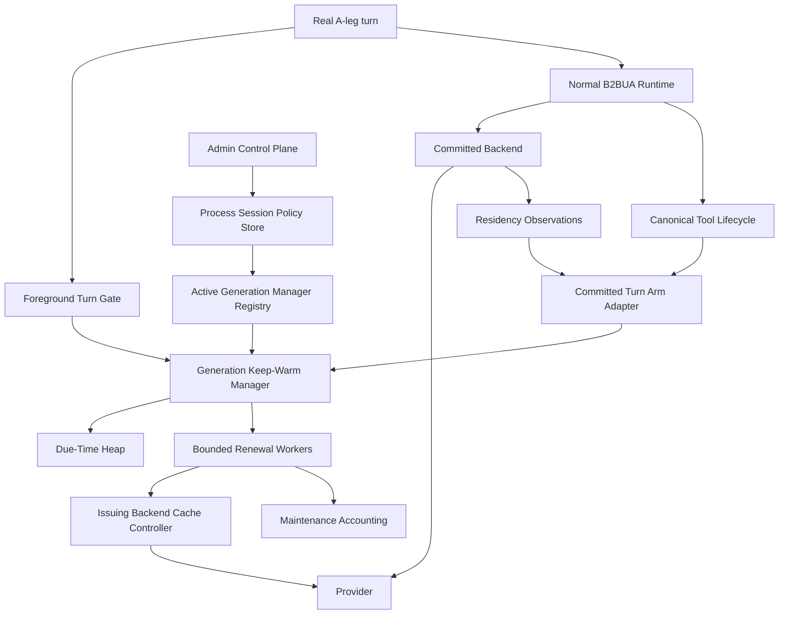
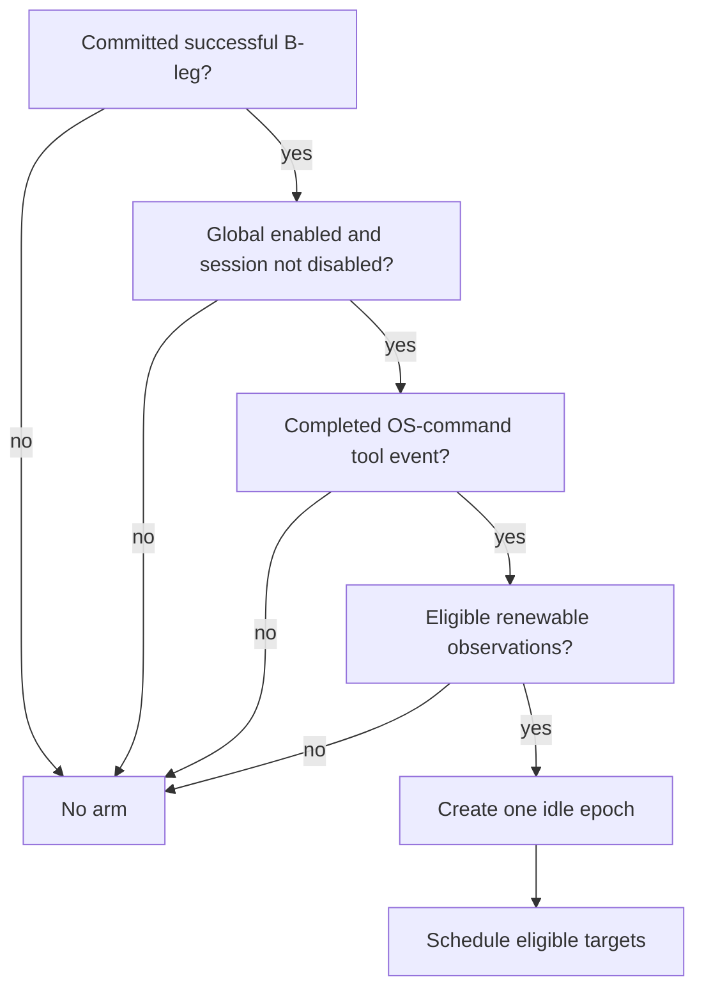
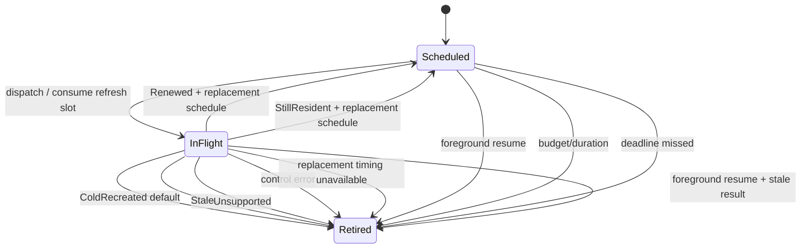

# Design Document

## Overview

This design implements issue #342's autonomous cache keep-warm behavior **on top of** the `prompt-cache-residency-contract` foundation from PR #350. It does not reinterpret provider cache keys or TTLs. Instead, it owns the policy question that the foundation deliberately left open:

> Given an actual renewable cache-residency observation from the committed foreground B-leg, should the proxy keep it resident while the coding harness is likely busy outside the proxy, and if so, when and for how long?

The selected answer is a revisioned A-leg **idle epoch** armed by a completed canonical OS-command tool call. One scheduler per immutable runtime generation manages all eligible targets in that generation with a priority heap and bounded workers. The next real A-leg turn synchronously invalidates the epoch before B-leg planning, so foreground traffic always wins. Provider renewal is invoked only through the issuing backend's spec1 control seam; normal routing/execution is never re-entered.

The global scheduler switch defaults on, but this is deliberately orthogonal to provider cache enrollment. If a backend produces no verified renewable target, default-on orchestration is a zero-provider-call no-op.

## Goals

- Arm maintenance only when a committed coding-agent turn hands the client an OS-command tool call and a renewable cache target exists.
- Use backend-supplied deterministic expiration where available; never convert minimum/best-effort/unknown lifetime into a guessed TTL.
- Cancel stale work at real-turn start with revision checks covering queued, in-flight, and late-completing jobs.
- Scale with one timer/state manager and a finite worker pool per runtime generation, never one ticker/goroutine per target.
- Bound autonomous traffic by refresh count, idle duration, active-target capacity, worker concurrency, timeout, cold-recreation policy, and optional usage budget.
- Expose authenticated global/per-A-leg controls without extending client inference protocols.
- Preserve provider billing evidence separately from foreground usage.
- Roll out active provider renewal only when concrete adapter semantics are proven; initially target direct Anthropic behind explicit foreground cache enrollment and live cache-effect validation.

## Non-Goals

- No provider TTL/cache-key database in core.
- No subprocess polling or command-duration prediction.
- No maintenance on ordinary conversational idle time by default.
- No synthetic `lipapi.Call` or fake user/assistant message in core.
- No cache target migration across config generations.
- No background route fallback, account failover, model substitution, race, or continuation mutation.
- No silent enabling/changing of Anthropic/OpenAI/Gemini/etc. cache enrollment or retention mode.
- No generic cache-resource creation/deletion.
- No autonomous Codex `generate=false` renewal without dedicated evidence.

## Dependency and Brownfield Fit

### Required prior contract

The implementation depends on spec1 for:

- cache lifecycle kinds;
- effective cache observations;
- opaque target/generation/handle identity;
- backend `Renew`/`Release` control;
- provider-billable maintenance evidence;
- executable-connector ABI mapping.

The scheduler imports those abstractions and must not reconstruct them.

### Existing runtime seams reused

- canonical tool lifecycle/category for `ToolCategoryOSCommand`;
- A-leg/session authority for idle-epoch ownership;
- B2BUA commitment so only the continuing B-leg can arm;
- immutable runtime generation composition/quiesce;
- `execbackend.Backend` spec1 controller capability;
- existing admin/control-plane authentication patterns;
- route-override-style A-leg mutable policy service/store;
- provider-billable accounting/cost projection;
- existing metrics/diagnostics and race/goleak quality gates.

## Architecture

### Ownership Map



### Lifecycle rule

The **manager is generation-owned**. The process-owned policy store/manager registry contains no provider handle/controller state. When a generation quiesces:

1. unregister manager from the process registry so no new admin broadcast retains it;
2. mark manager quiescing and reject new arms;
3. invalidate all epochs and cancel renewal contexts;
4. best-effort release local target handles;
5. stop timer dispatch and join bounded workers;
6. only then allow backend/connector instances to close.

Late observations after step 2 are rejected/released rather than migrated.

## Configuration

Add a bounded core configuration block conceptually equivalent to:

```yaml
prompt_cache:
  keepwarm:
    enabled: true
    max_refreshes_per_idle_epoch: 6
    max_idle_duration: 1h
    max_active_targets: 1024
    max_concurrent_renewals: 4
    renew_timeout: 15s
    continue_after_cold_recreate: false
    max_cold_recreates_per_idle_epoch: 0
    max_provider_tokens_per_idle_epoch: null
    heuristic_overrides: []
```

Exact YAML placement follows the repository's current config schema organization, but the semantics/defaults above are normative.

### Defaults rationale

- **enabled=true** satisfies the requested default-on behavior while remaining a no-op without renewable observations.
- **6 refreshes** is a conservative autonomous-call cap. For Anthropic's current 5-minute cache, six successful cache reads/refreshes cost roughly `6 × 0.1 = 0.6x` base input price for the cached prefix, still below one 5-minute cold cache write (`1.25x`) while covering roughly half an hour before the final refreshed entry naturally ages out. It is configurable for long builds.
- **1h max idle duration** independently stops abandoned sessions. For a 1-hour target, one renewal near expiry can leave the provider cache warm well after host maintenance stops.
- **1024 active targets** bounds host state; capacity loss only sacrifices an optimization.
- **4 concurrent renewals** keeps background provider traffic subordinate to foreground work.
- **15s renewal timeout** prevents a stuck background operation from monopolizing a worker and is comfortably inside the default lead for a 5-minute residency window.
- **cold recreation stops by default** because repeated full cache rewrites invert the intended economics.

All positive duration/count settings validate finite/non-zero values. `max_cold_recreates_per_idle_epoch > 0` is invalid unless continuation after cold recreation is explicitly enabled. Optional provider-token budget must be positive when present.

### Heuristic overrides

No provider heuristic is built in. An override is operator data:

```yaml
heuristic_overrides:
  - backend_instance: deepseek
    canonical_model: ""   # optional exact match; empty = backend-wide
    interval: 1h
```

Rules:

- exact backend instance match is mandatory;
- canonical model match is exact when supplied (no regex execution in scheduler hot path);
- deterministic `ExpiresAt` always wins over a heuristic;
- override is usable only when the issuing backend emitted `Renewable=true` and exposes a controller;
- the lifecycle observation remains `unknown`/`best_effort`/`minimum_residency`; host policy does not rewrite it.

## Core Domain Model

Illustrative internal types:

```go
type EpochRevision uint64
type TargetRevision uint64

type ArmInput struct {
    ALegID              string
    BLegID              string
    CommittedSuccessful bool
    ToolEvents          []lipapi.ToolEvent
    Observations        []promptcache.Observation
    BackendInstanceID   string
    CanonicalModelID    string
    Controller          promptcache.Controller
}

type idleEpoch struct {
    aLegID         string
    revision       EpochRevision
    armedAt        time.Time
    stopAt         time.Time
    refreshes      uint32
    coldRecreates  uint32
    targets        map[targetKey]*targetState
}

type targetState struct {
    observation promptcache.Observation
    revision    TargetRevision
    dueAt       time.Time
    schedule    scheduleKind
    controller  promptcache.Controller
    inFlight    bool
    cancel      context.CancelFunc
    sequence    uint64
}
```

`promptcache.Controller` here is a generation-bound binding to the already issuing backend instance. It cannot route elsewhere.

`TargetID`, `GenerationID`, and `Handle` remain opaque. Internal map equality may use their bounded values; they are never logs/metric labels.

### Epoch revision

Use a monotonically increasing manager-local uint64 revision source. On exhaustion, fail closed: reject new maintenance epochs for the generation and emit a fatal/diagnostic condition rather than wrapping to an old revision.

Target revision increments whenever a replacement observation changes handle/timing/identity. Every worker job/result carries both epoch and target revision.

## Runtime Integration

### 1. Foreground turn gate

As soon as authoritative A-leg correlation has been established for a real incoming request, but before route planning/backend execution:

```go
manager.BeginForegroundTurn(aLegID)
```

Behavior under manager lock/state ownership:

1. find current epoch;
2. increment/invalidate revision and detach the epoch from active scheduling;
3. cancel in-flight target contexts;
4. enqueue best-effort local handle releases;
5. return immediately.

No provider/network wait is allowed on this foreground path. Connector-local release RPC failure is harmless because adapter state is bounded and generation close invalidates it.

### 2. Committed terminal arm adapter

During ordinary streaming, existing lifecycle enrichment/collection records completed tool events. The spec1 stream sideband collects residency observations. After the runtime establishes **successful committed terminal** for the B-leg, one integration adapter calls:

```go
manager.ArmFromCommittedTurn(input)
```

Eligibility flow:



A target is eligible when:

- observation is renewable and has a valid handle;
- controller exists for the issuing backend;
- observation belongs to the committed B-leg/A-leg lineage;
- manager is not quiescing;
- target has a deterministic valid future `ExpiresAt`, **or** a matching explicit heuristic override;
- configured secondary usage budget, when present, can be conservatively evaluated.

Core does not inspect cache-read/write tokens to decide whether provider caching "really" happened; the backend is responsible for emitting renewable observations only when it can prove the target. Evidence remains accounting/diagnostic input.

### 3. Session end

A session-end/lifecycle hook calls both:

- process policy `Forget(aLegID)`;
- live generation manager invalidation for that A-leg.

This removes admin-state leakage and releases any live maintenance target.

## Scheduling Algorithm

### Deterministic expiry

For observations with valid `ObservedAt < ExpiresAt`:

```text
window = ExpiresAt - ObservedAt
lead   = clamp(window / 10, 15s, 5m)
spread = min(lead / 4, 30s)
due    = ExpiresAt - lead - earlySpread
```

`earlySpread` is deterministic in `[0, spread]`, derived from manager-local epoch revision + target insertion sequence. It never contains provider/cache/session identifiers and never schedules later than `ExpiresAt - lead`.

Rules:

- `ExpiresAt <= now`: target is deadline-missed and retired, not deliberately recreated.
- `due <= now < ExpiresAt`: target becomes immediately dispatchable.
- if the resulting safe window cannot tolerate a minimum scheduler/worker dispatch interval, retire with `unsafe_window` rather than spin.
- every successful control result replaces the old observation and recalculates from the new authoritative times.

### Non-deterministic lifetime

- `minimum_residency` alone: no timer.
- `best_effort`: no timer.
- `unknown`: no timer.
- exact operator heuristic: `due = lastObservedOrRenewedAt + interval`, subject to all same budgets/cancellation rules.

The scheduler never converts `MinimumResidentUntil` into `ExpiresAt`.

## Scheduler and Worker Design

### Manager-owned priority heap

Use one min-heap ordered by:

1. `dueAt`;
2. stable target insertion sequence.

Heap entries include epoch/target revisions. Lazy stale-entry removal is allowed; every pop validates current map state before dispatch.

The manager maintains:

- `epochsByALeg` map;
- total active target count;
- one resettable timer based on the earliest due entry/epoch stop deadline;
- bounded renewal worker capacity;
- bounded cleanup/release queue;
- result channel/wake signal.

No per-target ticker/goroutine exists.

### Worker pool

Start exactly `max_concurrent_renewals` long-lived renewal workers for the generation (or fewer only if disabled configuration constructs no scheduler; implementation may lazily start them on first eligible target if shutdown semantics remain deterministic).

Dispatch preconditions are rechecked immediately before work enters a worker:

- current epoch/target revisions match;
- global/session policy still allows it;
- refresh count and duration budget remain;
- target is not already in flight;
- known `ExpiresAt` has not passed;
- optional usage budget permits a conservative next call.

At dispatch:

1. increment epoch refresh count **before** provider call;
2. mark target in flight;
3. create a cancelable context with `renew_timeout`;
4. allocate a bounded unique maintenance `OperationID`;
5. submit only the issued handle/controller operation.

Worker returns result + provider-billable evidence to manager. Applying the result requires unchanged epoch + target revision; otherwise evidence may still be accounted, but scheduling state is discarded as stale.

### Release cleanup

`Release` is local-forget by spec1 but may cross the connector process boundary. It must not block `BeginForegroundTurn`.

- invalidation detaches state synchronously and queues release;
- cleanup shares bounded background execution but due renewals have priority;
- release is idempotent;
- if cleanup queue is saturated or generation is closing, dropping an explicit release is allowed after state is detached because backend target stores are themselves bounded and `Close` invalidates all handles;
- no release failure reactivates a target.

## Target Capacity

`max_active_targets` is generation-wide.

At capacity, preserve the most urgent targets:

1. compute new target due time;
2. find the retained target with latest due time (ties: greatest insertion sequence);
3. if new due is not earlier, reject/release the new target;
4. otherwise evict/release the latest-due retained target and insert the new one.

An O(N) scan only at the hard capacity boundary is acceptable for the default 1024-target cap and keeps the normal hot path/heap simple. Capacity pressure never rejects foreground traffic.

Targets without any schedule deadline (non-deterministic and no heuristic) are not inserted into the scheduler at all and their handles are released because the manager has no legal use for them.

## Renewal Result State Machine



### `Renewed`

Account evidence. Accept replacement observation if valid and same A-leg control domain. It may rotate handle/target generation according to backend semantics. Release superseded handle when distinct. Recalculate due time and reschedule if epoch budgets remain.

### `StillResident`

Same as `Renewed`, but do not assume TTL moved unless replacement observation says so. Without new usable timing/heuristic, retire.

### `ColdRecreated`

Account already-incurred provider cost. Increment cold-recreation count. Default `continue_after_cold_recreate=false` retires target immediately. If explicitly enabled, continuation is allowed only while its own cold-recreate cap and ordinary refresh/duration budgets remain and the replacement observation is valid.

### `Stale` / `Unsupported`

Retire and release. No alternate backend/account/model.

### error/cancellation

Account authoritative evidence if the control seam returns it separately. Generic scheduler performs no retry. Foreground-triggered cancellation/stale result never mutates current/new epoch.

## Budget Model

### Hard always-enforceable bounds

- refresh attempts per idle epoch;
- max epoch wall-clock duration;
- active targets;
- concurrent renewal operations;
- operation timeout;
- optional continuation after cold recreation with separate cap.

These do not depend on pricing or provider usage evidence.

### Optional provider-token budget

`max_provider_tokens_per_idle_epoch` is absent by default. When configured:

- manager uses the most recent observation/result provider token evidence to build a conservative next-call estimate;
- if no conservative estimate can be formed, the target is ineligible/retired with `budget_unknown` rather than treating missing evidence as zero;
- estimated next call plus accumulated actual/estimated maintenance tokens must fit the remaining budget before dispatch;
- after a result, authoritative provider-billable evidence replaces the estimate where available;
- the budget is per idle epoch across all targets.

A future monetary budget can use the same guard interface with the existing generation price catalog; this design does not require a second money/accounting model.

## Process-Owned Per-Session Administrative Policy

### Store

Create a bounded process-owned keep-warm session-policy store with default maximum **4096 disabled A-legs**.

State is only:

```go
type SessionPolicy struct {
    ALegID    string
    Disabled  bool
    Revision  uint64
    UpdatedAt time.Time
}
```

No provider handle/cache identity is stored.

Semantics:

- missing entry = inherit global setting;
- `Disable` creates/updates disabled entry;
- `Clear` removes entry;
- at capacity, a new `Disable` returns a bounded capacity/unavailable error rather than evicting an existing disable;
- session end removes entry;
- process restart clears store.

### Active manager registry

A process-owned registry holds only an `Invalidator` interface for currently live generation managers. Managers explicitly register at activation and unregister before quiesce. `Disable(aLegID)` broadcasts invalidation to all registered generations so a draining old generation cannot keep renewing that A-leg.

Architecture/race tests must prove unregister occurs and retired managers/backends are not retained by the registry.

### Admin service

Expose authenticated control-plane operations following existing A-leg admin conventions:

```go
Get(aLegID)
Disable(aLegID)
Clear(aLegID)
```

- normalize/validate A-leg authority through existing admin/session logic;
- mutation to store occurs before broadcast response;
- `Disable` broadcast is immediate but does not wait for provider control cancellation to finish;
- `Clear` never retroactively arms an epoch;
- global disabled master setting cannot be bypassed.

No client inference schema changes.

## Configuration Reload

The scheduler configuration is immutable per runtime generation.

On reload:

- new generation builds its own manager from validated config;
- old generation manager quiesces and releases all targets; no target migration;
- process-owned per-A-leg disable store survives generation replacement;
- heuristic overrides/budgets change only by building the new generation;
- an A-leg that was idle across reload remains without maintenance until its next eligible real foreground turn, which is an accepted optimization loss.

This is preferable to reconstructing provider cache state or retaining old backends.

## Provider Integration: Direct Anthropic First

### Enrollment configuration

Add direct-Anthropic backend-specific configuration, defaulting to current behavior:

```yaml
prompt_cache:
  enrollment: disabled   # disabled | automatic
  ttl: 5m                # 5m | 1h when automatic
```

This setting is independent of global keep-warm enablement. It applies only to the direct Anthropic Messages backend unless another concrete product adapter independently implements equivalent semantics.

### Foreground automatic enrollment

When `automatic`:

- add Anthropic top-level `cache_control: {type: ephemeral, ttl: ...}` using the supported SDK/wire shape;
- preserve all ordinary request semantics otherwise;
- do not enable it for unsupported compatible endpoints by inheritance;
- on successful response, inspect provider cache usage;
- if both cache creation/read evidence are zero and the adapter cannot otherwise prove residency, emit no renewable observation;
- when cache residency is proven, the adapter records the exact effective cacheable prefix/breakpoint and provider affinity in its bounded local target store and emits a spec1 observation with deterministic expiration according to the selected provider TTL semantics.

Use a conservative observation time anchored no earlier than the provider point at which the cache entry is known usable (for streaming, response-start/cache-usage evidence as appropriate), so host `ExpiresAt` never overstates remaining lifetime.

### Zero-output renewal

The adapter's spec1 `Renew` implementation:

1. resolves current credentials but enforces the same provider account/workspace binding;
2. reconstructs the cached prefix from adapter-local retained state;
3. uses a documented cache breakpoint on the exact prefix targeted by the foreground observation;
4. sends non-streaming `max_tokens: 0`;
5. disables/removes request features Anthropic documents as incompatible with zero-output prewarm: streaming, enabled thinking, structured output format, and forced/`any` tool choice;
6. introduces no placeholder/content after the breakpoint unless the live contract test proves the resulting cache identity is correct;
7. interprets provider usage rather than HTTP success alone.

Provider-specific result classification is adapter-owned. Conceptually:

- confirmed cache read/refresh -> `Renewed` with replacement expiration;
- full cache creation where the target should have been warm -> `ColdRecreated`;
- no cache read/write when target cannot be proven -> stale/unsupported according to adapter evidence;
- API incompatibility/auth/transport -> classified control error.

### Promotion gate

Do not mark direct Anthropic `renewal_supported` until an integration test against the real provider demonstrates:

```text
foreground cache creation/read
  -> controlled wait
  -> zero-output renewal
  -> subsequent real request
  -> expected cache-read evidence / no output from maintenance
```

Test 5m behavior first. Test 1h separately because provider TTL/pricing semantics differ. Verify incompatible-field sanitization and account/workspace affinity. If the live gate is unavailable/failing, ship the scheduler/reference contract safely but leave real Anthropic renewal experimental/disabled.

## Provider Rollout State

Documentation/test matrix maintained with the implementation:

| Backend | Initial state | Promotion requirement |
|---|---|---|
| direct Anthropic, enrollment disabled | unsupported/no observation | operator enables cache enrollment |
| direct Anthropic, automatic cache enrollment | renewal experimental -> supported after live gate | cache-effect + semantic-isolation + accounting tests |
| OpenAI direct | observation-only | safe renewal primitive and non-minimum expiry semantics |
| Codex subscription | observation-only | controlled cache-lifetime/quota/continuation/turn-state proof |
| Gemini implicit | observation-only | deterministic/safe renewal evidence |
| Gemini explicit CachedContent | unsupported until resource ownership exists | adapter owns resource and emits fixed-expiry handle |
| DeepSeek/xAI/Mistral/Z.AI | observation-only | adapter safe renewal + deterministic expiry or explicit heuristic |
| aggregators | observation-only by default | concrete downstream cache affinity preserved by adapter |

This matrix is documentation/test state only. Scheduler code branches solely on the spec1 capability/observation and host config.

## Accounting Integration

Each maintenance dispatch creates a unique bounded `OperationID`, separate from foreground request/A-leg/B-leg IDs.

- spec1 controller returns cache evidence and provider-billable accounting evidence;
- evidence is recorded under maintenance attribution and existing provider-billable authority/plane;
- stale worker results may still carry a provider charge and MUST be accounted even though scheduling state is discarded;
- maintenance evidence never increments/rewrites the foreground B-leg's canonical usage payload;
- frontend responses remain unchanged.

Provider token totals feed metrics and the optional token budget.

## Observability

Suggested bounded metric families:

```text
prompt_cache_keepwarm_active_epochs
prompt_cache_keepwarm_active_targets
prompt_cache_keepwarm_armed_total
prompt_cache_keepwarm_skipped_total{reason}
prompt_cache_keepwarm_dispatch_total
prompt_cache_keepwarm_result_total{result}
prompt_cache_keepwarm_cancel_total{reason}
prompt_cache_keepwarm_deadline_missed_total
prompt_cache_keepwarm_capacity_drop_total
prompt_cache_keepwarm_provider_tokens_total{kind}
prompt_cache_keepwarm_duration_seconds
```

Finite reasons include:

- disabled_global
- disabled_session
- no_os_command
- no_observation
- not_renewable
- no_schedule
- heuristic_missing
- budget_exhausted
- budget_unknown
- capacity
- generation_quiescing
- expired
- stale
- unsupported
- cold_recreated
- control_error

No A-leg, raw model, prompt cache key, target/generation ID, handle, prompt, auth/account token, or arbitrary provider error text is a metric label.

Structured logs may contain bounded operation ID + coarse backend instance identifier only where existing diagnostics policy permits; opaque cache identity is never logged.

## Concurrency and Race Invariants

1. **Foreground wins:** real turn invalidates before planning and never waits for renewal cleanup.
2. **One in flight per target:** dispatch state under manager ownership prevents duplicates.
3. **Revision check twice:** before worker call and when applying result.
4. **Charges survive staleness:** scheduling result may be discarded but authoritative provider-billable evidence is still recorded.
5. **No late cold renew:** known expiry past -> retire, not call provider.
6. **Generation owns workers/controllers:** no process singleton retains backend closures.
7. **Admin disable wins:** store update + broadcast cancellation; each pre-dispatch check also reads policy.
8. **No generic retry:** one dispatch == one refresh budget slot.

## Requirements Traceability

| Requirement | Summary | Components / flows |
|---|---|---|
| 1.1-1.7 | consume residency contract only | Manager boundary, controller binding |
| 2.1-2.7 | OS-command arming | committed terminal arm adapter |
| 3.1-3.7 | revisioned idle epoch | foreground gate, epoch state |
| 4.1-4.9 | lifecycle-aware schedule | scheduling algorithm, heuristics |
| 5.1-5.9 | generation scheduler/concurrency | manager, heap, workers, quiesce |
| 6.1-6.10 | budgets/cold/error policy | config, dispatch/result state machine |
| 7.1-7.9 | admin controls | process policy store/registry/admin service |
| 8.1-8.6 | enrollment separation | config boundary, Anthropic provider setting |
| 9.1-9.9 | evidence-gated providers | rollout matrix, Anthropic live gate |
| 10.1-10.6 | observability/privacy | metrics/accounting/admin audit |
| 11.1-11.10 | deterministic TDD/races | fake-clock scheduler TCK, race/leak gates |

## Error and Degradation Model

- No eligible target: no-op/skip metric; foreground unchanged.
- Manager disabled/quiescing: reject arm, release handles, foreground unchanged.
- Target capacity: drop least urgent/new target according to policy; foreground unchanged.
- Expired before dispatch: deadline missed, release, no provider call.
- Worker timeout/provider error: account evidence if any, retire target, no retry.
- Stale/unsupported/cold default: retire target.
- Missing replacement timing: retire unless explicit heuristic applies.
- Admin store capacity: reject **new disable command**; do not evict existing disables.
- Generation reload: all old maintenance stops; no migration.
- Anthropic enrollment/live gate unavailable: leave provider renewal disabled/experimental; generic scheduler still valid.

## Security and Privacy

- Manager stores only spec1 bounded observation/handle metadata and generation-local controller binding.
- Provider-ready request body remains backend-local, never copied into scheduler/admin store/config.
- Session policy store contains A-leg policy only.
- Maintenance IDs are bounded random/monotonic correlation values and are not provider cache keys.
- No raw cache/session/target identifiers in metrics/log labels.
- Admin mutations require existing authenticated admin authority.
- Provider credentials are resolved by backend at renewal time and same-account affinity is enforced there.

## Test Strategy

### Scheduler RED tests with fake clock

No wall-clock sleeps:

- OS-command + eligible target arms exactly one epoch;
- short command: foreground starts before due -> zero provider calls;
- proportional lead for 5m and 1h windows;
- deterministic early spread never schedules later than base lead;
- `minimum_residency`, best-effort and unknown -> no timer by default;
- exact heuristic schedules only matching safe-renewal backend;
- six-dispatch count and 1h duration bounds;
- capacity keeps earliest-due targets;
- worker concurrency never exceeds configured bound;
- known expiry missed -> no cold call;
- replacement observation reschedules from new times.

### Race tests

Table/barrier-driven cases:

- resume before due;
- resume while queued;
- resume after worker picks job but before controller call;
- resume during controller call -> context cancel;
- controller completes while resume invalidates;
- stale result with provider charge -> charge recorded, state discarded;
- admin disable at every same boundary;
- generation quiesce with queued/in-flight work;
- late observation during quiesce;
- new epoch after old result arrives;
- target handle rotation on successful renewal.

Run focused `-race` and `goleak` for manager/worker/registry lifecycle.

### Integration/composition tests

- hook runs before route planning on real turn;
- only committed successful B-leg arms;
- losing race/failover attempt cannot arm;
- canonical stream/tool events unchanged;
- config omitted -> enabled default but zero-target path has no workers/provider calls beyond designed lazy behavior;
- reload old manager quiesce precedes backend close;
- process policy store survives generation replacement;
- admin disable/clear semantics and capacity;
- provider-billable maintenance usage stays separate from foreground usage.

### Anthropic tests

Default/unit via fake HTTP/SDK boundary:

- cache enrollment disabled preserves byte/semantic request behavior;
- automatic mode emits expected top-level cache control/TTL;
- zero cache usage -> no renewable observation;
- renewal uses max_tokens 0 and removes incompatible fields;
- correct usage maps to renewed/cold/stale states;
- same credential/account binding; no auth retained in target state;
- release/local close removes target.

Live integration (explicitly gated):

- 5m cache write/read -> wait -> prewarm -> later real hit;
- 1h separately when configured;
- no maintenance output content;
- provider-billable usage captured;
- breakpoint/prefix identity remains correct.

### Architecture gates

Fail if:

- core scheduler contains provider-name TTL/renewal branches;
- maintenance invokes normal routing/backend `Open`/canonical executor path;
- manager/process admin store retains provider-ready request/auth state;
- generation registry retains managers after quiesce;
- provider enrollment is coupled to global keep-warm enablement;
- Codex/Gemini/other provider autonomous renewal is enabled without its evidence gate;
- a per-target long-lived ticker/goroutine pattern appears in scheduler implementation.

## Verification Hooks

- focused `go test` for new keep-warm core package using fake clock
- focused runtimebundle/admin/config composition tests
- focused accounting/metrics tests
- `go test -race` for manager/registry/provider target lifecycle
- `goleak` checks around scheduler shutdown
- Anthropic fake-provider tests; live tests only under integration tag/env
- `go test ./internal/archtest/...`
- `make quality-checks`
- `make test-unit`

## Migration and Rollout

1. Land/implement `prompt-cache-residency-contract` first.
2. Add config + scheduler state machine + reference controller tests with no real provider active.
3. Integrate foreground-turn invalidation and committed-B-leg arm hooks.
4. Add process session-policy admin service, metrics, accounting and reload lifecycle.
5. Verify scheduler default-on/no-eligible-target path is behavior-preserving.
6. Add direct Anthropic cache enrollment default-disabled and renewal implementation behind provider-specific config.
7. Run live Anthropic gate before promoting active renewal support.
8. Keep Codex/OpenAI/Gemini/DeepSeek/etc. observation-only until their independent backend evidence gates are satisfied; no core scheduler change should be required for later promotion.

## Open Risks for Implementation Review

- Direct Anthropic automatic-cache-to-explicit-prewarm identity must be proven live; if the exact SDK/wire shape does not hit the same prefix, leave renewal experimental rather than inventing a different core abstraction.
- The runtime may already have a central post-commit tool reactor/collector hook that is a better integration point than adding a new terminal observer. Implementation should reuse the narrowest existing hook while preserving the ordering specified here.
- Existing config-generation lifecycle APIs should be reused for scheduler resource registration rather than creating a separate shutdown framework.
- The initial default worker pool can be lazily started to make zero-target default-on cost essentially zero, but lifecycle tests must prove lazy initialization does not race quiesce or leak goroutines.
