# Design Document

**Source context:** GitHub issue [#157 — Reasoning output preservation](https://github.com/matdev83/go-llm-interactive-proxy/issues/157)

## Overview

The `reasoning-output-preservation` feature protects multi-turn quality when a client later submits an assistant turn without reasoning that the proxy previously observed. When explicitly enabled, the proxy records a bounded replay artifact from the final canonical assistant output released by the runtime, matches that artifact to later assistant history by exact non-reasoning content, and can restore uniquely missing reasoning on a fresh candidate-specific request clone.

The design adds one shared canonical request concept—ordered historical reasoning—and two provider-neutral extension lifecycle seams:

1. a candidate-aware attempt transform that can continue or exclude one candidate; and
2. a final-canonical-stream observer with exactly-once terminal outcomes.

Matching, storage, configuration, built-in catalog policy, capture, classification, and restoration remain in an official feature plugin. Wire fields, signatures, encrypted items, and replay legality remain in frontend/backend adapters. Core runtime owns only generic ordering and lifecycle execution.

V1 is opt-in, exact-match, streaming-first, bounded, process-local, and privacy-preserving. It never synthesizes reasoning, never overwrites client-supplied reasoning, and never claims to know why reasoning is absent.

### Goals

- Represent historical reasoning as ordered provider-neutral assistant parts.
- Distinguish requesting new reasoning from replaying historical reasoning.
- Capture only final post-hook/post-gate output from the active surfaced B-leg.
- Classify exact matches as `missing`, `preserved`, `conflicting`, `ambiguous`, or `unmatched`.
- Restore only unique missing reasoning at its recorded positions.
- Run restoration before final capability, context, token, metering, authorization, and backend translation decisions.
- Preserve immutable-baseline, failover, weighted, parallel-race, B2BUA, and no-retry-after-output invariants.
- Keep artifacts session-scoped, bounded, process-local, and absent from ordinary observability.
- Require contract-first TDD and adapter/conformance release evidence.

### Non-Goals

- Generating, reconstructing, summarizing, or evaluating reasoning not observed by the proxy.
- Fuzzy, semantic, embedding, heuristic, or LLM-assisted matching.
- Stable provider response/item IDs as a new canonical v1 concept.
- Cross-session, cross-principal, cross-plugin, or cross-replica restoration.
- Durable/distributed artifact storage in v1.
- Proving downstream transport acknowledgement after runtime terminal-event release.
- Making reasoning visible when a provider or frontend does not expose a legal form.
- Replacing interleaved thinking, completion gates, secure sessions, continuity, or traffic capture.

## Design Validation Record

The initial design was validated against the final requirements, current runtime ordering, ADR 0002, extension contracts, completion-gate behavior, parallel racing, session state, and adapter code. The following material corrections were required and are incorporated in this document.

| ID | Initial defect | Correction |
| --- | --- | --- |
| V-01 | Observer consumed raw backend events before response mutation. | Observe final canonical events after response hooks and completion-gate resolution. |
| V-02 | Candidate incompatibility was returned as a hook error. | Add an explicit `continue` / `exclude_candidate` decision distinct from errors. |
| V-03 | Artifact preferred provider response IDs not present in canonical contracts. | V1 uses only exact non-reasoning anchors; duplicates are ambiguous. |
| V-04 | Artifact stored reasoning without exact insertion positions. | Persist each block relative to the non-reasoning part index. |
| V-05 | SDK state `Get` + `Put` was treated as an atomic bounded ring. | Use a feature-owned concurrent `TurnStore` with atomic append/eviction. |
| V-06 | Any response attempt could open an observer. | Open preservation observation only for the active surfaced B-leg; parallel losers never commit. |
| V-07 | `success` implied client transport acknowledgement. | Use `success_released`: runtime released `response_finished` to the frontend encoder. |
| V-08 | Generic reasoning capability was treated as replay compatibility. | Add hard `reasoning_replay` plus exact candidate dialect support. |
| V-09 | Restored bytes could bypass sizing/accounting. | Recompute candidate eligibility, preflight, checkpoint, and authorization from the restored call. |
| V-10 | Conflicting client reasoning handling was incomplete. | Never overwrite; classify as `conflicting` and leave unchanged. |
| V-11 | Telemetry could expose high-cardinality or sensitive data. | Fixed outcomes/counts/bytes only; no payloads, anchors, arbitrary model labels, or session partitions. |
| V-12 | Built-ins and operator backend identity were conflated. | Operator rules match exact instances; built-ins use stable family prefixes plus model keywords. |

**Validation verdict:** PASS after the corrections above. The final design covers all 79 acceptance criteria and preserves repository architecture rules.

## Design Rules

| Rule | Constraint |
| --- | --- |
| **D1 — Canonical middle** | Shared historical-reasoning semantics live in `pkg/lipapi`; provider wire shapes remain in adapters. No pairwise translators. |
| **D2 — Feature boundary** | Matching, state, catalog policy, capture, classification, and restoration live in the feature plugin. Core runs generic ports only. |
| **D3 — Correct mutation point** | Candidate restoration runs on `CloneCall(baseline)` after route/interleaved shaping and before final capabilities, context eligibility, preflight, checkpoints, authorization, and `Open`. |
| **D4 — Streaming first** | Observation is incremental, read-only, and does not enable completion gates, buffer the whole completion, or delay TTFT. |
| **D5 — No lossy replay downgrade** | `reasoning_replay` is hard; every replay dialect must be explicitly representable by the candidate. |
| **D6 — Conservative identity** | V1 uses exact normalized non-reasoning anchors only; duplicate or conflicting associations are non-mutating. |
| **D7 — Ordered and idempotent** | Restore exact recorded positions once; never overwrite or reorder client reasoning. |
| **D8 — Scoped bounded state** | State is feature-instance owned, authoritative-session/A-leg scoped, TTL/turn/byte bounded, defensive-copying, atomic, and race-safe. |
| **D9 — Final-output commit** | Persist only after `success_released`; failure, cancellation, close, replacement, gate replacement, and losing arms discard pending artifacts. |
| **D10 — Privacy** | Reasoning, signatures, opaque data, excerpts, anchors, and session partitions never enter ordinary logs, metrics, diagnostics, inventory, or errors. |
| **D11 — Explicit composition** | Add optional schema-V1 bundle fields with merge/snapshot/wrapper/order/panic/inventory coverage; no globals or reflection registries. |
| **D12 — Disabled non-interference** | Feature absent/disabled means no store, participant, hashing, mutation, feature telemetry, or behavior change. |
| **D13 — TDD order** | Interfaces, fixtures, and failing tests precede production runners, stores, plugin behavior, and adapter mappings. |

## Boundary Commitments

### This Spec Owns

- Canonical `PartReasoning`, payload validation, deep cloning, sizing/counting, and hard replay capability.
- Generic attempt-transform and final-stream-observer SDK contracts and runtime runners.
- Feature plugin configuration, catalog, exact anchor/classifier, bounded store, observer, transform, and safe counters.
- Adapter-local request decoding, backend replay encoding, and candidate dialect profiles for supported families.
- Diagnostics inventory, examples, docs, goldens, parity, race, fuzz, and runtime lifecycle tests.

### Out of Boundary

- Provider SDK/HTTP/transport types in canonical, SDK, or core packages.
- Pairwise protocol translation.
- Reasoning synthesis or semantic matching.
- Durable multi-process coordination.
- New raw-capture privileges.
- Client transport ACK protocol.
- Provider policy controlling whether reasoning is returned.

### Revalidation Triggers

Canonical contracts, FeatureBundle schema, capability facts, attempt ordering, context/token estimation, backend-ingress checkpoints, authority timing, sequential/recv failover, parallel racing, completion gates, response hooks, secure-session partitioning, adapter wire shapes, diagnostics, metrics, cancellation, and stream close.

## Architecture

```mermaid
flowchart LR
    FE[Frontend decode] --> CALL[Canonical call]
    CALL --> BASE[Immutable post-submit baseline]
    BASE --> PLAN[Selected candidate]
    PLAN --> CLONE[Fresh candidate clone]
    CLONE --> SHAPE[Interleaved shaping]
    SHAPE --> PROFILE[Resolve replay profile]
    PROFILE --> AT[Attempt transforms]
    AT --> CHECK[Capabilities/context/preflight]
    CHECK --> FREEZE[Backend-ingress freeze/authorize]
    FREEZE --> BE[Backend Open]
    BE --> RH[Tool and response hooks]
    RH --> GATE[Completion-gate resolution]
    GATE --> OBS[Final stream observers]
    OBS --> FEENC[Frontend encoder]
    OBS -->|success_released| STORE[(TurnStore)]
    STORE --> AT
```



### Ownership Answers

- **Core or plugin?** Runtime owns generic ordering and exactly-once lifecycle. The feature owns preservation behavior.
- **Canonical or provider-specific?** Ordered historical reasoning and replay requirement are canonical; dialect payload meaning is adapter-owned.
- **Streaming first?** Yes. Observers receive one event at a time after final canonical mutation.
- **SDK leakage?** No. Canonical fields are strings and bounded `json.RawMessage`.
- **Retry invariant?** Preserved. Mutations are per-candidate pre-open; observers cannot cause post-output retry.
- **Session authority?** Runtime supplies an opaque authoritative partition; the plugin never selects authority from client hints.

## Canonical Contracts

### Historical Reasoning Part

```go
package lipapi

type ReasoningDialect string

type ReasoningPart struct {
    Dialect   ReasoningDialect
    Text      string
    Signature string
    Opaque    json.RawMessage
}

const PartReasoning PartKind = "reasoning"

type Part struct {
    // existing fields...
    Reasoning *ReasoningPart
}
```

Invariants:

- valid only in `RoleAssistant` messages;
- `Reasoning` is non-nil only for `PartReasoning`;
- dialect is required, normalized, and bounded;
- at least one of text/signature/opaque is present;
- opaque is valid bounded JSON;
- text, signature, opaque, per-message count, and per-call total bytes are bounded;
- clone helpers deep-copy opaque bytes;
- equality, request-size estimates, token inputs, checkpoint clones, and fuzz tests include reasoning.

Initial dialect IDs:

- `openai.chat.reasoning_text.v1`
- `openai.responses.reasoning_item.v1`
- `anthropic.thinking.v1`
- `anthropic.redacted_thinking.v1`

### Hard Replay Capability

```go
const CapabilityReasoningReplay Capability = "reasoning_replay"

type ReasoningReplaySupport struct {
    Dialects []ReasoningDialect
}
```

`RequiredCapabilities` adds replay when any message contains a reasoning part. Replay is not soft-downgradable. Backend adapters expose static or pure candidate/model resolvers; the runtime projects normalized immutable support into attempt metadata and candidate facts.

## Generic Attempt-Transform Contract

```go
package request

type AttemptDecisionKind string

const (
    AttemptContinue         AttemptDecisionKind = "continue"
    AttemptExcludeCandidate AttemptDecisionKind = "exclude_candidate"
)

type AttemptDecision struct {
    Kind       AttemptDecisionKind
    ReasonCode string
}

type AttemptMeta struct {
    TraceID         string
    ALegID          string
    CandidateKey    string
    BackendID       string
    BackendPrefixes []string
    Model           string
    ReplaySupport   lipapi.ReasoningReplaySupport
    Scope           scope.PrincipalScopeView
    Session         session.SessionView
    Workspace       workspace.WorkspaceView
}

type AttemptTransform interface {
    ID() string
    Order() int
    FailureMode() hooks.FailureMode
    HandleAttempt(context.Context, *lipapi.Call, AttemptMeta, Services) (AttemptDecision, error)
}
```

Runner rules:

1. materialize stable sorted transforms from the request-pinned feature snapshot;
2. operate on the fresh candidate clone;
3. validate each decision and final call;
4. `exclude_candidate` records safe route evidence and returns to normal failover without opening the backend;
5. errors follow panic/failure-mode policy and never become a partial successful restoration;
6. after transforms, recompute required capabilities, exact context eligibility, token preflight, backend-ingress checkpoint, and authorization;
7. apply identically to first open, sequential retry, recv replacement, weighted choices, and parallel arms.

## Generic Final-Stream Observer Contract

```go
package response

type StreamOutcome string

const (
    OutcomeSuccessReleased StreamOutcome = "success_released"
    OutcomeFailed          StreamOutcome = "failed"
    OutcomeCancelled       StreamOutcome = "cancelled"
    OutcomeClosed          StreamOutcome = "closed"
    OutcomeReplaced        StreamOutcome = "replaced"
    OutcomeGateReplaced    StreamOutcome = "gate_replaced"
)

type StreamObserverFactory interface {
    ID() string
    Order() int
    FailureMode() hooks.FailureMode
    Open(context.Context, StreamMeta, Services) (StreamObserver, error)
}

type StreamObserver interface {
    Observe(context.Context, lipapi.Event) error
    Finish(context.Context, StreamOutcome) error
}
```

Lifecycle rules:

- open only for the active surfaced B-leg, not every speculative parallel arm;
- call `Observe` after response hooks and gate resolution, immediately before the event is returned toward the frontend encoder;
- observations are read-only defensive values;
- call `Finish` exactly once using a fresh bounded cleanup context;
- `success_released` is sent only after the runtime releases a successful `response_finished`;
- a gate replacing buffered original output finalizes the original observer as `gate_replaced`; only the final replacement stream is eligible for capture;
- observer failures are safely recorded, cannot mutate output, and cannot initiate retry after output commitment.

## Feature Plugin Design

### Configuration

```yaml
plugins:
  features:
    - kind: reasoning-output-preservation
      id: reasoning-output-preservation
      enabled: true
      config:
        action: restore              # observe | restore
        use_builtin_catalog: true
        rules:
          - id: openrouter-kimi
            backend: openrouter-prod
            model_keywords: ["kimi", "moonshot"]
            enabled: true
        on_ambiguous: log_skip       # v1 fixed behavior
        on_unrepresentable: reject   # reject | log_skip
        on_state_error: log_skip     # log_skip | reject
        state:
          ttl: 24h
          max_turns_per_session: 16
          max_reasoning_bytes_per_turn: 65536
          max_session_bytes: 262144
```

The decoder rejects unknown fields, missing/unknown actions, duplicate rule IDs, empty backend IDs, empty keywords, invalid durations/policies, and unsafe bounds. Disabled feature rows are not built into the active surface.

### Rule and Built-In Catalog Matching

- explicit rules match exact configured backend instance IDs;
- explicit model keywords are trimmed and compared case-insensitively;
- built-ins use stable backend-family prefixes plus model keywords because instance IDs are arbitrary;
- OpenRouter/compatible candidates also project effective upstream flavor/model;
- precedence is exactly requirement 1.5;
- catalog has a stable version string and initially includes conservative Kimi/Moonshot entries;
- arbitrary rule/model strings are not Prometheus labels.

### Exact Artifact Model

```go
type PlacedReasoning struct {
    BeforeNonReasoningPart int
    Part                   lipapi.Part // PartReasoning only
}

type TurnArtifact struct {
    ID             string
    Anchor         [32]byte
    SourceBackend  string
    SourceModel    string
    Reasoning      []PlacedReasoning
    CreatedAt      time.Time
    ReasoningBytes int
}
```

`BeforeNonReasoningPart` is in `[0,n]`, where `n` is the number of non-reasoning assistant parts. Equal indexes preserve reasoning-block order. The artifact stores no duplicate visible transcript.

### Feature-Owned TurnStore

```go
type TurnStore interface {
    Append(context.Context, SessionPartition, TurnArtifact) (EvictionSummary, error)
    Snapshot(context.Context, SessionPartition) ([]TurnArtifact, error)
    Delete(context.Context, SessionPartition, ...string) error
}
```

The in-memory implementation:

- is constructed per feature instance;
- uses per-session atomic locking or an equivalent bounded structure;
- applies TTL and eviction during bounded operations;
- enforces per-turn bytes, turn count, and total session bytes atomically;
- deep-copies on input and output;
- removes expired/evicted payloads from reachable state;
- never exposes the opaque partition through logs or diagnostics;
- treats restart/replica movement as a normal state miss.

### Anchor Algorithm

1. require an assistant message;
2. serialize role and every non-reasoning part in order;
3. encode explicit kind/field boundaries and lengths;
4. canonicalize valid JSON/tool arguments recursively with sorted object keys while preserving array order and numeric lexical value policy;
5. exclude reasoning and feature-private in-attempt markers;
6. hash with SHA-256;
7. never expose the digest.

V1 does not use provider response IDs. If duplicate messages/artifacts produce multiple possible associations, classification is `ambiguous`.

### Capture Algorithm

The final-stream observer maintains bounded per-attempt state:

- ordered reasoning blocks and signatures/opaque data;
- non-reasoning assistant parts sufficient to build the final anchor;
- current tool-call identity/name/arguments and media refs;
- byte/count guards and oversize state.

On `success_released`, it builds placements, computes the anchor, validates bounds, and atomically appends one artifact. On any other outcome or oversize state, it discards pending payloads and records only a safe outcome.

### Classification Algorithm

For each assistant message in the candidate call:

1. compute its exact non-reasoning anchor;
2. find matching artifacts in the bounded session snapshot;
3. no artifact → `unmatched`;
4. multiple valid associations → `ambiguous`;
5. one artifact and no client reasoning → `missing`;
6. one artifact and canonically equivalent reasoning/placement → `preserved`;
7. one artifact and different reasoning/placement/dialect/signature/opaque data → `conflicting`.

Only `missing` is eligible for restoration. The feature never claims the client intentionally trimmed content.

### Restoration Algorithm

For an eligible candidate in restore mode:

1. load a defensive artifact snapshot once;
2. classify all assistant messages without mutating the call;
3. verify every unique missing artifact dialect is accepted by `ReplaySupport`;
4. if policy is reject and any dialect is unrepresentable, return `exclude_candidate` without mutation;
5. build a replacement message-parts slice from original non-reasoning parts plus exact placements;
6. validate the complete call;
7. atomically replace only after all restorations succeed;
8. return `continue` with safe counts/bytes.

Already preserved or conflicting reasoning is never modified. Running the transform again yields no duplicate insertion.

## Adapter Replay Dialects

| Family | Request decode | Backend replay | Candidate profile |
| --- | --- | --- | --- |
| OpenAI-compatible Chat | Recognized `reasoning_content` / `reasoning` fields | Tested compatible assistant reasoning fields | Text dialect only for proven flavors/models. |
| OpenAI Responses | Supported reasoning input items | Reasoning item preserving required bounded identity/summary/content/encrypted data | Responses dialect by model/adapter. |
| Anthropic Messages | `thinking` and `redacted_thinking` blocks | Legal signed/opaque blocks; no fabricated signatures | Thinking/redacted dialects. |
| OpenRouter / custom compatible | Determined by frontend request flavor | Resolved by effective upstream flavor, family prefixes, and selected model | Dynamic pure resolver. |
| Gemini | No v1 legal replay contract established | Unsupported | Explicit exclude/skip; never silent loss. |

Provider-specific parsing and serialization stay in adapters. A generic text dialect never authorizes sending an Anthropic signature or Responses encrypted item through another family.

## Runtime Ordering

For each candidate:

1. clone immutable baseline;
2. apply max-pending metadata;
3. apply interleaved candidate shaping;
4. resolve backend/model replay profile;
5. run attempt transforms;
6. validate transformed call;
7. derive required capabilities and negotiate hard replay;
8. run exact candidate context eligibility and token preflight;
9. allocate/freeze backend-ingress lineage/checkpoint as currently required;
10. run existing request-part hooks and route parameters only where their current ordering remains legal; no later mutation may drop reasoning or widen without existing remeasurement protection;
11. authorize and open backend.

Implementation must reconcile the existing request-part-hook position so restored reasoning is present before all final measurement. Architecture tests pin the final legal order.

For response events:

1. receive and account for backend event;
2. run tool policy/reactors and response-part hooks;
3. resolve completion-gate buffering/pass/replacement;
4. send the final canonical event to observers;
5. run existing secure-session/client evidence steps;
6. return event to frontend encoder;
7. exactly-once finalize observers on terminal/close/error paths.

## Error and Failure Handling

- Invalid feature YAML: startup error with field path, never payload content.
- Oversized/invalid canonical reasoning: `lipapi.ValidationError`.
- Malformed transform/observer decision: isolated extension-policy error.
- Unrepresentable replay: candidate exclusion by default or explicit `log_skip`.
- All candidates excluded: stable replay capability/compatibility error.
- Ambiguous/conflicting/unmatched: non-mutating content-safe outcome.
- State failure: configured `log_skip` or reject; no partial mutation.
- Observer/store failure after output: record safely, preserve output, never retry.
- Cancellation/close/replacement: discard pending artifact with exactly-once finish.

## Observability, Security, and Privacy

Fixed outcomes: `observed`, `preserved`, `missing`, `restored`, `ambiguous`, `conflicting`, `unmatched`, `unrepresentable`, `state_error`, `evicted`, `oversize`.

Safe records may contain trace/A-leg/B-leg, bounded backend instance, fixed action/outcome, bounded rule/catalog ID, counts, and byte totals. Metrics label only fixed action/outcome/source-category values. Diagnostics/inventory expose enablement, action, catalog version, rule count/IDs, limits, process-local posture, stage occupancy, and aggregate counters.

Forbidden everywhere in ordinary observability:

- reasoning text;
- signatures or encrypted/opaque payloads;
- prompt/response excerpts;
- anchor values or digests;
- authoritative session partition;
- raw client session hints;
- arbitrary model strings as metric labels.

No new raw-capture privilege is added. Existing traffic capture/redaction remains independently authoritative.

## Performance and Concurrency

- Disabled path constructs no store or participants and performs no hashing.
- Enabled observation is linear in released event bytes and bounded by per-turn limits.
- Matching is bounded by configured recent artifacts and assistant messages.
- Store operations are bounded by per-session limits, never global scans.
- Parallel arms use independent call clones and do not share mutable reasoning bytes.
- Observer finalization is exactly once and uses fresh bounded contexts.
- Race tests cover concurrent session turns, expiry/eviction, observer finish, and opaque-data aliasing.

## File Structure Plan

```text
pkg/lipapi/
  parts.go, call validation/clone/limits/sizing/capabilities tests
pkg/lipsdk/request/
  attempt_transform.go, sort.go, tests
pkg/lipsdk/response/
  stream_observer.go, sort.go, tests
pkg/lipsdk/feature/bundle.go
internal/core/extensions/
  attempt_transform.go, stream_observer.go, telemetry/tests
internal/core/runtime/
  attempt ordering, recv/gate/parallel lifecycle tests
internal/plugins/features/reasoningpreservation/
  config.go, catalog.go, anchor.go, artifact.go, store.go,
  observer.go, transform.go, telemetry.go, tests
internal/plugins/frontends/{openailegacy,openairesponses,anthropic}/
  reasoning request decoding/goldens
internal/plugins/backends/.../
  replay payload/profile support
internal/standardplugins/
  feature registration
config/examples/
  enabled/observe/restore examples
docs/
  reasoning-output-preservation.md
```

Names may be adjusted to existing package naming, but ownership and dependency direction are fixed.

## Testing Strategy

### Contract and Unit

- canonical role/payload/limits/deep clone/sizing/hard capability;
- transform and observer ordering/materialization/panic/failure policies;
- config/catalog precedence;
- anchor normalization, placement, classification, and idempotence;
- store TTL/bounds/isolation/defensive copies;
- privacy of every outcome.

### Runtime Integration

- disabled non-interference;
- exact attempt-stage order;
- sequential and recv failover;
- restored context-limit exclusion;
- weighted and parallel independent calls;
- active winner-only observation;
- response-hook mutation and gate replacement;
- cancellation, EOF, close, and no retry after output;
- backend-ingress metering/accounting after restoration.

### Adapter and Parity

- OpenAI Chat, OpenAI Responses, and Anthropic request/response goldens;
- signed/redacted/multiple-block reasoning;
- OpenRouter effective-flavor resolution;
- explicit unsupported Gemini paths;
- streaming/non-streaming parity wherever legal.

### Race and Fuzz

- store append/read/expiry/eviction races;
- observer exactly-once lifecycle;
- decoder/config/canonical reasoning fuzzing;
- JSON normalization and anchor construction fuzzing;
- opaque-byte aliasing.

### Release Gates

- focused package tests;
- `make quality-checks`;
- `make test`;
- `make parity-checks`;
- `make test-fuzz`;
- `make test-race` where supported;
- `make qa`.

## Requirements Traceability

| Requirements | Design components |
| --- | --- |
| 1.1–1.8 | Feature row, strict config, policy engine, versioned catalog |
| 2.1–2.8 | Canonical reasoning part, limits/clone/sizing, hard replay capability |
| 3.1–3.9 | Final-stream observer, placements, exactly-once outcomes |
| 4.1–4.10 | Exact anchor and classifier |
| 5.1–5.10 | Candidate transform, exclusion, restoration, recomputation |
| 6.1–6.10 | Authoritative partition and bounded TurnStore |
| 7.1–7.9 | Adapter dialects and candidate profiles |
| 8.1–8.7 | Content-safe telemetry, metrics, diagnostics, inventory |
| 9.1–9.8 | Contract-first phases, goldens, lifecycle/race/fuzz/QA gates |
