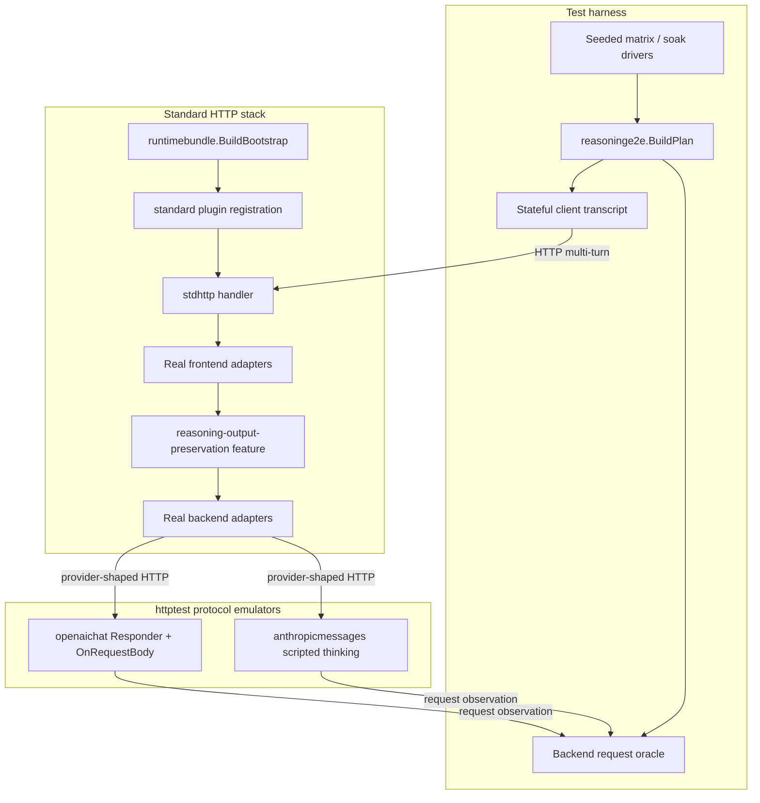

# Design Document

**Source context:** Follow-up full HTTP E2E validation for completed [`.kiro/specs/archive/reasoning-output-preservation/`](../reasoning-output-preservation/) (issue [#157](https://github.com/matdev83/go-llm-interactive-proxy/issues/157)).

## Overview

The `reasoning-preservation-e2e-validation` feature proves reasoning-output-preservation on the **standard HTTP distribution**: `runtimebundle.BuildBootstrap`, standard plugin registration, `stdhttp`, real frontend/backend adapters, and protocol backend emulators over `httptest`. It does not redefine preservation semantics. It adds a reusable plan/oracle/client harness, deterministic controls, a seeded matrix, and an env-gated soak, then applies TDD-narrow fixes only when those proofs expose concrete defects.

Parent Phase 5/`TestPhase5_*` composed runtime tests remain valuable unit-of-orchestration evidence. This design closes the distribution-boundary gap those tests intentionally leave open. OpenAI Responses full HTTP E2E is deferred until a stable Responses replay harness exists.

### Goals

- Drive multi-turn HTTP traffic through the real standard stack and protocol emulators.
- Separate client observed vs submitted transcripts from an independent backend-request oracle.
- Cover named deterministic controls including disabled/observe/restore, tools, conflict, ambiguity, and session isolation.
- Deep-cover OpenAI Chat; cross-check Anthropic signed/redacted thinking.
- Run a precomputed 64×20 seeded matrix under the `precommit` large-matrix policy.
- Provide a non-PR-mandatory 1000×100 soak with replayable seeds.
- Keep failure traces content-safe.
- Preserve and extend existing branch WIP under `internal/testkit/reasoninge2e` and `internal/refbackend/openaichat`.

### Non-Goals

- Changing exact-match, restore, privacy, or capability semantics from the parent spec.
- OpenAI Responses full HTTP E2E in this specification.
- Live provider calls, fuzzy matching, or reasoning synthesis.
- Durable/cross-replica artifact stores.
- Broad production refactors unrelated to a failing E2E case.

## Boundary Commitments

### This Spec Owns

- Full HTTP E2E harness composition for reasoning preservation.
- Plan/oracle/client transcript contracts and matrix/soak drivers.
- Protocol emulator scripting needed for Chat (and Anthropic cross-check) request capture/response scripting.
- Suite topology: default deterministic, `precommit` matrix, env-gated soak Make target + workflow.
- Docs/checklist/EchoesVault updates describing the validation story.
- Narrow production fixes proven by E2E red evidence (likely OpenAI Chat reasoning+tool replay).

### Out of Boundary

- Parent feature redesign, catalog policy changes, or new canonical concepts.
- OpenAI Responses HTTP E2E harness stabilization (deferred follow-up).
- Gemini/other families without an approved legal replay contract in this pass.
- Making soak or the randomized matrix mandatory on every PR default unit run.

### Allowed Dependencies

- Completed parent spec behavior and shipped examples.
- `runtimebundle.BuildBootstrap`, standard plugin registration, `stdhttp`.
- Existing `internal/refbackend/*` emulators and `internal/testkit/*`.
- Real OpenAI legacy Chat and Anthropic frontend/backend adapters.
- Repository testing policy in `.kiro/steering/testing.md`.

### Revalidation Triggers

Parent preservation contracts; Chat/Anthropic reasoning wire shapes; `stdhttp`/bootstrap composition; secure-session authoritative partitions; suite tags/Make/CI wiring; release-checklist evidence commands.

## Architecture

### Existing Architecture Analysis

| Layer | Current state | Gap this spec closes |
| --- | --- | --- |
| Feature plugin + runtime | Parent implemented; `TestPhase5_*` proves orchestration | Not full HTTP distribution |
| Examples | Config-validation dogfood | Not behavioral E2E |
| `internal/testkit/reasoninge2e` (branch WIP) | Plan/oracle types and tests | Not yet wired to HTTP driver |
| `internal/refbackend/openaichat` (branch WIP) | `Responder` scripting + body capture hooks | Needs multi-turn scripted reasoning/tool bodies |
| Anthropic refbackend | Exists for Messages | Needs deterministic thinking/redacted scripting for cross-check |
| Suite topology | Default / `precommit` / env-gated integration patterns | Matrix → `precommit`; soak → env + workflow |

**Suite-policy decision (validated against `.kiro/steering/testing.md`):**

| Suite | Placement | Rationale |
| --- | --- | --- |
| Deterministic controls | Default `go test ./...` / `make test-unit` | Fast, deterministic `httptest` composed tests belong in the ordinary suite |
| Seeded 64×20 matrix | `//go:build precommit` | Omitted from default `go test ./...` and lightweight `make test-precommit-extra`; run via `make qa` / CI tagged `./...` and the targeted matrix command |
| 1000×100 soak | Env-gated Make target + `workflow_dispatch`/nightly workflow | Explicitly not PR-mandatory; bounded workers/timeout/replay |

### Architecture Pattern & Boundary Map



**Project boundary answers:**

- **Core-owned or plugin-owned?** Harness is test-owned. Production fixes stay in adapters (or, only if proven, the parent feature) without moving protocol wire types into core.
- **New canonical concept?** No.
- **Streaming-first preserved?** Yes; non-stream cases collect through the same adapters; plans carry per-turn streaming flags.
- **Provider SDK leakage avoided?** Emulators and adapters own wire JSON/SSE; oracle compares structural fields already normalized by the harness.
- **No retry after first output?** Harness does not induce post-output failover; scenarios assert parent invariant remains intact.
- **Extension seam?** Uses shipped feature registration; no new core ports.

### Technology Stack

| Layer | Choice | Role |
| --- | --- | --- |
| Composition | `runtimebundle.BuildBootstrap` | Real standard distribution startup |
| HTTP edge | `stdhttp` | Real handler surface |
| Transport | `httptest.Server` | Proxy + emulators, no live network |
| Plan/oracle | `internal/testkit/reasoninge2e` | Deterministic expectations |
| Chat emulator | `internal/refbackend/openaichat` | Scripted JSON/SSE + request capture |
| Anthropic emulator | `internal/refbackend/anthropicmessages` | Signed/redacted thinking cross-check |
| Matrix gate | `//go:build precommit` | Large-matrix policy |
| Soak gate | Env var + Make + workflow | Opt-in depth |

## File Structure Plan

### Directory Structure

```
internal/testkit/reasoninge2e/          # Preserve WIP; extend
├── doc.go / types.go / plan.go / oracle.go
├── matrix.go                           # 64×20 precompute + category forcing
├── soak.go                             # 1000×100 helpers, replay-one-seed
├── failtrace.go                        # content-safe structural traces
└── *_test.go

internal/refbackend/openaichat/         # Preserve WIP Responder; extend scripting
├── responder.go / server.go
└── scripted_reasoning.go               # multi-turn reasoning/tool response builders

internal/refbackend/anthropicmessages/  # Extend for thinking/redacted scripts
└── scripted_thinking.go

internal/stdhttp/
├── reasoning_preservation_http_e2e_test.go          # default deterministic controls
├── reasoning_preservation_http_matrix_test.go       # //go:build precommit
└── reasoning_preservation_http_soak_test.go         # env-gated; optional //go:build soak

.github/workflows/
└── reasoning-e2e-soak-nightly.yml                   # workflow_dispatch + nightly

Makefile                                            # soak target; matrix via precommit tag + make qa / targeted command
docs/ + EchoesVault/pages/                          # checklist + compiled knowledge updates
```

### Modified Files (expected)

- Branch WIP preserved: `internal/testkit/reasoninge2e/*`, `internal/refbackend/openaichat/{server.go,responder.go,responder_test.go}`.
- Production only if red E2E proves a defect (likely OpenAI Chat frontend/backend reasoning+tool replay paths under `internal/plugins/frontends/openailegacy` / `internal/plugins/backends/openailegacy` or shared protocol helpers).
- Docs: `docs/reasoning-output-preservation.md`, `docs/reasoning-output-preservation-release-checklist.md`, `EchoesVault/pages/reasoning-output-preservation.md`, index entry if needed.

## System Flows

### Multi-turn restore (Happy path)

```mermaid
sequenceDiagram
    participant C as Stateful client
    participant P as stdhttp proxy
    participant F as Feature restore
    participant E as Protocol emulator
    participant O as Backend oracle

    C->>P: Turn N request (may drop prior reasoning)
    P->>F: Classify/restore on candidate clone
    F->>E: Backend HTTP with expected reasoning
    E->>O: OnRequestBody observation
    O->>O: Check(plan, observation)
    E-->>P: Scripted assistant output (+ reasoning/tools)
    P-->>C: Frontend response
    C->>C: Record observed turn; build next submitted transcript
```

### Failure / privacy model

| Concern | Rule |
| --- | --- |
| Oracle mismatch | Fail with `seed`, `policy/mode`, `turn id`, structural field name/counts only |
| Forbidden in failures | Reasoning text, signatures, opaque bytes, anchors, raw bodies |
| Conflict/ambiguity | Backend observation must show **no** overwrite/insert relative to submitted client reasoning |
| Session isolation | Two authoritative sessions never satisfy each other’s stored artifacts |
| Emulator concurrency | Responders remain concurrency-safe; harness uses fresh bounded sessions per case/worker |
| Soak control | Bounded workers, hard timeout, `--seed`/env replay for single-seed reproduction |

## Requirements Traceability

| Requirement | Summary | Components | Flows |
| --- | --- | --- | --- |
| 1.1–1.5 | Standard stack composition | Bootstrap harness, stdhttp E2E | Multi-turn restore |
| 2.1–2.6 | Client transcript + oracle | `reasoninge2e`, emulator capture | Multi-turn restore |
| 3.1–3.10 | Deterministic controls | stdhttp default E2E | Controls table |
| 4.1–4.5 | Chat deep + Anthropic cross-check; Responses deferred | Chat/Anthropic emulators + adapters | Protocol drivers |
| 5.1–5.9 | 64×20 precommit matrix | matrix driver | Seeded matrix |
| 6.1–6.6 | Env-gated soak | soak driver, Make, workflow | Soak |
| 7.1–7.5 | TDD narrow fixes | red E2E → adapter patch | Defect repair |
| 8.1–8.4 | Privacy/isolation | failtrace, isolation cases | Failure model |
| 9.1–9.6 | Docs/review/gates | docs, EchoesVault, CI evidence | Release |

## Components and Interfaces

| Component | Layer | Intent | Req Coverage |
| --- | --- | --- | --- |
| `reasoninge2e` plan/oracle | testkit | Precompute + structural Check | 2, 5, 6, 8 |
| Stateful client driver | stdhttp tests | Observed vs submitted HTTP transcript | 2, 3, 4 |
| Bootstrap fixture | stdhttp tests | BuildBootstrap + standard plugins + config | 1 |
| Chat `Responder` scripts | refbackend | Deterministic JSON/SSE + body capture | 2, 4, 7 |
| Anthropic thinking scripts | refbackend | Signed/redacted cross-check | 4 |
| Matrix driver | testkit + stdhttp `precommit` | 64×20 forced categories | 5 |
| Soak driver | testkit + env/Make/workflow | 1000×100 bounded | 6 |
| Docs/checklist/EchoesVault | docs | Discoverability + evidence | 9 |

### reasoninge2e contracts (preserve/extend)

```go
// Existing shapes remain authoritative; extend only as needed for matrix/soak metadata.
type PlanConfig struct {
    Seed   uint64
    Policy RetentionPolicy
    Turns  []TurnSpec
}

func BuildPlan(cfg PlanConfig) (Plan, error)
func Check(plan Plan, obs BackendRequestObservation) error
```

**Invariants:** defensive copies; no global RNG; content-safe errors; `Streaming` is plan metadata (wire stream shape asserted by the HTTP driver, not by `Check`).

### HTTP E2E driver responsibilities

- Build temp config enabling observe/restore against emulator base URLs.
- Call `runtimebundle.BuildBootstrap` in serve-compatible test mode and mount `stdhttp`.
- Run N turns: submit client transcript → decode frontend response into observed turn → update transcript per retention policy → on each backend request, feed oracle.
- Assert session isolation with two bootstrap scopes / authoritative partitions as provided by the runtime.

## Error Handling

| Class | Harness response |
| --- | --- |
| Oracle structural mismatch | `t.Fatalf` with content-safe trace |
| Bootstrap/config failure | Fail test setup; do not skip silently |
| Emulator panic/timeout | Fail case; soak worker isolates session |
| Soak env unset | Skip via explicit gate (not a failure) |
| Deferred Responses | No test registration claiming coverage |

## Testing Strategy

### Unit (harness-local)

- Plan materialization for preserve/drop/seeded/conflict policies.
- Oracle mismatch classes (count, order, tool fields, unexpected insertion).
- Content-safe failtrace formatting (must not contain payload fixtures).
- Matrix category forcing and seed split 16/16/32.

### Composed HTTP E2E (default)

- Deterministic controls in Requirement 3 over OpenAI Chat.
- Anthropic signed/redacted thinking cross-check cases.
- Dedicated red case for Chat reasoning+tool-call replay before production fix.

### Precommit matrix

- 64×20 seeded matrix under `//go:build precommit`.
- Failure includes seed/mode/turn/structural fields only.

### Soak (opt-in)

- 1000×100 via Make + workflow; bounded workers; single-seed replay.
- Not required for PR green.

### Gates before done

- Focused E2E tests green.
- `make quality-checks`, `make parity-checks`, `make qa`.
- Race on Linux CI / `make test-race` where not a Windows no-op.
- Independent review recorded against requirements/design.
- Docs/EchoesVault/checklist updated.

## Security Considerations

- Emulator credentials are test secrets only; never log bearer values (`OnAuthorizedCredential` remains non-logging).
- Failure and diagnostics paths must not print reasoning payloads.
- Authoritative session isolation is a first-class E2E assertion, not a documentation claim alone.

## Performance & Scalability

- Default suite stays fast: small deterministic case set.
- Matrix cost accepted under `precommit` (already used for large matrices).
- Soak bounded by workers + hard timeout; default PR path unchanged.

## Supporting References

- Parent: [`.kiro/specs/archive/reasoning-output-preservation/`](../reasoning-output-preservation/)
- Issue: [#157](https://github.com/matdev83/go-llm-interactive-proxy/issues/157)
- Steering: `.kiro/steering/testing.md`, `api-standards.md`, `routing-and-orchestration.md`, `tech.md`
- Checklist: `docs/reasoning-output-preservation-release-checklist.md`
- Branch WIP to preserve: `internal/testkit/reasoninge2e/`, `internal/refbackend/openaichat/{responder.go,responder_test.go,server.go}`
