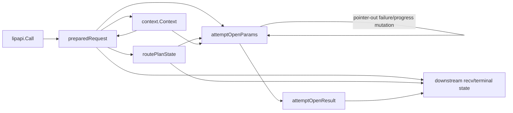
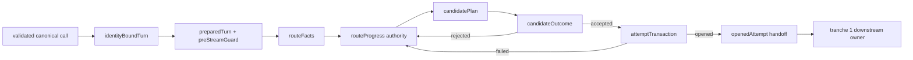
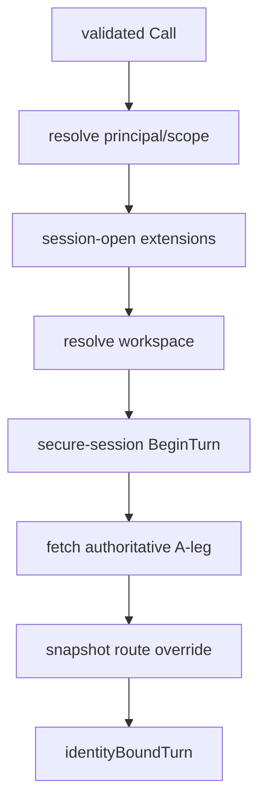
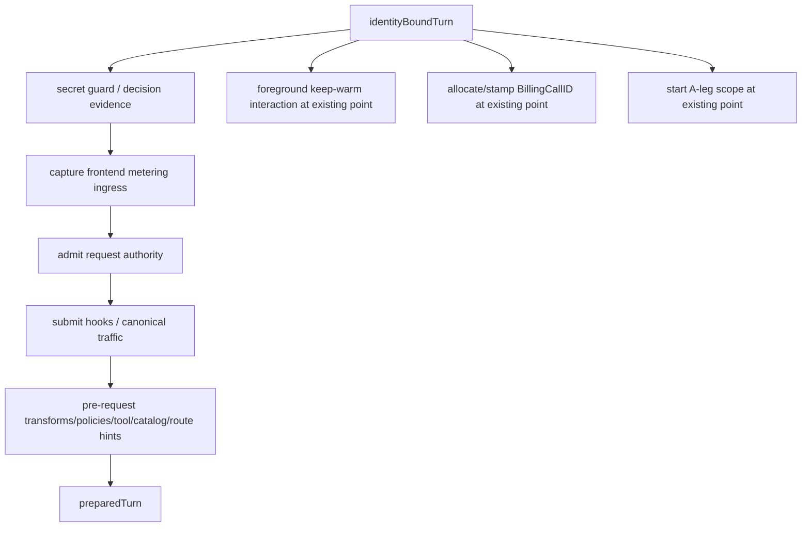
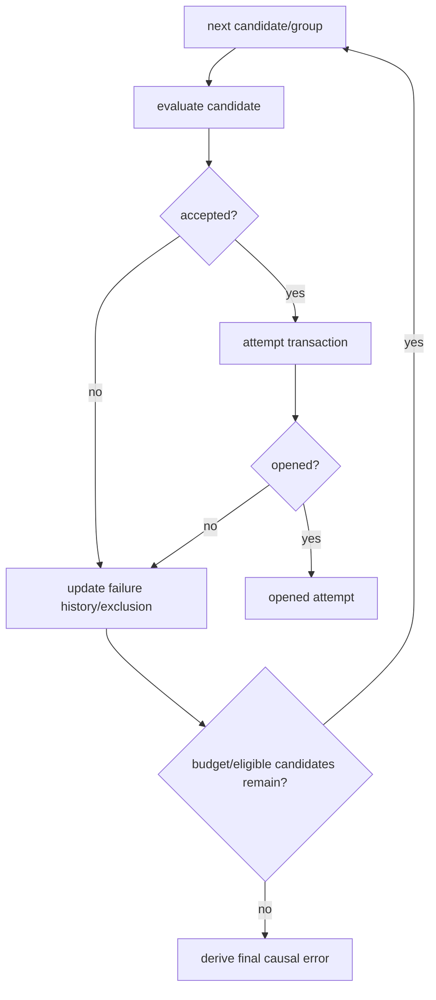
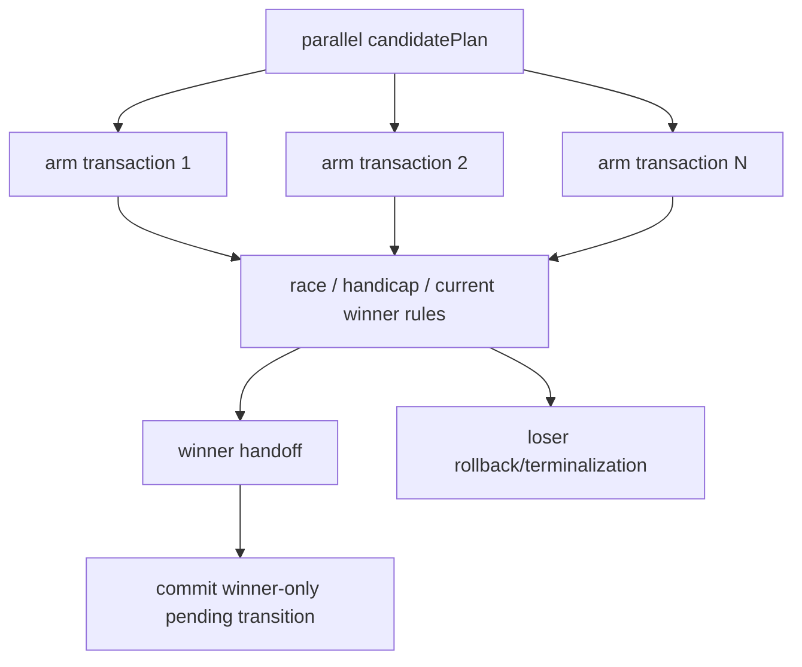

# Design Document

## Overview

This design simplifies the request-to-attempt half of Go-LIP's runtime after `turn-recv-terminal-ownership-simplification` establishes a lifetime-correct downstream receive/terminal seam.

The target preserves the existing readable `Executor.Execute` orchestration while changing the state topology beneath it:

- authoritative identity/session/workspace facts are frozen explicitly;
- pre-stream request resources have one ownership/cleanup guard;
- immutable route facts are separated from mutable route progress;
- candidate planning/evaluation returns typed outcomes rather than mutating caller pointers;
- B-leg/usage-authority/backend-open side effects belong to one attempt transaction until handoff;
- initial open and recv replacement use the same typed attempt pipeline;
- context remains a compatibility projection rather than a second business-state database.

The design deletes `attemptOpenParams` and the field-by-field reconstruction paths that made the same logical turn appear in multiple partial bags.

## Design Principles

### P1. Explicit freeze points, not arbitrary small functions

Security/accounting order matters. A helper extraction is useful only when it produces a clearly authoritative result or owns a clearly bounded side effect.

### P2. Values for outcomes, owners for side effects

Candidate/rejection/progress results should be values. B-leg, authority reservation and backend stream are side effects/resources and remain under one transaction owner until transferred.

### P3. Context is projection

Use context for cancellation, tracing and existing extension APIs. Core business state is held by typed phase values/owners.

### P4. One initial/retry pipeline

Initial execution and recv replacement share route progress and candidate/open logic. Retry mode is data, not a duplicate implementation.

### P5. No false purity

Candidate transforms/evidence/safety operations may be observable. The design separates their phase responsibility from resource ownership rather than pretending they are pure.

### P6. Delete old translations as authority moves

`attemptOpenParams` and obsolete bag fields are removed, not retained as compatibility DTOs.

## Current State Topology



The same facts are repeatedly projected and some structures become valid only after later phases mutate selected fields.

## Target State Topology



The conceptual boxes are not a mandate to create a large struct for every arrow. Adjacent values may share focused nested immutable values when that removes copying. The normative boundary is authority and lifecycle.

## D1 — Chronological Dependency on Tranche 1

Implementation begins after `turn-recv-terminal-ownership-simplification` has a green downstream ownership seam.

This spec relies only on semantic guarantees:

- a downstream logical request owner exists;
- one current opened attempt can be transferred to it;
- downstream owns attempt resources after transfer;
- route/recovery progress can be shared with recv replacement without a second copy;
- immutable request facts can be handed over once.

No exact private type name from tranche 1 is normative. If implementation names differ, adapt at one narrow handoff constructor.

## D2 — `identityBoundTurn`: Authoritative Identity Freeze Point

Introduce a private immutable result after secure/session/workspace establishment.

Illustrative shape:

```go
type identityBoundTurn struct {
    traceID string
    call    lipapi.Call

    principal execview.PrincipalView
    scope     scope.PrincipalScopeView
    workspace lipworkspace.WorkspaceView
    session   session.SessionView
    secure    execctx.SecureSessionTurn

    aLeg      b2bua.ALegRecord
    routeAuth routeAuthoritySnapshot

    evidence identityEvidenceFacts
}
```

The exact nested types can differ. Rules:

- `call` is a cloned canonical working request with proxy-authoritative session/A-leg fields;
- client resume tokens/forged identifiers retain current sanitization behavior;
- workspace/principal/scope are frozen for later core decisions;
- route override is snapshotted once at the current brownfield boundary;
- the existing route-authority snapshot barrier remains;
- no request-authority/billing-exposure/route-candidate fact is claimed before it exists.

### Identity sequence



Exact existing failure policy/logging/evidence is preserved.

## D3 — Context Projection From Authoritative Identity Facts

Create/update execution contexts through focused projector functions that accept current typed facts.

```go
func projectIdentityContext(ctx context.Context, t identityBoundTurn) context.Context
```

Context continues to carry:

- cancellation/deadlines;
- diagnostics/tracing;
- principal/scope/session/workspace views;
- extension decision evidence;
- model/native routing views as established later;
- existing SDK compatibility values.

Normative rule: later core code does not call `FromContext` merely to recover a fact already authoritative in the phase product. Context recovery remains valid at external/SDK boundaries and where the API contract is context-shaped.

## D4 — Request Preparation and `preStreamGuard`

The identity-bound turn flows through request-wide policy/admission/preparation. Side-effect ownership that must be undone before a stream is returned is represented explicitly.

Illustrative:

```go
type preStreamGuard struct {
    // references to existing domain owners, not duplicated domain state
    requestAuth *requestAuthorityState
    aLegScope   *leglifecycle.ALeg
    committed   atomic.Bool // or mutex/once local to this guard
}

func (g *preStreamGuard) Handoff() preparedOwnership
func (g *preStreamGuard) Close(ctx context.Context) error
```

The guard is not a generic resource ledger. It coordinates exactly the current pre-stream cleanup obligations:

- release request authority if admitted and not handed off;
- cancel/end A-leg scope if it has started and not handed off;
- leave existing domain owners responsible for their own semantics.

### Preparation order



The diagram shows conceptual ownership; implementation must preserve the exact current relative ordering pinned by Phase 1 tests. Do not reorder `KW`, `BC`, or `AS` merely to make the diagram linear.

## D5 — `preparedTurn`: Frozen Request Facts Plus Stable Owner References

After request-wide preparation reaches the current route-ready point, create one private prepared value.

Illustrative:

```go
type preparedTurn struct {
    identity identityBoundTurn
    baseline lipapi.Call

    views      execctx.Views
    routePrefs []string
    metering   *checkpoint.RequestHolder

    billingCallID    billing.BillingCallID
    billingCallState *billingCallState

    ownership preparedOwnership
}
```

Later billing exposure may stamp additional immutable billing identity/version facts through the request-level owner at its actual boundary. Do not pre-populate placeholders to simulate completeness.

`preparedTurn` properties:

- frozen baseline is the source cloned for every candidate attempt;
- route preferences and views are final request-wide values;
- owner references are stable, but their domain-managed internal state may be mutable;
- no candidate/retry/failure state;
- no `streamReturned` temporal boolean;
- no arbitrary nil fields that become valid depending on undocumented stage history.

## D6 — Route Facts and Route Progress

Replace broad `routePlanState` semantics with two concepts.

### Immutable `routeFacts`

```go
type routeFacts struct {
    selector    *routing.Selector
    requestSize routing.RequestSizeEstimate
    failoverReq capabilities.FailoverRequirementSet
    affinityKey affinity.Key
    affinitySet bool
    rng routing.Rng
    limits routeLimits
}
```

### Mutable `routeProgress`

```go
type routeProgress struct {
    excluded map[string]struct{}
    session  routing.SessionRoutingState
    budget   attemptBudget
    ttft     ttftBudget
    failures candidateFailureHistory
    interleaved interleavedRouteProgress
}
```

The route-progress authority should be the same state object/recovery owner used by recv replacement after tranche 1. If tranche 1 exposes a recovery controller rather than this literal shape, initial route compilation initializes that owner directly.

### Route compilation

`buildRoutePlan` may be replaced with something like:

```go
func compileRouteExecution(ctx context.Context, p preparedTurn) (routeFacts, routeProgress, error)
```

or a single private `routeExecution` containing immutable facts plus a pointer to progress. The design does not require a particular wrapper count.

## D7 — Typed Failure History

Replace pointer-out rejection state with one explicit route-progress value.

```go
type candidateFailureHistory struct {
    CapabilityReject lipapi.NegotiationResult
    TransportReject  lipapi.TransportNegotiationResult
    AdmissionErr     error
    ContextLimit     bool
    TransformExcludes transformExcludeTracker
    ParallelFailure  error
}
```

Operations return a new/updated history or mutate the single route-progress owner directly under the single Recv/initial-open owner as appropriate. They do not receive pointers to individual caller locals.

One function owns final causal-error selection:

```go
func (h candidateFailureHistory) FinalError(base error) error
```

Its precedence is frozen by tests against current behavior.

## D8 — Candidate Plan

Candidate planning consumes route facts/progress and returns a typed plan.

```go
type candidatePlan struct {
    Candidates []routing.AttemptCandidate // one or bounded parallel group
    PendingRouteTransition pendingRouteTransition
}
```

A plan contains no backend stream, B-leg or authority reservation.

Current routing functions remain authoritative for grammar and candidate expansion. Sticky-affinity fallback may still require a re-plan after clearing an invalid binding; that behavior is encoded in planning logic, not a second AST interpreter introduced here.

Planning outcome should distinguish:

- plan available;
- no eligible candidate with typed final causal error;
- transient/no-open semantics required by existing retry behavior.

## D9 — Candidate Evaluation Outcome

Evaluate one planned candidate into either an accepted candidate ready for attempt transaction or a typed rejection.

Illustrative:

```go
type evaluatedCandidate struct {
    candidate routing.AttemptCandidate
    backend   execbackend.Backend
    call      lipapi.Call

    transport lipapi.TransportMode
    facts     modelcatalog.EffectiveFacts
    admission candidateAdmissionOutcome

    pending pendingCandidateCommit
}

type candidateOutcome struct {
    Accepted *evaluatedCandidate
    Rejected *candidateRejection
}
```

### Evaluation responsibilities

- clone `preparedTurn.baseline`;
- apply max pending events/current attempt-local request settings;
- interleaved shape call;
- run candidate attempt transforms;
- pin route identity;
- resolve backend;
- evaluate capabilities/transport/model/context eligibility under existing safety boundary;
- emit current diagnostics/evidence;
- return rejection with updated failure facts when excluded/rejected.

### Non-purity rule

Extension transforms and evidence are allowed to be observable. Evaluation nevertheless **does not own B-leg/authority/backend-stream resources**. That boundary starts at D10.

## D10 — `attemptTransaction`: One Pre-Handoff Resource Owner

When an evaluated candidate is accepted, start an explicit transaction for resource-owning attempt effects.

Illustrative:

```go
type attemptTransaction struct {
    prepared preparedTurnRef
    evaluated evaluatedCandidate

    authority authorityLifecycle
    bleg      b2bua.BLegRecord
    stream    lipapi.ManagedEventStream

    state transactionState
}

func (t *attemptTransaction) Open(ctx context.Context) (openedAttempt, error)
func (t *attemptTransaction) Rollback(ctx context.Context, cause error) error
func (t *attemptTransaction) Handoff() openedAttempt
```

Do not duplicate existing authority/B2BUA terminal state inside the transaction; retain references to the existing owners and coordinate them.

### Transaction responsibilities

- obtain/admit attempt authority at the current semantic point;
- allocate/register B-leg;
- invoke backend open/execute;
- run attempt-open evidence/observer operations that require those resources;
- consume/record any immediate sideband evidence currently required;
- on failure, close/terminalize/release owned resources exactly once;
- on success, transfer a complete opened attempt to downstream ownership and become inert.

## D11 — Complete Opened-Attempt Handoff

Success returns one coherent ownership package, semantically equivalent to the information currently split across `attemptOpenResult` plus downstream reconstruction.

Illustrative:

```go
type openedAttempt struct {
    Stream    lipapi.ManagedEventStream
    BLeg      b2bua.BLegRecord
    Candidate routing.AttemptCandidate
    Authority attemptAuthorityState
    Pending   pendingCandidateCommit
}
```

The actual tranche 1 downstream constructor may expect a private attempt-owner value instead. The handoff adapter should transfer ownership in one operation.

After handoff:

- upstream attempt transaction does not close/release the stream/B-leg/authority;
- pre-stream request guard transfers request-lifetime cleanup responsibility to downstream request ownership;
- pending route/interleaved transition commits at the correct winner boundary;
- no field-by-field reconstruction into `retryRecvStream` remains.

`attemptOpenResult` should disappear or become this complete handoff rather than remain a partial bag.

## D12 — One Initial/Retry Attempt Pipeline

Introduce one private coordinator for “open next attempt” without making it a generic stage framework.

Illustrative:

```go
type openMode struct {
    Retry bool
    SuppressThinker bool
    SuppressVisibleMemo bool
}

type openNextRequest struct {
    Prepared preparedTurnRef
    Route    *routeExecution
    Mode     openMode
}

type openNextResult struct {
    Opened *openedAttempt
    Continue bool
    Err error
}
```

The precise structs should be kept focused. The essential invariant is that initial `Executor.Execute` and downstream recv replacement invoke the same implementation over the same `routeProgress` authority.

No manual reconstruction of dozens of values is permitted in the recv path.

## D13 — Error and Rejection Flow



One failure-history authority owns public causal error precedence. Individual evaluation/transaction stages return typed causes; they do not directly choose arbitrary final errors in inconsistent branches.

Current special cases—transport rejection, admission error, capability rejection, context-limit exhaustion, transform-exclusion aggregate, parallel failure—remain represented.

## D14 — Parallel Group Transactions

A parallel plan owns group coordination; each arm owns its own `attemptTransaction`.



Rules:

- each arm has independent B-leg/authority/stream ownership;
- group code never manually cleans individual fields; it asks losing transactions to rollback/terminalize;
- winner ownership transfers exactly once;
- loser errors feed aggregate parallel failure as today;
- handicap/cancellation semantics remain unchanged;
- pending interleaved memo/route transition is committed only for the winner.

## D15 — Interleaved Pending/Commit Boundary

Represent route/interleaved effects that must wait for authoritative success as a small pending commit value.

```go
type pendingCandidateCommit struct {
    Cycle *interleavedstate.CycleState
    Memo  *interleavedthinking.PendingMemoUpdate
}
```

The type is illustrative. Commit operation occurs only after:

- a non-parallel evaluated/opened candidate becomes authoritative; or
- a parallel winner has been selected.

Losers/failures discard pending effects without consuming logical memo budget/continuity.

No redesign of the interleaved state store or wrapper semantics is allowed.

## D16 — Architecture Ratchets

Add structural checks proving the new architecture did not merely rename state bags.

### `attemptOpenParams` deletion

AST/text gate confirms the type and production references are gone.

### No pointer-out inputs

Inspect attempt-pipeline request/input types and reject pointer fields used solely for callee-to-caller failure/progress mutation. Legitimate references to owner objects/services are allowed and documented.

### State-flow/projection inventory

Measure before/after:

- overlapping pipeline state carriers;
- direct field-copy assignments between carriers;
- business facts re-read from context inside core pipeline decisions;
- initial/retry translation layers;
- pointer-out mutations;
- pre-handoff resource cleanup sites.

### Authority inventory

Assert one authority for:

- identity-bound session/workspace/A-leg facts;
- prepared request ownership guard;
- route progress/failure history;
- pre-handoff attempt resources;
- downstream opened-attempt ownership after transfer.

### Framework/scope gate

Reject universal mutable turn bags, generic `Stage`/pipeline registries introduced for this refactor, service locators, DI containers, reflection dispatch and selector grammar changes in the affected diff.

### Deletion gate

The affected production parameter-translation/state-handoff surface must be net negative. Any growth requires explicit final design-review evidence of a stronger invariant and remains a default NO-GO.

## D17 — Migration Plan

### Phase A — Characterization and state-flow baseline

Freeze sequence, context projections, error precedence, initial/retry parity, parallel/interleaved side effects and current cleanup.

### Phase B — Identity/prepared request freeze points

Introduce `identityBoundTurn`, context projection and pre-stream guard; migrate preparation while leaving current routing/open internals behind adapters; delete obsolete mutable prepared fields.

### Phase C — Route facts/progress and failure history

Split immutable route facts from the single recovery/route-progress owner established with tranche 1. Replace pointer-out failure fields with typed history.

### Phase D — Candidate outcomes

Introduce candidate plan/evaluation/rejection values, preserve current transforms/admission order, and delete corresponding `attemptOpenParams` fields/translation.

### Phase E — Attempt transaction and parallel/interleaved commit

Move authority/B-leg/backend-open ownership into per-attempt transaction, add complete handoff and parallel loser cleanup/winner commit.

### Phase F — Initial/retry convergence and deletion

Route both callers through one pipeline, delete `attemptOpenParams`, obsolete `routePlanState`/`attemptOpenResult` parts and compatibility translations, then tighten architecture gates.

## D18 — Explicitly Deferred Architecture Work

This design intentionally does not solve every remaining hotspot.

Deferred separate candidates:

1. selector AST normalization and sticky/normal traversal convergence;
2. generation feature-surface/options/snapshot projection simplification;
3. OpenResponses state-machine decomposition if a deletion-producing boundary is proven;
4. any future billing/security domain redesign.

These must not be mixed into implementation unless a new spec explicitly expands scope.

## Testing Strategy

### Preparation characterization

Pin exact order and failure cleanup around:

- principal/scope/workspace;
- secure BeginTurn/A-leg;
- route authority snapshot/barrier;
- secret guard;
- metering ingress;
- request authority;
- submit/request transforms;
- BillingCallID/keep-warm/A-leg scope.

### Route/error characterization

Pin selector compile, affinity, request-size/failover facts, `[first]`, budgets, TTFT, error precedence and interleaved progress.

### Candidate characterization

Pin transform exclusions, capability/transport negotiation, context/output constraints, safety panic mapping and evidence.

### Attempt transaction tests

Pin authority/B-leg/backend resource acquire/failure/rollback/handoff exactly once.

### Parallel/interleaved tests

Use scheduling-controlled fakes for winner/loser cleanup, handicap/cancel, aggregate errors and pending memo/cycle commit.

### Integration with tranche 1

Prove initial and recv replacement both use the same route-progress/attempt pipeline and downstream handoff; no state bag reconstruction remains.

### Repository gates

Run affected runtime/routing/billing/accounting/security/interleaved/backend/frontend/protocol suites, architecture gates, quality/parity checks and race coverage on supported platforms.

## Design Rules Summary

- **D1:** implement after tranche 1 and depend only on its semantic handoff contract.
- **D2:** identity/session/workspace/A-leg facts freeze explicitly.
- **D3:** context projects typed facts; it is not a second business authority.
- **D4:** pre-stream resources have one explicit cleanup/transfer guard.
- **D5:** prepared request is frozen and not temporally half-valid.
- **D6:** immutable route facts and mutable route progress are separate and converge with tranche 1 recovery state.
- **D7:** failure history is typed; pointer-out channels disappear.
- **D8:** candidate planning returns typed candidate/group plans.
- **D9:** candidate evaluation returns accepted/rejected typed outcomes and is not falsely declared pure.
- **D10:** authority/B-leg/backend-open side effects live in one attempt transaction.
- **D11:** successful opened-attempt handoff is complete and exactly once.
- **D12:** initial and retry paths use the same typed pipeline.
- **D13:** one failure-history authority preserves final causal error precedence.
- **D14:** parallel arms use independent attempt transactions and exact loser cleanup.
- **D15:** pending interleaved/route effects commit only for the authoritative winner.
- **D16:** architecture ratchets prove bag/pointer/projection/translation deletion.
- **D17:** migration proceeds by authority and deletes old representations immediately.
- **D18:** selector normalization and other unrelated architecture work remain separate.

## Expected Simplification

A developer changing candidate admission should no longer need to trace a field from `routePlanState` into `attemptOpenParams`, through pointer-out state, back into the retry stream, and then reconstruct it on replacement. A developer changing request security ordering should see explicit identity/preparation boundaries. A developer changing B-leg/backend-open lifecycle should see one transaction/rollback owner. A developer changing retry error precedence should see one failure history.

That reduction in state topology and change propagation—not an arbitrary file count—is the success condition.
