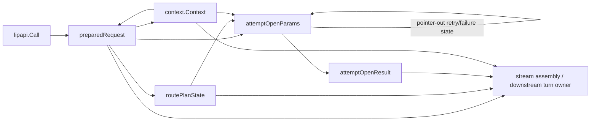
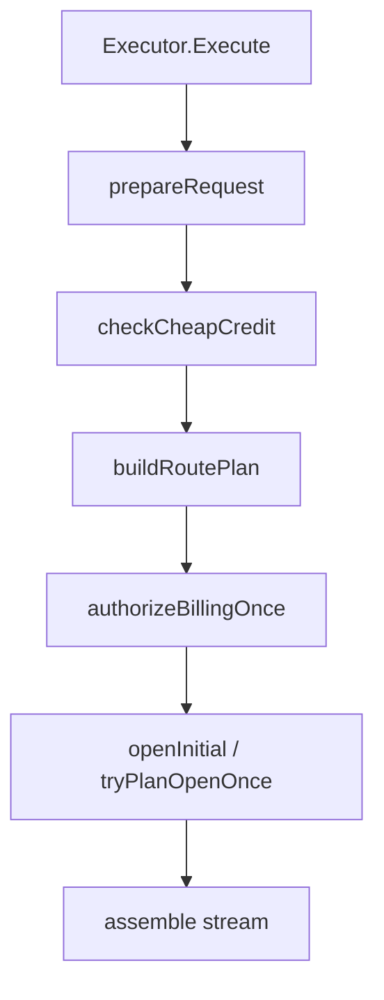
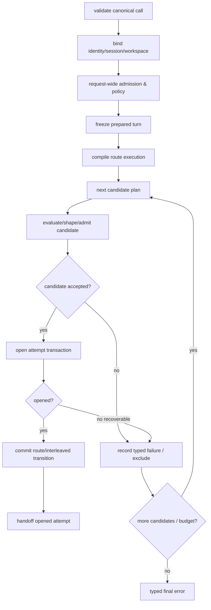

# Research and Architecture Assessment

## Executive Conclusion

After the receive/terminal ownership hotspot, the next highest-ROI runtime simplification is the **upstream request-to-attempt state pipeline**. The current top-level `Executor.Execute` is already a good orchestration shell, but the state flowing through that shell is represented repeatedly and incompletely across `context.Context`, mutable `lipapi.Call`, `preparedRequest`, `routePlanState`, `attemptOpenParams`, `attemptOpenResult`, and the downstream stream assembly boundary.

The problem is not that the request has many facts. Go-LIP legitimately coordinates secure-session identity, workspace/principal scope, extension stages, metering, request authority, billing exposure, routing, affinity, capability/transport negotiation, interleaved thinking, parallel arms, B2BUA and backend lifecycle. The problem is that these facts do not have sufficiently explicit **phase boundaries and authoritative representations**. Several structures are broad state bags, `attemptOpenParams` uses pointer-out mutation for accumulated failures, and some business facts are mirrored between structs and `context.Context`.

This specification is architecture simplification tranche 2. It is intentionally sequenced after `turn-recv-terminal-ownership-simplification`, which establishes a clean downstream owner for an opened attempt and the logical receive/terminal lifecycle. This tranche then simplifies how Go-LIP reaches that seam.

Baseline reviewed: `main` at `c3b5c872e6e48b6b9c86ea3570530b4fb094767c`.

## Current Data Flow

The current upstream data flow is approximately:



This creates two forms of complexity:

1. **representation complexity** — the same logical turn is projected into several overlapping containers;
2. **temporal complexity** — correctness depends on which stage has already mutated the call/context/state bag when a later stage reads it.

The current receive/terminal spec addresses the final `STREAM` state fan-in. This specification addresses the upstream fan-out/fan-in itself.

## Current Control Flow

The current high-level control path is sensible:



The target should **preserve this readability**. The refactor is not justification for a generic stage engine or callback pipeline.

The complexity lies inside and between these phases.

## `preparedRequest`: Useful Phase Product, but Too Broad and Partly Mirrored

`preparedRequest` currently carries, among other things:

- hook bus;
- trace ID;
- canonical baseline call;
- A-leg record and lifecycle scope;
- recv execution views;
- secure-session turn state;
- route preferences;
- stream-returned cleanup state;
- billing account and immutable pricing/policy references;
- BillingCallID and billing call state;
- execution span;
- metering holder;
- route-override authority snapshot.

This type is directionally correct: a named phase product is better than one giant Execute function. But several of its fields correspond to different lifecycle moments:

- session/principal/workspace identity is established before submit and policy work;
- metering ingress and request authority are admitted during preparation;
- BillingCallID is allocated once per logical incoming invocation;
- billing account/pricing/charge policy are stamped later after exposure admission;
- A-leg lifecycle scope starts after secure/A-leg preparation;
- route override is snapshotted before later route planning;
- some facts are also projected into `context.Context` and re-read later.

As a result, the type is a **partially initialized evolving state product** rather than a clearly frozen phase result.

## `prepareSubmitAndALegSecure`: Too Many Semantic Phases in One Procedure

The secure preparation path coordinates:

1. stable trace/call identity;
2. principal/scope resolution;
3. session-open extension stage;
4. workspace resolution and failure policy;
5. secure-session `BeginTurn`;
6. authoritative session/A-leg identity stamping;
7. A-leg fetch/continuity state;
8. route-override snapshot and snapshot barrier;
9. decision-evidence/view construction;
10. secret-guard stage;
11. frontend ingress metering capture;
12. request-authority admission;
13. submit hooks;
14. canonical traffic capture;
15. subsequent pre-request/tool/catalog/route-hint stages in the broader prepare flow.

Some of this ordering is a hard security or accounting invariant. The problem is therefore **not** “split this function until each helper is tiny.” The problem is that the code lacks explicit freeze points saying which facts are authoritative after identity binding, after request admission, and after request transformation/policy.

A future developer adding a pre-request capability currently needs to understand the whole timeline to know which call/context/session view is authoritative at that insertion point.

## Business State in `context.Context`

Go-LIP correctly uses context for:

- cancellation/deadlines;
- traces/diagnostics;
- principal/scope/session views consumed by extension SDKs;
- evidence emitters/timeout budgets;
- request-scoped compatibility with hooks and auxiliary paths.

However, the current pipeline sometimes treats context as a second store for business facts. Later code recovers request authority, route preferences, model/native views, secure-session turn state, and execution views from context or must preserve them separately for bare recv contexts.

The goal is not to eliminate `execctx` or context values. Those are established compatibility seams. The target is:

> typed phase products are authoritative for core business decisions; context is a projection used for cancellation, observability, and existing extension APIs.

That distinction substantially reduces the number of places a developer must inspect to determine “what is the current request state?”

## `routePlanState`: Mixed Immutable Route Facts and Mutable Attempt History

`routePlanState` currently contains:

- compiled selector;
- attempt budget;
- TTFT budget;
- mutable session routing state;
- excluded candidates;
- request-size estimate;
- affinity key/state;
- interleaved state;
- RNG;
- failover requirements;
- last capability rejection;
- last transport rejection;
- last admission error;
- context-limit exhaustion;
- last parallel failure;
- transform-exclusion tracker.

This mixes at least two concepts:

### Route execution facts

Computed once for the logical request:

- selector;
- request-size estimate;
- failover requirement set;
- affinity identity;
- RNG source;
- configured attempt/TTFT limits.

### Recovery/attempt history

Mutated as candidates fail or the request advances:

- exclusions;
- session `[first]` consumption;
- last reject/admission errors;
- context-limit/transform/parallel failure state;
- interleaved cycle state;
- remaining attempt/TTFT budgets.

The first tranche moves recv-phase recovery state behind a downstream recovery owner. This tranche should prevent the upstream initial-open pipeline from reintroducing a second, differently shaped copy of that same mutable history.

## `attemptOpenParams`: Strongest State-Bag Signal Upstream

`attemptOpenParams` is a broad input/output carrier containing:

- hook bus, trace, A-leg identity and lifecycle;
- baseline call;
- failover requirements;
- selector/request size/session/exclusions/RNG/budgets;
- retry-path flag;
- **pointers** to last capability/transport reject;
- **pointer** to last admission error;
- **pointer** to last parallel failure;
- affinity;
- **pointer** to context-limit exhaustion;
- **pointer** to transform-exclusion state;
- interleaved state and suppression flags;
- memo commit behavior;
- billing call identity/state.

This is a classic sign that the function boundary is not expressing a domain operation cleanly. The caller passes an input bag plus mutable pointers for the callee to update as side-channel outcomes.

The initial open and recv-phase replacement both reconstruct this bag from different source objects. That makes adding one new routing/admission fact likely to require changes in:

- route setup;
- initial attempt-open construction;
- replacement construction;
- stream assembly/retention;
- tests that construct params directly.

The target must remove `attemptOpenParams` rather than merely rename/group it.

## Candidate Opening Currently Mixes Four Responsibilities

`tryPlanOpenOnce` / `openPlannedCandidate` currently coordinate several distinct decisions.

### 1. Candidate planning

- expand failover groups;
- sticky affinity preference/fallback;
- parallel group selection;
- `[first]`, weighted/interleaved cycle behavior;
- no-eligible error precedence.

### 2. Candidate request shaping/evaluation

- clone baseline request;
- interleaved thinker/executor shaping;
- candidate attempt transforms;
- route identity pinning;
- backend lookup;
- candidate metadata construction.

### 3. Candidate admission

- capability and transport negotiation;
- model/catalog facts;
- context/token/output eligibility;
- policy/safety boundaries;
- admission rejection diagnostics and candidate exclusion.

### 4. Attempt lifecycle/open transaction

- usage authority/reservation;
- billing/quote identity where applicable;
- B-leg allocation/registration;
- backend `Open`/execute;
- lifecycle/observer evidence;
- cleanup/terminalization on failure;
- memo commit/winner semantics for parallel/interleaved paths.

These responsibilities are related, but they have different side-effect and rollback boundaries. The architectural simplification is to turn them into explicit typed products/transactions without building a generic stage framework.

## Candidate Evaluation Is Not Pure

A tempting design is:

```text
Candidate -> pure Evaluate -> AdmittedCandidate -> Open
```

That overstates the brownfield reality. Candidate attempt transforms are extension calls and can have observable policy/diagnostic/state effects. Capability/admission is wrapped in safety boundaries and emits metrics/decision evidence. Interleaved shaping may prepare memo effects that must be committed only for the winning attempt.

Therefore the target should distinguish:

- **phase-owned side effects**;
- **resource ownership/rollback side effects**;
- **typed result values**.

It should not pretend the whole candidate-evaluation phase is referentially transparent.

## Error Accumulation and Precedence Is Domain Behavior

When no route remains, current code deliberately prefers more specific causal evidence, including transport negotiation failure, admission error, capability rejection, context-limit exhaustion, transform exclusions, and aggregated parallel failure before falling back to generic no-eligible-candidate behavior.

The pointer-out fields partly exist to preserve that state across candidate iterations.

The refactor should replace them with one typed failure accumulator/result, not discard them or change precedence.

Illustrative:

```go
type candidateFailureHistory struct {
    CapabilityReject  lipapi.NegotiationResult
    TransportReject   lipapi.TransportNegotiationResult
    AdmissionErr      error
    ContextLimit      bool
    TransformExcludes transformExcludeTracker
    ParallelFailure   error
}
```

This value belongs with route/recovery execution state and should be returned/updated explicitly, not via six independent pointers.

## Parallel Arms Are Transactions, Not Just Candidate Lists

Parallel routing adds an important brownfield constraint. Each arm may:

- allocate its own B-leg;
- obtain attempt authority;
- shape/transform a request;
- open a backend stream;
- emit attempt evidence;
- lose the race and require exact terminal cleanup;
- produce a pending interleaved memo update that **must not** become authoritative if that arm loses.

The target architecture must model each arm as an independent attempt transaction whose resources can be committed as winner or rolled back/terminalized as loser.

A generic batch executor or speculative framework is unnecessary; explicit bounded parallel-arm logic is easier to audit.

## Interleaved Thinking Has a Commit Boundary

Current candidate shaping can return pending memo updates, and parallel races defer memo injection commit so only the winning leg consumes/commits the logical memo effect. Thinker-aware weighted selection also advances cycle state.

The refactor must make this commit boundary explicit:

- planning/evaluation can produce a **pending** route/interleaved transition;
- only the authoritative selected/opened attempt commits that transition;
- parallel losers do not mutate request/recovery continuity as if they won.

This is a strong reason to prefer typed candidate/attempt results over pointer-out mutation.

## Security and Request-Admission Ordering Is Normative

The current preparation timeline includes hard constraints that simplification must preserve:

- client-supplied A-leg/session identity is not authoritative;
- secure-session `BeginTurn` establishes authoritative session/A-leg identity before submit and later extension stages consume it;
- route override is snapshotted at a deliberate point before route-plan construction;
- secret guard runs against proxy-established principal/session/workspace views;
- frontend metering ingress is captured before submit mutation where current accounting requires it;
- request authority is admitted once and released if later preparation fails before a stream is returned;
- BillingCallID is allocated once per incoming logical invocation;
- foreground keep-warm interruption occurs after authoritative A-leg establishment and before later expensive work according to current behavior.

The target may express these boundaries more clearly but must not casually reorder them.

## Target Phase Model

The target uses explicit private typed phase products rather than one mutable mega-state.

```mermaid
flowchart LR
    CALL[Validated canonical Call]
    ID[Identity-bound turn]
    REQ[Request-admitted turn]
    READY[Prepared request]
    ROUTE[Route execution state]
    PLAN[Candidate plan]
    EVAL[Evaluated candidate]
    TX[Attempt transaction]
    OPEN[Opened attempt]
    DOWN[Downstream recv/terminal owners from tranche 1]

    CALL --> ID --> REQ --> READY --> ROUTE --> PLAN --> EVAL --> TX --> OPEN --> DOWN
```



These are conceptual boundaries, not a requirement for nine public structs. Implementations may combine adjacent zero-value-free data types where doing so preserves the invariants and reduces code. The normative constraints are:

1. each product has a clear point at which its facts become authoritative;
2. later phases do not mutate prior frozen facts in place;
3. mutable route/recovery history has one owner;
4. resource-owning attempt side effects have explicit rollback/commit;
5. outputs are returned as values, not pointer-out mutation;
6. context is a projection, not a competing business-state authority.

## Proposed Core Products

### `IdentityBoundTurn`

Represents the request after authoritative identity/session/workspace establishment.

Possible facts:

- stable trace/call ID;
- cloned canonical working call with authoritative session/A-leg identity;
- principal and scope;
- workspace;
- session view / secure turn identity;
- fetched A-leg/continuity facts;
- route-override authority snapshot;
- base decision-evidence inputs.

It does **not** imply request authority/billing exposure has been admitted.

### `AdmittedRequest` / `PreparedTurn`

Represents the request after request-wide policy/admission/transform stages required before routing.

Possible facts/owners:

- immutable baseline call for attempts;
- metering holder;
- request-authority owner/reference;
- BillingCallID/request billing state;
- finalized exec views/route preferences;
- A-leg lifecycle scope;
- request-bound model/native views;
- cleanup owner for pre-stream failure.

Billing exposure stamping that currently happens later should remain at its actual safe point; the product names must not falsely imply a fact exists before it does.

### `RouteExecution`

Separates immutable route facts from mutable attempt/recovery history.

```go
type routeExecution struct {
    facts routeFacts
    state *routeProgress
}
```

`routeFacts` can include compiled selector, failover requirements, request-size estimate, affinity identity, RNG and configured budgets. `routeProgress` contains exclusions, remaining budget/TTFT state, `[first]`/cycle continuity and failure history.

The exact state owner should converge with the recovery owner established by tranche 1 rather than create a duplicate when both specs are implemented.

### `CandidatePlan`

One selected candidate or one bounded parallel group plus pending route/interleaved transition facts.

It is a planning result, not an opened resource.

### `EvaluatedCandidate`

Contains the attempt-specific cloned/shaped/transformed call and resolved admission facts needed to attempt the backend. It may include:

- candidate identity;
- backend handle;
- shaped call;
- selected transport mode;
- capability negotiation result/effective facts;
- pending route/interleaved transition;
- metadata/evidence facts needed by the attempt transaction.

If evaluation excludes/rejects the candidate, return a typed `CandidateRejected` outcome with updated failure history rather than mutate caller pointers.

### `AttemptTransaction`

Owns side effects/resources created while turning an evaluated candidate into an opened B-leg:

- attempt authority/reservation;
- B-leg allocation/registration;
- backend open/managed stream;
- attempt-level observers/evidence;
- pending memo/route transition commit;
- rollback/terminalization if open fails or a parallel arm loses.

Success transfers a complete opened-attempt ownership package to the downstream seam from tranche 1. Failure/loser terminalizes exactly once and leaves no partially owned resources in caller bags.

## One Typed Initial/Retry Pipeline

Initial open and recv-phase replacement should use the same domain pipeline. The only difference is input policy/state (`IsRetryPath`, prior progress, commitment constraints handled downstream), not a separately assembled parameter shape.

Conceptually:

```go
result := attemptPipeline.OpenNext(ctx, openRequest{
    Turn:     prepared,
    Route:    routeExecution,
    Retry:    retryMode,
})
```

The result includes updated route progress and either:

- opened attempt;
- no-open/continue state;
- typed terminal/no-eligible error.

There are no pointer-out error/result arguments.

## Cleanup Ownership Through Phase Boundaries

Current preparation has a `streamReturned` flag and deferred cleanup that releases request authority and cancels/ends A-leg scope if later stages fail before returning a stream. This is correct behavior but is coupled to a mutable prepared-state flag.

The target should use an explicit pre-stream ownership guard/transaction:

```text
prepare/admit acquires request-lifetime resources
        |
        v
request guard owns cleanup until handoff
        |
        +-- failure -> release/cancel/end
        |
        +-- successful downstream handoff -> transfer ownership
```

The guard may be a small concrete type with idempotent `Commit/Close` semantics. It is not a general resource ledger and must not duplicate existing B2BUA or usage-authority domain ownership.

Similarly, candidate/attempt resources belong to one attempt transaction until transferred to the downstream attempt owner.

## Target Control Flow



Parallel groups branch at `TX` into bounded arm transactions and converge on one winner/loser cleanup boundary.

## What Must Remain Unchanged

### Selector language and routing semantics

No change to:

- selector grammar;
- primary/weighted/parallel syntax;
- sticky affinity semantics;
- `[first]` behavior;
- thinker-aware weighted cycles;
- preferred candidate behavior;
- routing eligibility semantics.

The separate duplicate selector traversal/sticky-normalization debt remains a future specification.

### Extension API and ordering

No new generic stage API. Existing hooks/transforms/route hints/tool policies/secret guards and SDK context views retain their contracts and order.

### Billing/accounting/security domains

Recent billing convergence remains authoritative. This spec only clarifies the pipeline's ownership/handoff of already-established domain owners and facts.

### B2BUA/usage authority

A-leg/B-leg identity and authority reservation semantics remain unchanged. Attempt transaction simply gives these side effects one local rollback boundary.

### Parallel/interleaved semantics

No behavior change in handicap, cancellation, winner selection, thinker/executor roles, cycle advancement, memo injection/commit, or loser cleanup.

### Backend contract

No backend-plugin ABI or public backend interface change is required.

## Interaction With Tranche 1

This spec is intentionally implementation-ordered after `turn-recv-terminal-ownership-simplification`.

Tranche 1 creates a downstream seam that can accept an opened current-attempt owner/package plus request-lifetime facts. During tranche 1 a temporary replacement-open adapter may still translate to current `attemptOpenParams`.

This tranche deletes that translation by making the upstream attempt pipeline return a typed opened-attempt handoff directly.

The spec must not depend on exact unmerged private type names from tranche 1. The integration contract is semantic:

- downstream owns the opened B-leg/backend stream/attempt authority after handoff;
- upstream owns/rolls back resources until handoff;
- immutable request facts are transferred once;
- route/recovery progress has one authority shared by initial and replacement execution.

## Alternatives Considered

### A. Keep `preparedRequest` and only split `attemptOpenParams`

Insufficient. It removes one bag but leaves business/context mirrors and unclear preparation freeze points.

### B. One universal `TurnState` passed through every phase

Rejected. This would replace several bags with one larger mutable bag and preserve temporal coupling.

### C. Generic pipeline/stage framework

Rejected. The phase order is specific and security-sensitive. Explicit functions/types are easier to audit and debug.

### D. Make candidate evaluation fully pure

Rejected as inaccurate. Extension transforms, diagnostics/evidence, safety boundaries and interleaved pending effects make evaluation observably staged. Resource ownership can still be explicit without pretending purity.

### E. Rewrite the routing selector AST/planner simultaneously

Rejected. Duplicate selector interpretation is real but orthogonal and would enlarge semantic risk. This spec preserves planner grammar/semantics.

### F. Merge with tranche 1 into one huge refactor

Rejected. Downstream lifecycle ownership and upstream request/attempt state have different concurrency and review concerns. Separate specs make the ownership seam reviewable and give a clear implementation order.

### G. Use context as the only typed state carrier

Rejected. Context remains a projection for compatibility, not the primary business-state model.

## Brownfield Migration Strategy

1. Characterize ordering, state projections, error precedence, initial/retry parity and parallel/interleaved side effects.
2. Introduce identity-bound/prepared typed phase products alongside existing flow without changing route/open logic.
3. Move pre-stream cleanup ownership into one explicit guard and remove `streamReturned`-style temporal flagging.
4. Split immutable route facts from mutable route progress and converge progress with tranche 1 recovery ownership.
5. Replace pointer-out failure state with a typed failure/progress value.
6. Introduce typed candidate plan/evaluation outcomes while preserving current transform/admission/evidence order.
7. Wrap B-leg/authority/backend-open side effects in one attempt transaction and explicit handoff.
8. Route both initial and recv replacement through the same pipeline.
9. Delete `attemptOpenParams`, obsolete `routePlanState` portions, duplicated context/business mirrors and forwarding translations.
10. Run architecture, race, billing/security, routing, parallel/interleaved, protocol and simplification gates.

## Simplification Success Criteria

A successful implementation must demonstrate:

1. `attemptOpenParams` is deleted, not renamed.
2. Attempt-pipeline input types contain no pointer-out fields used to mutate caller failure/progress state.
3. Initial open and recv replacement use the same typed pipeline and route-progress authority.
4. Identity/session/workspace facts have one explicit authoritative phase product before later policy/routing stages.
5. Core business decisions do not require rediscovering authoritative state from arbitrary context values, while existing SDK context projections remain compatible.
6. Immutable route facts and mutable route progress are visibly distinct.
7. Candidate rejection/exclusion returns a typed outcome/history rather than mutating six caller pointers.
8. B-leg allocation, attempt authority and backend open have one transaction/rollback owner until downstream handoff.
9. Parallel losers and failed opens cannot leak authority/B-legs/streams or commit winner-only interleaved effects.
10. `Executor.Execute` remains a compact, explicit orchestrator.
11. No generic pipeline/DI/service-locator framework or universal state bag is introduced.
12. The affected production state-handoff/parameter-translation surface has net deletion; net growth is a default NO-GO unless final design review proves a material invariant reduction that cannot be expressed more simply.
13. Existing routing, security, billing, accounting, interleaved, backend, protocol and extension behavior remains green.

## Deferred Work

Explicitly outside this specification:

- selector grammar normalization and sticky/normal traversal convergence;
- generation feature-surface projection cleanup;
- OpenResponses state-machine decomposition;
- billing domain redesign;
- secure-session domain redesign;
- public SDK/ABI changes;
- generic workflow/stage infrastructure.

## Research Verdict

**Proceed as the second dedicated spec, chronologically after turn receive/terminal ownership.** The upstream pipeline is a high-value complexity hotspot because state is repeatedly translated through broad partial products and pointer-out mutation, and because its temporal ordering spans security, accounting, routing and attempt lifecycle. A typed phase/transaction design can reduce shotgun-surgery risk and make ownership visible without changing routing or protocol semantics.
