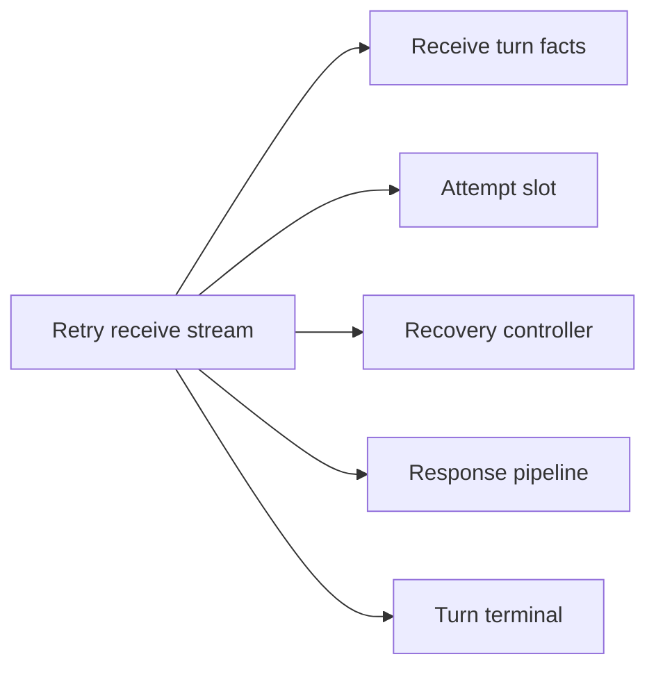
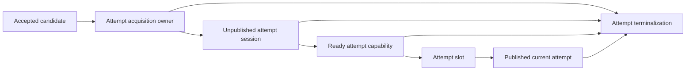
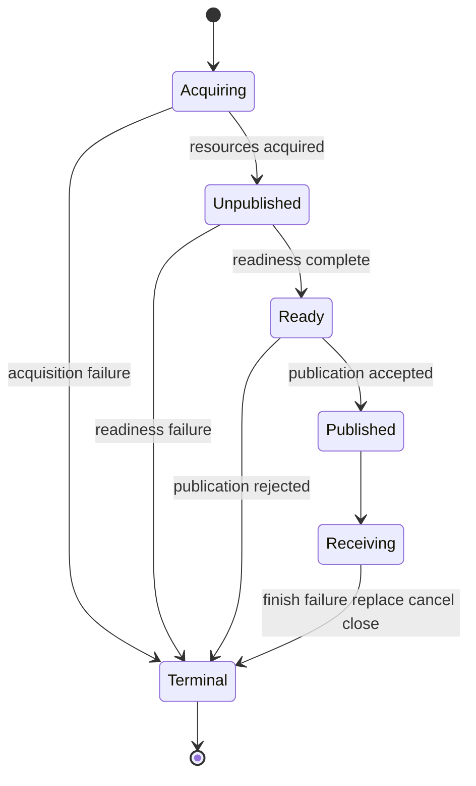
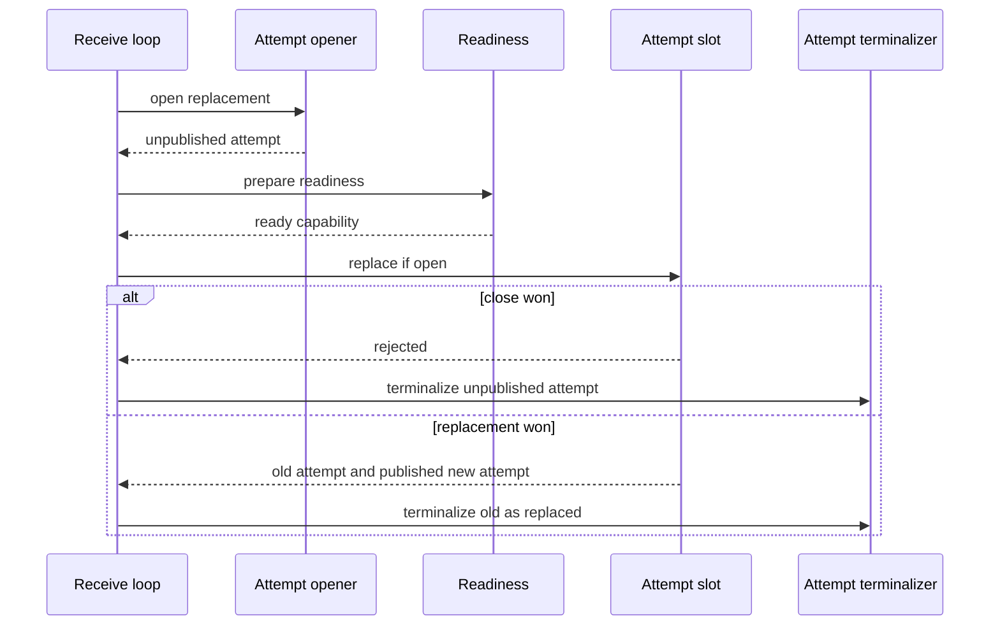
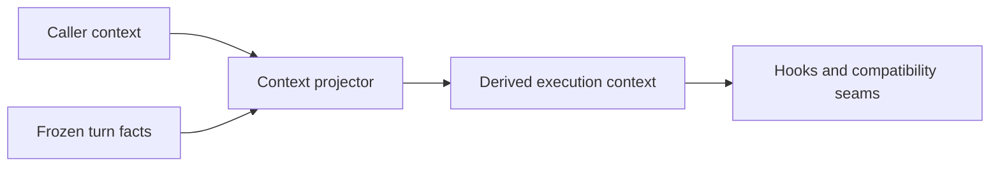
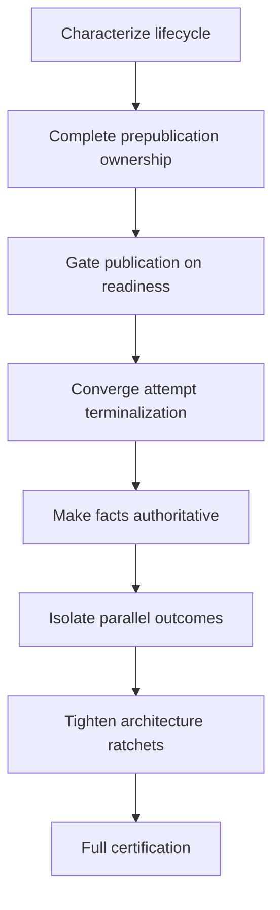

# Design Document

## Overview

This design completes the ownership model established by the request-attempt and turn-recv-terminal refactors. The runtime already has appropriate high-level owners; the remaining defect is the seam between them. An opened backend attempt can become a long-lived `attemptSession` and even become current before all fallible attempt-local readiness work has succeeded. Cleanup can then bypass the full lifecycle by closing the raw stream or executing branch-specific subsets of settlement.

The target introduces one explicit lifecycle progression for every backend attempt:

**acquiring attempt → unpublished ready attempt → published current attempt → exactly-once terminal result**.

Initial execution, recv replacement, parallel winners and interleaved continuations all use this progression. Frozen typed facts remain authoritative after preparation, and parallel workers return immutable outcomes that one coordinator reduces into shared recovery state. The existing five-owner streaming facade remains intact.

### Goals

- Make attempt ownership continuous from first acquisition through terminal settlement.
- Make publication the only visibility boundary and prohibit fallible readiness work after publication.
- Converge attempt terminalization on one lifecycle-complete operation.
- Make `recvTurnFacts` and upstream typed facts authoritative over caller context.
- Remove shared recovery mutation from parallel workers.
- Preserve all existing runtime, routing, billing, security, protocol, extension and streaming behavior.

### Non-Goals

- No public API, SDK, connector, protocol, provider or configuration change.
- No selector grammar or routing-planner redesign.
- No billing, B2BUA, usage-authority, secure-session or interleaved-domain redesign.
- No generic workflow engine, actor system, dependency injection container, resource registry or universal transaction framework.
- No unrelated generation-composition or OpenResponses state-machine refactor.

## Boundary Commitments

### This Spec Owns

- attempt acquisition-to-publication lifecycle orchestration inside core runtime;
- readiness and publication capabilities;
- current-attempt publication/close linearization;
- attempt-level terminalization coordination;
- authoritative post-freeze context projection rules;
- parallel-arm outcome reduction and winner publication;
- architecture ratchets proving those boundaries remain intact.

### Out of Boundary

- policy decisions owned by routing, billing, authority, secure session, extensions or provider adapters;
- public event/protocol semantics;
- persistence redesign;
- selector AST normalization;
- provider-specific code.

### Allowed Dependencies

The design reuses current private runtime owners and existing domain interfaces:

- `attemptTx`, `attemptSession`, `attemptSlot`;
- `recoveryController`, `responsePipeline`, `turnTerminal`, `streamTerminal`;
- `recvTurnFacts` and request preparation products;
- B2BUA lifecycle/store;
- usage authority and metering;
- billing call/leg services;
- extension stream-observer facilities;
- routing/interleaved state facilities.

No new external library is required.

### Revalidation Triggers

Re-run this design review if implementation changes:

- the five direct streaming-facade owners;
- which component owns the current attempt pointer;
- attempt/request terminal lifetime separation;
- the authoritative request-facts boundary;
- parallel winner semantics;
- B2BUA, authority or billing domain contracts;
- any public API or provider/plugin boundary.

## Architecture

### Existing Architecture Analysis

The current runtime already contains the desired coarse decomposition:



The remaining problem is inside the attempt transition. `attemptTx.Handoff` creates an `attemptSession` and disables transaction rollback before final stream observation is guaranteed ready. Initial assembly installs the attempt before observer startup. Replacement publishes the attempt before observer startup. `attemptSlot` therefore protects pointer visibility but not readiness ownership.

### Architecture Pattern and Boundary Map

The selected pattern is **explicit lifecycle ownership with capability-gated publication**. It extends existing concrete owners rather than adding a general orchestration framework.



Key architectural rules:

1. A resource has exactly one lifecycle owner at every arrow.
2. Only a ready capability can cross the publication boundary.
3. Readiness is complete before slot mutation.
4. Publication is non-fallible with respect to attempt-local initialization.
5. Rejected or abandoned ready attempts terminalize without becoming current.
6. Request terminalization remains a separate owner from attempt terminalization.
7. No coordination lock spans backend, observer, store, billing, authority, metering or extension work.

### Project Boundary Questions

- **Core-owned or plugin-owned?** Core-owned. The change coordinates canonical attempt lifecycle and does not belong to any provider/plugin.
- **New canonical concept or adapter behavior?** Private canonical runtime lifecycle concept only.
- **Streaming-first preserved?** Yes. `Recv`/`Close` remain the canonical returned interface; non-streaming behavior remains collection over the stream.
- **Provider SDK leakage avoided?** Yes. No provider types enter the new boundaries.
- **No retry after client-visible output preserved?** Yes. `turnTerminal.committed` remains the logical request commitment authority.
- **Security/startup posture affected?** Security decisions are not changed, but frozen-fact authority is tightened and requires regression tests.
- **Extension seam changed?** No extension ABI change. Final-stream observers start before publication using the existing extension snapshot/factories.

## Target Lifecycle

### Attempt States



`Ready` is a capability state, not a second mutable business owner. It proves that the underlying attempt session satisfies publication preconditions and has not been consumed.

### Readiness Definition

An attempt is ready only after every fallible attempt-local prerequisite required before normal receive has succeeded. The implementation inventory must classify all post-open work. At minimum the current design includes:

- backend stream open succeeded;
- B-leg lifecycle registration succeeded;
- attempt authority is in its correct admitted state;
- attempt-local accounting/tool/prompt-cache helpers are constructed;
- immediate required sideband evidence is consumed or safely owned for later consumption;
- final-stream observation session has successfully opened when factories require it;
- any attempt-local wrapper construction that can fail has completed;
- pending winner effects are represented as data and have not been committed prematurely.

A readiness function may perform blocking observer/extension work, but it runs before slot publication and without a slot/terminal coordination lock.

## Components and Interfaces

| Component | Domain | Intent | Requirement coverage | Key dependencies | Contracts |
|---|---|---|---|---|---|
| Attempt acquisition owner | core runtime | Own all prepublication resources | 2.1–2.6, 4.1–4.4 | authority, B2BUA, backend | State |
| Ready attempt capability | core runtime | Prove readiness and single-use transfer | 3.1–3.8 | attempt session | State |
| Attempt slot publication | core runtime | Linearize publish replace close | 3.2–3.8, 8.4 | ready capability | State |
| Attempt terminalizer | core runtime | Execute exactly-once attempt settlement | 4.1–4.6, 7.2–7.4 | terminal, billing, metering | Service, State |
| Frozen fact projector | core runtime | Project typed authority into context | 5.1–5.6 | recv turn facts | Service |
| Parallel round reducer | core runtime | Serialize shared progress and publication | 6.1–6.7 | routing, recovery, publication | Service, State |
| Receive facade | core runtime | Coordinate explicit event loop | 1.1–1.5, 7.1, 7.5 | five existing owners | Service |
| Architecture ratchets | tests | Prevent lifecycle regression | 7.1–7.6, 9.1–9.8 | Go AST/test harness | Test |

### Attempt Acquisition Owner

**Intent:** extend the existing attempt transaction so it owns every resource from first acquisition until either readiness transfer or terminal rollback.

**Responsibilities and constraints**

- Tracks which concrete attempt obligations were acquired.
- Can abort safely from every intermediate point.
- Does not duplicate domain state machines; it invokes existing owners.
- Becomes consumed after transferring the complete unpublished attempt.
- Never cleans resources after successful transfer.

**State contract**

Conceptually:

```go
type attemptAcquisition interface {
    Prepare(ctx context.Context) (unpublishedAttempt, error)
    Abort(ctx context.Context, intent attemptTerminalIntent) attemptTerminalResult
}
```

The actual implementation should remain a private concrete type; the interface is illustrative only.

**Invariants**

- `Abort` is idempotent.
- only acquired resources receive cleanup;
- successful transfer and abort are mutually exclusive;
- cleanup uses a bounded detached lifecycle context when caller cancellation would otherwise strand owned resources.

### Unpublished Attempt and Ready Capability

The unpublished attempt owns a complete `attemptSession` but is not visible through `attemptSlot`.

Readiness transforms it into a single-use capability:

```go
type readyAttempt struct {
    session *attemptSession
    pending pendingSelectionEffects
    consumed bool
}
```

The exact fields are implementation-private. The normative contract is:

- construction is only possible after readiness succeeds;
- it owns the unpublished attempt until publication consumes it;
- disposal terminalizes the attempt exactly once;
- callers cannot extract the raw stream for independent lifecycle handling;
- duplicate publication fails locally without duplicating side effects.

### Attempt Slot Publication

The slot remains the synchronization owner for the current attempt and publication closure.

Required operations are semantically:

- publish initial ready attempt;
- replace current with ready attempt if publication is still open;
- close publication and snapshot current;
- snapshot current for receive.

The slot lock covers only in-memory state transition. It does not invoke observers, backends, stores or terminal effects.

#### Replacement sequence



If closing the old attempt must happen before a replacement may be opened for authority-safety reasons, that existing rule remains. The publication sequence still ensures the new attempt is fully ready before it becomes current.

### Initial Stream Assembly Ownership

Initial assembly has an additional request-level guard that must not hand off early.

Use one focused private assembly commit owner, conceptually `streamAssemblyTx`, that holds:

- the ready initial attempt;
- the existing pre-stream request ownership guard;
- the newly constructed five-owner stream facade and wrappers before return.

Its final commit is non-fallible and performs only ownership flips/publication already proven ready. Any earlier error disposes the ready/unpublished attempt and leaves request cleanup active.

This is not a generic transaction framework; it exists only to close the current request-to-returned-stream ownership seam.

### Attempt Terminalizer

Attempt terminalization is one lifecycle-complete operation accepting a typed intent and immutable evidence snapshot.

Representative intents include:

- success;
- swallowed recoverable failure;
- surfaced failure;
- cancellation;
- timeout;
- replacement;
- parallel loser;
- open/readiness failure;
- publication denied;
- pre-return abort.

The terminalizer owns the attempt-level sequence:

1. win/observe the attempt terminal CAS;
2. detach the backend stream at most once;
3. cancel/close when the intent requires it;
4. finish final-stream observation;
5. finalize/release attempt authority;
6. emit attempt egress metering;
7. release/end B-leg lifecycle;
8. append billing leg evidence exactly once;
9. record attempt outcome/evidence;
10. discard attempt-local accounting/tool/prompt-cache/transient state;
11. publish one terminal result to competing callers.

Independent cleanup effects continue best-effort even if one observer/append operation fails. Error aggregation preserves current public causal-error rules.

The terminalizer does **not** finish the logical request/A-leg unless `turnTerminal` separately decides that request terminalization is required.

### Frozen Fact Projector

`recvTurnFacts` remains the request-lifetime typed authority. The design changes resolution direction:



Rules:

- caller context contributes cancellation, deadline, tracing and diagnostics;
- authoritative business keys are overwritten from typed facts;
- authoritative absence removes/neutralizes stale caller values rather than falling back to them;
- core business code reads frozen typed values directly;
- context lookup remains allowed at external/SDK boundaries where the contract itself is context-shaped;
- model/catalog/native views remain pinned across generation reload.

`viewsFor` must no longer prefer arbitrary caller context over frozen views after the freeze boundary.

### Parallel Round Reducer

Parallel workers become isolated arm executors. Each receives immutable request/route facts and independent acquisition state and returns a value:

```go
type parallelArmOutcome struct {
    candidate routing.AttemptCandidate
    ready     *readyAttempt
    failure   candidateFailureDelta
    evidence  attemptEvidence
    pending   pendingSelectionEffects
    arrival   uint64
}
```

The exact representation may differ. Worker goroutines do not mutate:

- `recoveryController.excluded`;
- failure history;
- attempt/TTFT budgets;
- session `[first]` state;
- affinity;
- interleaved cycle;
- slot publication state.

One reducer owns those mutations and uses controlled arrival information to preserve first-success behavior. When all arms fail, failure deltas merge in stable candidate/arm order before the existing final-error precedence is applied.

Winner-only pending effects commit only after publication accepts the winner. Losers and late successes dispose their ready attempts through the attempt terminalizer.

## Data and Ownership Model

No persistent schema is introduced. The important data model is lifecycle authority:

| Value or resource | Authoritative owner before publication | After publication | Terminal owner |
|---|---|---|---|
| backend stream | acquisition or unpublished attempt | current `attemptSession` | attempt terminalizer |
| B-leg | acquisition or unpublished attempt | current `attemptSession` | attempt terminalizer |
| attempt authority | acquisition or unpublished attempt | current `attemptSession` | attempt terminalizer |
| final observer session | unpublished attempt after readiness | current `attemptSession` | attempt terminalizer |
| accounting/tool/cache state | unpublished attempt | current `attemptSession` | attempt terminalizer |
| request authority | pre-stream request guard | `turnTerminal` request lifetime | `turnTerminal` |
| current attempt pointer | none | `attemptSlot` | slot plus attempt terminalizer |
| recovery progress | `recoveryController` | `recoveryController` | request lifetime |
| immutable turn facts | preparation | `recvTurnFacts` | request lifetime |

The design forbids two independently mutable authorities for the same row.

## Error Handling

### Prepublication failures

Any acquisition/readiness failure terminalizes the unpublished attempt with evidence appropriate to the failure point. The attempt never enters the slot.

### Publication rejection

If `Close` has closed publication, the ready attempt is disposed as unpublished. No winner-only effect commits.

### Replacement failure

The current request remains governed by existing recovery/error rules. A failed replacement cannot leave a half-current attempt. If policy requires the prior attempt to be retired before opening a replacement, that prior retirement remains terminally complete and the request proceeds according to existing recovery semantics.

### Terminal-effect errors

Attempt terminalization publishes one aggregate result after all independent mandatory effects have been attempted. A secondary billing/observer diagnostic failure must not prevent stream close or authority release.

### Cancellation

Cancellation may stop foreground work but must not strand owned resources. Cleanup uses the repository's bounded detached cleanup pattern where necessary. No unbounded background work is introduced.

## Concurrency Model

- `Recv` remains single-consumer as currently documented.
- `Close` may race blocked `Recv` and replacement publication.
- slot lock linearizes publication-close state only.
- terminal CAS/once state linearizes attempt settlement.
- no slot/terminal mutex is held across backend I/O, observer callbacks, extension hooks, billing, metering, authority or store calls.
- parallel workers own only arm-local mutable state.
- the reducer alone mutates shared route progress for a parallel round.

## File Structure Plan

Implementation should keep responsibility visible in `internal/core/runtime`; exact file names may evolve, but the expected physical ownership is:

- attempt lifecycle file(s): acquisition, unpublished/ready capability, session-private resource access and terminalization;
- attempt publication file: slot/publication lease and Close linearization;
- assembler file: initial `streamAssemblyTx` ownership handoff;
- receive loop: explicit orchestration using lifecycle-complete operations only;
- recovery controller: serial route-progress mutation and replacement orchestration;
- parallel race file(s): worker outcome production and single reducer;
- recv facts file: one-way authoritative projection;
- `internal/archtest`: AST/state-flow ratchets for publication, raw access, context resolution and parallel mutation.

Do not split files merely to reduce line count; boundaries follow ownership.

## Requirements Traceability

| Requirement | Design realization |
|---|---|
| 1.1–1.6 | preserve five-owner facade, explicit receive loop, unchanged domain/public boundaries |
| 2.1–2.6 | attempt acquisition owner plus unpublished cleanup |
| 3.1–3.8 | ready capability, slot publication lease, initial assembly commit |
| 4.1–4.6 | one attempt terminalizer and separate request terminal owner |
| 5.1–5.6 | frozen fact projector and context-resolution prohibition |
| 6.1–6.7 | isolated arm outcomes plus serial parallel reducer |
| 7.1–7.6 | lifecycle-complete APIs and AST ratchets, no framework expansion |
| 8.1–8.6 | preserved domain owners, lock discipline, narrow optional store atomicity |
| 9.1–9.8 | fault/race/leak/context/architecture certification matrix |

## Testing Strategy

### Lifecycle fault matrix

Inject failure after every meaningful acquisition/readiness point:

- budget acquisition;
- B-leg allocation;
- authority admission;
- B-leg registration;
- backend open;
- sideband setup;
- attempt-local helper construction where fallible;
- final observer open;
- ready capability construction;
- publication acceptance/denial;
- winner-only effect commit.

For each case assert exact acquired-resource cleanup, attempt/B-leg attribution, authority state, billing leg count and absence of live stream/goroutine state.

### Initial and replacement observer regression

Dedicated tests must prove observer startup failure occurs before publication for both initial and replacement paths and cannot leave the replacement current.

### Publication concurrency

Scheduling-controlled tests cover:

- `Close` before ready publication;
- ready publication before `Close`;
- receive failure triggering replacement while `Close` races;
- duplicate publication attempt;
- late parallel success after winner/close.

### Terminalization races

Race multiple terminal callers and assert one terminal command wins, all callers observe one result, and stream/authority/B-leg/billing/observer effects execute at most once.

### Frozen facts

Pass bare and deliberately conflicting `Recv` contexts and assert principal/scope/session/workspace/model/metering/billing/security decisions remain pinned. Reload model/catalog generation between initial and replacement and verify the request stays bound to its captured views.

### Parallel reducer

Use deterministic arm scheduling to assert:

- workers do not mutate shared progress;
- winner follows controlled arrival/handicap rules;
- all losers terminalize once;
- all-failure merge is stable;
- `[first]`, budget, TTFT, affinity and interleaved progress mutate only in the reducer;
- winner-only memo/cycle effects commit only after accepted publication.

### Architecture ratchets

AST tests reject:

- direct lifecycle-sensitive `attemptSession` field access outside approved owner files;
- raw `attemptSlot.install` or publication of `*attemptSession` instead of ready capability;
- fallible final-observer/readiness calls after slot publication;
- production attempt terminalization outside the single entry point;
- context-first reads of frozen business facts;
- shared recovery mutation from parallel worker closures;
- extra state owners on `retryRecvStream`;
- generic framework/resource-registry abstractions introduced by this tranche.

Existing request-attempt and turn-recv architecture baselines remain green or become stricter; they are not relaxed to accommodate the refactor.

### Repository certification

Run focused runtime/routing/billing/authority/interleaved tests throughout implementation, then repository quality gates including supported race/checkptr/leak coverage and Linux/Windows/macOS CI parity. Any platform-specific concurrency failure is a release blocker for this spec.

## Security Considerations

The main security improvement is authority provenance: a caller-provided `Recv` context cannot replace frozen principal, scope, session, workspace, model or billing/security facts. This avoids post-admission identity drift.

The design does not weaken current secure-session, secret-guard, policy or authorization ordering. All security-related facts continue to be established upstream; this tranche only makes their authority explicit after freeze.

## Performance and Scalability

The hot path adds no generic middleware layer and no persistent allocation-heavy framework. Expected costs are one small readiness capability and short slot/terminal synchronization operations per attempt. Parallel workers may become cheaper to reason about because they stop contending on shared recovery mutation.

No coordination lock may cover backend/extension/storage calls. Performance regression tests should compare TTFT and allocation behavior for normal single-attempt streaming and representative parallel races; the architecture is not complete if correctness is obtained through coarse serialization of backend work.

## Migration Strategy



Each phase deletes the bypass it replaces. Long-lived dual ownership is prohibited. If a migration step requires both old and new paths temporarily, the adapter must be private, single-call-site, and removed before the next authority is moved.

## Design Validation Result

### Critical concern 1 — Request ownership could have remained separate from initial publication

**Repair:** the design includes a focused initial `streamAssemblyTx` so the ready attempt and existing pre-stream guard transfer together through one non-fallible commit. This closes the failure window between attempt publication and returned-stream ownership. Coverage: 3.3–3.4.

### Critical concern 2 — Cleanup under canceled contexts could strand mandatory resources

**Repair:** attempt abort/terminalization uses bounded detached lifecycle cleanup where foreground cancellation would otherwise interrupt shared settlement. No unbounded background cleanup is introduced. Coverage: 2.4–2.6, 4.2–4.5, 8.4.

### Critical concern 3 — Serial parallel reduction could accidentally serialize backend work

**Repair:** only shared progress mutation and adjudication are serialized. Candidate evaluation/open/TTFT receive work remains concurrent and arm-local. No coordination lock spans backend I/O. Coverage: 6.1–6.7, 8.4.

### Final Assessment

**GO.** The repaired design aligns with the merged architecture, closes the known ownership gaps without introducing a framework, preserves domain boundaries, and provides a staged implementation path with adversarial proof obligations.
