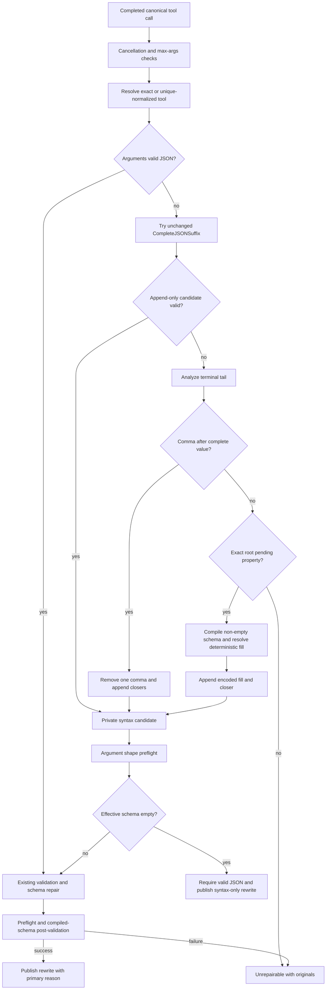

# Design Document

## Overview

This feature extends Go-LIP's canonical native tool-call repair engine with a bounded **safe terminal-tail recovery** stage. It handles only:

1. a terminal comma after a complete value in an open object or array; and
2. an explicit final top-level object property whose absent value is selected by the existing deterministic-fill policy through `const`, a one-element `enum`, or `default`.

The existing V1 append-only scanner remains unchanged and runs first. The new stage is entered only when arguments are invalid and V1 suffix completion cannot produce valid JSON. Every private candidate remains local until it stays within limits and passes strict argument shape preflight. A non-empty-schema result must also pass the existing compiled-schema validation and, when needed, the existing deterministic schema-repair pipeline. Empty-schema append-only and terminal-comma syntax-only results retain the current JSON-validity and shape-preflight exception.

No arbitrary fallback, agent retry, provider branch, or public canonical concept is added.

### Goals

- Recover common `{"key":"value",` and `[1,2,` terminal truncations.
- Recover `{"mode":` only when the existing deterministic-fill policy selects a bounded schema value.
- Preserve exact-original fail-open replay and typed fail-closed policy.
- Keep `CompleteJSONSuffix` append-only and behavior-compatible.
- Reuse current schema compilation, caching, deterministic fill, validation, finalizer, assembler, conformance, and dogfood infrastructure.
- Keep valid-call fast paths and bounded linear behavior.
- Make combined-repair reason selection deterministic and fixture-tested.

### Non-Goals

- Fallback to `{}` or `[]`.
- Unconditional or type-derived `null`.
- Incomplete escape, partial string, number, or literal repair.
- Nested pending-value paths or multiple-candidate search.
- Scalar coercion, fuzzy names, or explicit aliases.
- Transcript/tool-result pairing, agent retry prompts, or auxiliary LLM calls.
- Provider/frontend-local repair.
- New public reason codes, finalizer actions, or canonical events.
- A second syntax mutation after one safe-tail candidate is constructed.

## Boundary Commitments

### This Spec Owns

- bounded terminal-tail classification;
- one-byte terminal-comma candidate construction;
- exact top-level pending-value candidate construction;
- integration into `Engine.RepairContext`;
- explicit primary-reason precedence;
- fixtures, tests, fuzzing, race, benchmarks, conformance, dogfood, and documentation;
- an ADR 0007 amendment documenting the reviewed V2 exception.

### Out of Boundary

- routing, failover, B2BUA, session, and tool-execution policy;
- frontend/backend codecs and provider SDKs;
- public tool alias metadata;
- feature enablement/default changes;
- schema-dialect expansion or distributed state.

### Stable Contracts

- `CompleteJSONSuffix` stays append-only.
- `toolcall.Finalizer` remains pass/rewrite/reject.
- `lipapi.ToolDef` remains unchanged.
- Valid pass-through and fail-open replay exact original lifecycle events.
- Scalar coercion remains disabled.
- Every non-empty-schema rewrite is compiled-schema post-validated.
- Existing empty-schema syntax-only behavior remains JSON-valid and shape-preflighted.
- Protocol adapters remain repair-unaware.
- Existing no-tail V1 reason outcomes remain unchanged.

### Revalidation Triggers

Re-run design validation if implementation proposes nested pending paths, more than one deleted byte, partial-token completion, new public reasons/actions, alias metadata, non-deterministic schema branch selection, adapter-local repair, relaxed shape limits, altered exact-original replay, or removal of the empty-schema syntax-only exception.

## Requirements Traceability

| Requirement | Summary | Components |
|---|---|---|
| 1.1–1.10 | V1 compatibility | unchanged scanner, existing finalizer/assembler, no public/config changes |
| 2.1–2.12 | terminal comma | `TailAnalyzer`, trailing-comma candidate builder |
| 3.1–3.14 | pending value | `TailAnalyzer`, root-fill resolver, pending candidate builder |
| 4.1–4.10 | bounded classification | lexical grammar state machine, cancellation/limits |
| 5.1–5.12 | engine integration | syntax candidate, compiled-schema reuse, empty-schema branch, final validation |
| 6.1–6.12 | security/failure isolation | candidate privacy, strict refusals, exact-original fallback |
| 7.1–7.10 | streaming/protocol parity | existing assembler and conformance matrix |
| 8.1–8.14 | evidence/rollout | fixtures, unit/runtime/fuzz/race/bench/docs |

## Architecture

### Selected Flow



### Ownership

- `internal/core/toolcallrepair` owns analysis, private candidate construction, validation order, and reason precedence.
- `internal/core/runtime` continues to own lifecycle buffering and finalizer invocation.
- `internal/plugins/features/toolcallrepair` remains YAML-only.
- `internal/standardplugins` keeps default injection and opt-out.
- Adapters receive canonical events only.

## Package Change Map

### `internal/core/toolcallrepair`

Expected additions:

- `json_tail.go`: bounded analyzer and private structural result;
- `json_tail_test.go`: grammar and refusal tables;
- engine integration in `engine.go`;
- a small extraction of deterministic property fill if reuse requires it;
- fixture, hardening, fuzz, and benchmark additions.

Expected unchanged contracts:

- public behavior of `json_scanner.go`;
- schema limits/cache/offline policy;
- ordered JSON duplicate semantics;
- finalizer actions and public reason constants.

### Other Surfaces

- `internal/core/runtime`: tests only unless a demonstrated integration defect requires a minimal fix.
- `testdata/tool-call-repair`: positive and refusal fixtures, including reason precedence.
- conformance/dogfood: canonical cases through existing tools-capable paths; no adapter imports.
- docs: ADR 0007 plus performance/dogfood notes.

## Private Data Models

```go
type tailRepairKind uint8

const (
    tailRepairNone tailRepairKind = iota
    tailRepairTrailingComma
    tailRepairPendingRootValue
)

type tailAnalysis struct {
    kind         tailRepairKind
    commaOffset  int
    propertyName string
    closers      []byte
}

type syntaxCandidate struct {
    args          []byte
    primaryReason string
    kind          tailRepairKind
}
```

The implementation may use a different private representation if tests preserve the contract. Analyzer results contain structural metadata only, never raw values for diagnostics.

### Grammar State

Each open frame records object/array kind and one expectation:

- object key-or-end;
- object colon;
- object value;
- object comma-or-end;
- array value-or-end;
- array comma-or-end.

This state proves whether a terminal comma follows a complete value rather than a missing value.

## Tail Analyzer

### General Rules

1. Reject empty or invalid-UTF-8 input.
2. Enforce current byte bounds and scan depth before proportional allocation.
3. Perform one linear scan with no regex, backtracking, or candidate enumeration.
4. Track strings, escapes, delimiters, grammar expectation, and completed-scalar/container state.
5. Treat `true`, `false`, `null`, and JSON numbers as complete only when their exact grammar is complete.
6. Reject mismatched closers, incomplete escapes/Unicode escapes, partial scalars, and trailing non-whitespace.
7. Return at most one repair class.
8. Honor `RepairContext` cancellation at bounded checkpoints.
9. Do not attempt to become the duplicate-member authority.

### Duplicate-Member Handling

Invalid JSON is classified before a valid document exists, so the lexical analyzer may provisionally identify a safe tail in bytes that later prove to contain duplicate object members. The resulting candidate must pass `preflightArgsJSON`, whose duplicate-name rejection remains authoritative. No ordered parsing, schema repair, or rewrite publication occurs before that preflight succeeds.

### Interaction With V1

`CompleteJSONSuffix` remains the first invalid-JSON repair attempt and remains unchanged. The new analyzer runs only when V1 cannot produce valid JSON. This preserves direct callers and append-only tests.

## Terminal-Comma Repair

### Recognition

The comma must be the final non-whitespace byte, outside a string, and the active frame must be in object or array `comma-or-end` state. That state proves one complete value was emitted.

Reject commas following an opening delimiter, colon, another comma, a partial literal/number, a mismatched delimiter, or any later non-whitespace byte.

### Private Candidate Construction

1. Copy the input.
2. Remove exactly the classified comma byte.
3. Preserve all other bytes, including whitespace.
4. Append closers for remaining open containers in reverse order.
5. Require `json.Valid` and maximum-byte compliance.
6. Run strict argument shape preflight.
7. Continue through the applicable schema path.

Example (`␠` denotes one preserved U+0020 space byte):

```text
input:     {"query":"x","filters":{"tags":["a"],␠␠␠
candidate: {"query":"x","filters":{"tags":["a"]␠␠␠}}
```

The one-byte preservation invariant applies to this private candidate. If the non-empty schema subsequently requires an existing deterministic property rename, fill, or forbidden-additional-property removal, the published `ArgsJSON` may differ further only through that bounded schema pipeline. No second speculative syntax edit is permitted.

Primary reason: `toolcall.ReasonSyntaxRepaired`.

Permanent refusals include `{,`, `[,]`, `[1,,`, `{"a":,`, `{"a":tru,`, incomplete escapes, `{"a":1,}x`, and any non-terminal comma.

## Pending Top-Level Value Repair

### Recognition

Input must contain one root object whose final top-level member has:

- a complete JSON-string property key;
- a complete colon;
- optional whitespace;
- end of input;
- no value bytes and no nested open container at that position.

Recognized shapes (`␠` denotes one U+0020 space byte):

```text
{"mode":
{"path":"/tmp","recursive":␠␠␠
```

Refused shapes:

```json
{"outer":{"mode":
{"mode":"sa
{"mode":t
{"mode"
["mode":
```

### Schema Resolution

1. Require a non-empty schema and compile it through the existing schema cache.
2. Resolve the effective root schema using existing local-ref and deterministic single-branch rules.
3. Require root `properties` and exact property-name match.
4. Resolve the property schema and reuse the existing deterministic-fill helper.
5. Accept only `const_inserted`, `enum_inserted`, or `default_inserted`.
6. Do not infer from `type`, `required`, examples, descriptions, formats, bounds, or names.

An explicit `default` is a policy-selected deterministic fill, not proof that other values are invalid. `null` is allowed only when the selected `const`, one-element enum, or default explicitly contains null.

### Private Candidate Construction

Because no value bytes follow the colon, this repair is append-only:

1. copy original bytes;
2. append the deterministically encoded JSON value;
3. append the root-object closer;
4. enforce JSON validity and byte bounds;
5. shape-preflight;
6. continue through existing schema repair and compiled post-validation.

The append-only invariant applies to the private candidate. The published result may differ further only through the existing bounded deterministic schema-repair pipeline. No second speculative syntax edit is allowed.

## Candidate Versus Published Result

The specification distinguishes two stages:

- **Private syntax candidate:** governed by exactly-one-comma deletion or append-only pending-value invariants.
- **Published `ArgsJSON`:** may include additional changes only from the existing bounded deterministic schema-repair pipeline after candidate preflight.

This resolves the apparent conflict between byte preservation and current repairs such as property normalization or `additionalProperties: false` removal. Any failure at either stage returns the original tool name and original argument bytes for finalizer policy mapping.

## Engine Integration

Internal order:

1. enforce cancellation and `max_args_bytes`;
2. resolve exact/unique-normalized tool as today;
3. retain the valid-JSON path;
4. try unchanged append-only completion;
5. otherwise analyze the tail;
6. build a comma candidate, or compile a non-empty schema once and build a deterministic pending-value candidate;
7. preflight the candidate before ordered materialization;
8. if the effective schema is empty, permit only append-only/comma syntax-only success;
9. otherwise reuse the same compiled schema handle;
10. validate, then run current deterministic schema repair only when needed;
11. preflight and compiled-schema post-validate the final candidate;
12. publish only a fully checked rewrite.

Pending-value repair may compile earlier than V1, but the compiled handle must be reused rather than compiled twice.

### Empty Schema

- existing append-only and new terminal-comma repairs may succeed syntactically with an empty schema;
- empty-schema syntax-only rewrites require valid JSON and strict argument shape preflight;
- pending-value repair requires a non-empty compilable schema;
- existing `syntaxOnlyOutcome` behavior remains.

### Primary Reason Matrix

The public result exposes one primary reason:

| Path | Primary reason |
|---|---|
| valid pass-through | `valid_pass_through` |
| existing V1 tool-name-only normalization | `tool_name_normalized` |
| existing V1 schema-only repair | unchanged existing first schema-repair reason |
| append-only completion, with or without later schema repair | `syntax_repaired` |
| terminal-comma repair, with or without later schema repair | `syntax_repaired` |
| pending `const`, with or without later schema repair | `const_inserted` |
| pending one-element enum, with or without later schema repair | `enum_inserted` |
| pending default, with or without later schema repair | `default_inserted` |

A later schema repair is secondary and does not replace the tail path's primary reason. No new public reason code or multi-reason result is introduced.

### No Partial Mutation

All buffers are engine-owned copies. Any failure returns `OutcomeUnrepairable` with original tool name and copied original arguments. Finalizer policy alone maps that to exact pass-through or typed reject.

## Failure Matrix

| Failure | Outcome |
|---|---|
| cancellation | unrepairable / `canceled` |
| input or candidate over limit | unrepairable / `args_too_large` |
| no unique safe tail class | unrepairable |
| comma not after complete value | unrepairable |
| pending property not exact/root/final | unrepairable |
| missing/empty schema on pending path | unrepairable |
| no deterministic schema fill | unrepairable |
| invalid/unsupported non-empty schema | existing schema classification |
| duplicate candidate member | preflight rejection / unrepairable |
| candidate preflight failure | unrepairable |
| non-empty-schema final validation failure | unrepairable |
| finalizer panic/error under fail-open | exact original replay |
| configured fail-closed | typed reject |

## Security, Privacy, and Performance

- one classified comma is the only permitted deletion in syntax candidate construction;
- no reordering, hidden trimming, scalar conversion, escape repair, or business-value inference;
- current argument/schema/operation/depth limits remain;
- no network/filesystem schema resolution;
- diagnostics expose stable action/reason/count/digest metadata only, never arguments, inserted values, schema bodies, paths, commands, or prompts;
- no goroutine is added; analyzer/candidate state is per call; cache synchronization remains unchanged;
- valid JSON never invokes the new analyzer;
- append-only truncation succeeds before the analyzer;
- new paths are bounded O(n) with no search.

## Testing Strategy

### Contract and Unit Tests

Add fixtures for terminal comma in object, array, and nested containers; unsafe comma neighbors; pending `const`, one-enum, and default; and no-fill, nested, misspelled, partial-value, duplicate, empty-schema, and ambiguous-branch refusals.

Unit tests cover grammar transitions, punctuation in strings, completed-scalar recognition, explicit partial-number/literal refusals, whitespace, nesting, mismatches, limits, cancellation, private-candidate byte preservation, primary reason precedence, empty schemas, compiled-schema reuse, combined existing repairs, and no mutation on failure.

### Runtime, Conformance, and Dogfood

Runtime tests cover exact pass-through, rewrite lifecycle, fail-open/fail-closed, panic/error, overflow, cancellation/EOF, interleaved IDs, and duplicate/completed IDs. Existing tools-capable conformance cells exercise canonical outcomes without adapter-local repair. Dogfood includes one case for each new class.

### Fuzz and Race

Fuzz properties:

- no panic and deterministic classification;
- bounded candidate size;
- every accepted private candidate is valid JSON;
- every published non-empty-schema rewrite validates its schema;
- terminal-comma private candidate changes exactly one original byte plus suffix;
- pending private candidate is append-only;
- duplicate candidates do not pass shape preflight;
- unrepairable never publishes a rewrite.

Race tests cover shared cache use with identical/distinct schemas, concurrent comma/pending repairs, and cancellation during compile/repair.

### Performance

Benchmarks separately measure valid pass, V1 append-only truncation, terminal comma, pending deterministic fill, and near-limit unrepairable input, with cold/warm cache where useful.

Use same-host repeated runs and `benchstat`. The valid-pass-through gate is no statistically significant regression greater than 5% in time/op and no increase in allocs/op. Near-limit elapsed time is recorded with input size, platform, and cache posture, but byte/depth/operation bounds—not an absolute wall-clock threshold—determine pass/fail. Any reviewed exception must be explicit.

## Rollout

- no new config or public API;
- reviewed classes join existing `conservative` mode;
- standard feature remains default-injected and fail-open by default;
- explicit feature disablement remains complete rollback;
- broader Reasonix-style behavior remains excluded;
- ADR 0007 records the V2 amendment and one-byte deletion exception.

## Design Rules

- **D1:** Repair only native structured calls at the canonical finalizer.
- **D2:** Preserve `CompleteJSONSuffix` append-only behavior.
- **D3:** New syntax analysis is one bounded linear scan.
- **D4:** Delete only one final comma after a complete value.
- **D5:** Pending value is exact, final, and top-level.
- **D6:** Insert only `const`, single enum, or `default`.
- **D7:** No type-derived null, scalar coercion, or partial token repair.
- **D8:** Candidate preflight precedes materialization/schema repair.
- **D9:** Non-empty-schema rewrites are compiled-schema post-validated; empty-schema syntax-only rewrites retain valid-JSON and shape-preflight safeguards.
- **D10:** No candidate escapes on failure.
- **D11:** Reuse existing actions, reason codes, config, and schema cache with explicit primary-reason precedence.
- **D12:** Keep adapters repair-unaware and streaming-first.
- **D13:** Preserve exact-original fail-open and typed fail-closed behavior.
- **D14:** Diagnostics remain bounded and payload-free.
- **D15:** Tests precede implementation and freeze refusal cases.
