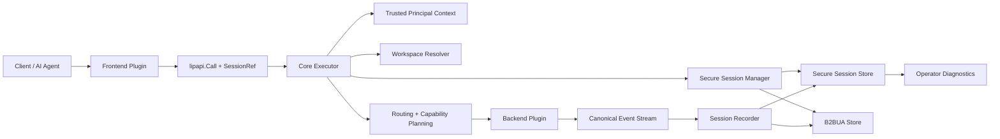
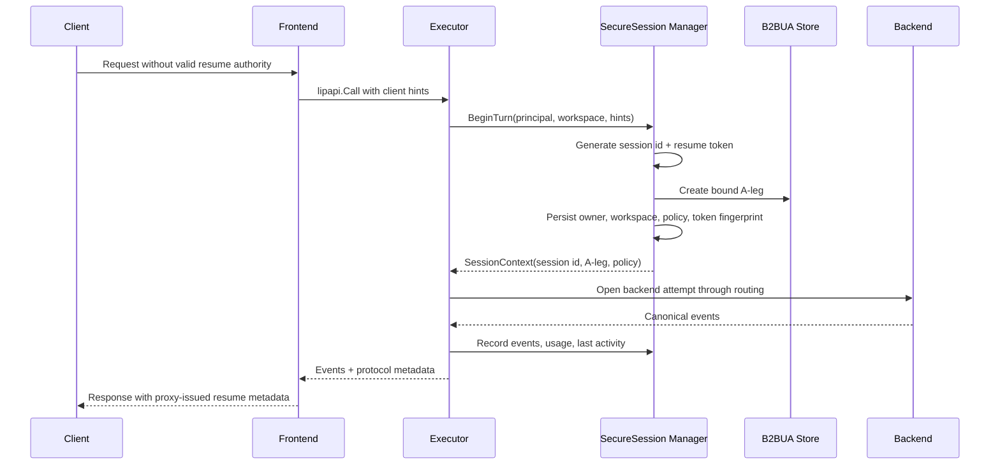
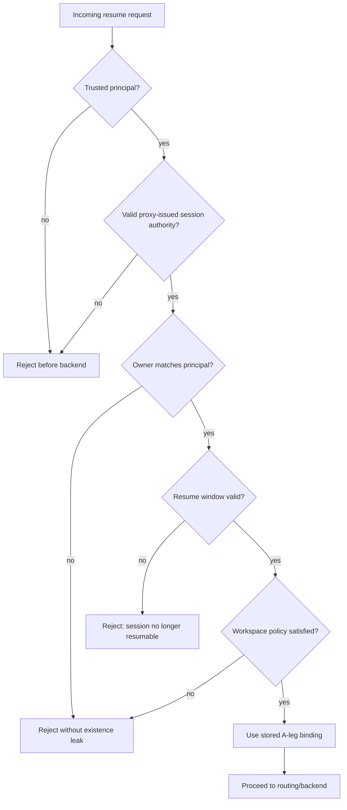
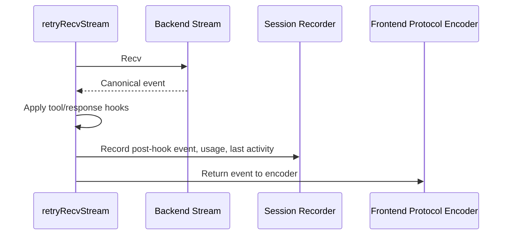
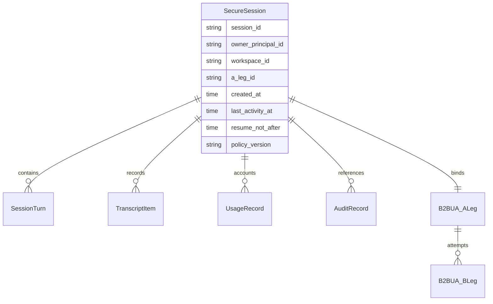
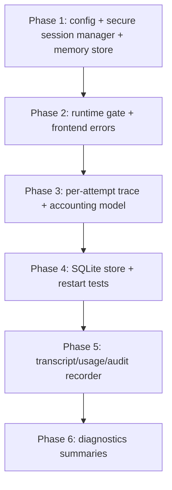

# Design Document

## Overview

Secure session management adds a core-owned, user-bound session authority layer around the existing B2BUA continuity model. It prevents client-controlled session fixation, validates resume attempts against authenticated principals and workspace policy, records inactivity-based resume eligibility, and provides durable session evidence for usage, audit, transcript, and operator diagnostics.

The design uses a hybrid pattern: existing `b2bua.Store` remains authoritative for A-leg/B-leg lineage and attempt sequencing, while a new secure session component owns server-issued session identity, resume proof validation, owner binding, workspace binding, policy metadata, transcript records, usage accounting, audit references, and session summaries. Frontend plugins remain responsible for protocol-specific carriers and error rendering, but they do not own session authorization semantics.

### Goals
- Make proxy-owned session IDs and resume proofs resistant to fixation, forged headers, and concurrent collision scenarios.
- Bind sessions to authenticated users and optional workspaces before B2BUA continuity is resumed.
- Preserve B2BUA attempt lineage while making it clear that continuity IDs are trace identifiers, not ownership proof.
- Persist session, usage, audit, transcript, and policy state when durable storage is configured.
- Provide protocol-legal user feedback and authorized operator diagnostics without leaking other users' session existence.

### Non-Goals
- Implementing a new authentication provider or identity protocol.
- Calculating billing rates or provider pricing tables.
- Replacing the existing B2BUA store, routing planner, backend plugins, or streaming execution model.
- Defining provider-specific transcript formats beyond canonical request/event recording.
- Adding third-party session libraries or provider SDK dependencies to core packages.

## Boundary Commitments

### This Spec Owns
- A core secure session lifecycle: create, resume, validate, touch activity, record transcript/usage/audit, and summarize.
- Proxy-owned session identifiers and bearer resume proofs, including concurrency-safe generation and token hashing.
- Owner, workspace, resume-window, policy metadata, transcript, usage, audit reference, and B2BUA lineage association for sessions.
- Per-attempt backend/model traceability, route decisions, execution settings snapshots, outcome/status evidence, and accounting records for surfaced, swallowed, failed, and timed-out backend attempts.
- Session-denial error categories and the core contract that denials happen before backend attempts.
- Operator-facing session summary and transcript/audit query contracts with authorization and redaction gates.
- The rule that only proxy-owned secure-session state can create, resume, replace, or rebind authoritative session identity; client and backend headers are non-authoritative correlation inputs unless explicitly stored as such.

### Out of Boundary
- Authentication provider implementations and trust decisions for identity headers.
- Provider-specific backend semantics or official provider SDK usage.
- Pricing-rate catalogs and billing-rate calculation.
- Long-term retention policy management beyond storing effective policy metadata and timestamps.
- Raw traffic capture plugin internals, except where secure sessions reference audit artifacts or enforce mandatory audit outcomes.

### Hexagonal Boundary Rules
- `internal/core/securesession/domain` owns pure session concepts, invariants, value objects, and stable business errors. It must not import runtime, HTTP, SQLite, SQL, diagnostics, plugins, or SDK packages.
- `internal/core/securesession/app` owns use-case orchestration: create/resume/touch/finish turns, policy sequencing, transaction intent, recorder decisions, and outbound ports consumed by those use cases.
- `internal/core/securesession/adapters/*` owns storage and diagnostics implementations. SQLite, SQL, HTTP/admin, and other technology-specific concerns stay in adapters or runtime composition, never in domain/app contracts.
- Runtime and frontend code are driving adapters for secure-session use cases: they translate protocol/runtime inputs into app commands and map app errors outward.
- Outbound ports are defined where consumed in `app`; adapter packages expose concrete constructors and do not define interfaces solely because they implement them.

### Allowed Dependencies
- `internal/core/securesession/app` may depend on `internal/core/securesession/domain`.
- `internal/core/securesession/adapters/memory` and `internal/core/securesession/adapters/sqlite` may depend on `app` port contracts and `domain` types, plus technology packages they implement.
- `internal/core/b2bua` is accessed through app-owned lineage ports so A-leg/B-leg records and attempt sequencing remain replaceable from secure-session policy.
- `internal/core/continuity` is used only from runtime/composition migration wiring, not from secure-session domain logic.
- `pkg/lipapi` is used at runtime/frontend boundaries for protocol-neutral session references, events, and canonical error categories; domain types remain independent where practical.
- `pkg/lipsdk/execview` and `pkg/lipsdk/workspace` are translated at the driving boundary into secure-session app/domain principal and workspace values.
- Standard library cryptography only: `crypto/rand`, `crypto/hmac`, `crypto/sha256`, `crypto/subtle`, and `encoding/base64` or `encoding/hex`.
- Existing diagnostics protection, runtime bundle wiring, and frontend error mapping patterns are used at adapter/composition boundaries.

### Revalidation Triggers
- Any change to `lipapi.SessionRef`, canonical session error codes, or response metadata contracts.
- Any change to A-leg/B-leg lineage semantics or no-retry-after-first-output behavior.
- Any change to auth principal identity shape used for durable owner binding.
- Any change to workspace policy semantics or fail-open/fail-closed behavior.
- Any change to durable storage schema, token hashing, redaction, or operator diagnostics access rules.

## Architecture

### Existing Architecture Analysis

The current code already has the right orchestration anchor points:

- `lipapi.SessionRef` carries client hints and current continuity identifiers in `pkg/lipapi/call.go`.
- `continuity.Manager` resolves B2BUA A-legs by `ALegID`, then `ContinuityKey`, then new in `internal/core/continuity/manager.go`.
- `b2bua.Store` owns A-leg/B-leg allocation and attempt records in `internal/core/b2bua/store.go`.
- `Executor.prepareSubmitAndALeg` currently resolves continuity before hooks and workspace in `internal/core/runtime/executor_prepare.go`.
- HTTP auth providers can attach a trusted principal before frontend handlers execute in `internal/stdhttp/auth/middleware.go`.
- Workspace, session_open, traffic capture, and diagnostics are already explicit seams.

The gap is that continuity resolution currently trusts client-supplied `ALegID` or `ContinuityKey` as enough to resume an A-leg. The design changes that ordering: secure session authority is validated first, then the stored session-to-A-leg binding drives B2BUA continuity. Client-supplied continuity identifiers remain diagnostics/correlation hints only unless validated through the secure session record.

Backend-supplied session identifiers, response headers, or provider conversation ids follow the same trust rule: they may be captured as provider correlation metadata for audit, diagnostics, or troubleshooting, but they never create, replace, resume, or rebind the authoritative proxy session. Backend plugins must not write provider session headers into `Record.SessionID`, `Record.ResumeFingerprint`, or any field that controls resume authorization.

### Architecture Pattern & Boundary Map

Selected pattern: **hybrid secure session layer over existing B2BUA continuity**. This keeps routing/lineage behavior stable while adding a distinct security domain for session ownership and resume.



**Architecture Integration**
- Selected pattern: hybrid core component with a narrow store interface and explicit runtime integration.
- Domain boundaries: secure-session domain owns pure user/workspace/policy/session invariants; secure-session app owns use-case orchestration and ports; B2BUA owns attempt lineage; adapters own protocol, storage, diagnostics, and error shape.
- Existing patterns preserved: explicit construction, small interfaces where consumed, streaming-first execution, B2BUA no-retry-after-output invariant, protocol-neutral canonical contracts.
- New components rationale: current continuity rows cannot safely represent owner-bound resumable sessions, transcript/audit/usage, and anti-fixation proof without overloading A-leg semantics.
- Steering compliance: core owns shared semantics; provider SDKs stay out of core; adapters render protocol-specific wire details.

### Technology Stack

| Layer | Choice / Version | Role in Feature | Notes |
|-------|------------------|-----------------|-------|
| Core services | Go 1.26.x, stdlib | Session manager, token generation, validation, recording | No new dependency required |
| Cryptography | `crypto/rand`, `crypto/hmac`, `crypto/sha256`, `crypto/subtle` | Session ID generation, token fingerprints, constant-time comparison | Do not use `math/rand` |
| Storage | In-memory + SQLite implementations | Non-durable and durable secure session store | Mirrors continuity store style |
| Runtime | Existing executor and stream wrapper | Pre-backend gating and event recording | Preserves streaming-first execution |
| HTTP diagnostics | Existing `internal/core/diag` and `internal/stdhttp` | Operator session summaries and audit lookup | Reuse diagnostics protection |

## File Structure Plan

### Directory Structure

```text
internal/core/securesession/
|-- domain/
|   |-- types.go             # Pure domain types: SessionID, ResumeToken, Record, PolicyMetadata, UsageTotals
|   |-- errors.go            # Stable domain/app denial errors without transport formatting
|   `-- policy.go            # Pure owner/workspace/resume-policy invariants
|-- app/
|   |-- manager.go           # Create/resume/touch/finish-turn use cases and policy sequencing
|   |-- recorder.go          # Transcript, usage, audit, and activity recording orchestration
|   |-- ports.go             # Consumer-owned Store, LineageStore, Clock, Generator, and diagnostics query ports
|   |-- ids.go               # crypto/rand-backed generator implementation behind an app-owned port
|   `-- errors.go            # Mapping from domain/app failures to canonical session-denial categories
|-- adapters/
|   |-- memory/
|   |   `-- store.go         # Concurrent in-memory store adapter for tests and non-durable runtime mode
|   |-- sqlite/
|   |   |-- store.go         # Durable secure session store adapter implementation
|   |   |-- schema.go        # SQLite schema and migrations for secure-session tables
|   |   `-- store_test.go    # Durable behavior, restart, uniqueness, owner binding
|   `-- diag/
|       `-- handlers.go      # Operator query HTTP/admin adapter over app query use cases
```

### Modified Files

- `pkg/lipapi/call.go` - add protocol-neutral secure session fields to `SessionRef` while preserving existing hints.
- `pkg/lipapi/errors.go` or new `pkg/lipapi/session_errors.go` - add stable canonical session-denial categories.
- `pkg/lipsdk/session/view.go` - expose authoritative session id separately from client session hint for hooks and diagnostics.
- `internal/core/config/model.go` - add typed `SecureSessionConfig` with enabled/store/resume/audit/redaction/metadata settings.
- `internal/core/config/validate.go` and config tests - validate durable-store/token-key/resume-window combinations.
- `config/config.yaml` - document secure-session defaults and durable examples.
- `internal/infra/runtimebundle/build.go` - construct secure session store/manager and inject it into the executor/runtime snapshot.
- `internal/core/runtime/executor.go` - add optional secure session app service/recorder fields.
- `internal/core/runtime/executor_prepare.go` - translate principal/workspace/runtime inputs into secure-session app commands before B2BUA resume is trusted.
- `internal/core/runtime/attempt_stream.go` - call recorder use cases for accepted stream events, usage deltas, terminal failures, and remote last activity.
- `internal/core/securesession/adapters/diag/handlers.go` or `internal/core/diag/session.go` - add operator session summary/transcript driving adapter without leaking HTTP types into secure-session app/domain.
- `internal/stdhttp/server.go` - mount secure-session diagnostics when enabled.
- `internal/plugins/frontends/*/handler.go` - decode protocol-specific resume carriers and attach returned session metadata.
- `internal/plugins/frontends/*/encode.go` - map session-denial categories to protocol-legal errors and metadata.
- `internal/archtest/*` - ensure new core package does not import concrete plugins or provider SDKs.

## System Flows

### New Session Creation



### Resume Authorization



Session denials occur before route planning and backend open. Therefore no B-leg is allocated for invalid, expired, wrong-owner, or workspace-denied resumes.

### Event Recording



The recorder must not alter event ordering or trigger retries. It records best-effort data when policy is optional and returns fail-closed errors only when the active session policy marks recording as mandatory.

## Requirements Traceability

| Requirement | Summary | Components | Interfaces | Flows |
|-------------|---------|------------|------------|-------|
| 1.1, 1.5, 1.6, 1.7, 1.8 | Unique proxy-owned IDs under concurrency | IDGenerator, Manager, Store | `Generator.NewSessionID`, `Store.Create` | New Session Creation |
| 1.2, 1.3, 1.4, 1.9, 1.10, 1.11 | Remote and client hints are not authority | Frontend adapters, Backend adapters, Manager, SessionRef | `SessionRef`, `BeginTurn` | Resume Authorization |
| 2.1, 2.2, 2.3, 2.4, 2.5, 2.6, 2.7 | Owner binding and isolation | Manager, Store, diagnostics | `PrincipalRef`, `Resume` | Resume Authorization |
| 3.1, 3.2, 3.3, 3.4, 3.5, 3.6, 3.7, 3.8, 3.9 | Fixation and forgery resistance | Token authority, errors, audit evidence, backend correlation metadata | `ResumeToken`, `SessionError` | Resume Authorization |
| 4.1, 4.2, 4.3, 4.4, 4.5, 4.6, 4.7 | Ordered transcript semantics | Recorder, Store | `AppendTranscript` | Event Recording |
| 5.1, 5.2, 5.3, 5.4, 5.5, 5.6 | B2BUA lineage relationship | Manager, B2BUA store, diagnostics | `SessionContext.ALegID`, `AttemptRecord` | New Session Creation, Event Recording |
| 6.1, 6.2, 6.3, 6.4, 6.5, 6.6, 6.7, 6.8, 6.9 | Per-attempt backend/model/status/accounting traceability | Manager, Recorder, Store, routing, diagnostics | `AttemptTrace`, `AttemptAccounting` | Backend Attempt Lifecycle |
| 7.1, 7.2, 7.3, 7.4, 7.5, 7.6, 7.7 | Resume window and last activity | Manager, Recorder, Store | `TouchActivity`, `ResumePolicy` | Resume Authorization, Event Recording |
| 8.1, 8.2, 8.3, 8.4, 8.5, 8.6, 8.7 | Restart-safe durable state | Store implementations, config validation | `Store`, SQLite schema | Resume Authorization |
| 9.1, 9.2, 9.3, 9.4, 9.5, 9.6 | Usage accounting | Recorder, Store, diagnostics | `AddUsage`, `AttemptAccounting`, `UsageTotals` | Event Recording |
| 10.1, 10.2, 10.3, 10.4, 10.5, 10.6, 10.7, 10.8 | Audit and serialization | Recorder, Store, diagnostics, redaction | `AppendAudit`, `ReadAudit` | Event Recording |
| 11.1, 11.2, 11.3, 11.4, 11.5, 11.6, 11.7 | Workspace association | Workspace resolver, Manager, Store | `WorkspaceRef` | Resume Authorization |
| 12.1, 12.2, 12.3, 12.4, 12.5, 12.6, 12.7 | Policy metadata | Manager, policy snapshot, routing integration | `PolicyMetadata` | Resume Authorization |
| 13.1, 13.2, 13.3, 13.4, 13.5, 13.6, 13.7 | Protocol-legal feedback | SessionError, frontend encoders | `SessionError.Code` | Resume Authorization |
| 14.1, 14.2, 14.3, 14.4, 14.5, 14.6, 14.7, 14.8 | Operator visibility | Diagnostics handlers, query store | `Summary`, `Transcript`, `AuditRef`, `AttemptTrace` | Operator Diagnostics |

## Components and Interfaces

| Component | Domain/Layer | Intent | Req Coverage | Key Dependencies | Contracts |
|-----------|--------------|--------|--------------|------------------|-----------|
| Secure Session Manager | App use case | Create/resume sessions and enforce owner/workspace/resume policy | 1, 2, 3, 6, 10, 11, 12 | App-owned ports: Store, LineageStore, Clock, Generator, PolicyResolver | Service, State |
| Secure Session Store Port | App outbound port | Persist session records, token fingerprints, transcripts, usage, audit refs | 2, 4, 6, 7, 8, 9, 10, 11, 13 | Domain types only | Service, State |
| Memory/SQLite Store Adapters | Driven adapters | Implement Store and query ports with in-memory or SQLite technology | 2, 4, 6, 7, 8, 9, 10, 11, 13 | app/domain plus adapter technology | Adapter |
| ID and Token Generator | App service/port implementation | Generate concurrent-safe IDs and bearer resume tokens | 1, 3 | stdlib crypto (P0) | Service |
| Session Recorder | App use case | Record user turns, events, last activity, usage, audit | 4, 5, 6, 8, 9 | App-owned Store/Lineage ports | Service, Event |
| Attempt Trace Recorder | App use case | Record per-B-leg backend/model/settings/status/accounting evidence | 5, 6, 9, 10, 14 | Routing result translated by runtime, app-owned ports | Service, Event |
| Runtime Integration | Driving adapter/core executor | Enforce secure session before backend attempts and inject views | 2, 3, 5, 6, 11, 12 | App services, routing executor | Service |
| Frontend Session Adapter | Plugins | Decode/encode protocol-specific session carriers and errors | 1, 3, 12 | `lipapi.SessionRef` (P0) | API |
| Backend Session Boundary | Plugins | Prevent provider session-like metadata from becoming proxy authority | 1, 3, 4, 9 | Backend response metadata (P1) | API, Event |
| Diagnostics Query Surface | Driving adapter HTTP/admin | Provide authorized session summaries, transcript, and audit access | 8, 9, 13 | App query use cases/ports, diag auth | API |

### Core Session Layer

#### Secure Session Manager

| Field | Detail |
|-------|--------|
| Intent | Enforce proxy-owned session authority and produce a validated session context before routing. |
| Requirements | 1.1, 1.2, 1.3, 1.9, 2.1, 2.2, 2.3, 2.4, 3.1, 3.6, 6.1, 6.4, 10.2, 11.2, 12.6 |

**Responsibilities & Constraints**
- Create sessions with server-owned ID and resume proof.
- Validate resume token, owner principal, resume window, workspace policy, and protected policy metadata.
- Return the stored A-leg binding for B2BUA continuity; do not trust client-supplied A-leg or continuity key as ownership proof.
- Fail closed for missing principal, invalid proof, expired window, owner mismatch, workspace denial, and missing required persisted state.

**Service Interface**
```go
package app

type Manager struct { /* constructed explicitly */ }

type BeginInput struct {
    Now          time.Time
    TraceID      string
    Session      lipapi.SessionRef
    Principal    PrincipalRef
    Workspace    WorkspaceRef
    ClientHints  ClientHints
    FirstMessageDigest string
}

type PrincipalRef struct {
    ID     string
    Issuer string
    Tenant string
}

type WorkspaceRef struct {
    ID string
}

type ClientHints struct {
    ClientSessionID string
    AgentIdentityDigest string
}

type BeginResult struct {
    Session   Record
    TurnID    string
    IsNew     bool
    Response  ResponseMetadata
}

func (m *Manager) BeginTurn(ctx context.Context, in BeginInput) (BeginResult, error)
func (m *Manager) FinishTurn(ctx context.Context, sessionID SessionID, turnID string, outcome TurnOutcome) error
```

- Preconditions: `Principal.ID` is non-empty for resume and for durable sessions unless config explicitly permits anonymous non-durable sessions.
- Postconditions: returned `Record.ALegID` is the only B2BUA A-leg accepted for this turn.
- Invariants: owner binding cannot change on resume; expired sessions cannot be resumed into inherited contents.

#### Secure Session Store Port and Adapters

| Field | Detail |
|-------|--------|
| Intent | Durable and in-memory persistence for secure session state and query views. |
| Requirements | 2.6, 2.7, 4.6, 6.7, 7.1, 7.2, 7.3, 8.4, 9.2, 10.7, 13.1 |

**App-Owned Port**
```go
package app

type Store interface {
    Create(ctx context.Context, rec CreateRecord) (Record, error)
    LoadByID(ctx context.Context, id SessionID) (Record, error)
    LoadByResumeFingerprint(ctx context.Context, fp TokenFingerprint) (Record, error)
    LoadByALegID(ctx context.Context, aLegID string) (Record, error)
    TouchActivity(ctx context.Context, id SessionID, at time.Time, source ActivitySource) error
    AppendAttemptTrace(ctx context.Context, trace AttemptTrace) error
    UpdateAttemptOutcome(ctx context.Context, outcome AttemptOutcome) error
    AppendTranscript(ctx context.Context, item TranscriptItem) error
    AddUsage(ctx context.Context, delta UsageDelta) error
    AppendAudit(ctx context.Context, item AuditItem) error
    Audit(ctx context.Context, id SessionID, opts ReadOptions) ([]AuditItem, error)
    Summary(ctx context.Context, query SummaryQuery) ([]Summary, error)
    Transcript(ctx context.Context, id SessionID, opts ReadOptions) ([]TranscriptItem, error)
    CheckReadiness(ctx context.Context, policy PolicyMetadata) error
}
```

- Memory and SQLite live in adapter packages; neither adapter defines the interface it implements.
- Memory implementation must be race-safe and deterministic under tests.
- SQLite implementation must enforce unique session ids, unique token fingerprints, and owner/session indexes.
- Store must persist enough state to reject ambiguous resumes after restart.
- Port methods must not expose `database/sql`, SQLite driver, HTTP, diagnostics, or provider SDK types.
- `CheckReadiness` exposes storage/audit availability only; the manager remains the owner of the mandatory pre-output readiness checklist.
- Mandatory durability and audit readiness checks must be available before a turn opens a backend attempt so fail-closed policy can reject safely before visible output.

#### Attempt Trace Recorder

| Field | Detail |
|-------|--------|
| Intent | Capture backend/model/settings/status/accounting metadata for every B-leg attempt, regardless of whether the attempt is surfaced, swallowed, failed, or timed out. |
| Requirements | 5.1, 5.2, 5.3, 5.6, 6.1, 6.2, 6.3, 6.4, 6.5, 6.6, 6.7, 6.8, 6.9, 9.6, 10.8, 14.8 |

**Service Interface**
```go
type AttemptTrace struct {
    SessionID      SessionID
    TurnID         string
    ALegID         string
    BLegID         string
    AttemptSeq     int
    RequestedModel string
    RequestedAlias string
    ResolvedBackend string
    ResolvedModel   string
    RouteSource     string
    RouteReason     string
    Settings        AttemptSettings
    StartedAt       time.Time
}

type AttemptOutcome struct {
    SessionID      SessionID
    TurnID         string
    BLegID         string
    Success        bool
    SurfaceState   SurfaceState
    HTTPStatus     int
    ProviderStatus string
    ErrorCode      string
    TimeoutClass   string
    DebugReason    string
    EndedAt        time.Time
}

type AttemptSettings struct {
    Temperature     *float64
    MaxTokens       *int
    Timeout         time.Duration
    ReasoningEffort string
    Streaming       bool
    ToolSummary     []string
    BackendOptionsDigest string
}
```

**Responsibilities & Constraints**
- Start an `AttemptTrace` when a B-leg is opened and the routing result is known.
- Snapshot requested model/alias separately from resolved backend/model so manual model changes and dynamic routing choices remain auditable.
- Record settings that affect execution behavior as safe values or digests; do not store raw secrets or sensitive backend options.
- Update attempt outcome on success, failure, timeout, surfaced output, swallowed pre-output failure, or post-output terminal failure.
- Attach usage, billing, cost, and cache metadata to the B-leg attempt that produced or incurred it, even if no content is returned to the user.
- Keep user-visible usage protocol-compatible while operator/billing rollups include every submitted attempt.

#### ID and Token Generator

| Field | Detail |
|-------|--------|
| Intent | Generate opaque IDs and bearer resume proofs without timestamp-only uniqueness. |
| Requirements | 1.1, 1.5, 1.6, 1.7, 1.8, 3.1, 3.7 |

**Service Interface**
```go
type Generator interface {
    NewSessionID(ctx context.Context, material EntropyMaterial) (SessionID, error)
    NewResumeToken(ctx context.Context, material EntropyMaterial) (ResumeToken, TokenFingerprint, error)
}
```

- `crypto/rand` supplies primary unpredictability.
- User ID, trusted agent identity headers, and first-message digest may be HMAC-mixed as domain-separation material, but uniqueness must not depend on message content or timestamp precision.
- Store only token fingerprints; never persist raw resume tokens.
- Compare fingerprints with constant-time comparison where comparison occurs outside indexed storage.

### Runtime Layer

#### Executor Session Gate

| Field | Detail |
|-------|--------|
| Intent | Enforce secure session policy before routing and backend attempt opening. |
| Requirements | 2.2, 3.6, 6.4, 10.3, 11.6, 12.6 |

**Implementation Notes**
- Reorder `prepareSubmitAndALeg` so principal and workspace are resolved before secure session authorization.
- Call `SecureSessionManager.BeginTurn` before trusting `call.Session.ALegID` or `call.Session.ContinuityKey`.
- Replace or populate `call.Session.ALegID` from the returned secure session record.
- Strip raw resume token from any call copy sent to backend plugins or traffic observers unless an explicitly authorized audit policy requires capture.
- Build `execctx.Views.Session` from authoritative session state, not from `ClientSessionID`.
- Ignore backend-returned session identifiers for proxy-owned session state; only record them as explicit provider correlation metadata when configured.

#### Session Recorder

| Field | Detail |
|-------|--------|
| Intent | Record accepted input and stream events without changing stream semantics. |
| Requirements | 4.1, 4.2, 4.3, 4.5, 5.3, 6.2, 6.3, 8.1, 8.2, 9.1 |

**Implementation Notes**
- Record accepted client input immediately after session gate success.
- Record remote/model events inside `retryRecvStream.Recv` after response/tool hooks produce the client-visible event.
- Update last activity on accepted client request and recorded remote event.
- Accumulate usage deltas when `EventUsageDelta` is observed; mark unavailable fields rather than inventing values.
- Respect audit failure policy: optional audit failures are logged; mandatory audit/storage prerequisites must be validated before client-visible output whenever possible. If a mandatory recorder failure occurs after client-visible output has begun, the recorder shall record or surface a terminal failure for the committed attempt and must not trigger silent replacement or inherited-session continuation.

### Frontend and Diagnostics Layer

#### Frontend Session Adapter

| Field | Detail |
|-------|--------|
| Intent | Carry secure session metadata through protocol-legal fields without owning security decisions. |
| Requirements | 1.4, 3.1, 12.1, 12.2, 12.4, 12.5 |

**Implementation Notes**
- Decode protocol-specific resume metadata into `lipapi.SessionRef.SessionID` and `lipapi.SessionRef.ResumeToken`.
- Preserve `ClientSessionID` as a hint only.
- Encode new-session response metadata in protocol-legal headers or body fields per frontend conventions.
- Map canonical session-denial errors to non-sensitive protocol errors. Wrong-owner and unknown-session cases must use a non-enumerating public message.

#### Backend Adapter Session Boundaries

| Field | Detail |
|-------|--------|
| Intent | Prevent provider or remote LLM metadata from mutating proxy-owned session authority. |
| Requirements | 1.10, 1.11, 3.8, 3.9 |

**Implementation Notes**
- Backend adapters may expose provider conversation ids, request ids, or session-like headers only as provider correlation metadata.
- Backend adapters must not set or overwrite `SessionID`, `ResumeToken`, token fingerprints, owner binding, workspace binding, or stored A-leg binding from backend response data.
- Runtime/backend tests should include a stub backend that returns session-like headers and verify proxy session state remains unchanged.

##### Canonical SessionRef Extension
```go
type SessionRef struct {
    ClientSessionID string // existing client hint
    ContinuityKey   string // existing B2BUA continuity hint
    ALegID          string // existing B2BUA continuity id

    SessionID   string // proxy-owned authoritative session id
    ResumeToken string // bearer resume authority; never sent to backends or persisted raw
}
```

#### Diagnostics Query Surface

| Field | Detail |
|-------|--------|
| Intent | Provide authorized operator visibility into session state and evidence. |
| Requirements | 8.5, 9.4, 9.7, 10.5, 13.1, 13.2, 13.3, 13.6, 13.7 |

**API Contract**
| Method | Endpoint | Request | Response | Errors |
|--------|----------|---------|----------|--------|
| GET | `/debug/sessions` | query by session/user/workspace | redacted summaries | 401, 403, 500 |
| GET | `/debug/sessions/{id}` | authoritative session id | redacted session detail | 401, 403, 404/non-enumerating, 500 |
| GET | `/debug/sessions/{id}/transcript` | id + redaction mode | ordered transcript | 401, 403, 404/non-enumerating, 500 |
| GET | `/debug/sessions/by-a-leg/{a_leg_id}` | A-leg id | same detail rules as session id | 401, 403, 404/non-enumerating, 500 |

Diagnostics reuse `diag.WrapDiagnosticsProtect` initially. Future RBAC can replace the shared-secret wrapper without changing store contracts.

Transcript and audit endpoints must also pass through an explicit operator-authorization seam before returning session contents. The initial implementation may adapt the existing shared-secret diagnostics protection into that seam, but it must still enforce redaction mode, deny raw audit access by default, and use non-enumerating denials for unauthorized session lookups. Attempt-only diagnostics can remain less sensitive, but any endpoint returning user-owned transcript, raw payload references, or audit content must use the session authorization and redaction path.

## Data Models

### Domain Model



### Logical Data Model

**SecureSession Record**
- `SessionID`: proxy-owned opaque identifier, unique.
- `ResumeFingerprint`: HMAC/hash of raw resume token, unique, never reversible.
- `OwnerPrincipalID`: durable owner binding from trusted auth.
- `OwnerIssuer` / `OwnerTenant`: optional stable dimensions for multi-provider auth.
- `WorkspaceID`: optional workspace binding.
- `ALegID`: B2BUA continuity binding created or validated by secure session manager.
- `CreatedAt`, `LastActivityAt`, `ResumeNotAfter`: resume-window policy state.
- `PolicyMetadata`: stored treatment flags, routing hints, redaction/full logging/audit settings, policy version.
- `ClientHints`: non-authoritative client session id and trusted agent identity digest.

**TranscriptItem**
- Ordered by `(SessionID, TurnID, Sequence)`.
- Stores direction, canonical event kind or message role, content references, tool call id, B-leg id, and redaction state.

**UsageRecord**
- Ordered by `(SessionID, TurnID, BLegID, Sequence)`.
- Stores known inbound tokens, outbound tokens, cached output tokens, provider dimensions, and unavailable markers.
- Usage records are per-attempt accounting inputs. Session/user/workspace totals are rollups over all submitted B-leg attempts, including swallowed, failed, and timed-out attempts when usage or billing data is known.

**AttemptTrace**
- Ordered by `(SessionID, TurnID, AttemptSeq)` and linked to `ALegID` and `BLegID`.
- Stores requested model, requested alias, resolved backend, resolved model, route source, route reason, execution settings snapshot, status/outcome, timing, HTTP/provider status, error category, timeout classification, and debug-safe reason.
- Distinguishes the attempt surfaced to the user from attempts that were swallowed, failed pre-output, failed post-output, timed out, or were otherwise not surfaced.
- Stores billing/cost/cache references or unavailable markers for each attempt independently from the final user-visible response usage.

**AuditRecord**
- Stores serialized audit event metadata and references to optional raw/redacted payload artifacts.
- Distinguishes surfaced and swallowed B2BUA attempts.

### Physical Data Model

Initial durable implementation uses a SQLite driven adapter because the repository already supports SQLite continuity storage. The schema is an adapter concern; domain/app code sees only app-owned ports and domain values.

Recommended tables:
- `secure_sessions(session_id primary key, resume_fingerprint unique, owner_principal_id, owner_issuer, workspace_id, a_leg_id, created_at, last_activity_at, resume_not_after, policy_json, client_hints_json)`
- `secure_session_turns(session_id, turn_id, created_at, outcome, primary key(session_id, turn_id))`
- `secure_session_transcript(session_id, turn_id, seq, kind, role, b_leg_id, payload_json, redaction_state, primary key(session_id, turn_id, seq))`
- `secure_session_attempts(session_id, turn_id, a_leg_id, b_leg_id, attempt_seq, requested_model, requested_alias, resolved_backend, resolved_model, route_source, route_reason, settings_json, success, surface_state, http_status, provider_status, error_code, timeout_class, debug_reason, started_at, ended_at, primary key(session_id, turn_id, attempt_seq))`
- `secure_session_usage(session_id, turn_id, seq, b_leg_id, input_tokens, output_tokens, cached_output_tokens, billing_json, unavailable_json)`
- `secure_session_audit(session_id, turn_id, seq, b_leg_id, audit_kind, payload_ref, redacted_payload_ref, mandatory, created_at)`

Indexes:
- `owner_principal_id, last_activity_at` for user/session summaries.
- `workspace_id, last_activity_at` for workspace summaries.
- `a_leg_id` for diagnostics lookup by B2BUA continuity id.
- `b_leg_id` and `(resolved_backend, resolved_model)` for per-attempt diagnostics and accounting queries.
- `resume_fingerprint` for resume validation.

## Error Handling

### Error Strategy

Secure session failures are typed core errors. Frontends map them into legal protocol-specific responses. The core error contains an internal code and a public-safe message. Operator logs and diagnostics may include the internal denial category but must not include raw resume tokens or sensitive payloads.

### Error Categories and Responses

| Code | Public behavior | Internal diagnostic behavior |
|------|-----------------|------------------------------|
| `session_missing_principal` | Authentication required | Missing trusted principal |
| `session_invalid_authority` | Session cannot be resumed | Bad token, unknown id, malformed proof |
| `session_owner_mismatch` | Session cannot be resumed | Principal does not own session |
| `session_expired` | Session can no longer be resumed | Resume window elapsed |
| `session_workspace_denied` | Session cannot be resumed in this workspace | Workspace mismatch or resolver failure under fail-closed policy |
| `session_policy_unavailable` | Session cannot be resumed | Required policy metadata missing/invalid |
| `session_storage_unavailable` | Temporary session service failure | Store read/write failure |
| `session_audit_required_failed` | Session cannot be processed | Mandatory audit path failed |

Unknown, invalid, and wrong-owner cases must not reveal whether another user's session exists. Expired sessions may return a clearer expiration message only after authority and ownership are validated or when policy permits that disclosure.

Mandatory audit or durable-storage failures discovered before backend execution are pre-output session denials. Mandatory recorder failures discovered after client-visible output has started are surfaced as committed-attempt failures; the runtime must not silently retry or replace the B-leg for the same turn.

### Monitoring

- Structured logs: denial code, trace id, session id hash, owner hash, workspace id, A-leg id when known.
- Metrics: session create/resume/deny counts, deny categories, storage failures, audit mandatory failures, transcript append failures, last-activity touch latency.
- Diagnostics: summaries must honor redaction and authorization before returning transcript or audit details.

## Testing Strategy

### Unit Tests
- `internal/core/securesession`: concurrent `NewSessionID` and `NewResumeToken` generation produces distinct identifiers without timestamp dependency (1.5, 1.6, 1.7).
- `internal/core/securesession`: resume rejects missing principal, invalid token, owner mismatch, expired window, workspace denial, and missing policy metadata before returning an A-leg (2.2, 3.6, 6.4, 10.3, 11.6, 12.6).
- `internal/core/securesession`: token fingerprints are stored without raw token persistence and comparisons reject transferred tokens across principals (3.1, 3.7).
- `internal/core/securesession`: recorder preserves transcript order and usage unavailable markers (4.2, 4.6, 8.3).
- `internal/core/securesession/sqlitestore`: restart preserves owner binding, last activity, workspace, policy metadata, and resume eligibility (2.6, 6.7, 7.2, 10.7).

### Integration Tests
- `internal/core/runtime`: forged `ALegID` or `ContinuityKey` without valid secure session authority is rejected before backend open (3.6, 12.6).
- `internal/core/runtime`: valid resume uses stored A-leg and preserves B2BUA lineage across replacement attempts (5.1, 5.2, 5.6).
- `internal/core/runtime`: remote events update last activity and usage accounting without changing event order (6.3, 8.2).
- `internal/core/runtime`: mandatory recorder failure before output rejects before backend open, while mandatory recorder failure after output is surfaced without silent replacement (9.5, 12.6).
- `internal/stdhttp`: diagnostics session endpoints require protection and use non-enumerating denials for unauthorized lookups (13.3, 13.7).
- Frontend packages: each frontend maps expired/not-owned/invalid session denials to legal protocol-specific errors (12.1, 12.2, 12.3, 12.5).

### Performance and Race Tests
- Race tests for memory secure-session store and concurrent session creation/resume.
- Streaming benchmark smoke for recorder overhead in hot event paths.
- SQLite transaction tests for concurrent resume/touch/update flows.

## Security Considerations

- Session IDs and resume tokens are generated from `crypto/rand`; wall-clock time is never the uniqueness source.
- Resume token material is bearer-secret data and must be redacted from logs, traffic capture, transcripts, and backend calls unless explicitly authorized for raw audit capture.
- Raw resume tokens are never persisted; durable stores keep only fingerprints.
- Owner binding and workspace policy are enforced before B2BUA continuity resume.
- Session denial responses avoid cross-user existence leaks.
- Mandatory audit and security-critical policy failures fail closed.

## Performance & Scalability

- Last-activity updates on high-volume streams should be coalesced by session/turn with bounded flush intervals when durable storage is enabled; correctness requires the final stored value to reflect accepted client input and remote output activity.
- Transcript and audit payloads should support references to external storage artifacts so large payloads do not force unbounded SQLite row growth.
- Diagnostics queries should page transcript and audit reads by `(turn_id, seq)` rather than returning unbounded sessions.

## Migration Strategy



- Secure sessions are always enforced for executor prepare; client-provided `ContinuityKey` / `ALegID` are hints only and cannot authorize resume without proxy-issued resume material and BeginTurn.
- Existing attempt lineage tables remain valid; secure sessions add references to A-leg ids rather than migrating B2BUA rows.

## Supporting References

- `.kiro/specs/secure-session-management/research.md` - gap analysis and design discovery notes.
- `.kiro/steering/api-standards.md` - protocol legality and canonical contract guidance.
- `.kiro/steering/routing-and-orchestration.md` - B2BUA and no-retry-after-output invariants.
- `.kiro/steering/testing.md` - test topology and race/streaming expectations.
