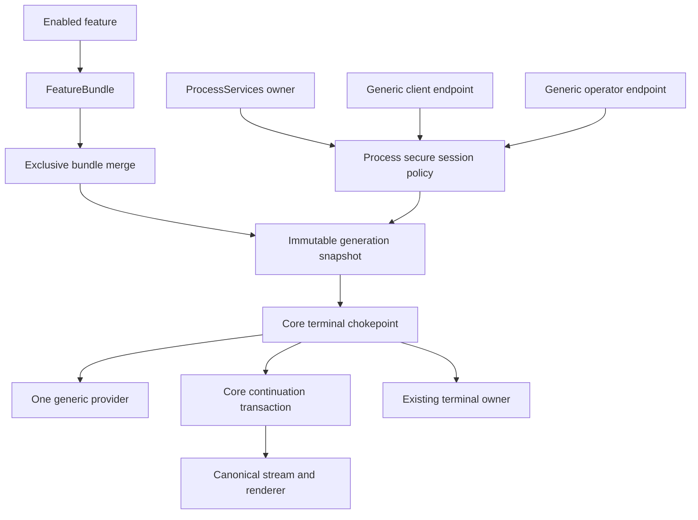
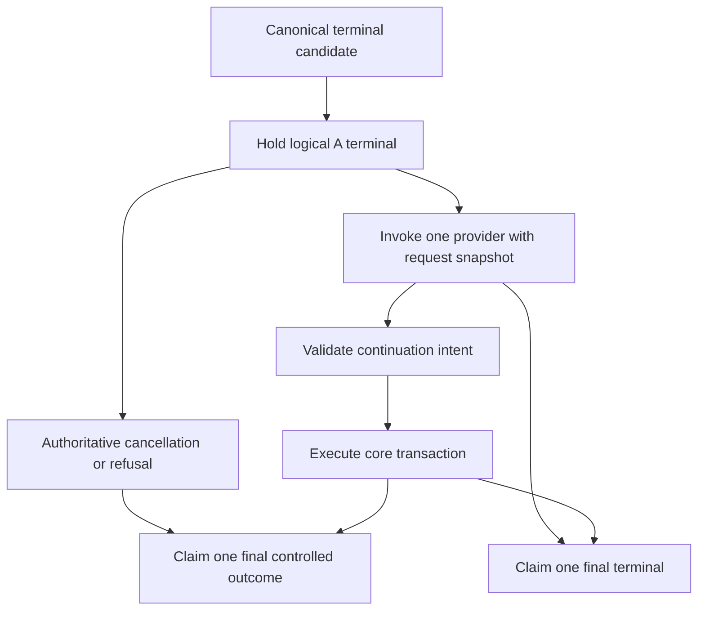
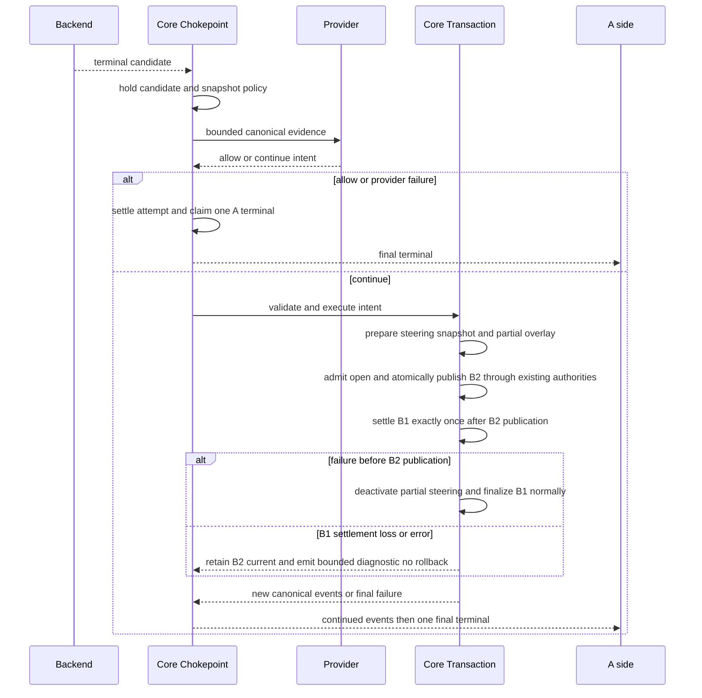
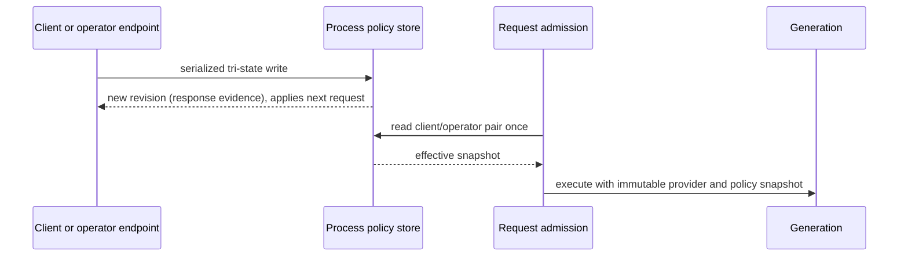

# Design Document

## Overview

This specification introduces one generic provisional-terminal extension seam. An enabled feature contributes at most one provider to an immutable generation. The provider sees bounded canonical evidence and returns a decision intent; it never owns terminal publication, backend admission, conversation mutation, or resource cleanup. The core owns one terminal chokepoint and one continuation transaction so existing routing, stream recovery, terminal ownership, billing, B2BUA, and protocol boundaries remain authoritative.

The same platform supplies a process-owned, bounded policy store keyed by authenticated secure-session/A-leg scope. Client and operator tri-state overrides are evaluated with explicit disable winning. The store survives generation reload and provider disable/re-enable, is snapshotted once per admitted request, and is empty after process restart. Generic client and operator HTTP surfaces update this state without naming a concrete provider.

### Goals

- Add a reusable, exclusive provider seam without a provider-specific core branch.
- Gate all logical A-side terminal publication through one core chokepoint.
- Execute continuation transactionally in the core with truthful attempt settlement and canonical steering.
- Preserve immutable generation publication/withdrawal and existing process owners.
- Provide bounded secure-session policy controls and generic authenticated endpoints.
- Make Agent Loop Guard removable from core and independently implementable as a feature provider.

### Non-Goals

- Implementing Agent Loop Guard's classifier, verifier, recovery wording, or feature configuration.
- Replacing `ResourceLedger`, `ProcessServices`, `runtimehost.Manager`, `processhost.Host`, stream recovery, continuation persistence, or billing.
- Durable policy storage, a generic task/workflow planner, or a universal effect/inverse-effect runtime.
- Provider SDK imports, Go native plugin loading, reflection registries, service locators, or DI containers.

## Boundary Commitments

### This Spec Owns

- The provider-neutral provisional-terminal contract and exclusive FeatureBundle merge rule.
- The core terminal chokepoint and continuation transaction boundary.
- Generation-local provider activation/withdrawal wiring.
- The process-owned bounded secure-session policy store, effective-state rule, request snapshot, and lifecycle.
- Provider-neutral client/operator policy endpoint contracts and bounded diagnostics/ratchets.

### Out of Boundary

- Concrete policy semantics, semantic evidence interpretation, verifier prompts, and provider-specific recovery instructions. These belong to `agent-loop-breach-prevention`.
- Authentication and secure-session authority. The platform consumes existing authenticated scope and does not invent credentials.
- Backend/provider adapters, frontend rendering, billing rates, route selection, and durable policy persistence.

### Allowed Dependencies

- `pkg/lipapi` canonical calls/events/items and existing continuation contracts.
- `pkg/lipsdk/feature`, `pkg/lipsdk/terminal`, `pkg/lipsdk/continuation`, `pkg/lipsdk/steering`, and existing auxiliary/authority facades.
- `internal/core` terminal/runtime/continuation/conversation-view owners.
- `internal/infra/runtimebundle` immutable generation/process composition and `internal/stdhttp` authenticated route mounting.
- Existing metrics, traces, lineage, billing, and secure-session identity seams.

### Revalidation Triggers

- Any change to terminal claim/settlement ordering, output commitment, continuation materialization, or conversation-view steering.
- Any change to `FeatureBundle`, request snapshots, generation retirement, `ProcessServices`, secure-session identity, endpoint authentication, or policy bounds.
- Any attempt to add a second provider, live generation rebinding, request-path policy lookup, or concrete feature branch in core.

## Architecture

### Existing Architecture Analysis

`FeatureBundle` currently merges ordered hook slices into `MergedFeatureSurface`; `RequestRuntimeSnapshot` freezes those contributions for a generation/request. `terminal.Owner` and runtime settlement already provide exactly-once ownership, while `streamrecovery` distinguishes pre-output replay from post-output committed behavior. `ProcessServices` owns process resources and `runtimehost.Manager` owns immutable generation publication and retirement. These are the authorities to extend, not replace.

The current ALG work also exposed four integration hazards that this design makes generic invariants: direct `Call.Messages`/`Call.Items` append conflicts with conversation-view steering; a post-attempt trajectory cannot be used for `AfterIngressTail` anchoring; raw A-leg prefixes are unsafe for bounded overlay IDs; and stale overlays need deterministic fixed-ID cleanup because the store has no pattern-query API. Those are platform continuation rules, not ALG policy rules.

### Architecture Pattern and Boundary Map



Selected pattern: explicit typed construction plus immutable generation projection. The singular provider is a capability of the generation, not a runtime registry. The process policy is the only long-lived policy owner; the request captures an immutable effective snapshot and does not look up mutable state in the stream hot path.

### Project Boundary Questions

- **Core-owned or plugin-owned?** The contract is SDK-owned; policy is feature-owned; terminal ownership and continuation execution are core-owned; endpoint decoding is a standard HTTP adapter.
- **Canonical or adapter-specific?** Provider input/output is canonical and provider-neutral. Provider SDK/wire types remain outside the contract.
- **Streaming-first?** Non-terminal canonical events continue immediately. Only the logical terminal boundary is provisional; non-streaming clients collect the same canonical stream.
- **Provider SDK leakage avoided?** The provider sees canonical evidence and typed facades only. Core has no concrete feature/provider imports.
- **No retry/failover after output?** A continuation transaction starts a new B-leg from retained canonical state and is never labeled retry/replacement.
- **Secure-session posture?** Existing secure-session authority authenticates endpoint scope. The process policy stores only bounded overrides and cannot grant tool or billing authority.
- **Extension seam?** A new singular `FeatureBundle` contribution is the only extension seam. No second hook chain or generic effect mechanism is introduced.

## Provider Contract

The SDK contract is intentionally narrow and provider-neutral. Names are illustrative contract vocabulary; implementation may choose equivalent exported names while preserving these semantics.

```go
type Provider interface {
    ID() string
    Decide(context.Context, Input) (Decision, error)
}

type FeatureBundle struct {
    ProvisionalTerminalProvider Provider // nil or exactly one contribution
}

type Input struct {
    Candidate      CanonicalTerminalCandidate
    Request        RequestIdentity
    Policy         PolicySnapshot
    Continuation   ContinuationEvidence
    Deadline       time.Time
}

type Decision struct {
    Kind           DecisionKind // AllowStop, Continue, or SurfaceFailure
    ReasonCode     string       // bounded, provider-defined diagnostic code
    Continue       *ContinuationIntent
}
```

`Input` contains no raw transport frames, provider SDK objects, secrets, or mutable generation pointers. `ContinuationIntent` carries only bounded canonical trajectory references, internal-control provenance, a bounded instruction/control payload when needed, and an explicit provider reason. `SurfaceFailure` is a controlled final outcome, not a retry or continuation. The core validates every decision and owns all side effects. Invalid, unknown, or empty decisions are not continuation authorization.

The provider is called once for an eligible candidate under a bounded context. A missing provider is a no-op pass-through. The singular field is represented in both `feature.FeatureBundle` and `featurebundle.MergedFeatureSurface`; merge rejects a second non-nil contribution rather than defining precedence.

## Core Terminal Chokepoint

The chokepoint is placed immediately before the existing logical A-side terminal owner claims final completion. It receives every candidate path but excludes no candidate silently:



The core records candidate cause and output commitment, settles each B-side attempt through existing terminal ownership, and claims the A-side terminal once. Provider errors, timeout, panic, malformed decisions, and unsupported continuation normalize to allow-stop with bounded diagnostics. Cancellation is authoritative and cancels provider/transaction work. A provider cannot override refusal, client cancellation, an authority denial, or post-output retry prohibition.

## Continuation Transaction

The transaction is a private core orchestration boundary, not a generic effect engine:

1. Hold the candidate and take the immutable request policy snapshot.
2. Validate provider intent, canonical trajectory, bounds, authority, and protocol capability.
3. Register bounded hidden control content through the canonical steering writer, resolve the accepted user-ingress anchor, and freeze the next turn snapshot. Never mutate an already frozen snapshot.
4. Admit, prepare, and open a new B2 leg through normal route, authority, billing, and B2BUA paths; late attempt transforms reassert the frozen conversation view exactly once. Atomically publish B2 as the current attempt before settling B1.
5. After B2 publication, settle the interrupted B1 attempt exactly once with a truthful existing outcome. If settlement reports loss/error, retain B2 as current, emit bounded diagnostic evidence, and do not fabricate rollback of B2.
6. Keep the A request open only after B2 publication; on any failure before publication, leave B1 unsettled, deactivate partial overlay state, and finalize the original B1 candidate/request normally.
7. On final terminal, cancellation, exhaustion, open failure, or stale external ingress, deactivate the provider-scoped overlay idempotently. A fixed bounded overlay ID is scoped by the authoritative A-leg store; raw A-leg IDs are not concatenated into it.

Committed output and completed tool effects are irreversible. The transaction retains canonical evidence and may continue from a safe point, but never undoes output, replays a committed attempt, or re-executes a completed side effect. It owns cancellation, joins, leases, and overlay cleanup before returning.

## Immutable Generation Lifecycle

Composition builds a candidate provider and policy projection, validates the exclusive contribution, and publishes a new immutable generation atomically. Existing requests hold their generation. Withdrawal follows the current manager order: stop admission, quiesce generation work, drain retained request/continuation leases, close generation resources, then release process dependencies. A candidate failure unwinds acquired resources in reverse order and leaves the last-good generation untouched.

The process policy store is deliberately outside generation ownership. Reload and provider disable/re-enable replace generation projections but do not clear policy entries. A request reads the effective policy once at admission; the provider receives that value in `Input.Policy`.

## Process Secure-Session Policy

### State and Effective Rule

The policy store is created by `ProcessServices` and closed there. A bounded key contains an authenticated secure-session incarnation and A-leg scope; it never contains raw credentials. Each key stores independent client and operator values:

```text
TriState = unset | enabled | disabled

effective(client, operator, generationDefault):
  if client == disabled or operator == disabled: disabled
  else if client == enabled or operator == enabled: enabled
  else: generationDefault
```

Each successful write advances a revision used as response and internal linearization evidence only; requests do not supply an expected revision. Serialized key-boundary writes prevent mixed state and lost updates while a request observes one complete pair. Entries have a configured maximum key count and bounded value size. A write for a new key at capacity is rejected with a stable capacity error and never mutates an existing entry. Values remain until the owning actor clears them or the process restarts.

The store is process-owned and non-durable: it survives reload and generation/provider disable/re-enable, and is empty after restart. `ProcessServices.Close` rejects new writes, completes in-flight operations, and releases the bounded store exactly once.

### Request Snapshot

At request admission, the runtime resolves secure-session identity, reads client/operator state, applies the effective rule, and stores a value in the request snapshot. Terminal evaluation, provider invocation, and continuation use that value only. A policy write cannot affect an in-flight request; it applies to the next admitted request.

## Generic Endpoint Contracts

The standard HTTP composition mounts the following exact provider-neutral routes. Existing secure-session/auth middleware remains the authority.

| Surface | Read | Write | Authority |
|---|---|---|---|
| Client `GET|PUT|DELETE /v1/lip/session/features/{feature_id}` | bounded effective/client state for the current authoritative secure session only | `PUT` body exactly `{"enabled": true|false}`; `DELETE` means client inherit | authenticated client with current secure-session authority |
| Operator `GET|PUT|DELETE /admin/session-features/{session_id}/{feature_id}` | bounded effective/client/operator state after authoritative target validation | `PUT` body exactly `{"enabled": true|false}`; `DELETE` means operator inherit | existing admin authentication and target authorization |

GET responses are bounded objects containing `feature_id`, effective state, actor state(s) applicable to the surface, and revision, and never contain `applies_from`; successful PUT/DELETE responses additionally contain `applies_from: next_request`. Unknown or unregistered features return 404; missing client authority returns 403; invalid bodies/fields, capacity rejection, store failure, and unauthorized or invalid operator targets use stable existing API errors without mutation. Surfaces remain mountable when no provider is active so state survives disable/re-enable; status reports provider absence without claiming it is effective.

The exact error contract is shared by both routes:

| Condition | Status | Error code/headers | Mutation |
|---|---:|---|---|
| Unsupported method | 405 | `method_not_allowed`, `Allow` | None |
| Wrong media type | 415 | `unsupported_media_type` | None |
| Oversized body | 413 | `body_too_large` | None |
| Malformed, empty, wrong-shape, or unknown-field PUT | 400 | `invalid_request` | None |
| Unauthenticated client | 401 | `unauthorized` | None |
| Authenticated client without authoritative secure session | 403 | `secure_session_required` | None |
| Unknown or unregistered feature | 404 | `feature_not_found` | None |
| Unauthenticated operator when distinguished upstream authentication fails | 401 | `unauthorized` | None |
| Diagnostics shared-secret mismatch | 403 | `forbidden` | None |
| Authenticated operator lacking target authorization | 403 | `forbidden` | None |
| Authorized operator with invalid target session | 404 | `session_not_found` | None |
| Policy key capacity reached | 409 | `policy_capacity` | None |
| Policy store absent or closing | 503 | `policy_unavailable` | None |

Client GET returns bounded `feature_id`, `available`, `client_state`, `effective_enabled`, and `revision`, never `applies_from`; operator adds `operator_state`. Successful PUT/DELETE adds `applies_from: next_request`. DELETE means actor inherit. PUT and DELETE have no request-side expected revision: `revision` is response and internal linearization evidence only. Errors remain provider-neutral and never mutate policy.

No endpoint may accept raw session tokens in a path or log bodies. Broad unauthenticated binds use the existing diagnostics/shared-secret posture and cannot be introduced by this extension.

## Data and Ownership Model

| State/resource | Owner | Lifetime | Mutation rule |
|---|---|---|---|
| Provider instance | immutable generation | generation retirement | no live mutation |
| Effective policy snapshot | admitted request | request | immutable after admission |
| Client/operator overrides | `ProcessServices` policy store | process until explicit clear or restart, bounded key/value capacity | revisioned writes |
| Terminal claim | existing terminal owner | attempt/request | exactly once |
| Continuation transaction | core request owner | one continuation attempt | publish B2 before B1 settlement; cancel/join before release |
| Hidden steering overlay | canonical conversation-view owner | A-leg until deactivation | no direct call append |

No physical resource has two close owners. The platform does not create a second process/generation cleanup engine.

## Failure Matrix

| Schedule/failure | Required linearization and outcome |
|---|---|
| Two provider contributions | Candidate generation rejected before publish; last-good generation remains active. |
| Provider timeout/error/panic/malformed decision | Normalize to allow-stop; one final A terminal; no hidden leg. |
| Cancellation vs provider/continuation/open | Cancellation wins before uncommitted output; cancel and join work; one terminal. |
| Output committed then transport interruption | Never retry/replacement; safe continuation only through transaction, otherwise final outcome preserving output. |
| B2 admission/open fails before publication | Do not pre-settle B1; clean partial overlay/leases; finalize original B1 candidate/request normally. |
| B2 published then B1 settlement reports loss/error | Retain B2 as current; emit bounded diagnostic evidence; do not fabricate B2 rollback or re-settle B1. |
| Withdrawal vs pinned request | Request retains immutable generation until drain; no new request uses withdrawn provider. |
| Candidate build fails after acquisition | Reverse-order cleanup; last-good generation untouched. |
| Policy write vs request snapshot | Serialized key-boundary order yields one complete old/new snapshot; no mixed state or lost update. |
| Policy store full/restart | Reject new keys at capacity without changing existing entries; restart starts empty; all events bounded/observable. |
| Stale overlay after crash/restart | External ingress deactivates the fixed provider-scoped overlay before snapshot; not-found/inactive is a no-op; persistence error fails closed. |

## File Structure Plan

### Directory Structure

```text
pkg/lipsdk/terminaldecision/       # provider-neutral input, decision, intent contracts
pkg/lipsdk/feature/                # singular FeatureBundle contribution
internal/featurebundle/             # exclusive merge and validation
internal/core/terminaldecision/     # chokepoint, transaction, policy snapshot port
internal/core/terminaldecisionpolicy/ # bounded process store and effective rule
internal/infra/runtimebundle/       # process/generation composition and lifecycle wiring
internal/stdhttp/terminalpolicy/    # generic client/operator adapters
internal/archtest/                  # ownership, import, and ratchet tests
internal/testkit/                   # schedule and endpoint contract fixtures
```

### Modified Files and Responsibilities

- `pkg/lipsdk/terminaldecision/*` — stable provider contract and bounded DTO validation.
- `pkg/lipsdk/feature/bundle.go` — one singular provider field and validation.
- `internal/featurebundle/merge_surface.go` — one exclusive merge point and conflict errors.
- `internal/core/terminaldecision/*` — candidate hold, provider invocation, final terminal claim, and continuation transaction.
- `internal/core/terminaldecisionpolicy/*` — process-owned tri-state store, revision/capacity rules, and snapshot resolution.
- `internal/infra/runtimebundle/*` — explicit construction, immutable generation projection, ProcessServices ownership, and shutdown ordering.
- `internal/stdhttp/terminalpolicy/*` — provider-neutral endpoint decode/auth/error mapping.
- `internal/archtest/*` and focused package tests — ratchets and failure schedules.

No concrete ALG package or provider-specific file belongs in these paths.

## Components and Interfaces

| Component | Domain | Intent | Requirements | Key dependencies |
|---|---|---|---|---|
| Provider contract | SDK/public | Canonical bounded decision intent | 1, 10, 12 | lipapi P0; feature bundle P0 |
| Exclusive merge | composition | Validate one provider per generation | 1, 4, 10, 11 | registry P0 |
| Terminal chokepoint | core | One provisional-to-final boundary | 2, 8, 9, 10 | terminal owner P0; stream recovery P1 |
| Continuation transaction | core | Validate/admit/settle/clean one continuation | 3, 8, 9, 10 | continuation/steering/authority P0 |
| Policy store | process core | Bounded client/operator tri-state | 5, 6, 8, 9 | ProcessServices P0; secure-session identity P0 |
| Policy endpoints | driving adapter | Generic authenticated reads/writes | 7, 9 | stdhttp/auth P0 |
| Lifecycle wiring | composition root | Immutable activation/withdrawal and process close | 4, 5, 6, 8 | runtimehost/ProcessServices P0 |
| Ratchets and fixtures | tests/architecture | Prevent regression and measure ROI | 8–12 | testkit/archtest P0 |

### Provider Contract

**Responsibilities:** accept immutable canonical evidence, apply feature policy, and return one bounded decision. **Constraints:** no core imports, no terminal/stream/backend mutation, no goroutine or resource that escapes without its own existing SDK owner.

**Preconditions:** validated generation provider, request policy snapshot, bounded deadline. **Postconditions:** decision is validated by core; provider cannot publish output. **Failure:** error/timeout/malformed result becomes allow-stop.

### Terminal Chokepoint and Transaction

**Responsibilities:** hold candidates, coordinate provider call, preserve terminal ownership, validate intent, settle attempts, open new legs through existing authorities, and claim one final outcome. **Constraints:** no provider-specific branching, no post-output retry, no external cleanup under central locks.

**Transaction invariants:** cancellation-aware; one B settlement; no A terminal before final action; no continuation without a frozen next-request snapshot; all owned overlays/leases/work joined or deactivated before return.

### Policy Store and Endpoints

**Responsibilities:** process lifetime, bounded tri-state state, revisioned writes, next-request snapshot, generic HTTP mapping. **Constraints:** no durable storage, no raw credentials, no authority escalation, no request-hot-path mutable lookup after snapshot.

## System Flows

### Request and Continuation



### Policy Update and Request Snapshot



## Error Handling and Monitoring

Provider failures use fail-safe allow-stop semantics and bounded reason codes. Transaction failures preserve already committed output and use existing terminal/error mapping. Endpoint failures use existing authentication and API error envelopes; no state changes on validation or authentication errors. Metrics and logs carry cause/provider/action/outcome/reason/revision classes only. Trace and B2BUA identifiers remain linked through existing facilities.

## Testing Strategy

- **Contract/unit:** provider DTO bounds, nil/typed-nil rejection, exclusive merge, no-provider compatibility, effective tri-state truth table, revision and capacity-rejection behavior.
- **Terminal integration:** every candidate path reaches one chokepoint; provisional hold; provider timeout/error; cancellation race; exactly-once B/A settlement; no retry after output.
- **Continuation integration:** safe canonical trajectory, completed tool/result retention, steering anchor and reassertion, B2 admission/open failure, overlay deactivation and stale cleanup.
- **Lifecycle:** candidate rollback, immutable request snapshots, reload/disable/re-enable policy retention, withdrawal/drain/close order, restart reset.
- **Endpoint:** client/operator scope and authorization, generic names, invalid/stale writes, next-request response, store closing/unavailable.
- **Architecture/ROI:** no concrete ALG imports or provider switches in core; no service locator/DI/native plugin/effect runtime; one provider field and chokepoint; baseline/target operation counts and simplification report.
- **Concurrency:** deterministic barriers for provider-vs-cancel, B1 settlement-vs-B2 open, withdrawal-vs-pinned request, policy write-vs-snapshot, and stale overlay cleanup. Run focused race tests where the platform supports them; retain Linux CI race coverage when Windows cannot allocate TSAN state.

## Requirements Traceability

| Requirement | Design realization |
|---|---|
| 1 | Provider Contract; Exclusive merge; Components |
| 2 | Core Terminal Chokepoint; request flow; exactly-once ownership |
| 3 | Continuation Transaction; canonical steering; failure matrix |
| 4 | Immutable Generation Lifecycle; lifecycle wiring |
| 5 | Process Secure-Session Policy; state/effective rule |
| 6 | Policy lifecycle and Request Snapshot; ProcessServices owner |
| 7 | Generic Endpoint Contracts; endpoint component |
| 8 | Failure Matrix; transaction and lifecycle tests |
| 9 | Error Handling and Monitoring; bounds and lineage |
| 10 | Boundary map; architecture constraints and ratchets |
| 11 | ROI and Simplification Gates; baseline/target tests |
| 12 | Boundary commitments; removable concrete feature and dependency |

### Acceptance-Criterion Coverage

| Criteria | Design elements |
|---|---|
| 1.1, 1.2, 1.3, 1.4, 1.5 | Provider Contract; Exclusive merge; Provider Contract component |
| 2.1, 2.2, 2.3, 2.4, 2.5 | Core Terminal Chokepoint; request flow; terminal ownership |
| 3.1, 3.2, 3.3, 3.4, 3.5, 3.6 | Continuation Transaction; canonical steering; failure matrix |
| 4.1, 4.2, 4.3, 4.4, 4.5 | Immutable Generation Lifecycle |
| 5.1, 5.2, 5.3, 5.4, 5.5 | Process Secure-Session Policy |
| 6.1, 6.2, 6.3, 6.4, 6.5 | Policy lifecycle and Request Snapshot |
| 7.1, 7.2, 7.3, 7.4, 7.5, 7.6 | Generic Endpoint Contracts |
| 8.1, 8.2, 8.3, 8.4, 8.5, 8.6 | Failure Matrix; lifecycle and schedule tests |
| 9.1, 9.2, 9.3, 9.4 | Error Handling and Monitoring; bounds |
| 10.1, 10.2, 10.3, 10.4 | Boundary map; architecture ratchets |
| 11.1, 11.2, 11.3, 11.4 | ROI and Simplification Gates |
| 12.1, 12.2, 12.3, 12.4 | Removable Concrete Feature and Spec Dependency |

## Simplification and GO Gate

Implementation is GO only after the baseline confirms the demonstrated problem and the target can be measured with deterministic counts. The platform must not add a provider chain, a mutable registry, a second cleanup owner, or a request-hot-path policy resolver. If the target cannot show one provider field, one chokepoint, zero concrete ALG policy branches in core, one policy owner, and fewer/clearer ownership paths, the design is narrowed or rejected before implementation.
