# Design Document

## Overview

This feature adds a deliberately small piece of canonical tool metadata: a coarse category and a conservative `MayMutateLocalFS` boolean derived from the effective tool name.

The design does **not** introduce a service framework. It uses:

1. one pure classifier in `pkg/lipapi`;
2. two additive derived fields on `lipapi.ToolEvent`;
3. one tiny request-local lifecycle cache in the existing runtime tool-event path so name-less argument/finish fragments retain the start classification;
4. a small rewrite reconciliation rule so tool-reactor renames cannot leave stale metadata.

Generic `lipapi.Event`, provider adapters, frontend codecs, backend connectors, routing, persistence, configuration, and tool arguments remain untouched.

### Goals

- Give tool policies/reactors a stable coarse category across common coding-agent tool-name dialects.
- Give the same consumers a simple conservative indication of potential local-filesystem mutation capability.
- Preserve classification across streaming fragments where `ToolName` is omitted after `tool_call_started`.
- Keep derived metadata aligned with effective tool-name rewrites.
- Make future alias additions a one-place mapping/test change.

### Non-Goals

- Determine whether a specific invocation actually mutated a file.
- Parse shell commands, JSON arguments, schemas, descriptions, or execution results.
- Build a security sandbox, allow/deny policy, or command risk analyzer.
- Add configurable/custom classification rules.
- Detect which coding-agent harness produced the call.
- Add provider/frontend/backend-specific code.
- Add fields to generic `lipapi.Event` or provider wire formats.
- Add persistence, logging/metrics, databases, goroutines, synchronization, or dependencies.

## Existing Architecture Analysis

### Current tool-event flow

The relevant brownfield path is:

1. a backend/connector emits canonical `lipapi.Event` lifecycle items;
2. optional completed-tool-call finalizers may buffer/rewrite a completed call and synthesize a replacement lifecycle;
3. `retryRecvStream.dispatchClientFacingEvent` calls `lipapi.ToolEventFromEvent`;
4. `handleToolEventPath` passes the resulting `ToolEvent` to tool policies;
5. the hook bus runs ordered tool reactors, which may pass/rewrite/replace/swallow;
6. `lipapi.MergeToolEventInto` merges reactor output back into the generic stream event;
7. general response-part hooks run;
8. the event continues through gates/client observation/frontend encoding.

### Brownfield lifecycle fact: later fragments can omit the name

Representative OpenAI-compatible mappings put the name on `tool_call_started` but emit later argument deltas and the finish event with only `ToolCallID`. The canonical contract permits this. Therefore a stateless classifier called independently on each event would not meet the lifecycle requirement.

### Brownfield mutation fact: effective names can change

Completed-call finalizers can synthesize a renamed lifecycle before classification. Tool reactors can also return a different `ToolName`. Existing reactor code commonly constructs a fresh `ToolEvent` for an argument rewrite and does not copy an unchanged name. Derived metadata must therefore be repaired centrally rather than delegated to each reactor.

### Existing concurrency fact

`retryRecvStream` supports one `Recv` caller and explicitly rejects concurrent `Recv`. A plain per-stream map is sufficient for lifecycle correlation. No mutex or atomics are needed for this feature.

## Architecture Pattern and Boundary Map

**Selected pattern:** pure canonical classifier + request-local lifecycle enrichment.

```mermaid
flowchart LR
    BE[Backend canonical Event] --> FINAL[Existing completed-call finalizers]
    FINAL --> PROJECT[ToolEventFromEvent]
    PROJECT --> ENRICH[Per-stream lifecycle enricher]
    ENRICH --> POLICY[Existing tool policies]
    POLICY --> REACT[Existing tool reactors]
    REACT --> DERIVE[Reconcile derived metadata]
    DERIVE --> REMEMBER[Remember effective class by source ToolCallID]
    REMEMBER --> MERGE[MergeToolEventInto]
    MERGE --> RESP[Existing response-part hooks]
    RESP --> OBSERVE[Observe final non-empty ToolName]
    OBSERVE --> OUT[Existing client-facing stream]

    CLASS[Pure ClassifyToolName] --> PROJECT
    CLASS --> ENRICH
    CLASS --> DERIVE
    CLASS --> OBSERVE
```



### Boundary questions

- **Core or plugin owned?** The taxonomy/helper is canonical protocol-neutral tool metadata in `pkg/lipapi`; request-local correlation is core runtime orchestration. No concrete plugin owns it.
- **Canonical model neutrality preserved?** Yes. Names are coding-agent tool identifiers; no provider SDK/type enters the classifier.
- **Streaming-first preserved?** Yes. Enrichment happens directly on the canonical streaming path and has no non-streaming alternate path.
- **Provider SDK leakage?** None.
- **Retry/failover semantics changed?** No. Classification is informational and never opens, closes, retries, denies, or reroutes anything.
- **New abstraction justified?** No interface/service is introduced. Two small functions/types plus a private state helper are sufficient.

## Architecture Decisions

### D1. Put the taxonomy beside `lipapi.ToolEvent`

Add the category type and pure helper under `pkg/lipapi` because:

- `ToolEvent` is already the canonical protocol-neutral subset for tool policy/reactor consumers;
- both public tool-policy/reactor SDK contracts already depend on `lipapi.ToolEvent`;
- no provider or transport knowledge is required;
- adding derived fields to that focused type is materially smaller than adding a new SDK package/service.

Proposed public shape:

```go
type ToolCategory string

const (
    ToolCategoryFileRead   ToolCategory = "file_read"
    ToolCategoryFileSearch ToolCategory = "file_search"
    ToolCategoryOSCommand  ToolCategory = "os_command"
    ToolCategoryFileEdit   ToolCategory = "file_edit"
    ToolCategoryFileRemove ToolCategory = "file_remove"
    ToolCategoryWebAccess  ToolCategory = "web_access"
    ToolCategoryUnknown    ToolCategory = "unknown"
)

func ClassifyToolName(name string) (ToolCategory, bool)
```

The second return is `mayMutateLocalFS`.

`ToolEvent` gains:

```go
Category         ToolCategory
MayMutateLocalFS bool
```

No new interface is needed.

### D2. Use trim + case-fold + exact switch cases

`ClassifyToolName` normalizes only with:

```text
strings.TrimSpace -> strings.ToLower
```

Then one exact `switch` owns all recognized aliases. A switch is preferred over a mutable package-level map and avoids fuzzy matching.

Do not infer from arbitrary `read_*`, `write_*`, `delete_*`, or `browser_*` names beyond the explicitly enumerated aliases. Custom/MCP tool names that are not recognized fall back to `unknown/true`.

### D3. Keep one coarse category independent from mutation posture

Category and mutation capability answer different questions.

Examples:

- `web_search` -> `web_access`, `false`;
- `browser_action` -> `web_access`, `true`;
- `apply_patch` -> `file_edit`, `true`, even though a patch may delete a file;
- `exec_command` -> `os_command`, `true`, even if the command happens to be read-only.

This avoids multiplying categories merely to encode safety posture.

### D4. Unknown is conservative but non-blocking

Unknown or empty name returns:

```text
Category = unknown
MayMutateLocalFS = true
```

No error is returned. The stream continues unchanged. This is safer than falsely asserting read-only behavior and keeps the helper purely informational.

### D5. Add one private per-stream lifecycle cache

A tiny zero-value helper under `internal/core/runtime`, for example:

```go
type toolEventClassificationState struct {
    byCallID map[string]toolEventClassification
}
```

where the private value contains only category and bool.

Responsibilities:

- classify/remember a non-empty name;
- fill a name-less fragment from the current ID;
- provide `unknown/true` when no state exists;
- remember the final effective classification after tool reactors;
- refresh from a final generic event name after response hooks;
- delete one ID after finish;
- clear all entries when the stream's tool lifecycle is reset/abandoned.

The map is allocated lazily on first useful start/name and has no mutex because one goroutine owns `Recv`.

This helper is not an injected service and is not exported.

### D6. Key lifecycle state by the incoming/source ToolCallID

Capture the incoming canonical `ToolCallID` before policies/reactors. The per-stream cache remains keyed by that **source lifecycle ID**, even if a reactor changes the outbound `ToolCallID` for the client-facing event.

Reason: subsequent backend fragments will continue to arrive under the backend/source ID. Rekeying the lifecycle cache to a reactor replacement ID would break correlation with later source deltas.

If a reactor changes ID and omits the name, its derived metadata is `unknown/true`; that conservative result may be remembered under the source ID for subsequent fragments in the same source lifecycle.

This feature does not alter existing semantics of reactor ID replacement.

### D7. Derived metadata is core-authoritative across reactor rewrites

Before each rewritten/replaced event becomes the current event for the next reactor:

```text
if next.ToolName != "":
    next.Category, next.MayMutateLocalFS = ClassifyToolName(next.ToolName)
else if next.ToolCallID == current.ToolCallID:
    preserve current Category + bool
else:
    use unknown + true
```

A reactor can still choose the effective `ToolName` through existing rewrite semantics, but it does not author contradictory derived metadata.

This rule also preserves source compatibility with existing reactors that construct fresh same-ID argument-delta events without copying unchanged name/metadata fields.

### D8. Completed-call finalizers need no special integration

The existing assembler emits a complete synthetic lifecycle containing the finalizer-rewritten tool name. That lifecycle enters the normal classifier after finalization, so the helper automatically classifies the effective rewritten name.

Do not add classification concerns to the finalizer interface or tool-call-repair engine.

### D9. Observe late response-hook renames without expanding generic Event

After response-part hooks, if the event is a tool lifecycle event and has a non-empty final `ToolName`, refresh the source lifecycle cache from that name before returning/emitting the event.

This is intentionally one-way observation:

- response hooks still receive only generic `lipapi.Event`;
- classification fields are not added to `Event`;
- later name-less fragments inherit the classification corresponding to the last emitted non-empty name.

### D10. Cleanup is lifecycle-local

For a normal finished event, delete the source ID after tool-event/response-hook processing. If the event is swallowed, cleanup still occurs for the finished source lifecycle. If processing terminates with an error, the stream is terminating and remaining state is discarded with it.

When recv-phase failover/replacement abandons one inner stream, clear classification state alongside other per-inner tool lifecycle reset logic so IDs cannot collide with a later B-leg.

No TTL, size cache, LRU, persistence, or background cleanup is justified.

## Classification Table

### Read-only filesystem families

| Normalized aliases | Category | May mutate local FS |
|---|---|---:|
| `read`, `read_file`, `notebook_read` | `file_read` | false |
| `grep`, `find`, `glob`, `ls`, `search_files`, `list_files`, `list_code_definition_names`, `semantic_search`, `codebase_search` | `file_search` | false |

### Potentially mutating local execution/filesystem families

| Normalized aliases | Category | May mutate local FS |
|---|---|---:|
| `bash`, `execute_command`, `exec`, `exec_command`, `shell_command`, `terminal`, `process`, `write_stdin`, `background_process`, `interactive_terminal`, `powershell` | `os_command` | true |
| `edit`, `write`, `replace_in_file`, `write_to_file`, `write_file`, `patch`, `apply_patch`, `notebook_edit`, `notebookedit` | `file_edit` | true |
| `delete_file`, `remove_file`, `delete_directory`, `remove_directory` | `file_remove` | true |

### Web families

| Normalized aliases | Category | May mutate local FS |
|---|---|---:|
| `web.run`, `web_search`, `websearch`, `web_fetch`, `webfetch`, `web_extract`, `x_search` | `web_access` | false |
| `browser`, `browser_action`, `browser_back`, `browser_cdp`, `browser_click`, `browser_console`, `browser_dialog`, `browser_get_images`, `browser_navigate`, `browser_press`, `browser_scroll`, `browser_snapshot`, `browser_type`, `browser_vision` | `web_access` | true |
| anything else / empty | `unknown` | true |

## Tool Lifecycle Flow

```mermaid
sequenceDiagram
    participant B as Backend stream
    participant R as retryRecvStream classifier state
    participant P as Tool policies
    participant H as Tool reactors
    participant X as Response hooks

    B->>R: started(id=c1, name=Read)
    R->>R: classify Read => file_read,false; remember c1
    R->>P: enriched ToolEvent
    P->>H: allowed ToolEvent
    H-->>R: effective ToolEvent
    R->>R: reconcile + remember effective c1 class
    R->>X: generic Event

    B->>R: args_delta(id=c1, name="")
    R->>R: inherit c1 => file_read,false
    R->>P: enriched ToolEvent
    P->>H: allowed ToolEvent
    H-->>R: rewrite same id, name=""
    R->>R: preserve derived class
    R->>X: generic Event

    B->>R: finished(id=c1, name="")
    R->>R: inherit c1
    R->>P: enriched ToolEvent
    P->>H: allowed ToolEvent
    H-->>R: effective ToolEvent
    R->>X: generic Event
    X-->>R: final Event
    R->>R: delete c1 lifecycle state
```

## Components and Change Surface

### `pkg/lipapi/tool_classification.go` (new)

Owns:

- `ToolCategory` and constants;
- `ClassifyToolName`;
- no state and no dependencies beyond the Go standard library.

### `pkg/lipapi/tool_event.go` (small additive change)

Add `Category` and `MayMutateLocalFS` to `ToolEvent` and initialize them from `ToolName` when projecting an event. This gives direct `ToolEventFromEvent` callers deterministic metadata even outside the main runtime; runtime lifecycle state then upgrades name-less later fragments when correlation is available.

### `internal/core/runtime/tool_event_classification.go` (new private helper)

Owns the lazy `ToolCallID` correlation map and cleanup methods. No exported interface/constructor.

### `internal/core/runtime/executor_recv_handlers.go` (small integration)

At the existing tool-event choke point:

- capture source ID;
- enrich from lifecycle state before policy;
- remember effective classification after reactor processing;
- refresh from a later response-hook name if present;
- clean up finish state.

The feature should reuse existing reset/recv replacement paths to clear abandoned lifecycle state.

### `internal/core/hooks/tool.go` (small rewrite reconciliation)

After a valid `ToolRewrite` / `ToolReplace`, normalize the derived fields according to D7 before making `next` current for a later reactor.

A small unexported helper is sufficient.

## Error Handling

The pure classifier returns no error.

Classification state must never turn a structurally valid tool event into a stream failure. Missing state yields `unknown/true`. Existing tool-policy/reactor errors and canonical validation rules remain authoritative and unchanged.

## Performance and Memory

- Classifier cost: trim/case-fold plus one switch.
- Lifecycle memory: one tiny value per active tool-call ID in one recv stream.
- No synchronization, goroutine, I/O, allocation-heavy parser, regex, or unbounded historical retention.
- Finish/reset cleanup bounds state to currently active tool lifecycles.

No benchmark gate is warranted unless implementation evidence shows unexpected hot-path cost.

## Testing Strategy

Follow repository TDD rules: RED contract tests first, production changes second.

### Canonical classifier tests

Table-driven tests cover every alias in Requirements 1–2, case variants, whitespace, empty/unknown names, patch/removal distinction, browser mutation posture, and shell-command argument independence.

### ToolEvent projection tests

Extend existing `pkg/lipapi/tool_event_test.go` so a name-bearing event receives correct metadata and a name-less direct projection receives conservative `unknown/true` when no runtime lifecycle state is available.

### Hook rewrite tests

Extend `internal/core/hooks/toolreactor_test.go` to prove:

- rename from read to exec reclassifies before the next reactor;
- same-ID rewrite omitting name preserves current metadata;
- different-ID/name-less replacement becomes unknown/true;
- a reactor cannot force a contradictory category against a non-empty effective name.

### Runtime lifecycle tests

Focused tests prove:

- start -> name-less delta -> name-less finish inherits one classification;
- two interleaved IDs do not cross-contaminate;
- finish cleanup prevents stale ID reuse;
- abandoned/replacement stream cleanup removes state;
- finalizer-renamed lifecycle is classified normally;
- a response-hook rename refreshes state for a later name-less fragment.

No network or external provider is needed.

## Requirements Traceability

| Requirement | Design coverage |
|---|---|
| R1 Stable categories/aliases | D1, D2, classification table |
| R2 Mutation metadata | D3, D4, classification table |
| R3 ToolEvent lifecycle enrichment | D1, D5, D6, D10 |
| R4 Rewrite consistency | D6, D7, D8, D9 |
| R5 Minimal architecture/compatibility | Overview, boundary questions, D1-D10, change surface |
| R6 TDD/regression coverage | Testing Strategy |

## Design Invariants

1. `Category` and `MayMutateLocalFS` are derived metadata, never user/provider authority.
2. Non-empty effective tool name always wins over copied derived metadata.
3. Unknown never means read-only.
4. OS-command capability is always potentially mutating without argument inspection.
5. Lifecycle state is local to one recv stream and one source `ToolCallID` trajectory.
6. Generic canonical streaming events remain unchanged.
7. Classification never changes tool execution, routing, retry/failover, or protocol framing.
8. The implementation remains dependency-free and configuration-free.
