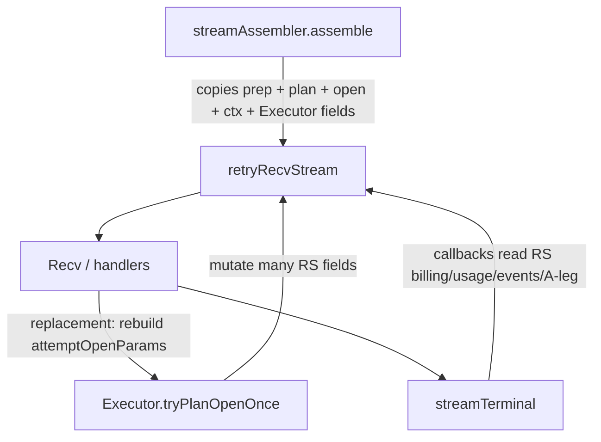
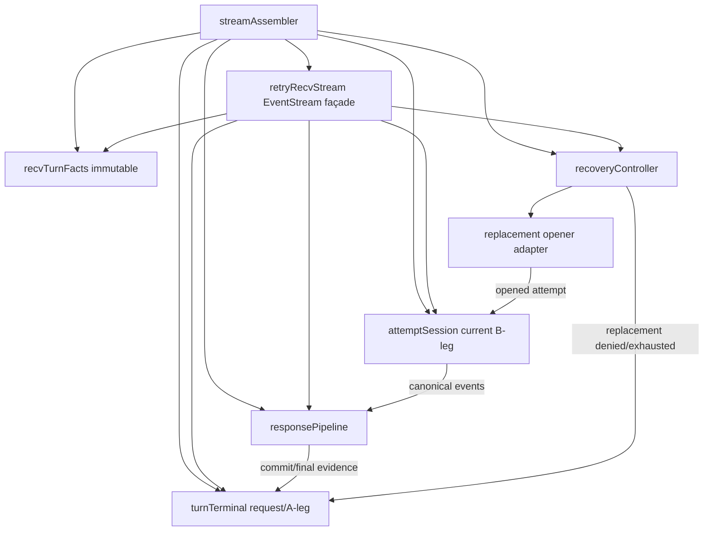
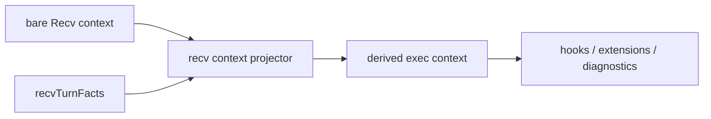
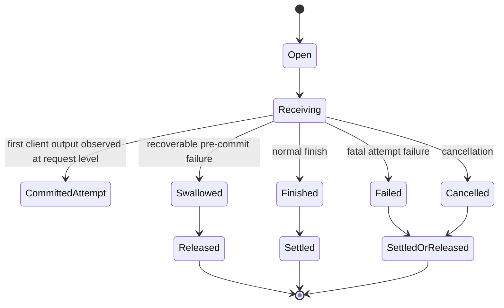
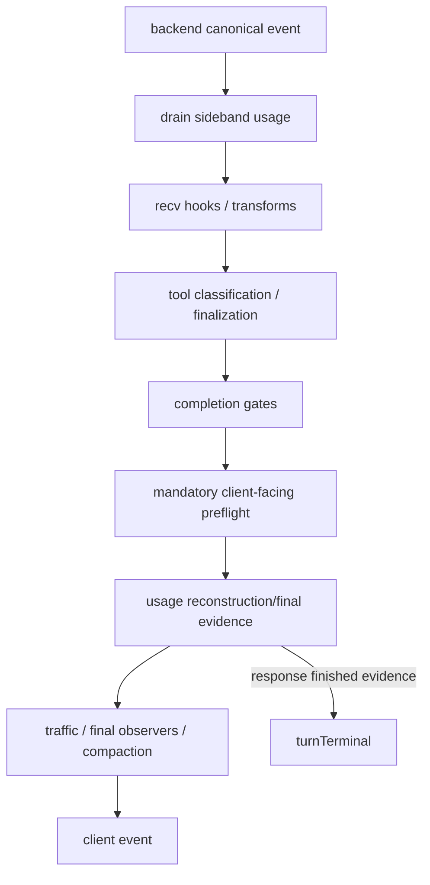
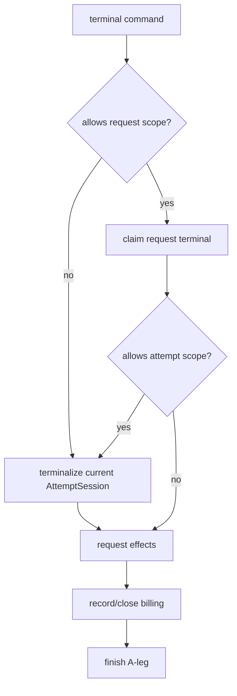

# Design Document

## Overview

This design simplifies Go-LIP's post-open request execution path by replacing the flattened `retryRecvStream` state topology with five explicit private concepts:

1. **EventStream façade** — implements `Recv`/`Close` and coordinates control flow.
2. **Receive-turn facts** — immutable request-lifetime facts pinned at stream assembly.
3. **Attempt session** — owns one current B-leg/backend attempt and attempt-local resources.
4. **Recovery controller** — owns mutable retry/failover state across attempts.
5. **Response pipeline** — owns event accumulation/transformation state.
6. **Turn terminal** — owns output commitment and logical request/A-leg terminalization.

The apparent count is six because the façade is intentionally not a business-state owner. The design goal is not a particular type count; it is to align state ownership with actual lifetimes and remove the current distributed God-object receiver surface.

The design preserves current domain authorities and behavior. It does not redesign routing, billing, usage authority, secure session, token accounting, prompt cache, interleaved thinking, or extension APIs.

## Design Principles

### P1. Lifetime before package

State is assigned by lifetime/invariant, not simply by the package that defines its type. For example, billing has attempt-level leg evidence and request-level call closure; those belong to different owners.

### P2. One authoritative mutable owner

No transition depends on synchronizing two independently mutable copies of commitment, finished state, current attempt, recovery exclusion state, or terminal ownership.

### P3. Concrete private collaborators

Use package-private concrete types by default. A narrow function/interface is introduced only at an existing external seam or where replacement/testing genuinely needs substitution.

### P4. Control flow remains visible

`Recv` must remain readable as the high-level streaming state machine. Do not hide the entire hot path behind a generic event dispatcher, actor system, or middleware framework.

### P5. Delete while extracting

Each migrated responsibility deletes the old stream fields/methods in the same tranche. Long-lived dual-write compatibility is prohibited.

### P6. Existing semantics beat abstraction purity

If a brownfield invariant requires an explicit integration call, preserve it. The objective is fewer ownership relationships, not theoretical layering at the cost of behavior.

## Current Architecture



The type acts as both coordinator and shared mutable storage. Terminal mechanics are partly extracted, but terminal effects still depend directly on stream-owned state.

## Target Architecture



The final façade should be conceptually small:

```go
// Illustrative, package-private shape. Names may change during implementation.
type retryRecvStream struct {
    facts    recvTurnFacts
    attempt  *attemptSlot
    recovery *recoveryController
    response *responsePipeline
    terminal *turnTerminal
}
```

`attemptSlot` is a synchronization wrapper around the current `*attemptSession`; it is not another business state bag.

## D1 — Immutable Receive-Turn Facts

Introduce a private value built once by the stream assembler.

Illustrative shape:

```go
type recvTurnFacts struct {
    traceID string
    aLegID  string
    baseline lipapi.Call

    views      execctx.Views
    viewsOK    bool
    routePrefs []string

    secureTurn   execctx.SecureSessionTurn
    secureTurnOK bool

    modelViews boundModelViews

    // Stable references to owners created/admitted upstream. The fields below
    // are references, not mutable copies of their business state.
    metering     *checkpoint.RequestHolder
    requestAuth  *requestAuthorityState
    billingCall  *billingCallState
    billingID    billing.BillingCallID
    billingIdentity billingIdentitySnapshot
}
```

The exact field split may use nested typed values. Normative rules:

- clone `baseline` and mutable slices/maps as required for immutability;
- bound model views are captured once at assembly;
- no retry counters, exclusions, event buffers, terminal booleans, current candidate, or locks;
- mutable owner references may be held only where the referenced owner already has independent lifecycle/synchronization;
- facts are the business authority for bare-context recv; derived contexts mirror facts for compatibility.

### Derived recv context

Move `recvExecContext` behavior to a small context projector associated with facts or the façade. It may retain a tiny cache keyed by the parent context if profiling justifies it, but the cache is infrastructure-only.



No business decision may depend on a value existing only in the caller's context.

## D2 — `attemptSession`: One B-Leg, One Owner

An `attemptSession` owns exactly one current backend attempt.

Illustrative shape:

```go
type attemptSession struct {
    inner lipapi.ManagedEventStream
    bleg  b2bua.BLegRecord
    cand  routing.AttemptCandidate

    authority authorityLifecycle
    terminal  *streamTerminal // ScopeAttempt
    accounting attemptAccountingTracker

    toolFinal *toolCallAssembler
    promptCache attemptPromptCache
    finalObs attemptObservation // if genuinely attempt-local
}
```

The actual synchronization wrapper may separate the mutable inner stream from immutable attempt identity.

### Attempt lifecycle



`CommittedAttempt` is shown only as an effect of request-level commitment; the attempt must not own a competing commitment boolean.

### Replacement protocol

The logical stream owns one `attemptSlot`. Replacement follows a strict protocol:

1. snapshot current attempt;
2. terminalize/finalize the old attempt according to swallowed-attempt semantics;
3. ensure old authority reservation is settled/released at the current safety point;
4. ask recovery/open adapter for a replacement;
5. construct a new `attemptSession` from the returned opened attempt;
6. atomically publish/swap the current attempt;
7. begin receiving from the replacement.

No caller mutates `bleg`, `cand`, `authority`, `toolFinal`, prompt-cache state, and attempt terminal independently.

### Concurrent Close

`attemptSlot` provides coherent snapshot/swap semantics. `Close` snapshots the current attempt and cancels/closes that attempt. A `Recv` replacement in progress must not create a state where Close operates on half of one attempt and half of another.

A simple implementation can use one short-lived mutex around the pointer swap/snapshot. It must not be held while performing backend I/O or terminal effects.

## D3 — Recovery Controller

The recovery controller owns mutable state that persists across attempts and is used to determine replacement.

Illustrative shape:

```go
type recoveryController struct {
    selector    *routing.Selector
    requestSize routing.RequestSizeEstimate
    session     *routing.SessionRoutingState
    excluded    map[string]struct{}
    rng         routing.Rng

    budget *attemptBudget
    ttft   *ttftBudget

    affinityKey affinity.Key
    affinitySet bool

    lastReject          lipapi.NegotiationResult
    lastTransportReject lipapi.TransportNegotiationResult
    lastAdmissionErr    error
    contextLimit        bool
    transformExcludes   transformExcludeTracker
    lastParallelFailure error

    interleaved interleavedRecoveryState

    opener replacementOpener
}
```

`replacementOpener` is a narrow transitional seam around the existing candidate-open implementation. It must not expose the whole `Executor` to the EventStream façade.

### Recovery decision API

The controller should expose operations in domain terms, e.g.:

```go
type recoveryDecision struct {
    replace bool
    terminalErr error
}

func (r *recoveryController) Replacement(
    ctx context.Context,
    facts recvTurnFacts,
    prior *attemptSession,
) (*attemptSession, recoveryDecision)
```

The exact API may be split into `CanReplace` and `OpenReplacement`; the important invariant is that the façade no longer manually rebuilds the upstream parameter bag from flat fields.

### Scope boundary

This tranche keeps current routing and candidate-open semantics. The recovery controller may still call an adapter that internally builds current `attemptOpenParams`. That adapter is temporary and must be isolated so the following spec can delete it without touching response/terminal owners.

## D4 — Response Pipeline

The response pipeline owns state for backend-event -> client-event processing across `Recv` calls.

Illustrative shape:

```go
type responsePipeline struct {
    customer *customerEvidenceAccumulator

    seenEvents  []lipapi.Event
    visibleText strings.Builder
    usageKeys   map[string]struct{}

    gate completionGateState
    recoveryDrain []lipapi.Event

    toolClass toolEventClassificationState
    // toolFinal is attempt-local and is accessed through current attempt.

    observers responseObservers
}
```

The design may further split small sub-owners where an existing type already exists, but must not create a generic plugin pipeline framework.

### Event processing sequence



The actual existing ordering remains source-of-truth and is frozen by characterization tests. The diagram describes ownership, not permission to reorder current hooks.

### Usage evidence

Keep two explicit concepts:

- authority/operator usage evidence used for settlement;
- customer-visible usage evidence/event reconstruction.

A single “last usage” field is prohibited if it would merge these semantics.

### Completion gates

Gate buffer/drain/live state moves entirely into the response pipeline. Finish handling still calls the terminal owner; the pipeline must not set request-finished state independently.

## D5 — `turnTerminal`: Logical Request/A-Leg Authority

`turnTerminal` owns request-lifetime terminal state.

Illustrative shape:

```go
type turnTerminal struct {
    request *streamTerminal // ScopeRequest

    commitment commitmentState
    finished   terminalResultState

    requestAuth *requestAuthorityState
    metering    *checkpoint.RequestHolder
    billing     *billingCallState
    billingID   billing.BillingCallID

    aLeg *leglifecycle.ALeg
    aLegEnd aLegEndOwner

    services terminalServices
}
```

The exact state should reuse existing billing/request-authority owner types rather than duplicate their internals.

### Single commitment authority

`turnTerminal.MarkCommitted()` is the one state transition establishing client-visible commitment. It must also perform any required one-way notification such as marking the current attempt authority as output-committed through an explicit attempt operation.

Recovery checks `turnTerminal.Committed()`. Response processing does not store a second committed flag.

### Request and attempt terminal composition

Current `runStreamTerminal` nests request and attempt terminalization. Preserve that semantic shape while moving the attempt owner to `AttemptSession`:



Request claim losers wait for the same published result according to current `streamTerminal` rules.

### A-leg end ownership

Replace scattered `holdALegEnd` semantics with an explicit mode/owner concept:

```go
type aLegEndOwner interface { // interface only if existing wrapper boundary needs it
    Finish()
}
```

Prefer a concrete enum/strategy if no substitution is needed:

- base stream owns end;
- outer interleaved wrapper owns end.

The base terminal owner must know whether it is allowed to end the A-leg, rather than checking unrelated stream booleans.

## D6 — Security Recording Placement

Secure-session identity is an immutable fact. Event recording belongs alongside response event handling, but mandatory failure policy affects recovery/terminal legality.

Design split:

- response pipeline invokes recorder and returns a typed recording outcome;
- `turnTerminal` owns commitment;
- recovery uses recording outcome + commitment to decide whether replacement is legal;
- no owner keeps an independent “committed and recorder failed” truth beyond the minimal failure state needed for the decision.

The existing mandatory/fail-open policy and public error mapping remain unchanged.

## D7 — Prompt Cache Placement

`promptCacheSource` and controller derive from the opened backend/candidate and therefore belong to the attempt session. Observation results that contribute to request-level telemetry can be emitted through existing observer services.

On replacement, the new attempt receives the source/controller corresponding to its backend. Old attempt state is not silently retained.

## D8 — Tool State Placement

Separate by lifetime:

- per-B-leg tool-call assembler/finalizer state -> `AttemptSession`;
- event correlation/classification and client-facing drain that spans the logical stream -> `ResponsePipeline`;
- immutable tool declarations remain in `recvTurnFacts.baseline` or a frozen derived value.

Replacement tests pin which in-progress tool state is discarded/terminalized and which request-level classifications persist according to current behavior.

## D9 — Interleaved Thinking Placement

Do not redesign interleaved thinking. Preserve existing store and wrapper architecture.

Placement rules:

- request/recovery cycle cursor and memo continuity needed for replacement -> `RecoveryController`;
- current candidate role and attempt-local memo/prompt-cache effects -> `AttemptSession`;
- outer hidden/visible wrapper retains ownership of combined thinker/executor sequencing and A-leg hold where it already does so;
- `recvTurnFacts` may hold immutable configuration/request facts only.

## D10 — Replacement Opener Transitional Adapter

Because this spec intentionally precedes `request-attempt-pipeline-state-simplification`, it needs a clean adapter around the current upstream open path.

Illustrative:

```go
type replacementOpenRequest struct {
    facts    recvTurnFacts
    recovery recoveryOpenSnapshot
    prior    priorAttemptOutcome
}

type replacementOpener func(context.Context, replacementOpenRequest) (openedAttempt, error)
```

The adapter may internally translate to current `attemptOpenParams` during this tranche. Crucially:

- translation is localized to one file/component;
- the EventStream façade does not know `attemptOpenParams`;
- response/terminal owners do not know the upstream open implementation;
- the next spec can replace the adapter internals without reworking recv/terminal ownership.

Do not introduce an `ExecutorServices` bag.

## D11 — Close Protocol

Close must remain safe against one blocked Recv.

Proposed protocol:

1. terminal owner competes for `CommandClose` according to existing semantics;
2. snapshot current attempt through `attemptSlot`;
3. cancel/close the snapshotted backend stream as required;
4. current attempt terminal effects run exactly once;
5. response evidence needed for terminal snapshot is taken coherently;
6. request terminal effects perform billing/metering/request-authority/A-leg closure;
7. losing concurrent terminal caller observes published outcome.

The implementation may need a slightly different ordering to preserve current code; characterization tests are normative. No lock may be held across backend `Cancel`/`Close` or durable terminal work.

## D12 — Recv Control Flow After Decomposition

`Recv` remains explicit:

```go
func (s *retryRecvStream) Recv(ctx context.Context) (lipapi.Event, error) {
    ctx = s.projectContext(ctx)

    if result := s.terminal.preRecv(ctx); result.Terminal {
        return result.Event, result.Err
    }

    if ev, ok := s.response.nextBuffered(...); ok {
        return s.handlePipelineOutput(ctx, ev)
    }

    for {
        attempt := s.attempt.snapshot()
        if attempt == nil {
            replacement, err := s.recovery.openReplacement(ctx, s.facts, ...)
            if err != nil { return s.terminal.fail(...) }
            s.attempt.install(replacement)
            attempt = replacement
        }

        ev, err := attempt.recv(ctx, ...)
        if err == nil {
            return s.handleBackendEvent(ctx, attempt, ev)
        }

        decision := s.recovery.classifyFailure(...)
        if decision.Replace {
            s.retireAttempt(...)
            continue
        }
        return s.terminal.finishFromRecvError(...)
    }
}
```

This is illustrative; existing TTFT/idle deadlines, sideband draining, gates, and error mapping stay intact. The important property is that each operation delegates to the owner of the state it changes.

## D13 — Synchronization Model

### Façade

The façade should contain no broad business mutex. It coordinates owner calls.

### Attempt slot/session

- short mutex protects current attempt pointer snapshot/swap;
- attempt's inner stream synchronization remains attempt-local;
- backend I/O occurs without holding slot lock.

### Recovery controller

- mutated only by the single Recv goroutine in normal operation;
- no mutex required unless Close must read a specific field; prefer terminal/attempt snapshots instead of adding shared reads.

### Response pipeline

- mutated by Recv;
- terminal/Close may request coherent evidence snapshot;
- one pipeline mutex may protect accumulators/snapshot data, but expensive hooks/I/O are outside the lock.

### Turn terminal

- reuses `streamTerminal`/`terminal.Owner` synchronization;
- commitment uses atomic/lock local to terminal owner;
- billing/request authority owner-specific synchronization remains encapsulated.

### Lock-order rule

No component calls another component while holding a private lock unless the call is proven non-blocking and documented. Architecture/concurrency tests should prefer snapshot-then-call patterns.

## D14 — Failure and Terminal Matrix

The implementation must preserve the following conceptual matrix.

| Situation | Attempt action | Recovery | Request terminal |
|---|---|---|---|
| normal event | keep attempt | none | maybe mark commit |
| normal `response_finished` | settle attempt | none | normal finish/closure |
| pre-commit recoverable recv failure | swallowed terminal/release | open replacement if budget/legal | remains open |
| pre-commit unrecoverable failure | settle/release as current semantics | none | partial/error terminal |
| post-commit backend failure | settle/finalize attempt | replacement only if current policy allows; usually constrained | terminal post-output failure when not recoverable |
| mandatory recorder failure pre-commit | terminalize/record per policy | current recovery policy | possibly remain open for replacement |
| mandatory recorder failure post-commit | no illegal replacement | denied | request terminal failure |
| caller cancel/timeout | cancel/finalize attempt | none | cancel/timeout terminal |
| concurrent Close | one attempt snapshot closes | none after request terminal owner wins | exactly once |
| A-leg cancellation | cancel attempt | none | request terminal/cancel |

Exact error values and billing/authority commands remain pinned by tests.

## D15 — Architecture Ratchets

Add structural tests under `internal/archtest` or focused runtime architecture tests.

### Façade field ownership gate

AST-inspect the final EventStream façade and reject direct fields whose types/packages represent cross-domain mutable state that should live behind collaborators. The allowlist should include only immutable facts and collaborator/slot references plus truly intrinsic adapter state.

### Broad Executor dependency gate

Reject `*Executor` as a field of the final recv façade and, where practical, of response/terminal owners. The temporary opener adapter may close over or wrap existing attempt-open behavior only at the explicit seam.

### No universal bag gate

Reject newly introduced generic `map[string]any`, `map[reflect.Type]...`, `Get/Resolve(any)` service registries, or similarly generic mutable turn-state containers in the affected runtime path.

### Responsibility inventory

Check in or generate a small machine-readable inventory mapping fields/types to the five business owner categories. The final inventory must have exactly one authority category for commitment, attempt terminal, current attempt, recovery diagnostics, response accumulation, and request terminal.

### Deletion/affected-surface gate

Record before/after production-line counts for the touched recv/terminal surface as supporting evidence. Net production growth is a default NO-GO. More important, record:

- direct façade field count by responsibility;
- cross-domain receiver method count;
- direct domain package fan-out from façade;
- top-level synchronization primitive count;
- number of explicit state-copy assignments during stream assembly/replacement.

The final values must show material reduction.

## D16 — Testing Strategy

### Characterization first

Before state moves, create a matrix around existing behavior using deterministic fake backends/streams and existing domain fakes.

Coverage includes:

- normal stream;
- sideband usage before/after receive;
- EOF and synthesized usage;
- completion gate paths;
- tool call paths;
- recoverable failure and replacement;
- exhausted replacement;
- TTFT and idle timeout;
- context/A-leg cancellation;
- Close race;
- secure recorder failure pre/post commit;
- billing leg/call closure;
- interleaved wrappers;
- prompt cache;
- model-view pinning after reload.

### TDD per owner

Each extracted owner gets focused tests for its own invariants before production migration.

### Race/concurrency

Run targeted `go test -race` for supported platforms/packages covering attempt swap, Close, terminal claims, accumulator snapshots, and billing/usage terminal effects.

### Existing suites

Do not weaken or bypass existing:

- runtime executor/retry tests;
- billing convergence tests;
- usage authority/accounting tests;
- secure-session tests;
- interleaved-thinking tests;
- frontend/protocol parity/conformance tests;
- architecture and quality gates.

## D17 — Phased Migration

### Phase A: freeze behavior and architecture baseline

No production structural changes. Add characterization and ownership metrics.

### Phase B: introduce facts and attempt owner

- construct immutable facts;
- wrap opened attempt in `AttemptSession`;
- move inner/bleg/candidate/authority/attempt terminal/attempt-local tool/prompt state;
- update replacement to swap attempts;
- delete old fields/reset helpers.

### Phase C: move request terminal/commit ownership

- move request terminal owner and commitment;
- move request authority/billing call closure/A-leg end coordination;
- preserve `streamTerminal` behavior;
- delete duplicate committed/finished/request terminal fields/methods.

### Phase D: move recovery state

- move selector/exclusions/budgets/rejections/affinity/interleaved retry state;
- isolate replacement opener adapter;
- delete flat recovery fields from façade.

### Phase E: move response pipeline state

- move accumulation/gates/drains/tool classification/observer state;
- make terminal snapshots explicit;
- delete cross-domain stream receiver methods.

### Phase F: shrink façade and remove migration scaffolding

- remove broad Executor reference;
- remove temporary forwarding methods and weak direct-construction paths;
- run architecture/deletion/race/parity gates.

## D18 — Interaction With the Following Spec

`request-attempt-pipeline-state-simplification` chronologically follows this design.

This design intentionally creates one seam that the next spec may replace: `replacementOpener`. After the upstream attempt pipeline is simplified, recovery should call the new typed attempt pipeline directly.

No other owner in this spec should depend on `attemptOpenParams`, `preparedRequest`, or route-plan implementation details. This keeps the two PRs/specs independently reviewable and prevents the first implementation from being coupled to the second's internal type names.

## Design Rules Summary

- **D1:** immutable receive-turn facts are one explicit authority for pinned request facts.
- **D2:** one active B-leg = one attempt-session owner.
- **D3:** retry/failover mutable state belongs to recovery controller.
- **D4:** client event transformation/accumulation belongs to response pipeline.
- **D5:** output commitment and logical request terminalization belong to turn terminal.
- **D6:** secure recording execution and replacement policy are separated by responsibility without duplicate truth.
- **D7:** prompt-cache source/controller follow the active attempt.
- **D8:** tool state is split by attempt versus response lifetime.
- **D9:** interleaved state placement follows existing lifetime boundaries; no domain redesign.
- **D10:** current upstream open path is isolated behind one temporary narrow adapter.
- **D11:** Close snapshots/cancels the current attempt and converges on one request terminal result.
- **D12:** Recv remains explicit control flow over cohesive owners.
- **D13:** synchronization is owner-local; no giant lock or undocumented nested-lock graph.
- **D14:** failure/terminal behavior remains equivalent.
- **D15:** architecture ratchets enforce ownership/dependency simplification.
- **D16:** characterization/TDD/race/parity evidence is mandatory.
- **D17:** migrate by authority with immediate deletion of old state.
- **D18:** following upstream-pipeline spec may replace only the explicit opener seam.

## Expected Simplification

The intended after-state is not “more layers.” It should remove large amounts of forwarding and conditionally initialized state from the stream receiver surface. A developer changing billing call closure should primarily inspect terminal/billing integration; a developer changing retry policy should inspect recovery; a developer changing tool event processing should inspect response/attempt state; and a developer changing backend stream cleanup should inspect the current attempt owner.

The EventStream façade should become boring. That is the architectural success condition.
