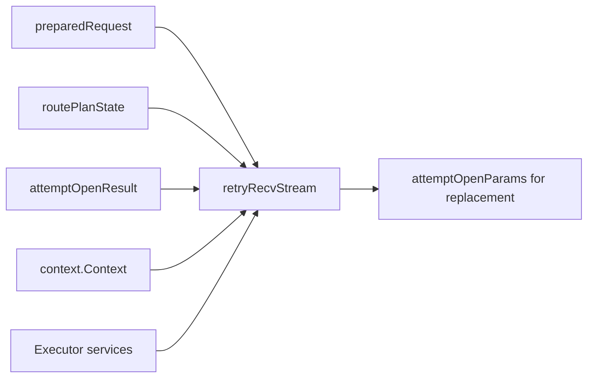
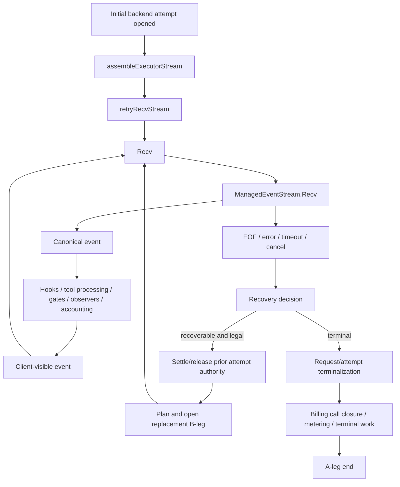
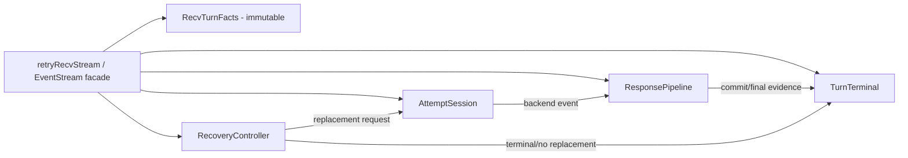

# Research and Architecture Assessment

## Executive Conclusion

The current `runtime.Executor.Execute` is no longer the primary runtime architecture problem. Earlier executor refactors correctly reduced `Execute` to a compact orchestration shell and moved route planning, attempt opening, and stream assembly behind named collaborators. The remaining high-ROI problem is downstream of the initial backend open: the logical request becomes a long-lived `retryRecvStream` whose direct state and receiver methods collectively own routing recovery, current B-leg resources, authority settlement, billing closure, metering, secure-session recording, response transformation, tool finalization, prompt-cache observation, interleaved-thinking continuity, final observers, client evidence, and request/attempt terminalization.

This is a **distributed God object** rather than a single giant source file. The implementation has already been split across many files, so another file-level extraction would not materially simplify the architecture. The simplification target must be ownership and state topology.

This specification is architecture simplification tranche 1. It starts at `assembleExecutorStream` after an initial attempt is opened and ends when the logical request/A-leg is terminal. The chronologically following `request-attempt-pipeline-state-simplification` specification addresses the upstream `preparedRequest` / `routePlanState` / `attemptOpenParams` / candidate-open pipeline after this spec establishes a cleaner downstream ownership boundary.

Baseline reviewed: `main` at `c3b5c872e6e48b6b9c86ea3570530b4fb094767c`.

## Why This Is Not an Executor Refactor

Historical executor work has already achieved the correct top-level shape:

```text
Execute
  -> prepareRequest
  -> checkCheapCredit
  -> buildRoutePlan
  -> authorizeBillingOnce
  -> openInitial
  -> assemble stream
```

That flow is appropriately orchestration-oriented. The problem appears when the assembler constructs the returned event stream. `executor_assemble_stream.go` manually copies state from:

- `preparedRequest`;
- `routePlanState`;
- `attemptOpenResult`;
- the request `context.Context`;
- `Executor` services/configuration;
- the just-opened backend stream.

Those facts are reconstituted as one long-lived mutable `retryRecvStream`. During recv-phase failover, `tryReplacementIteration` then reconstructs a large `attemptOpenParams` again from fields stored on that stream. The architecture therefore contains a state fan-out followed by a state fan-in:



The issue is not that these values exist. The issue is that unrelated lifetimes and invariants are flattened into the same mutable owner.

## Current Hot-Path Control Flow

The receive path is effectively a transaction coordinator with streaming behavior:



This control flow is legitimate. The architectural debt is that `retryRecvStream` is simultaneously the event-stream adapter **and** the database for all state needed by each branch.

## Current Direct Ownership Clusters

The `retryRecvStream` struct currently contains state from at least the following independent clusters.

### 1. Client response accumulation

- `seenEvents`;
- `visibleText`;
- customer evidence accumulator;
- usage evidence dedupe;
- gate drains and recovery drains.

### 2. Backend attempt resources

- active inner `ManagedEventStream`;
- current B-leg record;
- current routing candidate;
- attempt authority lifecycle;
- prompt-cache source/controller;
- per-B-leg tool-call assembler;
- attempt-local accounting.

### 3. Retry and routing recovery

- selector;
- request-size estimate;
- session routing state;
- excluded candidates;
- RNG;
- attempt budget;
- TTFT budget;
- last negotiation/transport/admission failures;
- context-limit exhaustion flag;
- transform exclusions;
- affinity key/state;
- last parallel failure;
- interleaved cycle/memo state and retry suppression flags.

### 4. Request identity and pinned views

- trace/A-leg identity;
- baseline request;
- recv `execctx.Views`;
- route preferences;
- model-registry/catalog bound views;
- native model resolver;
- model-view identity;
- cached derived request context.

### 5. Usage, authority, and accounting

- metering request holder;
- request-authority state;
- current attempt authority;
- operator/client usage evidence;
- token-accounting completion state;
- accounting tracker.

### 6. Billing

- billing account ID;
- customer pricing version;
- charge-policy version;
- BillingCallID;
- request-scoped billing call state;
- per-B-leg dedupe state;
- billing call closure state.

### 7. Security/session recording

- secure-session turn identity;
- mandatory recorder hard-stop state;
- secure-session recording integration.

### 8. Response policy and extension execution

- hook bus;
- completion-gate buffers;
- final-stream observation session;
- tool event classification;
- compaction observation;
- traffic and usage observer paths.

### 9. Terminal ownership and concurrency

- committed/finished atomics;
- request and attempt terminal owners;
- terminal mutex;
- A-leg scope/end-once;
- inner-stream mutex;
- events mutex;
- usage mutex;
- context-cache mutex;
- billing leg and billing closure mutexes;
- affinity and keep-warm once guards.

The fact that these fields are spread across receiver files does not change their ownership topology. A change in billing, recovery, tool streaming, secure recording, or terminal semantics can still require understanding and mutating the same central object.

## Receiver Surface Is the More Important Metric Than File Length

A repository search for `retryRecvStream` reaches, among others:

- `executor_retry_stream.go`;
- `executor_recv_loop.go`;
- `executor_recv_handlers.go`;
- `stream_terminal.go`;
- `executor_settlement.go`;
- `billing_call_closure.go`;
- `billing_leg.go`;
- `metering_egress.go`;
- `secure_session_stream_record.go`;
- `operator_usage_evidence.go`;
- `tool_event_classification.go`;
- `executor_final_stream_obs.go`;
- `executor_compaction.go`;
- `keepwarm_integration.go`;
- `interleaved_stream.go`;
- `interleaved_open.go`.

This is the principal evidence that another mechanical file split is the wrong remedy. The desired outcome is fewer reasons for one owner to change and fewer cross-domain receiver methods.

## Terminal State Is Already Partially Extracted but Not Yet Owned Independently

`streamTerminal` is a useful existing abstraction: it wraps a domain terminal owner with once-only effects, CAS competition, cleanup context handling, and completion publication. However, the request/attempt terminal wrappers are stored on `retryRecvStream`, and terminal effects still call back into stream-owned billing, accumulator, authority, and lifecycle state.

That means the **terminal algorithm** has been extracted, but the **terminal business state** remains flattened into the stream.

The target should preserve the proven `terminal.Owner` state machine while moving the business facts/effects required for logical-turn closure behind one explicit terminal owner.

## Retry Replacement Exposes the State-Flattening Problem

`tryReplacementIteration` demonstrates the architecture debt especially clearly. Before opening the replacement it must coordinate:

1. context/A-leg cancellation;
2. output-commit and mandatory secure recording policy;
3. prior attempt authority release;
4. attempt terminal reset;
5. failover requirements;
6. selector/session/exclusion state;
7. request size and affinity;
8. retry and TTFT budgets;
9. prior rejection diagnostics;
10. interleaved-thinking cycle and memo semantics;
11. billing call identity/state;
12. construction of a new backend attempt.

It does so by reading those facts directly from `retryRecvStream` and rebuilding `attemptOpenParams`. This is strong evidence that the current stream object is acting as a generalized turn state bag rather than an EventStream adapter.

## Concurrency Model That Must Be Preserved

The current concurrency contract is subtle and valuable:

- one goroutine owns `Recv`; concurrent multiple-Recv is not supported;
- `Close` may race a `Recv` blocked on the active inner stream;
- `Close` must be able to cancel/close the active inner stream;
- terminal ownership is competitive and exactly-once;
- request and attempt terminal scopes are distinct;
- a replacement attempt can replace attempt-terminal ownership while an already-snapshotted caller retains the prior owner;
- sideband usage evidence can arrive before, during, or after a backend `Recv` call;
- A-leg cancellation may race backend error/EOF;
- output commitment changes which recovery and terminal transitions are legal.

A simplification that merely moves locks into more structs can make this worse. The design must give each mutable state cluster one synchronization owner and define lock ordering so collaborators do not share one giant mutex or take each other's locks recursively.

## Semantic Invariants That Cannot Regress

### EventStream and output commitment

- returned stream behavior and error vocabulary remain compatible;
- canonical event order remains unchanged;
- first client-visible output establishes commitment exactly once;
- pre-commit and post-commit failures retain their current different recovery rules;
- `Close`, cancellation, timeout, EOF, and partial-error paths retain exactly-once terminal behavior.

### A-leg/B-leg lifecycle

- every backend attempt remains one B-leg;
- swallowed/replaced attempts settle/release their own authority before replacement admission where current semantics require it;
- the logical A-leg ends once, except where interleaved outer coordination intentionally holds it;
- parallel/hidden thinker wrappers retain their current ownership contracts.

### Usage and billing

- operator/provider-billable evidence remains distinct from client-visible reconstructed usage;
- sideband usage cannot be dropped by EOF/error/cancellation;
- one LUR is recorded per B-leg;
- one billing-call closure occurs per incoming BillingCallID;
- request and attempt authority settlement/release remains exactly once;
- prepaid/postpaid safety and terminal durable-work semantics from recent billing convergence are unchanged.

### Security and recording

- secure-session identity remains proxy-authoritative;
- mandatory recorder failures preserve current fail-closed behavior;
- a mandatory recorder failure after committed output cannot illegally open a replacement B-leg;
- request-scoped secure turn facts remain available even when `Recv` receives a bare frontend context.

### Model and routing view pinning

- a request continues using bound registry/catalog/native-model views after generation refresh;
- recv-phase failover cannot fall back to a live mutable catalog merely because the caller passes a bare context;
- route candidate preferences and affinity behavior remain unchanged.

### Response processing

- completion-gate buffering/draining semantics remain unchanged;
- tool-call finalization/classification stays deterministic and bounded;
- compaction observations, final stream observers, traffic observations, prompt-cache observations, and interleaved-thinking events retain their current order and failure policy.

## Target Ownership Model

The target is a small EventStream façade delegating to cohesive private concrete owners. Names are design-level and may be adjusted during implementation, but responsibilities are normative.



### `RecvTurnFacts`

Immutable request-lifetime facts needed after stream assembly:

- trace and A-leg identity;
- immutable baseline call;
- pinned request/model views;
- route preferences;
- secure-session turn identity;
- metering/request-authority handles by stable owner reference;
- billing identity/call reference by stable owner reference.

It is **not** a universal mutable `TurnContext`. It must contain facts, not live retry/response/terminal state.

### `AttemptSession`

Owns state whose lifetime is exactly one current B-leg attempt:

- active backend `ManagedEventStream`;
- B-leg and candidate;
- attempt authority lifecycle;
- attempt terminal owner;
- attempt accounting;
- attempt-local tool assembler;
- attempt-local prompt-cache source/controller;
- attempt-local final observation pieces where applicable.

Replacement swaps one `AttemptSession` for another. Previous-attempt terminalization/cleanup happens through the old owner rather than by overwriting unrelated fields on the logical stream.

### `RecoveryController`

Owns mutable state needed to decide and prepare retry/failover:

- selector/session/exclusions;
- retry/TTFT budgets;
- request-size/affinity facts;
- prior rejection/admission diagnostics;
- context-limit and transform-exclusion state;
- interleaved retry/cycle state and replacement suppression flags;
- last parallel failure.

It asks the existing attempt-open seam for a replacement; tranche 1 does not redesign the upstream candidate-open algorithm.

### `ResponsePipeline`

Owns canonical backend-event to client-event processing state:

- customer-visible accumulation;
- internal usage dedupe;
- completion gate buffers/drains;
- recovery drain;
- tool event classification;
- finalization queues;
- response observers/compaction observations;
- secure recording of stream events where this is event-processing responsibility.

It does not decide routing, billing admission, or terminal authority ownership.

### `TurnTerminal`

Owns logical request closure and exactly-once terminal facts/effects:

- single output-commit authority;
- request terminal owner;
- request-authority terminalization;
- request-level metering finalization;
- billing call closure;
- B-leg accounting handoff coordination with the current attempt;
- A-leg finalization/end ownership;
- final finished state and terminal result publication.

Attempt terminalization remains with `AttemptSession`; `TurnTerminal` coordinates request-level closure and asks the current attempt to terminalize when a command covers both scopes.

## Why Attempt Terminal Ownership Must Not Be Centralized With Request Terminal Ownership

A first design sketch could place both request and attempt terminal owners inside `TurnTerminal`. Brownfield review rejects that as the final architecture because attempts are replaceable while the request terminal owner spans the full A-leg. Keeping attempt terminal ownership in the current attempt object matches the actual lifetime boundary and removes the need for `resetAttemptTerminal` on the logical stream.

The request-level terminal coordinator may compose request and current-attempt terminalization, but it must not own a replaceable attempt terminal as if it were request-lifetime state.

## Output Commitment Must Have One Authority

Today commitment appears as stream state and is also reflected into attempt authority and terminal decisions. The refactor must make one component authoritative. `TurnTerminal` is the natural owner because commitment constrains future terminal/replacement legality across attempts.

Other components may query commitment or receive a one-way `MarkCommitted` result, but they must not maintain independent booleans whose consistency depends on call order.

## Context Use After Refactor

`context.Context` remains necessary for:

- cancellation/deadlines;
- tracing/diagnostics;
- SDK extension invocation compatibility;
- scoped principal/session/view propagation;
- detached bounded terminal work.

This specification does **not** attempt to remove `execctx` or rewrite public hook APIs.

However, request-lifetime business ownership must not depend on recovering facts from whichever context the caller happens to pass to `Recv`. `RecvTurnFacts` and explicit owners remain authoritative; a derived recv context may mirror those facts outward for existing APIs.

## Dependency on Executor

The final EventStream façade should not retain a broad `*Executor` merely to reach unrelated runtime services. Tranche 1 may use a temporary narrow adapter around the existing replacement-open seam during migration, but the final shape must inject only the operations each owner needs.

The following spec, `request-attempt-pipeline-state-simplification`, is responsible for replacing the remaining broad attempt-open parameter/state shape. This spec must not pre-build a generic service locator in anticipation of that work.

## Alternatives Considered

### A. Keep the current object and split more files

Rejected. The receiver surface is already split across many files. This changes navigation, not ownership or reasons to change.

### B. Rename `retryRecvStream` to `TurnContext` and keep all fields

Rejected. This preserves the God object while hiding it behind a more general name.

### C. Introduce a generic event-driven state machine/framework

Rejected. The runtime already has concrete protocol/domain state machines where useful. A generic transition DSL/event bus would add indirection and make debugging harder.

### D. Convert every collaborator to an interface

Rejected. Most collaborators are private implementation details with no substitution requirement. Prefer package-private concrete types; introduce narrow interfaces only at existing external seams or where tests require a real port.

### E. Put all state in `context.Context`

Rejected. Context is propagation, cancellation, and compatibility infrastructure, not a mutable transaction store.

### F. Make one giant `TurnSession` own the extracted collaborators and all their fields

Rejected if it merely reproduces the current flattened state. A small composition object may hold collaborator pointers, but each collaborator must own its own invariants and synchronization.

### G. Rewrite billing, usage authority, secure session, routing, or interleaved thinking simultaneously

Rejected. Those are established authorities and recent convergence work. This spec changes who owns their integration state, not their domain semantics.

## Brownfield Migration Strategy

The safest migration is responsibility-by-responsibility with characterization tests before state moves.

1. Freeze current Recv/Close/replacement/terminal behavior and build an ownership matrix.
2. Introduce immutable `RecvTurnFacts` and current `AttemptSession` while keeping adapter methods temporarily.
3. Move request terminal/commit state into `TurnTerminal`; preserve existing `streamTerminal` semantics.
4. Move retry/failover mutable state into `RecoveryController` without changing planner/open behavior.
5. Move event/gate/tool/client accumulation state into `ResponsePipeline`.
6. Convert `retryRecvStream` to a small EventStream façade and delete old forwarding/state fields.
7. Remove temporary migration adapters and broad `Executor` reachability.
8. Run race/parity/simplification gates and compare the final ownership/coupling inventory to baseline.

At every phase the repository should compile and targeted behavior should remain green. The implementation should prefer deleting old state/methods in the same change that introduces the new owner rather than maintaining long-lived dual-write state.

## Simplification Success Criteria

Success is not measured primarily by one file's length. The implementation must demonstrate all of the following:

1. `retryRecvStream` no longer directly owns routing, billing, authority, metering, secure-session, interleaved, tool, prompt-cache, and terminal mutable state as independent fields.
2. The EventStream façade no longer has broad `*Executor` reachability in its final state.
3. Each mutable state cluster has exactly one owner and one synchronization boundary.
4. Attempt replacement swaps one attempt owner instead of resetting scattered attempt fields.
5. Output commitment has one request-lifetime authority.
6. Request and attempt terminal ownership match their lifetimes.
7. Receiver methods specific to billing, settlement, secure recording, tool classification, recovery, and observation move to their cohesive owners rather than remaining methods on the stream façade.
8. The affected production runtime surface has a net deletion of state-handoff/forwarding code; a larger final production surface requires explicit design-review justification and is a default NO-GO.
9. No generic container, stage engine, service locator, reflection-based dispatcher, or universal mutable turn bag is introduced.
10. Existing behavior, race, parity, billing, secure-session, accounting, interleaved, and protocol suites remain green.

## Deferred Work

The following are intentionally outside this spec:

- simplification of `preparedRequest`, `routePlanState`, and `attemptOpenParams`;
- decomposition of `prepareSubmitAndALegSecure`;
- candidate admission/open phase separation;
- routing selector grammar normalization/sticky traversal convergence;
- generation feature-surface projection cleanup;
- OpenResponses protocol state-machine redesign;
- billing domain redesign;
- public SDK/ABI changes.

The first three are handled by the chronologically following `request-attempt-pipeline-state-simplification` specification. The remaining items should be separately justified if pursued.

## Research Verdict

**Proceed with a dedicated spec.** The receive/terminal transaction is currently the strongest architecture-simplification candidate in the repository because it combines high change fan-in, many independent mutable lifetimes, concurrency-sensitive terminal behavior, and repeated cross-domain receiver methods. A well-bounded ownership decomposition can materially reduce future change blast radius without changing public behavior or inventing a new framework.
