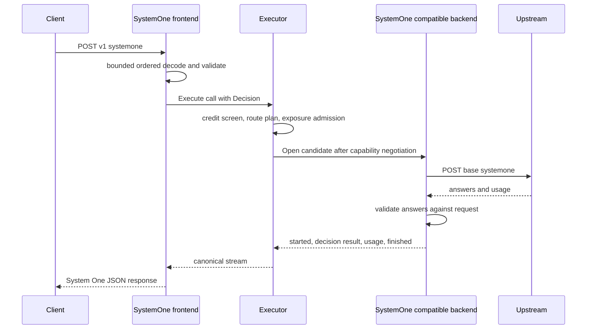

# Design Document

## Overview
This slice makes AIProxer a drop-in `POST /v1/systemone` endpoint for TypeSafe System One clients. A new frontend decodes the request into a typed canonical decision carried on `lipapi.Call`; the existing executor routes, admits, opens, fails over and terminalizes it exactly as it does inference; a new `systemone-compatible` backend family answers with one fixed canonical event stream. TypeSafe, OpenRouter and Command Code are catalog profiles of that family; self-hosted servers use a custom instance.

When nothing decision-capable is configured, capability negotiation rejects the call before any upstream I/O and other traffic is untouched. Anything the slice cannot represent faithfully is rejected, never approximated.

### Goals
- System One request/response parity for `noul`, `choice` and `score`, multiple questions, and string/object/array evidence (1.1–1.5, 2.1–2.4).
- Decision routing, failover, usage and billing through the existing execution path, with no second executor (3.1–3.5, 4.1–4.4).
- Done when a TypeSafe SDK client, pointed at AIProxer, receives validated answers through each catalog profile and a stub-served custom instance, with one billing call per request when billing is enabled.

### Non-Goals
All items in the requirements `Deferred` list: OpenAI Decisions, refusals and boolean values, images/Clef, Databricks, TypeSafe-shaped discovery, per-profile limits and certified self-hosted profiles, secret-guard coverage of decision evidence, connector ABI, wire fast path, batch, streaming, extension fields, per-question tariffs.

## Boundary Commitments

### This Spec Owns
- The canonical decision contract in `pkg/lipapi`: request, result, validation, operation, capability, result event, reject error.
- The `systemone` frontend: wire decode/encode and System One error envelopes.
- The `systemone-compatible` backend family: upstream wire, answer validation, error classification, usage and cost events, and three catalog profiles.
- Three narrow core touchpoints: quote sizing for decision calls, fail-closed secret-guard handling, and refusing decision calls at the executable-connector bridge.

### Out of Boundary
- Routing, failover, output commitment, B2BUA lineage, billing admission and terminal usage ownership (reused unchanged).
- Session classification and its Jev client (`internal/standardplugins/featurehost/sessionclassification`), which stays isolated and is not imported.
- Chat frontends, chat backends, `GET /v1/models`, and executable connectors (beyond the refusal guard).

### Allowed Dependencies
- Frontend: `internal/plugins/frontends/frontendpipe`, `execerr`, `routeselect`, `internal/core/jsonshape`, `pkg/lipapi`, `pkg/lipsdk`, `internal/stdhttp/contract`.
- Backend: `internal/plugins/backends/compatmode`, `internal/core/execbackend`, `internal/core/routing`, `pkg/lipapi`, stdlib `net/http` and `encoding/json`.
- The frontend and backend never import each other; they share only `pkg/lipapi`.

### Revalidation Triggers
- Any change to `lipapi.Call` authority rules, `RequiredCapabilities`, `OutputCommitted` or `ValidateEventSequence`.
- A new feature transform or guard that rewrites call content (decision calls fail closed after transforms).
- Adding a second decision frontend or giving connectors decision support.

## Architecture

### Seams Reused
- **Operation + capability + fixed event stream** (the `context.compaction` precedent in `openresponsescompat/compact.go`): new operation `decision.evaluate`, capability `decisions`, backend returns `lipapi.NewFixedEventStream`.
- **`frontendpipe.Spec`**: authentication, decode admission, body limit, model-to-route selection, `Execute`, error classification hook.
- **Provider-profile families**: `FamilyBinding`, `familyCapabilities`, `profileFamilyBuilders`, `wrapCompatibleLifecycle`, `compatmode` env keys and static inventory.
- **Usage evidence**: `EventUsageDelta` with `UsagePresence`, `CostNanoUnits`, `Currency`, `CostSource`, `CostPresent`.
- **Billing**: existing credit screen, exposure admission and terminal usage; only the size estimator learns decision bytes.
- **New seams**: `lipapi.DecisionRequest`/`DecisionResult` and `EventDecisionResult` (needed by 1.1, 2.1; no existing carrier is typed for distributions). No new SDK interface, extension stage, plane, store or execution class.

### Project Boundary Questions (Go LIP)
- Core-owned or plugin-owned? Wire handling is plugin-owned; core gains no decision logic beyond the three touchpoints.
- New canonical concept? Yes: typed decision request and result are cross-protocol semantics (System One now, OpenAI Decisions later).
- Streaming-first path preserved? Yes: the response is a collection over a four-event canonical stream; no separate executor.
- Provider SDK leakage avoided? Yes: System One wire types live only in `systemone` and `systemonecompat`.
- No retry/failover after first client-visible output? `EventDecisionResult` commits output; all invalid-answer checks run before it is emitted.
- Secure-session, diagnostics or startup-security posture affected? Secret guard: decision calls are denied while guards are active. No other change.

### Flow

Pre-output failures (upstream 401, 402, 403, 404, 429, 5xx, 524, 529, timeouts, transport and invalid answers) are returned as `lipapi.RecoverablePreOutputError`, so the executor tries the next candidate. Upstream 400, 413 and 422 return a terminal `DecisionRejectError`. Context cancellation is never retried.

## File Structure Plan

### New Files
- `pkg/lipapi/decision.go` — decision request/question/option/level types, `Validate`, result/answer types, `ValidateResult(req)`, `DecisionRejectError`.
- `internal/plugins/frontends/systemone/doc.go` — package doc and `ID = "systemone"`.
- `internal/plugins/frontends/systemone/routes.go` — route claim `POST /v1/systemone`.
- `internal/plugins/frontends/systemone/config.go` — plugin config (`max_questions`, default 256).
- `internal/plugins/frontends/systemone/mount.go` — `Mount` building the handler from `FrontendMountOptions`.
- `internal/plugins/frontends/systemone/handler.go` — `frontendpipe.Spec` wiring and `ClassifyExecute` override.
- `internal/plugins/frontends/systemone/decode.go` — bounded, order-preserving decode of the System One request into `lipapi.Call`.
- `internal/plugins/frontends/systemone/encode.go` — collects the canonical stream and writes the System One response.
- `internal/plugins/frontends/systemone/errors.go` — `WireErrors` implementation: 422 `{"detail":[{"loc","msg","type"}]}`, other statuses `{"detail":"<message>"}`.
- `internal/plugins/backends/systemonecompat/backend.go` — `BuildCompatible`, `LifecycleSystemOneCompatible`, `Backend` with `decisions` capability and `Open`.
- `internal/plugins/backends/systemonecompat/wire.go` — upstream request body, response parsing, conversion to canonical events.
- `internal/plugins/backends/systemonecompat/errors.go` — HTTP status classification and bounded upstream 422 detail mapping.
- `config/examples/custom-systemone-compatible.yaml` — frontend plus TypeSafe profile and a custom instance.

### Modified Files
- `pkg/lipapi/call.go` — `Call.Decision *DecisionRequest`; `Validate` makes decision authority exclusive with messages, instructions, items, previous response ID, tools and tool choice, and validates the decision. `Validate` does not inspect `Invocation` (it is not serialized and some bridges rebuild it).
- `pkg/lipapi/call_clone.go` — deep copy of `Decision`.
- `pkg/lipapi/invocation.go` — `OperationDecisionEvaluate = "decision.evaluate"`.
- `pkg/lipapi/capabilities.go` — `CapabilityDecisions`; `RequiredCapabilities` adds it when `Decision != nil`.
- `pkg/lipapi/events.go` — `EventDecisionResult`, `Event.Decision *DecisionResult`, sequence validation (after `response_started`, no `message_started` required, at most once).
- `pkg/lipapi/output_commit.go` — `EventDecisionResult` commits output.
- `internal/core/modelcatalog/estimate.go` — size estimate adds decision evidence, instruction and criteria bytes.
- `internal/core/runtime/executor_secret_guard.go` — when guards are configured and `call.Decision != nil`, return `lipapi.NewPolicyDeniedError` before evaluating guards.
- `internal/infra/backendplugins/adapter/invocation.go` — `InvocationFromCall` rejects a decision call with a capability reject.
- `internal/providerprofiles/schema.go` — `FamilySystemOne = "systemone-compatible"`, family capabilities `{decisions}`, validation requiring `discovery: static` for the family.
- `internal/providerprofiles/compiler.go` — `FamilyBinding` → factory kind `custom-systemone-compatible`.
- `internal/providerprofiles/catalog.json` — profiles `typesafe`, `openrouter-systemone`, `commandcode-systemone`.
- `internal/standardplugins/provider_profile_binding.go` — `profileFamilyBuilders` entry for the family.
- `internal/standardplugins/standard_contributions.go` — `CustomSystemOneCompatibleID` backend row and `systemone` frontend row.
- `internal/standardplugins/frontend_route_claims.go` — `systemOneFrontendRouteClaims`.

## Components and Interfaces

| Component | Package | Intent | Requirements |
|-----------|---------|--------|--------------|
| DecisionContract | `pkg/lipapi` | Typed request/result, invariants, operation, capability, event, reject error | 1.2, 1.3, 2.1, 2.2, 2.3, 3.1, 3.5 |
| SystemOneFrontend | `internal/plugins/frontends/systemone` | Wire decode/encode, limits, error envelopes, header isolation | 1.1–1.5, 2.3, 2.4, 3.3, 5.3 |
| SystemOneBackend | `internal/plugins/backends/systemonecompat` | Upstream wire, answer validation, failover classification, usage and cost | 1.1, 2.2, 2.4, 3.2, 3.3, 4.1, 4.2, 5.2, 5.3 |
| SystemOneProfiles | `internal/providerprofiles`, `internal/standardplugins` | Family, catalog profiles, registration | 3.1, 3.4, 3.5 |
| CoreTouchpoints | `internal/core/modelcatalog`, `internal/core/runtime`, `internal/infra/backendplugins/adapter` | Quote sizing, secret-guard fail-closed, connector refusal | 3.1, 4.3, 4.4, 5.1 |

#### DecisionContract
```go
type DecisionKind string // "noul" | "choice" | "score"

type DecisionRequest struct {
	Evidence  json.RawMessage    // original JSON value: string, object or array
	Questions []DecisionQuestion // client order
}

type DecisionQuestion struct {
	ID           string          // required for System One; unique
	Kind         DecisionKind
	Instructions json.RawMessage // string, object or array
	TrueCriteria, FalseCriteria json.RawMessage // noul only, optional
	Options      []DecisionOption // choice: 1..255, client order
	Levels       []json.RawMessage // score: 2..10 descriptions, low to high
}

type DecisionOption struct {
	Name        string
	Description json.RawMessage // nil means JSON null
}

type DecisionResult struct {
	Model   string           // upstream-resolved model
	Answers []DecisionAnswer // aligned with request question order
}

type DecisionAnswer struct {
	QuestionID    string
	Kind          DecisionKind
	PTrue         float64            // noul
	Selected      string             // choice
	Probabilities []float64          // choice: per option; score: per level; request order
	Expected      float64            // score, zero-based
	Confidence    *float64           // nil when the upstream reported none
}

func (r DecisionRequest) Validate() error
func (r DecisionResult) ValidateFor(req DecisionRequest) error

type DecisionRejectError struct{ Field, Message string }
func IsDecisionReject(err error) bool
```
- `Validate` enforces kinds, unique non-empty IDs, option and level bounds, unique option names, valid JSON values, and byte bounds via `validateEnvelopeSizes`.
- `ValidateFor` enforces one answer per question, finite values, `PTrue` and probabilities in [0,1], sums within 1e-6·n of 1, `Selected` naming a maximal-probability option, `Expected` within [0, levels−1], and `Confidence` within [0,1] when present (2.1, 2.2). The legend is derived from the request's level order when encoding, never from the upstream.
- No answer field exists for refusals, OpenAI booleans or vendor extensions; adding them is a deferred, versioned extension of this type.

#### SystemOneFrontend
- Decode uses `jsonshape.Preflight` (depth 64, duplicate keys rejected, no trailing data) and then a token decoder for `questions` and choice `criteria` so order is preserved (1.2, 1.3). Unknown top-level or per-question fields reject with 422 naming the field. `model` is required and feeds the existing body-model route selection.
- The call carries only `Decision`, `Invocation{Operation: OperationDecisionEvaluate, DeliveryMode: NonStreaming}` and route intent; no client header is copied into the call (5.3).
- Encode reads the stream to `response_finished`, takes the single `EventDecisionResult` and the summed usage, and writes `{model, answers, usage}`: noul `{type, noul}`; choice `{type, choice, probabilities, confidence?}`; score `{type, score, legend, probabilities, confidence?}` with zero-based string keys (2.1, 2.3, 2.4).
- `ClassifyExecute` override: `IsDecisionReject` → 422 `detail[]`; otherwise `execerr.ClassifyExecute` status with `{"detail": message}` (3.1, 3.3, 5.1).

#### SystemOneBackend
- Config is `compatmode.CompatibleModeConfig` (base URL, `api_key_env_var_root`, static models). Transport capabilities declare non-streaming only; `EnforcesMaxOutputTokens` stays false because the System One wire has no output limit. `Open` rejects any operation other than `decision.evaluate` or a streaming transport, then posts `{model: <candidate native model>, state, questions}` to `<base_url>/systemone` with only `Authorization`, `Content-Type` and profile safe headers (5.3). The response body is capped at 1 MiB.
- Parsing ignores unknown upstream fields (`id`, `provider`, Laya extras) and drops them (2.4); converts answers to request order; calls `ValidateFor`; failures are recoverable pre-output errors (2.2, 3.2).
- Events: `response_started`, `decision_result`, `usage_delta` (input/output tokens with `UsagePresence`; `usage.cost` → `CostNanoUnits`, `Currency "USD"`, `CostSource "provider_reported"`, `CostPresent`) (4.1, 4.2), `response_finished`.
- Logs carry backend, model, status and error category only (5.2).

#### SystemOneProfiles
- Catalog: `typesafe` (`https://api.typesafe.ai/v1`, `TYPESAFE_API_KEY`, models `jev-latest`, `jev-preview`, `jev-1.13.0`), `openrouter-systemone` (`https://openrouter.ai/api/v1`, `OPENROUTER_API_KEY`, `typesafe/jev-1.13`, `~typesafe/jev-latest`), `commandcode-systemone` (`https://api.commandcode.ai/provider/v1`, `CMD_API_KEY`, `typesafe/jev`). All `bearer_env`, `discovery: static`, namespace `preserve` (3.4).
- The `custom-systemone-compatible` kind exposes only `decisions`; chat calls to it fail negotiation, and chat backends never declare `decisions` (3.1, 3.5).

## Error Handling
- Client input errors: 422 before `Execute` (1.3); limit breaches: protocol-legal 413/422 before `Execute` (1.4); auth: existing pipeline outcome (1.5).
- No eligible candidate: capability reject from negotiation, rendered `{"detail": ...}` (3.1).
- Secret guard active: policy denied, 403 (5.1). Upstream rejection: 422 with bounded `loc`/`msg`/`type` only; upstream `input`/`ctx` echoes are dropped (3.3, 5.2).
- Exhausted candidates: last classified error via `execerr` status; no partial response.
- Authority output-token clamp: decision backends cannot represent `MaxOutputTokens`, so the existing fail-closed rule excludes them when a spend-cap clamp applies, and the client gets the explicit exclusion error. Clamp semantics for output-free decision tariffs are deferred.

## Testing Strategy
- Table tests (`pkg/lipapi`): `Validate` and `ValidateFor` cases from 1.3 and 2.2 — duplicate IDs, 0/256 options, 1/11 levels, NaN, bad sums, missing/extra answers, wrong selected option, confidence absent vs present; authority exclusivity in `Call.Validate`; `RequiredCapabilities`; `OutputCommitted`; sequence validation.
- Frontend tests: golden System One request/response fixtures from the TypeSafe docs (string, object, array state; all three types; swapped option order preserved); unknown-field and limit rejections; error envelopes; no client headers on the call.
- Backend tests (`httptest`): request body shape and headers; response parsing incl. OpenRouter extras and `usage.cost`; status classification table (401…529, 422 terminal); invalid answers recoverable; cancellation.
- Integration: one runtime test through `runtimebundle` with two stub upstreams — first returns 529, second answers — asserting one client response, two B-legs and one billing call; plus a secret-guard-active rejection and a chat call to the decision backend rejected before upstream.
- Existing generic architecture rules extended: profile catalog inventory tests gain the three profiles; no new archtest rule.

## Configuration
Frontend `systemone` is disabled unless listed in `plugins.frontends`; config `max_questions` (default 256). Backend kind `custom-systemone-compatible` takes the standard compatible-mode subtree or a provider-profile reference; it is inert unless configured.
