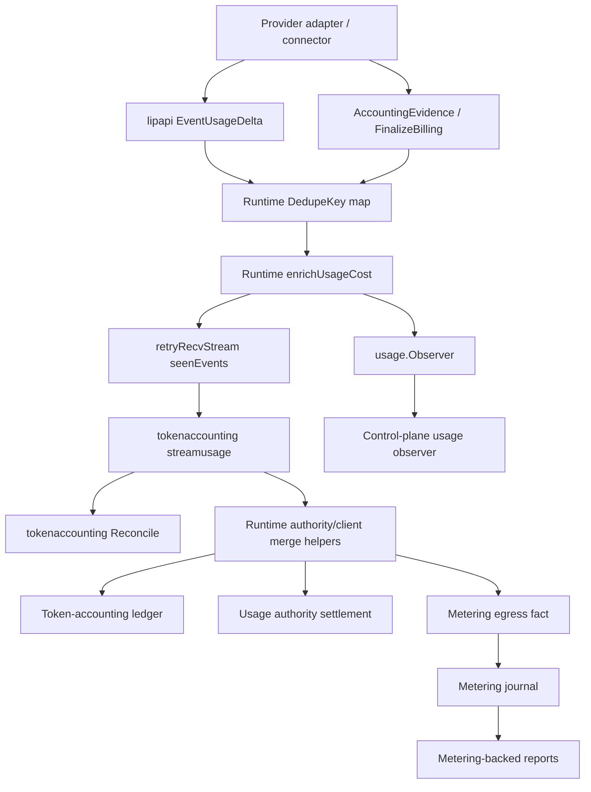
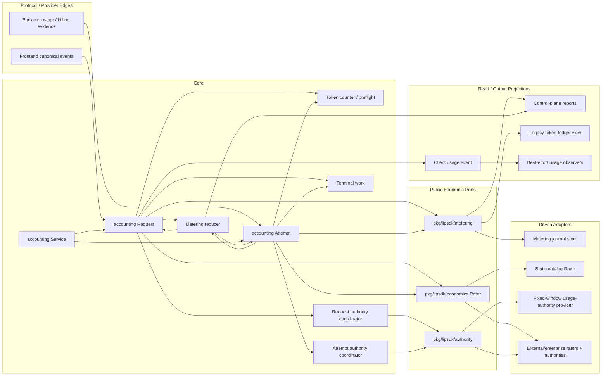
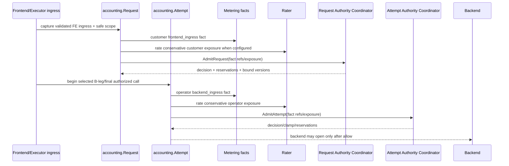
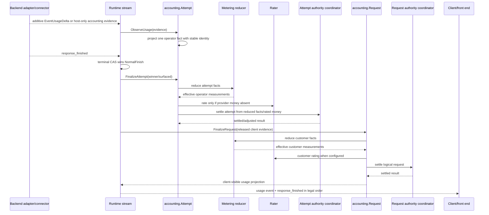
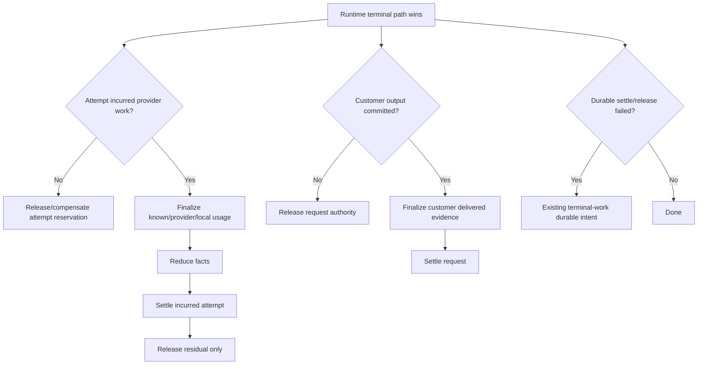
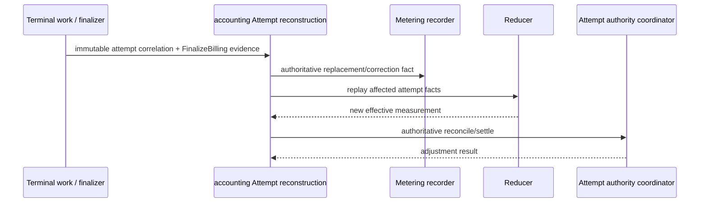
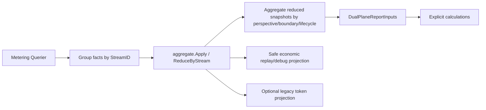
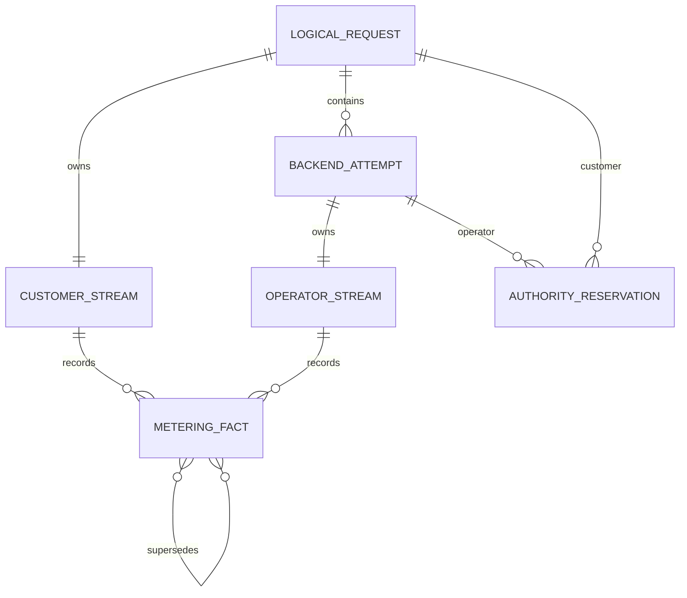

# Design Document

## Overview
This design converges Go-LIP technical usage accounting onto the architecture already implied by its dual-plane work: **metering facts are evidence, one reducer owns fact semantics, rating turns reduced quantities into money, authority owns reservation/settlement decisions, and runtime only coordinates execution/terminal timing**. It removes migration-era paths that currently re-deduplicate, re-aggregate, re-price, re-persist, and re-project the same usage in multiple packages.

The design is deliberately smaller than a billing-platform rewrite. It introduces one focused internal application owner (`internal/core/accounting`) with concrete request and attempt lifecycle objects, reuses the existing `metering`, `economics`, `authority`, token-counting, and terminal-work contracts, and turns control-plane/token-ledger outputs into read projections. No generic event bus, CQRS framework, financial ledger, DI container, or new public “economic statement” model is introduced.

The expected result is a directional pipeline whose correctness can be replayed from fact identity and whose architecture can be machine-checked. Provider-specific usage parsing remains at backend edges; customer/operator measurement remains dual-plane; usage authority remains its own transactional bounded context; a future enterprise financial ledger remains outside this OSS technical-accounting domain.

### Goals
- Establish one directional economic data flow from canonical observations to facts, reduction, rating/authority, and projections.
- Move request/attempt economic lifecycle state and side effects out of `retryRecvStream`/runtime.
- Make `metering.Fact` identity/presence and `metering/aggregate` semantics authoritative for usage evidence.
- Use one `economics.Rater` path for static OSS pricing and injected/customer/operator pricing.
- Route built-in usage authority through the same request/attempt coordinators as external authorities.
- Correct report reconstruction so cumulative/replacement/correction facts cannot be double-counted.
- Make the legacy token ledger a derived compatibility view or delete it if consumer inventory permits.
- Improve diagnosability through stable fact/rating/reservation references and deterministic replay.
- Finish with fewer economic semantic owners and fewer non-test production lines than the baseline.

### Non-Goals
- Customer wallets, balances, credits/debits, invoices, payments, taxes, marketplace billing, or double-entry accounting.
- Proprietary customer pricebooks/provider agreements or enterprise commercial analytics.
- Replacing routing, B2BUA, secure sessions, canonical stream execution, terminal CAS, or terminal-work algorithms.
- Rewriting the usage-authority store or its fixed-window transactional model.
- Replacing `pkg/lipapi` as the canonical request/event protocol middle.
- Making durable metering mandatory for deployments that currently operate without it.
- Introducing a generic event-sourcing framework, generic workflow engine, event bus, DI container, or service locator.
- Widening `pkg/lipsdk/usage.Observer` into a second billing API.

## Boundary Commitments

### This Spec Owns
- technical usage evidence normalization and identity;
- metering fact reduction semantics;
- request/attempt accounting application lifecycle;
- rating invocation and provider-money precedence;
- usage-authority coordination from accounting lifecycle;
- customer/operator usage projection from reduced facts;
- metering-backed control-plane reporting;
- token-ledger compatibility/read-model migration;
- economic architecture tests, replay diagnostics, and deletion/shrinkage gates.

### This Spec Does Not Own
- frontend/provider wire schemas beyond usage normalization required to preserve canonical additive semantics;
- provider SDK parsing outside adapters;
- routing/failover winner selection;
- terminal winner selection/output-commit policy;
- authority store rule algorithms/window persistence;
- concurrency authority algorithms;
- financial accounting/commercial billing.

### Revalidation Triggers
- `lipapi.EventUsageDelta` semantics or usage presence changes;
- `metering.Fact` identity/kind/presence/version fields;
- request/attempt authority provider contracts;
- provider `FinalizeBilling` semantics;
- generation-bound rater/provider selection;
- terminal/cancellation ordering;
- control-plane economic queries;
- legacy token-ledger compatibility surface.

## Architecture

### Existing Architecture Analysis
The current architecture is a hybrid of the original token-accounting path and the newer dual-plane metering/economics path.

The architecture already has a better reducer (`metering/aggregate`) and better evidence identity (`metering.Fact`) than the older event/reconciliation path. The target therefore contracts onto those components instead of adding another model.

### Selected Pattern: Technical Accounting Application Service Over Existing Bounded Contexts

### Architectural Rules
1. **`lipapi.Event` is transport/canonical stream state, not the economic domain model.** Accounting consumes canonical events at one boundary and immediately projects usage into metering facts or content into request/attempt measurement state.
2. **`metering.Fact` is the technical economic evidence model.** No second durable usage event schema is introduced.
3. **`metering/aggregate` is the only aggregation/correction engine.** No caller implements its own cumulative/delta/replacement/dedupe rules.
4. **`internal/core/accounting` owns use-case sequencing, not persistence algorithms.** It composes counters, raters, authority coordinators, optional metering recorder, and terminal-work.
5. **Runtime retains terminal/execution ownership.** It decides which attempt/request terminal path wins and then invokes accounting finalization; accounting does not decide retry/failover.
6. **Usage authority remains separate.** It owns reservations/limits/atomic mutations, not raw usage evidence or reports.
7. **Read models are one-way.** Control-plane rows, client usage payloads, and legacy token rows never feed back into live accounting decisions.

### Optional Hexagonal Lens
- **Domain/policy:** metering fact validation/reduction, token measurement semantics, usage-authority rules, rating validation.
- **Application/use-case orchestration:** `internal/core/accounting` request/attempt lifecycle and existing authority coordinators/terminal-work sequencing.
- **Driving adapters:** runtime/frontend stream calls that notify accounting about ingress, canonical events, and terminals; admin/query HTTP surfaces.
- **Driven adapters:** metering journal stores, static rater, external raters/authorities, tokenizers/provider counters.
- **Composition root:** `internal/infra/runtimebundle` selects generation-bound raters/authorities and constructs accounting service dependencies.
- **Query seam:** metering querier -> reducer -> control-plane report/read projections.

### Project Boundary Questions
- **Core-owned or plugin-owned?** Cross-provider measurement/rating/authority orchestration is core-owned; provider parsing/cumulative normalization stays in adapters/connectors.
- **New canonical concept?** No new public canonical model. Existing metering facts/reducer are elevated; canonical stream usage semantics are clarified.
- **Streaming-first preserved?** Yes. Accounting observes the canonical stream; non-streaming still collects it.
- **Provider SDK leakage avoided?** Yes. Adapters/connector modules translate provider usage to canonical events/evidence; core only sees `lipapi`/`lipsdk` types.
- **No retry/failover after output preserved?** Yes. Runtime retains commit and terminal ownership; accounting has no routing method.
- **Secure session/startup security affected?** No semantic change; scope attribution remains the same safe snapshot on facts/authority inputs.
- **Extension platform affected?** Existing public Rater/Authority/Metering ports remain the extension seams; no new feature-plugin stage is needed.

### Technology Stack
| Layer | Choice | Role | Decision |
|---|---|---|---|
| Language | Go project toolchain | concrete lifecycles, pure reducer, explicit composition | no new dependency |
| Canonical transport | `pkg/lipapi` | request + event stream | keep |
| Technical evidence | `pkg/lipsdk/metering` | fact/quantity/money/recorder/query contract | keep, authoritative evidence |
| Reduction | `internal/core/metering/aggregate` | replay/cumulative/correction semantics | keep and enrich internally |
| Rating | `pkg/lipsdk/economics.Rater` | customer/operator quantity -> money | keep; static catalog becomes adapter |
| Authority | `pkg/lipsdk/authority` + coordinators | admission/settlement provider stack | keep |
| Fixed-window enforcement | `internal/core/usageauthority` | OSS quota/rate/budget store/service | keep |
| Persistence | existing metering/authority stores | durable technical evidence / enforcement state | keep separate |
| Terminal recovery | existing terminal/terminal-work | once-only terminal effects/retryable durable work | keep |

## Target Package Structure
```text
internal/core/
├── accounting/
│   ├── service.go          # concrete factory/orchestrator for Request/Attempt
│   ├── request.go          # customer logical-request lifecycle
│   ├── attempt.go          # operator backend-attempt lifecycle
│   ├── ingest.go           # canonical usage/evidence -> metering facts
│   ├── rating.go           # bound Rater invocation/provider-money precedence
│   └── projection.go       # reduced evidence -> authority/client-facing forms
├── metering/
│   └── aggregate/          # sole fact reducer
├── tokenaccounting/
│   ├── app/                # provider/local token counter service
│   └── preflight/          # measurement/admission preflight that remains useful
├── authoritycoord/         # request/attempt provider ordering & compensation
├── usageauthority/         # fixed-window domain/app unchanged except compat cleanup
└── runtime/                # execution/terminal ownership; accounting handles only

internal/infra/
├── economics/
│   └── staticrater/        # current catalog math behind economics.Rater
├── metering/               # existing durable journal adapters
└── usageauthority/         # existing fixed-window stores/adapters
```
This is a target ownership map, not a mandate to create every file. If existing focused files can host the responsibility cleanly, prefer fewer files.

## System Flows

### Logical Request + Attempt Admission

Runtime remains responsible for candidate selection and B-leg creation. Accounting sees the chosen immutable attempt identity/call at the existing pre-open boundary; it does not choose a route.

### Backend Usage + Normal Finish

The exact current synthesized-usage event ordering is preserved by characterization tests. Accounting returns a projection; runtime controls when that event enters the canonical output queue.

### Cancellation / Failure / Loser Flow

No accounting step is allowed to reopen routing after commitment.

### Late Authoritative Provider Correction

A live `retryRecvStream` object is not required for late correction.

### Reporting

The query layer may page/drain within current bounds, but fact-kind arithmetic is never reimplemented there.

## Components and Interfaces

### 1. Metering Reducer
| Field | Detail |
|---|---|
| Intent | Sole deterministic interpreter of metering fact streams |
| Requirements | 3, 4, 9, 11, 12 |
| Layer | domain policy |

**Responsibilities & Constraints**
- Validate stream consistency and Fact semantics.
- Replay by sequence/identity.
- Apply delta/cumulative/correction/authoritative replacement.
- Preserve present zero, currency and effective provenance.
- Return a pure reduced Snapshot; no I/O and no runtime imports.

**Target internal shape**
```go
type Snapshot struct {
    StreamID      string
    Perspective   metering.EconomicPerspective
    Boundary      metering.Boundary
    Lifecycle     metering.LifecycleScope
    Correlation   metering.Correlation
    Quantities    map[string]ReducedQuantity
    Money         ReducedMoney
    FactRefs      []metering.FactRef
    Superseded    map[string]struct{}
    Unavailable   []string
    LastSequence  int64
}

type ReducedQuantity struct {
    Value     int64
    Present   bool
    Source    metering.Source
    Authority metering.Authority
}
```
The exact provenance representation may be smaller if one stream guarantees invariant source/authority. The implementation should not create a generalized provenance graph.

**Contract**: pure function/state [x]
```go
func Apply(facts []metering.Fact) (Snapshot, error)
func ReduceByStream(facts []metering.Fact) ([]Snapshot, error)
```
`ReduceByStream` may be a query helper around `Apply`; it does not own persistence.

### 2. Accounting Service / Request / Attempt
| Field | Detail |
|---|---|
| Intent | One app-level owner for sequencing technical accounting effects |
| Requirements | 2, 3, 5, 6, 7, 8 |
| Layer | app orchestration |

The service is a concrete internal type. No broad public AccountingManager interface is introduced.

Conceptual constructor shape:
```go
type Dependencies struct {
    Counter           Counter
    MeteringRecorder  metering.Recorder // optional
    CustomerRater     economics.Rater    // optional
    OperatorRater     economics.Rater    // optional
    RequestAuthority  *authoritycoord.RequestCoordinator
    AttemptAuthority  *authoritycoord.AttemptCoordinator
    TerminalIntents   TerminalIntentSink // existing terminal-work adapter when needed
    Now               func() time.Time
}

func NewService(deps Dependencies) *Service
```
Interfaces should reuse existing contracts where possible; aliases/wrappers should not be created merely for names in this sketch.

#### Request
Owns one logical-request customer lifecycle.

Conceptual methods:
```go
func (s *Service) BeginRequest(ctx context.Context, in RequestInput) (*Request, error)
func (r *Request) BeginAttempt(ctx context.Context, in AttemptInput) (*Attempt, error)
func (r *Request) ObserveReleased(ev lipapi.Event)
func (r *Request) Finalize(ctx context.Context, outcome RequestOutcome) (ClientUsageProjection, error)
func (r *Request) Release(ctx context.Context, cause ReleaseCause) error
```

**State owned**
- immutable request correlation/scope/generation refs;
- customer FE ingress fact(s);
- released client content/measurement accumulator;
- customer fact buffer/refs;
- request authority decision/reservation handles;
- once-only finalization marker;
- bound customer rater/provider refs.

It does **not** own route state, backend candidates, stream queues or control-plane queries.

#### Attempt
Owns one B-leg/operator lifecycle.

Conceptual methods:
```go
func (a *Attempt) ObserveUsage(ctx context.Context, ev lipapi.Event) error
func (a *Attempt) ObserveAccountingEvidence(ctx context.Context, e AccountingEvidenceInput) error
func (a *Attempt) Finalize(ctx context.Context, outcome AttemptOutcome) (AttemptResult, error)
func (a *Attempt) ReconcileAuthoritative(ctx context.Context, e AccountingEvidenceInput) error
func (a *Attempt) Release(ctx context.Context, cause ReleaseCause) error
```

**State owned**
- immutable request/attempt/B-leg/backend/model/scope/generation refs;
- BE ingress fact(s);
- usage evidence sequence/identity bookkeeping;
- operator fact buffer/refs;
- provider/local finalization evidence;
- attempt authority decision/reservation handles;
- once-only terminal/finalization marker;
- bound operator rater/provider refs.

It does **not** own routing, transport cancellation or provider SDK types.

### 3. Usage Ingest Projector
| Field | Detail |
|---|---|
| Intent | Convert canonical/host accounting evidence once into metering facts |
| Requirements | 3, 5, 12 |
| Layer | core boundary translation |

Rules:

- Ordinary main-stream UsageDelta -> additive operator fact.
- DedupeKey -> stable source/fact identity when present.
- No key -> attempt-local monotonic identity; do not value-dedupe.
- Explicit UsagePresence -> present quantities including zero.
- Legacy unmarked usage -> compatibility behavior is characterized and made explicit; no new heuristic in downstream reducer.
- Provider CostPresent -> MoneyObservation present/source provider-reported.
- Host-only backend-plugin AccountingEvidence -> fact directly.
- FinalizeBilling complete evidence -> cumulative/replacement/correction fact tied to source identity.

No raw provider SDK type crosses this component.

### 4. Static Rater Adapter
| Field | Detail |
|---|---|
| Intent | Preserve OSS static catalog pricing behind existing Rater port |
| Requirements | 7, 13 |
| Layer | driven adapter |

Move or wrap the current catalog parsing/math so an infrastructure implementation satisfies `economics.Rater`. The adapter:

- accepts generic quantities;
- preserves cache/reasoning subcomponent pricing/inclusion;
- preserves optional zero rate semantics;
- uses checked arithmetic;
- binds catalog/rater version and currency;
- returns validated RatingResult.

No silent fallback occurs from a configured external rater to static catalog after a rating error.

### 5. Built-In Usage Authority Provider Adapters
| Field | Detail |
|---|---|
| Intent | Put fixed-window usage authority on the same coordinator path as external authorities |
| Requirements | 8 |
| Layer | adapter/app coordination |

The adapter converts generic request/attempt admissions/settlements to `usageauthority/app` calls and preserves:

- rule snapshot/version binding;
- multi-rule descriptor sets;
- selected amount basis;
- independent measurement authority by unit;
- failure posture/clamps;
- authoritative re-settlement;
- compensation/release behavior.

The usage-authority app/store remains unchanged except compatibility fields can later shrink after consumer inventory.

### 6. Runtime Integration
| Field | Detail |
|---|---|
| Intent | Make runtime call accounting without implementing economics |
| Requirements | 1, 2, 6, 14 |
| Layer | driving orchestration |

Target runtime responsibilities:

```text
prepare logical request
  -> begin accounting Request
choose candidate / freeze B-leg
  -> begin accounting Attempt
backend event
  -> attempt.ObserveUsage / request.ObserveReleased
terminal CAS wins
  -> attempt.Finalize / request.Finalize or Release
queue returned client usage projection at existing legal point
```

Target removals from runtime include economic usage dedupe maps, event-array usage merges, per-event catalog/rater enrichment, direct token-ledger writes, direct UsageAuthority lifecycle calls and duplicated customer economic state.

### 7. Reporting / Read Models
| Field | Detail |
|---|---|
| Intent | Build queries from reduced facts without affecting live accounting |
| Requirements | 9, 10, 11 |
| Layer | query seam |

The current control-plane metering querier remains the source. A query flow:

1. obtains bounded facts;
2. groups/reduces streams;
3. aggregates reduced snapshots into existing DualPlaneReportInputs;
4. performs only explicit cross-plane calculations;
5. reports completeness/legacy provenance.

The legacy usage observer remains usable for extension telemetry but is no longer a billing truth source.

### 8. Legacy Token Projection
| Field | Detail |
|---|---|
| Intent | Preserve only demonstrated compatibility after metering cutover |
| Requirements | 10, 14 |
| Layer | compatibility read projection |

Implementation starts with consumer inventory. Preferred outcomes:

1. **Delete** memory/durable token-ledger store if no supported consumer remains.
2. Otherwise, expose query-time/rebuildable `metering -> legacy token row` projection.

No direct runtime write path survives. The token projection does not carry money and cannot be used as an authority input.

## Data Models

### Technical Evidence Ownership


No foreign-key database unification is implied by the conceptual diagram.

### Identity Rules

- Request customer stream ID is deterministic from logical-request identity.
- Attempt operator stream ID is deterministic from B-leg/attempt identity.
- Provider DedupeKey/source identity is incorporated into Fact identity where present.
- Locally synthesized fact IDs use deterministic stream + lifecycle-local sequence/kind.
- Same identity replay must compare semantically equal; collision with different payload is an error.
- Equal payload with different identity is not a duplicate.
- Correction/replacement uses explicit Supersedes/SourceRevision rather than content fingerprinting.

### Presence Rules

Presence is carried independently for every quantity and money. Numeric zero is legal when Present=true. The design does not rely on `>0` as an existence test after canonical ingestion.

Legacy pre-presence events are handled only at the ingest compatibility boundary; the reducer never needs to guess whether zero was omitted.

### Fact Kind Rules

- `delta`: additive amount since prior fact.
- `cumulative`: current cumulative snapshot for present components.
- `correction`: explicit adjustment under existing metering semantics.
- `authoritative_replacement`: authoritative replacement of specified components/money with Supersedes references.
- `reservation_estimate`: does not become final measured total.
- `unavailable`: records missing/unresolved evidence.

## Error Handling

### Before Backend Work

- invalid fact/exposure/rating/authority input: fail according to current admission/failure posture;
- rater failure where spend is required: unavailable/deny according to authority/provider posture; no silent static fallback;
- clamp not enforceable by selected backend: existing candidate rejection before Open remains.

### After Provider Work / Before Output

- evidence projection error: classify as accounting/infrastructure failure consistent with existing authority requirements and terminal ownership;
- metering durable append failure: if recorder is optional, retain local fact and mark/report persistence failure; if configured as required evidence, existing mandatory failure posture applies;
- settlement failure: terminal-work intent where current design requires durable retry.

### After Output Commitment

- no retry/failover;
- accounting/rating/settlement failure cannot retract delivered output;
- persist/retry terminal work where required;
- expose degraded/unavailable operator evidence safely.

### Duplicate / Conflicting Evidence

- exact identity + same semantic payload: idempotent no-op;
- exact identity + different semantic payload: conflict/error, never silently select by value;
- different identity + equal payload: both apply according to fact kind;
- late authoritative evidence: correction/replacement/re-settlement path.

## Architecture Enforcement

### Dependency Rules

After the corresponding migration/deletion phase:

- `internal/core/runtime` must not import `tokenaccounting/domain`, `tokenaccounting/streamusage`, legacy token-ledger packages, or `internal/core/accounting` static price internals.
- runtime must not directly call UsageAuthority lifecycle operations when coordinator providers are configured.
- control-plane aggregate reports must route through `metering/aggregate` reduction.
- `internal/core/accounting` must not import `internal/plugins`, provider SDKs, SQL/Bun, `stdhttp`, or concrete metering/authority stores.
- static price catalog adapter lives under infra and implements the public Rater port.
- token-ledger compatibility projection may import metering/reducer contracts but must never feed live accounting.

### Deleted Symbol/Concept Ratchets

Permanent symbol/file rules should prevent reappearance of migrated concepts, including equivalents of:

- runtime `mergeUsageEventsForClient`;
- runtime `authorityUsageEvent`;
- duplicated runtime `projectAggregatedUsageCounters`;
- runtime per-event `enrichUsageCost`;
- runtime `recordTokenAccountingLedger` direct writer;
- runtime `customerEvidenceAccumulator` economic owner;
- tokenaccounting value-based `Reconcile` billing selection;
- direct runtime UsageAuthority fallback methods after coordinator cutover.

Exact names are captured from the implementation baseline before deletion.

### Size/Shrinkage Rules
At implementation start, capture:

- accounting-specific non-test lines in `internal/core/runtime`;
- `internal/core/tokenaccounting/{domain,streamusage,ledger,observability}`;
- `internal/core/metering/plane` duplicate semantic surface;
- control-plane legacy usage observer/report raw aggregation;
- `internal/core/accounting` static pricing path;
- new target accounting package.

Final gates:

- >=40% reduction in runtime accounting-specific production lines;
- >=20% reduction in total defined legacy economic-semantic surface;
- no net increase in total `internal/core` production lines attributable to this spec after deletion.

## Requirements Traceability
| Requirement | Design realization |
|---|---|
| 1 | Runtime retains routing/terminal ownership; provider edges and output behavior preserved |
| 2 | Directional dependency rule; one accounting application owner; one-way projections |
| 3 | Metering fact streams, identity/presence, optional durable sink |
| 4 | Enriched `metering/aggregate` as sole reducer and reduce-by-stream query primitive |
| 5 | Accounting ingestion projector; additive UsageDelta contract; connector sideband mapping |
| 6 | Concrete `accounting.Request` and `accounting.Attempt`; thin runtime handles |
| 7 | `economics.Rater` singularity; staticrater adapter; provider-money precedence |
| 8 | Coordinators own built-in/external authority stack; descriptor-set migration |
| 9 | Reducer-backed control-plane reports; observer demoted to telemetry |
| 10 | Token ledger as projection/deletion candidate; token measurement remains independent |
| 11 | Stable refs and reducer replay diagnostic |
| 12 | Reducer/adapter/lifecycle/report/store metamorphic test corpus |
| 13 | Concrete internal types, no framework, one new top-level core owner maximum |
| 14 | Phased migration, deleted symbols, line shrinkage, final certification |

## Testing Strategy

### Unit / Property Tests
- `metering/aggregate`: table/property corpus for delta/cumulative/correction/replacement/replay/equal-value identity/zero/absence/overflow/currency/provenance.
- accounting ingest: canonical usage presence/cost presence/DedupeKey -> exact facts.
- static rater: exact parity with current `PriceCatalog` math, optional zero rates, rounding, overflow.
- request/attempt lifecycle: local/provider measurement precedence, rating selection, authority payload construction.
- client usage projection: only customer-plane reduced measurement, no provider money leakage.

### Integration / Composed Tests
- normal winner with provider usage/cost;
- provider usage without cost -> static/injected rater;
- no provider usage -> local estimated final measurement;
- estimated final -> later authoritative replacement;
- sequential failover and parallel loser accounting;
- cancellation before/after output;
- completion gate replacement/frontend encoder failure;
- durable metering/authority/terminal-work failure modes;
- metering query -> reducer -> dual-plane report;
- legacy token query projection if retained.

### Adapter Contract Tests
For each accounting-capable backend family/connector harness:

- all-zero usage presence;
- all-zero provider cost where supported;
- repeated vendor cumulative snapshot normalization to additive canonical deltas;
- duplicate identity replay;
- equal-value distinct evidence;
- provider finalization correction semantics;
- cache/reasoning subcomponent inclusion.

### Persistence / Restart
- memory/SQLite/PostgreSQL journal replay produces identical reducer snapshot;
- authority estimated->authoritative re-settlement idempotency;
- transaction-pooler constraints remain where already required;
- query bounds/cursors remain bounded.

### Race / Concurrency
- Recv vs Close finalization;
- parallel attempt finalization;
- repeated terminal notification idempotency;
- request customer accumulator visibility under gate/close interactions.

## Migration Strategy

```mermaid
flowchart LR
    P0[0 Baseline + RED characterization] --> P1[1 Reducer / report correctness]
    P1 --> P2[2 Accounting lifecycle + static Rater]
    P2 --> P3[3 Authority coordinator convergence]
    P3 --> P4[4 Runtime migration]
    P4 --> P5[5 Reporting + legacy ledger migration]
    P5 --> P6[6 Provider/connector accounting contracts]
    P6 --> P7[7 Delete reconciliation/legacy paths]
    P7 --> P8[8 Architecture ratchets + final certification]
```

### Phase 0: Freeze Current Supported Behavior
- capture affected-surface metrics and dependency graph;
- add regression fixtures for recent CostPresent/all-zero/multi-scope/settlement bugs;
- add RED tests for known report cumulative/replacement defect and value-based dedupe weakness;
- record terminal scenario matrix.

No production behavior change.

### Phase 1: Make Reducer Semantics Complete
- enrich reducer result with stable stream metadata/effective provenance;
- add reduce-by-stream;
- migrate dual-plane report builder to reduced snapshots;
- lock report/reducer equivalence.

This can ship before runtime migration because it corrects a read-model defect using existing facts.

### Phase 2: Introduce Accounting Lifecycle and One Rater Path
- create concrete accounting Service/Request/Attempt with in-memory facts;
- move static catalog behind `economics.Rater`;
- add ingest/projection contracts;
- use test fixtures only; runtime path not cut over until parity is green.

### Phase 3: Converge Authority
- wrap built-in UsageAuthority as request/attempt provider in coordinators;
- move clamp preview through coordinator/provider path;
- prove direct/coordinator behavioral parity;
- stop adding new direct authority lifecycle calls.

### Phase 4: Runtime Cutover
- replace economic fields/helpers in `retryRecvStream` with accounting handles;
- route backend usage events and released client events to those handles;
- route terminal outcomes through accounting finalization;
- preserve event ordering/no-retry-after-output with composed/race tests.

### Phase 5: Reporting and Compatibility Cutover
- control plane reads reduced metering evidence;
- usage observer becomes telemetry only;
- token-ledger direct writes stop;
- compatibility consumer inventory decides projection vs deletion.

### Phase 6: Adapter Contract Enforcement
- document additive canonical usage semantics;
- normalize any provider cumulative emitters;
- add connector/built-in usage evidence contract suite;
- ensure sideband/finalizer maps directly to facts.

### Phase 7: Delete Legacy Semantic Owners
- remove tokenaccounting reconcile/streamusage/ledger ownership that has no remaining consumer;
- remove duplicate runtime/metering plane helpers;
- remove direct UsageAuthority path and authority scalar mirrors where compatibility allows;
- lower budgets and add forbidden-symbol rules.

### Phase 8: Certification
- full targeted/unit/race/integration/postgres checks;
- architecture report demonstrating dependency convergence and shrinkage;
- final docs/core-boundary updates;
- no implementation approval implied by this spec-only PR.

## Design Risks and Decisions

### Risk: Accounting Service Becomes the Next Runtime God Object
Mitigation: separate concrete Request/Attempt lifecycles; keep reducer/rater/authority algorithms in their owners; no query/report ownership in accounting service; package/file budgets.

### Risk: Canonical Additive Usage Semantics Require Adapter Fixes
Mitigation: characterize each backend that can emit more than one usage snapshot before enforcing the contract. Most final-only providers need no behavior change.

### Risk: In-Memory Facts and Durable Journal Diverge
Mitigation: the same fact object is appended to both the request-local buffer and optional recorder. Reduction uses the in-memory facts during live execution; durable query replay uses the journal. Contract tests compare results.

### Risk: Late Provider Evidence Arrives After Request Object Lifetime
Mitigation: terminal-work carries immutable correlation/fact/reservation inputs needed for a reconstruction/reconcile operation. The long-lived worker must not depend on a live stream object. This is an implementation validation trigger; do not retain whole request/stream objects for background work.

### Risk: Legacy Historical Rows Cannot Be Reinterpreted
Mitigation: historical data without complete metering identity remains explicitly legacy/partial. Do not invent ingress/presence or rewrite old totals silently.

## Security Considerations
- Metering facts contain safe correlation/scope and numeric usage/money only; no raw prompt/completion text is required.
- Raw provider usage JSON stays bounded and follows current audit/privacy policy; it is not required for reducer/report correctness.
- Rater/authority version refs are safe identifiers, not credentials.
- Provider credentials remain in adapters/composition and never enter accounting facts.
- Control-plane output continues to respect visibility/redaction policy.

## Performance and Scalability
- no per-request accounting goroutine;
- reducer operates over bounded fact streams and uses checked linear replay;
- live reduction uses request-local facts, avoiding a database query in the hot terminal path;
- durable reports remain bounded by existing metering query limits/cursors;
- cross-attempt report aggregation works over reduced snapshots, not combinatorial pairings;
- static rater remains pure/in-process;
- architecture should reduce runtime hot-path branching rather than add layers.

## Final Design Position
The target architecture is intentionally ordinary Go: one cohesive application package, a pure reducer, explicit external ports, concrete lifecycle state, optional durable adapters, and one-way projections. Its value comes primarily from **deleting semantic duplicates** and making dependency direction enforceable, not from introducing new patterns.
