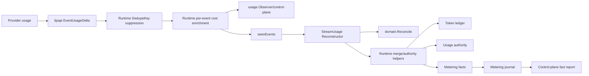

# Brownfield Requirements Gap Analysis

## Scope and Method

This analysis compares the first requirements draft for `usage-accounting-architecture-convergence` with repository `main` at `294fa587b902fa0989adab8ad0a16f6ab001c33e`.

The review follows actual usage/economic data and control flow rather than package names alone. It covers:

- provider usage extraction and provider-reported cost;
- backend-plugin AccountingEvidence and FinalizeBilling;
- canonical `lipapi.EventUsageDelta`, usage presence, scopes and DedupeKey;
- token counting, stream reconstruction and `tokenaccounting/domain.Reconcile`;
- runtime receive, cancellation, finalization, customer evidence and economic merge helpers;
- static `internal/core/accounting` price catalog and generic `economics.Rater`;
- metering checkpoint/fact/journal/reducer paths;
- request/attempt authority coordinators and fixed-window usage authority;
- token ledger and durable token-ledger adapters;
- legacy usage observer and control-plane projection paths;
- dual-plane report reconstruction;
- terminal-work durable completion;
- architecture/core-boundary documents and regression history.

Classifications:

- **Missing** — target capability/ownership does not exist.
- **Partial** — reusable machinery exists but the target invariant is not yet true end-to-end.
- **Duplicate** — multiple live semantic owners implement the same or overlapping rule.
- **Defect** — current behavior can produce a materially incorrect accounting/reporting result.
- **Constraint** — current public/behavioral/persistence commitment must be preserved during migration.
- **Preserve** — strong current component that should remain an owner rather than be rewritten.
- **Retire** — compatibility path whose target role should disappear after cutover.

Effort:

- **S** — focused pure/test/refactor work.
- **M** — multi-package migration on existing seams.
- **L** — runtime/authority/report/persistence convergence requiring staged cutover.
- **XL** — broad public/wire/platform rewrite; should be avoided for this work.

## Current Architecture Assets Worth Preserving

### Metering fact identity and semantics

`pkg/lipsdk/metering.Fact` already contains the fields required for a trustworthy technical evidence journal: stable FactID/StreamID/Sequence, source-event identity, perspective, boundary, lifecycle, correlation, scoped attribution, typed quantities with explicit presence, optional money with explicit presence/source, authority, supersession and policy version.

`internal/core/metering/aggregate.Apply` already handles the hard semantics that older code reimplements imperfectly: delta addition, cumulative replacement, correction, authoritative replacement, replay identity, checked arithmetic and currency consistency. This should become more authoritative, not be replaced.

### Dual-plane public economics contracts

The current `pkg/lipsdk/economics.Rater`, customer/operator perspectives, rating version refs and explicit dual-plane control-plane report DTOs provide a good external extension seam. Customer charge and operator cost are already intentionally separate.

### Usage-authority transactional store

The fixed-window usage-authority service/store already supports multi-rule atomic descriptor-set reserve/settle/release, idempotency, estimated-to-authoritative adjustment, independent token/money authority, bounded queries and durable memory/SQLite/PostgreSQL behavior. The primary problem is runtime integration duplication, not this store's transaction model.

### Backend edge usage parsing

Provider adapters such as OpenAI usage mapping correctly preserve per-field JSON presence and provider-reported cost presence. Backend-plugin host-only AccountingEvidence requires source/authority/provider-billable plane/presence and a DedupeKey. These are appropriate edge responsibilities.

### Terminal-work and terminal CAS

Runtime terminal ownership and terminal-work durable recovery solve a different concern from accounting semantics. They should remain the terminal sequencing/recovery mechanism while accounting becomes a narrower effect owner.

## Current Data/Control Flow Problem

The current path contains overlapping interpretations:

`Reconstructor` computes a reconciled result, but runtime later ignores that result for key decisions and re-derives authority/client values from the raw returned events. The token ledger records raw scopes again. Control-plane reporting can use the legacy observer or raw metering facts. This is an architectural split of truth, not merely many files.

## Gap Register

| ID | Severity | Class | Effort | Current finding | Required disposition |
|---|---:|---|---:|---|---|
| G-01 | P0 | Duplicate | L | `StreamUsage.Reconstruct` calculates `Result.Reconciled`, while runtime finalization derives authority/client usage again from `result.Events`. | One accounting lifecycle must consume fact-reduced results; delete event-array reinterpretation. |
| G-02 | P0 | Defect | M | `tokenaccounting/domain.Reconcile` deduplicates by value-shaped identity rather than the canonical DedupeKey/fact identity. | Retire value dedupe; use FactID/StreamID identity only. |
| G-03 | P0 | Duplicate | M | Runtime has separate DedupeKey suppression before later structural-value reconciliation dedupe. | Move identity/idempotency ownership to fact ingestion/journal/reducer. |
| G-04 | P0 | Duplicate | M | Runtime and `metering/plane` both implement aggregated usage-counter projection with different metadata-selection details. | Keep one projection/reduction owner; delete mirrors. |
| G-05 | P0 | Defect | M | `DualPlaneReportInputsFromFacts` directly sums raw fact quantities/money and bypasses correction-aware `aggregate.Apply`. Repeated cumulative/replacement facts can be over-counted. | Report from reduced stream snapshots. |
| G-06 | P0 | Partial | S/M | `metering/aggregate.Apply` has correct core kind semantics but Snapshot does not expose all provenance/refs needed by accounting/report/debug consumers. | Enrich internal reduced snapshot minimally; do not add a public EconomicStatement. |
| G-07 | P0 | Duplicate | L | Runtime `retryRecvStream` owns usage collection, dedupe, event cost enrichment, customer evidence, cached authority/customer usage and token-ledger writes. | Extract one accounting application lifecycle and shrink runtime. |
| G-08 | P0 | Duplicate | M | `AccountingRuntime` simultaneously exposes old price catalog, stream reconstruction/ledger and new metering/rater/authority-coordinator machinery. | Composition shall expose one accounting service plus focused existing public ports. |
| G-09 | P0 | Partial | M | Static `PriceCatalog/EstimateCost` and injected `EconomicsRater` are parallel rating code paths selected by runtime branches. | Implement static pricing through `EconomicsRater`; remove direct runtime static branch. |
| G-10 | P0 | Constraint | S | Provider-reported present cost is authoritative evidence and may be zero. | Preserve provider money; only rate when provider money is absent. |
| G-11 | P0 | Partial | M | Rater requests can already bind FactIDs/FactRefs, but per-event runtime pricing occurs before authoritative reduction. | Rate reduced/presence-aware quantities. |
| G-12 | P0 | Duplicate | L | Built-in UsageAuthority can be called directly while request/attempt coordinators also support authority providers. | Wrap built-in usage authority as coordinator providers; one lifecycle path. |
| G-13 | P0 | Duplicate | M | Clamp preview has a direct UsageAuthority fallback when AttemptCoordinator is nil. | Use coordinator/provider architecture for preview and committed admission. |
| G-14 | P0 | Constraint | L | UsageAuthority supports atomic multi-rule descriptor sets and late authoritative adjustment. | Preserve store/service algorithm; migrate integration rather than rewrite store. |
| G-15 | P1 | Retire | M | UsageAuthority app/store inputs/results still mirror descriptor sets into legacy scalar/single-reservation fields. | Inventory callers; retire internal scalar mirrors after migration or isolate one adapter. |
| G-16 | P1 | Retire | S/M | `legacy_provider_preferred_attempt` exists as explicit compatibility rule basis. | Stop creating it by default/new config; preserve migration only with documented consumer. |
| G-17 | P0 | Duplicate | L | Token-accounting ledger is directly written by runtime even though metering has become the idempotent usage/cost journal. | Stop direct writes; derive legacy view or delete store after consumer inventory. |
| G-18 | P1 | Preserve | S | Token ledger is token-only and deliberately excludes money. | Do not turn it into a second financial/economic ledger. |
| G-19 | P0 | Partial | M | `metering/aggregate/compat.go` already projects metering facts to token-ledger rows, confirming compatibility-read-model intent. | Make projection one-way/query/rebuildable if retained. |
| G-20 | P0 | Partial | M | `pkg/lipsdk/usage.Event` omits CostPresent and token presence; legacy control-plane usage observer therefore cannot preserve authoritative zero semantics. | Demote observer to telemetry; authoritative reporting uses metering rather than widening observer. |
| G-21 | P0 | Duplicate | M | Control plane can ingest legacy usage observations and separately drain metering facts. | Economic reports/query truth use metering; keep observer only as best-effort observation. |
| G-22 | P0 | Missing | M | No single request/attempt accounting app object owns fact buffers, rating and authority effect sequencing. | Add one concrete `internal/core/accounting` Service + Request/Attempt lifecycles. |
| G-23 | P1 | Partial | S | Current `internal/core/accounting` is pure static price math and not the app owner its name implies. | Preserve math via static rater adapter; reuse package name for cohesive technical accounting lifecycle. |
| G-24 | P1 | Partial | S | `attemptAccountingTracker` mixes TTFT/TPS performance telemetry naming with a `usageObserved` flag/output token total. | Separate/rename performance telemetry from economic accounting. |
| G-25 | P0 | Constraint | M | Customer delivered output is measured post-hook/post-gate and must remain distinct from provider output. | Request lifecycle owns customer egress accumulation/measurement. |
| G-26 | P0 | Constraint | M | Runtime terminal CAS determines which finish/cancel/error/close path owns side effects. | Keep terminal winner in runtime; accounting finalization is an invoked effect. |
| G-27 | P0 | Constraint | M | Post-cancel accounting must run on detached non-canceled context. | Preserve method-level detached context; do not store context in accounting objects. |
| G-28 | P0 | Constraint | M | Terminal-work persists failed settle/release work and can outlive stream lifetime. | Background intent contains immutable refs/inputs, not live stream/accounting object. |
| G-29 | P0 | Missing | M | No explicit canonical statement defines ordinary UsageDelta additive vs cumulative semantics. | Document one canonical additive stream semantic; adapters normalize vendor cumulative snapshots. |
| G-30 | P0 | Partial | M | Backend-plugin AccountingEvidence is host-only and identity-aware but adapter converts it into legacy `lipapi.Event` sideband before accounting. | Map sideband directly to metering facts at accounting ingress. |
| G-31 | P0 | Partial | M | FinalizeBilling complete evidence can be observed after prior estimated/partial usage. | Represent it as cumulative/replacement/correction tied to stable source identity. |
| G-32 | P1 | Constraint | S/M | Many providers only emit one final usage object and need no stateful delta conversion. | Normalize only adapters that actually receive repeated cumulative snapshots. |
| G-33 | P0 | Missing | M | There is no deterministic economic explanation/replay view connecting facts -> reduction -> rating -> authority mutations. | Add safe read/debug projection over production reducer and stable refs. |
| G-34 | P0 | Partial | M | Existing control-plane reports distinguish customer/operator and explicit cross-plane calculations. | Preserve these DTO boundaries; fix only reconstruction/provenance source. |
| G-35 | P1 | Partial | M | Core-boundary docs still describe `accounting` as low-risk price catalog and tokenaccounting as support despite the larger economics domain. | Update ownership docs and architecture guardrails. |
| G-36 | P0 | Missing | M | Architecture guards do not enforce singular economic ownership or prohibit legacy helpers after deletion. | Add imports/symbol/budget ratchets. |
| G-37 | P1 | Missing | M | No baseline quantifies runtime accounting-specific lines and legacy economic semantic surface for this migration. | Capture baseline before implementation and enforce contraction. |
| G-38 | P0 | Constraint | M | Current regression history includes CostPresent, all-zero usage, multi-scope settlement and zero-remaining-budget defects. | Preserve as explicit invariant/property test corpus before refactor. |
| G-39 | P1 | Constraint | M | Metering durability is optional in current deployments. | Live accounting uses request-local facts regardless of recorder; durable sink remains optional. |
| G-40 | P2 | Constraint | S | Financial customer ledger/payment/invoice domain is intentionally absent from OSS. | Keep it out of this spec; expose settled technical evidence through existing public seams. |

## Requirements Review Round 1

The first requirements draft returned **NO-GO** because it correctly identified duplicate semantic ownership but overreached in four ways.

### R1-A: Proposed a new public `EconomicStatement` DTO

A new request/attempt statement type duplicated capabilities already present in `metering.Fact` + the reducer and would create another public schema to version.

**Remediation:**
- Requirements 3–4 make `metering.Fact` + an enriched internal reducer Snapshot authoritative.
- Requirement 13 requires small existing ports and concrete internal lifecycle objects.
- No new public statement or event-store framework.

### R1-B: Proposed making the durable journal the live transaction coordinator

Forcing every live settle/report through database round-trips would make optional metering durability mandatory and tie hot-path correctness to persistence latency.

**Remediation:**
- Requirement 3.7 uses the same Fact objects in a request-local buffer and optional durable recorder.
- Live reduction is pure/in-memory; durable replay/reporting uses the same reducer.
- G-39 explicitly preserves optional durability.

### R1-C: Proposed a broad generic economic workflow manager

A manager responsible for metering, rating, authority, reports, terminal-work and persistence would merely replace `retryRecvStream` with a new god object.

**Remediation:**
- Requirement 6 defines concrete Request and Attempt lifecycle owners.
- Reducer, Rater, authority providers, terminal-work and read models retain independent ownership.
- Accounting Service constructs/coordin­ates; it does not absorb their algorithms.

### R1-D: Proposed value/content fingerprints as fallback dedupe identity

Content-based dedupe recreates the current structural-value bug and can collapse legitimate equal-value provider charges.

**Remediation:**
- Requirement 3.2 makes stable fact identity the only replay identity.
- Ordinary events without provider keys get lifecycle-local sequence identity; they are not value-deduped.
- Corrections/replacements use explicit supersession.

## Requirements Review Round 2

After remediation, requirements were checked again against current code, Kiro steering, and migration behavior. The second review returned **PASS** after the following clarifications were incorporated:

1. Canonical main-stream UsageDelta semantics are additive; vendor cumulative streams normalize at adapter edges.
2. Final-only providers need no stateful conversion merely for symmetry.
3. Backend-plugin host-only AccountingEvidence goes directly to facts rather than client stream events.
4. Provider-reported money wins; rating fills absent money rather than overwriting it.
5. Static catalog is an implementation of the existing Rater port; no new pricing interface.
6. Built-in UsageAuthority is integrated as coordinator providers; its transactional store is preserved.
7. Runtime keeps terminal/output-commit ownership; accounting receives terminal outcome and performs economic effects.
8. The legacy usage observer remains a telemetry SDK rather than gaining a second billing schema.
9. Token ledger is either a one-way compatibility projection or deleted after consumer inventory.
10. Financial accounting/customer balances remain explicitly outside the OSS technical-accounting bounded context.
11. Final architecture is deletion-oriented with measurable runtime/legacy surface contraction.
12. Implementation stays approval-gated and begins with RED characterization.

## Requirements Quality Gate

**Decision: PASS**

The final requirements are testable, brownfield-aware and intentionally narrower than a billing rewrite. They describe one directional technical-economic pipeline while preserving runtime terminal ownership, provider-edge translation, independent customer/operator perspectives, generic Rater/authority extension seams, and existing usage-authority transactions.

Implementation is not authorized by this gap analysis; requirements/design/tasks approval remains required in `spec.json`.
