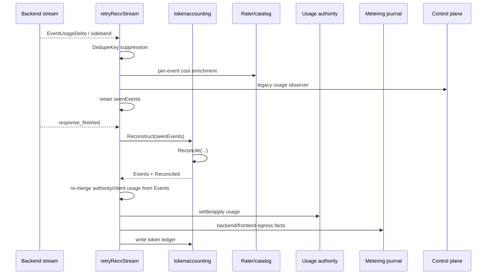
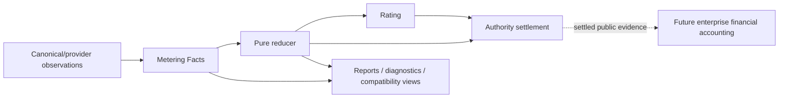
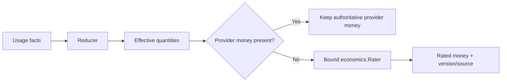
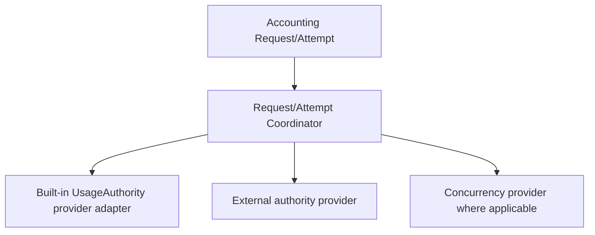
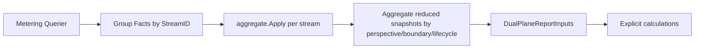

# Research and Architecture Discovery

## Purpose

This document records brownfield discovery and architecture trade-offs for converging Go-LIP's usage calculation, economic reporting, cost rating and quota/budget settlement. The design artifact contains the final contracts; this file explains why those contracts were selected.

Reviewed repository state: `main` at `294fa587b902fa0989adab8ad0a16f6ab001c33e`.

## Current Economic Building Blocks

### Canonical stream usage

`pkg/lipapi.EventUsageDelta` carries compatibility token totals, cache/reasoning subcomponents, per-field `UsagePresence`, optional provider money with `CostPresent`, raw bounded usage JSON, accounting plane/source/authority/tokenizer metadata, per-plane `UsageScopes`, and an internal `DedupeKey`.

This shape is appropriate at the canonical streaming boundary because providers return usage alongside response streams. It is not a good long-lived economic model because it also carries unrelated stream event fields and does not define fact-kind/correction semantics.

### Token accounting

`internal/core/tokenaccounting` currently includes:

- provider/local token counting and fallback selection;
- preflight limits/clamps;
- streaming reconstruction;
- plane reconciliation;
- token-only ledger recording;
- observability.

Counting/preflight is useful independent functionality. Reconciliation and ledger ownership overlap with the newer metering system.

### Static price accounting

`internal/core/accounting` currently contains pure token breakdown and static catalog cost estimation. The math is reasonably compact and checked, but runtime selects between this direct path and the newer generic `economics.Rater` path.

### Metering

`pkg/lipsdk/metering.Fact` is the strongest technical evidence primitive currently in the repo. It has:

- stable FactID + StreamID + Sequence;
- source event identity/revision;
- customer/operator/none perspective;
- frontend/backend ingress/egress boundary;
- logical-request/backend-attempt/auxiliary lifecycle;
- safe correlation/scope;
- typed extensible quantities with presence;
- optional money with presence/source;
- evidence source and authority;
- correction/replacement supersession;
- policy version;
- validation and idempotent replay semantics.

The journal has memory/SQLite/PostgreSQL adapters and bounded query contracts.

### Metering reducer

`internal/core/metering/aggregate.Apply` already defines replayable semantics for:

- delta facts;
- cumulative snapshots;
- corrections;
- authoritative replacements;
- reservation-estimate exclusion;
- unavailable evidence;
- checked integer arithmetic;
- currency consistency;
- replay identity.

This reducer should be the economic aggregation kernel rather than one of several helpers.

### Rating

`pkg/lipsdk/economics.Rater` already supports independent customer/operator RatingRequests, typed quantities, conservative output assumptions, FactIDs/FactRefs, versioned results, rounding policy and source/rater identity. It is already the appropriate extension port for static and enterprise rating.

### Authority

Two levels exist:

- public request/attempt authority providers coordinated by `authoritycoord`;
- built-in `usageauthority` app/store for fixed-window quota/rate/budget/spend-cap enforcement.

The built-in store's descriptor-set atomicity and late authoritative adjustment are good. The migration smell is that runtime can still bypass coordinator providers and call UsageAuthority directly.

### Reporting

The control plane has two sources:

- legacy `usage.Observer` normalization;
- metering fact query/dual-plane report reconstruction.

The newer dual-plane DTOs correctly keep customer/operator money and quantities separate, but `DualPlaneReportInputsFromFacts` currently sums raw facts rather than reducing per-stream fact semantics first.

### Terminal ownership

Runtime's stream terminal CAS and terminal-work durable intent processing solve ordering/recovery. Accounting must attach to these owners, not create another terminal state machine.

## Current Runtime Hot Path



The notable problem is not the number of arrows alone. Several arrows independently choose economic meaning.

## Concrete Correctness Risks Found

### Structural-value dedupe

`tokenaccounting/domain.Reconcile` identifies duplicate non-reservation entries by plane/source/authority/tokenizer/token counters/presence. It does not use `UsageAccountingMetadata.DedupeKey`.

Two legitimate charges can therefore be equal in all values yet represent different provider observations. Conversely runtime already has DedupeKey suppression. One evidence path should not need both identity and value dedupe.

### Reconciled result not authoritative

`streamusage.Reconstructor` produces a `Reconciled` result. Runtime finalization subsequently reads `result.Events` and calls runtime-specific merge functions to choose authority/client evidence. The token ledger records those event scopes again.

This creates a semantic branch after a component already claimed to reconcile usage.

### Raw-fact economic report aggregation

The metering reducer handles cumulative and replacement semantics correctly, but `DualPlaneReportInputsFromFacts` iterates raw facts and adds quantities/money. With two cumulative facts 5 -> 10, the report can produce 15 even though reducer state is 10. The same risk applies to authoritative replacement.

### Presence lost through legacy usage observer

Canonical events and metering facts can represent authoritative zero. `pkg/lipsdk/usage.Event` cannot carry token presence or CostPresent. Control-plane projection from this path therefore cannot preserve the same information as the metering path.

The right fix is not to make a best-effort observer a new accounting API. The right fix is to make metering authoritative for economic reports and retain the observer for extensions/telemetry.

### Multiple ledger-like stores

The token ledger stores token-only observation rows. UsageAuthority stores transactional limit/reservation/decision state. Metering stores idempotent usage/cost facts. Control plane stores normalized evidence/read rows.

These stores do not need to become one database; they need one owner per semantic truth. The token ledger is the clearest redundant mutable source because metering already has a compatibility projector into token-ledger rows.

## Target Conceptual Model



Interpretation:

- **Metering** answers “what quantities/money evidence did the proxy observe, at which boundary, with what identity/authority?”
- **Reduction** answers “what is the effective state of this fact stream after replay/correction/replacement?”
- **Rating** answers “what monetary amount does a versioned policy assign to these quantities?”
- **Authority** answers “may this work proceed and how does actual usage settle against reservations?”
- **Financial accounting** answers “what does a customer owe / what is their balance?” and is not implemented here.

## Alternatives Considered

### A. Keep current architecture and add more regression tests

**Rejected.** Regression tests are necessary but cannot eliminate split semantic ownership. Recent bugs already have characterization tests while new duplicate paths remain easy to add.

### B. Introduce a new public EconomicStatement model

**Rejected.** `metering.Fact` + reduced Snapshot already carry the needed evidence semantics. A public statement would become a third schema between Fact and authority/report DTOs and would need long-term compatibility guarantees.

### C. Treat the durable metering journal as an event-sourcing framework

**Rejected.** Live settlement would become coupled to persistence availability/latency and optional metering deployment would become mandatory. The journal should be a durable sink/query source, not a framework.

### D. Merge metering, rating and authority into one Accounting package

**Rejected.** These are distinct reasons to change and have useful public seams. The package would become a god domain. The selected design adds one app orchestrator while leaving algorithms in their current owners.

### E. Keep static PriceCatalog as a runtime special case

**Rejected.** `EconomicsRater` is already the generic rating port. Static pricing can satisfy that port without a new interface or runtime branch.

### F. Widen usage.Observer to preserve presence/corrections

**Rejected.** It would turn a best-effort observer API into a competing billing stream. Metering already has the richer contract.

### G. Create one universal BillingManager interface

**Rejected.** Request/attempt state is different, and a manager that owns persistence, rating, authority and reporting would just relocate the runtime gravity well. Use concrete Request/Attempt objects with narrow existing outbound ports.

### H. Collapse all stores into one SQL schema

**Rejected.** Metering evidence, authority transactional state and control-plane read history have different consistency/retention purposes. Simplification is semantic ownership, not database monolithization.

## Go Package Design Notes

### Preferred target

```text
internal/core/accounting/
  service.go       # construct Request/Attempt lifecycle objects
  request.go       # logical-request customer measurement/finalization
  attempt.go       # backend-attempt operator measurement/finalization
  ingest.go        # lipapi/backend evidence -> metering fact projection
  rating.go        # invoke/validate bound Rater, provider-money precedence
  projection.go    # reduced customer/operator -> canonical client usage / authority inputs

internal/core/metering/aggregate/
  aggregate.go     # sole fact semantics, enriched internal Snapshot

internal/infra/economics/staticrater/
  rater.go         # static price catalog adapter implementing economics.Rater
```

Exact filenames may change during implementation if smaller existing files are a better fit. The key is ownership, not directory theater.

### What remains in tokenaccounting

Likely survivors:

- provider/local token counting service;
- token counter contracts/results;
- preflight counting/clamp logic where still needed;
- tokenizer adapters.

Likely retirees after consumer inventory/cutover:

- streamusage reconstruction as economic authority;
- `domain.Reconcile` billing-plane selection/dedupe;
- independently writable token ledger;
- ledger-specific observability that only exists for that write path.

### Why one new top-level core owner is acceptable

There is already an `internal/core/accounting` package. This design evolves that existing name into the actual technical accounting app owner rather than adding another `billing`, `usageengine`, or `economicsmanager` package. Static price implementation moves outward to infrastructure because it is one rating adapter.

## Canonical UsageDelta Semantics

A critical simplification is to define main-stream `EventUsageDelta` as an **additive canonical delta** for generic accounting ingestion.

Provider adapters that receive cumulative snapshots are responsible for converting later snapshots to additive deltas before yielding them as ordinary stream usage. A provider that emits one final cumulative usage object may emit that object once because the first cumulative snapshot is numerically equivalent to a delta from zero.

Complete late `FinalizeBilling` evidence is different: it is not another ordinary additive stream delta. Accounting maps it to a cumulative/authoritative replacement/correction fact tied to its source identity.

This avoids adding a new FactKind field to `lipapi.Event` merely to support accounting. Fact kinds belong in metering.

## Rating Placement

Rating should happen on reduced quantities, not arbitrary provider event chunks.



Static OSS catalog pricing implements the same Rater contract. This makes event chunking invisible to rating and removes a runtime conditional special case.

## Authority Placement

The fixed-window usage authority remains a provider in the request/attempt authority stack.



The coordinator remains responsible for provider ordering/compensation. UsageAuthority remains responsible for its own rule evaluation and atomic store mutations. Accounting supplies metering-derived quantities/money/fact refs and consumes decisions/settlements.

## Reporting Placement



This reuses the same fact semantics as live accounting without forcing report DTOs into the write path.

## Debug/Replay Placement

The debugging goal is an explanation chain, not another ledger. A query/read helper should be able to produce safe structured data such as:

```text
request req-123
  customer stream fe:req-123
    facts f1,f2 -> input=100 output=20
    rating customer-rater@v7 -> USD ...
    authority reservation r-cust -> settled ...
  attempt bleg-5
    facts f3,f4,f5 -> input=80 output=21
    provider money present/absent ...
    rating operator-rater@v3 -> USD ...
    authority reservation r-op -> settled/adjusted ...
```

It reuses metering reducer and correlation IDs. It does not persist raw content or proprietary pricing details.

## Testing Philosophy

The highest-value tests are invariants rather than one-off examples:

```text
one delta == equivalent N deltas
same identity replay == no change
equal values + different identity == both count
cumulative 5 -> 10 == 10
replacement of 10 by 7 == 7
zero present != absent
restart replay == uninterrupted reduction
report(reducer(facts)) == report(facts)
provider event chunking does not change final rated money
```

Runtime tests then focus on lifecycle ordering: which request/attempt exists, when terminal finalization happens, and whether retry/output rules remain intact.

## Migration Principle

The migration is a strangler **inside one process**, not a permanently dual-running architecture:

1. characterize old behavior and defects;
2. make reducer/report correct;
3. introduce accounting lifecycle behind tests;
4. converge authority and rating ports;
5. switch runtime call sites;
6. switch reports/read models;
7. delete token reconciliation/direct ledger/direct authority/runtime merge paths;
8. add forbidden-symbol/import/size ratchets.

Comparing old/new results in tests is encouraged. Running two independently mutating quota/budget authorities in production is not.
