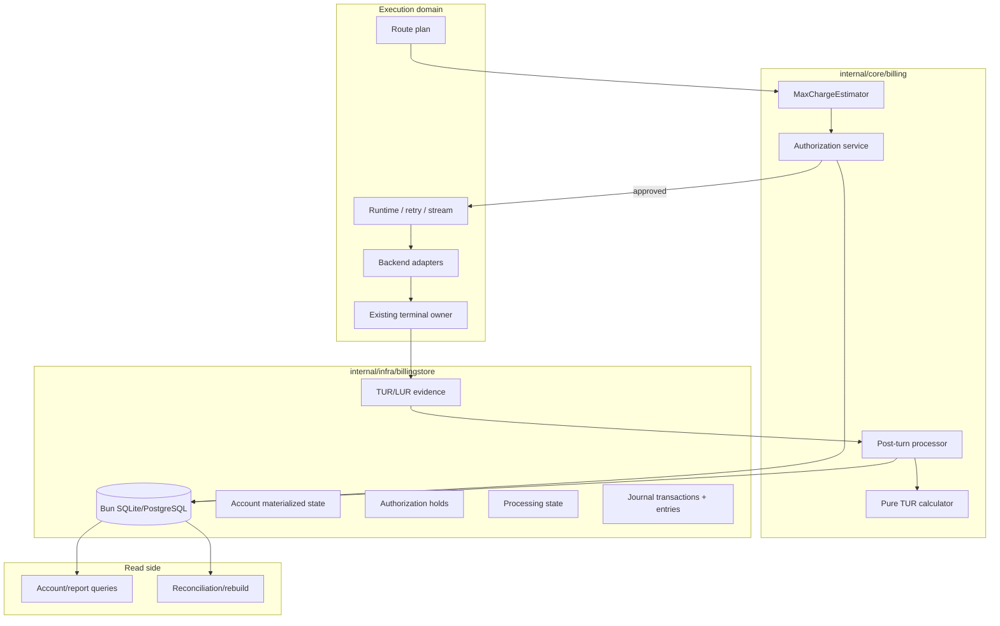
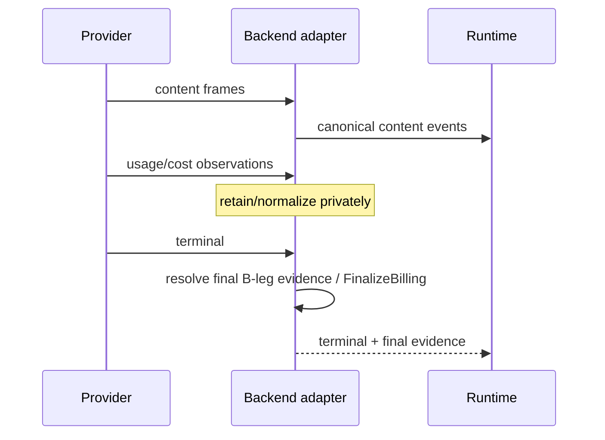
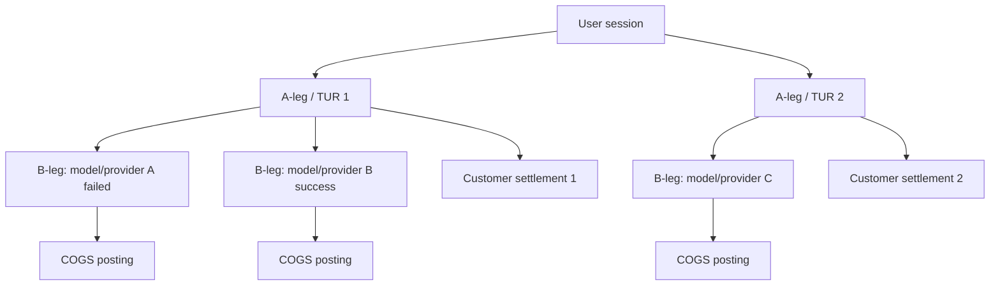
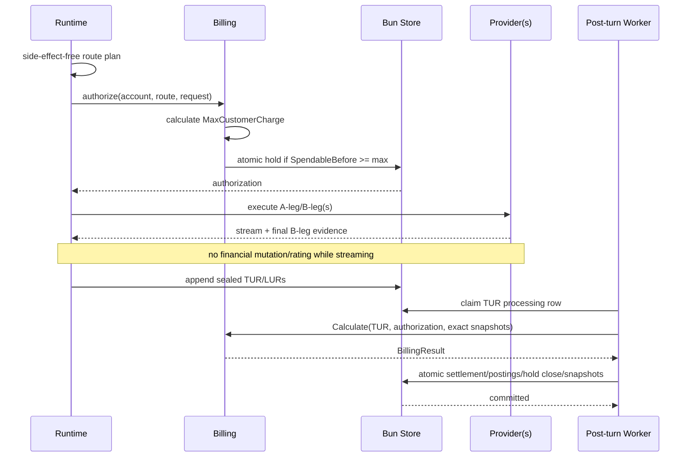
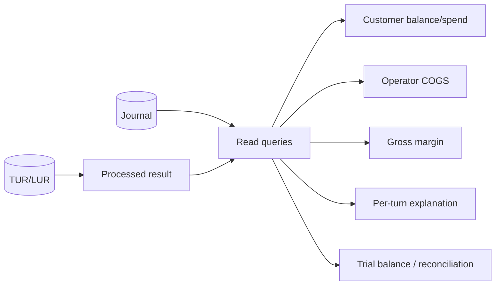
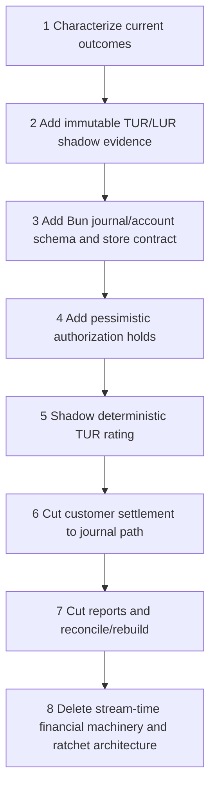

# Design Document

## Overview

This design replaces stream-time financial accounting with a compact **authorize -> execute -> record -> rate -> post** architecture. Runtime performs one financial operation before upstream work: calculate a conservative maximum customer charge and atomically create an authorization hold. After authorization, execution is billing-blind. At the existing terminal boundary runtime persists one immutable Turn Usage Record (TUR) for the A-leg containing one Leg Usage Record (LUR) per B-leg. A post-turn worker validates bound pricing/rate identities, calculates customer charge and per-B-leg operator cost, posts balanced double-entry transactions, closes the hold, and updates materialized account state.

The durable journal is the reconstructible financial truth. Materialized account rows are fast projections used for authorization/query performance. Point-in-time before/after snapshots are redundant diagnostic evidence. If replay or journal integrity cannot be verified, the account fails closed through `reconcile_required` rather than guessing a balance.

### Goals

- Keep LLM streaming free of financial mutation and rating.
- Enforce prepaid/postpaid affordability before provider work under concurrency.
- Model B2BUA A-leg customer settlement and B-leg provider costs explicitly.
- Use classical balanced double-entry postings with immutable history.
- Make account state reconstructible after failures.
- Reuse existing Bun SQLite/PostgreSQL infrastructure.
- Make billing calculation testable with plain Go values.
- Delete current stream-time financial machinery rather than wrap it.

### Non-Goals

- Live token-by-token debiting or terminating an in-flight generation on spend.
- Generic ERP/chart-of-accounts framework, event sourcing, Kafka/CQRS, workflow engine, or billing DSL.
- Payment gateway/card acquisition, invoice rendering, tax/VAT, FX, or collections.
- Changes to routing, B2BUA, streaming, or no-retry-after-output semantics.

## Architecture

### Boundary Map



**Runtime rule:** runtime may authorize before execution and durably record terminal usage evidence after execution; it may not calculate or post financial accounting while streaming.

### Hexagonal Ownership

- **Domain/application center:** `internal/core/billing` owns money invariants, max-charge policy, TUR/LUR interpretation, rating orchestration, and trusted financial commands.
- **Driving callers:** runtime preflight and post-turn processor/repair/admin commands.
- **Driven adapters:** Bun billing store and immutable pricing/rate snapshot providers.
- **Provider edge:** backend adapters normalize/finalize B-leg evidence; provider SDK types never enter billing.
- **Read side:** reports/reconciliation query durable billing data and do not mutate financial history.

No interfaces are introduced solely for mocking. Storage and immutable snapshot lookup are real substitution boundaries; pure calculator functions remain concrete.

## Package Topology

```text
internal/core/billing/
    money.go            # exact Money / checked arithmetic
    records.go          # TUR/LUR/final evidence/value objects
    estimate.go         # pessimistic MaxCustomerCharge
    authorize.go        # admission use case
    calculate.go        # pure TUR -> BillingResult
    journal.go          # posting intents/invariants
    reconcile.go        # pure replay/reconciliation rules
    contracts.go        # narrow store/snapshot/query seams

internal/infra/billingstore/
    store.go            # Bun transaction implementation
    models.go           # Bun rows only
    migrations/*.go     # deterministic schema migrations
    *_contract_test.go  # SQLite/PostgreSQL parity

internal/core/runtime/
    ...                 # only authorization call + terminal TUR handoff
```

Existing `internal/infra/db` remains the DB open/dialect/pool abstraction. No second ORM/database framework is introduced.

Authoritative billing is composition-injected. `runtimebundle.ProductionOptions` must supply `BillingStore`, `BillingAdmission`, account/authorization identity resolvers, and a rating snapshot resolver. YAML `accounting.billing.authoritative: true` fails closed without that injection. Public `pkg/lipruntime.Options` stays non-money (quota/concurrency registrations only). `lipstd` does not invent billing account identities or auto-open the Bun journal.

`accounting.pricing` / `internal/core/accounting.EstimateCost` remain snapshot and shadow-characterization helpers. They are not stream-time price enrichment. Leftover `accounting.ledger.*` YAML is accepted and never opened.

## Core Data Model

### Money

```go
type Money struct {
    Nano     int64
    Currency string
}
```

Authoritative math is checked integer/fixed point. Currency mismatch or overflow is an error.

### Account

```go
type AccountMode string

const (
    AccountPrepaid  AccountMode = "prepaid"
    AccountPostpaid AccountMode = "postpaid"
)

type AccountState string

const (
    AccountReady             AccountState = "ready"
    AccountReconcileRequired AccountState = "reconcile_required"
)

type Account struct {
    ID          string
    Currency    string
    Mode        AccountMode
    CreditLimit int64 // non-negative; used only for postpaid

    BalanceNano  int64
    ReservedNano int64
    Version      uint64
    State        AccountState
}
```

Signed external balance convention:

```text
Balance = customer-account credits - customer-account debits
CreditFloor = 0                    (prepaid)
CreditFloor = -CreditLimit         (postpaid)
Spendable = Balance - CreditFloor - Reserved
```

Examples:

```text
prepaid funded 250: Balance=250, Floor=0
postpaid limit 100: Balance=0, Floor=-100
postpaid used 35:   Balance=-35, Floor=-100, capacity before holds=65
```

### Max Cost and Authorization

```go
type MaxCostBound struct {
    Amount          Money
    PricingRef      VersionRef
    ChargePolicyRef VersionRef
    Basis           []BoundComponent
}

type Authorization struct {
    ID              string
    AccountID       string
    TURKey          string
    Amount          Money
    PricingRef      VersionRef
    ChargePolicyRef VersionRef
    ExpiresAt       time.Time
    Fingerprint     string
}
```

Admission invariant:

```text
SpendableBefore = Balance - CreditFloor - Reserved
require SpendableBefore >= MaxCustomerCharge
ReservedAfter = Reserved + MaxCustomerCharge
SpendableAfter = SpendableBefore - MaxCustomerCharge
require SpendableAfter >= 0
```

A zero-exposure authorization (`MaxCustomerCharge = 0`) remains an audited
identity/snapshot hold but does not create authorization-book entries: journal
posting amounts are strictly positive, and no reserved or financial balance
mutation occurs. Non-zero holds use the authorization-book postings below.

Checking only `Spendable >= 0` before inserting the hold is insufficient; the requested amount is part of the invariant.

### Durable Usage Identity

Billing identity is independent from retry labels:

```text
TURKey = BillingAccountID + ":" + stable Turn/ALeg identity
LURKey = TURKey + ":" + BLegID

CustomerSettlementSourceKey = "customer-settlement:v1:" + TURKey
ProviderCostSourceKey       = "provider-cost:v1:" + LURKey
```

If one B-leg can legitimately produce multiple independent provider costs, `ProviderCostSourceKey` may append a closed, typed cost-source discriminator. Arbitrary caller text is not accepted.

### Turn and Leg Usage Records

```go
type TurnUsageRecord struct {
    SchemaVersion int
    Key           string
    Fingerprint   string

    AccountID       string
    TurnID          string
    ALegID          string
    AuthorizationID string

    StartedAt  time.Time
    FinishedAt time.Time
    Outcome    TurnOutcome

    CustomerPricingRef VersionRef
    ChargePolicyRef    VersionRef

    Legs []LegUsageRecord
}

type LegUsageRecord struct {
    Key         string
    Fingerprint string

    ALegID string
    BLegID string
    Seq    int

    BackendID string
    ProviderID string
    ModelID   string

    Outcome  AttemptOutcome
    Surfaced bool

    Evidence        FinalBillingEvidence
    OperatorRateRef VersionRef
}
```

The versioned semantic fingerprint covers a fixed ordered encoding of immutable billing fields. It excludes processing lease/retry state, insertion timestamps, and database metadata.

**Replay rule:**

```text
same durable key + same fingerprint     -> idempotent no-op
same durable key + different fingerprint -> integrity error
```

`request_id`, `attempt_id`, and attempt sequence are useful correlation but are not sufficient durable financial identity.

### Immutable Evidence vs Mutable Processing

`turn_usage_records` and `leg_usage_records` are immutable after seal. Processing state is separate:

```go
type UsageRecordProcessing struct {
    TURKey       string
    TURFingerprint string
    Status       string // pending|processing|retryable|processed|unreconciled_cost|terminal_error
    LeaseOwner   string
    LeaseUntil   time.Time
    RetryCount   int
    SafeErrorCode string
    ResultRef    string
}
```

Worker claims/retries/results never update the sealed TUR/LUR payload.

## Provider Evidence Finalization



The adapter owns cumulative/delta quirks. Billing sees one final LUR evidence object. Existing connector `AccountingEvidence`/`FinalizeBilling` is reused where practical.

The connector `FinalizeBilling` ABI currently carries token/provenance fields only. When that response has no `CostPresent`, terminal TUR sealing may copy stream-observed `CostPresent` (including authoritative zero) onto the LUR so presence is not silently dropped. That merge is evidence assembly at the existing terminal owner, not stream-time settlement or price enrichment.

Provider-billable LUR rules:

1. authoritative provider cost present, including explicit zero -> use it;
2. otherwise sufficient final quantities + exact bound operator-rate snapshot -> deterministic fallback rate;
3. otherwise -> `unreconciled_cost`; do not omit the leg, synthesize zero COGS, or mark the TUR processed.

## Pessimistic Maximum Customer Charge

The estimator receives the side-effect-free route plan, preflight quantities, client/model limits, customer pricing snapshot, and customer charge policy. It makes no provider calls.

Key rules:

- unknown cache/discount benefit is assumed absent;
- output bound is `min(client_max, model_max)` when a lower valid client maximum exists, otherwise model max;
- every fixed/resource dimension that can increase customer charge is included;
- route candidates use their own rate information;
- surfaced-logical-turn policy does not reserve internal failover cost that the operator absorbs;
- multi-leg/pass-through policy reserves every leg that can legitimately become customer-billable;
- unbounded exposure, missing rate, overflow, or currency mismatch fails closed unless an explicit conservative monetary ceiling covers it.

The result binds exact `CustomerPricingRef` and `ChargePolicyRef`; final rating must resolve the same identities.

## Double-Entry Journal

### One Journal Engine, Two Books

- `financial`: customer balances, usage revenue, funding/payments, provider COGS/payable.
- `authorization`: pessimistic holds/releases.

This is not two independently synchronized ledgers/databases. A journal transaction is one atomic balanced object with two or more postings.

```go
type JournalTransaction struct {
    ID                  string
    Book                string
    Currency            string
    SourceKey           string
    SemanticFingerprint string

    AccountID string
    TurnID    string
    ALegID    string
    BLegID    string

    AccountSequence uint64

    ReversalOf            string
    CorrectsTransactionID string
    CorrectionGroupID     string

    RecordedAt time.Time // audit timestamp, never replay order
    Entries    []JournalEntry
}

type JournalEntry struct {
    LedgerAccount string
    Side          string // debit|credit
    AmountNano    int64  // positive
}
```

### Journal Invariants

For every transaction:

```text
entry count >= 2
at least one debit
at least one credit
all amounts > 0
one book + one currency
sum(debits) == sum(credits)
```

Posted entries are immutable.

### Semantic Idempotency

`SourceKey` uniqueness alone is insufficient. The store persists a versioned canonical fingerprint of all fields that make the operation financially meaningful. An existing source key is a no-op only when the fingerprint matches exactly; otherwise the entire operation fails as replay-integrity error.

### Deterministic Replay Order

Wall-clock `RecordedAt` is not replay order. Every account-correlated journal transaction receives an atomically allocated monotonic `AccountSequence` under the account lock/version check. One settlement that emits multiple account-correlated journal transactions receives a contiguous deterministic sequence range.

Database uniqueness includes `(account_id, account_sequence)`. Rebuild, snapshot validation, and first-mismatch diagnostics use this sequence.

### Correction Linkage

Corrections never edit posted history.

```text
original T1
reversal T2:    ReversalOf = T1
replacement T3: CorrectsTransactionID = T1
T2.CorrectionGroupID == T3.CorrectionGroupID
```

The referenced transaction must exist, be eligible, be in the same account/book/currency scope, and not self-reference. A later correction may point to the prior replacement, producing an auditable chain.

### Posting Examples

Customer usage:

```text
Dr Customer Financial Account   actual charge
Cr Usage Revenue                actual charge
```

Trusted funding/payment:

```text
Dr Cash/Payment Clearing        amount
Cr Customer Financial Account   amount
```

Provider-billable B-leg:

```text
Dr Inference COGS               leg cost
Cr Provider Payable/Clearing    leg cost
```

Authorization hold:

```text
Dr Customer Reserved Exposure   max charge
Cr Authorization Contra         max charge
```

Authorization close reverses those entries. Holds do not change posted customer `Balance` or recognize revenue.

## B2BUA Accounting



Customer settlement is A-leg/TUR scoped. Provider cost is B-leg/LUR scoped. A failed or losing B-leg can generate operator COGS even when customer policy charges only the surfaced logical result. Session totals are read-side aggregation only.

Provider-cost durable source identity is account + TUR + `BLegID` (+ typed cost discriminator only when necessary) and is protected by semantic fingerprint.

## Rating Snapshot Binding

Pure calculation boundary:

```go
func Calculate(
    record TurnUsageRecord,
    authorization Authorization,
    customerPricing CustomerPricingSnapshot,
    customerPolicy ChargePolicy,
    operatorRates OperatorRateSet,
) (BillingResult, error)
```

Before any rating:

1. `customerPricing.Ref` must equal both TUR `CustomerPricingRef` and authorization `PricingRef`;
2. customer-policy reference must match TUR and authorization;
3. every LUR needing fallback cost must resolve the exact `OperatorRateRef` sealed in that LUR;
4. a different snapshot identity is rejected even if its numeric rates happen to match.

This makes authorization and final rating reproducible against immutable economic versions.

Customer charging is OpenRouter-style cost recovery: turn outcome never grants a free ride. When the downstream provider accepted work (input and/or completion quantity evidence present, or authoritative provider cost), customer rating bills those observed dimensions under the bound charge policy—including `canceled`/`failed` turns and connectivity drops where output never surfaced. Rejected / never-started legs with no acceptance evidence remain zero. Interrupted turns skip missing optional dimensions instead of failing solely because the stream ended early. Provider COGS remain a separate output.

## Durable Store Contract

```go
type Store interface {
    Authorize(context.Context, AuthorizeInput) (Authorization, error)
    AppendUsageRecord(context.Context, TurnUsageRecord) error
    ClaimPending(context.Context, int) ([]TurnUsageRecord, error)
    ApplyBillingResult(context.Context, ApplyBillingInput) (Settlement, error)

    PostFunding(context.Context, FundingInput) (Posting, error)
    PostPayment(context.Context, PaymentInput) (Posting, error)
    PostAdjustment(context.Context, AdjustmentInput) (Posting, error)
    ReleaseAuthorization(context.Context, ReleaseAuthorizationInput) (Posting, error)
    Reverse(context.Context, ReversalInput) (Posting, error)

    AccountStatus(context.Context, string) (AccountStatus, error)
    ReconcileAccount(context.Context, string) (ReconciliationReport, error)
}
```

Trusted payment/funding/adjustment commands have closed semantics, source identity, fingerprint, reason, and point-in-time snapshot. There is intentionally no generic arbitrary-posting API.

`ReleaseAuthorizationInput` includes authorization/turn identity, amount/full-close, deterministic source key, and a closed reason code. Replaying the same identity with a different amount or reason is an integrity error.

## Bun Physical Model

Durable strict billing uses existing `internal/infra/db` Bun abstraction.

Core tables:

```text
billing_accounts
billing_account_policy_events
authorization_holds
turn_usage_records
leg_usage_records
usage_record_processing
journal_transactions
journal_entries
```

Key constraints/indexes include:

- one account currency/mode/floor policy;
- unique TUR durable key;
- unique `(tur_key, b_leg_id)` LUR identity;
- TUR/LUR semantic fingerprints;
- unique journal source key within its semantic scope;
- unique `(account_id, account_sequence)`;
- correction-link foreign/reference integrity where dialect permits;
- positive journal amounts and valid debit/credit side;
- bounded processing-query indexes.

SQLite and PostgreSQL implementations must satisfy the same store contract. Strict mode never silently falls back to memory.

## Point-in-Time Snapshots

Every customer-affecting operation records inside the same DB transaction:

```text
BalanceBefore / BalanceAfter
ReservedBefore / ReservedAfter
SpendableBefore / SpendableAfter
AccountMode
Currency
CreditLimit / CreditFloor
VersionBefore / VersionAfter
AccountSequence range
```

Snapshots speed debugging but are not replay input. Reconciliation checks them against reconstructed state and reports the first sequence mismatch.

## Successful Flow



## Failure and Recovery

### Processing Failure

A transient processing/rating/store failure leaves the authorization held. Runtime result is already terminal and is never changed.

Stale-hold cleanup is not TTL reclaim on `expires_at`. Automatic expiry cannot prove non-execution (Req 15.6). Unused exposure is released only by unused-hold release after no B-leg evidence, atomic settlement hold close, or explicit `ReleaseAuthorization` with `ReleaseStaleSafe` (A-leg inactive + maximum execution lifetime + safety grace) or operator release.

### `unreconciled_cost`

A provider-billable LUR whose operator cost is neither authoritative nor reproducibly rateable transitions processing to `unreconciled_cost`. It is queryable and repairable; customer settlement is not declared fully processed while required operator cost is unknown. No silent zero/omission is allowed.

### Actual Charge Exceeds Hold

`ActualCustomerCharge > AuthorizedMaxCustomerCharge` is an invariant failure. Do not treat it as normal postpaid overage. Record safe diagnostics and transition the affected account/path to financial reconciliation/safety handling.

### Reconciliation Failure

Any failure proving journal balance, fingerprint replay, correction linkage, deterministic sequence/replay, snapshots, or materialized state transitions the account atomically to:

```text
reconcile_required
```

While this state is active:

- new hard prepaid/postpaid authorizations fail closed before upstream work;
- read/reconcile/repair remains available;
- runtime execution already authorized before the transition is handled conservatively by its durable hold.

The account may return to `ready` only through an explicit audited reconciliation/rebuild that:

1. validates all balanced transactions;
2. validates semantic fingerprints/idempotency;
3. validates correction references;
4. replays journal order by `AccountSequence`;
5. reconstructs balance/reserved/spendable using durable policy history;
6. validates or repairs materialized state;
7. records the successful status transition.

## Account Reconstruction

```text
Balance = customer financial credits - customer financial debits
Reserved = reserved-exposure debits - reserved-exposure credits
Spendable = Balance - CreditFloor - Reserved
```

Replay orders account-correlated transactions by `AccountSequence`; `RecordedAt` is audit metadata only. A maintenance-locked rebuild may replace materialized `BalanceNano`, `ReservedNano`, `Version`, and account status from verified journal/policy history but never rewrites posted journal entries.

## Reporting



Financial reports never derive authoritative customer balance from raw `lipapi.Event` arrays or raw metering facts. Legacy metering/token views may remain one-way telemetry/read projections.

## Testing Strategy

### Pure Unit Tests

- pessimistic max charge across input/output/fixed/resource pricing;
- customer policy vs operator retry cost;
- exact pricing/policy/rate snapshot binding;
- B2BUA customer-charge and per-LUR operator-cost calculations;
- explicit zero vs absent cost;
- `unreconciled_cost`;
- money overflow/currency mismatch.

### Store Contract / Concurrency Tests

Run against SQLite and PostgreSQL where supported:

- prepaid/postpaid authorize/settle floors;
- concurrent holds and multi-process-safe CAS/locking semantics;
- semantic idempotency: same key/same fingerprint vs same key/different fingerprint;
- AccountSequence allocation/uniqueness/order;
- correction link validation;
- balanced transactions/trial balance;
- trusted funding/payment/adjustment/release;
- crash/replay around settlement.

### Rebuild/Property Tests

For arbitrary valid operations prove:

```text
journal transaction debits == credits
prepaid Balance >= 0
postpaid Balance >= -CreditLimit
Reserved >= 0
accepted hold implies SpendableAfter >= 0
replay by AccountSequence reconstructs materialized state
same financial source cannot post twice
```

Inject corrupted fingerprints, correction references, snapshots, sequence collisions, and materialized rows; prove `reconcile_required`, admission block, and only verified rebuild clears it.

### Architecture Tests

Fail if:

- runtime stream handlers call rating/journal/settlement;
- billing imports provider SDKs;
- financial settlement consumes raw usage-event arrays or metering facts;
- sealed TUR/LUR payload is mutated for worker state;
- another authoritative customer-balance reducer appears.

## Migration Strategy



No long-lived dual financial truth is permitted. Each cutover retains characterization/shadow evidence only until equivalence and rollback criteria are satisfied; obsolete runtime paths are then deleted.

## Requirements Traceability

| Requirement | Design owner |
|---|---|
| 1 | Runtime financial isolation |
| 2 | TUR/LUR identity, fingerprints, immutable evidence |
| 3 | Adapter evidence finalization |
| 4 | MaxChargeEstimator |
| 5 | Account model/floors |
| 6 | Atomic authorization holds |
| 7 | Double-entry journal, sequencing, corrections, fingerprints |
| 8 | Authorization book |
| 9 | Bun durable store/schema |
| 10 | Point-in-time snapshots |
| 11 | B2BUA rating/attribution |
| 12 | Snapshot-bound pure rating / unreconciled cost |
| 13 | Atomic settlement/idempotency |
| 14 | Replay/reconciliation/reconcile_required |
| 15 | Separate crash-safe processing metadata |
| 16 | Journal-backed reporting |
| 17 | Migration/deletion/architecture guards |

## Final Architecture Invariant

```text
route plan
 -> pessimistic customer max
 -> atomic authorization hold (SpendableBefore >= max)
 -> execute with no financial decisions
 -> immutable TUR + LURs with durable identities/fingerprints
 -> validate exact economic snapshots
 -> deterministic post-turn rating
 -> balanced sequenced journal settlement
 -> close authorization + materialized snapshots atomically
 -> journal-backed reporting/reconciliation
```
