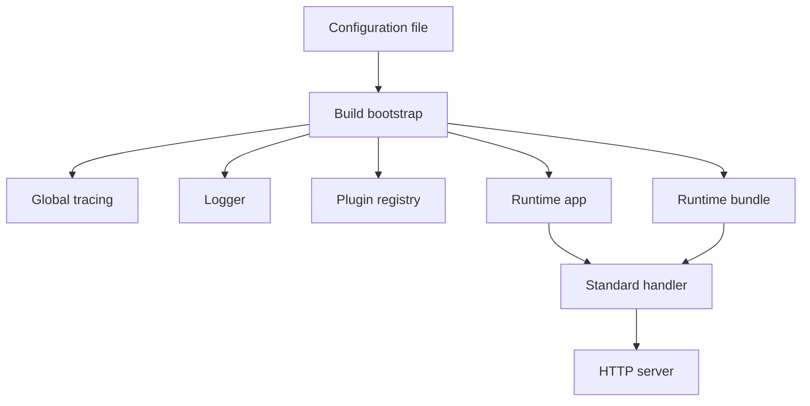
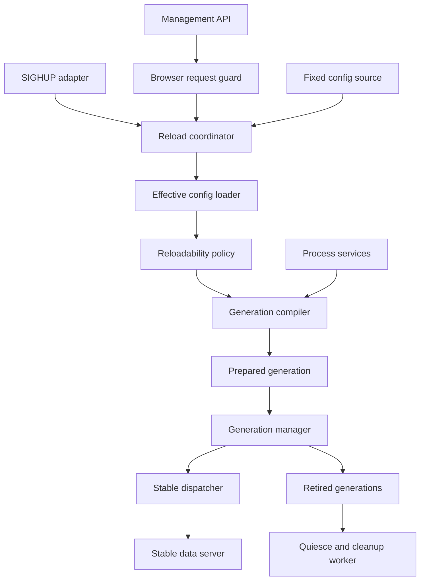
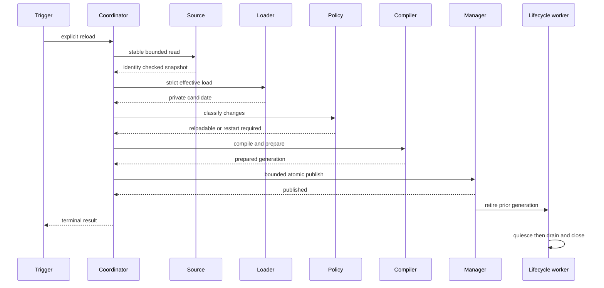
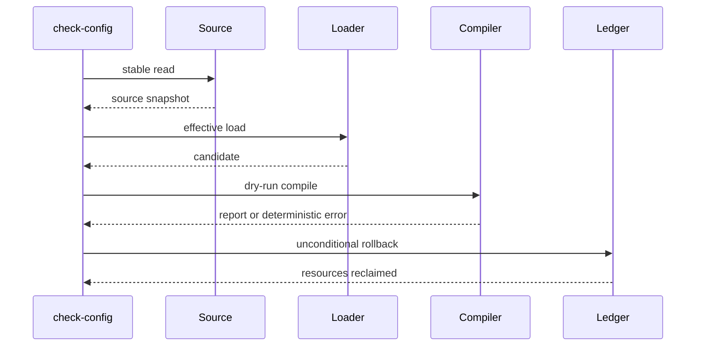
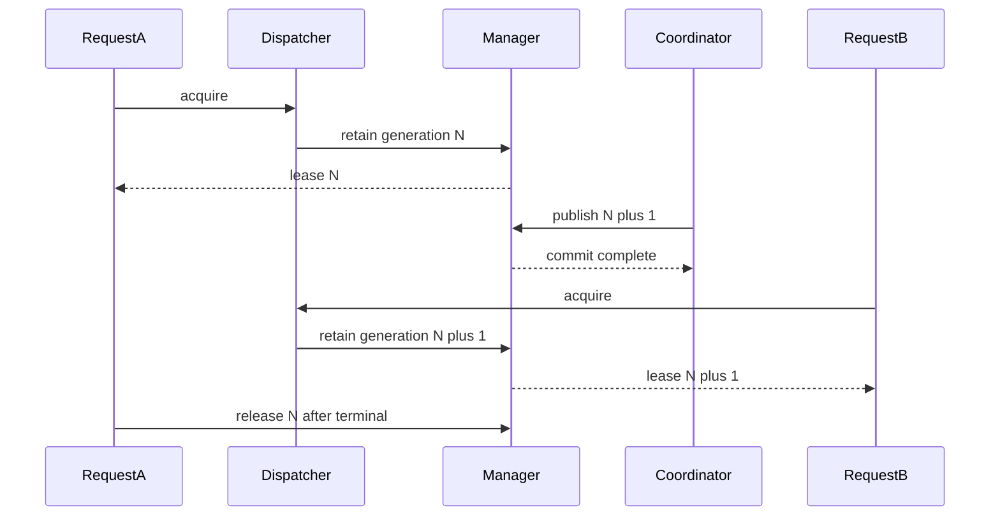
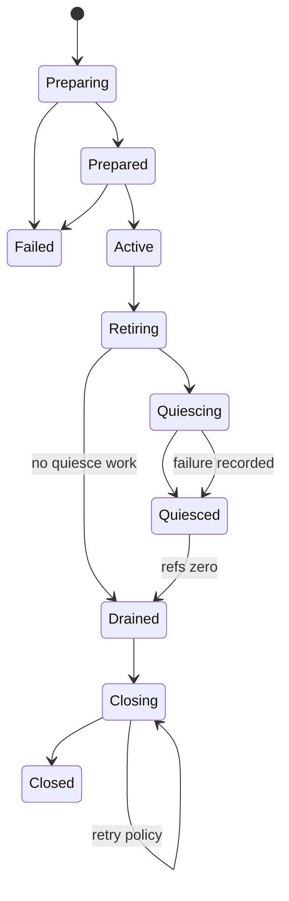

# Design Document

## Versioned Runtime-Reloadable Proxy Configuration

## Overview

This feature introduces explicit, transactional runtime configuration reload without restarting the Go-LIP process or replacing its data-plane listener. The proxy becomes a stable process host around immutable request-plane generations. Startup configuration produces generation 1. A later `SIGHUP` or authenticated management API call reads the same startup-fixed source, validates its atomic-replacement integrity, compiles a complete candidate generation beside the active one, and atomically publishes it only after all mandatory validation and preparation succeeds.

The publication boundary is the complete HTTP-facing request plane, not an individual backend map or routing field. Each generation privately owns a coherent handler, executor, backend instances, route and alias policy, frontend and feature composition, transport-auth projection, request limits, and model-registry view. Requests, SSE streams, public event streams, and asynchronous provider work retain the generation they entered. Retired generations quiesce and close only after every required reference drains.

Process-global state is separated from request-plane generations before reload is enabled. Listeners, logger/tracing/metrics infrastructure, continuity and secure-session stores, database pools, terminal-work processing, factory discovery/trust, A-leg lifecycle/cancellation, and process-capacity budgets remain process-owned in the initial implementation. A generation never owns or closes those services. Changes to their topology are rejected with a typed restart-required result.

### Goals

- Reload only after explicit `SIGHUP` or an authenticated management API call.
- Preserve the data-plane listener, HTTP server, active connections, and streaming responses.
- Publish one immutable, coherent, versioned request-plane generation atomically.
- Keep the last-good generation active after every candidate failure.
- Enforce an atomic-replacement source protocol so valid-looking torn writes cannot publish.
- Make `check-config` and reload use the same full deterministic candidate validation.
- Add, replace, disable, or remove configured backend, frontend, and feature instances whose factories are already available.
- Associate routing and model availability coherently with each request generation.
- Preserve continuity, secure sessions, authority, metering, terminal work, metrics, and other process state.
- Bound retired resources without killing old requests.
- Provide a precise startup-only versus reloadable field matrix.
- Expose safe status, audit, metrics, traces, and a public runtime facade.
- Prove linearizability, no-drop behavior, race safety, leak freedom, and bounded resource use.

### Non-Goals

- File or directory watching, modification-time polling, debounce, periodic rescan, implicit reload, or automatic retry.
- Replacing the process or transferring listeners between processes.
- Accepting configuration YAML, arbitrary paths, or remote URLs through the management API.
- Supporting changed-content runtime reload from in-place file rewrites.
- Runtime installation, download, update, or untrusted discovery of connector artifacts.
- Distributed configuration consensus across multiple Go-LIP processes.
- Moving routing, output commitment, secure-session authority, B2BUA lineage, or canonical semantics out of core.
- Migrating an already executing request from an old generation to a new one.
- Forcibly terminating a long-running stream to reclaim a retired generation.

## Boundary Commitments

### This Spec Owns

- Explicit reload trigger semantics and serialization.
- Fixed-source bounded loading, atomic-replacement integrity validation, strict decode, normalization, and effective identity.
- Full `check-config` and reload candidate-validation parity.
- Field-level reloadability classification.
- Process-service versus generation-resource ownership.
- Immutable whole-request-plane generation construction and atomic publication.
- Request, stream, async-work, and provider generation leases.
- Retired generation quiesce, drain, cleanup, and retention limits.
- Reload-aware routing and model snapshot binding.
- Process-owned management HTTP and OS signal adapters.
- Management authentication and browser-origin rejection.
- Safe status, errors, logs, metrics, traces, and public reload facade.
- Migration and release evidence for the standard binary.

### Out of Boundary

- Provider protocol and SDK behavior inside backend adapters.
- Frontend protocol redesign or new canonical concepts.
- External connector artifact installation and trust bootstrap.
- Remote configuration stores or configuration push services.
- Cross-process generation coordination.
- Deployment-specific rolling restart or blue-green process orchestration.
- Financial, identity-provider, or database schema migrations unrelated to ownership separation.

### Allowed Dependencies

- Standard library `net/http`, `os`, `os/signal`, platform file identity APIs, `sync`, `sync/atomic`, `context`, hashing, and bounded I/O.
- Existing typed configuration, plugin registry, feature bundle, runtimebundle, stdhttp, model registry, snapshot generation, terminal-work, metrics, tracing, safety, and public runtime surfaces.
- Existing backend and feature lifecycle contracts, with an internal candidate/retirement wrapper where required.
- Existing public backend plugin architecture after it lands, through its process-owned factory catalog and instance lifecycle.

### Dependency Constraints

- `internal/core` does not import filesystem, OS signal, HTTP management, runtimebundle, stdhttp, concrete plugins, or provider SDKs.
- Configuration source and signal handling remain driving/infrastructure adapters.
- Concrete process and generation dependency construction remains in composition roots.
- Generation compilation receives process services explicitly; it does not use a global service locator.
- A generation bundle contains only generation-owned immutable state and non-owning classified references.
- The management handler does not import concrete backend packages or mutate active runtime objects.
- The public facade does not expose `internal` types, raw configuration, `http.Handler`, provider SDK types, or mutable generation state.
- No new direct dependency is required for the initial implementation.

### Revalidation Triggers

- Changes to `runtimebundle.Build` resource ownership or closer semantics.
- Changes to `plugin.Lifecycle`, backend instance lifecycle, terminal-work provider lookup, or executable plugin instance sharing.
- Changes to `http.Server`, frontend mount, auth middleware, or downstream identity composition.
- Changes to continuity, secure-session, affinity, health, model, authority, or metering state identity.
- New top-level configuration fields or changes to startup CLI/environment overrides.
- Changes to the atomic source-replacement or stable file-identity protocol.
- Changes to management browser-origin or authentication policy.
- Any proposal to watch files, auto-retry reload, partially apply a candidate, quiesce inside publication, or force-close retired work.
- Any proposal to make plugin discovery/trust paths reloadable or install connector artifacts at runtime.

## Core Invariants

| Invariant | Required proof |
|---|---|
| No implicit reload exists. | File touch/edit/replace tests show no generation change without signal or API. |
| Torn or in-place changed content cannot publish. | Same-file-identity changed-digest and path/handle race tests retain the active generation. |
| `check-config` and reload reject the same deterministic candidates. | Shared compiler dry-run parity matrix. |
| A failed candidate never changes active behavior. | Fault injection at every pipeline stage preserves active generation and traffic. |
| One request observes one complete generation. | Concurrent route/auth/hook/backend/model assertions under repeated publication. |
| Data-plane listener and server never restart for reload. | Connection reuse, HTTP/2, and SSE tests across publication. |
| Publication never performs lifecycle work or waits for old work. | Atomic commit benchmark and blocked quiesce/drain tests. |
| Old resources stay alive exactly as long as required. | Request, async, provider, terminal-work, cancel, and cleanup tests. |
| Process state is not duplicated, reset, or closed by generations. | Store/pool/worker identity and ownership tests across generations. |
| Startup-only changes are never partially applied. | Exhaustive reloadability matrix and mixed-diff tests. |
| Browser-originated management requests cannot trigger reload by default. | Origin and Fetch Metadata rejection matrix. |
| New configured backend instances can become active. | Add/change/remove generic and discovered-factory instance tests. |
| Model legality stays stable for a logical request. | Model refresh plus failover/parallel route binding tests. |
| Retention is bounded without dropping old streams. | Retired-generation pressure rejects later publication. |
| Reload telemetry is bounded and secret-safe. | Golden status/log/metric tests and secret corpus scans. |

## Requirements Traceability

| Requirement | Summary | Components | Interfaces | Flows |
|---|---|---|---|---|
| 1.1-1.9 | Explicit triggers only | Reload Coordinator, Signal Adapter, Management API | `Reload`, trigger envelope | Trigger acceptance |
| 2.1-2.10 | Strict integrity-checked load | Config Source, Effective Loader, Compiler Dry Run | `ReadStable`, `LoadEffective`, `ValidateDryRun` | Candidate pipeline |
| 3.1-3.10 | Transactional last-good | Coordinator, Compiler, Resource Ledger | `Prepare`, `Publish`, rollback | Candidate pipeline |
| 4.1-4.9 | Immutable generations | Generation Bundle, Runtime Generation, Metadata | private generation view | Request binding |
| 5.1-5.10 | Zero-drop publication | Stable Dispatcher, Generation Manager | `Acquire`, `Publish` | Request and commit |
| 6.1-6.10 | Shared process services | Process Services, state registries | explicit compile inputs | Bootstrap and shutdown |
| 7.1-7.9 | Reloadability matrix | Reloadability Policy | `Classify` | Diff validation |
| 8.1-8.11 | Dynamic composition | Generation Compiler, instance wrappers | factory build/lifecycle | Candidate preparation |
| 9.1-9.10 | Routing and models | Model Snapshot Binder, routing compiler | bound model view | Request planning |
| 10.1-10.12 | Retirement | Lease State, Lifecycle Coordinator, Retired Set | retain/release/quiesce/close | Retirement state machine |
| 11.1-11.9 | Signal concurrency | Signal Adapter, Coordinator | bounded trigger channel | Signal and shutdown |
| 12.1-12.11 | Management API | Management Server, Auth and Browser Guard | HTTP reload/status | Administrative request |
| 13.1-13.10 | Failure/readiness | Coordinator Status, Host Shutdown | readiness/status views | Failure and shutdown |
| 14.1-14.9 | Observability | Status Store, Metrics, tracing/logging | snapshots and sinks | All reload stages |
| 15.1-15.10 | Performance/bounds | Dispatcher, Coordinator, retained budget | hot-path lease | Load and soak |
| 16.1-16.13 | Facade/compat/release | `pkg/lipruntime`, CLI, docs/tests | public reload/status | Migration and release |

## Existing Architecture Analysis

The current startup flow is explicit but monolithic:



This shape is correct for startup but not reusable as a reload transaction. `BuildBootstrap` and `runtimebundle.Build` currently cross three ownership classes:

1. **process infrastructure** such as listeners, tracing, metrics, durable stores, pools, A-leg lifecycle, and workers;
2. **request-plane generation** such as backends, routes, hooks, frontends, auth projections, HTTP clients, and model views;
3. **request/async work** such as streams, heartbeats, finalization, and pending provider actions.

The feature first makes these classes explicit. It does not retain `*runtimebundle.Built`, `*runtime.App`, or a mutable `*config.Config` inside a published generation because those current types mix ownership or expose mutable state.

## Selected Architecture

### Pattern

**Stable process host with explicit process services, immutable request-plane generation bundles, atomic publication, and reference-drained retirement.**



### Key Decisions

- The server delegates each request to the current generation; the server itself is never republished.
- The commit point is one atomic active-generation pointer/state swap.
- The active generation bundle is private and deeply immutable.
- The generation manager owns only generations; `ProcessServices` owns process state separately.
- Old generations cannot accept new leases after retirement marking.
- Candidate construction is a transaction with a reverse-order resource ledger.
- Changed source content must arrive through a provable atomic replacement.
- `check-config` executes a full isolated compiler dry run and rollback.
- The reloadability policy prevents process-topology changes from entering the compiler.
- Management remains available independently of the data-plane generation.
- Browser-originated requests are rejected before authentication can reach coordinator invocation unless an exact startup allowlist permits the origin.
- Quiesce and cleanup occur after publication under a separate lifecycle owner.
- Configuration publication is explicit only; no watcher or periodic loop exists.

### Hexagonal Lens

- **Domain policy:** core routing, output commitment, continuity, secure-session authority, accounting, and canonical legality remain unchanged.
- **Application orchestration:** reload coordinator orders stable read, normalize, diff, compile, prepare, publish, retire, and lifecycle follow-up.
- **Driving adapters:** Unix signal adapter, management HTTP handler, CLI startup, filesystem source, and tests.
- **Driven adapters:** backend factories, model sources, stores, metrics, tracing, and plugin host.
- **Composition root:** `cmd/lipstd`, runtime host, `runtimebundle`, and stdhttp construct concrete dependencies.
- **Query seam:** safe reload and generation status projections for management and `pkg/lipruntime`.

### Project Boundary Answers

- **Core-owned or plugin-owned?** Reload orchestration is runtime-host owned. Backend construction and provider resources remain plugin/factory owned. Routing behavior remains core-owned.
- **New canonical concept?** No. Configuration-generation correlation is execution metadata and diagnostics, not a provider or frontend wire concept.
- **Streaming-first preserved?** Yes. A streaming handler retains its generation for the existing canonical stream lifetime; non-streaming still collects that stream.
- **Provider SDK leakage avoided?** Yes. The compiler invokes factories; generation and reload contracts contain no provider SDK types.
- **No retry after output preserved?** Yes. Reload never reopens, migrates, or retries an attempt.
- **Secure-session posture affected?** Store identity and token-fingerprint topology are startup-only; request policy may change only through a new generation.
- **Extension platform affected?** Feature surface is rebuilt as an immutable generation; legal stage ordering remains core-owned.

## Technology Stack

| Layer | Choice / Version | Role | Deviation |
|---|---|---|---|
| Runtime | Go 1.26.x | Atomic publication, lifecycle, context, signal adapters | Existing stack |
| Data plane | `net/http` | Stable listener/server and dispatcher | Handler becomes generation-aware |
| Management | `net/http` | Process-owned reload/status API | New separate listener and browser guard |
| Configuration | `gopkg.in/yaml.v3` | Strict one-document typed decode with opaque plugin nodes | Loader is bounded and reusable |
| Source integrity | stdlib file/stat/hash plus platform file identity | Prove stable read and atomic replacement | New source contract |
| Concurrency | `sync/atomic`, owned channels, contexts | Active pointer, lease state, bounded trigger delivery | New generation lease protocol |
| Observability | `log/slog`, Prometheus, OpenTelemetry | Process-owned reload status and telemetry | No provider replacement during reload |
| Testing | `testing`, `httptest`, race, fuzz, goleak, benchmarks | Contract and no-drop evidence | New reload matrix and soak |
| Dependencies | Standard library plus existing module dependencies | Implementation | No new direct dependency planned |

## File Structure Plan

Exact names may adjust to avoid import cycles, but ownership remains normative. The runtime host must not require `internal/stdhttp` to import the host back: either the host owns the small stable dispatcher and receives a prepared handler from an injected composition callback, or an equivalent one-way package dependency is used.

```text
internal/
  core/
    configreload/
      model.go
      policy.go
  infra/
    configsource/
      file.go
      file_identity_unix.go
      file_identity_windows.go
      file_identity_other.go
    runtimebundle/
      process_services.go
      generation_bundle.go
      generation_compile.go
      generation_validate.go
      resource_ledger.go
      bootstrap_host.go
    runtimehost/
      host.go
      coordinator.go
      status.go
      generation.go
      generation_manager.go
      generation_dispatcher.go
      lifecycle_worker.go
      lease.go
      shutdown.go
  stdhttp/
    generation_prepare.go
    admin/
      configreload/
        handler.go
        auth.go
        browser_guard.go
cmd/
  lipstd/
    reload_signal_unix.go
    reload_signal_other.go
pkg/
  lipruntime/
    reload.go
```

## Components and Interfaces

### Component Summary

| Component | Domain | Intent | Requirements | Key dependencies | Contracts |
|---|---|---|---|---|---|
| Process Host | Composition | Own stable servers and shutdown | 1, 5, 6, 11-16 | Process Services, Manager | Service, State |
| Process Services | Composition | Own stores, pools, workers, telemetry | 6, 13 | Existing runtime infra | State |
| Stable Config Source | Infrastructure | Bounded stable read and atomic replacement proof | 1-3, 15-16 | filesystem | Service, State |
| Effective Loader | Config | Strict decode and normalization | 2-3 | config, factories | Service |
| Compiler Validator | Composition | Full dry-run/reload parity | 2, 3, 8, 16 | Generation Compiler | Service |
| Reloadability Policy | Core policy | Classify changes | 7 | typed config | Service |
| Generation Compiler | Composition | Build isolated generation bundle | 3-4, 8-9, 13 | factories, stdhttp | Service |
| Generation Bundle | Runtime | Privately own immutable request plane | 4-6, 8-10 | executor, handler | State |
| Resource Ledger | Lifecycle | Rollback, quiesce, close resources | 3, 8, 10, 13 | lifecycle wrappers | Service, State |
| Generation Manager | Runtime | Acquire, publish, retire, retain | 3-5, 10, 15 | atomic state | Service, State |
| Lifecycle Worker | Runtime | Post-commit quiesce and cleanup | 5, 10, 13 | Resource Ledger | Batch, State |
| Stable Dispatcher | Data plane | Bind each request to generation | 4-5, 15 | Manager | Service |
| Model Binder | Routing support | Bind immutable model view | 9 | model runtime | Service, State |
| Reload Coordinator | Application | Serialize explicit attempts | 1-3, 7-8, 11, 13-15 | source, compiler, manager | Service, State |
| Signal Adapter | Driving adapter | Deliver bounded HUP triggers | 1, 11 | coordinator | Event |
| Management Server | Driving adapter | Authenticated reload/status | 1, 12, 14 | browser guard, coordinator | API |
| Browser Guard | Security adapter | Reject CSRF/browser-origin attempts | 12 | HTTP headers, fixed policy | Service |
| Public Runtime Facade | SDK | Stable reload/execution/status | 16 | host facade | Service |

### Process Services

Conceptual ownership container:

```go
type ProcessServices struct {
    Continuity        b2bua.Store
    SecureSessions    securesession.Store
    ALegLifecycle     *leglifecycle.Coordinator
    DatabasePools     *db.PoolRegistry
    TerminalWork      *terminalwork.Processor
    Metrics           *metrics.Bundle
    Tracing           tracing.ProcessProvider
    Logger            *slog.Logger
    DecodeAdmission   lipsdk.DecodeAdmission
    FactoryCatalog    FactoryCatalog
    SharedState       SharedStateRegistries
}
```

All fields are constructed once, privately owned by the host, and closed once during process shutdown. The compiler receives a narrow read-only construction view rather than ownership. Generation cleanup cannot reach process closers.

### Stable Configuration Source

```go
type FileIdentity struct {
    Platform string
    Opaque   [32]byte
}

type SourceSnapshot struct {
    SourceID       string
    HandleIdentity FileIdentity
    Size           int64
    ModTime        time.Time
    PrivateDigest  [32]byte
    Bytes          []byte
    ReadAt         time.Time
}

type StableSource interface {
    ReadStable(ctx context.Context, active SourceVersion) (SourceSnapshot, error)
}
```

#### Stable read protocol

1. Resolve the absolute source path once at process startup.
2. Open the path with the platform-safe policy and reject unsupported file types/symlink posture according to startup configuration.
3. Read file identity and metadata from the opened handle.
4. Read at most the startup-fixed byte limit plus one sentinel byte.
5. Re-stat the same handle and reject size/identity/metadata instability.
6. Re-resolve/stat the path and reject if it no longer names the opened handle.
7. Compute a private digest over the accepted bytes.
8. For changed content, require the handle identity to differ from the active source identity.
9. If identity is unchanged and digest changed, return `source_non_atomic_update`.
10. If identity and digest are unchanged, permit a no-op path.

The supported operator contract is write a complete temporary file, flush it as appropriate for the platform, then atomically replace the configured path. The runtime does not attempt to infer completion from valid YAML. On platforms or filesystems without a trustworthy identity/atomic-replace implementation, startup can serve normally but runtime source reload reports unavailable unless a separately approved integrity-verified source adapter exists.

### Effective Configuration Loader

```go
type EffectiveCandidate struct {
    privateConfig     *config.Config
    privateIdentity   [32]byte
    publicFingerprint string
    source            SourceSnapshot
    loadedAt          time.Time
}

type EffectiveLoader interface {
    Load(ctx context.Context, source SourceSnapshot, fixed FixedOverrides) (EffectiveCandidate, error)
}
```

The loader owns deterministic order:

1. strict one-document decode;
2. core defaults;
3. fixed CLI/environment overrides;
4. standard default feature injection;
5. core and routing validation;
6. plugin/factory structural validation;
7. private canonical effective identity;
8. safe public fingerprint.

`EffectiveCandidate` is private to composition. The mutable decode object is never stored directly in a published generation; the compiler copies or projects only the frozen values required by the generation bundle.

### Full Validation and `check-config` Parity

Structural loading is not sufficient because backend construction, lifecycle compatibility, handler mounting, model initialization, and other deterministic failures occur in the generation compiler.

```go
type ValidationMode string

const (
    ValidationPrepare ValidationMode = "prepare"
    ValidationDryRun  ValidationMode = "dry_run"
)

type GenerationValidator interface {
    ValidateCandidate(ctx context.Context, candidate EffectiveCandidate, mode ValidationMode) (ValidationReport, error)
}
```

- Runtime reload uses `ValidationPrepare`, retaining the prepared candidate on success.
- `check-config` uses `ValidationDryRun`, executes the same compiler stages, never publishes, then always rolls back all candidate-owned resources.
- Optional provider availability probes remain outside deterministic validity.
- A parity suite feeds every deterministic compiler failure into both paths and compares safe error category and field/instance attribution.
- Dry-run rollback is leak- and panic-tested.

### Reloadability Policy

```go
type ChangeDisposition string

const (
    ChangeReloadable      ChangeDisposition = "reloadable"
    ChangeRestartRequired ChangeDisposition = "restart_required"
)

type SafeChange struct {
    Path        string
    Disposition ChangeDisposition
}

type ReloadabilityPolicy interface {
    Classify(active, candidate EffectiveConfigView) ([]SafeChange, error)
}
```

Every field has an explicit owner/disposition. Field names are safe and values are absent. Plugin opaque nodes are compared as normalized private values. Mixed changes are rejected if any path requires restart. A structural test fails when a new field is unclassified.

### Generation Compiler

```go
type CompileInput struct {
    Candidate EffectiveCandidate
    Shared    ProcessServiceView
    Trigger   ReloadTrigger
}

type GenerationCompiler interface {
    Compile(ctx context.Context, in CompileInput) (*PreparedGeneration, error)
}
```

Compilation stages:

1. Create isolated per-generation registry/instance view from process-owned factory descriptors.
2. Merge and validate feature surface.
3. Build backend instances and inventories.
4. Resolve routes, aliases, capabilities, and initial model view.
5. Build generation-owned HTTP client and policy projections.
6. Construct executor inputs from process-service views and generation values.
7. Construct the executor and complete standard handler without binding a listener.
8. Prepare only candidate-safe generation lifecycles.
9. Copy/project mutable build inputs into a private immutable `GenerationBundle`.
10. Return `PreparedGeneration` with one generation-owned resource ledger.

The compiler does not open a new process-global store, pool, metrics registry, or tracer provider; start another terminal-work processor; mutate active objects; make billable inference calls; publish traffic; or transfer process-service ownership.

### Candidate Resource Ledger

```go
type ResourceLedger interface {
    Add(name string, phase ClosePhase, close func(context.Context) error)
    Rollback(ctx context.Context) error
    Quiesce(ctx context.Context) error
    Close(ctx context.Context) error
}
```

Close phases are ordered and idempotent:

- **prepare:** fallible initialization before publication;
- **activate:** bounded and non-failing after failure-prone work completed;
- **quiesce:** stop admission-independent generation workers after retirement, outside publication;
- **close:** release generation clients, backend handles, lifecycles, and idle transports after drain.

An existing `plugin.Lifecycle` may be adapted only when `Start` and `Stop` are safe under candidate overlap. Otherwise the affected change remains restart-required.

### Immutable Generation Bundle

```go
type GenerationBundle struct {
    handler      http.Handler
    executor     lipsdk.ExecutorView
    routing      FrozenRoutingView
    backends     FrozenBackendSet
    features     FrozenFeatureView
    auth         FrozenTransportAuthView
    models       BoundModelSnapshotProvider
    resource     ResourceLedger
}

type RuntimeGeneration struct {
    meta       GenerationMeta
    bundle     *GenerationBundle
    leaseState GenerationLeaseState
    status     BoundedLifecycleStatus
}
```

Both structs and fields are internal. Accessors return narrow interfaces or defensive copies. `GenerationBundle` has no process-service closer, no mutable `*config.Config`, no `*runtime.App`, and no mixed-ownership `*runtimebundle.Built`. Process service references used by executor components are explicitly classified, non-owning, and inaccessible to generation cleanup.

### Generation Lease Protocol

The hot path uses one atomic active pointer and a race-safe state/reference protocol.

Conceptual acquire:

```text
repeat
  load active generation
  try retain only if state is active
  reload active pointer
  if pointer is unchanged
    return lease
  release retained reference
end
```

The state/reference implementation may use a packed atomic word or an equivalent proven algorithm. It provides no new retain after retirement, exactly-once release, one drained notification, transferable pins for async work and public event streams, cross-generation A-leg cancellation through process state, no `WaitGroup.Add`/`Wait` misuse, and no process-wide request-path mutex.

### Atomic Publication

Conceptual commit:

```text
verify candidate prepared
reserve retained resource budget
assign next generation id
atomically swap active pointer and generation state
mark prior generation retiring
record published result
return commit result
```

Publication ends there. It performs no quiesce call, cleanup, old-generation wait, file I/O, backend construction, lifecycle start, or model fetch.

After commit, the manager submits the retired generation to the process-owned lifecycle worker. The lifecycle worker quiesces eligible background work and waits for drain. Quiesce/cleanup failures update separate status and never alter the newer active pointer.

### Stable Data-Plane Dispatcher

```go
func (d *GenerationDispatcher) ServeHTTP(w http.ResponseWriter, r *http.Request) {
    lease, ok := d.manager.Acquire()
    if !ok {
        writeUnavailable(w)
        return
    }
    defer lease.Release()

    ctx := withGeneration(r.Context(), lease.Meta(), lease.AsyncPinner())
    lease.Handler().ServeHTTP(w, r.WithContext(ctx))
}
```

The dispatcher preserves optional `http.ResponseWriter` interfaces through existing middleware. It does not buffer bodies or events.

### Reload Coordinator

```go
type ReloadTrigger struct {
    Kind       TriggerKind
    AcceptedAt time.Time
    SafeActor  string
}

type ReloadCoordinator interface {
    Reload(ctx context.Context, trigger ReloadTrigger) ReloadResult
    Status() ReloadStatus
}
```

The coordinator allows one active attempt, returns API conflict when busy, coalesces at most one pending signal, uses a bounded host-owned timeout, never retries automatically, records every stage, rolls back candidates on failure, and prohibits publication after shutdown ownership begins.

### Signal Adapter

Unix files register HUP separately from INT/TERM shutdown. The adapter performs bounded non-blocking delivery into an owned channel and records coalescing. Non-Unix files compile an API-only implementation. No source read, build, retry, or unbounded goroutine creation occurs in the signal path.

### Management API

Recommended default contract:

| Method | Path | Purpose | Success | Principal errors |
|---|---|---|---|---|
| `POST` | `/admin/config/reload` | Trigger fixed-source reload and wait while connected | `200` published/no-op | `401/403`, `409`, `422`, `503` |
| `GET` | `/admin/config/status` | Read safe active/attempt/retirement status | `200` | `401/403` |

The listener is process-owned, startup-fixed, and loopback by default. It does not derive from `server.address`.

#### Reload Request Contract

- `POST` only;
- no YAML, path, URL, command, or plugin instruction;
- empty body or strict empty JSON object only;
- bounded body and content type;
- dedicated header/injected admin authentication; no cookie-based reload authentication;
- no permissive CORS and no authorization through preflight;
- browser guard before coordinator invocation.

#### Browser and CSRF Policy

The default management API is a non-browser administrative surface.

1. Reject every request with a non-empty `Origin` unless the origin exactly matches a startup-fixed explicit allowlist. The default allowlist is empty.
2. Reject `Sec-Fetch-Site: cross-site` and `Sec-Fetch-Site: same-site`; permit `same-origin` only when the exact-origin allowlist permits it and permit `none` for direct user-agent navigation only on read-only status according to policy.
3. Permit absent Fetch Metadata headers for CLI/service clients after normal authentication.
4. Do not emit `Access-Control-Allow-Origin: *` or reflect arbitrary origins.
5. `OPTIONS` does not trigger reload and does not grant authorization.
6. Origin/Fetch Metadata rejection precedes coordinator invocation and is represented as a safe `403` category.

Tests cover simple cross-origin form-like POST, fetch with preflight/custom auth, credentialed requests, same-site different-port origin, spoofed allowlist entries, exact allowed same-origin behavior where enabled, absent-header CLI calls, and coordinator non-invocation.

#### Result Mapping

| Result | HTTP status |
|---|---:|
| published | 200 |
| no-op | 200 |
| busy | 409 |
| restart-required | 409 |
| retention-blocked | 409 |
| invalid source/decode/validation | 422 |
| source-integrity failure | 422 |
| browser-origin/auth rejection | 401 or 403 |
| canceled by shutdown | 503 |
| candidate preparation/internal failure | 503 |

Once accepted, the operation transfers to a host-owned bounded context. Client disconnect does not cancel the attempt; status retains the terminal result.

### Model Snapshot Binder

```go
type BoundModelView struct {
    ConfigGeneration int64
    ModelGeneration  string
    Registry         FrozenModelRegistry
}
```

One logical request obtains one bound view. Routing, failover, parallel races, model legality, capability resolution, and diagnostics use that same view. Later model refresh affects later requests only.

### Public Runtime Facade

`pkg/lipruntime` exposes safe `Reload(ctx, trigger)` and `ReloadStatus()` operations. Its `ExecutorView` is a stable dispatcher-backed facade, not a concrete generation executor. Each `Execute` call acquires the active generation and transfers a pin to the returned stream until terminal completion or close. A-leg cancellation routes through process-owned lifecycle state.

## System Flows

### Candidate Pipeline



Any failure before publish rolls back the candidate. Lifecycle follow-up is deliberately not part of the commit latency.

### `check-config` Dry Run



The same fixture corpus is run through dry-run and runtime prepare. Publication-specific errors such as retention pressure are excluded from config validity; every deterministic source, decode, diff, construction, lifecycle-compatibility, and handler/model validation error must match.

### Request Publication Race



### Retirement State



## Reloadability Matrix

### Startup-Only Initial Fields

- data-plane address and `http.Server` timeouts;
- management listener, paths, authentication, origin allowlist, body and reload timeout;
- access mode and auth-handler class;
- logger sink/format and global tracing topology;
- metrics enablement/path and process collectors;
- database pool topology and store type/path/DSN/schema mode;
- continuity, secure-session, control-plane, metering, authority, and terminal-work topology;
- plugin discovery/trust paths and factory catalog;
- source path, source byte limit, symlink/file-type policy, and atomic-replacement integrity policy;
- process-capacity budgets and retained-generation budget;
- startup CLI and environment overrides.

### Reloadable After Lifecycle Proof

- backend, frontend, and feature rows whose factories support overlap and rollback;
- routing default, aliases, attempts, request-plane health and affinity policy;
- model inventory/catalog request-plane policy and static overrides;
- generation-owned upstream HTTP tuning and identity projection;
- request/stream limits that do not multiply process capacity;
- local auth records inside a fixed auth mode;
- request-plane accounting/rating/policy snapshots.

Every configuration field is enumerated in maintained tests. Conditional reloadability is an explicit policy result, not a hidden compiler fallback.

## Error Handling

### Stable Result Categories

| Category | Commit state | Active generation |
|---|---|---|
| `source_invalid` | not committed | unchanged |
| `source_integrity_failed` | not committed | unchanged |
| `config_invalid` | not committed | unchanged |
| `restart_required` | not committed | unchanged |
| `busy` | no attempt | unchanged |
| `retention_blocked` | not committed | unchanged |
| `preparation_failed` | not committed | unchanged |
| `canceled` | not committed | unchanged |
| `internal_failed` | not committed | unchanged |
| `noop` | unchanged | unchanged |
| `published` | committed | new generation active |
| `quiesce_failed` | post-commit status | new generation remains active |
| `cleanup_failed` | post-commit status | new generation remains active |

Errors are wrapped internally. Management uses stable categories and safe field paths. Logs record the handling boundary once.

### Panic Isolation

Source adapters, plugin factories, lifecycle operations, cleanup, browser/auth boundaries, and reload worker boundaries use existing safety capture patterns. A panic before publication is candidate failure. A lifecycle/cleanup panic after publication is isolated and reported without changing active traffic.

## Security Considerations

- No file watcher or broad directory scan exists.
- The source path is absolute and fixed at startup.
- Changed content must use a provable atomic replacement; same-identity changed content is rejected.
- Management cannot submit YAML or paths.
- The management listener defaults to loopback and is independently authenticated under multi-user/non-loopback posture.
- Cookie authentication is not used for reload.
- Origin and Fetch Metadata checks reject browser-style cross-origin requests before coordinator invocation.
- Management configuration, including origin policy, is startup-only.
- Unknown typed fields and multiple YAML documents fail closed.
- Private effective identities, file identities, raw bytes, and raw paths never leave process internals where prohibited.
- Errors identify safe fields/instances/categories, not values.
- Candidate credentials are resolved through existing secret-aware paths and never placed in status.
- Non-loopback management requires explicit opt-in and strong authentication.
- No connector artifact is installed, downloaded, rediscovered from new paths, or executed because of config reload.
- Reload does not bypass existing access mode, backend credential posture, secure-session, diagnostics, or admin security validation.
- Audit metadata is bounded and does not accept untrusted metric labels.

## Performance and Scalability

### Request Path

- one active pointer load;
- one race-safe retain;
- one pointer recheck;
- one context metadata attachment;
- one release or pin transfer.

No config lock, YAML operation, backend construction, source identity check, or retirement wait occurs on the request path.

### Control Path

- one candidate build at a time;
- bounded source and status;
- finite retained generations;
- explicit stage timeouts;
- no unbounded trigger queue;
- no goroutine per rejected trigger;
- close idle generation transports after drain.

### Publication

Publication is constant-time relative to configuration size. All expensive and failure-prone preparation finishes before commit. The commit does not call quiesce or cleanup. Post-commit lifecycle work cannot block new requests and reports failure separately.

### State Continuity

Shared state registries use stable identities. A-leg lifecycle/cancellation state remains process-owned. For an unchanged backend instance plus compatible configuration identity, affinity/health observations may continue. Changed identity receives fresh state, preventing old failure or affinity data from incorrectly binding a new endpoint.

## Testing Strategy

### Configuration and Source Integrity

- strict one-document and unknown-field matrices;
- bounded read and decode fuzzing;
- handle/path identity replacement races;
- same-identity changed-digest rejection;
- valid-looking truncated YAML that would otherwise decode successfully;
- supported atomic temp-file replacement success;
- unsupported filesystem/identity posture;
- startup, `check-config`, and reload normalization parity.

### Compiler and `check-config` Parity

- every deterministic backend, feature, frontend, route, model, lifecycle, and handler-mount rejection through both paths;
- identical safe error categories and attribution;
- dry-run never publishes;
- rollback after success/failure/panic leaves no resource or goroutine;
- optional provider-readiness failures do not redefine validity.

### Ownership and Lifecycle

- process/generation/request resource inventory architecture tests;
- no generation retains `Built`, `App`, mutable config, or process closers;
- duplicate store/pool/worker/tracer prevention;
- candidate rollback at every acquisition point;
- publish returns while quiesce is blocked;
- quiesce failure status with newer generation healthy;
- drain and close exactly once under race detection and goleak.

### Data-Plane No-Drop

- HTTP/1.1 keep-alive requests before and after publication;
- concurrent HTTP/2 streams across commit;
- SSE and non-streaming paths;
- cancellation, failover, parallel races, delayed finalization, and A-leg cancel;
- no mixed auth/route/hook/backend/model generation;
- no duplicate terminal event or post-output retry.

### Management Security

- authentication before coordinator;
- method, content type, body size, and fixed-source enforcement;
- simple cross-origin POST without preflight;
- preflight/custom-header request;
- cookies/credentials do not authorize reload;
- `Origin` exact allowlist and same-site different-port cases;
- `Sec-Fetch-Site` cross-site and same-site rejection;
- absent Fetch Metadata CLI/service request success;
- no CORS reflection;
- coordinator invocation count remains zero on rejection.

### Signal and Concurrency

- Unix HUP distinct from INT/TERM;
- non-Unix API-only compile and behavior;
- one active reload and one coalesced pending signal;
- API busy response;
- shutdown wins publication race;
- no goroutine/channel leaks.

### Release Gates

- focused package tests;
- `make quality-checks`;
- `make test-unit`;
- `make parity-checks`;
- Linux race and goleak evidence;
- source/decode/diff fuzz smoke;
- dispatcher/publication benchmarks with repeat comparison;
- deterministic no-drop load test;
- bounded repeated-reload soak including long pinned streams and cleanup failures;
- `make qa`.

## Migration Strategy

### Phase 1: Characterize and Split Ownership

- Inventory every resource opened by bootstrap/build.
- Add architecture tests for process/generation/request ownership.
- Split effective config loading from process bootstrap.
- Define stable source identity and atomic replacement adapters.
- Preserve current startup behavior through compatibility wrappers.

### Phase 2: Introduce Host and Initial Generation

- Build process services once.
- Compile generation 1 through the new compiler.
- Serve the current handler through a stable dispatcher.
- Route `check-config` through compiler dry run.
- Keep runtime reload disabled until dispatcher, ownership, and rollback suites are green.

### Phase 3: Add Publication and Retirement

- Implement atomic manager and leases.
- Bind model/config generations.
- Transfer async/provider pins.
- Add post-commit lifecycle worker, quiesce, drain, close, and retention budget.

### Phase 4: Add Explicit Triggers

- Add Unix HUP and non-Unix API-only adapter.
- Add separate loopback management server.
- Add authentication and browser guard.
- Add coordinator, status, errors, audit, and public facade.

### Phase 5: Enable Reloadable Fields

- Turn on field groups only after component lifecycle and rollback tests pass.
- Start with routing, aliases, known backend rows, model policy, frontends/features, and generation-owned limits.
- Leave unproven process topology startup-only.

### Phase 6: Certify and Document

- Run source-integrity, check-config parity, browser-security, no-drop, race, leak, fuzz, fault, load, benchmark, and soak gates.
- Update operator docs, examples, ADR/architecture, and spec-bundle index.
- Publish the exact reloadability and atomic-update contract.

## Design Validation Summary

The original generated design was reviewed against requirements, current code, steering, completed Kiro patterns, lifecycle failure modes, and CodeRabbit feedback.

### Corrections Applied During Validation

1. Split process services from generation compilation and made the published bundle privately generation-owned.
2. Required stable `ExecutorView` dispatch and generation pin transfer for returned streams.
3. Kept management endpoints outside the swappable data-plane handler.
4. Added a stable handle/path identity protocol and mandatory atomic replacement for changed content.
5. Made `check-config` run full compiler validation in dry-run/rollback mode.
6. Removed quiesce and cleanup from the atomic publication operation.
7. Added explicit Origin and Fetch Metadata rejection before coordinator invocation.
8. Preserved process-owned A-leg lifecycle/cancellation and terminal provider resolution.
9. Kept retention pressure fail-safe by rejecting later publication instead of terminating old streams.

### Final Assessment

**GO after corrections.**

The design has one coherent request-plane publication boundary, a separate process-service owner, strict source integrity, full validation parity, bounded atomic commit, post-commit lifecycle ownership, explicit browser security, and an execution-ready TDD path. Any proposal to add file watching, in-place changed-content reload, automatic retries, partial publication, arbitrary management-supplied paths/YAML, forced old-stream termination, runtime plugin installation, process resources inside generation bundles, or quiesce inside publication requires requirements and design revalidation.
