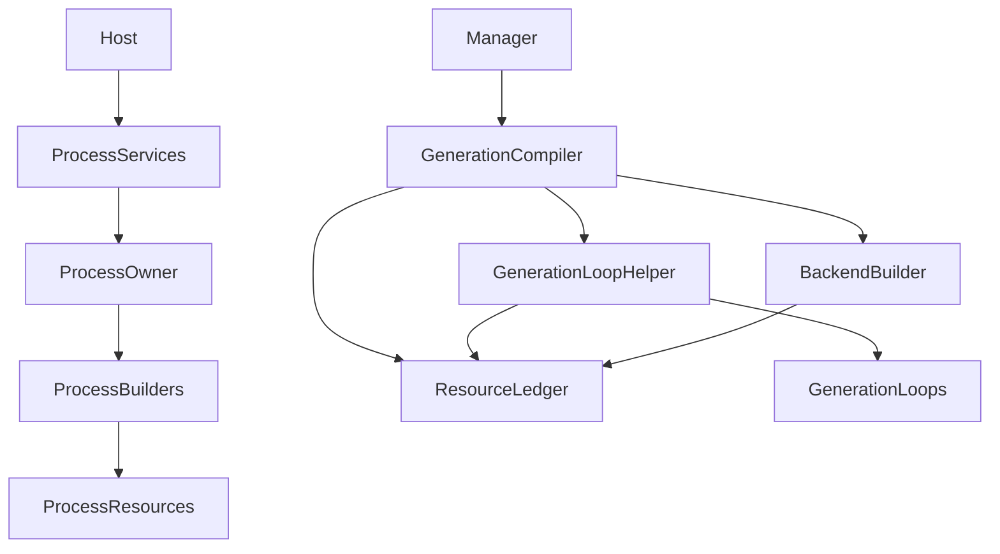
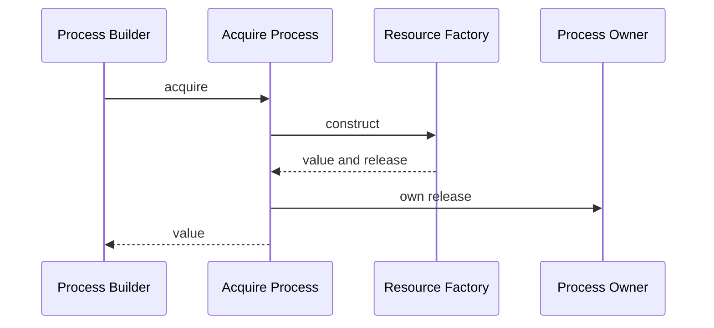
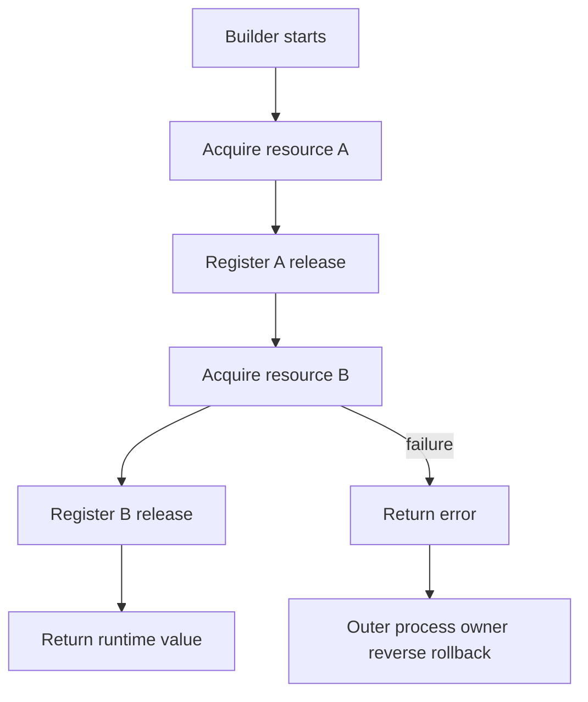
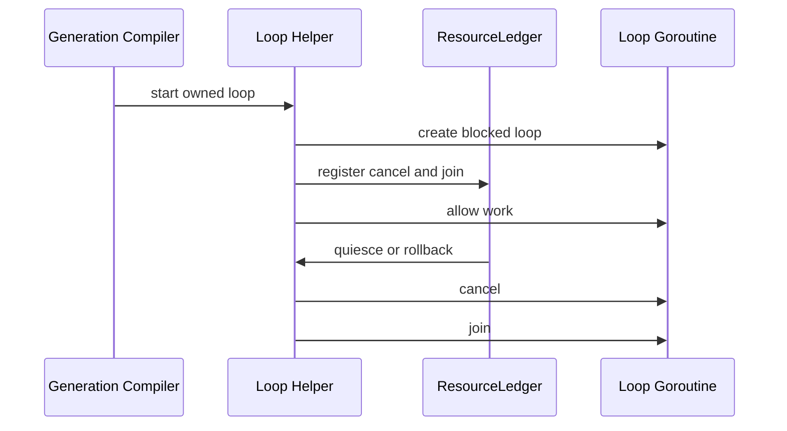

# Design Document

## Overview

This change hardens two narrow lifecycle seams in Go-LIP's composition root without changing the runtime architecture. First, process-owned resources gain a private acquire-plus-release ownership discipline so successful acquisition cannot escape selected builders before cleanup ownership is registered. Second, existing generation-owned background loops with a simple cancel-plus-join lifetime use a private helper that establishes `ResourceLedger` ownership before loop work begins.

The design deliberately does **not** implement Cordis v4. It borrows one practical invariant from Cordis's revertible effects — acquisition and its inverse should be local and transferred together — while preserving Go-LIP's current coarse-grained generation model, which is already the correct consistency boundary for proxy requests.

### Goals

- Make targeted process resource ownership explicit at acquisition time.
- Delete caller-mediated closer-list propagation from the highest-value `ProcessServices` builders.
- Make selected generation-owned cancel+join loops structurally owned by `ResourceLedger`.
- Preserve all runtime/public behavior and existing shutdown/reload semantics.
- Produce a net simplification: fewer ownership handoffs, fewer places where cleanup can be forgotten.

### Non-Goals

- No Cordis context, fibers, coeffects, reactive dependency graph, HMR, or per-component reconciliation.
- No DI framework/container, service locator, reflection, code generation, or new dependency.
- No `ResourceLedger` redesign.
- No backend plugin lifecycle/ABI redesign.
- No public SDK/API/config changes.
- No request-path, routing, streaming, session, accounting, or billing behavior changes.
- No repository-wide resource cleanup rewrite.

## Existing Architecture Analysis

Go-LIP already has the lifecycle model this feature needs to preserve:

1. `ProcessServices` owns process-scoped stores, pools, plugin-host artifacts, limiters, metrics/control-plane services, terminal workers, and other process resources.
2. `GenerationRuntime` owns an immutable request-plane generation.
3. `ResourceLedger` is the sole generation-resource lifecycle authority with prepare/activate/publish/quiesce/rollback/close phases and reverse cleanup.
4. `runtimehost.Manager` publishes generations, pins in-flight work, retires superseded generations, and closes them only after drain.
5. Backend factories already return cleanup alongside backend construction and `buildBackends` transfers it into `ResourceLedger`.

The remaining maintainability gaps are local:
- `NewProcessServices` still receives closer slices from several builders and must register them itself.
- The model-registry refresh loop manually couples goroutine start, derived cancellation, wait-group join, and ledger cleanup.

## Architecture Pattern & Boundary Map

**Selected pattern:** explicit composition-root ownership with two lifetime-specific helpers layered over existing owners.



### Architecture Integration

- **Domain/feature boundary**: all new production code stays in `internal/infra/runtimebundle`; domain/core packages are untouched.
- **Existing patterns preserved**: explicit construction, process/generation lifetime split, immutable generation publication, reverse cleanup, manager-owned retirement.
- **New component rationale**:
  - `processResourceOwner`: construction-time release stack for process-owned resources.
  - `acquireProcess`: helper that obtains `value + release`, registers release, then exposes the value.
  - generation loop helper: couples existing cancel+join loop lifetime to `ResourceLedger`.
- **Steering compliance**: no container, no global registry, no reflection, no magic registration, no new external dependency.

### Optional Hexagonal Lens

- **Domain policy**: unchanged.
- **App/use-case orchestration**: unchanged.
- **Driving adapters**: unchanged.
- **Driven adapters**: process stores/clients/workers remain concrete resources built by existing helpers.
- **Composition root**: `runtimebundle` owns this change.
- **Ports/query seams**: none added; the ownership types are private implementation infrastructure.

### Go-LIP Boundary Questions

- **Core-owned or plugin-owned?** Composition-root infrastructure, not core domain or plugin behavior.
- **New canonical concept?** No.
- **Streaming-first preserved?** Yes; request/stream execution is untouched.
- **Provider SDK leakage avoided?** Yes; no provider types enter the new helpers.
- **No retry/failover after output preserved?** Yes; executor/stream code is untouched.
- **Secure-session/diagnostics/startup security affected?** No semantic change; startup rollback is re-characterized.
- **Extension platform seam affected?** No.

## Technology Stack

| Layer | Choice | Role | Notes |
|---|---|---|---|
| Runtime composition | Existing Go runtimebundle | resource construction and lifetime transfer | no new package dependency |
| Generation lifecycle | Existing `ResourceLedger` | generation-owned cleanup authority | semantics unchanged |
| Concurrency | `context`, `sync.WaitGroup` or current project equivalent | cancel+join loop ownership | no worker framework |
| Testing | existing Go test, race, goleak/architecture gates where already available | prove lifecycle safety | no network credentials |

## System Flows

### Process Acquisition



**Invariant:** after `acquireProcess` returns a successful value, its release action is already owned. No later fallible composition step can exist between acquisition and ownership transfer.

If construction fails later, `ProcessServices` startup rollback closes the process owner in reverse acquisition order. Normal host shutdown continues to call the existing `ProcessServices.Close` path; the helper does not own process shutdown policy.

### Builder-Local Ownership



Selected builders receive the private process owner and stop returning caller-visible closer slices.

### Generation-Owned Loop



The blocked-start step prevents application work from running before ownership registration. The helper is limited to loops whose release operation is exactly cancel plus join.

## Requirements Traceability

| Requirement | Summary | Design elements |
|---|---|---|
| 1.1-1.6 | preserve converged runtime and reject over-generalization | boundaries, non-goals, private helpers |
| 2.1-2.7 | atomic process ownership | `processResourceOwner`, `acquireProcess`, existing `ProcessServices.Close` |
| 3.1-3.7 | eliminate closer propagation only where valuable | selected builder migration |
| 4.1-4.7 | structured generation loop lifetime | ledger-backed loop helper |
| 5.1-5.6 | preserve ledger/backend/runtime semantics | explicit unchanged surfaces |
| 6.1-6.9 | TDD, architecture gates, simplification | test/validation strategy |

## Components and Interfaces

| Component | Layer | Intent | Requirements | Key dependencies | Contracts |
|---|---|---|---|---|---|
| Process Resource Owner | composition root | hold process releases in acquisition order and unwind in reverse | 2, 3, 6 | existing `disposeClosers` semantics | State |
| Process Acquisition Helper | composition root | couple successful value acquisition with ownership transfer | 2, 3 | Process Resource Owner | Service |
| Generation Loop Helper | composition root | own cancel+join lifetime through `ResourceLedger` | 4, 6 | `ResourceLedger`, context, join primitive | Service |
| Migrated Process Builders | composition root | register releases locally instead of returning closer lists | 3 | Process Resource Owner | Service |
| Existing ResourceLedger | composition root | unchanged generation lifecycle authority | 1, 4, 5 | current generation compiler | Existing |
| Architecture Gates | tests | prevent abstraction creep and regression | 1, 5, 6 | archtest/source checks | Batch |

### Composition Root: Process Resource Owner

| Field | Detail |
|---|---|
| Intent | Construction-time owner for process-scoped release actions |
| Requirements | 2.1-2.7, 3.1-3.7, 6.1, 6.4-6.7 |

**Responsibilities & Constraints**

- Package-private.
- Append-only during process construction; no lookup/read API.
- Preserve reverse release ordering and aggregate-error behavior.
- Be handed only to process-lifetime builders selected by this spec.
- Do not introduce a second process shutdown coordinator; `ProcessServices.Close` remains authoritative.

**Conceptual contract**

```go
type processRelease func() error

type processResourceOwner struct {
    releases []processRelease
}

func (o *processResourceOwner) Own(release processRelease)
func (o *processResourceOwner) ReleaseAll() error
```

Exact names may follow package conventions. The important contract is one-way ownership transfer only.

### Composition Root: Process Acquisition Helper

| Field | Detail |
|---|---|
| Intent | Ensure a successful value cannot escape before its release is owned |
| Requirements | 2.1-2.6, 3.1, 3.3 |

**Conceptual contract**

```go
func acquireProcess[T any](
    ctx context.Context,
    owner *processResourceOwner,
    acquire func(context.Context) (T, processRelease, error),
) (T, error)
```

**Postconditions**

- On success, the returned value's release is already registered.
- On acquisition error, no release is registered by this helper.
- A nil/absent release is valid only for explicitly non-owning/value-only construction; owned-resource call sites must not silently omit cleanup.
- The helper does not resolve dependencies or construct arbitrary services by key.

If generic syntax is less readable at actual call sites, an equivalent non-generic private helper may be used. The invariant matters more than API cleverness.

### Composition Root: Migrated Process Builders

Target the builders that currently cross the `NewProcessServices` boundary with closer lists:

- usage authority;
- concurrency authority;
- persistence;
- process accounting stores;
- metering;
- terminal work.

Adjacent single-closer construction, including the control-plane runtime, is not a mandatory migration target. It may move only if the implementation can show a net deletion of lifecycle plumbing without changing ownership semantics.

**Migration rule**

Before:
```text
builder -> value + closers + error
caller -> register closers
```

After:
```text
builder(owner) -> value + error
builder registers each acquired release before later fallible work
```

Do not force plugin staging/artifact teardown or pool claim/prune through this shape if explicit code communicates their ordering better.

### Composition Root: Generation Loop Helper

| Field | Detail |
|---|---|
| Intent | Establish ledger-owned cancel+join before background loop work begins |
| Requirements | 4.1-4.7, 6.2-6.3 |

**Responsibilities & Constraints**

- Private to generation composition.
- Uses existing `ResourceLedger`; no parallel lifecycle state.
- Starts a goroutine in a blocked state, registers its cancel+join cleanup, then releases the start gate.
- If registration causes immediate cleanup because the ledger is already closing/quiesced, the blocked goroutine observes cancellation and exits without doing work.
- Cleanup waits for termination.
- No task queue, retry, restart, supervision tree, or error propagation framework.

**Initial migration**

The model-registry refresh loop is the mandatory first consumer. Any second consumer must have the same derived-context + cancel + join lifetime and dedicated characterization tests.

## State and Ownership Model

No persistent data model changes.

```text
Host
└── ProcessServices
    └── processResourceOwner
        ├── process resource release A
        ├── process resource release B
        └── ...

Generation
└── ResourceLedger
    ├── existing backend/catalog/client resources
    └── owned loop cancel+join release
```

Process releases are not generation entries. Generation releases are not process entries.

## Error Handling

- Preserve existing constructor error values and wrapping where practical.
- Cleanup errors continue to be aggregated while later cleanup actions still run.
- The process acquisition helper does not invent new public error categories.
- Generation loop cleanup follows existing `ResourceLedger` error handling.
- A worker loop's internal runtime errors are not generalized by this helper; existing loop-specific handling remains unchanged.

## Testing Strategy

### RED contract tests

1. Successful acquisition registers release before the caller can execute the next step.
2. Later constructor failure unwinds all earlier acquisitions in reverse order.
3. Cleanup failure does not skip subsequent cleanup.
4. Normal shutdown remains idempotent and does not double-close migrated resources.
5. Selected builders no longer require caller-visible closer aggregation.
6. Generation loop cannot perform work before ownership registration.
7. Quiesce/rollback cancels and joins the loop.
8. Already-closing/quiesced ownership does not leak or deadlock.

### Characterization before migration

- Exact current process close order for the selected builder graph.
- Partial startup failure behavior at multiple injection points.
- Backend cleanup transfer remains generation-owned and unchanged.
- Generation manager/request pinning tests remain unchanged.

### Quality and architecture gates

- No exported ownership type/helper.
- No service-locator method names or keyed lookup.
- No new dependency/container package.
- No public API/config changes.
- Targeted builder signatures no longer return closer lists.
- Raw generation-owned refresh-loop spawn is centralized in the helper after migration.
- Run focused unit tests, targeted race/leak tests, `make quality-checks`, and `make test-unit`.

## Performance

The helpers execute during process/generation construction and teardown, not per-token or normal request hot paths. No performance gain is required. Existing generation acquire/dispatch/request benchmarks must show no material regression; a regression would indicate accidental hot-path coupling and is a design violation.

## Migration Plan

1. Characterize current process close/rollback order and refresh-loop lifetime with RED tests.
2. Add the private process owner/acquisition helper without migrating call sites.
3. Migrate one process builder family and remove its caller closer plumbing; validate.
4. Continue only through the selected process builder list while each migration stays simpler.
5. Add the generation loop helper and migrate model-registry refresh.
6. Add architecture ratchets and run race/leak/quality gates.
7. Final simplification review: delete superseded plumbing; revert any migration whose code is less traceable than before.

There is no compatibility rollout, configuration flag, database migration, or user-facing transition.
