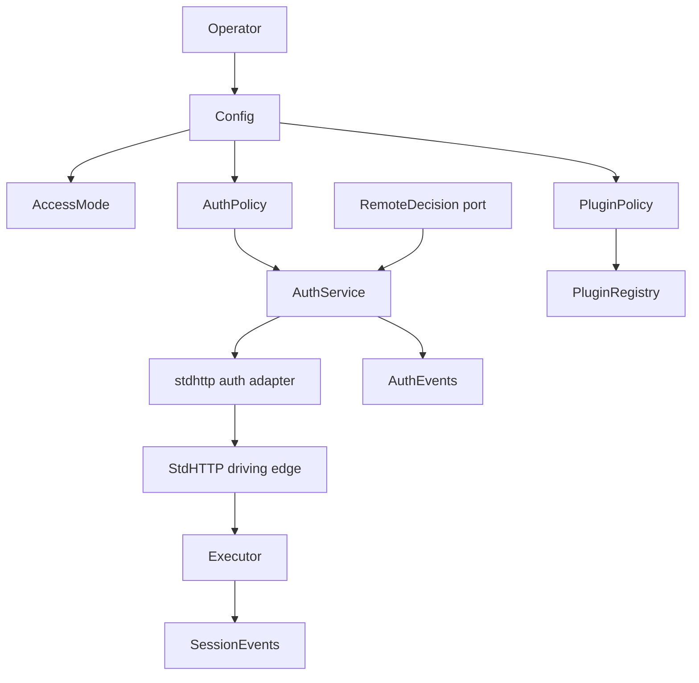
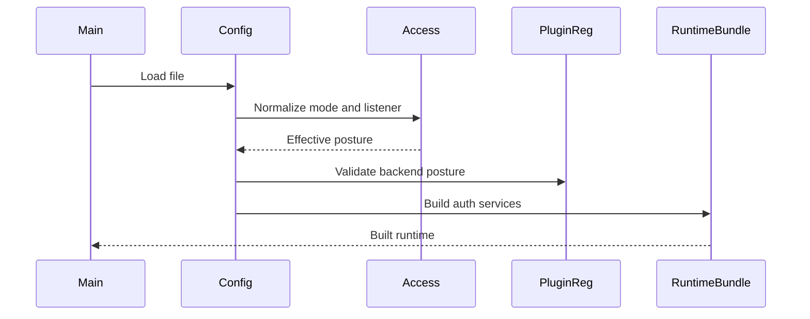
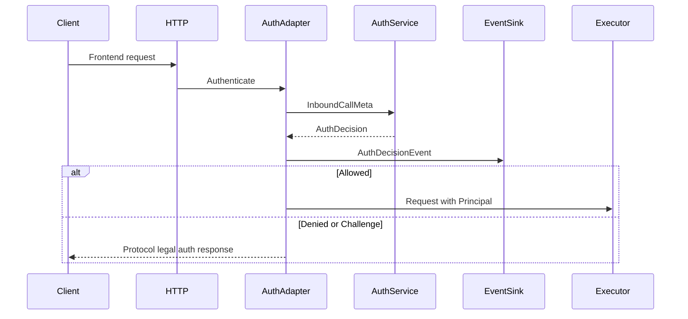
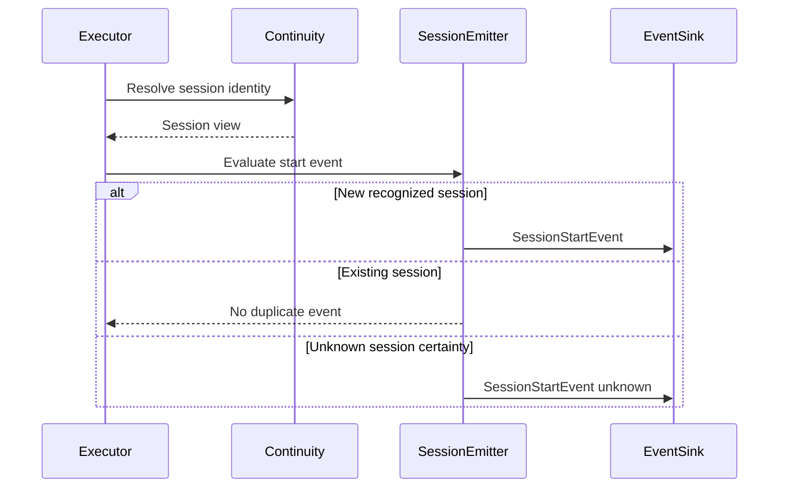
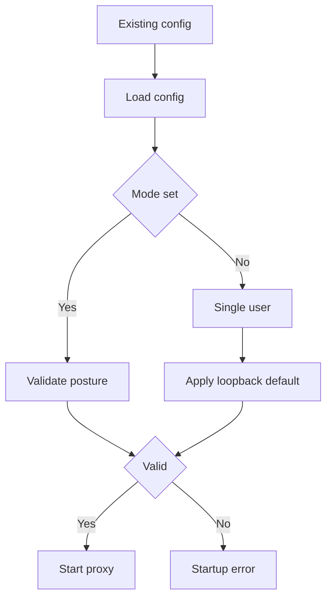

# Design Document

## Overview

This feature adds a first-class authentication and access-mode architecture to the Go LLM Interactive Proxy. It protects local single-user workflows with loopback-only defaults, requires explicit authentication for shared multi-user deployments, and creates stable auth/event abstractions that future enterprise code can implement without changing the OSS proxy core.

The design is an extension of the existing standard runtime. It reuses the current stdhttp auth middleware, principal propagation, config validation, plugin registry, and runtime preparation paths while adding new policy contracts around them. Remote auth is represented as an interface and configuration boundary only; no ConnectRPC, gRPC, HTTP, or generated-code transport is implemented in this spec.

### Goals
- Enforce explicit `single_user` and `multi_user` deployment postures before frontend traffic is accepted.
- Establish principals for all accepted requests, including explicit local no-op single-user mode.
- Support local API-key auth and remote auth delegation contracts without leaking secrets.
- Emit auth decision and session-start events with clear failure policy and session certainty semantics.
- Gate OAuth-user backend activation in multi-user mode through stable plugin metadata.

### Non-Goals
- Implementing an enterprise auth service or any concrete remote auth transport.
- Implementing a complete SSO provider or browser SSO flow.
- Adding provider-specific OAuth backend flows.
- Changing canonical LLM request or event translation.
- Changing routing, B2BUA failover, or streaming semantics.
- Making secure sessions mandatory for all multi-user deployments in this spec.

## Boundary Commitments

### This Spec Owns
- Runtime access posture: `single_user`, `multi_user`, effective listener defaulting, and bind validation.
- Auth policy model: handler kind, required level, local no-op, local API-key, and remote-delegation abstraction.
- Auth decision and session-start event contracts, redaction expectations, and failure policy handling.
- Principal establishment and propagation into existing `execview.PrincipalView` consumers.
- Backend credential posture metadata sufficient to block OAuth-user backends in multi-user mode.
- Standard distribution wiring that turns config into auth providers and startup validation.

### Out of Boundary
- Remote network transport implementation for auth instrumentation or decisions.
- Enterprise policy evaluation, SSO sessions, tenant management, or identity provider integrations.
- Provider-specific backend OAuth implementations.
- Completing secure-session runtimebundle wiring when it is not already active.
- Canonical LLM request/event model changes for auth events.
- New frontend protocol surfaces.
- Durable audit storage beyond emitting/logging event contracts.

### Allowed Dependencies
- `internal/core/config` for typed configuration and validation.
- `internal/stdhttp/auth` (driving transport adapter) and `pkg/lipsdk/transport/httpauth` for HTTP authentication adaptation at the stdhttp edge; stdhttp remains the first-class driving adapter for this feature.
- `pkg/lipsdk/execview` for principal snapshots visible to runtime and plugins.
- `internal/core/runtime`, `internal/core/continuity`, and secure-session preparation paths for session-start event context.
- `pkg/lipsdk` plugin registration contracts for backend credential posture metadata.
- Standard library packages in core policy code for crypto and encoding only, including `net` (for listener validation), `crypto/hmac`, `crypto/sha256`, and `encoding/base64` where needed for key handling.
- `os/user`, environment-based identity, and `log/slog` only in infrastructure or composition wiring (`internal/infra/...`, runtimebundle, default log-backed sinks), not in core policy as direct dependencies; core depends on small injected interfaces instead.
- Existing observability and logging infrastructure for default event visibility when selected at the composition root.

### Revalidation Triggers
- Changing auth decision, auth event, session-start event, or backend credential posture contract shapes.
- Adding a concrete remote auth transport or generated remote API schema.
- Changing frontend auth error rendering behavior for any bundled protocol surface.
- Making secure sessions mandatory for multi-user mode.
- Changing default listener semantics or access-mode validation rules.
- Widening `pkg/lipapi` canonical LLM contracts for auth-related data.

## Architecture

### Existing Architecture Analysis

The repo already has transport-level auth provider chaining in `internal/stdhttp/auth`, principal context propagation through `pkg/lipsdk/execview`, and runtime preparation paths that expose principal/session/workspace views to hooks and diagnostics. The standard distribution composes runtime dependencies through `cmd/lipstd`, `internal/pluginreg`, `internal/infra/runtimebundle`, and `internal/stdhttp`.

The main gap is a policy layer. Today an empty auth provider list is pass-through, `server.address` defaults to `:8080`, plugin metadata does not classify credential posture, and security-sensitive events are not modeled separately from fail-open session hooks or traffic observers.

### Architecture Pattern & Boundary Map

Selected pattern: a small core-owned policy layer with stdhttp as the primary driving transport adapter. Auth decisions are expressed with protocol- and transport-neutral types, then mapped into the existing `httpauth.Provider` chain. Session-start events are emitted from runtime preparation because that is where proxy session identity is available.



Architecture integration:
- Policy boundaries: access-mode validation, auth decisions, event emission, and backend credential posture are separate policy concerns.
- Existing patterns preserved: typed config, explicit composition, plugin-private config opacity, principal propagation, and streaming-first executor behavior.
- New components rationale: the current HTTP auth seam is not sufficient to own access modes, API-key identity, event failure policy, or remote auth abstraction.
- Steering compliance: no provider SDKs enter core; plugin-specific config remains opaque; canonical LLM contracts are unchanged.

### Technology Stack

| Layer | Choice / Version | Role in Feature | Notes |
|-------|------------------|-----------------|-------|
| Runtime | Go 1.26.2 | Auth policy, config validation, event contracts | Existing toolchain from `go.mod` |
| HTTP transport | `net/http` | Existing stdhttp middleware adapter | No new HTTP framework |
| Public contracts | `pkg/lipsdk` | Auth/event and backend security metadata | Minimal stable surface |
| OS identity | `os/user` plus environment fallback | Single-user principal inference | Abstracted for tests and service-context fallback |
| Crypto | standard library HMAC SHA256 | API-key fingerprinting and comparison | No new dependency |
| Remote auth | Interface only | Future enterprise or transport adapter injection | No concrete transport in this spec |

## File Structure Plan

### Directory Structure

```text
pkg/lipsdk/
├── auth/
│   ├── model.go              # Inbound call metadata, Decision, policy levels, identity snapshots (no net/http or httprequest types)
│   └── events.go             # AuthDecisionEvent and SessionStartEvent DTOs; error categories
├── backend_security.go       # BackendCredentialMode and BackendSecurityProfile metadata
└── contracts.go              # Registration extended with security profile or metadata accessors

internal/core/
├── accessmode/
│   ├── model.go              # Mode values and effective mode normalization
│   ├── listener.go           # Listener address parsing and loopback validation
│   └── validate.go           # Cross-field access posture validation
├── auth/
│   ├── ports.go              # Consuming ports: EventSink, RemoteDecider, Authenticator; methods use pkg/lipsdk/auth DTOs
│   ├── local_noop.go         # Explicit local no-op authenticator
│   ├── local_apikey.go       # Local API-key authenticator and redacted key identity
│   ├── policy.go             # Policy validation and effective auth handler selection
│   ├── events.go             # EventDispatcher and failure policy application
│   └── session_start.go      # Runtime session-start event helper
└── config/
    ├── access_auth_model.go  # Access and auth YAML config structs
    └── access_auth_validate.go # Config validation bridge for access and auth policy

internal/infra/
└── osidentity/
    └── current.go            # OS current-user lookup with environment fallback

internal/infra/runtimebundle/
└── auth.go                   # Build auth services/providers from validated config and optional remote client

internal/stdhttp/auth/
├── adapter.go                # Authenticator to httpauth.Provider adapter and event emission
├── error_renderer.go         # AuthErrorRenderer contract and default safe HTTP rendering
└── middleware.go             # Existing provider-chain middleware with minimal protocol-aware termination support

internal/pluginreg/
├── reg.go                    # Backend factory entries include security profile
└── validate.go               # Access-mode aware backend credential posture checks

cmd/lipstd/
└── main.go                   # Wires config-derived auth services into runtimebundle
```

### Modified Files
- `config/config.yaml` — document safe single-user defaults and examples for multi-user auth.
- `internal/core/config/model.go` — add `Access` and `Auth` config fields or embed from `access_auth_model.go`.
- `internal/core/config/loader.go` — replace unconditional `:8080` default with mode-aware effective listener defaulting.
- `internal/core/config/validate.go` — invoke access/auth cross-field validation.
- `internal/infra/runtimebundle/options.go` — add optional `RemoteDecider` and `EventSink` (core ports) injection points.
- `internal/infra/runtimebundle/build.go` — construct auth providers and pass event sinks into runtime/executor plumbing.
- `internal/core/runtime/executor.go` — add session-start event sink fields if event emission is not held in runtime snapshot.
- `internal/core/runtime/executor_prepare.go` — emit session-start events for legacy continuity path.
- `internal/core/runtime/executor_prepare_secure.go` — emit session-start events when the secure-session path is already active; this spec does not complete secure-session runtimebundle wiring.
- `pkg/lipsdk/contracts.go` — add backend security profile field or accessor-compatible metadata without exposing plugin-private config.
- `internal/pluginreg/*_install.go` — declare credential posture for bundled backend factories.

## System Flows

### Startup Validation and Wiring



Key decisions:
- Validation happens before frontend traffic is accepted.
- Single-user defaults resolve to loopback, not broad bind.
- Remote mode requires an injected remote decision client; the standard OSS binary does not create a network client.

### Frontend Auth Decision



Key decisions:
- Rejected or challenged requests never open backend attempts.
- Auth decision events are emitted for allowed, denied, challenged, and failed outcomes.
- Protocol-specific auth body rendering is an adapter concern and does not enter canonical LLM events.

### Session Start Event



Key decisions:
- Session-start events are based on proxy-recognized session identity.
- Secure-session disabled paths use available continuity/session hints and report reduced certainty.

## Requirements Traceability

| Requirement | Summary | Components | Interfaces | Flows |
|-------------|---------|------------|------------|-------|
| 1.1, 1.2, 1.3, 1.4, 1.5, 1.6, 1.7 | Access mode selection and explicit no-op distinction | AccessMode, ConfigValidation, RuntimeBundleAuthBuilder | AccessConfig, Mode | Startup Validation |
| 2.1, 2.2, 2.3, 2.4, 2.5, 2.6 | Single-user loopback binding and safe defaulting | AccessMode, ListenerValidator, ConfigLoader | EffectiveListener | Startup Validation |
| 3.1, 3.2, 3.3, 3.4, 3.5, 3.6 | Multi-user binding, auth requirement, backend unopened on reject | AccessMode, AuthService, HTTPAuthAdapter | AuthDecision | Frontend Auth Decision |
| 4.1, 4.2, 4.3, 4.4, 4.5, 4.6 | Auth policy levels and API-key plus SSO distinction | AuthPolicy, AuthService, RemoteDecider | AuthLevel, DeviceIdentity | Frontend Auth Decision |
| 5.1, 5.2, 5.3, 5.4, 5.5, 5.6 | Explicit local no-op principal and events | LocalNoOpAuthenticator, OSIdentityProvider, EventDispatcher | Authenticator, AuthDecisionEvent | Frontend Auth Decision |
| 6.1, 6.2, 6.3, 6.4, 6.5, 6.6 | Local API-key validation and secret handling | LocalAPIKeyAuthenticator, SecretFingerprint | LocalAPIKeyRecord | Frontend Auth Decision |
| 7.1, 7.2, 7.3, 7.4, 7.5, 7.6, 7.7 | Remote auth abstraction and fail-closed behavior | AuthService (remote branch), RuntimeBundleAuthBuilder | RemoteDecider | Frontend Auth Decision |
| 8.1, 8.2, 8.3, 8.4, 8.5, 8.6, 8.7 | Auth decision event delivery and failure policy | EventDispatcher, core EventSink | AuthDecisionEvent, EventFailurePolicy | Frontend Auth Decision |
| 9.1, 9.2, 9.3, 9.4, 9.5, 9.6, 9.7 | Session-start event semantics and uncertainty | SessionStartEmitter, ExecutorSessionHooks | SessionStartEvent | Session Start Event |
| 10.1, 10.2, 10.3, 10.4, 10.5, 10.6, 10.7 | OAuth-user backend eligibility | BackendSecurityProfile, PluginRegistryValidation | BackendCredentialMode | Startup Validation |
| 11.1, 11.2, 11.3, 11.4, 11.5, 11.6 | Cross-field validation and startup feedback | ConfigValidation, RuntimeBundleAuthBuilder | ValidationError | Startup Validation |
| 12.1, 12.2, 12.3, 12.4, 12.5, 12.6, 12.7 | Runtime compatibility and protocol boundaries | HTTPAuthAdapter, Executor, FrontendErrorRenderer | AuthDecision, PrincipalView | Frontend Auth Decision |
| 13.1, 13.2, 13.3, 13.4, 13.5 | Secret redaction and safe errors | SecretFingerprint, EventDispatcher, AuthService | RedactedSecretID | All flows |

## Components and Interfaces

| Component | Layer (this repo) | Intent | Req Coverage | Key Dependencies | Contracts |
|-----------|-------------------|--------|--------------|------------------|-----------|
| AccessMode | Core policy | Normalize and validate deployment posture | 1, 2, 3, 11 | Config P0, net P0 | Service, State |
| AuthService | Core auth | Evaluate auth requests and produce typed decisions | 3, 4, 5, 6, 7, 13 | Config P0, EventDispatcher P1 | Service |
| HTTPAuthAdapter | stdhttp driving edge | Map `http.Request` fields into `lipsdk/auth` inbound DTOs and `httpauth.Provider` results | 3, 8, 12 | stdhttp P0, AuthService P0 | Service, API |
| AuthErrorRenderer | stdhttp driving edge | Render denied or challenged auth decisions into safe protocol-legal HTTP responses | 3, 6, 7, 12, 13 | HTTPAuthAdapter P0, frontend metadata P1 | Service, API |
| EventDispatcher | Core auth events | Emit auth decision and session-start events with failure policy | 5, 8, 9, 13 | core `EventSink` port P0; default log sink via infra at wiring P1 | Event, Service |
| SessionStartEmitter | Core runtime | Detect and emit session-start events after session resolution | 8, 9, 12 | Executor P0, EventDispatcher P0 | Event, Service |
| BackendSecurityProfile | Plugin SDK | Declare backend credential posture independent of plugin config | 10, 11 | lipsdk Registration P0 | State |
| RuntimeBundleAuthBuilder | Composition | Build configured auth providers and validate required injected interfaces | 1, 3, 7, 11 | Config P0, runtimebundle P0 | Service |
| OSIdentityProvider | Infrastructure | Resolve current OS user for local no-op principal | 5, 13 | `os/user` and env only in adapter impl | Service |

### Contract layout: public DTOs vs core-owned ports

`pkg/lipsdk/auth` holds stable DTOs and event shapes. `internal/core/auth` defines **consuming ports** (`Authenticator`, `RemoteDecider`, `EventSink`) that use those DTOs. stdhttp remains the **driving** adapter that maps `http.Request` into `InboundCallMeta`.

#### `pkg/lipsdk/auth` (public DTOs and enums)

| Field | Detail |
|-------|--------|
| Intent | Stable, versionable auth and event *data* shapes for the SDK; ports live in the packages that consume them (see `internal/core/auth/ports` in the file plan) |
| Requirements | 3.4, 4.1, 4.5, 7.1, 7.2, 8.3, 9.3, 13.1 |

**Responsibilities & Constraints**
- Hold protocol- and transport-neutral request metadata, auth decisions, and event payloads (no `http.Request`, `http.Header`, or handler-specific types).
- Reuse `execview.PrincipalView` for the principal visible to runtime and plugins.
- Avoid ConnectRPC, gRPC, provider SDK, or enterprise-only types.
- Keep secret-bearing values out of event and diagnostic structs.

**Contracts**: DTOs / enums [x] / Events [x] — not application “domain” entities; this is the stable plugin-facing contract surface, not a classic domain layer in this core/plugin architecture.

##### Data shapes (illustrative)

```go
package auth

type HandlerKind string
type RequiredLevel string
type DecisionOutcome string

const (
    HandlerLocalNoop HandlerKind = "local_noop"
    HandlerLocalAPIKey HandlerKind = "local_api_key"
    HandlerRemote HandlerKind = "remote"

    LevelNone RequiredLevel = "none"
    LevelAPIKey RequiredLevel = "api_key"
    LevelAPIKeySSO RequiredLevel = "api_key_sso"

    OutcomeAllow DecisionOutcome = "allow"
    OutcomeDeny DecisionOutcome = "deny"
    OutcomeChallenge DecisionOutcome = "challenge"
)

// InboundCallMeta is populated by the stdhttp auth adapter from HTTP; it must not use net/http types in the public contract.
type InboundCallMeta struct {
    TraceID string
    Frontend string
    Method string
    Path string
    ClientAddr string
    AuthorizationBearer string
    SessionHint string
}

type DeviceIdentity struct {
    ID string
    KeyID string
    Fingerprint string
}

type Decision struct {
    Outcome DecisionOutcome
    Principal execview.PrincipalView
    Device DeviceIdentity
    SatisfiedLevel RequiredLevel
    Challenge Challenge
    ReasonCode string
}
```

- Preconditions: `InboundCallMeta.TraceID`, `Frontend`, and configured policy context are populated by the stdhttp adapter or composition root.
- Postconditions: `OutcomeAllow` decisions contain a non-empty principal when execution may continue.
- Invariants: Secret material in `InboundCallMeta` is not copied into events or logs. Remote and local handlers implement the core-defined `Authenticator` / `RemoteDecider` ports (below), not this package.

#### `internal/core/auth` (consuming ports)

Ports are defined in the **consuming** package. Implementations of these interfaces may live in core (`local_noop`, `local_apikey`), infrastructure remote adapters, or a future external binary, but the interface is owned by core.

```go
package auth // internal/core/auth

import (
    "context"

    "github.com/.../pkg/lipsdk/auth"
)

type Authenticator interface {
    Authenticate(ctx context.Context, req auth.InboundCallMeta) (auth.Decision, error)
}

// RemoteDecider is the consumer-side port for delegated decisions; no transport, only the contract the composition root must satisfy when remote mode is selected.
type RemoteDecider interface {
    Decide(ctx context.Context, req auth.InboundCallMeta) (auth.Decision, error)
}

// EventSink receives event DTOs from pkg/lipsdk/auth; core’s EventDispatcher depends on this port, not on slog.
type EventSink interface {
    OnAuthDecision(ctx context.Context, ev auth.AuthDecisionEvent) error
    OnSessionStart(ctx context.Context, ev auth.SessionStartEvent) error
}
```

##### Event DTOs (in `pkg/lipsdk/auth`)

Auth decision and session-start *schemas* live alongside the data shapes above, for example `AuthDecisionEvent` and `SessionStartEvent` with the non-secret field lists in “Data Models” below.

##### Event delivery (core-owned)

- Event DTOs are published as values of types defined in `pkg/lipsdk/auth`.
- `AuthDecisionEvent` is emitted at every auth decision point; `SessionStartEvent` is emitted when runtime identifies a new proxy-recognized session or an explicit unknown-certainty outcome.
- Ordering: auth decision before backend execution; session-start after session resolution and before backend opening when possible. Event failure policy is applied in core before continuing.

### Core Policy Components

#### AccessMode

| Field | Detail |
|-------|--------|
| Intent | Compute and validate effective deployment posture |
| Requirements | 1.1, 1.2, 1.3, 1.4, 1.5, 1.6, 2.1, 2.2, 2.3, 2.4, 2.5, 3.1, 3.2, 11.1, 11.6 |

**Responsibilities & Constraints**
- Default absent mode to `single_user`.
- Default absent single-user address to a loopback listener.
- Reject broad or non-loopback binds in single-user mode.
- Require non-noop authentication in multi-user mode.

**Contracts**: Service [x] / API [ ] / Event [ ] / Batch [ ] / State [x]

##### Service Interface

```go
type Mode string

const (
    ModeSingleUser Mode = "single_user"
    ModeMultiUser Mode = "multi_user"
)

type ListenerDecision struct {
    Address string
    Host string
    Port string
    Loopback bool
    Broad bool
}

func NormalizeMode(raw string) (Mode, error)
func EffectiveListener(mode Mode, configured string) (ListenerDecision, error)
func ValidatePosture(input PostureInput) error
```

**Implementation Notes**
- Integration: Called from config loading and validation before runtimebundle build.
- Validation: Table tests cover `127.0.0.1`, `127.0.0.0/8`, `::1`, empty host, `:8080`, `0.0.0.0`, `[::]`, hostnames, and malformed addresses.
- Risks: Hostname resolution can be environment-dependent; validation should prefer explicit IP handling and conservative errors for ambiguous broad binds.

#### AuthService

| Field | Detail |
|-------|--------|
| Intent | Enforce configured auth level through local no-op, local API-key, or remote-delegated decision source |
| Requirements | 3.4, 3.5, 4.1, 4.2, 4.3, 4.4, 4.5, 4.6, 5.1, 5.2, 5.3, 5.4, 6.1, 6.2, 6.3, 6.4, 6.6, 7.1, 7.2, 7.3, 7.4, 7.5, 7.6, 7.7 |

**Responsibilities & Constraints**
- Enforce required level using only `InboundCallMeta` and policy; no `http` types in the core service API.
- Treat explicit local no-op as a real authenticator that creates a principal.
- Validate local API-key records at startup.
- Use the core `RemoteDecider` port without any knowledge of wire protocol or client implementation.

**Contracts**: Service [x] / API [ ] / Event [ ] / Batch [ ] / State [ ]

##### Service Interface

```go
// internal/core/auth — Handler implements the local Authenticator port (no-op, API key) or a facade over RemoteDecider.
type Service struct {
    Handler       Authenticator
    RequiredLevel lipsdkauth.RequiredLevel
}

func (s Service) Authenticate(ctx context.Context, req lipsdkauth.InboundCallMeta) (lipsdkauth.Decision, error)
```

**Implementation Notes**
- Integration: Built by `RuntimeBundleAuthBuilder` and adapted by `HTTPAuthAdapter`.
- Validation: Unit tests cover no-op, missing handler, valid/invalid API key, API-key-plus-SSO challenge, remote unavailable, and remote unusable decisions.
- Risks: API-key-plus-SSO is only policy-level semantics in OSS unless a `RemoteDecider` implementation supplies SSO state.

#### EventDispatcher

| Field | Detail |
|-------|--------|
| Intent | Provide consistent auth and session event delivery with failure policy |
| Requirements | 5.5, 8.1, 8.2, 8.3, 8.4, 8.5, 8.6, 8.7, 9.2, 9.3, 9.6, 13.2, 13.3 |

**Responsibilities & Constraints**
- Emit auth decision and session-start events to configured sinks.
- When no custom sink is configured, the composition root wires a default operator-observable sink (typically an infra adapter that uses structured logging; core does not import `log/slog` for this default).
- Apply fail-closed or best-effort policy where configured.
- Redact or omit all secret-bearing data.

**Contracts**: Service [x] / API [ ] / Event [x] / Batch [ ] / State [ ]

##### Event types (policy, not another transport)

```go
type EventFailurePolicy string

const (
    EventFailureBestEffort EventFailurePolicy = "best_effort"
    EventFailureFailClosed EventFailurePolicy = "fail_closed"
)
```

`EventSink` is defined in `internal/core/auth` (see “consuming ports”); event structs remain in `pkg/lipsdk/auth`.

**Implementation Notes**
- Integration: Auth decision path invokes before continuing to executor; session-start path invokes from runtime preparation.
- Validation: Tests assert events contain no bearer/API-key/SSO/resume token material.
- Risks: Fail-closed event policy can reject requests because an audit sink is down; startup docs must make this explicit.

### Transport and Runtime Components

#### HTTPAuthAdapter

| Field | Detail |
|-------|--------|
| Intent | Bridge HTTP requests to protocol-neutral auth decisions and existing `httpauth.Provider` results |
| Requirements | 3.5, 3.6, 6.3, 7.3, 8.1, 8.2, 12.2, 12.6 |

**Responsibilities & Constraints**
- Extract bearer credentials and request metadata from HTTP.
- Invoke `AuthService` and `EventDispatcher`.
- Attach `execview.PrincipalView` to context on allow.
- Delegate denied and challenged decisions to `AuthErrorRenderer` before returning an `httpauth.AuthenticationResult`.

**Contracts**: Service [x] / API [x] / Event [ ] / Batch [ ] / State [ ]

**Implementation Notes**
- Integration: Existing `stdauth.Middleware` remains the provider-chain runner; this adapter is one configured provider.
- Validation: Integration tests assert denied requests do not call frontend handler or backend executor.
- Risks: Some frontend protocols may expect specific auth error JSON bodies; `AuthErrorRenderer` owns formatting while auth policy remains in `AuthService`.

#### AuthErrorRenderer

| Field | Detail |
|-------|--------|
| Intent | Convert auth deny and challenge decisions into safe HTTP responses compatible with the active frontend surface |
| Requirements | 3.5, 6.3, 7.3, 12.2, 12.6, 13.2, 13.4 |

**Responsibilities & Constraints**
- Accept a protocol-neutral auth decision and request surface metadata.
- Return HTTP status, headers, content type, and safe response body for `httpauth.TypeReject` or `httpauth.TypeChallenge`.
- Provide a default generic renderer for surfaces without protocol-specific auth error requirements.
- Allow frontend mount metadata to supply an optional renderer for protocol-specific error bodies.
- Keep auth policy decisions outside frontend plugins; renderers format an already-made decision only.
- Never include raw credentials or existence-revealing secret details in response bodies or headers.

**Contracts**: Service [x] / API [x] / Event [ ] / Batch [ ] / State [ ]

##### Service Interface

```go
type AuthErrorRenderInput struct {
    FrontendID string
    RequestPath string
    Decision auth.Decision
    DefaultStatus int
    ChallengeHeaders http.Header
}

type AuthErrorRenderResult struct {
    Status int
    Headers http.Header
    ContentType string
    Body []byte
}

type AuthErrorRenderer interface {
    RenderAuthError(ctx context.Context, in AuthErrorRenderInput) AuthErrorRenderResult
}
```

- Preconditions: `Decision.Outcome` is `deny` or `challenge`; `FrontendID` is the best frontend identity known to stdhttp routing.
- Postconditions: result contains a non-zero status and a body safe for client visibility.
- Invariants: renderers do not re-authenticate, do not open backends, and do not inspect raw secret material.

**Implementation Notes**
- Integration: `HTTPAuthAdapter` calls renderer before creating `httpauth.AuthenticationResult`; existing middleware remains the writer of terminal HTTP responses.
- Validation: Protocol compatibility tests cover default rendering and each bundled frontend renderer that opts into protocol-specific bodies.
- Risks: Route-to-frontend identification may be imperfect before mux dispatch; design allows default rendering where no frontend-specific renderer can be selected safely.

#### SessionStartEmitter

| Field | Detail |
|-------|--------|
| Intent | Emit session-start events when runtime recognizes a new client-facing session |
| Requirements | 9.1, 9.2, 9.3, 9.4, 9.5, 9.6, 9.7, 12.4 |

**Responsibilities & Constraints**
- Use resolved secure-session identity when available.
- Use continuity A-leg/session hints in legacy mode.
- Avoid duplicate events for sessions recognized as existing by the current store path.
- Emit reduced-certainty outcome when stable session identity is unavailable.
- Do not make secure-session activation or runtimebundle wiring a prerequisite for this spec.

**Contracts**: Service [x] / API [ ] / Event [x] / Batch [ ] / State [ ]

**Implementation Notes**
- Integration: Called in both `prepareSubmitAndALegLegacy` and `prepareSubmitAndALegSecure` after principal/session view is known.
- Integration: The secure path emits events only when secure sessions are already active through existing runtime configuration; otherwise the legacy path is authoritative.
- Validation: Tests cover new legacy A-leg, existing A-leg, secure `BeginTurn` new/resume, and missing session identity.
- Risks: Without durable secure sessions, dedupe is limited to what existing continuity or secure-session stores can recognize.

### Composition and Plugin Components

#### RuntimeBundleAuthBuilder

| Field | Detail |
|-------|--------|
| Intent | Convert validated config and optional injected clients into runtime auth services |
| Requirements | 1.7, 3.2, 3.3, 7.5, 7.6, 11.1, 11.2, 11.3, 11.4 |

**Responsibilities & Constraints**
- Build explicit local no-op and local API-key authenticators.
- Require injected `RemoteDecider` when config selects remote auth.
- Surface effective mode, listener, and auth level at startup.
- Keep concrete remote transport out of this spec.

**Contracts**: Service [x] / API [ ] / Event [ ] / Batch [ ] / State [ ]

##### Service Interface

`RemoteDecider` and `EventSink` are the `internal/core/auth` ports; `runtimebundle` (composition) imports that package to wire them.

```go
type AuthBuildOptions struct {
    RemoteDecider RemoteDecider
    EventSink     EventSink
    OSIdentity    OSIdentityProvider
}

func BuildHTTPAuthProviders(cfg config.Config, opts AuthBuildOptions) ([]httpauth.Provider, EventSink, error)
```

#### BackendSecurityProfile

| Field | Detail |
|-------|--------|
| Intent | Provide stable backend credential posture metadata for access-mode validation |
| Requirements | 10.1, 10.2, 10.3, 10.4, 10.5, 10.6, 10.7, 11.5 |

**Responsibilities & Constraints**
- Classify backend factories as static credentials, workload credentials, OAuth-user credentials, or unknown.
- Reject enabled OAuth-user backends in multi-user mode.
- Avoid core inspection of backend plugin-private config.

**Contracts**: Service [ ] / API [ ] / Event [ ] / Batch [ ] / State [x]

##### State Model

```go
type BackendCredentialMode string

const (
    CredentialStatic BackendCredentialMode = "static"
    CredentialWorkload BackendCredentialMode = "workload"
    CredentialOAuthUser BackendCredentialMode = "oauth_user"
    CredentialUnknown BackendCredentialMode = "unknown"
)

type BackendSecurityProfile struct {
    CredentialMode BackendCredentialMode
}
```

**Implementation Notes**
- Integration: Registry stores profile alongside backend factory; config validation checks enabled backend rows by factory key.
- Validation: Tests assert multi-user rejects OAuth-user, permits static/workload, and does not silently disable enabled invalid rows.
- Risks: Unknown mode policy must be conservative for newly added backends; design recommends rejecting unknown enabled backends in multi-user unless explicitly classified.

## Data Models

### Policy and public contract model (not a dedicated domain layer)

This project’s architecture is **core + plugins + stdhttp driving adapter**, not a classic DDD “domain” stack. The following are **policy state and stable public DTOs**:

- `AccessMode`: single-user or multi-user runtime posture, immutable after startup.
- `AuthPolicy`: handler kind plus required level.
- `Principal`: runtime identity snapshot represented as `execview.PrincipalView`.
- `DeviceIdentity`: API-key or app/device identity distinct from human principal.
- `Decision` (allow, deny, challenge) with reason code and satisfied auth level; distinct from event records.
- `AuthDecisionEvent`: non-secret audit record for one auth decision.
- `SessionStartEvent`: non-secret audit record for a newly recognized or uncertain session start.
- `BackendSecurityProfile`: plugin metadata for credential posture.

### Logical Data Model

No durable storage is introduced by this spec. Local API-key records are runtime configuration records. Event delivery uses configured sinks and default operator-observable logging. Remote auth config stores endpoint-like and handler-selection data only as opaque config for future injected clients; no network client is created by this design.

### Data Contracts & Integration

Event schema fields:
- Common: `trace_id`, `time`, `access_mode`, `required_level`, `handler_kind`, `frontend`, `outcome`, `reason_code`.
- Principal: `principal_id`, `display_name`, `roles`, safe claims.
- Device: `device_id`, `key_id`, redacted `fingerprint`.
- Session: `session_id`, `client_session_hint`, `a_leg_id`, `certainty`, `is_new`.

Forbidden fields in events and logs: bearer token, raw API key, raw SSO token, raw resume token, personal OAuth token.

## Error Handling

### Error Strategy

- Startup validation errors fail fast and identify the invalid setting plus violated rule.
- Request auth errors fail before frontend decode reaches backend execution.
- Remote decision errors fail closed when protected auth is required.
- Event sink errors follow configured `best_effort` or `fail_closed` policy.
- Secret-bearing values are never included in errors.

### Error Categories and Responses

| Category | Examples | Response |
|----------|----------|----------|
| Configuration | unknown mode, single-user broad bind, missing remote client, invalid API-key record | Startup failure |
| Authentication | missing key, invalid key, SSO required, remote denial | Protocol-legal reject or challenge |
| Auth infrastructure | remote unavailable, event sink failure with fail-closed | Protected request denied before backend open |
| Internal | OS identity lookup failure in local no-op | Fallback principal plus operator-visible warning |

### Monitoring

- Startup log includes effective access mode, listener, auth handler kind, and required level.
- Auth decision and session-start events are emitted through the core `EventSink` port; the default implementation is wired at the composition root and typically uses structured logs without pulling `log/slog` into core policy packages.
- Metrics may be added later through the existing observability pattern but are not required by this spec.

## Testing Strategy

### Unit Tests
- `internal/core/accessmode`: validate mode normalization, loopback detection, broad bind rejection, and safe default listener behavior for `1.1-2.6`.
- `internal/core/auth`: validate local no-op principal creation, fallback identity, API-key matching, invalid records, required-level enforcement, and remote fail-closed decisions for `4.1-7.7`.
- `internal/core/auth`: verify fingerprints and events never include raw API keys, SSO tokens, resume proofs, or OAuth tokens for `8.6, 9.6, 13.1-13.5`.
- `pkg/lipsdk`: validate backend credential posture defaults and registration metadata behavior for `10.1-10.7`.

### Integration Tests
- Config loading and validation rejects `single_user` with `:8080`, `0.0.0.0`, and `[::]`, and defaults absent address to loopback for `2.1-2.6, 11.1-11.6`.
- stdhttp auth adapter denies/challenges missing or invalid credentials and proves the inner frontend/backend handler is not invoked for `3.4-3.6, 12.2`.
- runtimebundle builds local no-op and local API-key providers from config and fails startup for remote auth without an injected `RemoteDecider` for `5.1-7.7`.
- plugin registry/config validation rejects enabled OAuth-user backends in multi-user mode and permits eligible non-OAuth-user backends for `10.3-10.7`.
- executor prepare emits session-start events for new legacy and secure sessions and skips duplicates for recognized existing sessions for `9.1-9.7`.

### Protocol Compatibility Tests
- Each bundled frontend surface receives a legal auth reject/challenge response before backend execution for `3.5, 6.3, 7.3, 12.6`.
- Authenticated streaming requests preserve existing canonical stream ordering and cancellation behavior for `12.1, 12.3`.

### Security Tests
- Logs, diagnostics, auth decision events, session-start events, and startup errors are scanned for configured secret strings.
- Constant-time API-key comparison is covered indirectly by unit tests using the local API-key validator path.
- Remote unavailable and event sink fail-closed behavior are tested to ensure no permissive fallback occurs.

## Security Considerations

- Absence of auth is never equivalent to local no-op; local no-op is an explicit authenticator that creates an auditable principal.
- Multi-user mode rejects no-auth and OAuth-user backends at startup.
- API keys are compared using constant-time checks against configured secret material or derived validation material.
- Secret-derived correlation uses non-secret key IDs or redacted fingerprints.
- Remote auth cannot become fail-open when protected auth is required.
- Auth and session events are outside the canonical LLM stream to prevent accidental exposure to clients or backends.

## Performance & Scalability

- Local no-op and local API-key decisions run before frontend decode and should add negligible latency.
- Local API-key lookup uses an in-memory map keyed by non-secret key ID or derived lookup token after config validation.
- Event emission defaults to structured logging; configured fail-closed sinks can add request latency and should be documented.
- Remote auth performance is not designed in this spec because no concrete transport is included.

## Migration Strategy



- Existing configs that omit `access.mode` become `single_user`.
- Existing configs that omit `server.address` use a loopback default instead of broad bind.
- Existing configs that explicitly set broad binds must opt into `multi_user` and configure authentication.
- Documentation and sample config must call out the change from `:8080` to loopback-effective default.
