# Design Document

## Overview

B-Leg Path Virtualization is an opt-in feature that shortens repeated absolute workspace paths only on model-facing, path-bearing tool surfaces. The A-leg/client continues to use real filesystem paths. The B-leg/model may see a shorter virtual root. Model-emitted virtual paths are expanded back to real paths before existing tool policy/reactor processing and before client release.

V1 maps only the authoritative `Workspace.ProjectRoot`. The mapping is deterministic, stateless, cross-platform, and **workspace-bound**: every virtual root includes a collision-resistant tag derived from the originating project root. An alias from a previous project root therefore cannot be rebound to the current workspace after a root change.

The feature remains provider-neutral and canonical. It does not rewrite arbitrary prompt/completion text, does not scan source/patch bodies for paths, and does not introduce a persistent general-purpose alias dictionary.

### Goals
- Reduce backend-visible repeated absolute-path bytes/tokens.
- Preserve real-path A-leg/client truth.
- Support POSIX, Windows drive, UNC, extended drive, and extended UNC paths independent of proxy host OS.
- Restrict mutation to proven/configured path-bearing tool fields.
- Fail closed before client execution when a model emits an unresolved, malformed, or stale reserved alias.
- Preserve retry/failover/continuation safety without mutable mapping state.
- Measure realized savings before broad rollout.

### Non-Goals
- General prompt/tool-output compression.
- Dynamic secondary-root discovery in V1.
- Relative-path shortening.
- `realpath`, symlink, junction, filesystem existence, or mount resolution.
- URI/URL rewriting.
- Arbitrary source/content/patch/script mutation.
- Ordinary user, reasoning, or assistant-prose rewriting.
- Provider/frontend-specific translation.

## Boundary Commitments

### This Spec Owns
- Cross-platform lexical path flavor detection.
- Deterministic workspace-bound alias derivation and inverse prefix substitution.
- Path-bearing JSON selector/profile policy.
- Canonical backend-bound virtualization.
- Completed model-tool-call reverse expansion.
- Feature config, audit mode, bounded metrics, and diagnostics.
- Narrow generic SDK/runtime enhancements needed for safe complete-call expansion.

### Out of Boundary
- Routing/failover selection and B2BUA lifecycle ownership.
- Output commitment/recovery rules.
- Provider adapters/wire formats.
- Conversation-view message visibility semantics.
- Billing/rating authority.
- Secure-session authority.
- Filesystem sandbox enforcement itself.
- Dynamic multi-root durable mapping.

### Allowed Dependencies
- `pkg/lipapi` canonical calls/items/messages/tool definitions.
- `pkg/lipsdk/workspace`, `session`, `scope`.
- Existing candidate attempt-transform and request-part-hook planes.
- Existing tool-call finalizer/assembler path, after the generic enhancements below.
- Standard feature configuration/registration/metrics conventions.

### Revalidation Triggers
Re-check this design if any of these change: tool-call assembly/finalization, request-stage ordering, conversation-view final reassertion, PTB/`Backend.Open` ordering, canonical tool-result representation, `WorkspaceView`, provider-side continuation materialization, or backend-ingress accounting/preflight ordering.

## Existing Architecture and Placement

Current runtime ordering relevant to this feature is:

1. baseline clone / interleaved shaping;
2. candidate attempt transforms;
3. candidate admission and preliminary eligibility/preflight;
4. request-part hooks;
5. post-hook rederivation;
6. final conversation-view reassertion;
7. clamps / backend-ingress accounting / final authorization;
8. candidate adaptation;
9. PTB capture;
10. `Backend.Open`;
11. response tool-call assembly/finalization;
12. tool policies/reactors;
13. response-part hooks;
14. client release.

Consequences:
- one early `request.AttemptTransform` virtualizes eligible history so candidate sizing/context/preflight can observe savings;
- one idempotent `hooks.RequestPartHook` reapplies the same pure rewrite after later request shaping;
- runtime tests must prove conversation-view reassertion/adaptation do not restore real path-bearing history before PTB/backend open;
- model→client expansion uses completed tool-call finalization, not raw `ToolCallArgsDelta` mutation;
- expansion completes before existing tool policy/reactors.

```mermaid
flowchart LR
    C[Client / real paths] --> FE[Frontend]
    FE --> A[Canonical A-leg call]
    A --> AT[AttemptTransform: virtualize]
    AT --> RH[RequestPartHook: idempotent reapply]
    RH --> CV[Conversation-view reassert]
    CV --> AD[Candidate adaptation]
    AD --> B[Backend / virtual paths]
    B --> ASM[Complete tool-call assembler]
    ASM --> EXP[Path-expansion finalizer]
    EXP --> POL[Tool policy/reactors see real paths]
    POL --> C
```



### Ownership
- Concrete path policy/configuration lives under `internal/plugins/features/pathvirtualization`.
- `internal/core` must not import the concrete feature.
- Generic SDK/runtime changes are limited to finalizer metadata and mandatory buffering/completeness semantics.
- No new canonical `Path` type is required; paths remain strings inside existing tool semantics.

## Component Design

### 1. Path Mapper

Proposed feature-local value objects:

```go
type PathFlavor uint8

const (
    FlavorUnsupported PathFlavor = iota
    FlavorPOSIX
    FlavorWindowsDrive
    FlavorWindowsUNC
    FlavorWindowsExtendedDrive
    FlavorWindowsExtendedUNC
)

type Mapping struct {
    Flavor       PathFlavor
    RealRoot     string
    WorkspaceTag string
    VirtualRoot  string
}

func DeriveMapping(projectRoot string) (Mapping, SkipReason)
func (m Mapping) VirtualizePath(path string) (string, bool)
func (m Mapping) ExpandPath(path string) (string, ExpandResult)
```

The mapper is pure. It performs no filesystem I/O and must not use host `filepath` behavior as authority for a foreign client path.

#### Supported lexical flavors
- POSIX: leading `/`.
- Windows drive: `C:\...` and separator-equivalent `C:/...`.
- UNC: `\\server\share\...`.
- Extended drive: `\\?\C:\...`.
- Extended UNC: `\\?\UNC\server\share\...`.
- Reject device namespace such as `\\.\...`, relative paths, and malformed volume roots.

#### Match semantics
- POSIX: case-sensitive; `/` is the separator.
- Windows: ASCII case-insensitive for root identity/prefix matching; `/` and `\` are separators for matching.
- Prefix replacement must end on a path-segment boundary.
- Expansion reconstructs the current mapping's original `RealRoot` spelling plus the untouched suffix.
- Do not resolve `.`/`..`, symlinks, junctions, short names, environment variables, Unicode equivalence, or filesystem state.

### 2. Workspace-Bound Alias Identity

A fixed path-flavor alias such as `/.__lip_v1__/0/` is unsafe: after `Workspace.ProjectRoot` changes, an old provider-visible alias would otherwise be indistinguishable and could expand against the new root. V1 therefore embeds a deterministic workspace-root tag.

The reserved V1 namespace marker is **fixed** as `.__lip_v1__`. It is not operator-configurable. Keeping the namespace/version fixed ensures an alias retained by provider-side continuation remains recognizable after config reload.

#### Canonical root identity
Compute `canonicalRootIdentity` as follows:
- retain `PathFlavor` as a separate `flavorID`; normal and extended Windows forms are distinct;
- POSIX: remove non-root trailing `/`; preserve case and all other bytes;
- Windows: normalize `/` to `\`, ASCII-case-fold, remove non-volume trailing separators;
- do not use optional `WorkspaceView.ID` as the V1 identity source.

#### Exact tag algorithm

```text
digest = SHA-256("lip:path-virtualization:v1\x00" + flavorID + "\x00" + canonicalRootIdentity)
workspaceTag = lower-case base32-no-padding(digest[0:12])
```

`digest[0:12]` is 96 bits and yields exactly 20 base32 characters. The tag is collision-resistant identity, not a secret.

#### Exact V1 virtual-root forms
- POSIX: `/.__lip_v1__/w_<workspaceTag>/`
- Windows drive: `<UPPERCASE-DRIVE>:\.__lip_v1__\w_<workspaceTag>\`
- Windows UNC: `\\.__lip_v1__\w_<workspaceTag>\`
- Windows extended drive: `\\?\<UPPERCASE-DRIVE>:\.__lip_v1__\w_<workspaceTag>\`
- Windows extended UNC: `\\?\UNC\.__lip_v1__\w_<workspaceTag>\`

Outbound virtualization is active only if the complete virtual root is strictly shorter than `RealRoot`.

#### Reserved-alias recognition and stale-root rule
Reserved-alias parsing runs **before** ordinary real-root prefix matching. For any selected path with a syntactically recognized V1 reserved alias:
1. parse alias flavor/drive form and the exact 20-character workspace tag;
2. derive the current mapping from authoritative `Workspace.ProjectRoot`;
3. expand only if alias flavor/drive semantics and tag match the current mapping;
4. if malformed, return `malformed_reserved_alias`;
5. if tag/flavor/drive does not match, return `workspace_mismatch`;
6. never reinterpret the stale alias as an ordinary client path and never expand it against the current root.

Thus an alias emitted under workspace A is rejected after the authoritative root becomes workspace B, including same-drive Windows root changes.

### 3. Path-Bearing Selector Resolver

The feature must never recursively rewrite arbitrary JSON strings. It mutates only path-bearing leaves identified through exact profiles or conservative schema inference.

```go
type ToolProfile struct {
    Names              []string
    ArgPointers        []string
    ResultJSONPointers []string
    OpaqueResultMode   OpaqueResultMode
}
```

Selector resolution order:
1. exact operator profile by tool name;
2. exact built-in profile;
3. optional schema-assisted inference;
4. otherwise no selector.

Explicit selectors use validated JSON Pointer syntax and may resolve only to string or array-of-string leaves.

Default conservative schema path-key vocabulary may include:
`path`, `file_path`, `filepath`, `directory`, `dir`, `cwd`, `workdir`, `root`, `target_path`, `paths`.

Schema inference must not infer through payload concepts such as:
`content`, `contents`, `patch`, `diff`, `script`, `command`, `cmd`, `query`, `expression`, `replacement`, `body`, `data`, `text`.

Additional rules:
- inspect declared schema structure, not description prose alone;
- do not infer through arbitrary `additionalProperties`;
- cap depth, path-key count, profiles, and pointers;
- unknown/ambiguous tools are skipped rather than guessed;
- tool-name matching is exact, never substring/prefix authority.

### 4. Canonical Outbound Rewriter

One pure rewriter is shared by the attempt transform and request-part hook. Reapplication is idempotent.

It supports both canonical authorities:
- item-authoritative `ItemKindToolCall` / `ItemKindToolResult`;
- legacy `PartJSON` tool calls / `PartToolResult` history.

For tool-call arguments:
- parse valid JSON;
- mutate only selected string/string-array leaves;
- replace only a segment-boundary real-root prefix with `VirtualRoot`;
- preserve IDs, names, ordering, and every non-selected semantic value;
- return valid JSON.

For tool results:
- structured JSON may use explicit result selectors;
- opaque `Output`, `PartToolResult`, and text result payloads remain unchanged by default;
- an opaque result may be rewritten only when an exact tool profile explicitly enables a bounded path-oriented mode;
- V1 built-ins should not enable opaque rewriting unless the tool contract is clearly path-list-only.

The rewriter returns content-free stats: eligible count, rewritten count, bytes before/after/saved, and bounded skip reasons.

### 5. Completed Tool-Call Finalizer Metadata

Extend generic `toolcall.Meta` additively:

```go
type Meta struct {
    TraceID    string
    ALegID     string
    BLegID     string
    AttemptSeq int

    Scope     scope.PrincipalScopeView
    Session   session.SessionView
    Workspace workspace.WorkspaceView
}
```

Runtime populates these from the same authoritative request views already used for tool policy/reactor metadata. Existing finalizers remain source compatible. No client-provided raw metadata becomes authority.

### 6. Mandatory Buffering / Completeness Contract

The current shared finalizer assembly limit can pass through an oversized tool call unchanged. That is unacceptable once a model-visible alias may require expansion.

Do not add required methods to existing `toolcall.Finalizer`. Define an optional, generic capability:

```go
type BufferingRequirement interface {
    ToolCallBufferingRequirement() BufferingSpec
}

type BufferingSpec struct {
    MaxArgsBytes int
    Overflow     OverflowPolicy
}

type OverflowPolicy string

const (
    OverflowPassThrough OverflowPolicy = "pass_through"
    OverflowReject      OverflowPolicy = "reject"
)
```

Semantics:
- finalizers without this interface retain existing behavior;
- existing `PlaneToolCallFinalizationMaxArgsBytes` retains legacy/default behavior for ordinary finalizers;
- assembler computes an effective assembly bound sufficient for mandatory finalizers, capped at `lipapi.MaxEventDeltaBytes`;
- path expansion declares `OverflowReject`;
- default requested bound is 1 MiB, configurable in `[64 KiB, MaxEventDeltaBytes]`;
- if an applicable call exceeds that mandatory bound, reject before any alias-bearing argument reaches the client;
- do not globally raise tool-call-repair's own repair budget;
- if the current scalar plane cannot express this independently, add the smallest generic SDK contract/plane; never special-case `pathvirtualization` in core.

### 7. Path Expansion Finalizer

Algorithm for a completed model tool call:
1. derive current `Mapping` from `meta.Workspace.ProjectRoot`;
2. resolve selectors using exact tool name and current tool schema;
3. if there are no selectors, pass;
4. parse completed `ArgsJSON`;
5. visit selected leaves only;
6. if a selected value uses a V1 reserved alias form, parse flavor/tag before any expansion;
7. if alias matches the current `VirtualRoot`, replace it with current `RealRoot`;
8. if reserved alias is malformed or carries a different workspace tag/flavor/drive form, reject with bounded reason;
9. validate rewritten JSON;
10. assembler synthesizes the canonical rewritten lifecycle;
11. existing tool policies/reactors receive real paths.

No filesystem access occurs and content/patch/script fields are not inspected unless explicitly configured as path-bearing.

## Configuration and Composition

Proposed feature configuration:

```yaml
plugins:
  features:
    path_virtualization:
      enabled: true
      mode: audit # audit | rewrite
      schema_inference: true
      mandatory_max_args_bytes: 1048576
      path_keys:
        - path
        - file_path
        - filepath
        - directory
        - dir
        - cwd
        - workdir
        - root
        - target_path
        - paths
      tool_profiles:
        - names: ["custom_read"]
          arg_json_pointers: ["/path"]
          result_json_pointers: []
          opaque_result_mode: "none"
```

Validation rules:
- disabled by default;
- strict `audit|rewrite` enum;
- **no alias-marker/version override in V1**;
- mandatory byte bound is validated;
- exact non-empty tool names;
- JSON Pointers parsed at generation compilation;
- duplicate/conflicting exact profiles rejected;
- all list/depth/count dimensions bounded;
- no arbitrary regex configuration.

Feature bundle contributes the attempt transform, request-part hook, and path-expansion finalizer through existing planes. Add a new generic plane only if the mandatory buffering contract demonstrably requires it. Standard registration follows existing feature conventions; generic runtime/core never imports the concrete feature.

## Continuity and State

No persistent data model is introduced in V1.

The primary mapping is reconstructed on every request/attempt from the authoritative project root and fixed V1 algorithm. Therefore:
- same root/flavor produces the same workspace tag and alias after restart/reload;
- retries, races, and failover candidates derive the same alias;
- provider-side continuation for an unchanged root continues to use the same alias;
- a changed root derives a different tag, so a provider-retained old alias fails closed as `workspace_mismatch` rather than rebinding;
- no prior-root dictionary is needed to identify a stale alias because the stale tag is carried in the alias itself.

Dynamic secondary roots are deferred because they require explicit durable mapping/lifecycle semantics.

## Error Handling

- Unsupported/malformed project root: skip mapping; no outbound mutation.
- Unexpected outbound transformation error before alias exposure: fail open to the real path with bounded diagnostics.
- Malformed reserved alias on a selected model path: fail closed for that tool call.
- Stale/different workspace tag or incompatible alias flavor: fail closed with `workspace_mismatch`.
- Mandatory assembly overflow: fail closed for that tool call.
- Malformed model JSON: existing repair/finalizer policy may repair first; a recognized applicable alias must never bypass required expansion and reach the client.
- Config errors: fail generation compilation before publication.

Preferred complete-call order is syntax/tool-shape repair (if needed) → path expansion → existing tool policies/reactors. Numeric finalizer ordering alone is not sufficient if assembler fallback could bypass mandatory expansion; characterization tests define the required invariant.

## Security Considerations

- Expansion occurs before filesystem safety/policy evaluates the tool call.
- Virtual aliases are not authority and do not widen workspace access.
- A model-provided real path outside the virtual root continues into existing policy unchanged.
- Any syntactically recognized reserved V1 alias on a selected path must validate against the current workspace tag before expansion.
- A stale alias cannot target the new workspace after `ProjectRoot` changes.
- The 96-bit workspace tag is backend-visible collision-resistant identity, not a credential or secrecy boundary.
- No raw paths, aliases, suffixes, path hashes, tool-call IDs, A/B-leg IDs, command text, or source text are metric labels/log payloads for this feature.

## Observability

Expose bounded dimensions only:
- mode: `audit|rewrite`;
- direction: `virtualize|expand`;
- outcome: `eligible|rewritten|skipped|rejected`;
- reason: closed enum including `workspace_mismatch`, `malformed_reserved_alias`, unsupported root, selector skip, and mandatory overflow;
- counters for bytes-before, bytes-after, bytes-saved, eligible/rewritten/skipped counts, expansion failures, and mandatory overflows.

Audit mode runs the same detector/mapping logic without canonical mutation so measured savings match rewrite-mode eligibility.

## Performance

- No filesystem I/O.
- No regex required on hot path; bounded lexical byte tests are sufficient.
- SHA-256 workspace-tag derivation occurs once per mapping derivation and uses only the project-root bytes.
- Selector traversal is bounded by config/schema/canonical limits.
- Second outbound pass fast-skips already virtualized roots.
- Mandatory complete-call buffering is the main memory risk; default 1 MiB per active applicable call and canonical maximum cap require concurrency benchmarks before changing defaults.
- Alias is applied only when shorter than real root, so workspace tagging cannot create negative savings.

## Testing Strategy

### Pure/unit/fuzz
- Path flavor recognition for POSIX, drive, UNC, extended drive/UNC, device/relative/malformed rejects.
- Deterministic 96-bit tag vectors.
- Windows case/separator canonical-identity behavior and POSIX case sensitivity.
- Round trip: `Expand(Virtualize(realRoot+suffix)) == original`.
- Segment-boundary and alias-shorter gates.
- **Critical stale-workspace test**: derive alias under root A; derive mapping for root B; present A alias to B expander; assert `workspace_mismatch` and prove output is never rooted under B.
- Cover same-drive, different-drive, POSIX, UNC, and extended forms.
- Malformed reserved tags fail closed.
- JSON Pointer mutation touches only selected leaves; content denylist false-positive tests.
- Fuzz parser/mutator for panic freedom, valid JSON, and no unmatched reserved-alias expansion.

### Runtime/integration
- Attempt transform makes preliminary sizing/preflight observe reduced history.
- Request-part reapplication survives final conversation-view reassertion and candidate adaptation.
- PTB/backend ingress receives virtualized eligible tool history.
- Completed model call expands before tool policy observer.
- Stale/unresolved alias and mandatory overflow never reach client events.
- Tool-call repair plus path expansion on malformed/repaired JSON.
- >64 KiB call proves mandatory expansion is not bypassed.
- Retry/failover/race derive identical alias for unchanged root.
- Restart/reload reconstruction uses no mutable mapping state.
- Provider-side `PreviousResponseID` continuation with unchanged root preserves alias; root-change stale alias is rejected.
- Non-streaming behavior collects the same canonical expanded stream.

### Protocol/certification
Use canonical/family evidence rather than Cartesian frontend×backend tests:
- one legacy chat tool call/result round trip;
- one item-authoritative/OpenResponses round trip;
- one additional family sentinel only if needed to prove adapter neutrality.

### Benchmarks
- Mapping/path-prefix operations including workspace-tag derivation.
- Selector-guided argument mutation.
- Idempotent second outbound pass.
- Completed-call expansion.
- 10/100/1000 path occurrence fixtures.
- Representative long Windows worktree and long POSIX monorepo/worktree roots.
- 64 KiB and 1 MiB buffering boundaries.

## Requirements Traceability

| Requirement | Primary design realization |
|---|---|
| 1 | Path Mapper + workspace-bound tag algorithm |
| 2 | Canonical Outbound Rewriter |
| 3 | Selector Resolver |
| 4 | Path Expansion Finalizer + mandatory buffering |
| 5 | Two outbound stages + expansion-before-policy runtime ordering |
| 6 | Stateless deterministic workspace tag + stale-alias rejection |
| 7 | Feature config, audit mode, observability |
| 8 | Failure policy + repair/finalizer compatibility |
| 9 | Shorter-only gate + benchmarks |

## Brownfield Design Validation

**Verdict: GO after repairs.**

Validated invariants:
- optional behavior remains feature-owned;
- no provider/frontend branching or canonical path type is required;
- current request ordering is explicitly accounted for;
- final conversation-view reassertion/PTB behavior is covered by tests;
- reverse expansion occurs before tool policy/client release;
- the existing shared 64 KiB finalizer bypass is explicitly repaired;
- source/content corruption is prevented by selector-only mutation and opaque-result default-off;
- restart/reload does not depend on process-memory mapping state;
- workspace-root changes cannot rebind an old alias because every alias carries and validates a root-derived tag;
- no B2BUA/retry/commitment ownership is duplicated.

Significant repaired defects discovered during brownfield/design review:
1. rejected global opaque-output replacement;
2. rejected a dynamic session dictionary for V1;
3. added a late idempotent outbound pass because AttemptTransform is not the final PTB boundary;
4. added authoritative workspace metadata to complete finalization;
5. added mandatory buffering/fail-closed semantics so required expansion cannot be bypassed at 64 KiB;
6. narrowed transparency to tool surfaces;
7. after CodeRabbit review, replaced fixed per-flavor aliases with deterministic 96-bit workspace-bound aliases and fixed the V1 namespace/version, closing stale-alias cross-workspace retargeting.

No unresolved architecture blocker remains.

## Supporting References
See `research.md` for the brownfield discovery record and inspected repository surfaces.
