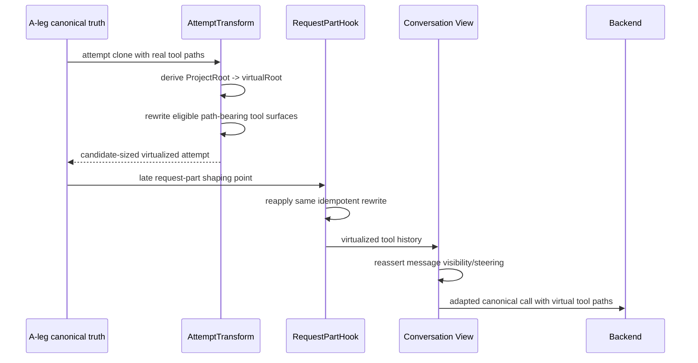
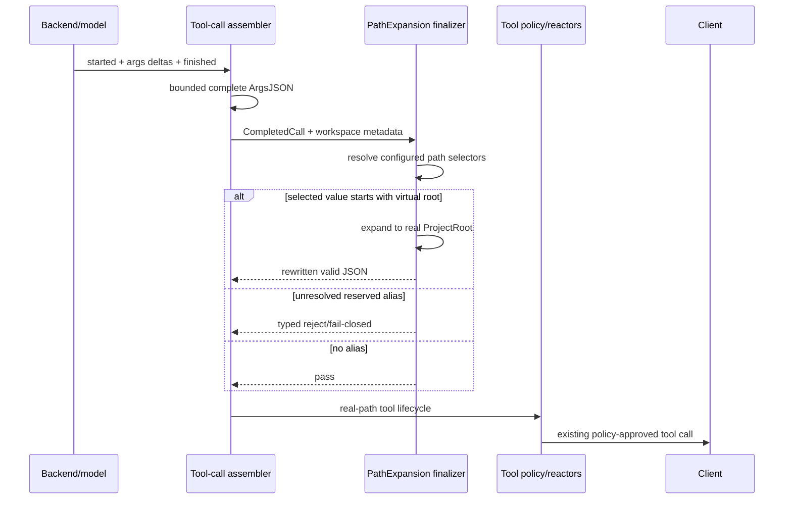

# Design Document

## Overview

B-Leg Path Virtualization is an opt-in feature that gives inference backends a shorter virtual filesystem namespace while preserving the real filesystem namespace on the client/A-leg. V1 maps only the authoritative `Workspace.ProjectRoot` to one deterministic OS-shaped alias. The mapping is pure and reconstructable; it does not require a durable path dictionary.

The feature deliberately operates on canonical **path-bearing tool surfaces**, not on arbitrary strings. Backend-bound historical tool calls/results are virtualized through feature-owned request shaping. Model-emitted path-bearing tool arguments are expanded from the virtual root back to the real workspace root only after complete JSON reconstruction and before existing tool policy/reactor processing and client release.

The current extension platform is reused wherever possible. Two small generic platform enhancements are required: completed-tool-call finalizers need read-only workspace/session/scope metadata, and the assembler needs a mandatory completeness/buffering contract so a required finalizer cannot be silently bypassed by the current shared 64 KiB overflow behavior.

### Goals
- Reduce backend-visible repeated absolute-path bytes/tokens without changing client filesystem truth.
- Work for POSIX and Windows path families regardless of proxy host OS.
- Preserve protocol neutrality and streaming-first architecture.
- Prevent path alias leakage into executable client tool arguments.
- Avoid semantic corruption of file/source/patch contents.
- Make value measurable before rewrite rollout.

### Non-Goals
- General prompt/tool-output compression.
- Dynamic discovery of arbitrary repeated prefixes.
- A durable general-purpose alias dictionary.
- Relative path conversion.
- Filesystem `realpath`, symlink, mount, or existence checks.
- URI/URL rewriting.
- Rewriting ordinary user messages, reasoning, or assistant prose in V1.
- Provider-specific or frontend-specific implementations.

## Boundary Commitments

### This Spec Owns
- Path flavor parsing and reversible root-prefix substitution policy.
- Deterministic V1 virtual-root derivation.
- Path-bearing tool selector/profile policy.
- Feature configuration, audit/rewrite mode, metrics, diagnostics.
- Backend-bound canonical virtualization on tool-call/result surfaces.
- Model→client completed-tool-call expansion.
- Narrow generic SDK/runtime support required for safe finalization.

### Out of Boundary
- Route planning/failover policy.
- B2BUA identity allocation and commitment rules.
- Provider adapters and wire formats.
- Conversation-view message visibility policy.
- Billing/rating semantics.
- Secure-session authority.
- Filesystem access/sandboxing itself.
- Dynamic multi-root persistence.
- Textual alias cleanup in ordinary assistant output.

### Allowed Dependencies
- `pkg/lipapi` canonical calls/items/messages/tool definitions.
- `pkg/lipsdk/workspace`, `session`, `scope`.
- existing request attempt-transform and request-part-hook planes.
- existing tool-call finalizer plane/assembler after narrow generic enhancement.
- standard feature configuration/registration/composition.
- bounded metrics/diagnostic infrastructure.

### Revalidation Triggers
- `toolcall.Finalizer` or assembler lifecycle changes.
- ordering of attempt transforms, request-part hooks, conversation-view reassertion, PTB capture, or `Backend.Open`.
- canonical representation of tool results or tool arguments.
- `WorkspaceView` semantics.
- provider-side continuation/materialization changes.
- token-accounting backend-ingress checkpoint ordering.

## Architecture

### Existing Architecture Analysis

Current `main` is a streaming-first canonical proxy. Frontends decode to `lipapi.Call`; candidate attempts are cloned/shaped; backends consume canonical calls; response events pass through the shared stream pipeline before frontend encoding.

Relevant existing seams:
- `request.AttemptTransform`: candidate-aware request mutation with workspace/session/scope and `request.Services`.
- `hooks.RequestPartHook`: late canonical request mutation with A-leg/B-leg/attempt/backend metadata.
- `toolcall.Finalizer`: complete JSON tool-call mutation after stream assembly.
- `ToolReactor`: downstream policy reaction after tool-event enrichment/finalization.
- `WorkspaceView.ProjectRoot`: current authoritative feature-facing workspace path.

Important ordering:
1. baseline clone/interleaved shaping;
2. candidate attempt transforms;
3. candidate admission and preliminary eligibility/preflight;
4. request-part hooks;
5. post-hook rederivation;
6. conversation-view final reassertion;
7. clamps/backend-ingress accounting/final authorization;
8. candidate adaptation;
9. PTB capture;
10. `Backend.Open`;
11. response tool-call assembly/finalization;
12. tool policy/reactors;
13. response-part hooks;
14. client release.

The design therefore uses an early attempt transform for sizing benefit and an idempotent request-part pass to preserve final B-leg tool-surface virtualization.

### Architecture Pattern & Boundary Map

```mermaid
flowchart LR
    C[Client / A-leg real paths]
    FE[Frontend adapter]
    CAN[Canonical A-leg call]
    AT[PathVirtualizer AttemptTransform]
    RP[PathVirtualizer RequestPartHook]
    CV[Conversation-view reassertion]
    AD[Candidate adaptation]
    BE[Backend / model virtual paths]
    ASM[Tool-call assembler]
    EXP[PathExpansion Finalizer]
    POL[Existing tool policies/reactors]
    OUT[Frontend / Client real paths]

    C --> FE --> CAN --> AT --> RP --> CV --> AD --> BE
    BE --> ASM --> EXP --> POL --> OUT --> C
```



**Architecture Integration**
- **Selected pattern**: optional canonical feature plugin with a pure reversible transformation kernel.
- **Domain/feature boundaries**: feature owns path semantics/config/profiles; core owns only generic stage execution and complete-call assembly.
- **Existing patterns preserved**: canonical translation, typed feature planes, streaming-first response flow, no concrete feature imports in core.
- **New components rationale**: one pure path kernel, one outbound call rewriter shared by two hooks, one completed-call expander, one optional generic buffering contract.
- **Steering compliance**: optional UX/efficiency policy stays in a feature; provider adapters remain untouched.

**Optional Hexagonal Lens**
- **Domain policy**: path flavor detection, root/alias derivation, boundary-aware prefix replacement, selector resolution.
- **App orchestration**: outbound request pass and inbound completed-call expansion.
- **Driving adapters**: standard feature config decode.
- **Driven adapters**: bounded metrics/diagnostics only.
- **Composition root**: standard feature registration; generic featurehost only if metrics/process state truly require it.
- **Ports/query seams**: existing request and toolcall SDK contracts.

**Project Boundary Questions**
- **Core-owned or plugin-owned?** Plugin-owned. Only generic finalizer metadata/buffering support belongs in SDK/runtime.
- **New canonical concept?** No. Paths remain strings inside existing tool semantics.
- **Streaming-first preserved?** Yes. Complete-call buffering is already part of the stream path.
- **Provider SDK leakage avoided?** Yes.
- **No retry/failover after output preserved?** Yes; feature does not own recovery.
- **Secure-session/startup posture affected?** No authority change; revalidate ordering only.
- **Extension platform seam used or extended?** Existing planes used; generic tool-finalizer metadata/completeness contract widened.

### Technology Stack

| Layer | Choice | Role in Feature | Notes |
|---|---|---|---|
| Canonical API | `pkg/lipapi` | Tool call/result traversal and schema access | No new path type |
| Feature SDK | existing request/hooks/toolcall/workspace contracts | Extension seams | Additive toolcall metadata + optional buffering contract |
| Feature | `internal/plugins/features/pathvirtualization` | Policy/config/rewrites | No provider SDK |
| Runtime | existing candidate/open and response assembler | Ordering and completed-call execution | No feature-specific branch |
| Observability | existing bounded metrics/inventory conventions | Savings/failure evidence | No raw paths |

## File Structure Plan

### Directory Structure

```text
internal/plugins/features/pathvirtualization/
├── config.go                 # typed feature config and validation
├── bundle.go                 # contributes attempt transform, request-part hook, finalizer
├── paths.go                  # host-independent path flavor parser + alias derivation
├── selectors.go              # JSON Pointer/profile/schema-assisted selector resolution
├── rewrite.go                # pure canonical outbound rewrite
├── finalizer.go              # completed model tool-call reverse expansion
├── metrics.go                # narrow feature observer contract/helpers if needed
├── *_test.go                 # table/property/fuzz tests
└── testdata/                 # bounded canonical fixtures only if needed
```

### Modified Files
- `pkg/lipsdk/toolcall/finalizer.go` — enrich `Meta` with read-only scope/session/workspace views; define optional buffering/completeness capability without breaking existing finalizers.
- `internal/core/runtime/tool_call_assembler.go` — honor optional mandatory completeness/buffering requirements; preserve current behavior for finalizers that do not opt in.
- `internal/core/runtime/response_pipeline_observations.go` and/or request-facts plumbing — populate the enriched finalizer metadata from authoritative request views.
- `pkg/lipsdk/feature/plane_manifest.go` only if a new generic scalar/plane is proven necessary; prefer an optional finalizer capability to avoid plane proliferation.
- `internal/standardplugins/features_install.go` / standard feature table/config wiring — register the new feature by existing conventions.
- relevant generated/parity files only when required by the existing feature-plane generator/registry.
- docs/config examples only after feature behavior is stable; no steering update unless architecture rules change.

## System Flows

### Backend-bound request



### Model-emitted tool call



## Requirements Traceability

| Requirement | Summary | Components | Interfaces / Flows |
|---|---|---|---|
| 1 | cross-platform deterministic namespace | `paths.go` | pure parser/alias rules |
| 2 | B-leg-only tool virtualization | `rewrite.go` | AttemptTransform + RequestPartHook |
| 3 | safe path-bearing selection | `selectors.go`, config | ToolDef schema + JSON Pointer profiles |
| 4 | mandatory reverse expansion | `finalizer.go`, assembler enhancement | `toolcall.Finalizer` |
| 5 | runtime/security ordering | runtime tests + shared hooks | candidate/open + response pipeline |
| 6 | continuity/restart | deterministic mapping | WorkspaceView |
| 7 | config/audit/observability | config/bundle/metrics | standard feature registration |
| 8 | compatibility/failure | feature + assembler tests | repair/finalizer composition |
| 9 | performance | pure kernel + benchmarks | audit counters/benchmarks |

## Components and Interfaces

### Feature Domain

#### Path Mapper

| Field | Detail |
|---|---|
| Intent | Derive and apply a reversible root alias independent of host OS |
| Requirements | 1.1–1.9, 6.1–6.6, 9.1–9.4 |

**Responsibilities & Constraints**
- Pure; no filesystem access.
- Accepts `Workspace.ProjectRoot` plus validated config.
- Returns `Mapping{Flavor, RealRoot, VirtualRoot}` or a bounded skip reason.
- Prefix replacement is segment-boundary-aware.
- `VirtualizePath` and `ExpandPath` are inverse for eligible paths.
- No path cleanup that changes suffix semantics.

Conceptual API:

```go
type PathFlavor uint8

const (
    FlavorUnsupported PathFlavor = iota
    FlavorPOSIX
    FlavorWindowsDrive
    FlavorWindowsUNC
    FlavorWindowsExtendedDrive
    FlavorWindowsExtendedUNC
)

type Mapping struct {
    Flavor      PathFlavor
    RealRoot    string
    VirtualRoot string
}

func DeriveMapping(projectRoot string, cfg AliasConfig) (Mapping, SkipReason)
func (m Mapping) VirtualizePath(s string) (string, bool)
func (m Mapping) ExpandPath(s string) (string, ExpandResult)
```

**Windows rules**
- recognize drive absolute `^[A-Za-z]:[\\/].*`;
- recognize UNC `\\server\share\...`;
- recognize extended drive `\\?\C:\...`;
- recognize extended UNC `\\?\UNC\server\share\...`;
- reject device namespaces such as `\\.\...`;
- compare root case-insensitively;
- treat `\` and `/` as separators for matching;
- preserve real-root spelling when expanding.

**POSIX rules**
- leading `/`;
- case-sensitive;
- `/` separator only;
- preserve repeated/special suffix bytes except the replaced prefix.

**Reserved aliases**
- POSIX default: `/.__lip_v1__/0/`
- Windows drive default: `<original-drive>:\.__lip_v1__\0\`
- Windows UNC/extended default model alias: `\\.__lip_v1__\0\`
- aliases are backend-only tokens; expansion reconstructs the original root form.
- config may override only the marker segment, not inject separators/control characters.
- if the alias is not shorter than `RealRoot`, mapping is inactive.

#### Selector Resolver

| Field | Detail |
|---|---|
| Intent | Identify only fields that semantically represent filesystem paths |
| Requirements | 2.1–2.6, 3.1–3.8, 4.8–4.9 |

Conceptual types:

```go
type ToolProfile struct {
    Names              []string
    ArgPointers        []string
    ResultJSONPointers []string
    OpaqueResultMode   OpaqueResultMode
}

type ResolvedSelectors struct {
    ArgPointers        []Pointer
    ResultJSONPointers []Pointer
    OpaqueResultMode   OpaqueResultMode
}
```

Resolution order:
1. exact operator profile for tool name;
2. exact built-in profile;
3. optional schema-assisted top-level/declared-object inference;
4. otherwise no selector.

Schema-assisted path key vocabulary is bounded/configurable but defaults to conservative names such as:
`path`, `file_path`, `filepath`, `directory`, `dir`, `cwd`, `workdir`, `root`, `target_path`, `paths`.

Denylisted payload concepts include:
`content`, `contents`, `patch`, `diff`, `script`, `command`, `cmd`, `query`, `expression`, `replacement`, `body`, `data`, `text`.

Inference rules:
- inspect schema structure, not descriptions alone;
- accept string or array-of-string leaves;
- do not infer through `additionalProperties`;
- cap depth/count;
- duplicate pointers canonicalize and deduplicate;
- invalid pointers fail config compilation for explicit profiles and become skip reasons for inferred candidates.

#### Canonical Outbound Rewriter

| Field | Detail |
|---|---|
| Intent | Virtualize eligible historical tool surfaces in a `lipapi.Call` |
| Requirements | 2, 3, 5.2–5.8, 7.3, 8.1–8.2 |

One pure implementation is shared by:
- `request.AttemptTransform`: early pass;
- `hooks.RequestPartHook`: late idempotent pass.

The rewriter must support both canonical authorities:
- item-authoritative `ItemKindToolCall` / `ItemKindToolResult`;
- legacy message parts `PartJSON` tool calls / `PartToolResult`.

For tool-call arguments:
- parse valid JSON;
- mutate selected string/string-array values only;
- preserve unrelated values;
- marshal deterministic valid JSON; exact byte preservation of the full JSON is not required after a selected path mutation, but no semantic non-selected field may change.

For tool results:
- structured JSON parts may use configured selectors;
- opaque `Output`, `PartToolResult`, or text result data is unchanged unless a profile explicitly enables a bounded path-oriented mode;
- V1 built-ins should prefer **no opaque result rewrite** unless a tool contract is clearly path-list-only.

The rewriter returns stats:
`eligible`, `rewritten`, `bytesBefore`, `bytesAfter`, `skipsByReason`.
No raw path values escape this component.

### SDK / Runtime Platform

#### Enriched Finalizer Metadata

Additive fields to `toolcall.Meta`:

```go
type Meta struct {
    TraceID    string
    ALegID     string
    BLegID     string
    AttemptSeq int

    Scope     scope.PrincipalScopeView
    Session   session.SessionView
    Workspace workspace.WorkspaceView
}
```

Existing finalizers remain source compatible.

Runtime populates these values from the same authoritative request views already projected into tool-reactor metadata. No client-supplied raw metadata becomes authority.

#### Optional Mandatory Buffering Contract

Do not add required methods to `toolcall.Finalizer`. Add an optional capability implemented only by finalizers that need stronger assembly guarantees.

Conceptual contract:

```go
type BufferingRequirement interface {
    ToolCallBufferingRequirement() BufferingSpec
}

type BufferingSpec struct {
    MaxArgsBytes int
    Overflow     OverflowPolicy
}

type OverflowPolicy string

const (
    OverflowPassThrough OverflowPolicy = "pass_through"
    OverflowReject      OverflowPolicy = "reject"
)
```

Semantics:
- existing finalizers without this interface retain current behavior;
- current `PlaneToolCallFinalizationMaxArgsBytes` continues to preserve legacy/default behavior for ordinary finalizers;
- assembler determines an **effective assembly bound** sufficient for mandatory finalizers, capped at `lipapi.MaxEventDeltaBytes`;
- path expansion uses `OverflowReject`;
- path expansion default requested bound: 1 MiB; configurable `[64 KiB, MaxEventDeltaBytes]`;
- if the applicable call exceeds its mandatory bound, emit a typed tool-call rejection before client release;
- do not globally raise tool-call-repair's own repair budget; repair may choose to pass on large calls while expansion still runs;
- if implementation proves the existing scalar plane cannot express this without semantic coupling, introduce the smallest new generic SDK contract/plane and update generated plane metadata. Do not special-case `pathvirtualization` in core.

This task must begin with characterization tests because it changes subtle stream buffering behavior.

#### Path Expansion Finalizer

| Field | Detail |
|---|---|
| Intent | Convert virtual path-bearing model arguments back to real paths before tool policy/client execution |
| Requirements | 4, 5.1, 8.3–8.5 |

Algorithm:
1. derive mapping from `meta.Workspace.ProjectRoot`;
2. resolve selectors using exact tool name + current tool schema;
3. if no active mapping/selectors: pass;
4. parse completed ArgsJSON;
5. visit selected leaves only;
6. if selected path begins `VirtualRoot`, expand;
7. if selected path begins reserved marker but cannot map: reject with bounded reason;
8. validate JSON and return rewrite/pass;
9. assembler synthesizes canonical lifecycle;
10. existing tool policies/reactors receive real paths.

The finalizer does not execute filesystem access and does not inspect source/content fields.

### Configuration / Composition

Proposed feature node:

```yaml
plugins:
  features:
    path_virtualization:
      enabled: true
      mode: audit # audit | rewrite
      alias_marker: ".__lip_v1__"
      schema_inference: true
      mandatory_max_args_bytes: 1048576
      path_keys:
        - path
        - file_path
        - filepath
        - directory
        - dir
        - cwd
        - workdir
        - root
        - target_path
        - paths
      tool_profiles:
        - names: ["custom_read"]
          arg_json_pointers: ["/path"]
          result_json_pointers: []
          opaque_result_mode: "none"
```

Validation:
- feature disabled by default;
- mode enum strict;
- marker must be one bounded path segment, no slash/backslash, no `.`/`..`, no control characters, length <= 64;
- `mandatory_max_args_bytes` bounded;
- tool names exact/non-empty;
- JSON Pointers parse at generation compile;
- duplicate exact tool profile definitions rejected;
- profile counts/pointers/path-key counts bounded;
- no arbitrary regexes in V1.

### Observability

Metrics names should follow repository conventions; exact names may be adjusted during implementation but dimensions are fixed:
- mode: audit/rewrite;
- direction: virtualize/expand;
- outcome: eligible/rewritten/skipped/rejected;
- reason: closed bounded enum;
- counters for bytes-before/after/saved;
- mandatory overflow count.

Forbidden labels/data:
- path;
- suffix;
- alias;
- tool call ID;
- A-leg/B-leg IDs;
- hashes of paths;
- command/source text.

## Data Models

No persistent database model is introduced.

### Feature-local value objects
- `PathFlavor`
- `Mapping`
- `SkipReason`
- `ToolProfile`
- parsed `Pointer`
- `RewriteStats`
- `BufferingSpec`

### Consistency & Integrity
- mapping is derived per request/attempt from immutable workspace view;
- mapping allocation has no mutable global/session state in V1;
- retries/failover derive identical values;
- configuration reload changes apply only through new immutable generation snapshots.

## Error Handling

### Error Strategy
- **Outbound detection/rewrite before alias exposure**: fail open to real paths on unexpected internal transformation error, with bounded diagnostic.
- **Config errors**: fail generation compilation.
- **Inbound unresolved reserved alias on selected path field**: fail closed for the tool call.
- **Mandatory buffering overflow**: fail closed for the tool call.
- **Malformed model ArgsJSON**: existing repair/finalizer chain may repair first; if valid completed JSON cannot be obtained, preserve existing tool-call-repair/rejection policy, but never release a recognized virtual alias through an applicable selected path.
- **Unsupported workspace root**: skip/disable mapping, no mutation.

### Ordering with tool-call repair
Preferred order:
1. syntax/tool-shape repair if needed;
2. path expansion on valid completed JSON;
3. existing tool policies/reactors.

The implementation must not rely solely on numeric order if the assembler's fallback semantics could bypass expansion. Characterization tests define the invariant.

## Security Considerations

- Expansion occurs before filesystem safety/policy reacts to the tool call.
- Aliases are not authority and cannot widen workspace access.
- A model can construct paths outside the virtual root; such real/other absolute paths pass to existing policy unchanged.
- A reserved alias that cannot be mapped is rejected, not treated as a real client path.
- No raw paths in metrics/logs.
- No filesystem probing to validate roots.
- Schema inference is intentionally conservative to avoid turning content strings into paths.

## Performance & Scalability

- Pure lexical prefix matching, no filesystem calls.
- No regex required on hot rewrite paths; flavor detection may use bounded byte tests.
- Selector traversal bounded by config/schema/canonical limits.
- Outbound rewrite runs twice but is idempotent; second pass should fast-skip already virtual roots.
- Mandatory completed-call buffering is the largest new memory risk. Default 1 MiB per active applicable call; upper bound is canonical event limit. Concurrency tests/benchmarks must quantify this before changing defaults.
- Audit mode establishes real savings distribution before production rewrite rollout.

## Testing Strategy

### Unit Tests
- path flavor table: POSIX, drive, slash-on-Windows, UNC, extended drive/UNC, device path reject, malformed/relative.
- round-trip property: `Expand(Virtualize(realRoot+suffix)) == original`.
- case/separator boundary behavior.
- alias-shorter gate and collision detection.
- JSON Pointer path-only mutation and denylist behavior.
- idempotent repeated outbound rewrite.

### Fuzz Tests
- path parser never panics and never expands an unmatched reserved alias.
- JSON selector mutator preserves valid JSON or returns a typed error.
- round-trip mapping for bounded arbitrary suffixes.
- no replacement when prefix match lacks a segment boundary.

### Runtime/Integration Tests
- attempt transform makes preliminary context/preflight observe reduced call.
- request-part reapplication survives final conversation-view reassertion.
- PTB/backend receives virtualized tool history.
- completed model call is expanded before tool policy observes it.
- unresolved alias and mandatory overflow never reach client.
- tool-call repair + path expansion order on malformed then repaired JSON.
- retry/failover/race derive same alias.
- non-streaming collects the same expanded stream behavior.

### Protocol/Family Tests
- representative legacy chat tool-call/result round trip.
- representative item-authoritative/OpenResponses round trip.
- one Anthropic- or Gemini-family sentinel if needed to prove canonical adapter neutrality.
- avoid Cartesian frontend×backend matrix.

### Performance
- benchmarks for mapping/prefix operations.
- 10/100/1000 path-bearing occurrences.
- long Windows worktree fixture.
- long POSIX monorepo/worktree fixture.
- 64 KiB boundary regression and mandatory >64 KiB expansion.
- 1 MiB configured mandatory bound.
- run `make test-cost` only if test infrastructure cost materially changes.

## Design Validation

### Brownfield validation result: GO

Checks performed:
- feature remains plugin-owned;
- no provider/frontend branching required;
- no new canonical path type required;
- request ordering accounts for post-attempt-transform stages;
- conversation-view reassertion is explicitly tested;
- reverse expansion occurs before tool policy/client release;
- 64 KiB finalizer bypass is explicitly repaired;
- restart semantics do not rely on process-memory mapping state;
- source/content corruption risk is mitigated by selectors and opaque-result default-off;
- no B2BUA/retry/commitment ownership is duplicated.

### Significant repaired defects
1. Rejected global opaque-output replacement.
2. Rejected dynamic session dictionary for V1.
3. Added late idempotent outbound pass.
4. Added workspace metadata to complete finalization.
5. Added mandatory buffering/fail-closed semantics.
6. Narrowed transparency claim to tool surfaces.

## Supporting References
See `research.md` for the inspected repository files and gap-analysis record.
